# Redhat红帽 RHCE8.0认证体系课程 - P34：25_Video_Day04_Ch14a_软件包管理1_RPM及DNF

## 📦 概述
在本节课中，我们将要学习红帽Linux系统中的软件包管理。主要内容包括RPM软件包的基础知识、如何获取软件包、使用`rpm`命令进行基本管理，以及如何使用更强大的`dnf`工具（或`yum`）来管理软件仓库和解决软件依赖关系。掌握这些知识是进行系统管理和通过RHCE认证的基础。

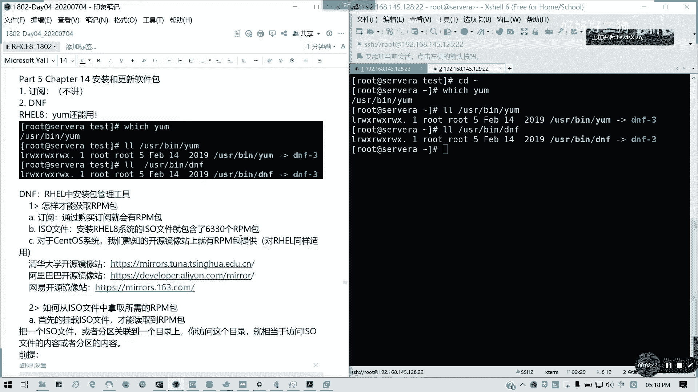

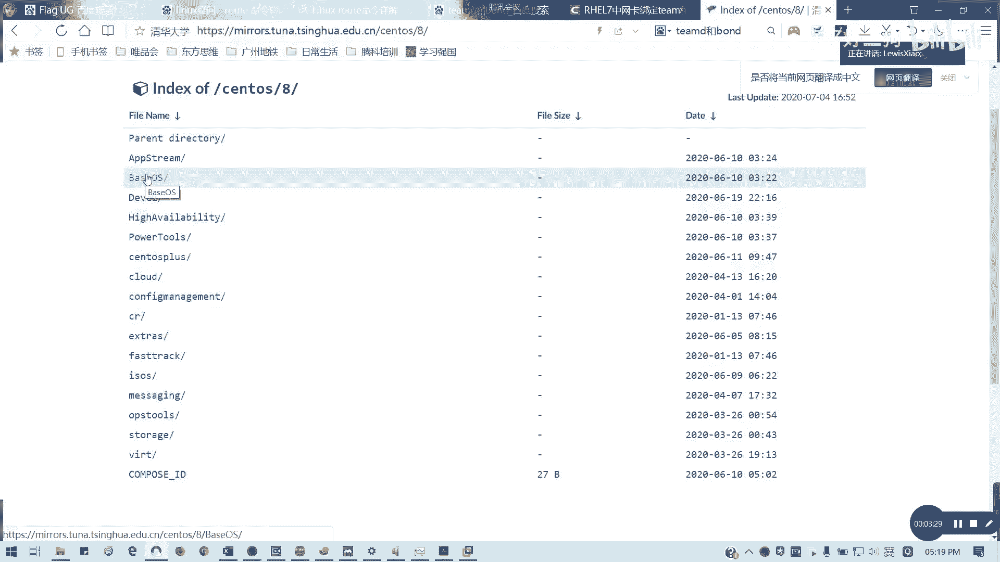

---

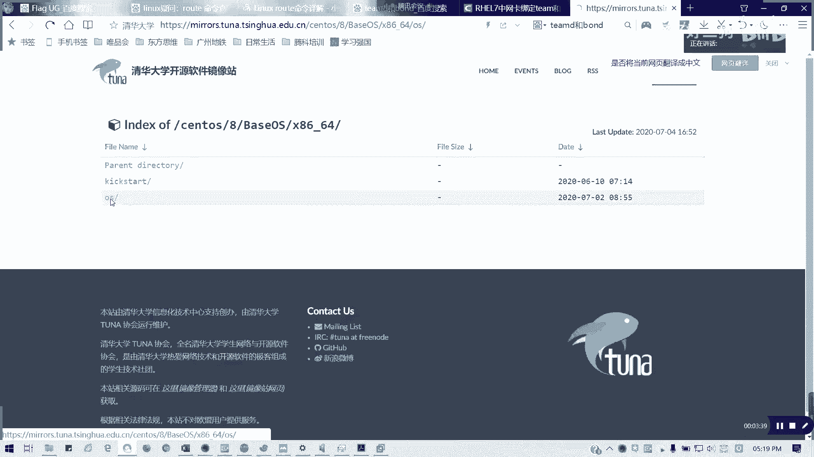

## 📁 软件包的获取方式
要安装软件，首先需要获取软件包。在红帽体系中，有多种方式可以获取RPM软件包。

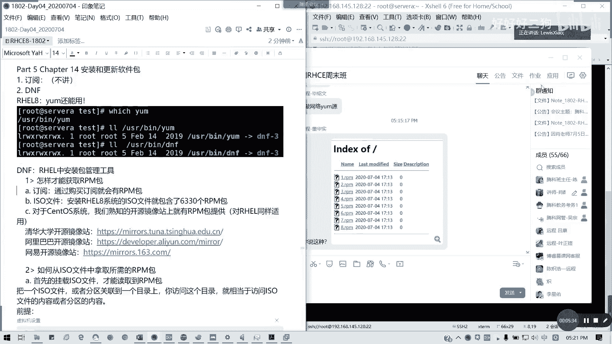

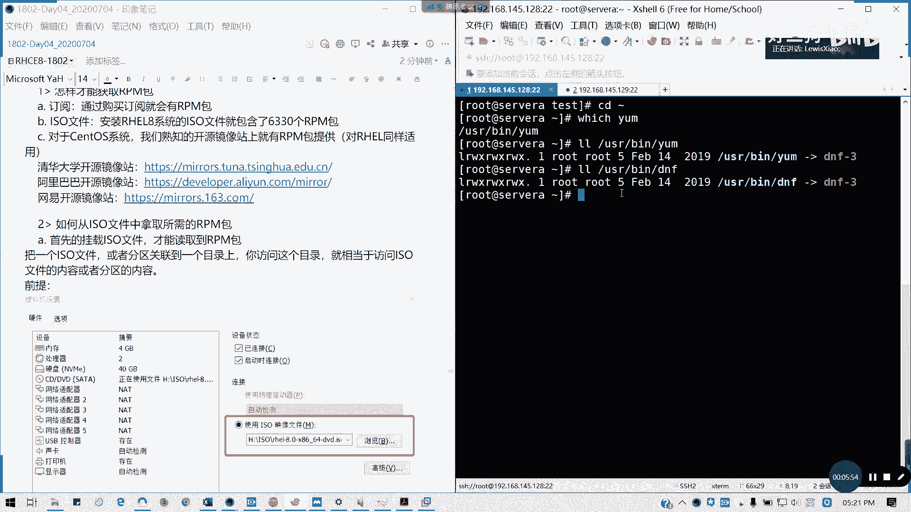

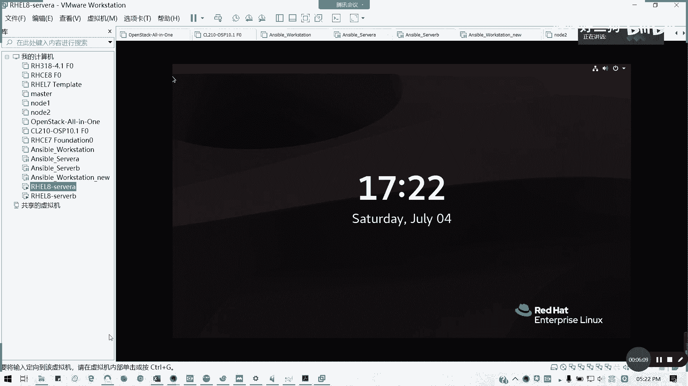

以下是几种常见的获取方式：
1.  **购买订阅**：通过官方红帽订阅服务获取，这是付费方式。
2.  **安装光盘/ISO镜像**：红帽的安装介质本身就包含了大量软件包。例如，RHEL 8的光盘镜像中，软件包被分类存放在 `BaseOS` 和 `AppStream` 目录下。
3.  **开源镜像站**：对于社区版系统（如CentOS）或学习环境，可以从免费的开源镜像站获取软件包。国内常用的镜像站包括：
    *   清华大学开源镜像站
    *   阿里云开源镜像站
    *   网易开源镜像站

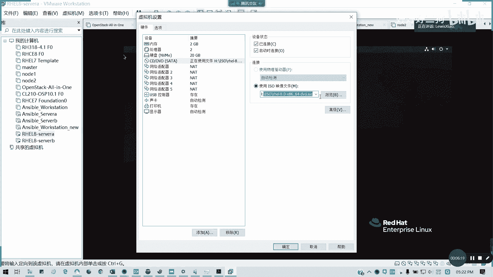

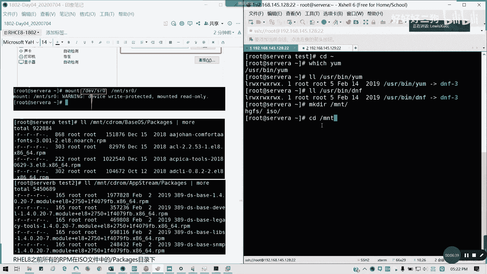

这些镜像站通常提供软件包（`Packages/`目录）和解决依赖关系所必需的元数据（`repodata/`目录）。

---

## 🔧 RPM软件包基础
上一节我们介绍了如何获取软件包，本节中我们来看看RPM软件包本身。RPM是红帽包管理器（Red Hat Package Manager）的缩写，它是一种用于软件安装、升级、卸载和查询的打包格式。

一个RPM包的文件名通常包含丰富的信息，其格式如下：
```
软件包名-版本号-发行版本.系统架构.rpm
```
例如：`httpd-2.4.37-30.module+el8.3.0+7001+0766b9e7.x86_64.rpm`
*   `httpd`：软件包名称。
*   `2.4.37-30`：软件的版本号。
*   `module+el8.3.0+7001+0766b9e7`：发行版本号，包含针对特定红帽企业版Linux（RHEL）的修订信息。
*   `x86_64`：软件适用的系统架构。
*   `.rpm`：文件扩展名，表明这是一个RPM软件包。

---

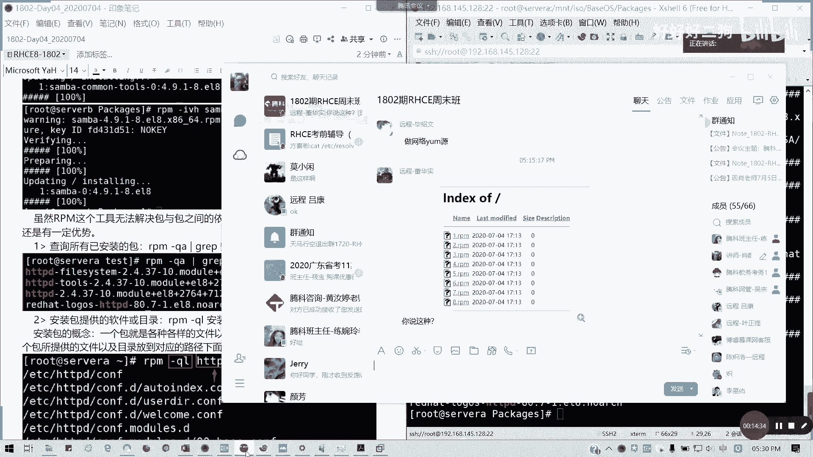

## ⚙️ 使用 rpm 命令管理软件包
`rpm` 命令是直接操作RPM包的工具，功能强大，但在处理复杂的依赖关系时较为繁琐。

以下是 `rpm` 命令的常见用法：

### 安装与升级软件包
*   **安装**：`rpm -ivh 软件包名.rpm`
    *   `-i`：安装。
    *   `-v`：显示详细信息。
    *   `-h`：显示进度条。
*   **升级**：`rpm -Uvh 软件包名.rpm`
    *   `-U`：升级或安装。

**注意**：`rpm` 安装时如果遇到缺失的依赖包，会报错并停止安装，需要手动先安装所有依赖包。

### 查询软件包信息
`rpm -q` 系列命令用于查询软件包信息。
*   **查询已安装的包**：`rpm -qa | grep 关键字`
*   **查询包安装的文件列表**：`rpm -ql 软件包名`
*   **查询包的配置文件**：`rpm -qc 软件包名`
*   **查询包的文档文件**：`rpm -qd 软件包名`
*   **查询包的详细信息**：`rpm -qi 软件包名`
*   **查询文件由哪个包提供**：`rpm -qf /path/to/file`

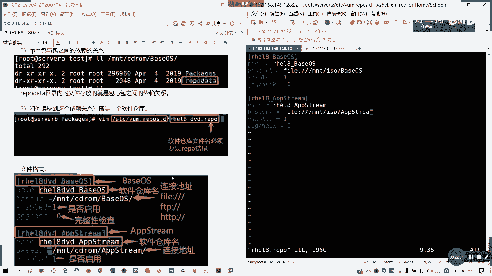

### 卸载软件包
*   **卸载**：`rpm -e 软件包名`
    *   `-e`：擦除（卸载）。
    *   **注意**：此命令只卸载指定的包，不会自动移除其依赖包。如果其他包依赖它，卸载可能会失败。

---

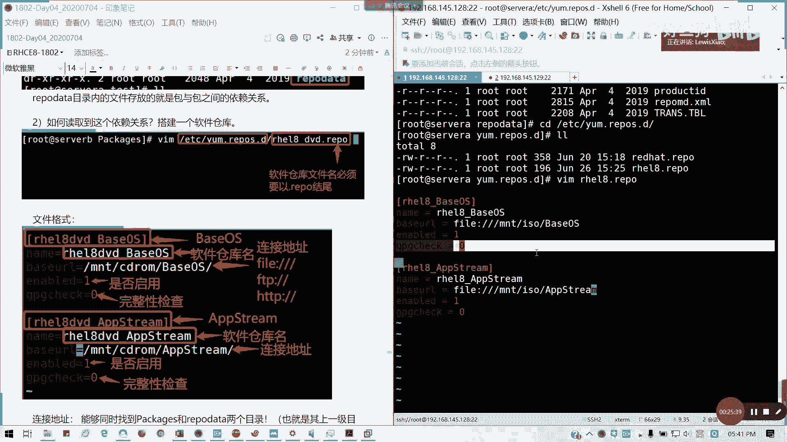

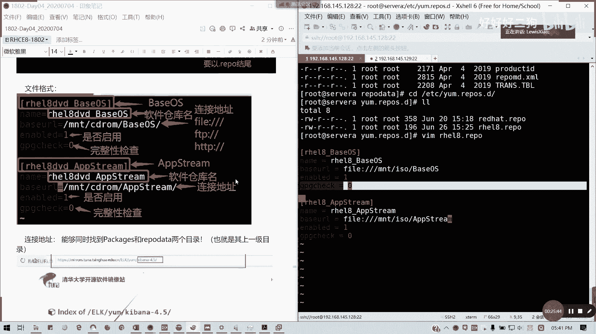

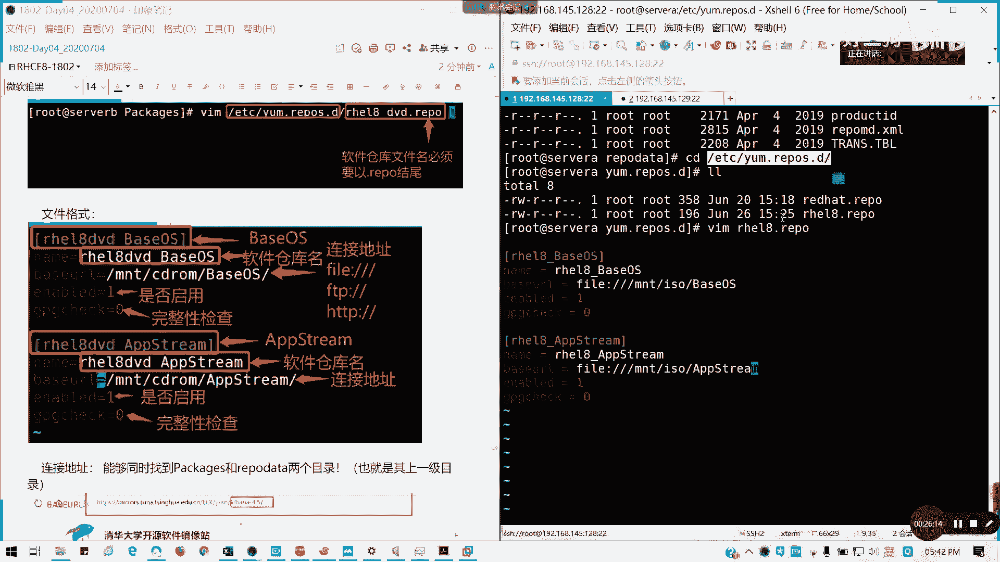

## 🚀 使用 DNF/YUM 管理软件仓库
由于 `rpm` 无法自动解决依赖关系，红帽系统提供了更高级的工具：`dnf`（在RHEL 8中，`yum` 是 `dnf` 的软链接）。`dnf` 能够从配置好的软件仓库中自动下载软件包并解决所有依赖。

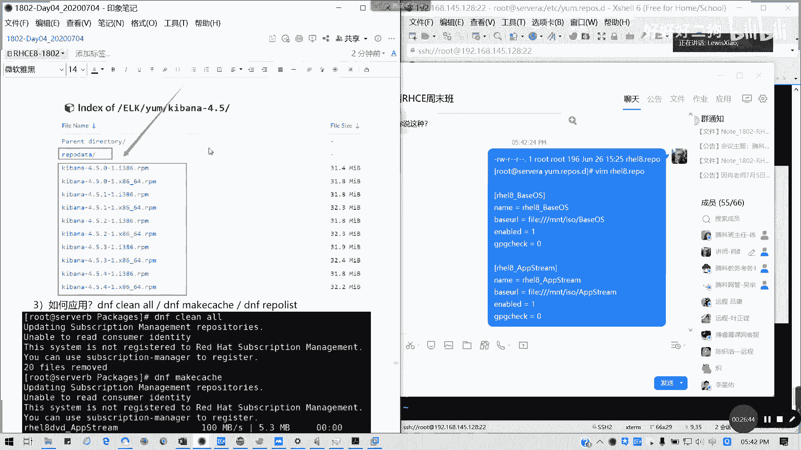

### 配置本地软件仓库
要让 `dnf` 工作，首先需要配置软件仓库（Repository）。仓库配置文件位于 `/etc/yum.repos.d/` 目录下，以 `.repo` 结尾。

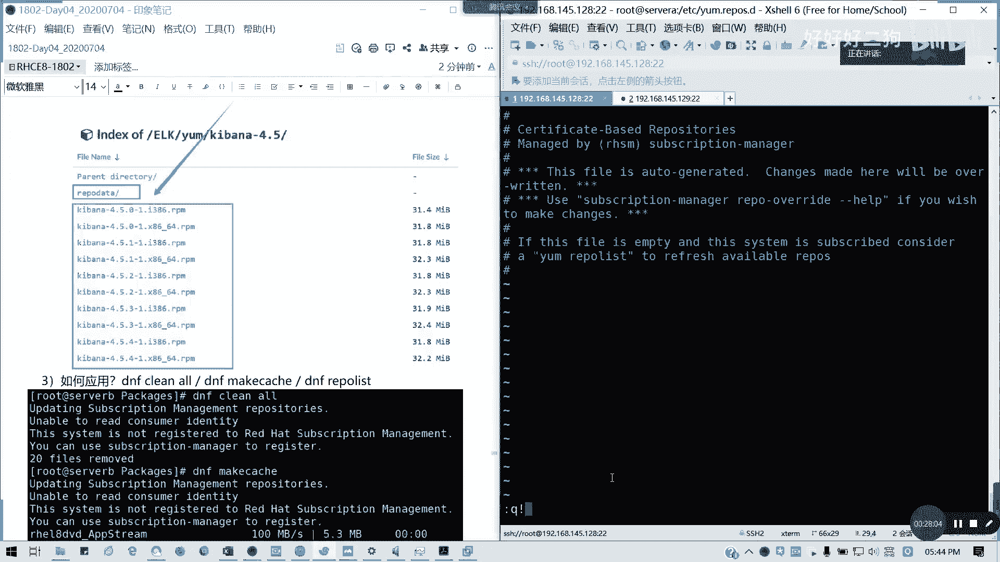

以下是一个配置本地光盘作为软件仓库的示例文件（例如 `/etc/yum.repos.d/local.repo`）：
```ini
[Local-BaseOS]
name=Local BaseOS Repository
baseurl=file:///mnt/BaseOS
enabled=1
gpgcheck=0

[Local-AppStream]
name=Local AppStream Repository
baseurl=file:///mnt/AppStream
enabled=1
gpgcheck=0
```
*   `[Local-BaseOS]`：仓库配置块的唯一ID。
*   `name`：仓库的可读描述。
*   `baseurl`：仓库的实际地址。`file://` 表示本地文件协议，后面是挂载了ISO镜像的目录路径（需包含 `Packages` 和 `repodata` 的父目录）。
*   `enabled=1`：启用此仓库。
*   `gpgcheck=0`：不进行GPG签名检查（对于本地或可信源可以关闭）。

配置完成后，需要让 `dnf` 重新建立元数据缓存：
```bash
dnf clean all    # 清理旧缓存
dnf makecache    # 建立新缓存
```

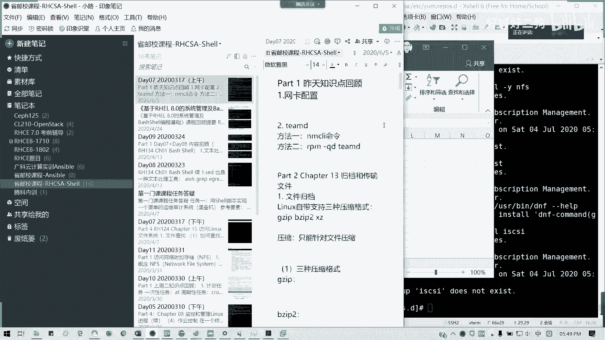

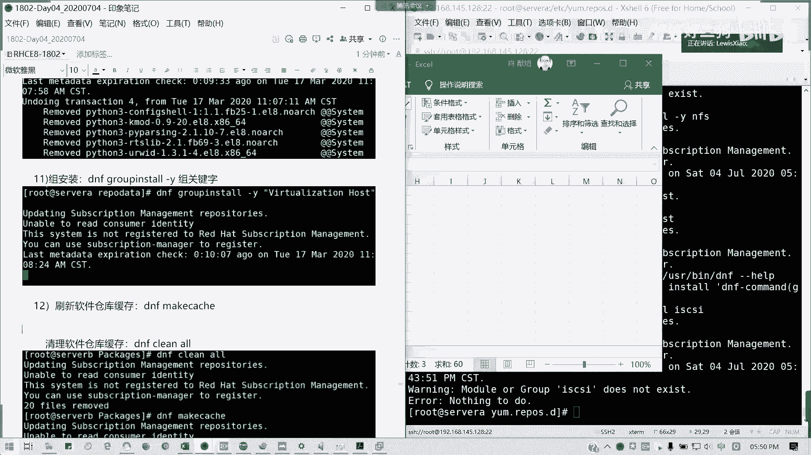

### DNF 常用命令
配置好仓库后，就可以使用 `dnf` 来方便地管理软件了。

以下是 `dnf` 的常用命令：
*   **安装软件**：`dnf install -y 软件包名`
*   **卸载软件**：`dnf remove -y 软件包名` （会自动移除不再需要的依赖）
*   **搜索软件**：`dnf search 关键字`
*   **列出所有可用软件包**：`dnf list available`
*   **查看软件包信息**：`dnf info 软件包名`
*   **查看操作历史**：`dnf history`
*   **撤销历史操作**：`dnf history undo 历史ID -y`
*   **安装软件包组**：`dnf groupinstall -y “组名”`

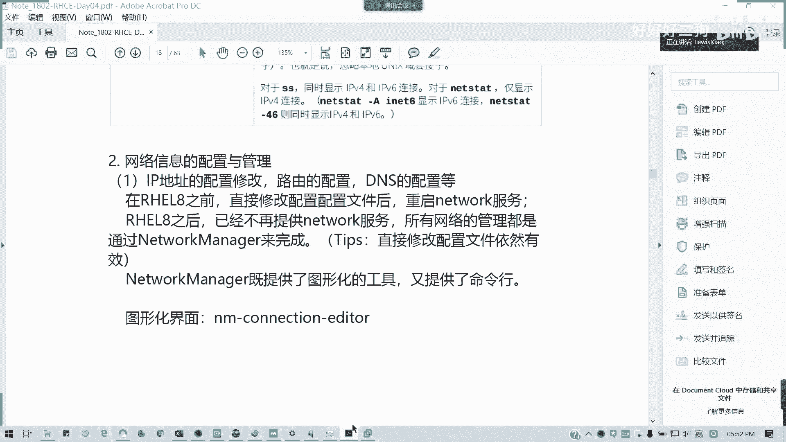

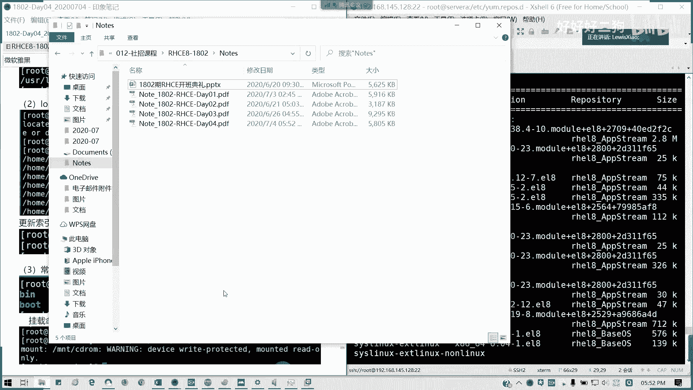

---

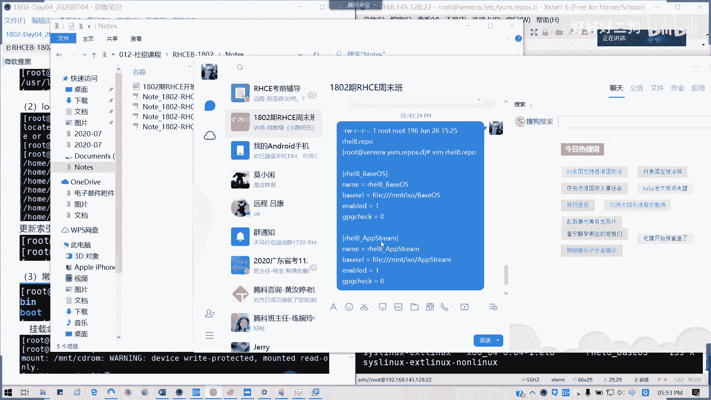

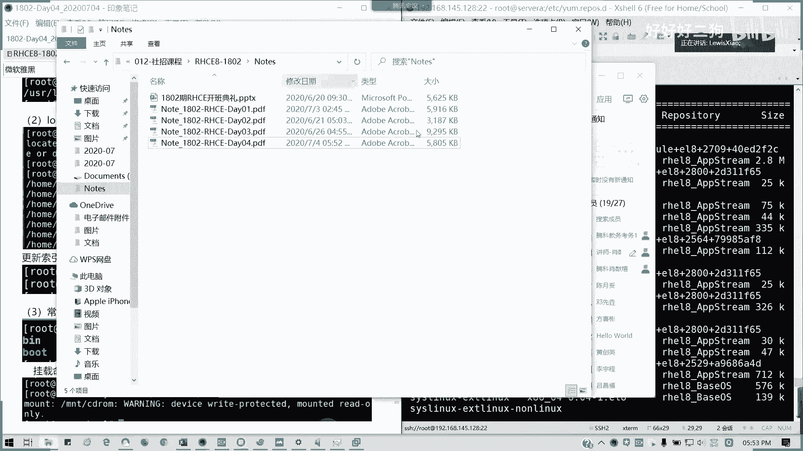

## 📝 总结
本节课中我们一起学习了红帽Linux系统软件包管理的核心知识。我们首先了解了RPM软件包的格式和多种获取途径。然后，我们深入学习了基础的 `rpm` 命令，用于安装、查询和卸载软件包，但其缺点是无法自动处理依赖。最后，我们重点掌握了 `dnf`（或 `yum`）工具的使用，包括如何配置本地或远程软件仓库，以及利用 `dnf` 自动解决依赖关系来高效地安装、删除和管理软件。这些技能是日常系统管理和RHCE认证考核中的重要基础。