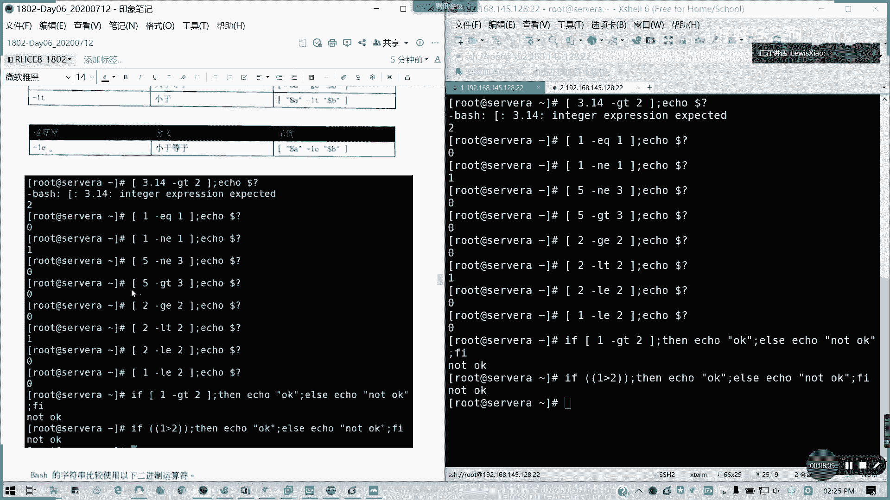
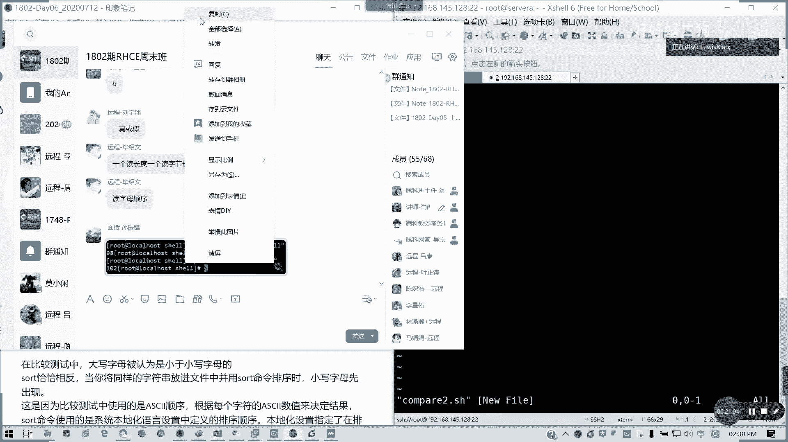
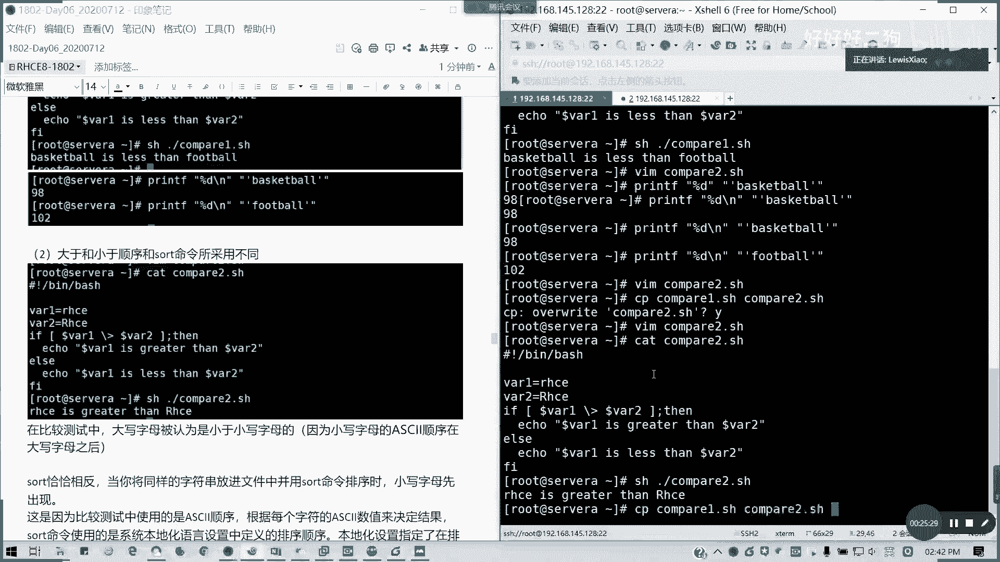
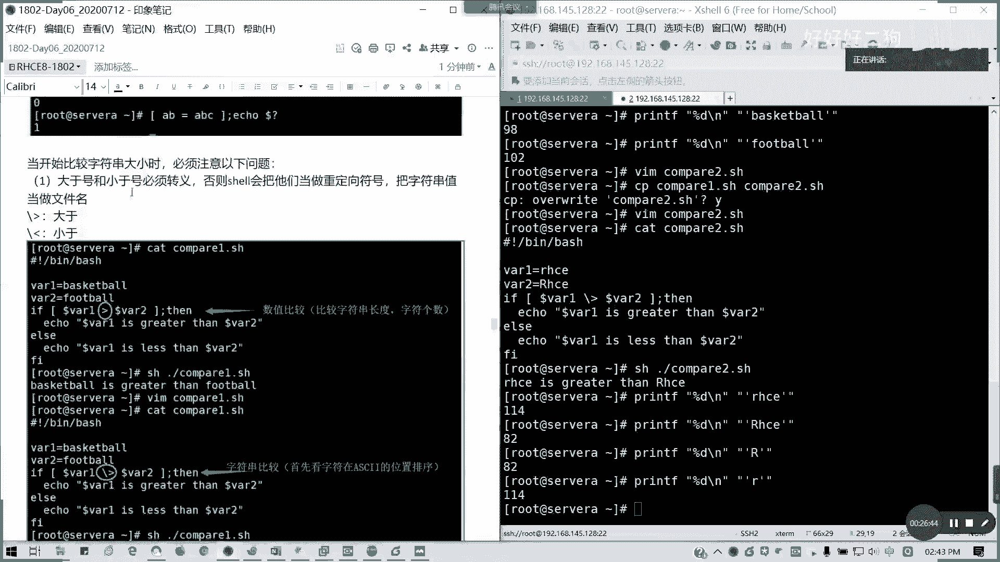
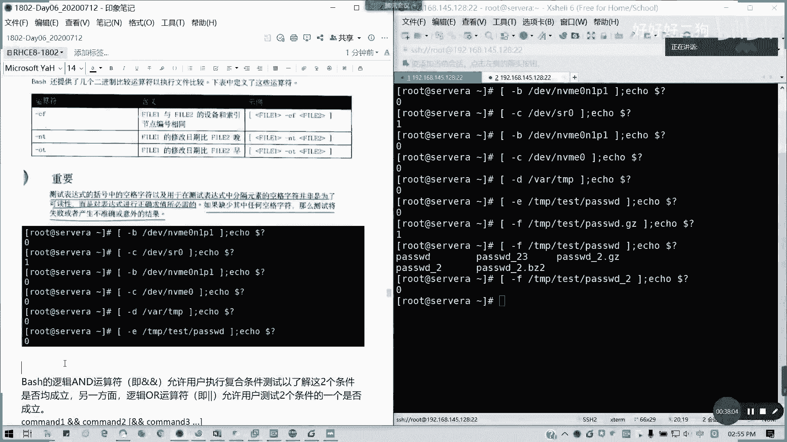
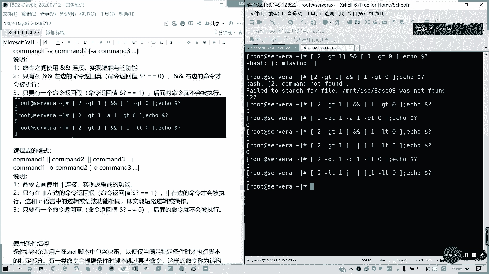

# Redhat红帽 RHCE8.0认证体系课程 - P35：34_Video_Day06_RH134_Ch01_Shell基础05 - 好好好二狗 - BV1M3411k77W

好那我们下午啊阅兵时间14：17啊，北京时间14：17，那我们接下来继续shell的内容，我们上午讲了啊，到讲到退出代码，现在接下来我会讲一下测试脚本输入，可以使我们可以使用fish命令的测试语法。

叫做test expression，就是我们里面有一个叫做测试表达式，测试表达式啊，我们来尝试执行我们完整性检查，跟所有命令一样，test命令呢我们的测试命令也会在，完成啊，完成之后呢。

生成一个退出代码也是存储在我们的dollar，仅多的问号啊，dollar问号上面，多的问号上面呢，如果是返回值为零的话，代表测试成功，非零则代表测试失败，比较测试表达式呢。

我们通常使用二进制的比较运算符，这些运算符呢预期为两个对象，运算符，每次一个呢，并用两个对象进行求值来获得等式或不等式，通常来说，我们best是使用另外一种运算符，来进行字符串和数字比较。

使用以下语法item，那我们的二进制表达式item 2，我们通常看到啊，首先我们的数字比较，数字比较呢仅限于整数啊，我们的整数比较符啊，大家看一看，我们batch啊，我看到我们的投影或者是我们的会议啊。

暂时的数字仅仅限于整数，比较以下二进制比啊，以下二进制运算符，在bs的数字比较里面可以用，像杠1q是等于也就是equals啊，英文的简写，equals等于n1 ，now equals不等于，对不对。

杠n一杠gt greater than大于杠g1 ，greater equals，大于等于是吧，greater等于equals，大于等于lt less than，对不对。

小于小于等于是l e less than equals啊，这个能理解，那我们现在看一下例子啊，看个例子，我们这里清一下屏，我们开始看一下例子，比如说我这里我就不再写脚本。

我通过best shell的运算，我的直接通过命令来比较好不好，为什么说仅限数字呢，比如说我要直接有个浮点数是吧，用浮点数来比较看行不行呢，记住啊，我们这个括号里面的一个比较比较的话。

我们前后前后加空格啊，我们这里养成一个良好习惯，前后加空格，然后我运行两个命令是吧，他这里是要求说那个，他出这个错误啊，错误它返回值返回二了，因为它要求是整数，所以有3。14是不行的，懂吗。

就不能用浮点类型要做整形，那我们现在用这是一个错误的示范，那我们现在开始，比如说我1=1，然后我同样输出一个echo的多的问号对吧，我们每只北极比较有个执行更多的问号状态，它是通过比较值啊。

就是比较沉测试成功的话，它会输出一个零对吧，也就是条件符合对吧，我们前面的条件一等于是不是为正呢，为真的话，它它那个多的问号是不是零啊，对不对，那如果把它改成一不等于一。

它的测试结果就为echo的多的问号，是不是一一不等于这条件为假，对对我们的测试表达式为假，那他的那个dollar问号就是一了，还有的，不等于三，这个是多少呢，零对吧表达式为真，如果把它换成gt呢。

也是零，对不对，然后呢还有，这样呢，也是零对吧，二大于等于二正正确的，然后呢，我不入环换成杠l t，输出一对对，非零，如果是他，零对不对，二小于等于二，这个乘这个为真，对不对，还有一个满足条。

这一小于一小于等于二为真，对不对，然后还有我如果我们用比较复杂一点，我们用判断，对吧，比如说这样子一大于等于二等是吧，这是我们的我们的那个条件判断的写法，这里我就直接可以，其实可以在shell里面。

这里我们可以直接用shell来执行，我们的那个我们的语句都没有问题啊，因为他都是用shell解释器，就把一句学的一堂，输出什么结果，没错的，然后还有呢我们可以我们也可以用那个，我们既可以用方块。

我们用那个表达式，我们也可以用两个括号括起来，两个小括括起来也是可以做算术运算，对不对，所以这里的话也是同理啊，两种用法一一模一样，你可以用杠gt是吧，或者是如果要我们要用数学符号的话。

就是用两个括号括起来。

对以上截图是我们的，数学运算符吗，数学运算吗，上次不是讲了吗，昨天两个括号嘛，等于方括号这样子，一里面表达式两两个小勾括起来，对等于就等于上面的这个，这两有没有发现它上下两个等同的。

所以我截图放在这里，就是一系列例子啊，好接下来我们讲完数字。

讲字符串啊，它既有数字比较。

也有我们的字符串比较。

字符串比较呢我们有三种啊，三个一个是等于，一个是恒等于，一个是不小不等于哈，其实这两个等这个恒等于是绝对的啊，我们通常如果要绝对性比较的话，这两个是恒等于的话，这两个是一模一样的，我们来看一看例子啊。

同样也是我们前面一个表达式，后面一个多的问号，a b c等a b c，零对不对，恒等于的话也是零，没有错，abc的ab呢，那就是输出一，然后还有一个不等于对吧，不等于，那刚才等于这个ab的abc呢。

同样是一，其实通常来说我们习惯来说是写两个等于号，也就恒等于。

我待会再截图啊，写到在线，然后呢我们来看一看，当我们比较，当我们比较这一个啊，比较这个什么呢，比较这个四分大小时候呢，我们要必须注意以下问题，第一个我们的大于号小于号，必须转移。

那么大于号小于号必须转移啊，否则他们会当成一个重定向，懂我意思吧，就不会到那个重定向符号，帮字符值串变成文件名了，因为它是有特殊含义的，不加反斜杠，加反斜杠没有错，就如果是四分大小，如果是大于小于的话。

大于小于号啊，就是变成这样了，这是这是大于，这是小于，对不对，那我们来看一看啊，再看一个例子啊，我们写一个脚本，呼呼呼，compare一点s h，我们来看一看，这脚本我们怎么写呢，我想想啊。

这个脚本要怎么写好，同样我们解析器，然后呢我们通常我们定义两个变量，y一等于basketball，篮球用字符串比较啊，one 2等于football足球好了，我们写一个判断条件，if。

vr dollar，vr 1，大于，这是一个表达式，所以它大于号的话，它是不用写这个的啊，大于v2 等，开口，多了vale is greater，诶我的符号表跑了，is great。

等dollar v2 对吧，然后，else，else我们说什么呢，echo就输出另外一个信息对吧，v r e is less than dollar vr，二，然后呢后面f i结束啊。

这个待会会讲到如何去写判断的，选选这个条件判断，这里我们保存退出，然后这里啊，对吧，我们字数量比较，是b在，f之啊b在f之前了，对不对，所以b到f之前他就是这样子，没错对不对，然后如果我们还有一种啊。

我们把这个compare 1，我们如果字符算比较，如果是这样的话，加一个转移，我们会得到什么结果，这改过的啊，为什么会出现这样的情况呢，当然为什么会我会加，我加了一个转移之后呢，为什么出现这样的情况啊。

你知道为什么会出现这样的情况。

一个读长度，一个读字节的长度，读字母顺序啊，其实读字母顺序才是正确的，因为它这里为什么会这样呢。

为什么图为什么一一个是读那个，一个是读字的长度是没有错的啊，这些数值的长度吗，上面我们是读长度的，下面呢下面为什么会b为小于f呢，这是一个因为是阿斯克码的排序位置，首字母八阿斯克码的排序位置决定的。

f是在b之后，对啊f大，所以的话b会小于就basketball b小于f吗，懂吗，看看这是加起来的吗，谁说加起来的，他这是字符串的比较哦，这个比较的话它上面是比较它的长度啊，就就如果是不加的话。

但是如果加加了之后呢，他上去是相当于是数学运算啊，这个是这个长度比他大，但下面如果字符比较的话，我们加了一个加了之后呢，它会比较这阿斯克码的大小的懂吗，阿斯克码比较大，所以所以说阿斯克码b b f小。

对不对。

所以这个我要截个图，这个是有区别的啊。

所以我这里做个注释，这是数值比较，比较的是我们的字符串长度，也就是字符个数了对吧，然后这里的话是一个字符串比较，主要是区别在这里啊，诶我这里画个圈圈就知道了，所以稍微拖动一下，不然的话那个。

镜头能不能改一下位置啊。

他的话这里会挡到的。

主要他的那个用字符做比较的话，它是有要看两种情况的啊，看这种情况，他阿斯克码其实确实是这么排的，然后呢，还有就是我们的大小大于小于的顺序，跟我们sort命令采用的也不一样啊，大于小于顺序跟sort里面。

就我们顺下来也不一样，我们还还有另外一个例子。

下面我们先不看，我们看一下例子啊，我叫compare，二点s h。

那大家有没有疑问啊，对呀对吧，他的那个数值大小，其实也就是我们孙振甫同学啊补充的一个资料。

他print d是吧，哎这里好像复制不了啊。

截个图才能才能才能用啊。

唉都截图了，我直直接写print print，降低是吧，杠n吧，a football的值。

102，对不对，就比这个地方，看一下啊。

第一个，我问下大家这是比哪的啊，对啊阿斯克码的顺序没有错啊。

它存在位置是在98跟102对吧对啊，比那个字母嘛，但那个日串的比例个字母，然后它比它大不大了吗，就阿斯克码，所以字符串跟那个数值意义上是不太一样的，对吧，所以有时候人家很理解说，为什么我逼别逼。

别在f之前，其实不是这样子的，阿斯克码它有一个固定的存储顺序，然后呢还有一个，还有一个就是一个，我们还有一个例子。

就是一个大于小于文大，那么那个大小写对吧，大小写我们看一看，大小写我们同样写一个剧本，写一个脚本，我们定义成vr 3等于，然后其他的等一下我把因为剧本差不多，脚本差不多，我把他那个脚本复制过来好了。

那我改一下，我这里同样还是vi 1 vi 2。

就知道这样会什么结果吗，我们输出的结果是小写字首字母，小写字母的首字母的还大过他。

我们通常来说啊。

因为也是因为阿斯克码的关系啊，在大写字母之前，所以呢为什么小写会比他大，懂我意思吗，小写是大写的，前面，大写是小一小之后啊，说错了对吧，小写在后面，大写在前面，它的数值其实我们可以用刚才的pd啊。

114，82对不对，一比较就知道了。

对啊你看它是比较首字符的嘛，首字符相差32对，所以的话这个就理解为什么说它的比较会是小。

它它的小写为什么大于的啦，而且它是比较首字符啊，后面他后面不管了。

对吧，我们刚才试了一个首字符，两个字符也是一样的结果。

对不对，首字符的。

所以这里应该是首字符。

像我们的话，像salt的话是恰恰相在我们比较里面，salt恰恰相反啊，它是这样，同样字符串放s里面呢，它是小写字母优先，然后大，然后如果是文件名呢，我这里啊直接，对编辑个文件。

比如说我文件名是一gg是吧，不不就是文件名叫r h c，然后r h c我就大小，我大写放在小写后面，我看出来，是这样子对吧，但是我sd出来，是小写放在大写前面的对吧，也是，所以刚才我们其实比较出来。

也是应该这样的结果啊，就大写字母为什么小于小写字母，因为就因为就是这样的一个原因啊，小于小的字母。

但是恰恰相反呢，就是那个我们在sort排序的时候。

小写字母先出现。

所以说因为我们比较测试里面是比较，他在他自首字符啊，实际上是那个使用的是阿斯克码顺序啊，阿斯克码顺序，因为每个字符在ask值是决定结果的，但s，它是使用本地化的语言设置，本地里面的是小写字母。

出现在大写字母前，对不对，我们我们通知，如果我们那个普通排序是不是大写，因为它的它先出现吧，大小吧，先出现它，然后反应过来我们本地化的语言的话。

就是小先出，懂懂我意思吧，所以这个是有区别的。

能理解吗，能理解的话，打个一。

所以我在我我结合起来写一个，就是这里是我要注释是首字符。

这两个图可以去掉。

可以理解了哈。

那好我们也有一个我们还有就是除了比较重。

我们还有一个叫做一元运算符。

80字符串求值一元运算符，阅人次计算符的话，通常它是一第一第一个一个运算符，后面加我们的一个字符串的表达式，像我们这里啊，下面下面我们表达的就是，他的是为空或不为空啊。

为空或者不为空。

那我们看一看啊，有一个例子给大家看一下，来我们看看，我们用字符串来求这个来来进行运算符啊，我这里string等于，里面什么都没有，然后呢用我用大z，然后引用dollar string。

这里前后加一个空格，我们为了规范啊，然后a口多了问号才是解，杠z代表字符串的长度为零，也就是为空啊，他是零，对不对，因为他这个条件为真，这里是没东西啊，然后这里我换成杠n不为空，那也是零，对不对。

也也是零，因为它的条件为真，所以的话我们的一元运算符，是这么用的。

这是例子啊，接下来我们讲第七个点啊。

测试刚才讲第六个。

对不对，第二个测试脚本输入，第七个是测试文件和目录，测试文件的目录呢，通过我们的字符串和二进制的运算符，最后可以贯彻说不假定shell输入完整性的一个啊，良好做法，当shell与外部实体。

也就是我们的文件和目录啊，文件目录得到交互的时候同样应该谨慎，所以我们best shell呢里面提供了大量的运算符啊，大量运算符，比如说我们里面啊，杠b就是文件存在，而且是快设备快。

特殊的话就是一个快设备，然后呢如果杠c的话文件存在，并且是它是一个字符设备，杠d后面加目录，杠b杠c又在带文件啊，杠d的话它是文件存在，并且它是目录，也就是进行一个判断了啊。

然后杠一文只是说文件是否已存在，杠f的文件存在，而且是他的是常规文件，其实这种就判断我们的文件类型懂吗，然后杠l呢就是它是一个符大l啊，它是一个符号链接，软硬链接啊，对不对l吗，然后杠r是只读权限。

杠s就是它的那个文件存在，并且大小大于零，能看得清楚吗，杠s然后杠w有写权限，杠差就是执行权限，然后还有就是几个，还有几个那个二进制比较运算符，用于比比较说。

比如说它的设备跟索引编号就是一个i know的，它存在在同一个设备上，而且它的i o相同，就杠cf，然后还有就是它的修改日期是吧，比他玩比他早一个是nt是吧，比他晚呢就是nt比较比较早，是o t啊。

不要了，o t这几个好像可以不太常用，然后呢测试表达式括号这种空格字符，以及在用于测试中表达式分隔元素，空格字符并非是为了可读性啊，不是说为了好看，它其实是必须的啊。

就是说我们前后面的一个空格是要流出来的，如果缺少其中的任何一个空格字符呢，那么测试会失败或者产生不意外，不正确或意外的一个结果，那我们来看一看以下的例子，看我看我右边啊，这b诶对，还还没敲完呢啊。

杠b我们的dv的，n v m0 n1 p1 ，对不对，我们的分区它这里是什么意思呢，就证明这个文件存在，而且它是一个快设备，是不是零啊，但是我们分区是不是一个坏设备啊，然后字符设备，比如说我们的光驱啊。

光学博士啊，字符设备，比如说我们的一个硬盘，而不是分区了对吧，硬盘本身是字符设备，因为它是通过电流来控制的对吧，高低的，但是分区里面它是可以用随就随机读嘛，所以它是一个快设备，我们在前面是不是讲了。

然后呢，比如说我vr tp是个目录，对吧，还有呢就是我们的文件是否存在，然后他是不是一个常规文件啊，不是啊，我这里的话，我用那个，这个文件不存在啊，比如说，它是出了一个常规文件，对不对。

是常规文件的话就是为零。

所以我这里我截个图啊，这也是用于我们的一个二进。

我们对于文件目录的一个二进制运算符。

的一个测试。

明白了这个这个ok的话，接下来我们会讲到一个逻辑逻辑运算符了。

罗辑算符等一等啊，这块明白的话，我看一下大家的情况，这块明白的话请打二。

这对于我们的测试这一块。

如果明白的话，请打二。

接下来我们讲逻辑运算符，逻辑运算符也就是我们的那个，我们的条件两个或两个以上的是吧，复合测试我们的逻辑复合测试，逻辑运算符，逻辑运算符呢best的逻辑运算符，它是那个比如说它的n跟o是吧。

按两算是两个and的，它螺旋路两个and的，它用于测，允许用户执行复合条件测试，以了解这两个条件是否均成立，和的运算，那与的运算啊，and运算符与运算，然后or运算符或运算，两个竖杠对吧。

两个竖杠呢允许用户测试两，这两个条件的其中一个是否成立，所以通常我们的命令格式啊，命令格式就是command 1 command的二command 3，对不对，我们的格式是这样子的，说明。

命令之间采用nn，就两个n连接实现逻辑与的功能，这里是我用雅黑啊。

用用回雅d y，这样的话清楚一点啊，然后只有这是逻辑语哈，逻辑语的格式，又命令之间采用两个n连接，然后呢只有它左边为真才会执行右边的命令，只要有一命令返回甲，那就puff不会被执行，这是逻辑语的。

然后我们还有一个叫逻辑或，有雨就有货吗，这个东西，逻辑，逻辑或者格式啊，上面是逻辑语的格式，就command 1 command 2，用双竖线啊，命令啊说明，命令用双竖线连接。

然后呢只有在左边返回为甲的时候，右边才会执行，这跟c语言一样，因为这是要做短路逻辑懂吗，只有左边为假，右边才会被执行，只要有任何一个命令返回，真，只要有一个病，法律真他就不会做，不会做了。

所以我们来看一下我们的例子，你们看一下我们的例子啊，例子是这样子的，同样我们通过数学运算来简单的说明，告诉我这个值，这个多的问号是为多少，诶哦我这里找了一个空格啊。

不要你这暂时这样空格的话是绝对不对的啊，它会变成识别成命令的，所以为什么在表达式里没有空格，如果没有空格的话，它会实现成命令的，零对不对，所以为什么表达式要空格了，这里我要说明刚才大家都看到了。

如果不是的话，你就变成一个命令了啊，然后呢继续写，其实我们也可以转化为把它调成一个杠，a代表n的一模一样，两种写法效果是一模一样的，用两个n的或者，command，一杠a command，二。

杠a command 3，对不对，这两种写法一模一样，都可以啊，好接下来我们看一看，如果改成这样呢，告诉我结果，只要有一个是假，对啊就就为假了，因为它是要逻辑语嘛。

这三个就是我们上面的例子，那么这里的话同样我们也可以写成杠o，哦嘛，杠a就是n的，对不对，greater than，greater than大于吗，less代码，然后gradiequals。

stan equals是大于等于二，小于等于吗，那我们来看一下逻辑货的例子，我们把上面的一道题，我们这里改成逻辑货，v0 对不对，对啊后所有格真的话，它后面就不会被执行了吗，然后呢我再看一看两种写法。

也是一样的，然后继续，这，样呢，为甲好吗，二小于二小于一小于零，二小于它前面有讲到后面的命令，我才会比较啊对吧，短路逻辑嘛，你刚才为什么前前面这个一小于零，它不会它不会管它不会管它了对吧，然后前面为正。

到后面就不会被执行了吧，懂我意思吧，这是短路逻辑，二货这它真假返回真对不对，甲甲返回甲，假针法回针对吧，这才是or的一个or的一个，我们的一个常识的一个习惯。

哦对吧，这叫短路逻辑。

还有我们还有一个例子啊，我们看一看，我们可以用于这是数值判断，我们可以用于一个文件判断，我们再写一个叫做怎么写这么多表达式之后呢，我们来写一个，刚才我们是写了compare 2。

我们是写一个compare 3，prepare 3呢我们来写一个来，我看着怎么写好啊，if，降低多了，home这加目录啊，dollar home and，上w，home下面的一个。

test fire d，the fire exist，and you can write，那to it，然后else，这是一个证明，你文件可可就可不可以再可可不可写的过，写一个简单的语法。

后面f2 结尾，那我们来看一看啊。

为什么出现这个结果。

因为我没有这个文件，对不对，我这个文件不存在，它前面你以前面的条件为真，对不对，他这个这个目录是加目录，对不对，我这个目录存在，而且是文件夹，那后面会讲，那我踏出一个。

叫test fire再学习这个脚本对吧，做文件可写的，因为他的那个test fa的属性，我们的那个嗯，他就是不是作为我们的那个默认的数组，是不是有写权限了，这里的话我把这个脚本截下来。

一开始的执行结果是这样子的，那么l l里面根本没有这些文件，然后呢我们后面touch之后，因为这样我们才能把就变文文件存在，那就是可写的，因为它的权限有w吗，ok我们先讲那么多。

待会我们讲条件结构休息十分钟，这个这个地方明白的话，请打三，接下来还有条件结构，分支结构以及排错，就剩这三个部分了。

