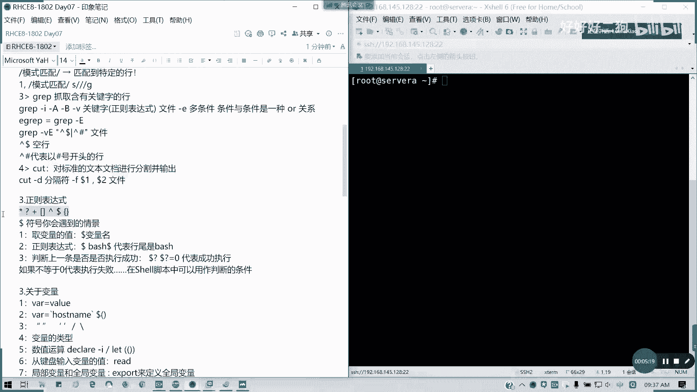

# Redhat红帽 RHCE8.0认证体系课程 - P37：37_Video_Day07_Day06课程回顾 - 好好好二狗 - BV1M3411k77W

我先切换过我的那个server a一下。

好在我们今天上第七天的课程之前呢，我们先回顾一下我们上面，前两天我们讲的内容啊，第一本书我就不再回顾了啊，因为已经讲完了，那第二本书一开始虽然我们讲了一天多的时间，一天多呢，best shell啊。

best shell这一块第一个变量与赋值对吧，你变量怎么命名，变量变量命名规则还记得吧，不能以数字开头，可以下划线开头是吧，使用字母开头和下划线是没问题的，变量命名规则，这个应该是要懂的。

然后呢怎么取值，对吧，然后还有简单的一些，数学运算，对吧，数学运算，这个我们讲过的，我就不再重复，第二个我们的文本处理工具，文本处理工具呢，呃编号改一下啊，文本注意工具。

我们greg said ak跟cut都讲了，对不对，这样的话og杠f指定分隔符，然后后面是模式匹配，模式匹配，也就是比如说我的关键字对不对，我关键字，然后呢可以呢看一下啊，可以加我们的那个动作，对不对。

模式匹配的话主要是找关键字啊。

早起牙什么都没刷，然后在那里回啊，反正我就已经开了。

基本上你也你大家应该都能看到我的状，看到我的屏幕的状态了啊，我这个因为这屏还是开开那个，看看到底是那个老师身体是怎么样的哈，那师兄是怎么样的啊，好我们那个是吧，我们的正表达式通过关键词匹配特定的行。

或者是我们的行号，我们的那个字符，我们的行号等等，是不是这是一个我们的粒子格式啊，然后第三个我们的set批量替换，它是采用我们的流式处理，流式处理啊，发我们按行来按行以行为丢失处理啊，读取药处理一行。

然后呢它匹配呢可以是正则表达式，也可以是行号，然后后面的动作像p是输出打印是吧，a是增加i是直接改文件，d是删除，除了i之外，其他的都是模拟输出，对不对，不会实实际改文件，所以大家如果用set的话。

请注意，不要说有真的没有确定线，不要乱加i，如果加i的话，麻烦你做好备份啊，老子像这些的话，我们批量替换都知道吧，跟v i m m我们的那个末行模式命令很相像，对不对，这是第二个，第三个呢。

我们的grape grap抓取含有特定关键字函，我们用的很多，像我们后面的后面的一个选项杠i什么意思，杠i忽略大小写，杠a显示当前行以及后面的内容对吧，后面特定几行内容。

杠b是显示当前行以及前面的几行内容。

后面你跟数字杠v呢反着来对吧。

反着来杠一呢用等一grap多条件，对不对。

多条件这个用的很多哈，多条件和条件之间是一个或的关系。

只要满足一个，他都是说他都把把截取出来。

然后像我们的dollar dollar井号是空行。

dollar井dollar dolj dollar是空行是吧。

尖括号，我们往上的尖括号代表的是我们的抗首对吧。

以什么开头的行，然后cut它主要是对标准文档进行分。

就是那个分割并输出。

分割并输出，然后呢它主要是那个有一个分隔符，但这分隔符呢它只能识别一个，所以的话你如果对于非标准文档。

你会看起来就是它后面把它当成元素了，就不像oc一样。

对不对，og可以把同类型的全部当成一个，所以的话是它可以对那些非标准文档的切割，会更加的精准，更符合我们的一个阅读的一个习惯。

然后正则表达式呢像我们这里的话是吧。

新号问号加括号，还有这边在这边在这边。

因为今天人少啊，所以在这边找找位置啊，然后然后用那个腾讯会议登录好，这边有这边也可以好，先倒在这里啊，然后呢我们的那个这个表达式啊，还有我们的那个包的符号会遇到情景，比如说我们的曲变量名。

可以用dota后面的变量名是吧。

变量名，然后如果要消除歧义的话，请用多的大花括号。

我们对我们的大括号来进行，然后呢正则表达式是吧，行为啊，行为这里没讲，这里表示多，就best dollar的话就表示行，韩伟是bash啊，然后像那个，我们的一个多的问号，多个问号啊，多问号。

就我们可以判断，我们到底那个上一条命令是否执行成功啊，上一条命令是否执行成功，如果是的话，多的问的话，我们的状态返回码是等于零八，可以，如果这里没位置放，可以放后面放一排位置不等于零，代表执行超失败。

在我们shell脚本里面，可以用作我们判断的一个条件，其实刚才变量我们后面都有讲的，所以这里我把他那个重新编一下号，这个号是没问题的啊，第一个文本处理工具，然后第二个的话我们看一下，第二个是正确表达式。

没有问题，这网线是可以接的，如果这网线都可以接的啊，没有问题，然后呢，第三个我们的变量是吧，我们变量等于负值，刚才讲了，然后呢变量也可以引用一条命令对吧，命令的话可以最好是用括号，为什么你可以迭代。

懂我意思吗，迭代取值没有问题，那我们的双引号，单引号斜杠和反斜杠的行业，明白吗，然后还有变量的类型，数一般来说是整形跟字符串型啊，通常是两种整形用于数数字运算，然后呢数学运算。

然后字符串型呢你可以你可以拿来比较都可以，哪条网线都行啊，这里哪条哪条都可以，你还要看水晶头的，对吧啊，对这里的话有点松的，所以的话你要看看，我不喜欢用无线也可以，这无线的话应该信号也ok。

然后呢就用铜器哦，可以了，我看到亮灯了，诶，又灭了亮了亮了，看一下啊，这水晶头可能可能那个看看啊，然后呢我们的数值运算我们也讲了是吧，量的一天啊，数值运算decare或let或者是直接是吧。

三种还有两个括号，三种方式，然后从键盘输入变量的变量值read是吧，杠p呢就是代表我可以在前面加入一段提示符，要在提示符，然后全局我们还讲到了一个局部变量，跟全局变量。

局部变量呢就是我们只在特定范围内生效，全局变量就可以在当前的环境变量里面生效啊，然后还有dollar 1，dollar 2 dollar 0是吧，012各代表什么意思，还有dollar星，dollar。

dollar紧，多印象吧，上上节课讲的多印象吧，然后还有，shift加number的话，这一课我没讲，但是也不做重点，我就把它删了啊，就是因为这个的话不是重点，我们之前看过，其实用处并不大啊，然后呢。

判断语句我们讲判断语句对调，对文件夹我们是不是有说过，我们自我们的对于数值的比较，以及对字符串的比较，字符串还分我们纯字符串以及文件目录两种，对不对啊，如果看不到的话，腾讯会议腾讯会议的话可以看到。

然后呢，那个对于条件目录是不是杠一代表文件存在啊，杠f他后面还加了一个条件，就是它是一个常规文件，杠d呢是代表它是一个目录，然后字符串的判断呢，杠n代表它里面是不非空的，杠z代表我这字符串是空值对吧。

两个等于代表两个字符字符串等等对吧，数值的判断，杠1q等于杠l一小于等于杠g，一大于等于杠l t小于gt大于，还有非是吧。

不等于啊，非然后还有恒等大。

就是相当于不等于了，对不对，一个非啊叹号。

包括我们文件不存在的话，也是叹号，对不对。

判断工具的话，通常是在shell脚本中，我们这样一个方块，记得你的表达式前后，你在方括号中间也是有留空格的，而且你在数值跟你的运算符中间也是留空格的，不然的话它会识别成一条命令，懂我意思吗。

控制语句if等是吧，比如说我们比较三个数字大小，是不是可以用if代来做，然后还有一种就是多重多重，那个多重判断有else if对不对，简写成e l i f，然后记得我们的判断。

我们的判断语句段后面是反写结尾的，fi不要漏了哈对吧，不要漏了，if后面你比你的表达式之后是有个分号的，也不要漏了，而且他的判断标准呢是以你这个命令，你的执行结果的多的问号为准。

而不是说你的这个事实懂吗，它都是以语句的一个执行结果，你多的问号等它为真，dollar问号等于零，如果是假dollar问号等于分一零，以这个为基准，懂我意思吗，case分支啊，多重，我有多个选一个命令。

我我一个命令里面有多个选项，情况下，总有一个是与我们指定的选项不符的，对不对，所以的话选项一执行命令集一，选项二执行命令集二，其他你一定要有出口，对不对，不可能绕不在里面出不来，懂我意思吗。

然后记得他的命令，它的选项是有括号结尾的对吧，我这里漏了，这里漏了一个括号啊，然后命令集后面呢它是结束，是两个分号，新啊就是其他的条件，也就是说总有一个出口，其他呢就是一个命令集合，然后呢。

e s a c反写结束，对不对，case还有循环语句，我们讲了三个一个for对吧，for i in a b c d是吧，然后do我们的程序体，然后出来啊，数值运算，数值运算对吧，这样写是可以的。

或者是那个我们直接对不对，然后呢度程序体只能在数数字运算使用啊，然后y跟til是两个相反的，y呢是你的多的问号，你等你的dollar问号等于零，就是你的条件为真的时候，do一下命令。

然后如果是非零跳出until，相反这块没有问题的，请在群里面call a啊，小写a，每节课我都会把这些我们的知识点啊回顾一遍，有问题可以在群里问，关于舍友这块呢练习我会看看有没有时间，有时间。

我下午五点钟之后我跟他剖析一下练习，因为因为之前有学，有大家有人提到啊，提提到说练习要给答案，如果是讲解一下的，那可以我下午五点之后我抽时间给大家讲，因为这些对于为里面还是有用的。

但是我们前面我们在五点之前呢，我们先把新课讲完啊，把我们既定的流程讲完，接下来我们看一下，我们上周我们还讲的计划任务，计划任务呢我们讲了两个部分，一个是一次性的对吧，一次性的计划任务。

还有周期性的一个计划任务，一次性任务呢我们at对不对，at然后你后面加一个时间，比如说具体的时间点或者是三三分钟后，一小时后，或者是隔两天都可以记住，是往前走的，不是往后倒的啊。

因为它是一个将来要执行任务啊，往前走的不是往后倒，然后呢crown tab是周期性任务，通常说我们杠一是编辑啊，杠一是编辑，这用的很多考试也必有一提的查看，然后对于杠u的选项，只有root用户才能用。

因为他才有权限查看别人的其他人，除非你把s y d赋予内，这就除非你用说do或者是s i d等等这些，否则你都是只能查看自己的进化任务啊，然后呢一般任务是吧，分时日月周命令还记得吧，还记得吗，格式啊。

分时日月周，如果说每我们说特定的，比如说每隔几小时，每隔几小时，那就要十那里我用星号斜杠，然后后面你是隔多少时间对吧，如果是特定的时间点，比如说我两点六点十点是吧，就二逗号六，逗号十。

他就在这三个时间执行，懂我意思吧，分时日月周命令这样记绝对不会错，然后中间用我们用制表符，用tab分开就可以了，不要说很多人像之前考试啊，很多人连命都连这种计划任务都不会写的，系统任务就这里加个用户。

就你到底是哪个用户运行哪个系统任务命令，然后它是分别存在我们的etc里面，chrome hourly是吧，corn daily convickly跟chrome monthy，它有四个预定义的文件。

就分别你你把我你把计划书放里面呢，就是它每小时每天每周和每月会执行任务，但它有延迟，延迟的话，他是先进用户先优先啊，用用户优先执行它，然后它又延迟上，每每每小时好像延迟五分钟，对不对。

每天的延长延长延长25分钟啊，就最多在25分钟内，然后每每周的45分钟，对不对，然后他是在那个enter crown tap里面去指定的，这个配置文件我们上上周看过啊，这块如果ok的话，请回个b。

然后呢给大家十分钟之后消化啊，我们十点钟开始讲管理临时文件夹，我们复习先到这里啊，没反正每节课呢上课之前大概我讲20分钟，上节课的内容，然后给十分钟大家消化一下，我们大概十点钟讲新课啊，管理临时文件夹。

还有就是我们的一个系统调优。

