# Redhat红帽 RHCE8.0认证体系课程 - P38：38_Video_Day07_RH134_Ch02b_管理临时文件 - 好好好二狗 - BV1M3411k77W

好，我们来讲它的第三个部分管理仪时文件夹。这里的话因为说实在啊说实在。考试不考这个东西，考试我看过看过我们的题目，我是没考这个东西的。但是呢我这里会讲一讲如何去管理我们的临时文件夹。

临时文件夹呢是这样子啊。我们这里就讲两个方法，怎么来管理啊，我们可以来制定我们的临时文件夹的。我们有一个服务叫做啊。两种方式。第一种呢是。我们两种方式啊方式一。它是根据我们系统的一个叫做system啊。

System里面的t files。ten fast里面的这个服务啊，ten five点 setet点service这个来管理啊。然后这个服务如果在开机启动的时候。

它是会根据我们的user lab里面ten five选D。T点呃，然后里面的co文件来创建我们需要的文件，然后删除需要删除文件啊，我来看一下。我默认了tenPMP放省低。

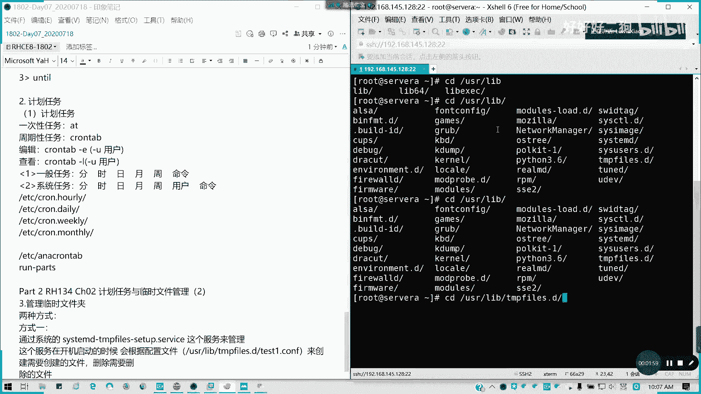

里面有一里面有一个字TMP啊，TMP点矿谱。然后这里的话它会有形式各样的啊。

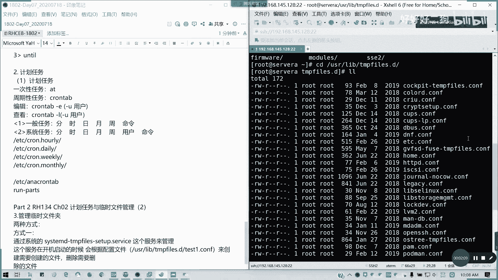

我们的里面的很多的一个co文件。🎼像这些的话，它都是定义了像我们TNP的康谱，它是sstem地的一个部分，它也定义了它的那个文件夹的一个。对吧一个。权限还有他的那个只他的一个操作，对吧？

它的操作以及它的那个文件夹名称，以及它权限在哪里，以及它的用户组跟组组，对不对？然后什么时候会定时去清理？像我们这里的话代表什么含义呢？代表什么含义？像这里的我们截个图啊，比如说我们TNP。

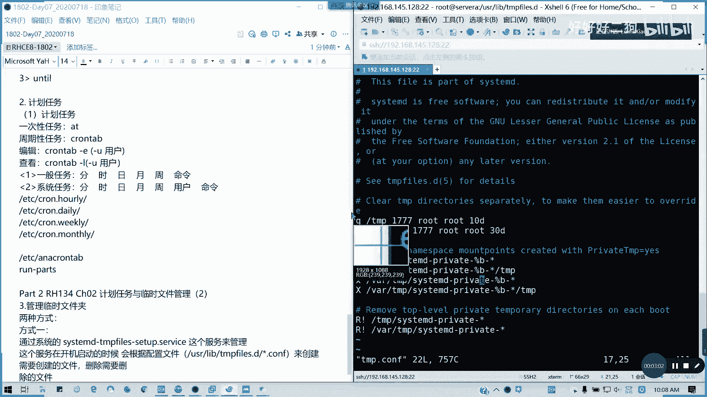

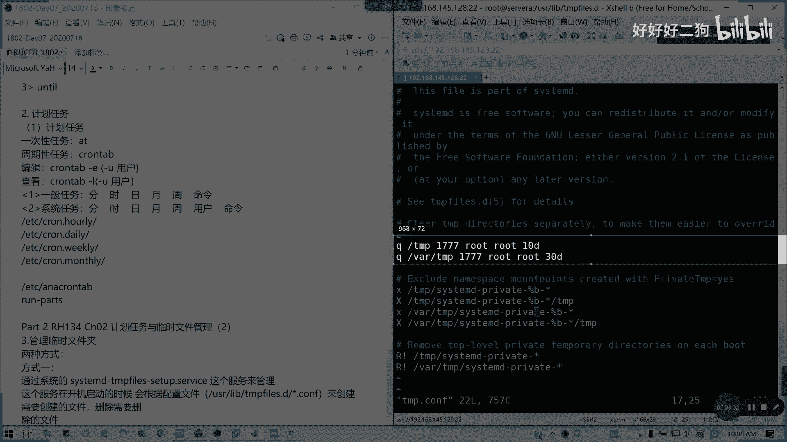

像我们的一个事例啊，userlib。ten five点D这个部分的话，我们在期的话是没有讲到的啊。比如说TMP点com，我们这里的我截个截个图啊。

它这里的话就是一个我们也可以通过我们的man5ten dten five点D来看一下这服务默认是开机启动的啊。

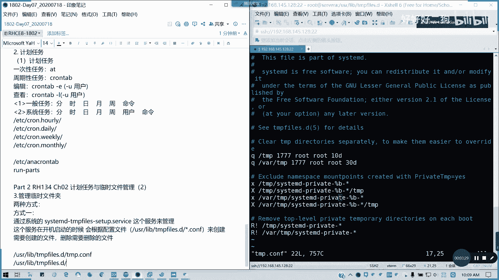

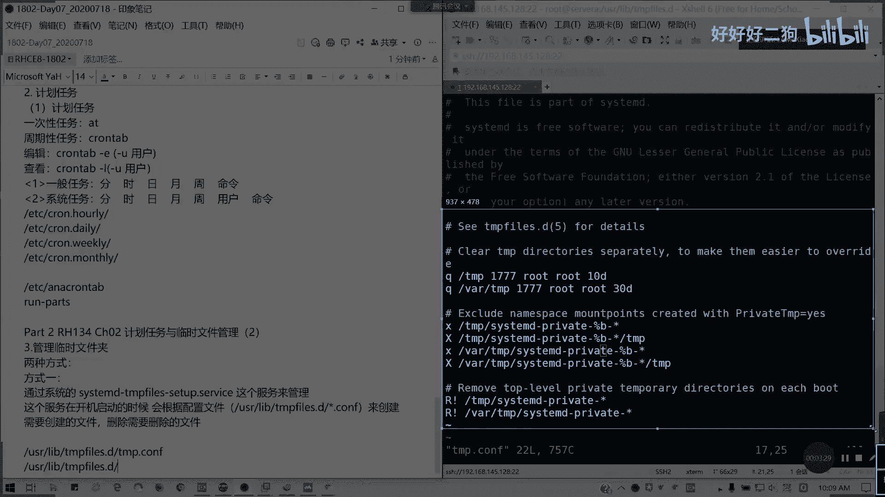

用法是这样啊。我们可以查下我们的man手册TTMPf点D。它这里有提示啊，C ten five点D5 for five for details啊，有时候我们要学会自己看文档。像我们这里的话。

像天偏的况幅，我们截个图，前面是代表它的一个对临时文件夹的一个行为，像那个。

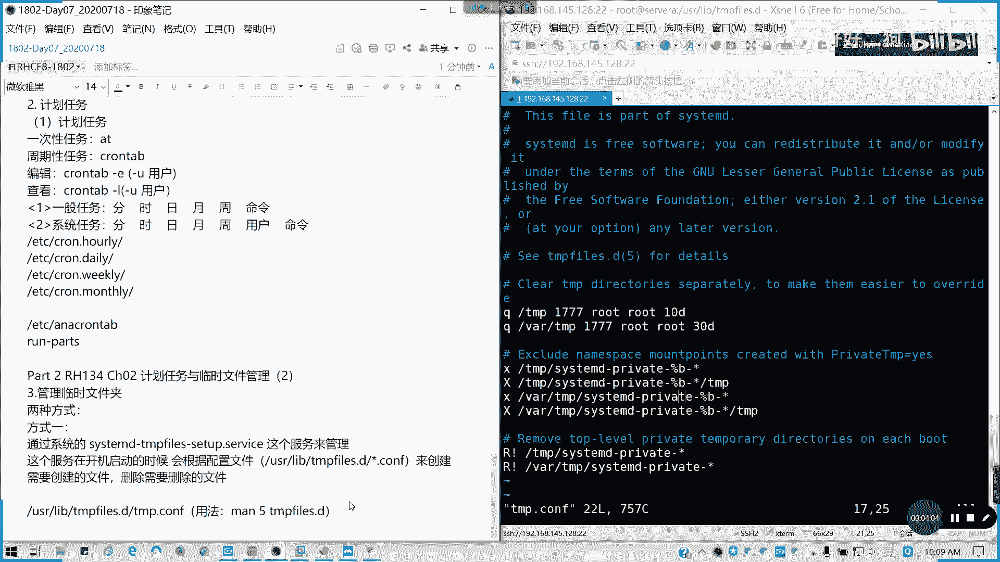

X是排除对吧？排除这二了。是移除。对吧像第一是删除。对吧那就删除这样删除。然后呢，我们也可以说定义我们的，比如说像。降低呢。是个目录，F是文件，对不对？它的没有类型，它都有定义的。X是排除啊，R是。

移除这个。🎼置顶的这个啊，它这里都有每行都有注释。我看一下下面的啊，就只有三行，然后每个服务里面。

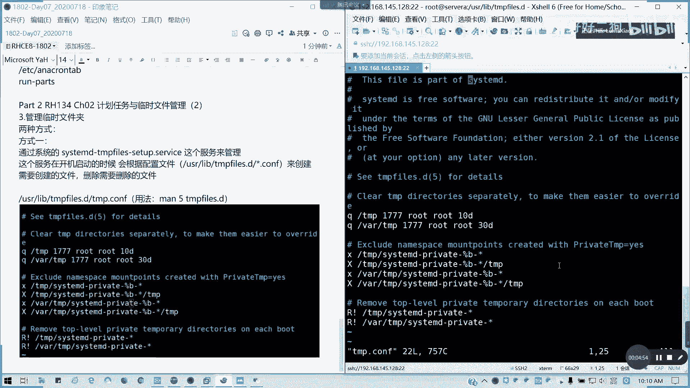

🎼每个服务里面都有相应的是吧？它有定义到底我们这些临时文件。

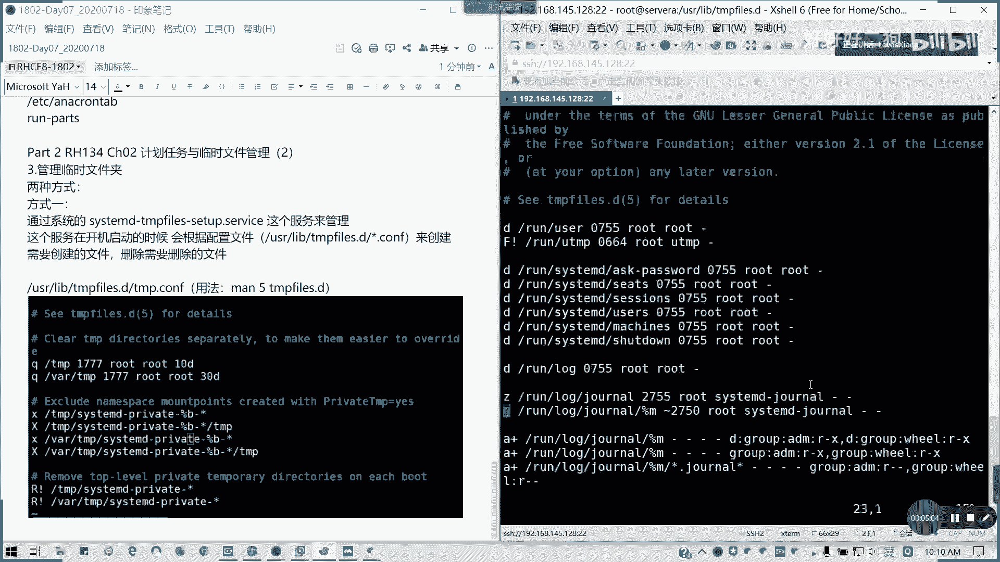

🎼要存在哪，对不对？还有它前面的一个类型。我们这里比如说我们要那个我们可以来那个。创建我们的我们可以创建或者是移除我们的一个。自定义的一个临时文件夹，这是可以操作的。

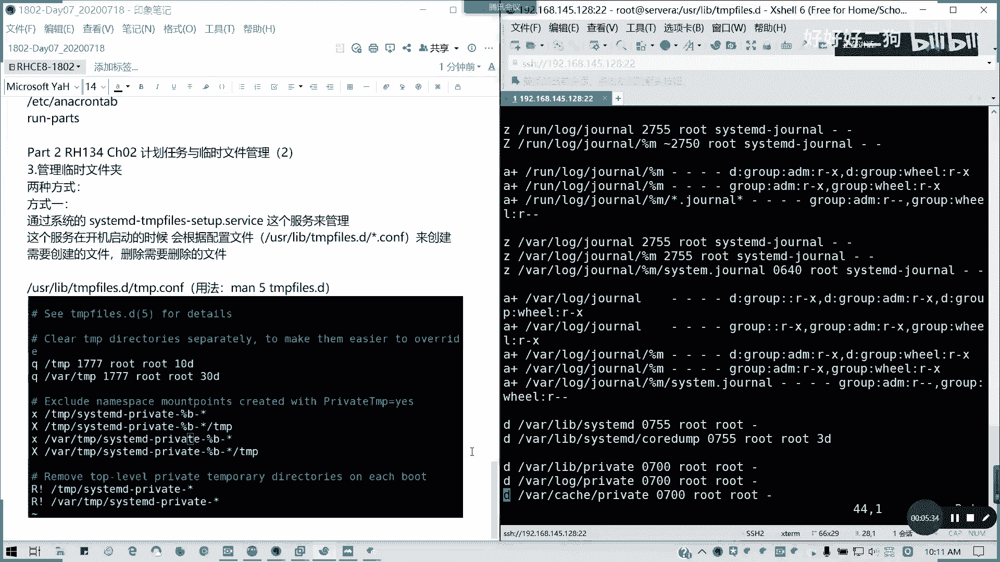

前前面第一列啊。分别是类型。

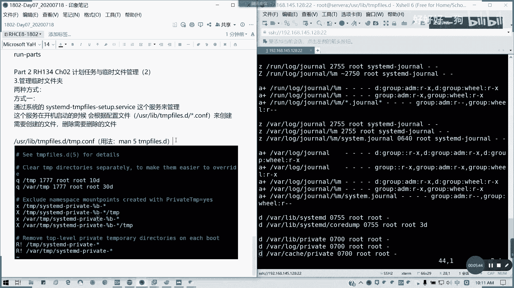

文件夹。权限。用户名输索。这应该是所有者。主走，还有就是。

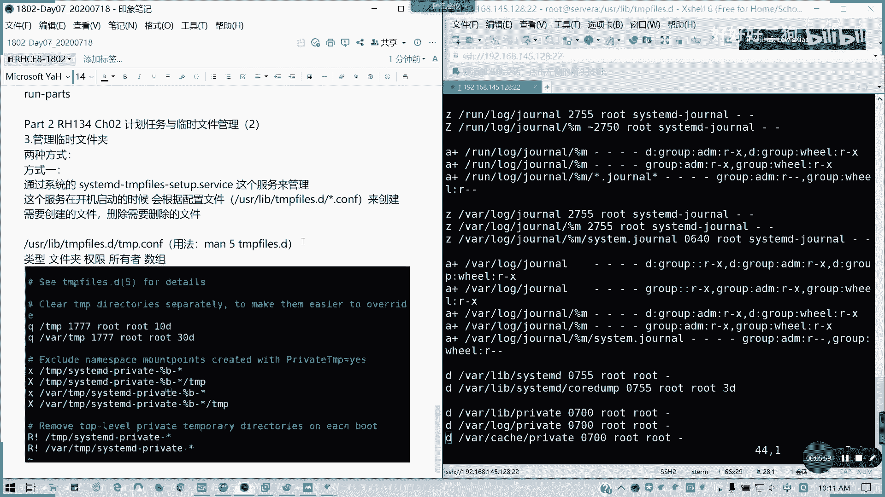

后面选项。基本上这样，但是我们这里的话我没去细究啊，然我们来比如说我们可以。怎么可以定义我们的。一个新的啊。诶，哦变中文啦。我们有一个命叫stemD。ten files我们有这个命令。跳这里的话。

我们可以。创建啊创建标记的文件和目录是吧？再创标记文件和目录。然后像铝幕腐是，我可以把它移除标记的啊。标记文件目录，然后还有那个。很多选项啊，包括一些。用执行用户的配置等等这些我们看看。这十啲 哈。

我少个啲。这里的话，它后面是有那个。我是不是看辩是跟那个。🎼它是要跟我们配置文件里面，然后创建相应的目录的啊。所以我们把配置文件要先写好。在我们的userlibb。里面的TMP files点D。

然后test比如说我现一个t1点。com对不对？临时文件。然后我们这里的话，我指指定说一个目录。VR我就建个t test一，然后权限700。所有者。所手左。然后。对吧不不做，就那个后面选项是空。

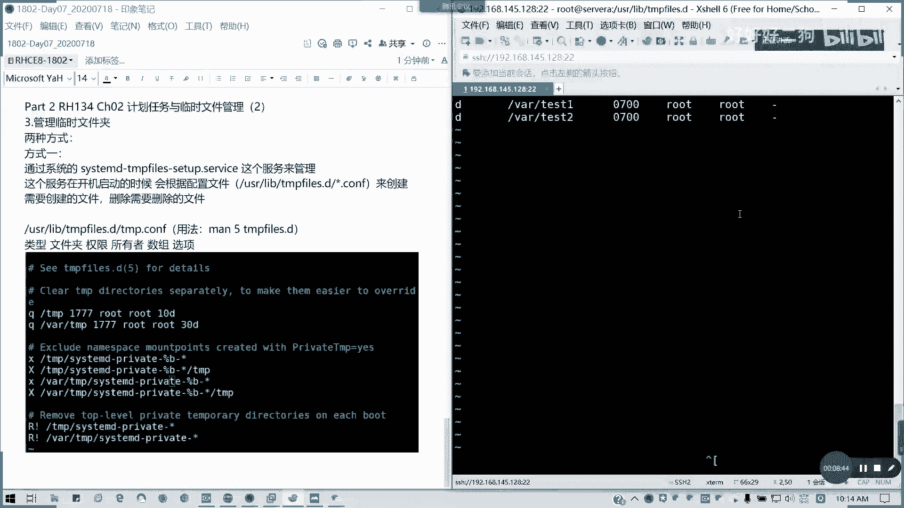

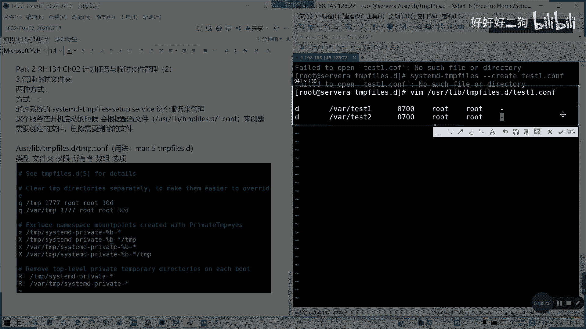

那我也可以建一个。🎼临时文件专门存储了0600的啊60权限的VR。Test file。

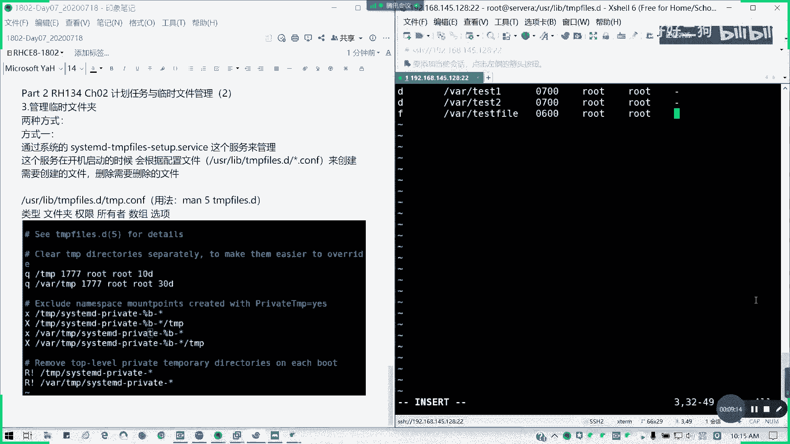

我们就把它这文件我找出来给大家看一看。哎，导错了，CAT。前面是问类型啊前面是类型。我们创建的话，先。定义我们的c文件。然后呢，我们。可以用那个。す啊。

🎼通过我们的 systemD temp files。杠杠create我们去以创建它所示的临时文件夹。我我们定义了啊它。🎼那我们创建完之后，我们看一下VR的里面。是不是帮我们自动建了建建建了几个东西啊？

这是我们指定的，就我们执行的create之后，create操作之后呢。是不是我们已经有这几个了，有有几个8585的文件，我把这个截图截出来，这里好像我不太明显啊。LVR。

对吧我们指定的一个临时文件创建出来了，他就会把那个临时文件会写在这里。然后如果是二了，会就说移除嘛，移除我们也可以定义说说那个。就每次。每次启动时候，我可以进行一个文件的一租操作。

那就是我们定一个叫t2点c。这种低我们第一第一个是那个4例一。添加我们的零自定义的。临时。文件和目录。但是它启动只会自动运行一次的，这个只是我们手动的一个过程。首先我们先定义我们的co谱文件。第二。

我们的步骤啊是system。System D杠10 files。Now干干c。然后他是一点cs。那后我们可以验证结果，对不对？他们的那个临时人就已经帮我们创建了，对不对？主要方式啊主要方式。

就是这方方式我们主要是通过这个。这是方式一，然后方式二的话，我们是那个直接手动加载。应该这里的话我要说明一下啊。然后如果我要启就移除的话，就比如说我要移除啊，就启动时。清理。指定的临时文件夹。

🎼那我们可以定义到t2点com看一下。🎼现在没有这个文件，我们创建一下啊。比如说我这里有个R移除啊，就启动时候，它会会把这个目录清空。我就写个t一。然后小大是递归哈，小二的话。文移出移出文件。

tex file。

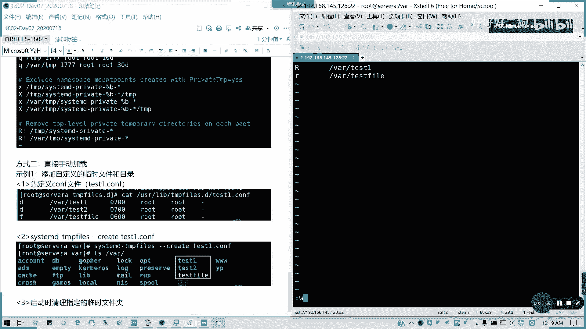

我谁找我，原是那个大学哎好。首先我们的那个t2点com是吧？先定义，然后我们可以创建。一种是我们创建完之后呢，我们就。t2点comf，然后后面我们添加。然后呢，如果我要移除，我要移除这个规则。

就移除它对应的一个临时文件夹的一个规则我清理。我要移除这个规则。嗯。叫remo。就可以了。就相当于它就取消打标记，你的配置文件就你的那一个配置文件就不会生效指定文件夹里面。Remove。就可以了。

我们只要知道知道这些就行。这个呢就是我们第二章剩下的一个东西啊，临时文件夹。主要管理啊，制定手手动自定去管理。然后每次启动呢，其实他门建完之后，每次启动它叫我们要不就建了不管，我们每次启动都会。

执行con结尾的文件。喂。要不就是我们手动定义。最快的话如果明白，请打个C。对临时文件夹的简单讲讲简要讲到这里。我们可以通过M啊通过M啊那个ten five选D，我们可以获取到详细的信息。

这块的话大家作为一个了解内容就可以了。是听不到我声音吗？还是。这是一个自己定义这个使用场景呢就是是这样子啊。就那些临时文件，如果你要你要定义，你要有些有些问你有有些那个是这样子场景呢，我没说啊。

我们使用场景呢。就是我们的一些自定义软件。我们装的一些自印软件啊。应该是这样子啊，我们软件应用自所自定义的一个临时文件夹，通常对吧？通常要不它就有自己的一个规则，对吧？要不呢就是由系统来帮管理。

要不就是也在放在那里会越种越种越大，对不对？那如果通过我们系系统我们的stem Dten fast这个服务。那可以帮我们去管理这类的临时文件夹，懂我意思吧？可以有可以几个自定义章后帮帮我们进行清理。

对不对？定时清理，然后也可以，你日常要求设置这些删除不用临时文件也是可以的。但是这这里的话，我们系统已经定了很多，我可以列出一下星点com就知道了。在我们userla库里面定了很多啊。

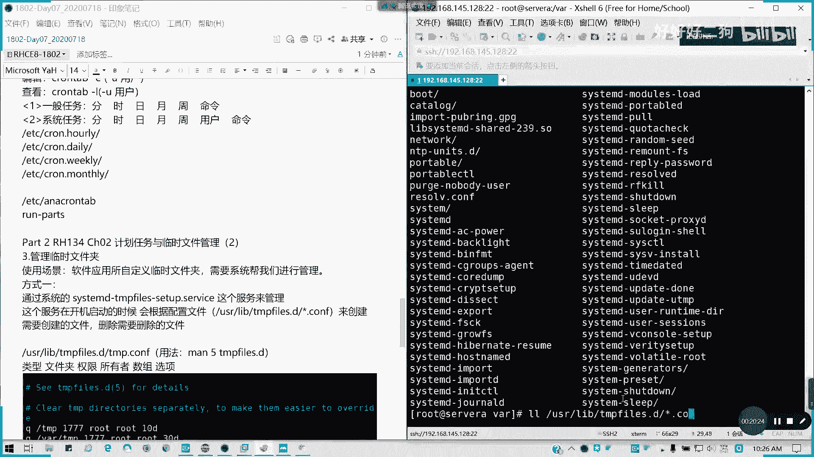

明白了是吧？你看这也定义了一堆。Yes。哎，有人开麦了。你看这里定了一堆，就他这里的话，我们每个应用它都有，包括像HTTPD它有一个清理文件夹临时文件夹的一个机制。

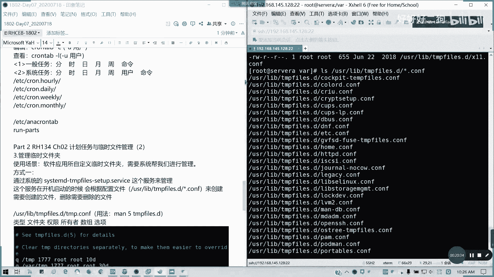

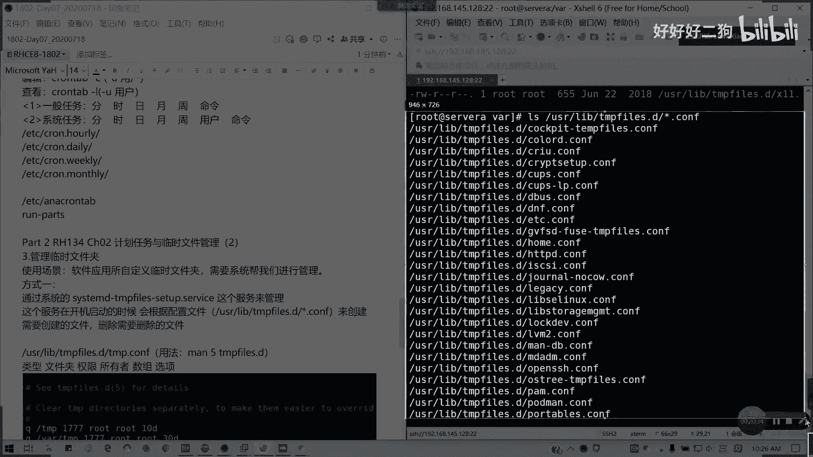

走吧走吧，我们迟到了啊，啊，怎样可以报单我哎呀。任丽川同学，你的麦是不是忘了关了？系i。

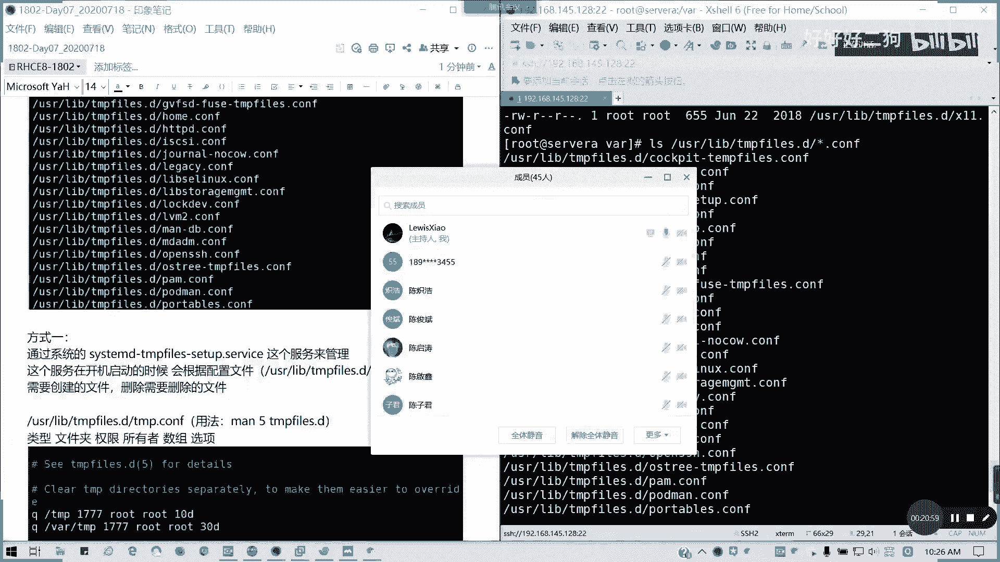

知道吧看到这些文件你应该都听明白了啊。现场可以明白吗？看这些文件的话，它都有定义我们的如何去清理啊临时文件的一个规则。所以的话其实我这里教大家就如何去自定义而已。其他的不重要。懂吧？可以明白可以理解吗？

现场。😊，远程如果理解的话，请打个C。如果不知道怎么写的话，我们可以看到我们这些已经定好的软件的一个写法，定好我们应用的写法，对不对？这但这个的话我们说白了，我看我看过目前所有的题库。

考试暂时不会考这个。但是我接下来讲的内容就要考了，系统调优。只考一道题，而且很简单。