# Redhat红帽 RHCE8.0认证体系课程：P38：管理临时文件

在本节课中，我们将要学习如何管理Linux系统中的临时文件。虽然这部分内容在RHCE考试中不常出现，但理解其管理机制对于系统维护和自定义应用部署非常有帮助。我们将重点介绍两种管理临时文件的方法，并学习如何自定义临时文件的创建和清理规则。

## 概述

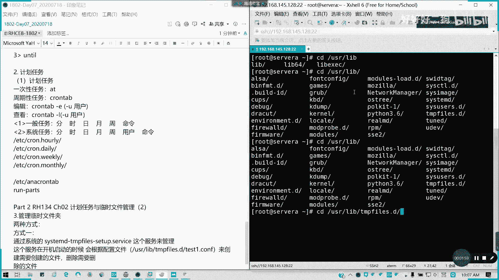

临时文件是系统或应用程序在运行过程中产生的、不需要长期保存的文件。如果管理不当，它们可能会占用大量磁盘空间。Linux系统提供了 `systemd-tmpfiles` 服务来帮助我们自动化管理这些文件。本节我们将学习如何配置和使用这个服务。

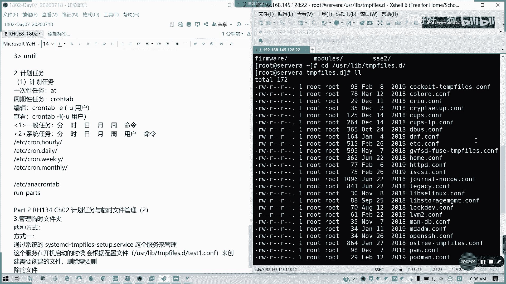

## 管理临时文件的两种方式

上一节我们介绍了临时文件的基本概念，本节中我们来看看两种具体的管理方式。

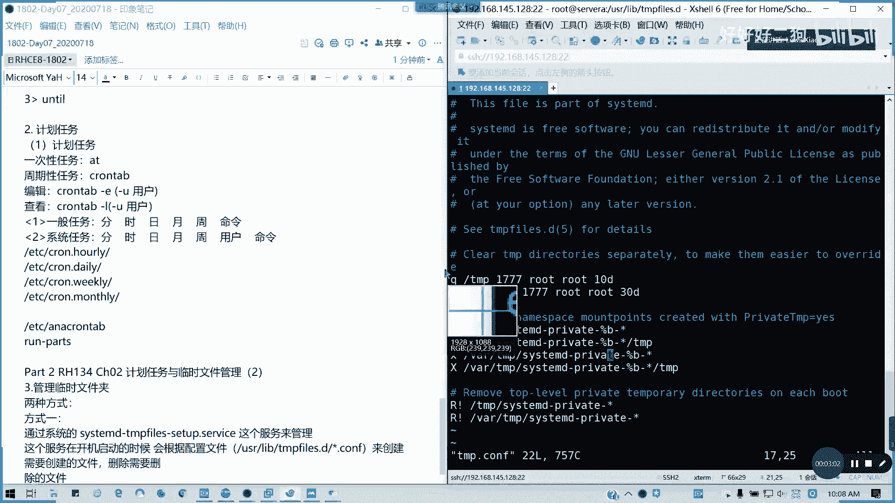

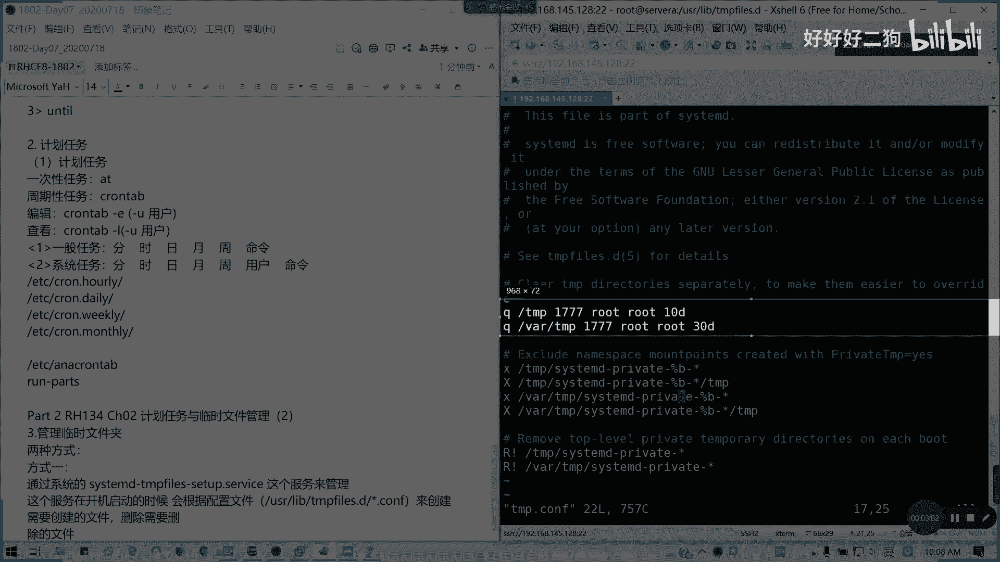

### 方式一：使用 `systemd-tmpfiles` 服务

这是系统默认的管理方式。`systemd-tmpfiles` 服务在系统启动时，会根据 `/usr/lib/tmpfiles.d/` 目录下的配置文件来创建、清理或删除指定的临时文件和目录。

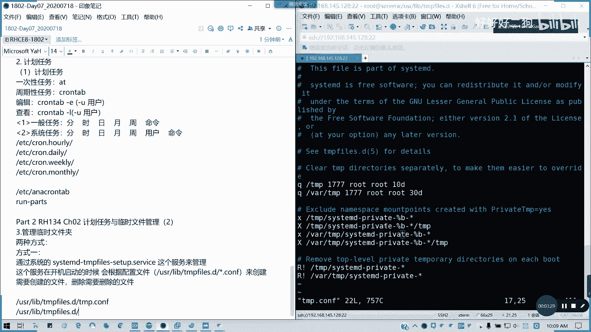

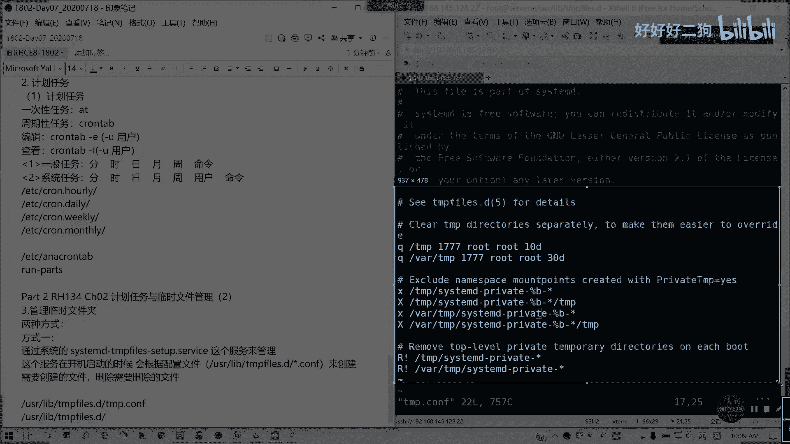

每个配置文件（通常以 `.conf` 结尾）定义了临时文件或目录的路径、权限、所有者以及生命周期内的操作（如创建、清理）。

以下是配置文件中一行的基本结构：

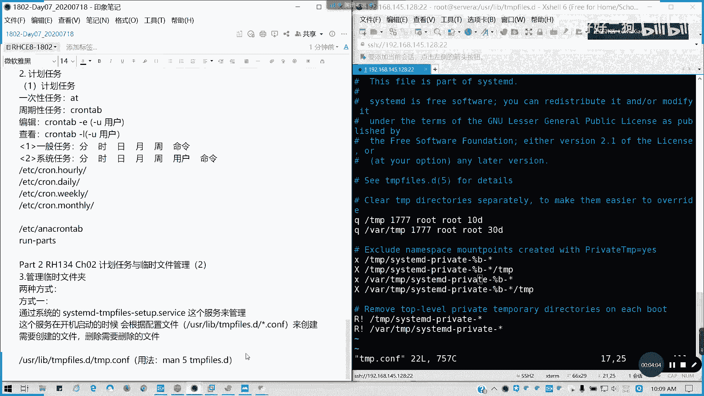

```
类型 路径 权限 所有者 所属组 选项
```

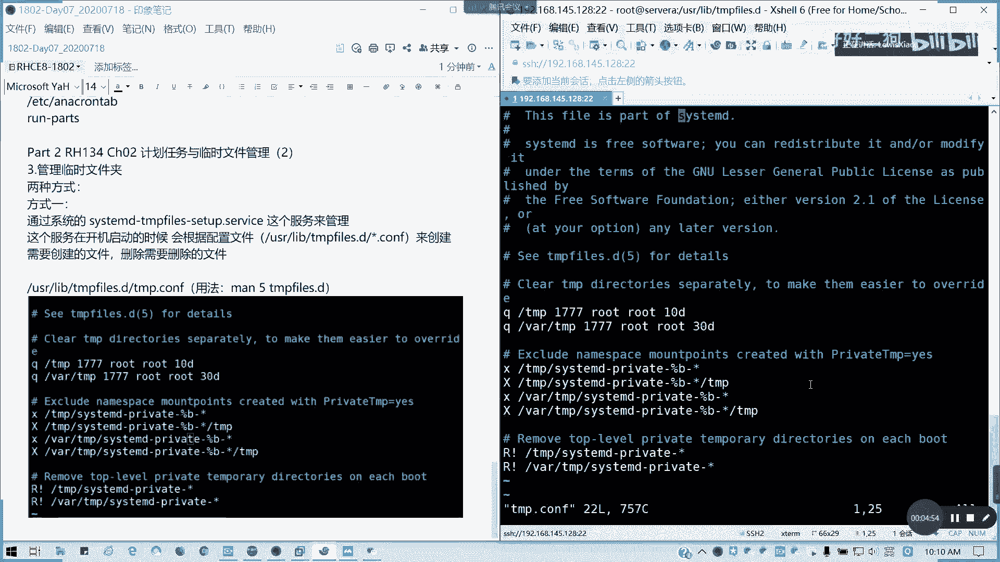

**核心参数解释：**
*   **类型**：定义操作类型，例如：
    *   `d`：创建目录。
    *   `f`：创建文件。
    *   `r`：移除文件或目录（如果存在）。
    *   `x`：排除文件或目录（不进行任何操作）。
*   **路径**：临时文件或目录的绝对路径。
*   **权限**：文件或目录的权限，例如 `755`、`700`。
*   **所有者/所属组**：文件或目录的所有者和所属组。
*   **选项**：其他选项，如文件存在时间等。

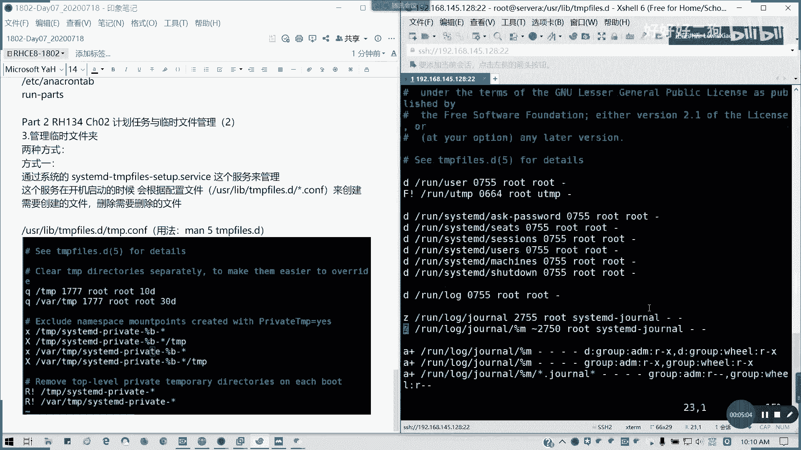

我们可以通过 `man 5 tmpfiles.d` 命令查看配置文件的详细格式说明。

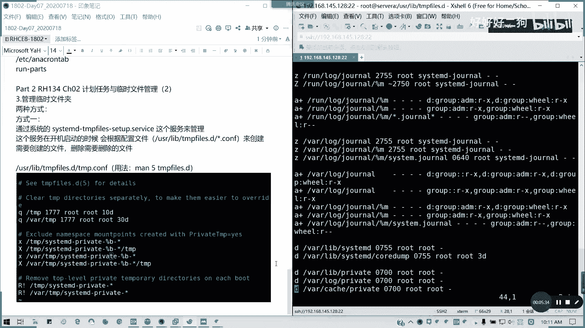

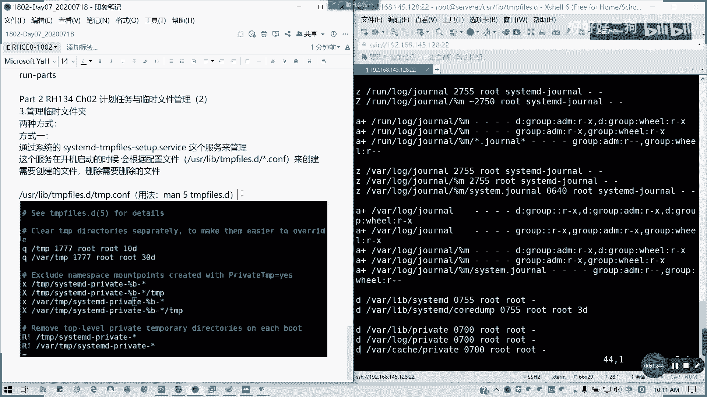

### 方式二：手动执行命令

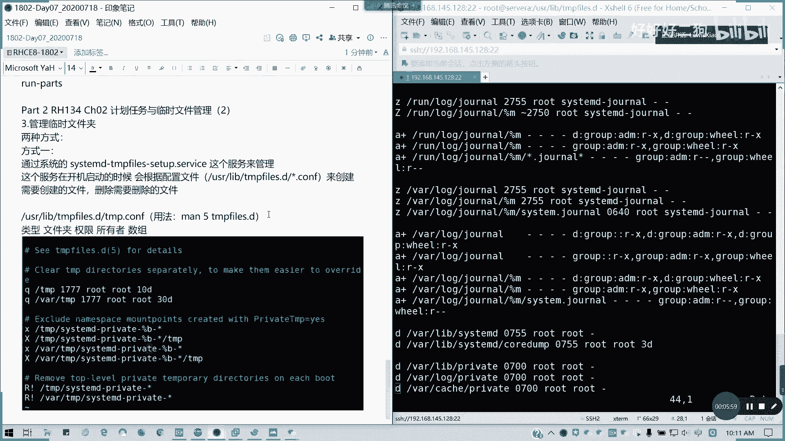

除了依赖系统启动时自动执行，我们也可以手动使用 `systemd-tmpfiles` 命令来立即应用配置规则。

以下是相关的命令：

*   **创建临时文件和目录**：
    ```bash
    systemd-tmpfiles --create
    ```
    此命令会读取所有配置文件，并创建其中定义的、尚未存在的临时文件和目录。

*   **清理临时文件和目录**：
    ```bash
    systemd-tmpfiles --clean
    ```
    此命令会根据配置文件中定义的规则（如文件存在时间），清理过期的临时文件。

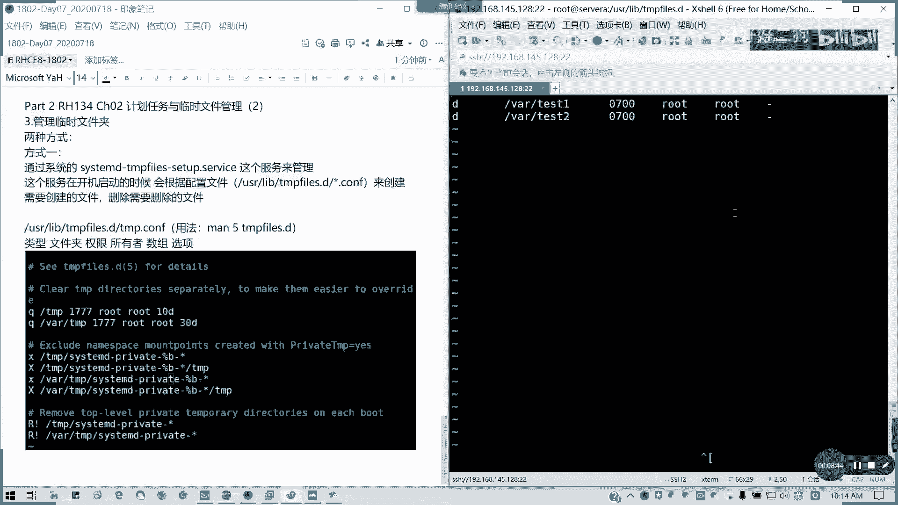

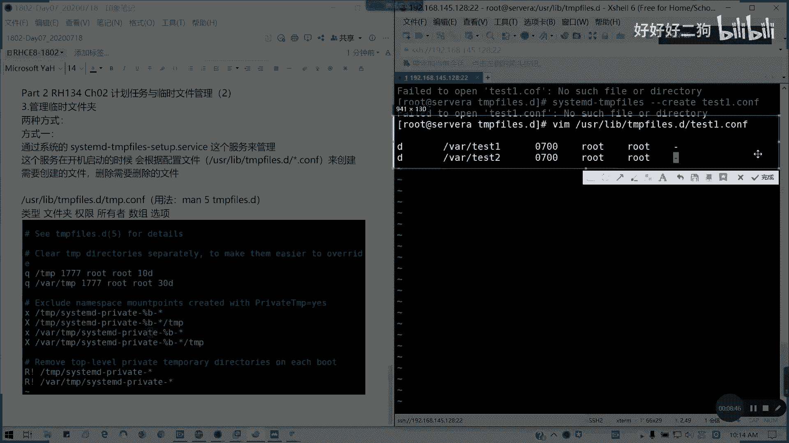

*   **移除临时文件和目录**：
    ```bash
    systemd-tmpfiles --remove
    ```
    此命令会移除配置文件中定义为需要移除（类型为 `r`）的文件和目录。

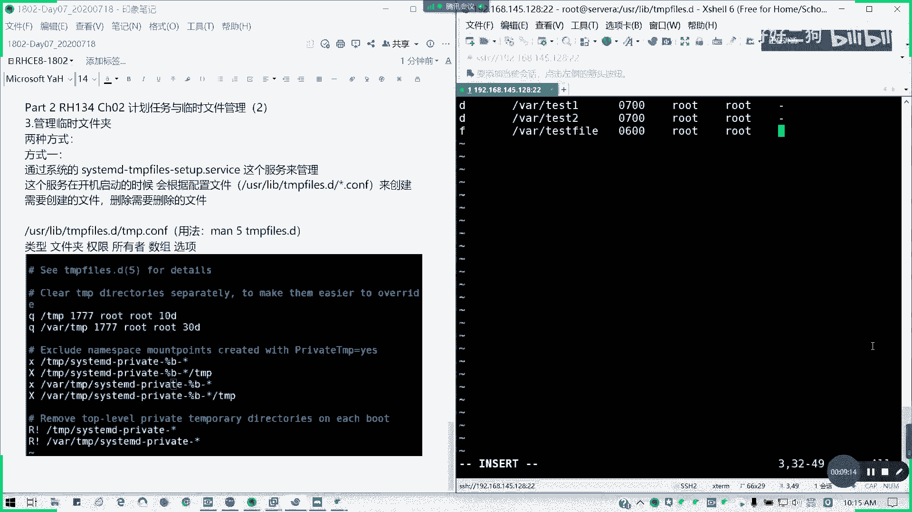

## 实践：自定义临时文件管理

了解了基本概念和命令后，我们通过一个实例来学习如何自定义临时文件规则。

### 示例1：创建自定义临时目录和文件

假设我们需要为某个自定义应用创建一个临时目录和一个临时锁文件。

**操作步骤如下：**

1.  **创建配置文件**：
    在 `/etc/tmpfiles.d/` 目录下创建一个新的配置文件，例如 `myapp.conf`。系统会优先读取 `/etc/tmpfiles.d/` 中的配置，然后才是 `/usr/lib/tmpfiles.d/`。
    ```bash
    sudo vim /etc/tmpfiles.d/myapp.conf
    ```

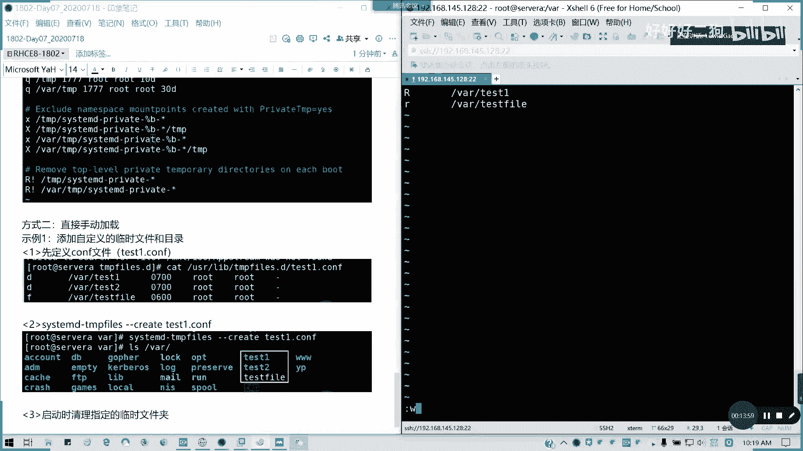

2.  **编写配置规则**：
    在文件中添加以下两行内容：
    ```
    d /var/tmp/myapp 0755 root root
    f /var/tmp/myapp/lockfile 0600 root root
    ```
    这表示：
    *   第一行：在 `/var/tmp/` 下创建一个名为 `myapp` 的目录，权限为 `755`，所有者和所属组均为 `root`。
    *   第二行：在刚创建的目录下创建一个名为 `lockfile` 的文件，权限为 `600`。

3.  **应用配置**：
    执行以下命令，立即创建我们定义的目录和文件：
    ```bash
    sudo systemd-tmpfiles --create /etc/tmpfiles.d/myapp.conf
    ```

4.  **验证结果**：
    使用 `ls` 命令检查目录和文件是否已按规则创建：
    ```bash
    ls -ld /var/tmp/myapp/
    ls -l /var/tmp/myapp/lockfile
    ```

### 示例2：配置启动时自动清理

我们还可以配置规则，让系统在每次启动时自动清理某个目录下的所有内容。

1.  **创建清理配置文件**：
    ```bash
    sudo vim /etc/tmpfiles.d/cleanup.conf
    ```

2.  **编写清理规则**：
    添加以下内容：
    ```
    r /var/tmp/myapp/cache/*
    ```
    这表示：在每次 `systemd-tmpfiles` 服务运行时（通常是启动时），递归地移除 `/var/tmp/myapp/cache/` 目录下的所有内容（`*` 通配符）。注意，`r` 类型不会删除目录本身。

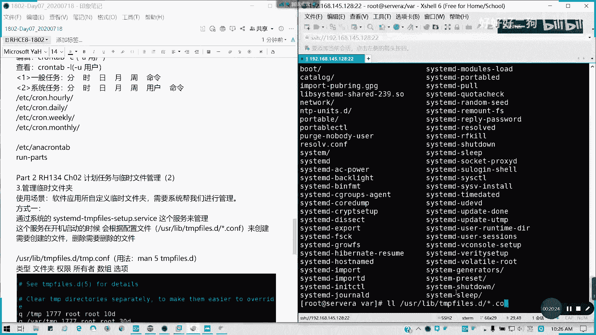

3.  **手动测试清理**：
    你可以先手动放入一些测试文件到该目录，然后运行以下命令来测试清理效果：
    ```bash
    sudo systemd-tmpfiles --clean /etc/tmpfiles.d/cleanup.conf
    ```

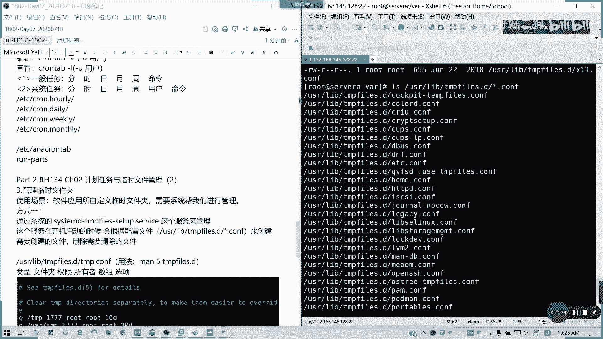

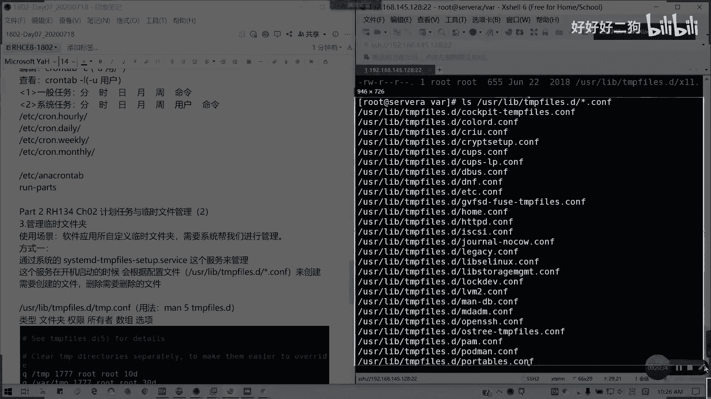

## 应用场景与总结

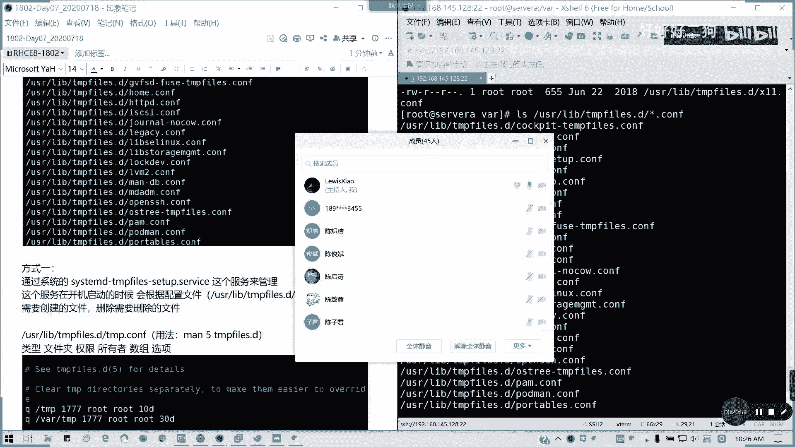

**使用场景**：这种管理方式非常适用于我们自行安装的应用程序。这些应用可能会生成自己的临时文件，如果没有内置的清理机制，临时文件可能会不断累积。通过 `systemd-tmpfiles`，我们可以为这些应用定义统一的临时文件管理规则，实现自动化创建和定期清理。

你可以查看系统中已安装软件（如 `httpd`）预定义的规则文件，它们通常位于 `/usr/lib/tmpfiles.d/` 目录下，文件名类似 `httpd.conf`。这些文件是学习配置写法的最佳参考。

本节课中我们一起学习了 Linux 系统中管理临时文件的机制。我们介绍了 `systemd-tmpfiles` 服务的工作原理，学习了配置文件的语法结构，并通过实例演示了如何自定义临时文件的创建和清理规则。虽然这不是RHCE考试的重点，但掌握这项技能能让你更有效地管理系统资源，并为部署自定义应用做好准备。