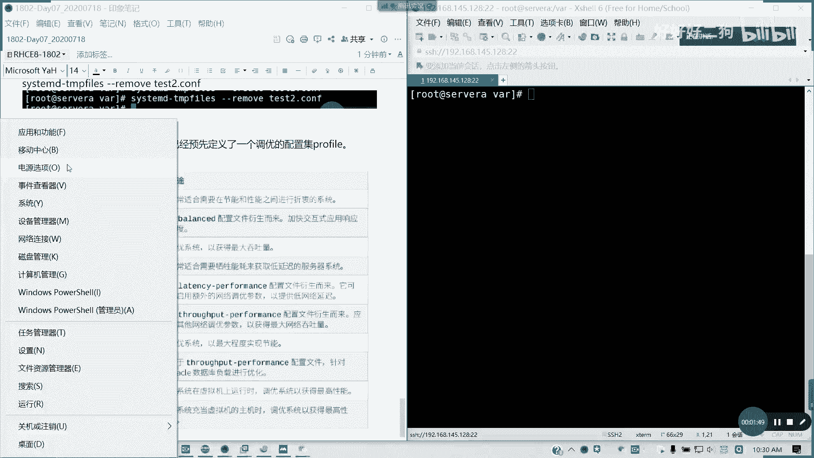
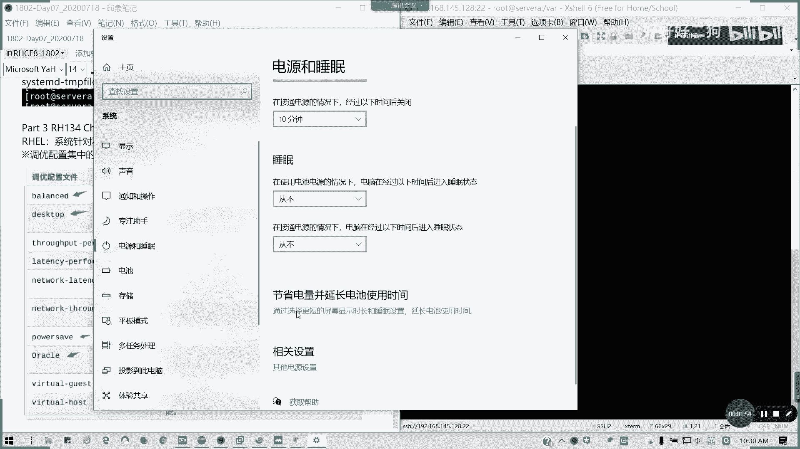
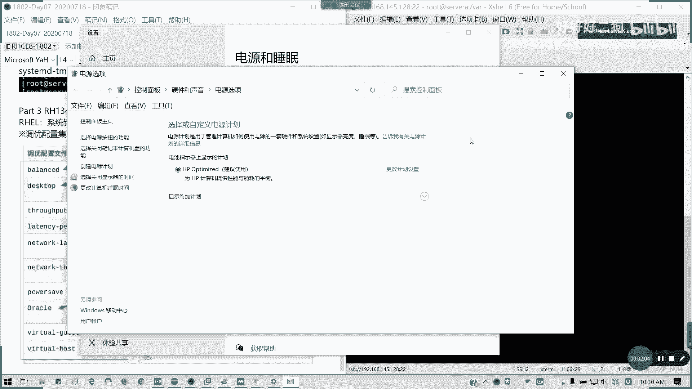
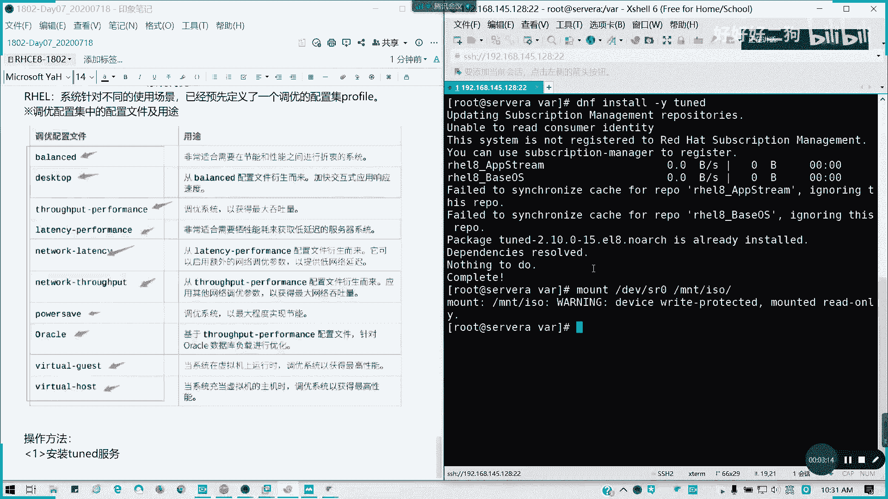

# Redhat红帽 RHCE8.0认证体系课程 - P39：39_Video_Day07_RH134_Ch03_调优_Ch04_facl - 好好好二狗 - BV1M3411k77W

有不明白的及时问啊，我们接下来讲简单讲一下第三章，第三章系统调优，这个考试会有一道题。我可以告诉大家，有一道题很简单啊，我们对洪帽来说。这是8，我们以前是没有这个东西的。在8。0之后呢。

它以它针对我们不同的使用场景，已经预先定义了一个调优配置级配配置级叫profile。那profile呢里面有哪些调优配置文件呢？这里的话他已经列出了啊，我们书上也有啊。我们这里呢在C一阶段呢。

我们不要求，因为这个系统调用是以后442的内容啊，44系统调用的那这块内容。我们这里的话主要是讲你如何会用就行了，对吧？它有预先定义了哪些，像我们的balance，对吧？就平衡啊。

还有desktop就是。从bss文件衍伸就加快显度，就只用用于我们的桌面。然后还有就是最大吞吐量s per performance，对不对？还，laternency就是那些低延迟的，对不对？低延迟的。

还有网络延迟的。其就对网络其实做优化的，对网络吞吐量就优化的。对节能是不是很像我们的这个。很像我们什么呢？是不是类似windows的一个电源管理选项啊？

其实说白了就是好像这个东西啊，对吧？类似一个我们的一个计划的一个文件，懂我意思吗？

它这功能是8。0以后我们有的。然后呢，它类似于这种调幅配置文件，像我们它有那些像虚拟机，像oracle这些，对不对？的复载文件。那我们主要用我们直接我们要知道怎么用就行。那我们接下来看一下我们的。

一个应用方法。我们首先这个涉及到一个。吞服 twin的服务。我要安装to的服务啊。看一下DNF。印烧。杠Y痛D，我们之前是配的配秧门，对不对？哦，为什么我没有啊，因为我这里我盘没挂。

我因为我没做临时挂载啊。

已经装过了对吧？我我们默认我们这装那一个。装我们的serv withGI server的时候，它也最小化可能没有我们这个包已经装了。装完之后呢，我们有一个命令叫to的ADM。

也就是我们的一个调优配置文件的管理。我们看一下to的ADM，我们可以这样看一下list。中间有一个横杠的啊。啊。t的可以跟才一起跟我一起操作啊。

t的跟IDMlist我们可以看到它这里我们当前所有的调试配置文件，以及它会列出。他会列出我们的。当前active profile。他会列出我们就是说我们可用的。我们可用的一些。配置文件调配置。

还有我们当前应用的。对吧当前用的是virtual guest，就是它是会以虚拟机系统，然来做最高性能的对吧？就就就就拿拿这个配置为件来应用。他通常说这一步呢他会系帮系统帮我们自动调好。

然后通常我们考试的问题呢，就是说行你选择你当前适合。当前适合的调配置文件来应用，考试会这么考。其实呢就是走几步命令就可以了。我们当前看到是virtual gas，对不对？然后我们。

可以看一下我们的activeive的对吧？我如果查这个active profile，我们也可以用这个命令。叫t的。ADM active可以查看我们当前的已经激活的配置文件。

对吧其实也就是我们list里面显示的最末也好。然后还有呢就是。我们。如何查看系统的建议的配置文件？toAD杠ADMcom recommended建议，对不对？Recommended。他建议的话。

就当前因为我们是虚拟机，对不对？虚拟机，所以的话它的建议是virtual guest。那我们也可以应用成别的。配置文件，比如说我要。用成vitual host啊的配置席。那我们。怎么怎么应用呢？

应用新的配置集。痛的。这是查看建议。查看建议的配置级。第三个是查看当前启用的配置节。第二个是列出。可用的。第一个我们是那个安装兔的服务，对不对？我就把注释写上啊，对初学者，我怕到时真的是不会看。

我们怎么应用我们的配置集呢？to杠ADM。profi啊，然后后面跟我们list里面我们列出了一个，对不对？它只要在前面我们list里面列出的，我们都可以用。这是系统预定义的，它这里面教你们怎么自定义哈。

😊，比如说我应用那个数主机的虚拟化数主机的，比如说hosse，对不对？我就接profi，就后面profi后面加那一个配置级文件。这些都是我们linux帮我们预定好的。我们不用怎么去调整的。然后呢。

我们再看一下active去验证一下。对吧我们可以改我们的一个配置级的文件。如果应用之后呢，它内核参数。会应用。Virual host。的调优配置器。就相当于我们的电源选项，对不对？

我们电源选项它我们指定哪一个，他就用哪一个。懂吗？我们这里的对于C阶段的要求，就是你会使用，会修改，会查看当前我们用的是哪一个调优配置就足够了。考试一道题也是就这么搞，对吧？查当前。

然后他指定修改哪一个，我们就用哪个就够了。这道题相当于送分的啊，如果明白的话，我们这一章已经讲完了，第三章就这么短的一个东西。只要明白我们调个配置级怎么怎么查这个服务是服务通的对吧？开机是自动启动的。

然后呢。等于长按我们的那个就当前的配置以及建议的配置，以及修改成我们新的调配置集就可以了。明白了，请打数字3。现场没没问题啊。他关注。お包。切。这应用场合呢就是我们的相当于我们电源管理啊。一个性能选项。

懂我意思吗？每次只能指定一个。对，没错，你不能应用多个吧，你电源管理能用多个吗？我么类似场景呢。winindows的。系统的电源管理。每次都只能指定一个啊。明白吗？娟娟，我看一下。会的重启会生效的。

因为这个服务to的to得啊，好吧。重启会生效的这个。考试就一道题，调成指定的配置题就行了。相来送分啊。然后第四章啊第四章我跟我跟第三张一起讲，因为内容不多，我们也讲过。特定权限是吧？我们的。

文件我们的特定权限对我我们的访问控制列表对不对？叫FACL。这里我稍微回顾一下，因为我们之前在讲第一本书的时候已经提过了。两个问题，比如说我们tuseruser一。然后student啊。有两个用户。

然后一个目录叫MT testE。然后呢，他他的属主啊他的属主是root，他的权限是700，对吧？权限700。然后呢，我们现在就是说他 userE用户对他的话是有独的执行权限。然后呢。

studdent用户呢对于他具有独的写权限。我们实现的时候呢就。不可以。更改我们的。所有的个数组。那怎么办？是不是我们直接用访问控制列表就可以了，对不对？针对一个文件目录的话，我们是可以用特殊的权限。

对不对？所以其实我们是可以这么做的。我们之前。我们在讲这个问题的时候，是不是我们在讲文件权限的时候是都讲过了。对不对？如何设置。如查看啊。如何设置，如何查看啊。这特定目录下做事是像二是递归哈。

杠2是地归，还记得吧？我们讲过的。查看用getFACL针对组就把U变成G，对吧？删除杠X，删除一个杠B是清除所有。懂吧。递归这个讲过了，然后他有个默认的有个默认的ACL。如果设置过之后呢。

创建用户不会继承的啊，因为要设置默认的才行。默认ACL是用是后面前面的加杠低，也就是它可以遵循我们默认的一个文件访问列表的一个规则，对吧？然后如果跟我们的。他默认定义的默认的ACL定义的是最大，对不对？

所以的话我们如果超出了它范围的话，它的有它后面就有一个effective的一个有效权限，懂我意思吗？它默认定义的是我们最大的一个范围。那如果超出它的有效权限，的话，那后面会注会会注释的。

所以第四章我们简单回顾一下，因为第四章的话我们。在前面啊。前面的第六章在14124的第6章，我们已经回顾过，我们已经讲过了这个东西。所以的话这几我就不不再费时间，好不好？明白的请打4啊。

这个的话看一看就好了。这个权限的话会在那个SS的话，会有一两道题这么考。这个我们前面已经讲过了，对不对？好，讲过的话，我们稍稍微休息15分钟。11点我们开始讲SClinux第5章。

所以今天估计会讲到磁盘，好吧。