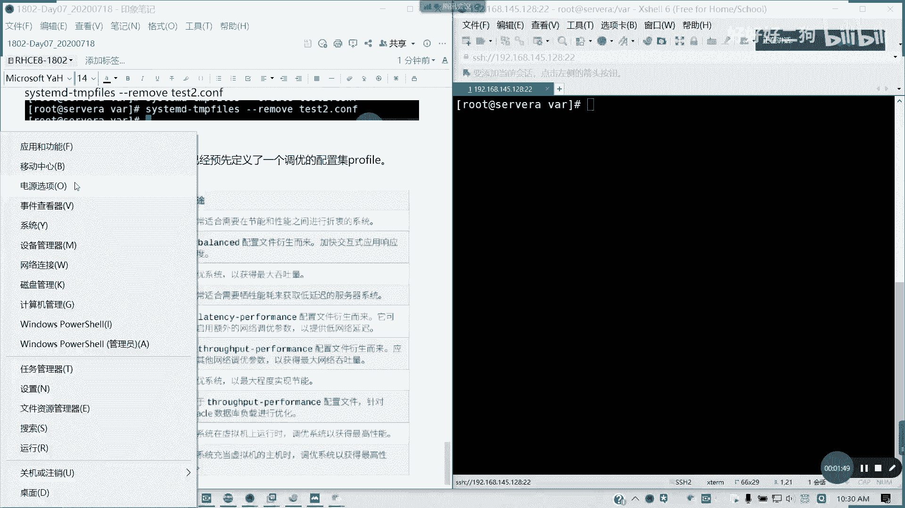
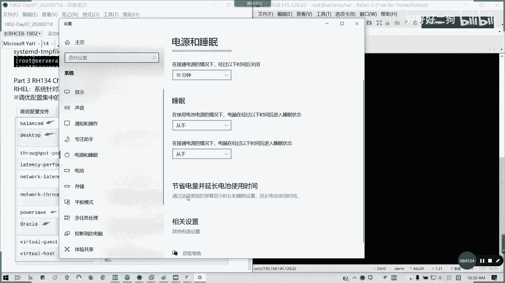
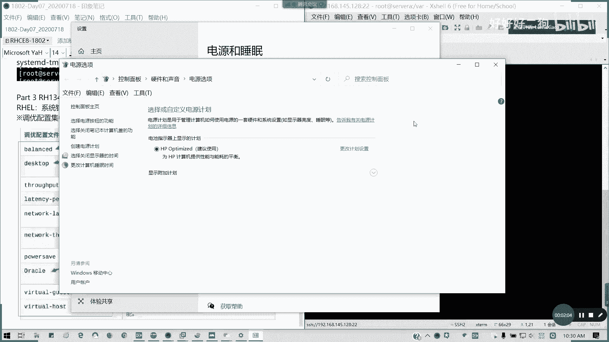
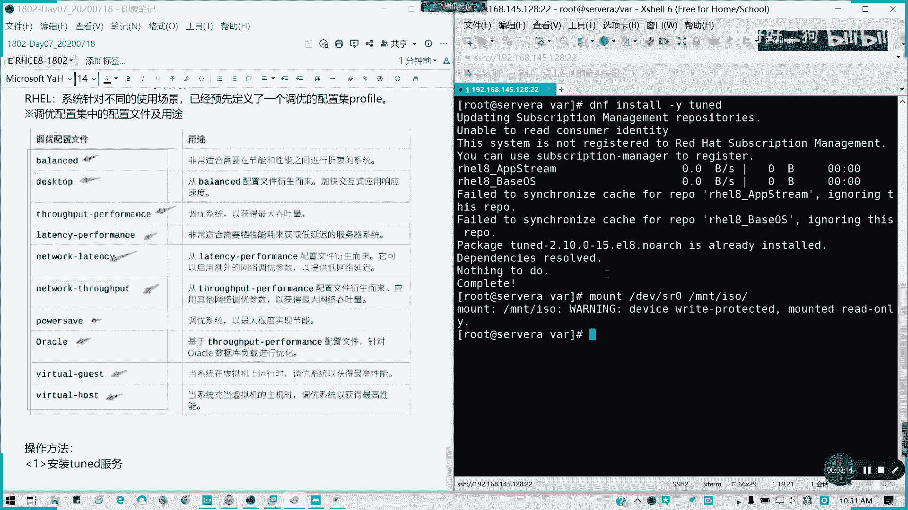

# Redhat红帽 RHCE8.0认证体系课程：P39：系统调优与文件访问控制列表

在本节课中，我们将要学习RH134课程中的两个重要章节：系统调优（Tuning）和文件访问控制列表（FACL）。系统调优是RHCE8.0新增的考点，内容简单但考试必考。文件访问控制列表则是之前学习过的权限管理知识的回顾与深化。我们将分别介绍它们的基本概念和操作方法。

## 第三章：系统调优

上一节我们介绍了课程的整体结构，本节中我们来看看第三章——系统调优。在Red Hat Enterprise Linux 8.0及之后的版本中，系统针对不同的使用场景，预先定义了一系列调优配置集，称为 **profile**。



这些配置集类似于Windows操作系统中的电源管理选项，它包含了一系列预设的内核参数优化方案，用户可以根据实际需求选择合适的配置集来应用，以达到最佳性能。



### 调优配置集（Profile）类型



以下是系统预定义的一些常见调优配置集：

*   **balanced**：平衡模式，适用于大多数场景。
*   **desktop**：桌面模式，源自`throughput-performance`配置集，针对桌面交互进行了优化。
*   **throughput-performance**：吞吐量性能模式，侧重于提高系统吞吐量。
*   **latency-performance**：延迟性能模式，侧重于降低延迟。
*   **network-latency**：网络延迟模式，针对网络延迟进行优化。
*   **network-throughput**：网络吞吐量模式，针对网络吞吐量进行优化。
*   **powersave**：节能模式。
*   **virtual-guest**：虚拟机客户机模式，为虚拟化环境优化。
*   **virtual-host**：虚拟机宿主机模式，为运行虚拟机的宿主机优化。



### 调优服务与工具应用

要使用系统调优功能，首先需要确保`tuned`服务已安装并运行。默认在安装某些服务器模式时可能已包含此服务。

**1. 安装tuned服务（如未安装）**
```bash
dnf install -y tuned
```

**2. 列出所有可用及当前激活的配置集**
使用`tuned-adm list`命令可以查看所有可用的配置集，并会高亮显示当前激活（active）的配置集。
```bash
tuned-adm list
```

**3. 查看当前激活的配置集**
```bash
tuned-adm active
```

**4. 查看系统推荐的配置集**
系统会根据当前硬件和环境（如检测到是虚拟机）给出一个推荐的配置集。
```bash
tuned-adm recommend
```

**5. 应用新的调优配置集**
如果需要切换到其他配置集，例如切换到`virtual-host`，可以使用以下命令。每次只能应用一个配置集。
```bash
tuned-adm profile virtual-host
```
应用后，系统会立即加载该配置集对应的内核参数。此更改在系统重启后依然有效，因为`tuned`服务会开机自启并应用配置。

对于RHCE考试和日常管理，掌握如何查看当前配置、查看系统推荐配置以及切换到指定配置集就足够了。这是一道相对简单的操作题。

## 第四章：文件访问控制列表（FACL）

在学习了系统性能调优后，我们回顾一个之前涉及过的权限管理高级功能——文件访问控制列表（FACL）。它用于实现更精细化的文件权限控制，弥补了传统UGO（用户、组、其他）权限模型的不足。

例如，有一个目录`/test`，其属主是`root`，权限为`700`。现在要求用户`user1`对其有读和执行权限，而用户`student`对其有写权限。在不改变目录属主的情况下，传统的权限模型无法直接满足此需求，这时就需要使用FACL。

### FACL基本操作命令

以下是FACL的核心操作命令，我们之前已经学习过，此处进行简要回顾：

*   **查看文件的FACL**：使用`getfacl`命令。
    ```bash
    getfacl /test
    ```

*   **设置文件的FACL**：使用`setfacl`命令。
    *   为用户`user1`添加读和执行权限（`r-x`）：
        ```bash
        setfacl -m u:user1:r-x /test
        ```
    *   为用户`student`添加写权限（`-w-`）：
        ```bash
        setfacl -m u:student:-w- /test
        ```
    *   `-R`选项可以递归地对目录及其下所有内容设置ACL。

*   **删除特定FACL条目**：使用`-x`选项。
    ```bash
    setfacl -x u:user1 /test
    ```

*   **清除所有FACL条目**：使用`-b`选项。
    ```bash
    setfacl -b /test
    ```

### 默认ACL与有效权限

*   **默认ACL**：可以为目录设置默认ACL（使用`-d`选项），这样在该目录下新建的文件和子目录会自动继承这些ACL规则。
    ```bash
    setfacl -m d:u:user1:r-x /test
    ```

*   **有效权限**：当使用`getfacl`查看时，如果条目后面标注了`#effective:`，表示该条目定义的是最大允许权限范围。用户的实际有效权限是此范围与基础权限（UGO）取交集的结果。

FACL的相关知识在之前的课程中已经详细讲解，在RHCE考试中可能会有一两道相关的题目。大家务必掌握其查看、设置和删除的基本操作。

---

本节课中我们一起学习了两个相对独立但都很重要的主题。首先，我们掌握了RHEL8的系统调优工具`tuned`的基本用法，包括查看、建议和应用不同的性能配置集（profile）。接着，我们回顾了文件访问控制列表（FACL）的概念和命令，它能够实现比传统权限模型更精细的访问控制。这两部分内容在RHCE考试中都会出现，希望大家通过练习熟练掌握。