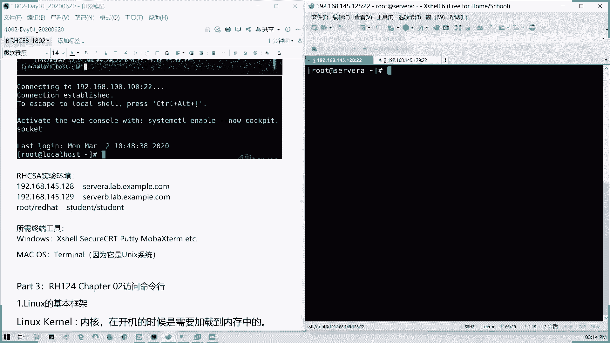
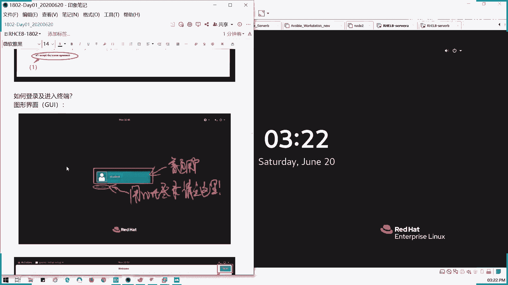
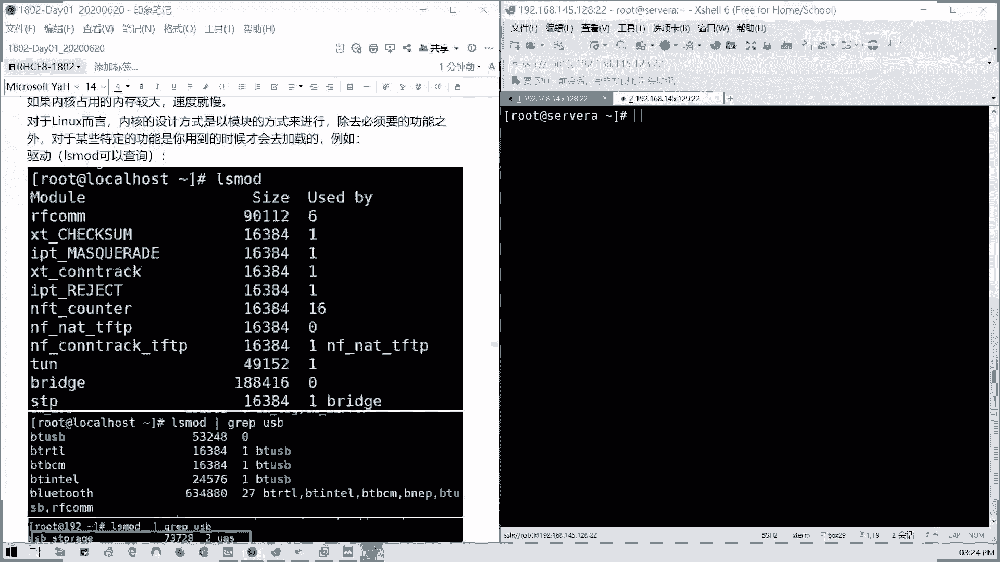
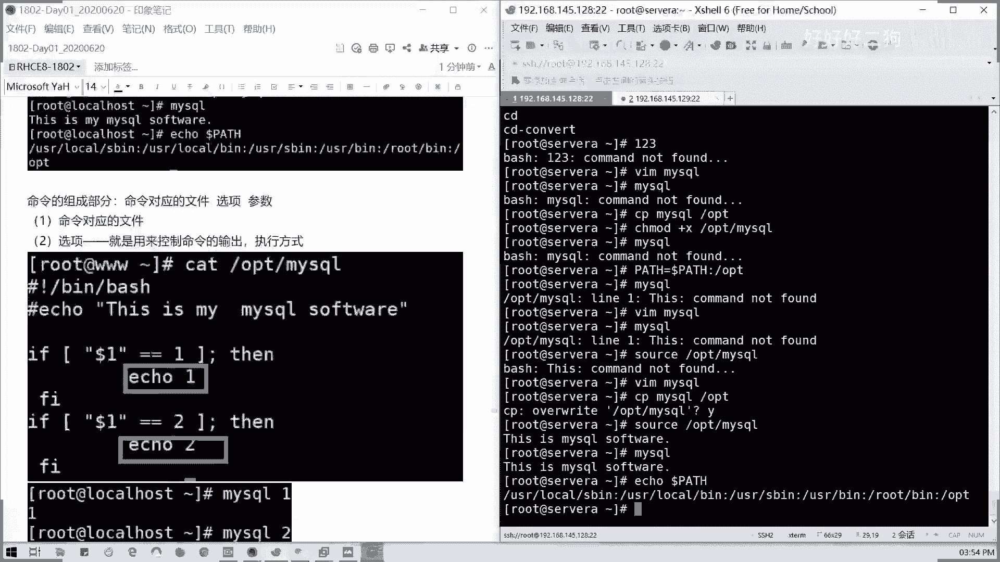
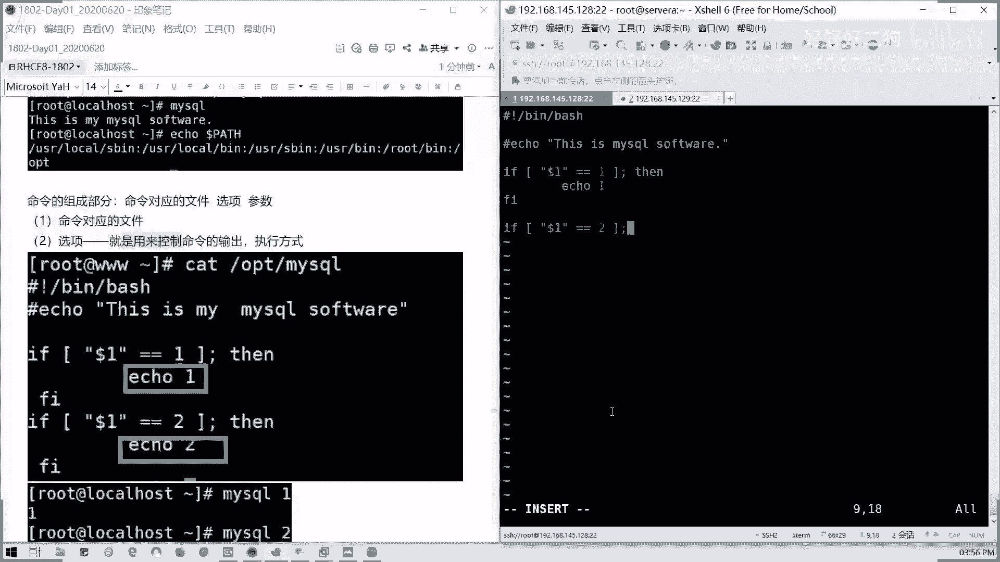
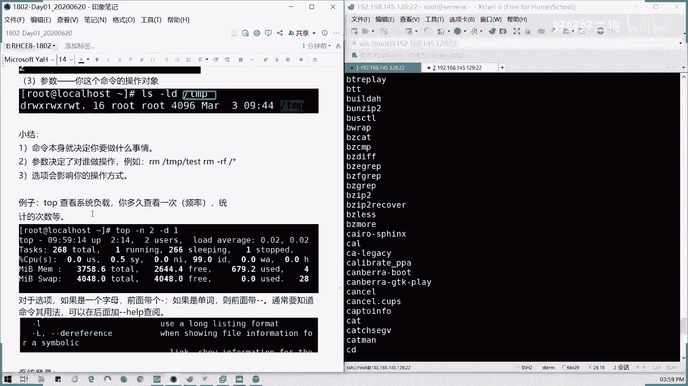

# Redhat红帽 RHCE8.0认证体系课程 - P3：3_Video_Day01_Ch02a_访问命令行 - 好好好二狗 - BV1M3411k77W

好抱歉啊，刚才浪费了很多时间，最近把网络的设位器啊给弄好了。所以的话现在我的两台新机的IP啊，我们这里我把它笔记稍微整一整我们。

刚才上面的一个，这是我这按照100。100这样弄的啊，100100这样弄的。然后我这边呢，我现在的那个IP呢是这样子的。

两台机器啊，搜以A点在别人 example里框，我们就写域名跟IP啊。我分别两台GIP地址，这样子，早上的视频呢是123，对不对？123那段，我这里的话我需午改成145。128。

先反正这满足我们能演示些，其他我先不管了啊。192。168。点145。5。129，然后是时B。对。点ex点ex这是一个完全合格域名，也就是我们说的FQDN啊，我们的一个完全合格的主机域名。

也就是它的完整域名。然后前面的servA呢servB呢就是一个主机域名啊。这首先为。我们的环境配置啊，我再打一遍啊，这里的话我就不在笔记里面呈现了。好吧，就不再大家发我们大已经发过笔记。

那我就不在里面更新了，我在这里写好吧，然后我们的用户名呢分别是我们早上建的啊，建的用户名，我们环境啊，等一下，我把环境，我们两台虚拟器。我们的HCSA的实验环境。自己搭的一个使用环境啊。

这里用wifi8，然后我们的用户名。密码分别是。Ro。密码是是 had。然后student我的密码是student啊，这是我们的CSA的一个循环境。我们自己内搭的啊，它自己字体的话老是不同步。

那我也是有点没办法啊。

我们所需的终端工具，比如说像我们叉C啊，secure那个secure CRRT啊，模板等等都可以。然后如果是苹果机器的话，我们是可以直接是吧？我们可以直接连过去的，对不对？

我们可以直接连到我们的苹果的话，直接右键右键特明罗，自己也可以连接了，对不对？那我们的哇那我们这个。windows呢我们借助它第我们借助我们第三方工具啊。

然后这里的话我们有大家都有都有插税或者是Q2RCRT之类的是吧？那我们怎么连接呢？

我们现在去拼一下啊，我们的两台主机168。145。128通的，对不对？那我们怎么连接呢？SHH然后用户名或直接写。

呃，6名艾特主机或直接写IP啊，主机IP也可以。因为我们这里的话没做硬解析，所以我们就只用IP地址。

然后提问这个提示服，然后他说啊未知的主机没，因为这台机是第一次连接，所以没有那个。建立信任关系，懂吗？我也就是我相当是一个陌生人，对不对？那好，我们点击我们接回车接受并保存。

然后呢输入我们的root密码。

对吧出现我们命令提示符，对不对？这是linux的命令提示符。

我们就可以进行连接了。同样我们的第二台机器啊。SSHroot哎192。168点145。129，这是我建立的第一台机第二台机器。

同样密码一模一样的这台是serv尾B。好，那我这边我我在VMware里面啊，我们这样我们在VMware里面，我们先做一下我们的快照。为了方便我们到时倒我们现在是网络跟那个都配置好，对不对？

网络跟我们的I主机名都配置好了。那我们这里的话我们就模仿我们的教学环境，我们这里先做一下快照，对吧？做一下快照，然后到时我们倒回来练习的时候，是不是可以相当回到这个状态，对吧？

回到我们这个刚开始部署好的状态，然后就可以反复的去练习了，好吧？这个是我们就手工环境的一个快照啊，拍摄快照就可以了。然后我们serv同样。

但我们教学真正的教学环境，实业环境里面是有恢复的功能的，马上就能重置的啊。

好，我们做快照做完，我们VMware这一块我们就不需要用它了。就把机器开着就行了，好吧？把机器就开着就行了。我们现在重点就是我们要开始我们学习我们的命令哈。那我们接下来看我们的第二第三今天的第三部分啊。

都稍微耽误了大家一个小时的时间啊。

第三部分啊第三部分访问命令行。访问命令行啊，就教大家一些linux基本命令以及快捷键。

我们这里插一句话啊插一句话说一下我们的。linux跟windows的区别哈，这里我们笔记里面有。我们的cental跟我们rehead的区别啊。首先rehead呢它是一个企业级啊，它是一个企业级的一个。

lininux系统一般用在我们的生产环境，对吧？很多人都会问这两个系统什么区别。那我这里就告诉大家，它是一个企业级的lininux系统，用一般用在生产环境。然后sOS呢。

它是一个community enterpriseter operating system。也是红帽的，也是linux版。如果它是一个社区版本啊，社区版本啊，社区版本两者区别是这样子。企业版本呢。他要钱。

对不对？他他有他有订阅服务，那这个订阅是要钱的。如果没买了订阅的话，它可以啊得到技术支持。但是我们CSOS是没有这个东西的，就就是说它没有任何的技术支持服务。因为它是一个完完全全开源的一个社区版。

虽然红包也是开源的，但是以它有部分服务是要付费的，懂吧？但是我们学的东西呢都是我们都可以啊用我们自己的啊，就是说自己方法，然后可以免费的使用。因为我们付费服务，我们暂时在C1这个涉及，我们不涉及啊。

不涉及，我们都是交能些公共的一些东西。然后像COS呢，它是一个社区版本啊，社区版本有些特性呢。它新的特性也会在社区版本发布，但是它就因为是新的东西啊，可能会新发布的东西可能会存在一些bug或其他什么的。

所以的话它呃在我们的红帽里面呢，它要稳定版才会发布。所以的话它就不包括一些新测试的一些软件。

然后关于我们的漏洞，我们的bug修复呢，在对于红帽的企业级用户呢，它是有那个400的电话啊，它也是最先响应的啊最先响应的。然后bug是它是一定会在社在红贸社区中进行公布。

但是然后通常呢一般会在较长的一段时间之后，我们的bug修复才会公布出来。但COSS呢一般来说都是社区社区的东西。它未先测试，但是不会说那个去就可能因为版本会出现一些不稳定情况，是不是挺有点困的，对不对？

然后呢，像我们的版本发布日期是不是一般来说，SanttoOS相应的社区版会比红帽晚半年啊，相应的会晚半年。现在最新的版本，红帽已经去到了8。28。2的话是今年的4月28号才刚刚发布的对。

但我们现在考试呢基本上都是用8。0。然后。命令跟操作一模一样。两者啊两个系统两个啊一个社区版，一个企业的应用的版本。两个版本的话，我们的命令操作是一模一样的。所以大家不用担心说啊。

我现在学了hab enterprise。然后我在我担心我我到时我在企业里面万用的cent怎么办啊，其实不用担心啊，这两个是都是在鸿贸公司下面，只不过它是属于不同的一个应用范畴。

但是它的代码底层完全一模一样。但如果像呆啊，还有无邦图啊。是吧我们的命令是不是有所差别啊？特别是你们用惯了像深度的像UOS是吧？d啊，这些的话它是有区别的。比如说像安装软件包。

还有我们网络配置都是有差别，对不对？但是我们这里的话，我们主要讲我们通用的Gnulinux红包系统。然后刚才这些配置我们都有啊，这些图里里面都是。

觉得比较OK的。然后对于我们的一个。桌面啊桌面我们看到笔记，我们也看可以看到自己的啊自己的一个VM上面我就不再展示了。它左它桌面呢右边是一个控制功能区，中间是显示你的简短的日期跟时间，对不对？

然后左边是活动，也就任何的图标都在这里啊，任何图标都在这，桌面7。0，你还有图标的，但8。0空荡荡，什么都没有，就是一张墙纸，对不对？这个壁纸，这个是8跟7，我们桌面上最感官最直规最直接的一个区别。

它图标藏在哪呢？对不对？我们点开activities，这里就有个tmin，对不对？

然后呢，我们除了图形界面，我们还有一个字符界面，字符界面啊，字符界面怎么切呢？啊？通常我们来说，比如说我们像我们设为A啊，像我们设为A的字符界面，我们拉开来，像现在是图形界面，对不对？

我们按ctrl加alt加F2到F6啊，通常说它就切到我们的字符界面了，字符界面就相当于这样子，我们通常在企业里面没有装图形界面情况下，是不是这样。

对吧那此时我们要登录怎么办呢？我们就输入我们的用户名跟密码。

它是一个多用户的多用户多任务的系统。所以的话它是可以在同一个用户是可以在不同的终端登录的。它这里相当是一个啊，我们是一个相当是一个啊字字符终端里面的一个叫做虚拟终端吧啊，这个终端。

我们这里是在实体机登录的，就登录成这样，对不对？

然后回到图形界面，就是cttrorl加alt加F1啊，F2到F6呢是一个字符界面来的。所以它最多呢我们如果是在相当于我们直接这种终端界面，就相当于我们直接接显示器接键盘鼠标，对不对？接键盘。

然后我们就可以直接控制的，它最多允许有6个界面。那么后面会讲到啊，后后面讲到。我们我们继续回到刚才那边，我看看上午的部分有没有部分，我还要有没有东西，我要再补充一下。这图在我们的那个。如何登录啊。

如登录我们图形界面来。哎，没看到我哦，不是我另外一个窗口啊。

像字符界面P就我们叫PETS对不对？PTS我们的那个字符终端就是这样子。然后用名密码输入，对不对？我们的图形界面大家应该都知道啊，图形界面怎么登录是吧？我们一般来说显示的是普通用户。

然后如果是root的话，麻烦先点一下这里是吧？

我虽然我的那个当时用笔写的有点潦草啊，但是的话大家应该都知道啊，我们点那lock list，然后输一后密码就可以了。

然后刚才配IP地址应该都知道啊，我就不再讲了，就如何去联通我们机械。到我这里是话是有点刚才稍微翻了一下车啊，又把它又又把车从水里面捞回来了啊。

好，我们讲一下访问命令。好。这里字己有点大，我调成14啊。我们首先来讲一下我们linux的基本框架啊，linux的基本框架。如果更新笔记的话，我会待会再发一版出来，好不？

我们首先来讲一下linux的基本框架。

大家能听到我声音啊，听到声音的话啊，扣个一哈。我看我看一下现在情况正不正常，在群里面扣个一啊。😊，现在我这边是正常的啊，我我们把我把那个叉这边我们也重置一下。

拉过来，我们现在是分别是128跟129。那么现在看一下访问命令行这一这一块。

鼠标有时候蓝牙会会自己自己断掉啊。好，我们首先要了解一个叫做linux kernel，我们叫内核。内核是什么意思呢？也就是说我们操作系统的核心部分，它是在开机里面是要加载到内存中的。

如果我们的那个内存我们占用内核占用内存比较大的话啊，内核。

占用的内存比较大的话。到速度就会变慢，对不对？因为你就朝向你是吧？你一个水桶，你装你装你没装水的时候是就很轻，对不对？但你装的水装了很多水之后就变慢。那我们是不是内核里面它也是有各种组件的，对不对？

各种组件。那如果你装多东西的话，那自然你的就对吧？肯定会变慢的。对于那个水而言呢，它内核是啊，哎，怎么又又变回来。

等一下我回到这个地方。

回到这个地方啊。对lininux而言呢，它内核的设计方式就是以模块的方式来进行。除去必须我们必要的一些功能之外呢，某些特某些特定的功能它是会在按需需要时候才去加载的。比如说我们的驱动，对不对？

比如说我们驱动啊。

像我们这里LS mode看一下L mode是查看我们当前啊，当前我们在系统里面所有的加载的一个驱动啊，像我们一些像我们USB是吧？我们USB我们的那个U盘U盘是不是我们需要的时候才去加载。

我们当前没有插入U盘的设备的时候。是不是没有，对不对？只有那个蓝牙，对不对？我蓝牙这里已经开了，有几用的。如果你插入U盘之后呢，你会发现啊，我插入U盘之后呢，等一下啊，插入U盘之后。

我们才有一个叫USB storage出来。但我这里就不插了哈。如果插入U盘，你连接到你的虚拟机之后，它会自动加载啊，自动加载1个USB的模块。它这种是按需的，懂我意思吗？

就它启动时候不会默认加载这些模块。比如说像你的U盘模块，连USB的模块就这样，因为它不需要用到嘛。那然后呢，还有一这个是一个内核啊，内核还有一个就是说我们的驱动这一块这块是怎么一回事？

然后接下来我们还有一个叫KVM。调到最大声，我我的我估计的那个声音的话，我是这样这样可以吗？最大声啊。然后呢，像我们的KVM啊，KVM怎么用呢？KVM呢它是一个基于内核的一个虚拟化技术。

当你的虚拟CPU啊，我们的虚拟CPU里面的虚拟化。这功能启动之后呢，它KVM对应的内核模块才会加载啊。所以我们刚我们一开始让大家把KVM模块打开啊，把我们的那个虚拟化打开。

那我们看一下我们的驱动有没有加载，我们的KVM。这也可用gra是相当截取啊，截取我们获取我们KVM部分是不是有了，我们这里是KVMintel，对不对？都是这样的，你这你这是AMD。

所以的话对应的虚拟化模块打开之后，AMD的话它是加载了KBM下划线AMD的模块，对吧？in特是英特的模块啊，这2块是有区别的。但其实我们用的差不多，然后还有一个呢就是一个shall的概念。

surell的话它是一个安全的一个壳啊，相当于我们交互界面，它的作用呢是保护内核，还有人机交互，对不对？它是相当于往内核运些的东西，我们用一个壳把它罩起来。对啊。😡，起到一个保护的一个作用。

就是它只我们人机呢只是通过shall跟我们的内个leas进行一个交互的，而不是说直接去进行对话的，好吧？它是有一个中介，相当于shall就是一个中介，明白我意思吗？然后呢。

shall的类型啊sha的类型有这么多啊，我们通过catETC shells里面可以看到我们的有4种类型，是不是四种类型？通常呢我们这四种类型的，包括跟SS都是啊sha类型的一种啊catTC。

我们看一下当前的系统的有的sha类型就4种啊，4种，这是指给给大家演示，而不是实际的那个操作什么。我们常见的shall呢就是我们bash啊bsh只我们bash界面。然后它比如说像我们的红帽。

我们的dora，我们的seto s都是啊我们所接触的我们的shall呢都是学习它的一些功能啊，学习怎么样去人机交互，也就是通过shall，我们去执行什么命执行我们需要的命令完成我们的运维工作，对不对？

明白我意思吗？有多同学如果不明白的话啊，如果有疑问的话，随时提。那好，我们接下来看一下我们的怎么叫shall脚本呢，是吧？我们既然拿到shall的界面，那我们。什么叫需有脚本啊？

需有脚本呢是结合sha功能，然后以及我们的结构化语句，比如说我们的判断循环分支等等，是不是？结合我们所我们的结构化语句去编写的一些程序啊，编写其的一些程序，这像我们这幅图一样啊，我们人的话去接触。

我们我们接触我们的indux系统，它肯定不是直接接触内核的，懂吗？对吧？这这块是inux内核，然后还有各式各样的一个组件，对不对？各式各样组件。那我们是怎么通过它去交互呢？

通过这一层对吧？我们的一个shall，我们的一个外壳。然后通过外壳呢，我们去刚才说了，通过外壳我们去比如说接触一些内核，然后还有就是跟进新文所需的操作，而不是说直接制成没了，直接就这么弄啊。

这么弄的话是非常危险的。像hello world这些就是我们一个小程序，对不对？我们编程会只需要的。然后呢，说到linux，我要说到一个开源问题，对不对？

所谓何谓开源呢？像开源呢，我们不等于免费，只是把源代码公开啊，只是把源代码公开，对吧？它不等于免费啊，针对个开源软件呢，我们是可以随时随地去使用复制修改跟传播。但是呢你不能说这个开源软件是你的，对不对？

懂我意思吗？它还是有一个著作权的啊，所谓开源叫copy left啊，如果是版权左有我们有一个英文叫做copy right，对不对？一个复制右跟复制左复制左的话，就相当于我们是它是一个开源啊。

就是说你可以任意修改复制，但是你不能说你。除非你这个软件自你写的，哪个模块是自己写的那其他的我们是我们都是说调用，对吧？除。😡，对吧如果开源的话，他有一个协定，就是你做你对他做了二次修改，同样也要开源。

好吧，开这是开源里面的一个规矩啊。除非你仅仅是调用接口，那你就随随便使用，对不对？我只用它的一些接口来完成我们一些任务。然后我对这个开源的软件，我原封不动。懂我意思吧？😡，的话，它也是一个开源产品。

我们的红帽，对不对？所以你在官网上我们随处都可以下载到我们的镜像，对不对？我们的红系统镜像，那随便用啊，对不对？它靠的是技术支持跟服务，也就是我们订阅来收钱啊，一个公司你没有你完全公益，完全开源的话。

你就活不下去，对不对？但是你通常我们有有有一些啊，你随便又没问题，但是你有问题，你花钱啊，对不对？你要钱我才给你服务，对不对？不然的话你你你这个人你你这这个这些服务支持的人，那你还不如回家洗洗税。

对不对？明白我意思吗？你给钱我在服务，对不对？这也是相当于一个劳动劳务报酬，对不对？然后呢，对于linux呢，它这个称呼呢，是仅仅针对于我们内核啊，如果没有完整的操作系统。

我们叫上午讲的一个GNU杠ux。称呼呢才是一个完整的操作系统，包括它的内核以及附带的软件及工具，仅仅是一个内核，我们不能称为系统是吧？他要带一些工软件跟工序，才是一个完整的一个集合。能明白我意思吗？

你当一个内核，你就是一个相当一个大脑对吧？我们人的大脑，那你这那你能叫他是个人吗？对不对？我们还有四肢，还有那些像器官等等是吧？还有这些心脏等等，就你进入个大脑，你行吗？一样的道理，对吧？

像我们GNU啊，早上说了啊，它是一个自由的操作系统，它是以那个公共许可证的方式发布，然后它是类似于unice，对不对？像unice的话，一开始啊它它一开始它是1970年发布的啊，1970年1月1号对吧？

我们其实69年，然后它是将1970年作为一我们unice开就是正式开始用使用的一个时间，所以呢我们为什么有一个叫unice实验戳，对吧？我们实验戳1970年1月1号，对不对？然后从这里算多少天。

知道这意思吧？有这样一个东西啊，叫unice实验戳，然后呢，unice是1970年发布的，最开始是开源的，后来它也不开了，现在是一个。商用闭源的一个系统，它不会你可以用，但是你要给钱。

然后而且他也不会帮你公开源代码，也不会公开源代码可以用，对不对？像我们GNU呢，它是一个软件和内核一体的计划。软件呢比如说像我们的那个。GNU编辑器是吧，然后内核就是我们操作系统的版本，对不对？

像我们这里的话，我们的U name杠A是吧？我们显示它是一个GNU杠linux，那证明它是一个这才是一个完整的系统，对不对？我们现在8。0的版本号是4。18。0-80啊。至于版本号。

我们后面会在软件包的时候解释它是它是一个怎么样一回事。我们大家先知道一个。概念就行了。像因为unux闭源呢，所以linux托瓦斯呢，它是托瓦它是那个linux，它是一linux创始人，对不对？

在91年的时候，它开发一个内核，然后形成了现在的一个linux系统，这是一个来龙去脉，简单的一个来龙去脉。大家应该都明都理解明白啊，但这里考试不会考这些啊，考试不会考这些。

我们接下来我们要了解的是一个这一部分的一个重点，叫linux命令行。linux命令行，我们要提到一个best shell啊，best shell什么叫b shell呢？命令行呢是基于文本的界面啊。

它是可用于我们像我们的那个计算机，我们输入我们指令啊，输入我们指令。然后呢，那个命令行是名叫shall的程序提供，也就是它是一个壳，壳里面通过命令跟我们的系统跟我们内核进行交互啊。多年来呢。

它已经为shall程序呢开发各种选项，而且配置不同的用户来使用shall。但大多但是我们大多数情况下，我们使用默认设置就可以了。在我们红贸企业版linux里面呢。

提供的mod认 share呢是GUNU born again share。所以的话它的一个简称叫做shall best啊BAH就是叫GNU我们的一个公共开源的一个组织。

它二次开发的一个shall外壳外壳懂吗？然后它是跟unice类似的，在操作系统使用的一个最成功的一个改进版sha的改进版本，也我们也叫做bon share啊。bon share，也就是叫SH简称。

如果我们在交过是使用券的时候呢，他在等待用户命令书的时候，是不是有个字符串啊？就类似我们这样，是不是？然后如果是普通用户的话，比如说我们切到我们的stu用户。

我们普通用户的话。是不是他的。默认提付的结尾是一个美人符号啊。那我们root用户呢。它就是一个井号，懂吗？它是个井号，则提示符就是。user啊USER我们用户at主机。

然后这里的波浪线是代表它的当前的工作目录，我们也叫加目录，懂吧？也就相当于我的文档啊，就是说我原以前windows下我的文档，然后我们用户的一个文件夹，对不对？懂我意思吗？

这就意味着不管你通过什么样的一个方式去连接你的操作系统，首先就会触发一个shall程序，对吧？也就是我们的命令行。命令行呢，它就是提供了一个基于文本的界面。

比如说我们现在我们可以看一下我们当前的用过PS对不对？我们PS首先看到我们当前启动程序肯定是bech。

对不对？肯定是我命令好，不然的话，你这个贱名怎么来的？我想问。怎么交互啊？那我们能难道直接我们要运行命令，完完全这我难我们不通过一个界面，那怎么去传达到呢，对不对？

命提示符啊，我们的这里root路ot and logogo host啊，我们可以看一下啊，它的提示符是开开源于我们的PSE的一个变量啊。所以我们e一下我们的PSE。A口的是一个操作系统命令。

它是不是显示了下面命呃我们的提示符的一个它的一个变量来的，直就就是我们提示符的一个变量，它是直接读取这个值。当然我们也可以自定义这个值啊，但是我们通常使用默认。然后这个啊PSE变量的一个含义啊。

PSE这个变量行业当然看到看看懂我这个就是说我们做的一个草稿吧。他是这样啊，就是斜前面斜杠U啊，叫斜杠Uat斜杠H斜杠W，然后后面是一个提示符。首先我们斜杠U呢是当前登录的一个用户。懂吗？我们提示符啊。

我们可以我清一。我清一下，重新再a一下PS1，对吧？我们可以对照一下我们当前的一个当前的一个那个登录提示符，对不对？我们斜杠U也就是我们前面的root，就是当前登录的用户。懂吗？能明白我意思吗？

我这边我打一下笔记啊，打一下笔记给给各位啊，us个斜杠U at。斜杠H。然后斜杠大W，然后后面跟着一个提示符号。斜杠U就是我们当前登录的用户。比如说我们这里的root。然后艾是吧，用用户在。

杠H是主机名，一个简短的一个主机名。比如说像那个。local host点local domain。比如说我们的设尾A点leb example点com，它就会显示我们前面一个简短的主机名。

比如说像serv为A，对不对？然后。后面的斜杠Wwork directory，我们称之为工作目录，也就是我们的当前目录啊，当前我们存子所在的目录，就比如说像我们的C盘windows这样，对不对？

但这里的话，它只会显示当前一级的工作目录，而不会显示所有的路径，除非你是自定义啊？如果是那个。波浪线代表的是你当前用户的加目录，对吧？你一登录进去的话，它的用户一个加，也就是它的文档存放的一个位置啊。

所以称之为加目录，懂吗？那后面的多了是一个提示符。提示符呢像这里啊。多了代表普通用户井号代表超级管理员root。然后后面的命令就是我比如说我执行一个我我要执行一个文件是吧？他就是就去运行一个文件。

前提你这个文件是有执行权限啊，前这个文件是有执行权限，这个明白吗？就是这个提示服务的一个含义，明白吗？远程的同学明白吗？有问题可以提问啊。我讲到4点，稍微休息一下，讲到4点。因为我们下下课的话。

大概我们5点15分左右啊，5点15分不会超过5点半。这块明白吗？明白的话，远程请打个一啊。然后呢，我们的那个远程的同意请打个一，然后呢现场的没问题可以举手啊，有问题可以提问，有问题吗？没问题举手。

举手没问题，举手有问题可以提问。好的。现场的都没有问题，远程的看看你们。我们搞懂这个提示符它显示来干嘛的，不然的话你后面是一头雾水，对不对？

是吧我们这里也解释了root，比如说我们root and go啊，root是当前登录系统用户艾是在，也就用户在加目录啊显示格式，你就直接编辑我们的1个PSE这个变量就可以了。加目录就是我们用户加目录啊。

就是我们用户工作的默认工作目录。

比如说。啊，我这里我拉过来啊拉过来给大家看一下啊。比如说我们的root用户，他的账目录在哪呢？root用户就是在。

跟下跟分区下面的root跟挂在点下面root，然后我们的普通用户。

对，homeus没错。

ho里面的用户名。有区别的啊有区别的。但是你可以定义自己的加目录。这个后面我们再讲用户。

跟组的时候，我们会讲到。呃，ho ID做一个标识对对对，没有严格命名规范。但是你们企业来说啊，对我们生产环境它是有一套命名规则的，就每台主机它有固定的一个名字的对不对？有一个固定格式。

这是企业里面然后在我们实验环境呢，就我们就啊约定俗成我们在一个点 example点com点域这个域里面然后我的命名就是为对不对？我们的命名规则，我顺便解答一下李东阳的问题，还有其他问题可以提问吗？

可以提问啊，O啊知道了知道的话，我这边我继最小话，我继续讲好不？像这个百度点控最左边的它主机名啊。

最左边的它主机名，比如说我们这里点百度点com，那最左边主机名是3W，对不对？它不会显示全部，后面是一个域名，懂吧？然后波浪线当前的目录就是工作目录啊，工作目录也就称为加目录。

然后刚才的root的用户登录是用井号多了的，就是那个普普通用户两者出现时呢，我们这里整个出现时的时候呢，我们是要就是要输入命令了。那何谓命令呢？什么叫命令，命令呢就是一个文件，就是一个可被执行的文件。

比如说叫叫叫windows点BATT啊，对吧？点EXE呀点com吗？就是执行一个命令呢，就是相当于我们去运行一个文件，对不对？当我们运行个命令，就是找到它所对应的文件。

我我们在linkux里面是一切接文件的。我们在下一章我们会讲到一个如何访问一个文件啊，如何访问就我们的整个系统的文件架构，我们会讲到。那么如果如何找到这个啊文件呢，我们就通过pass变量啊。

我们多了开头的都是变量，好吧，系统变量，我们可以ele是吧？多了pass，我们可以看到我们。他这里定义了我们所有的可执行文件的路径。对不对？可行文件路径默认有4个userUSR，这里不叫user。

这是一个环境变量的那个缩写啊。USR里面local的SB，然后还有USRlo里面并是吧？还有USUSR的SB以及USRB啊，还有一个root下面的并目录，总共是5个可执行文件的变量，全部在这里。

当然如果你要追加的话，你要追加到这个pass变量里面。

比如说我们找到啊。我们找到一些命令啊，我们看到啊。

我们这这里userUSRloc里面并的话是没有东西的。然后里面的S并也是没有东西的那我们看一下USR里面的S并。

是不是一对命令啊？对吧这些文件，那只不过他们是一个可执行的文件，那我们运行我们那个。

执行一条命令就相当于去找这个文件去执行它。懂我意思吗？像我们的那个USR并里面也是一堆文件，只不过是可执行的。我们可以摸一下看看。

对不对？很多啊。

很多命令是吧，这些AWK啊，包就包CD啊，切换目录这些都在这里面，对不对？

明白了。

那那如果命令不存在，如果在这几个目录里面，我找不到证明，你比说随便执行123，是不是他会提示说你的。

comm no对不对？也就是我在这几个啊默认定义的程序，我们的执行文件的目录内啊，没有找到我们要预测的命令，它就会提示一个baash。然后你输入的这个命令没有找到，懂我意思吗？

那如果啊我不像我们没有装myCl的时候，是不是myCq同样也是com no，对不对？

那我们针对我们去我看一下啊，大家有没有提问啊？

对，加入pass没错，加入pass就可以了。怎么加呢？我们在这里会有说啊，我这里先继续把继续讲啊。当我们执行一个命令的时候，它会在pass变量里面去找命令同名的文件。所以呢我们要将那个。

我们要将那个啊。如果要执行它，你就敢把这个可行文件所在目录补充到我们pass里面，对不对？怎么补充呢？我们比如说现在我有一个那个。马赛克命令啊马赛克命令我们现在没有。

没有找到是吧，没有找到。那我们先比如说我们现在的话执行一个文件，我比如说我这里我写一下myseqq里面的内容，对不对？

比如说这里我就写VIM我们调用一个编辑器啊，这会到编辑器我们会讲的，比如说这里叫做this is my。

myacq software就假定它是一个它现在是一个文本文件啊。

所以朋友们见我们这样直接执行是不行的，对不对？那我们现在的话，我们比如说我们的放在啊。

我把我把这个文件我先复制到。myqq啊这个文件，然后我复制OPT目录假定啊。

就OTB目录，然后我们CHMOD是吧？我们这个是我们加一个执行权限。如果你们有一定基础话，应该都知道我在打什么啊。

就把这个文件加一个可执行，然后同样我们执行这个是不是还是不行啊，他找不到吧，他没有加到pass变量，对不对？就他的路径变量没，那我们怎么办呢？

我们就临时定一个pass，对吧？等于pass变量里面，然后加一个。pass变量，然后再1个OPT。临时加上去啊。然后我们现在。哦，line one啊，我们少了一个beanb啊。

我们这里的话我们要写一个写一个，不能直我们不能直接写，就直接写这样一个内容啊。我们要写一个相当一个脚本啊。

解首先解析器。

bb，然后我e一下东西。我就直接显示啊，ele知道吧？就是。直接在屏幕上输出输出我们的内容，好吧。

这个是我们的一个小一个事例啊，echo一下这个程序。我这里的话相当个补我补充截图一下好了。

我们的。my circlecle啊假定我们mycircle内容啊。

然后将。

mysqq添加到。他在than you所在的路径。

杠OPT。添加到我们的pass变量里面。

这字体又是变10号。

怎么加就是直接最行pass等于多了pa，然后后面OPT。那我们现在编辑完之后，我们用WQ啊，我们编辑完配置文件是漫画WQ退出，对不对？保存并退出。然后保存完之后，我们再执行myscle。

哎， line one this哦。

我还要送死一下我。

就让内核强制堵血。诶。

有问题吗？哦，我现在编辑是本地的mysq。那我myq这个东西，我们CPmyqq然后OPT目录。

覆盖。

我们执行sourcemyq对不对？相当于我们执行就执行了，对不对？那我们直接输入个myq是不是我们已经可以了，对吧？

我们添加到了一个pass目录。那我们pass当前是怎么样的呢？是包含了我们1个OPT啊。对，就将OPD加入到我们的可执行文件的一个目录里面。那出那以后我们就直接抢我们写一个写完一个脚本之后。

是不是可以自定义啊，就自定义我的一些自己写的东西，我可以放在指定的目录里面，然后到系统来调用，对不对？我们刚才写的是简单的一个echo，也就是一个简单的一个b的脚本。我这个脚本就写到这里，好不好。

就原来笔记没有我做一个补充。然后命令呢是吧？命令啊命令我们这里的话命令组成部分啊，我们也是还是通过这个这个脚本，我们来补充啊，这个这来来说明命令的一个作用。我看一下大家问题。

0时1出一个路0出一个路径啊。临时10Q个路径，你自己想一想是不是可以编辑的变量，我把它去掉，对不对？把它去掉，这个可以自己想一想啊，我不我这里就不再说。可以自己考虑一下。

不是说有些问题都要问个清楚的啊，有些东西自己查一下，可能。百度一下，估计你也不知道。对不对？

好，我们继续看一下我们的那个命令的组成部分。命令呢有哪些地哪些东西组成的？首先是命令对应的文件，对吧？我们执行命令刚才说的是执行一个文件，然后后面是带选项。

参数对不对？选项参数。比如说我们刚才。我们命令对应的文件，然后选项呢就是控制命令的输出跟执行方式。我们继续编辑一下我们的OPT里面myCq这个我们自己写的一个。

命令，然后我这里加一个脚简单的一个脚本啊。

我们这里加个注释，那证明我们这一行是不生效的啊，现在注释不生效，前面是声明解析器。然后现在这一行我把它注释掉，然后我简单写一个需要脚本。

这里以后我们语法会教啊，比如说我们多了一，后面的话参数是那个多了一。

多了2多了3，我们命令本身是多了0。多少一。等于一啊，就是它的值是一，然后呢。

值它如果它的值是一，那我们输出一个一。

然后后面我们就带上FI啊，我们的那个if脚本。如果需要脚本的话，记得if它后面是有个反写当结尾。

然后比如说我们多了一我们的第一个参数，然后到这个值等于2。那。

执行什么呢？我们就输出一个2。

Apple。2FI。

对吧我们写完之后会发我们会这一个例子，我们看到啊我们的命令是怎么执行的啊。

my circlecle一操作显示一个一，对不对？

这是一个参，后面我们的命令，后面带的是参数。好吧，指定的参数，但每个命令的参数不一样，这也只是我举一个写的一个土例子啊。

懂吗？命令本身我们叫一个多了零，它本身也是一个参数，只不过它是第一个，所以从零开始，所以叫多了0。所以后面的我们第一位后面它跟着一个参数，我们叫多了一，然后在后面的话是多了2多了3这样子。

下去明白我意思吧？啊，O。

然后参数呢是什么意思呢？参数就是我们的操作对象。比如说我们要列出我们这个目录的权限是吧？我们L我们看一下TMP对吧？LSLD啊，杠杠LD然后TMP那这个TMP呢就是我们的参数，也就是我们的操作对象。

到底我们要对哪一个目标，我们我们要操作谁，对不对？

像这个TNP就是我们的对象，对不对？我们命令的使动的对对象，也就是我们的参数啊。

行。前命令，然后选项对吧？我们前面这个麦多了一多了是我们的选项，就是控制的执控制命令的输出执行方参数执行方式。然后我们的第三个才是参数，懂吗？选项是控制我们怎么去执行这个命令。参数呢就是我们参数。

我们对命令执行的对应的目标。

可以明白不？

群里面啊看看有没有有有没有明白这个事情啊。命令选项参数，我们的命令的构成啊命令的构成就是这么多。

所以我们小结一下啊，我们下面有一个小结。这些都是一个基础啊。

我们小节呢这里有个小节，命令呢就决定啊。决定你要做什么事情啊，命令就决定你要做什么，你要做什么事情，参数字决定你要对谁去进行操作。比如说我们这里删除一个文，删除一个目录或文件，对不对？我们对谁进行操作。

然后选项是影响我们的操作方式。明白我意思吗？OK像我们例子，top是吧，我们top查看我们的系统复载。如果你们做为这种行为应该都会看用到，对不对？那后后面比如说你多久查看一次，还有你的统计次数，对不对？

懂吧？在这里top杠。杠N是吧，杠N代表我多久查看一次，然后每每隔段时就查看几次，对吧？然后杠D是代表你多久才看一次，对不对？对吧。就他就刷新两次就退出了，对不对？所以后面的话它是top的话。

它相当于是张专是我们的一个选项，对不对？杠低啊，杠N啊，都是我们的选项，对不对？就它就影响我们命令执行的一个方式。那默认来说就是那个3秒钟刷新一次，然后一然后一直不断的刷新啊。

那top mini我们后面也讲。对于选项呢，如果是一个字母，那前面带个杠就可以了。刷新就是刷新我系统负载情况啊，这是top命的一个用法。正好家。后面我们会讲到进程管理的时候，我们会讲到这个top嗯。

然后呢，对于一个选项呢，对我们命令的选项，如果它是一个字母啊，它是一个字母，那就前面它就它就带一个。一横杠如果是完整的单词，那就带两个啊，带两个横杠啊。如果是完整单词带两个，如果就选对于选项来说。

然后我们如如果不知道我们不知道我们的命令的选项的用法呢。比如说我们top这个命令，我们不知道这个选项用法，我们可以杠杠helll，对不对？可以帮助，对不对？然后还有就是那个比如说我们的LS杠help。

它列出很多的东西，对不对？还有例子懂吗？所以我们包括我们在学我们在学习linux，包括我们考试的时候，linux是有天然的帮助。考试系统不会移除这些东西的。

所以我们在第三章我们简要提到如何去查看帮查看帮助啊，就也就是说你们考试就可以理解成一个半开卷。它如果不会命的话，你可以临时查一查，对吧？那好，我们讲完这个命令的构建方法之后，我们先稍微休息10分钟。

然后我们4点101015分钟吧，我们4点15分讲一下我们的系统登录啊，系统登录的一些方式啊，一些一一些方法方式，然后如何切换，大家可以上一下厕所。

