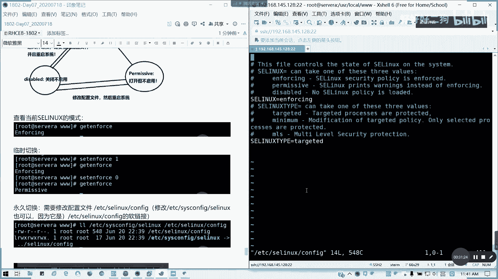

# Redhat红帽 RHCE8.0认证体系课程 - P40：40_Video_Day07_RH134_Ch05_SELINUX - 好好好二狗 - BV1M3411k77W

好的各位，我们讲第五章c linux。

我们通常的我们这里的话，我们配合一下我们的http d服务，这里的话我一个前提准备。

通常我们要确认我们的http d的这个服务，我们安装，我这里是说了一个例子啊。

如果没装啊，我们这里是用它来做例子啊，先准备，然后呢，我们，那我们要把这个服务启动是吧，我们只在八的话是可以用enable，然后刚刚闹的那七的话就拆成star，可以两个命令对不等同。

我前面有个图，我先截一下。

那么此时呢我们去测试访问啊，所以此次测试访问的话是不是否定等啊，当时我们加了个按参数，就是我们直接访问里面文件夹了一个首页，内容方式没有，对不对，这词怎么办呢，我们看一下我们的进程啊。

我们的现在首页什么没有。

我们看一下我们的进程，我们发现我们的那个我们的http http d服，是不是阿帕奇的，对不对，然后开启用户，那我们接下来我们创建的用户呢，创建的一个主页文件呢，我们现在是假设我们现在没有主页文件的。

我们现在所有的他的他的那个hdp，它的那个用户是阿帕奇啊，那我们现在创建一个首页文件，我们直接，切到我们的document root，对不对，它默认装完htp d http d服务特色菜。

vr r3 w h tml，会去建立这样一个目录，对不对，我们的网页的一个默认的document root，那我们要创建一个文件夹里面直接用v i m，然后呢我这里啊。

比如说我就写这个hello linux。

那此时我去访问的话，就他是反架，跟他杠i是返回一个状态嘛，懂我意思吧，返回一个状态嘛，然后如果不加杠杆的话，是会返回一个文件内容，然后当前因为我们root的话也是可以的，当前我们的数组是root。

对不对，因为它为什么可以呢，因为他对那个其他的一个用户，它是有毒权限，这样我们阿帕奇是不是属于其他组的用户，对不对，有毒权限它就自然能够访问了。

但是我们这里又扯到一个。

安全性的一个东西啊。

我们接下来要讲到加强安全性的访问啊，这是我们测试的一个前提，加强全性访问呢主要是讲的是fc news，我们对于普通的权限呢，那么对于普通的权限诶，怎么变斜底了。

我们对于普通的权限，主体是用户对吧，客体呢这对于我们这个文件啊，比如说我们的我们创建的test uc还在不在，没有这用户啊，我还test user在不在，也没有test一有啊。

比如说我们的test一这用户，我们对这个课题，普普通权限的话，通常它有读权限就可以了。

对不对，像我们这里的话，阿帕奇也是一样的，阿帕奇他对那个，对我们的那个index html是不是可以读啊，它因为它不属于他的手组组，跟那个所有者跟组嘛，那他是不是对其属于其他人啊。

那你本身具备r全线就已经可读了。

doc news呢，比如说，对sdd说我们如何去增强权限呢，我们来来弄一个这样一个场景，我们主体变成了一个进程对吧，所以变成进程啊，而不是具体的用户了。

那么客体呢，变你还是文件对不对，还是文件对不对，那如果sn news呢只是一个安全性橡胶，是什么意思呢，安全性向上什么意思呢，只有客体，的安全性向下，符合主体的安全上下文的设定的时候。

这个主体才被能够允许访问这个客体文件，明白吗，就你要满足进程的一个安全性要求，而不是文文献用户的安全性要求了，所以有时候呢我们如果我们现在的这个安全，这个文件夹安全下限我们是符合的。

比如说我要我是指我看一下啊，很简单，比如说我的那个http d，我这我这我这网页服，我放到另外，我指定另外一个文件夹，一个普通文件夹是吧，然后我的那个安全上限如果不符合条件的话，它也是不行的。

我可以试一下啊，什么document root是吧，因为这个文件夹不存在啊，我我我要尝试下一个场景，就我改文件夹，我又从普通选普通普通的范围，创建文件夹的时候，看看我们这个网页还能不能被访问。

这个稍等一段时间，他这里我这台机器在虚拟机，我启动这个http t服务非常的长啊，大概大概几十秒钟，要等一等，好了，因为刚才我是文件夹不存在，所以他才报错了，我在在在这里再建一个，应该是点html文件。

同样写的同样内容，你看我建的那么防外，它现在显示是默认主页，这不是我们写写的内容了，它显显示403嘛对吧，c3 ，然后它显示是一个默认的首页了，那这访问的不是我们的内容啊，对不对，对不对，我们没权限。

懂我意思吗，为什么没权限，安全上下文的原因，我这里啊，假定，那这把改一下啊，我先请你模拟第一个，我将，等一下我把那个配置文件调出来。

我就改这一项。

这里的话是cat break出来内容，而不是我原本是就我原本是用v m p d系的，应该懂吧，把它贵不出来，我修改了哪个部分，懂了吧，可以明白吗，我这样怪不出来之后我重启我的http http t服务。

我们再再贴一遍吧。

一脸懵逼是吧，为什么我移到别的文件夹不行啊，我我我我的意思是要这么我要这么给大家讲，为什么我移到别的文件夹都不行呢，我在b r3 w就可以了，我这实验场景要说明啊。

我明明我写的这个文件，我们有什么遗漏文件夹，我就不能我就我就不能访问了，对不对，大家想想什么原因，其实就是我们的上下文没有对应对吧，我上下文没有没有没有，跟跟我们的进程是不一致的啊。

我们的我们的用户的话root，我哪怕我把它改成阿帕奇，因为他我们知道它的进程是阿帕奇嘛，对不对，阿帕奇用户跟我们组对不对，我再次访问也是一样，为什么我改目录，我把那个document录改了都不行。

同样403，对不对，这号加是不是还在一脸懵逼中，那其实呢我们就要关注到一个安全上限问题了，我们刚才是不是讲了一个概念，你要他的，现在他的一个主体是进程的懂吗，他的那个安全性的主体是进程的。

那我们来看一下进程的，我们的http d，我们的安全，我们的上下文加了一个大z，就查看s news安全上下文啊。

它的安全上下文是h t t p d下划线，踢它的类型啊，我们注意到它的类型，前面是用户角色以及类型啊，它的类型是h t t p d，那我们的，对吧，那我们我们来看一下我们的本地文件的。

本地的文件安安全上的微信，或者我们查查那个目录的也可以，所以它的类型是不对应的呀，它类型是usr我们的百姓思维杠t对不对，我们的http，我们进程要求它的安全上限的类型是http这样t。

但这也是u s r gt，像我们立我们原本课件是admin home，他以为他现在这个根目录啊，它的一个安全上下文类型，u s r t，这我想打太多字了啊，结果这次塞不下了，看能不能把它拉大一点。

能知道原因了吗，它的类型，它进程所要求的一个上下文类型，安全上下文类型跟他不一致对吧，所以就会产生它的产生报错，比如你这个文件不是我不是我是进程不能访问，在sn linux开启的情况下，懂我意思吧。

如何解决，我们看我们后面再看啊，这个就是实验的一个模拟啊，我们这里的加强安全访问，我再看一看啊，看一看我们的这一块的内容，这块内容的话，这是一个前前眼啊，这是第二个，那我们来讲一个s news。

一个模式，我们在讲这个如何去解决之前呢，我们先来看一下s news什么模式，s60 系现在系统里面的一个增强型啊。

c news叫做我们前面啊叫做增强系统啊，叫做安全增强的一个配置啊，安全增加一个配置，sd怎么简单，这么理解，懂我意思吗，就相当于它里面再做一个安全设施，然后呢我们s linux的启动与关闭啊。

我们来看一下s linux的几个模式，几个模式呢通常我们在系统默认安装的时候，如果安装的时候呢，我们系统安装的时候呢，我们可以看一下，所以我默认安装设置force，但是我们在企业里面啊。

在很多企业运营里面，为了避免什么冲突啊，或者是因为sn news造成不良影响，通常都是把通通把它关闭，对不对，你们是不是你们是不是，如果在企业里面是不是这样子，很多都是在特别在六跟七里面。

为了避免它带来的负面影响，统统把它关闭，但是考试不是考试，是要求把它启用状态哦，inforce都是强制的，所以其实你们如果学了c linux之后呢，你们也可以知道为什么刚才会出现这种情况，对不对。

就他因为他类型不类型不符，或是其他的一些原因，导致你这原本如果你在正常，我们在关闭的时候，是我们能访问这个网页文件，但是实际上不行，对不对，所以等会我们要了解一下sd，在解决这个问题之前。

我们先了解一下sd是干嘛用的，就是这个安全增强一个配置，然后它是有三种模式，一种是打开cd spring启动，就是我们的enforcing的模式对吧。

还有就是一种permissive就打开，但是它只记录不启用叫permissive允许的模式，然后还有一个就是关闭不喜欢我们的disable，对不对，通常呢我们临时切换是吧，临时切换我们这种呢。

只要郑和的一种，只要任何一种模式切换到disable了，就disable，跟任何一种模式切换的，你都需要修改配置文件，并且重启才生效，这对吧，要把它禁用，对不对，禁用或启从禁用启用或是从启用里面。

我禁用c news，是不是要重启啊，修改配置文件，然后重启系统哦，当前是不生效的，然后如果从我们的enforcing，我们的强制使用到我们的只记录，或者是两者之间切换呢，我可以不需要重启。

我可以临时切换，然后是永久有效的话，我就修修改做临时切换就可以了，这是s6 s3 种模式的一个机制，懂我意思吗，所以通常你们在企业里面，是不是在企业生产环境里面是不是禁用的话，是不是要重启啊。

包括任何一个版本都一样，所以这里呢我们要教大家如何去查查看看模式，像我们通常我告诉大家，考试里面他的一开始的设定的一个c news模式，绝对不是enforcing，绝对不是啊，他要求他的一个要求。

就是说请确保你当前的主机，我需要以控制主机是inforce模式，懂吗，考试大概的一个要求是这样子，那我们现在是enforcing啊，查看，当前c linux的模式用get enforce，然后呢。

我们一个临时切换教大家啊，原版课件没没写这么详细的临时切换，set enforce，对不对，setting force，一是enforcing，那set enforce 0呢是permissive。

懂吗，我们发现是不是没有一个disable选项对。

然后如果要修改配置文件啊。

需要修改配置文件，dd c sa linux，config，为什么这里我要列出来一个两个文件的对比，因为它是一个软链接，其实我们修改两个位置都可以，但我们习惯了啊，就修改它的最终文件。

有没有发现它是一个软链接啊。

修改etc cs confifc linux也可，因为他是，这个配置文件的，软链接，对吧，那软链接我修改两个，哪个都生效，对不对，懂我意思吧，我修改软链接，然后怎么修改呢。

主要看到啊，修改的话，我们只需要修改这一行，就是我们的c linux z等于这一行，这行呢它上面已经有有我们的注释啊，说明它的值的用途，像inforce呢，就是我们的sence安全策略是强制启用的。

对不对，我们这这一块这一块已经是这一块啊，我用别的方方框的颜色扩起来，这块他已经说明了c linux它的它的那个用托，对不对，然后下面这个是它的类型，就是它的保护类型。

那下面它是一个目标啊。

或者怎么样，我们就不用管它的，我们只需要管上面，下面的话它是就是说它的c d4 类型，它是一个就是目标进程会被保护或者最小化，对不对，选定最最小化，然后还有一个多级别的。

但是我们这里我们先不涉及这个这个东西，我们这边设计的话就是一个开关，如果。

我们这里的话是enforcing，对，如果我们要改的话，就改这一行。

不是在这里截图啊，禁用sa linux，修改为。

s10 ，等于disable，保存退出后重启系统，这次我调大调为14号吧，如果要禁用的话，记记得是要重启的，如果是调其他就不用啊，permission，这就不用了，如果是disable的话。

我们来试一下。

然后当前我的吕布刀吕吕布它我们看一下，我们是我们的那个切回来看下我们的思维。

如果这里的话，我们做这里的话，它可能会要求重打标签，就从从那个从信用的关闭是不用的啊。

然后如果把它再次启用，从禁用到启用啊，到强制启用，这force，然后呢，另外的话就是允许启用纸记录，等于permissive，那我现在我重新连过，这样我是进入状态，我把起重新启用啊，不稳定吗。

那应该不会啊，这就不会了，因为早上他也是这样，再改一下，我们就改成enforcing。

学c news可以帮助我们很多东西的，只不过我们是那个企业里面是嫌烦啊嫌烦，然后把它禁了。

然后如果是那个刚才说的，如果是那个只记录的话，就permissive。

好我现在改成enforcing啊，就现在的话我是从disable改过来的，改成inforcing。

记得这种状态一定要重启，看一下。

看到没有，他偶尔我们从我们从禁用到从到企业用的时候。

它会帮我们重打整个sx标签对吧，包括以后我们改密码的时候也是需要的，就改密码到那个重打标签，我们可以让系统帮我自动，从而标签就为了避免s news出现的一些问题，所以我所有的话会出现这个选项是正常的。

它会对这个文件重新进行sn标记。

对这个过程还是有点久的啊，大概，然后他如果有冲突的话，它会用系统推荐的一个类型啊，别标签类型，这是为了这是因为安全的设施起见啊，那如果这只读的话，read only的话，它是不会倒是会跳过的。

然后打开标签，他会再重启一遍。

懂我意思吧，这一步啊就如何修改s news状态。

这个是考试和要求的这个这个如果知道的话。

请打个一如何修改，然后它的一个整个过程。

如果从disabled到enforcing的话，是要这样子的。

然后呢，接下来我们来看一下，如果。

问题就是我们回到刚才的，我们刚才这是不是标签不一致啊，类型不一致，对不对，那我们要怎么做，我们来看一看我们的做法，在sd是启动的情况下，我们用的最多的一个方法呢是按，如果不一致的话，怎么处理呢。

我们可以把这个，安全上下文类型，我们把文件安全上下文类型修改它的默认值，修改默认值怎么修改呢。

我们重新登录啊，我刚才是不是发现那个user usr，local里面的那个w3 w index html，我们加杠z是吧，是不是我们的安全上下文类型不一致，我们前面那个用户决策跟那个优先级，我们不管。

我们就讲那个安全上纤维类型，它现在是不一致，对不对，怎么修改呢，sd manager f contest，修改安全上分类型，默认的安全相对有类型，这样a添加添加我们的一种类型啊。

这类型http d我们要，让我们的那个网页可访问它的安全上位类型，按照上下文类型叫做，我还是放在这里吧，http cs content gt，然后后面跟文件可以看得清楚了吧。

c o n t e n t r，我们修改它的安全上下文，默认安全上下文类型，这里的contest是修改它的默认安全上下文。

然后杠t杠a是添加，杠t呢是类型，然后向后面的http d six content t，这是web我们的http d可访，就是说http d系的内容啊，然后跟文件，然后我们再还原它的默认上下文类型。

也就是意思是说我以后的设置这类文件的话，它会跟随着他懂吧，跟跟随他们设定的默认上下文来应用restore，杠r v，然后后面，那以后我们创建文件的时候，都是用它用这个安全上限的类型了。

那我们可以可以看一下l l杠z，事情诶我看一下啊，不对啊，我这图我先保存一下啊，先保存一下的位置，杠2v的话我们是要加一个路径的，我刚才没有设定一个我我没有指定具体路，就路径的话，我们没写好啊。

这样是要我要带带路径的，带路径才是最对的啊，这是http t的安全上限为类型，然后这里呢restore空杠2v是还原啊，递归还原默认设置，然后嘴巴显示出来，所以的话它会有下面一个结果，就从usr杠t。

他重打标签了，对不对，那我修我修改成这个，就刚才我们设定了，就当前的那个设定的这个文件，安全上线的类型的时候呢，我们可以把它还原，对不对，完成一个默默认设置，刚才设置默认我们并实际上并没有改。

懂我意思吗，然后针对目录怎么设置呢，针对目录呢，这个目录我们有一个通配符，比如说我要针对整个目录来设，那就是这样子啊，同样两个方法，两两条命令sc manager，同样是f contest杠a杠t。

然后呢类型后面跟我们类型，然后根据目录呢，比如说我当前，usr local 3 w是吧，3w然后后面我加通配符，就对它目录下面的任意子文件和子目录三项，我看你有有人有困难啊，对对子文件和子目跟子目录。

那么就杠点新是吧，问号杠点清，问号的意思呢就是对于他的那个属下的啊，这目录属下的子文件和子目录，都是都设定安全上限的类型为这个，对啊，我们这里是设定一个目录的杠点新闻号，然后我再再次啊r b。

到这个目录就可以了，它会把整个目录进行修改，这里我们知道如果这对目录的话，我们通配符啊，通配符要知道它是什么意思啊，杠点新闻号，它是固定搭配，也就是此文件子文件夹子目录及其，诶怎么这个音量好像不太对啊。

我们要提高一下，但是听到很小声啊，下面的子文件及，杠点新问号啊，这是通配符啊，然后我们再次对他进行还原，对不对，还原默认设置，那这样的话就相当于全部，全部应用了，要全部应用了，看到没有。

那这样的话我们如果设定完啊，设定完的话，我们的效果，我们的一个访问效果是这样子，我们刚才是不是出现问题，我们回到刚才的一个问题啊，回到刚才问题是不是我们刚才这个问题啊，就安全上问题不符的问题，对不对。

我们现在试试能不能解决，我们回到实验情景模拟的情况，我们来试一下啊，我看一下，现在我们改了啊，改了这个，我们看一下那个lol杠dj，现在是http cs肯定t了，那我们看一下这个文件也是一样。

那为什么不能访问呢，我们看一下是不是要加权限的问题，http t cs杠孔电梯啊，同403为什么呢，我看一下是不是权限问题，还是403，其实这问题弄完的话应该就可以解决了。

但这里403的话我们再看一看啊，我我看一下我doc文档设置，我估计我这里写多了一个横杠。

多了个斜杠，重启一下服务线。

我们在编辑这个文件的时候，我估计是多了个斜杠，887。

然后我们重启一下服务看一下啊，我们看看现在的情况，嗯还是我看一下，在主页还是不行，为何403，这权限我们要想一想啊，就是通常说我们是可以解决这个问题，但是这里403的话。

我们来看一下http d的配置文件，这个问题我们先解决这个设置方法先教给大家，那至于这个问题，我们中我们中午的时候再看看啊，我们说要看怎么回事啊，这个我先留空，我中午的话我再想想什么问题，然后呢。

如果我们要临时修改，临时修改的话，就用那个，change to call，change your call是吧，杠t h t t p d，如果说临时修改的话，特别是我们这种情况呢，是如果放到其他目录啊。

像我们为什么刚才是没有问题的呢，我们看一下我们的这种情况啊，我先给大家验证一下，他刚才为什么没有问题啊，就刚才我在没改document录的时候，为什么没问题。

vr 3 w html刚才的类型就是这样这个啦，刚才我们的类型他们在装完我们的http的时候。

httd的时候我们已经有，对吧，刚才已经是没有问没有问题了，刚才的为什么我们一开始没有问题，他的word上下微信已经改过了，懂我意思吗，所以这个我们待会再研究，我待会再研究一下，然后呢，如何修改。

当前只修改不修改默认值，我们用change to call，修改它的类型，我们修改这个u u r local是吧，3w然后index等html，就可以了，就如果是临时修改，然后我们也可以。

就是说我们按照目录啊，就参照目录来修改，就是用reference，刚刚reference就参照指定的目录，我们我们先验证一下吧，我们修改过了啊，修改过了刚才，然后呢，我自己截个图，这是临时修改的。

就不改变它的默认类型，但是他以后创建的还是这样。

然后如果我可以参照，就参照我们的那个修改的一个文件夹，用圈圈去靠，然后杠杠reference，比如说我们看到tnp它的这个目录，去修改我们的这个文件上下文也是可以的，大家看一下对吧，参参考的。

它是一个参照当前文件的类型值来进行定义的，他的参考这个tp来修改，明白我意思吧，如果杠用杠杠reference参数的话，是参考文第一第一个文件夹的安全上下文类型，来修改我们目标文件夹的一个类型。

懂我意思吗，然后至于刚才问题的话，我们待会儿课间我们会，我会看一看到底是怎么回事啊，使用参考文件夹的安全上下文类型，应用到目标文件或文件夹中，好这一块的话，如果明白的话，请请扣五哈，我第五章已经讲完。

然后呢，至于刚才的那个问题，我会去中午会去做一下实验啊，方法二，中午我也去做一下实验，把这个问题解决了，其实这个这个呢我们在特别是在我们的，我们如果web的话，我们特别是一些新的文件夹的话。

我们是要先把它的安全上升文类型搞定，大家可以啊，才不才导致不会出错啊，所以这个是第五章讲的内容，然后至于我们刚才的这个实验模拟情况，为什么会出现一个fb等呢，我中午会去进行一个调试。

然后下午我会告诉大家，可以吧，像我们就不再讲新的内容了，大家可以先我可以先把这个笔记，上午的笔记发出发出来，然后下午的话我们解决了这个问题，我们讲磁盘。

等一下还没生成呢，导出这需要一定时间，有了我先把笔记发出来给大家，就是到目前为止，我们包括上午的复习，1~5章的所有内容，然后至于一个问题，我们中午在初中午的时候我会看一看，然后当大家剩下的时间。

给大家做一个梳理及复习，因为现在要求说我们那个现在要求，我们开始要那个远程露脸啊，远程露脸，所以刚才开了一下，剩下的我们下午把这个问题我会出弄出来，弄出来，解决完之后，我们会开始讲第六到第八章。

磁盘很关键哈，磁盘的操作很有些人下面说他在呃，我上次有问过我的，就是连磁盘都不会搞的，所以的话下午这是重点内容，考试的话也涉及好几道题的，在七里面，在八里面应该也是至少一两道题。

