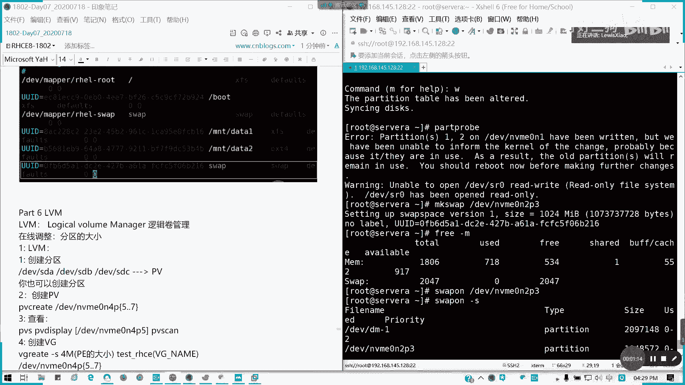
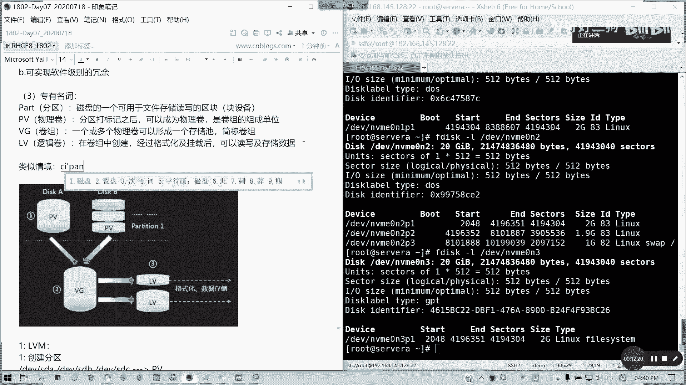
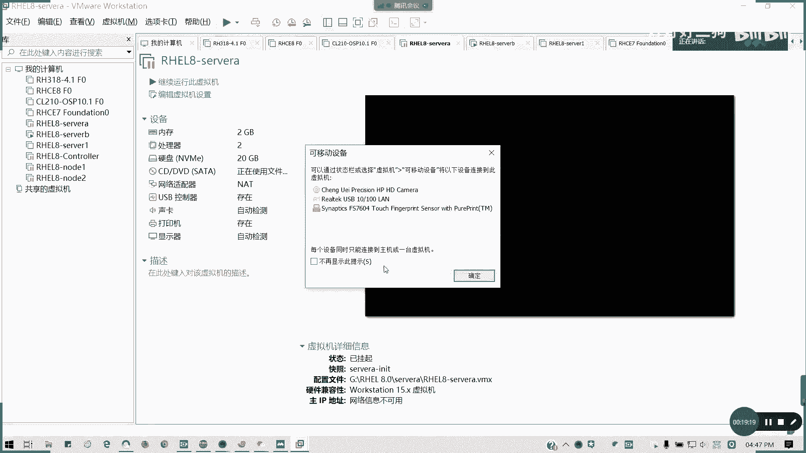
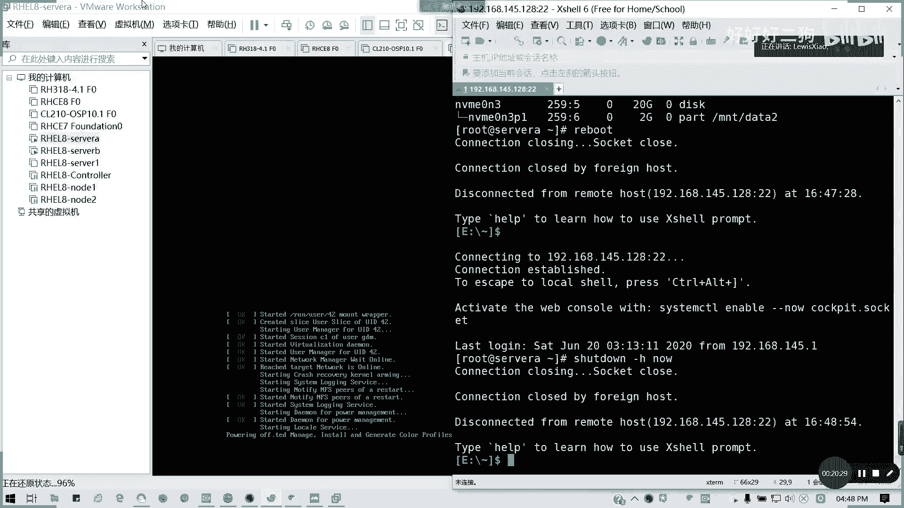
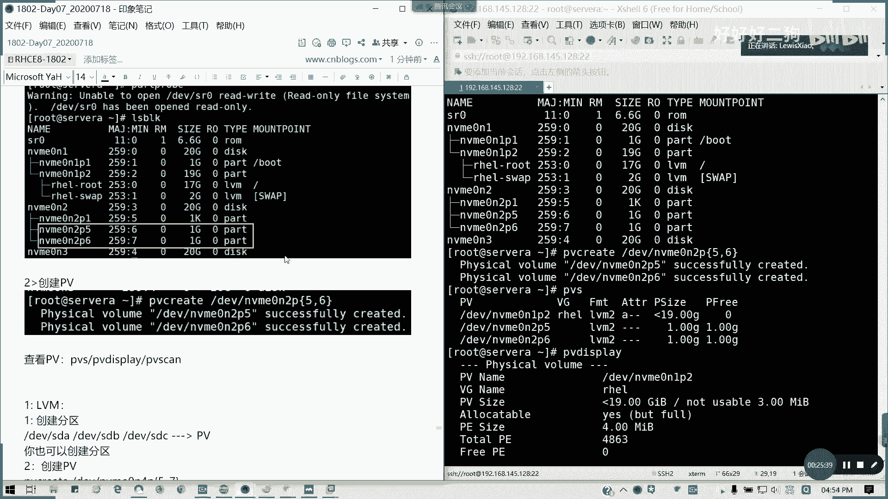
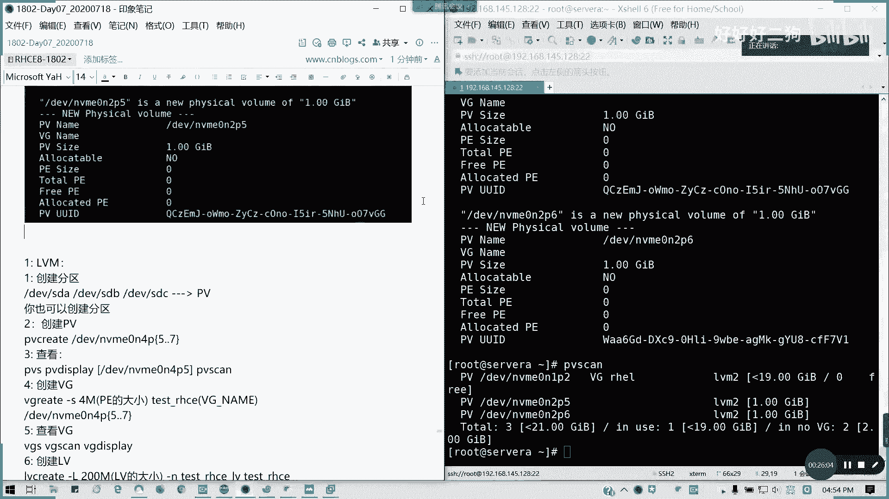

# Redhat红帽 RHCE8.0认证体系课程 - P43：43.Video_Day07_RH134_Ch07a_LVM创建 - 好好好二狗 - BV1M3411k77W

呃我们回来啊，我们回来，刚才我随便提了个问题，能不能多挂载点，挂载，挂载同一个就多多个分区挂载的同时挂在脸上，理论上是可以的，你也看也挂载到了，但是呢我想问你到底是个挂载点，我写在哪个。

写的是哪个分区的内容，我不知道啊，对不对，所以的话我建议大家规避一下哈，同时我也没这么操作过，我们分门别类建建目录，然后每个去挂载指定的一个设备就可以了，不要乱挂，你像这种的话。

我到底我写我是我是我在里面踏出一个文件，到底写在哪个磁盘，我不知道对吧，能明白不，不要这么不要这么搞啊，这么搞的话，到时候会搞出事的，实验室你的实验环境怎么搞都行，但是千万不要这么搞啊。

在现场环境千万不要这么搞，我怕了，好我们讲今天的第六部分啊，我看下还有其他问题要讲吗。

gb t啊，就还有一个刚才我们群里面说的啊，还有一个jj，第四个啊，我们同样啊sy分区我们任何都可以，但是麻烦大家，你们看你们在分区之前看一下fdisk gl，看一下我们到底这个磁盘用什么分区表。

懂我意思吗，可以后面可以跟分区名字的啊，对跟我们的词，我们的磁盘名字对不对，像n一是用的是a doors。

对不对，我们的disable type是dos，对不对，这n2 也是dos这样三就是gb t了，所以的话我们根据磁盘来，根据磁盘它的那个dislabel type类型。

我们词文标签的一个类型来进行操作啊，不要乱啊，不要说倒是一会dos，然后你把它弄成g p t，它整个分区表就没了，懂我意思吗，懂我意思吗，不要乱来啊，明白的打个一啊，真的不要乱来。

我们今天呢我们还有一个内容讲lvm lv，我们的逻辑卷管理啊，看一下什么鬼。

为什么根目录都写在m一下，对不对，md data 1，我单独的一个挂载点了，我单我单独的一个挂载点队友跟分区，我是他是这个root是吧，下面的i h l root，下一层吧，你可以往下往下走，对不对。

往下走的p2 里面往下走，对不对，我分区里面我可以建是吧，可以往下走的，但是这是整块磁盘挂，这是一个部分啊，就p2 的一个分区或分两个部分，一个一个放在swap，一个放root，对不对，也是可以的。

对不对，有没有问题啊，你分区可以画快的嘛，你可以作为一个软111个它是一个lv m，看到没有，我分区是不是可以mac做做lv n，这是我们接下来讲的，我们接下来讲的内容，一个分区里面我可以做一个磁盘。

我可以做分区里面也可以做逻辑卷，对不对，所以我不会特意做物理卷，物理卷变成卷组是吧，多个物理卷可以合并成一个卷组，卷组的变成逻辑卷，所以的话你要注意它是一个lv l，他这个不是一个part啊。

这是一个lvm精part，是证明它的类型是一个分区类型，但是我们的，我们这我们在那个root，这里是一个lvm。

对不对，逻辑卷，所以这个我们接下来我们来讲讲逻辑卷的是啊，我们盘一下逻辑卷那些事儿，叫logical volume manager啊，逻辑卷的管理，那逻辑卷呢我们要几个概念，逻辑卷啊，这是第一个定义。

马娟娟的意思，马娟娟其实就把逻辑线跟分区混一谈了，它的优势在哪，第一个可以在线调整分区大小，对吧，就是灵活嘛，我可以灵活分配，然后也可以实现冗余，就比如说我lvm其实可以做一个软件的。

软件级别的raid对吧，能明白吗，lvm的一个一些优势，我可以按需来，我来在线调整，不需要把它卸载掉，不需要把他那个怎么样，但在线调整的话还是要注意，仅限于增加你的删除的话，你这些你删除减小的话。

还是要把把这个对应距离线的懂我意思吗，不像我们普通的磁盘，我们定了就要调整大小，很难，对不对，好我们来看一看一些专业专有名词，这种名词首先我们来看一个分区都应该知道啊，分区是吧，我们分区是吧。

我们可用于读写的一个快设备，我们简单理解，还有接下来就是，p我们的，我们的pv是吧，物理卷physical value，分区我们打那个物理卷标记之后，可以成为一个物理卷啊。

物理卷它是一个是卷组的组成单位，懂吧，卷组组成单位，然后接下来就是一个卷子，就相当于我们是一个存储池来看，多个物理，一个或多个物理卷，可以形成一个存储池，简称卷组，懂吗，多个多个物理卷速度。

我可以拼成一个拼成一个词，对不对，然后还有一个lv，我们的逻辑卷。

在卷子中创建啊，呃呃在格通过经过格式化和挂载之后，可以读写跟存储数据，对不对，所以的话它是否则我们要建逻辑卷的一个过程，是这样子的，我看下有没有图啊，如果有个图的话，我就方便说了。

我就一个简单一个简单的图吧，这图够清晰的吗，这个图够清晰了吗对吧，我两个磁盘，我我比如说我整块磁盘，或者是我磁盘里面的一个分区，我可以作为一个物理卷对吧，打标签作为一个物理卷。

然后我这里物理卷我可以和多个件和合成，合成一个卷组，然后卷组里面再划分逻辑卷，然后每个逻辑卷用于，单独的格就在进入单独的格式化文，就挂载之后，我们可以存储数据，对不对，实现不同的一个功能。

也就是相相当于我们把存储进行一个整合，把把所有的比如说我们硬盘一多的话，把我们硬盘是吧，从把我们存储件重新整合之后，我们再重新划分对吧，这样也方便我们的一个管理，而不是说以前文零散的，其实它的类似。

它其实就相当于我们一个，类似于我们一个磁盘阵列对吧，类似情境主要成分店还不一样啊。

这个能理解吗，可以理解吧，各位啊，如果可以理解好，我们来开始做一个卷逻逻辑卷，这个逻辑卷，然后我们来挂载好吧，我们现在再生一个操作，我们现在的话，因为我们的nvn 12已经有三个主分区了。

那么接下来我也顺便讲一个，我们要创建扩展分区和逻辑分区啊。

顺便讲一下，我们接下来讲一个lvm的创建过程，先讲创建，后面再讲我们如何去在线调整它，lvi的创建过程，我们以，在d e v m v m120 n2 这个磁盘，我们可以把整块磁盘作为pv。

但是我这里已分区来做好吧，我们一整块我们就不把整个磁盘作为pb了，因为太浪费，我们以分区来做来，首先创建分区，戴安娜p5 gp 6，我创建两个分区吧，fdisk杠l。

我们当然后d v m v m m20 n2 p2 ，是当前已经有，and那是不是已经有比较p3 了，对不对。

赢到p3 。

对不对，所以到现在我们要创建一个扩展分区，因为主分区已经有三个，接下来需要创建扩展分区，不然的话你主分区，你就你这最多就只有一个空间了，因为它是一个n b r懂吗，它是一个n b r。

不是个g p t啊，所以这话我们来，f第四个，好然后呢我们按按这里选一哈，extended，然后把所有的空间全部，15个区全部给扩展分区，好吧，你扩展分区如果你用过，你只能在扩展分区内创建逻辑分区。

懂我意思吧。

只能在扩展分区内创建逻辑分区，所以的话我们就不如把所有的分分区分给他，分完之后呢，我们继续按，然后剩下的话你看all packpotify u，所以他自己帮我们加了一个low，最多话题是五，对不对。

然后分set不变，然后我们每一个分区，我们假设我这里我也给一个给一个g，那我再创建一个到六了，对不对，所以有一句话就是我们行列所知道的，逻辑分区永远的编号永远从五开始，逻辑分区的编号永远从五开始。

就是来源于这个懂吗，在n b r的时代，由z分区的编号永远从五开始，这里还是一个g好w，对吧，他fail to end。

因为system of resource is device or resource busy啊。

然后现在我们part的problem，我来我来把它那个把它加载。

然后接下来我们要接下来我们把它拍的prop线，好像是要重启，对不对，usp ok我看一下，好像是要重启一下的，不过重启我不知道系统会不会起不来啊，因为刚才那一个一，没事没事。

他现在还在一直在用用我们旧的那些啊，啊，我看一下看有没有问题啊，有点怕老爷不，我快照，不过我快照还好，没什么事情啊，我看一下，看拿烟了没事，我有快照来，这时候快照我就发上用场了。

回车就拿也没事啊。

我创建几个盘就行了，又回来了，因为刚才part动到分区了啊，所以真的part不能乱用了，好吧好吧，我这里重新把磁盘建建一下。

第二组有一个磁盘。

我重新建一下，要关机。

我加一块瓷砖就好了对吧，我这个磁盘就好了，因为我现在我其他都不。

我现在不用讲了，我今天就讲逻辑卷吧，就我只需要逻辑就行了，那我这里我加一个盘。

对啊，我把刚才步骤重新换图贴一下就行了，mmm 20 g，再加一块，然后开启我就问刚才我直接跳过swap这些。

我就直接建一建，我就直接建逻辑分区了，好吧，那那那就相当于我们把这个同步了。

好起来了。

还是这里啊，我们看一下磁盘f disco 3 l，是不是我们添加了新的两块磁盘，那我就a b a b0 n2 吧，还是他，嗯我直接创建一个一，20gb对不对，我模拟刚才的一个情况。

laser一个g对不对，哦不对，这什么，那我们看p一下是不是nbm 5跟六，那我们w对吧，好我们ios b可以看一下，45跟六都有了。

你看起死回生啊，这就是快照的一个威力好，我们看到我们有那个五个六出来了，那我们接下来第二个我们要物理卷，对不对，第二个是要创建物理卷，创建pv，创业pv操作呢就是pv有个命令叫pv create对吧。

pv create，然后直接dv我要多就多少个就打多少个，也可以有，我可以也可以通过我们的那个扩展，对不对，我们的通配符mv m10 n2 ，然后这里，五六对不对，我也可以，对不对。

这样的话我们通就把物理卷创建好了，然后我们查看啊，p v s或者pv display都行，或者pv skin都可以，最详细的pv can也行，他已经是这种转换成a v m。

表示其实它就在前面打了一个标记而已，就就打了一个如物理卷的一个标记，懂我意思吗。

p vs是吧，pv scan，pv display，还有pv cap都可以。

他有自己的ui d哈。

然后像。

如果是删除的话，就是pv里幕府为幕府，不过这个命令我就不演示了，因为我们现在要往那个创建逻辑卷的一个过程。

我们去推进。

然后接下来，我们逻辑卷完是不是要创建卷组了对吧，我们物理卷完是不是创建卷组了，我们这里呢，可以按照默认的一个卷p，我们有一个叫物理单元，物理单元就是我们的一个逻辑卷的一个。

我们卷组一个存储区块大小，所以这里我补一下这一个p e v，一个p一个l1 ，然后好一个l1 。

我要补这两个概念在这里啊，我接下来pv啊。

v g用什么vg create这个命令啊，我们如果不带默认的话，它是以四兆啊，每个区块四兆来定义，如果带杠s参数的话，我们可以定义我们的区块大小，在这里我就不不定一些vg create。

我们现在有两个物理卷，对不对，我要创建一个卷组，我们卷组叫做，v g0 可以吗，叫v v g0 ，也就是我们的v区的名字，这种卷子名字，然后后面你跟的是物理卷的，你你要你要哪些物理卷加入到里面。

我讲两个，然后如果加杠s的话，就是我p的一个大小，默认也是默认是四兆，我们这里可以自己定义啊。

对吧，这里的话我们是定义了我们的那个p的大小。

其实l一的话它是一个区块数啊。

好我们创建完一个逻辑圈之后，但这杠s我可以不带的，如果题目没说话，我们可以不带，然后查看vg呢，如何查看，v g s，vg scav g display都可以，都可以啊，我看一下。

我们规矩的话它有包含原来的h e l，那个他就在我们原来系统安装的时候，他就默认帮我们创了一个vg的。

对吧，然后呢如果要删除呢，pv vg remove，懂吗，这可以明白啊，然后接下来我们讲l v，我们在卷子上面，我们就可以创建每一个逻辑卷了。

创建逻辑卷，我们可以啊，用lv我们直接指定大小，或者是直接用p的数量对吧，数量来弄啊，比如说我这里的话，我创建两个逻辑卷，看一下lv create，杠大l我们指定我们大小，比如说这100兆。

然后呢前面后面跟的是我们的，我们逻辑证明是吧，lv一我们刚才是创造一个叫。

我们刚才创建了一个叫v g0 的对吧，那我们现在一个lv 0好不好。

lv 0，然后大小是100兆，然后呢后面是跟的是卷组名，就是从哪一个卷组创建的，记得这里要加杠n号和名字，杠n是吧，带我们的，卷逻辑，卷名逻辑名，然后后面带卷组名，或者是用单元是吧。

单元我刚才创了四兆一个，那比如说我创建一个30，对不对，我的数目30，其实我们的p一数，我们p一的数量乘以我们的个数，我的lv，我们我们的那个，l e的数量啊，这是l1 l一的数量乘以p v的大小。

等于总容量，懂我意思吧，然后我的名字叫lv，一两种创建方法都可以。

这是大小，这是名字，然后这里是一个卷组名，懂吧，从哪一个卷组创建逻辑卷，然后下面的这个呢，这是p一的个数，lv，l一垂p。

我截图截完了来两种做法都可以，然后呢，如何查看同样三条命令，l vs对吧，lv sk，lv display，三条命令可以查看。

av is display就有点长了。

甚至有很多详细信息的，然后下面这个是原本的系统里面，我们就不截图了，然后呢删除lv，lv remove也是一样啊。

然后接下来就是格式化挂载了是吧，我们创建完l v，是不是它就可以用来格式化跟挂载了，对不对，我们刚才到d到lv，第五步。

我们现在它也可以，我们直接格式那个dvd，就是我们路径是d v，然后他的卷组名再到逻辑证明懂吗，post map也是可以的，我们看看的l s p k，也可以这样子，对不对，设备名就是这种的话。

就刚才马俊是同学说的一种形式的，对不对对吧，好我们可以这样，我们来格式化了，格式化，m k f s，比如说全部插fs吧，我一个格式化e x f s，一个格式化e s t4 。

因为待会我说一下怎么扩容的问题，jk f s点差fs，然后d e v会我可以写这样子是吧，v g0 lv 0对吧，那我也可以，我看map有没有，map我这样子也行，对吧，两种形式都可以。

那格式化完了自然就挂载了，半路究竟我干什么用啊，对不对，接下去挂载，我直接写fs tab，过载的我们通常是用uid去挂是最好的。

你看ud全出来了，对不对，不用挂载，用map去挂，或者是用那个用我们的ui技术挂，我是直接uid，最保险的，把引号去掉，我这里也可以写，刚才那两种格式都没问题，然后呢我这里我的挂载点我还没写啊。

我这里就下载一个，比如说我的lv lv 0对吧，m t l v0 ，我这是这这是lv 0来的l v0 是差f s，default 0杠零，然后下一个u，等于号去掉上面怎么写，我就怎么用户画瓢，mt。

lv 1，这里是1x t4 default，零零。

建议大家用ui d去挂，因为这样的话我因为设备的唯一标识，所以的话不会出错，然后保存退出退出，我们记得创建两个目录，不能挂载点都不存在。

对吧，猫腿杠a，所以我们挂上了，对不对，然后呢，通常这个容量不怎么准，没关系，因为在考试里面他有说了，因为计算误差，所以的话他会给定一个范围，他给电源的范围就是从多少多少到多少，多少之间的范围是允许的。

他会这么告诉你，所以的话不用担心说哎，我明明白造，为什么95，因为他要占用这像我们像像我们通常的话，我们lv的话，它会减减它前面作为一个标记位对吧，一个单元作为一个卷组，或是作为一个逻辑性的标记位。

所以当时它会少掉四兆，懂我意思吧，少了四兆，所以的话这里是95，也是正常的，113也是正常值，没有太大问题吧，考试的单位是m i b哈，m i b或者g i b在叉叉mb，考试是有给就给你一个范围的。

你只要在你只要那个你空间多，在这个范围里你就可以了，懂我意思吗，这个就是我们整个lv的我们逻辑卷，从一开始分区或者是磁盘到我们的那个，到我们这，到我们的一个啊逻辑卷的一个挂载过程，如果明白了，请扣y。

有问题可以提问，有没有问题，现场，没问题，休息一下，我们稍稍后继续啊，继续我们讲那个，你不用创新p p也可以的，可以跳过这个步骤啊，那跳过的话他就直接相当于打标记了，但是我们这是按部就班来啊，走了。

你再说。