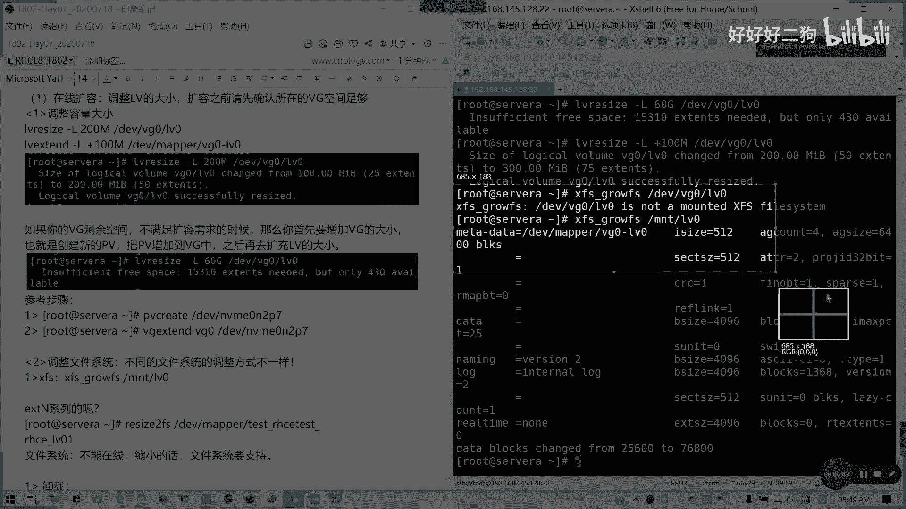

# Redhat红帽 RHCE8.0认证体系课程 - P44：44.Video_Day07_RH134_Ch07b_LVM调整 - 好好好二狗 - BV1M3411k77W

好在线扩容的话，我们来讲讲一下，在线扩容的话，其实就是在线啊，调整我们楼梯间的大小，对不对，调整大小的话，其实呢我们可以用一条命令叫lv reset啊啊，lv resize或者lv extend都可以。

extend是相当我们是通过是lv extend来做，lv resize也有这个命令啊，然后corresize的话也可以，或者lv 3扩容的话，我们都可以，比如说我这里的话。

我现在我这个v区是有空间的啊，但错误之前，请先确认，所在的vg空间足够，对吧，所以我们我们可以有两条命令啊，这lv resize是一个命令，然后这里我们就那个bg 0 l v0 ，假如说我要扩到200。

我们上次创建100兆，就我个号200，对不对，我用lv resize杠l200 l d v v g0 ，lv 0或是map也可以，对不对，这扩容我们还要去扩文件系统的啊。

我们这里扩容的话还是扩容机系统lb resize，我们可以用lv instead也是一样的道理，增加，或者是我可以用加l对不对，加l100 兆就说增加多少，对不对，增加多少，我们也可以同样用这条命令。

我们可以用map，对不对，vg 0，lv 0，懂吗，两条命令我随便用一条都行，我们以前是习惯用lv instea，如我们的vg的剩余空间，我的vg剩余空间不足以满足空满，不足以满足需扩大需求的时候。

不足以满足不满足扩容需求的时候，那我们首先是要增加微距的大小，也就是创建新的pv，把pv加到vg里面，再去扩充我们的逻辑卷大小，这个能理解吗，比如这里的话，我直接我扩到，60g是吧，我明显不够的。

对不对，那是不是我们要先去扩vg啊，在这里说话就相当于我们要v g td，对不对，这里的话我们可以创建一个nb m10 ，比如说像n2 p7 啊，我这命令打上去的，我不演示了，大家可以去自己去试验一下。

然后vg extend，我这里的是扩展网络，一个v g0 ，大事不做啊，这是第一步而已啊，第一步，这仅仅是第一步，我们还要调整文件系统，由于你扩大之后，你这块地你还没有审批，不能用，对不对懂吗。

这不能用，那我们还要扩大文件系统才可以啊，这扩大文件系统调整的话，这个第一个是调整l v大小，加100兆，我记得是杠l，我试一下，也可以啊，是加100兆，没错啊，加100兆也是可以的啊，诶断了吗。

网络断了啊，稍稍稍等一下，ok应该连连回来了对吧，好的，p7 就加入我去测一个，算一个n2 p7 对吧，我要创建，然后把它扩容起来，这个懂了吧，然后第二步我们要调整文件系统。

不同文件方式调整方式是不一样的啊，像比如我们的x fx，fx的话，我们用我们xfs，是不是用xfs grow f s就可以了，那我们记住这里是写挂载点，不是写我的设备了。

比如说我直接写d b b g0 ，lv 0会出现怎么样对吧，它不是一个挂载的一个xx system，懂我意思吗，那好我们把它我们改一下，它是要挂载的一个m t v g0 ，那我们叫lv 0，对不对。

懂吗。

懂了吧，所以我们grotfs go fs，我们在写这个。

重新截个图啊。

对e s e x t系列的话，我们是要resize to fs啊，对于我们1e x t文linux扩展文件系统的话，就用resize to fs，然后dev map。

或者是我们用d v b距离lv 0都可以啊，比如说我这里的话，我我这里不是有一个e x t的嘛对吧，lv extend，我同样用在我对面的命令杠l，我扩大200兆dv v g0 。

lv一对，然后呢，我这女size to fs。

dev map v g0 lv一对吧，这是对e x t的，那我们看一下我们刚才的这一切，一波操作的骚操作，做的结果，对不对，宁波骚操作这个结果，看一下是不是已经达到目的了，验证啊，懂了吧。

扩容那是人家有问啊，包容可不可以啊，缩容你要看一看你的文件系统是否支持，收容为什么不能在线文系统送的，不能在线的，为什么，你说龙的话，你砍掉一块，你知道为再用怎么办是吧，不能在线进行，且。

文件系统要支持才可以，比如说我们的注意x fs就不支持收容，xifs不支持啊，e x t4 是可以，我们现在讲一下e x t4 的一个，视网步骤，我现在要把它设为200兆啊，说200兆。

我第一步我要先卸载啊，我要先卸载挂载点，你看我右边的you mt，我要先卸载n t l v e，我要先卸载它对吧，所以确保它的安全，emmt的lv 1，然后第二步我们要进行一个文件系统的检查。

e to f s c k啊，e to f k这步一定要做，先做文件系统检查，看有没有问题没有，那我们才可以缩小，对吧，检查有没有问题，我们才可以进行缩小，然后resize，先把文件系统先缩小。

再把这逻辑就能缩小，因为你要把使用范围缩小了嘛，但你要确定你的空间你是够，你是没这一块，你缩的空间你是没有使用的，懂我意思吗，先把文件系统先缩小了，我们是我们扩容是先扩逻辑，就在扩文件中画蛋糕是吧。

再切多一块，然后你你把那个缩容，你要先把它缩掉，d1 v map，我们的vg 0 lv 1，我现在是三三，我是200，我收回那100兆可不可以，说100兆我还要说我还要说一下lv，我在挂载，我这里不做。

我为了保险了，我把lv也缩了，先，我们的逻辑卷也把它做掉，所以这里有叫离线缩容啊，缩小lv lv resize，这也就不能用exce了，resize杠l我们直接缩到100兆是吧，肯定要比它大于等于啊。

懂我意思吧，大于等于它的容量不能比他小，dv v j0 l v1 ，然后他会提出一个警告是吧，北京可能会把你的文件系统破坏啊，那y，这样就缩容就成功，然后我们再把我们再把它挂上去，重新挂载。

但考试不会考收容，只会考扩容啊，因为太危险了，对不对，重新挂载，我们冒着杠a大帽上去，我们看一下结果是吧，回到了93兆对吗，这个能明白吗，都懂吧，缩容先先把它弄掉对吧，然后接着然后接，然后我还要讲。

最后一个就是我们的这个是我们的离线收容，然后索隆的话，我们还有就是我们的那个如何去减少我们的pv，跟vg，然后我们再讲一个第，这是第四，这是那个在线扩容，离线扩容啊，我们的文件系统调整，啊在线扩容。

离线收容，然后还有一个就是，接下来第三个第三个是我们的一个，可能稍微超一点点时间啊，缩小我们的卷组对吧，比如说除了卷组，通常我们减少pb的数量，那怎么操作呢，比如说我现在两个p两个卷组是吧。

我要把那个我先要把我的数据，先把已分配的p我要移动到其他pb上去，先要首先我们要把要移动对吧，我们要做一个完完善，是不是要把它移动，然后把它留空，我们才能删，我们才能缩小，我们这样才能把它移出去。

对不对，首先要把我们的已经分配的p，一等一个物理单元移到其余的p，其余的pb上去，怎么赢呢，比如说我这里我现在v g s，我现在把那个，我我要现在把呃，我要把那个p5 ，我我不要了对吧。

我我就留个p6 ，那么用pv remove，pv move移动d v m v m10 n2 p5 ，然后移到p6 上面，对不对，d v m v m0 n2 p5 移到平a上去。

然后mv mv 0 n2 p6 对吧，我要进行移动，移动是可以在线的，这要等一等啊，我是讲如何去那个缩缩小我们其他的啊，说讲完我们就下课了，必须要让它整个空间里面啊，就是说我们移除里面没有内容。

我们才能把它移除，稍微拖大家十分钟啊，最多十分钟啊，是吧，我们移过去之后呢，我们就可以删除了，叫vg reduce啊，第二个，做完就可以做，第二步。

p v d v m v m e r n m v n r p5 v g0 ，中移除对吧，接下来做这一步叫做vg reduce，然后我要一错，卷组是操作卷子是v g0 。

然后呢比如说卷组d v m v m10 n2 p5 ，诶，打错了，就可以了，然后我们在vg s看一看，pv s看一看是不是只有m v v5 ，是不是释放了，只有一个六了，啊，他这已经释放了没有卷组了。

能明白，然后我们可以删除啊，就删除，这删除的话，然后js只要我们把pv删掉，释放空间，删除啊释放，d e v m v m v0 ，呃p5 其实是删除我的物理卷，删除删除物理卷标记。

p p标记其实删除标记而已，它不会删除分区啊，知道吗，pv为mo，d e v m v m m10 n2 p5 ，对吧就可以了，如果你后面加上force强制执行，他只是去除了一个labels而已。

它并不会删除分区啊，注意并不会删除分区，接下来我们还有一种方法，就是直接，减少v我看直接减少那个容量，这里的话我看一下，这是方法一啊，这个方法一，然后如果方法，其实我看一下，其实一种的话其实也如果。

还有一种的话，就是方法二的话，就直接减少vg的容量，直接减少vg容量呢，我们就直接用vg，然后看一下v区哪个命令，也是同样用reduce reduce，然后减少容量，然后再移除就可以了是吧，原理啊。

减少vg容量，不缩小文件系统啊，直接找v容量，然后呢，如果需要，将多余的pv进行移除，这个留给大家，最后做自己做一下课后的实验，然后呢我看看要不要给几道题目给大家，我想想啊，只要题目是有的。

今天还是得给一下题目，因为这个题目的话确实我们做的会比较多，来我给给的一些练习题吧，我在server a上做啊，有一个av m v，然后大小为200，然后插fs的格式化，然后还有我看一下，还有提货。

在周围上创建一个，512兆的wifi区，还有，问您的系统啊，选择证券通配置集，并设置为默认设置就可以了，我们课后三道练习题今晚留给大家，好没有问题的，请ky，然后我们做一下练习，我们今晚做一下练习。

明天我们稍微讲一讲，可以吗，现在北京时间6。8分，那我们今天的啊，今天的是今天的东西啊，今天我们讲的东西全部到这里，然后呢明天我们讲stratest video auto fs，我们的网络文件系统。

以及，就是明天，相当于把我们所有的134那本书讲完。

明天照样还是七个小时，所以辛苦大家啊，我们今天的我笔记，现在我发发出来，视频的话我可能明天一起发啊，我们今天先到这里，辛苦大家，各位啊。

