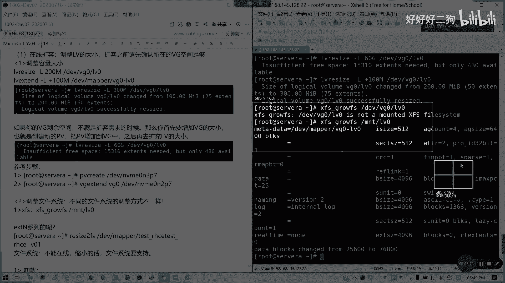
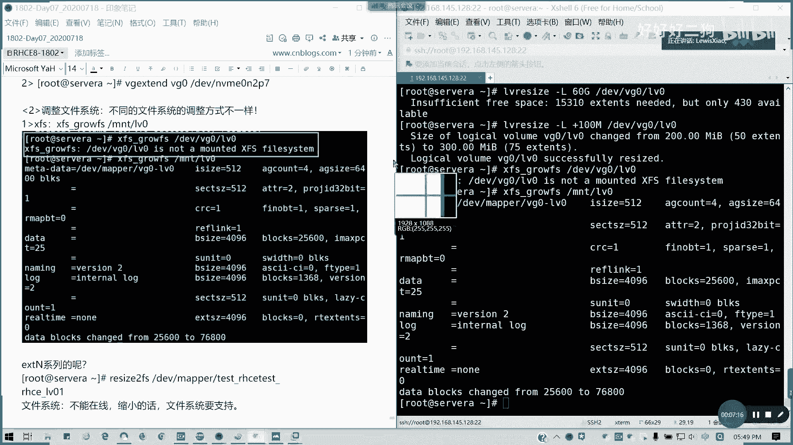
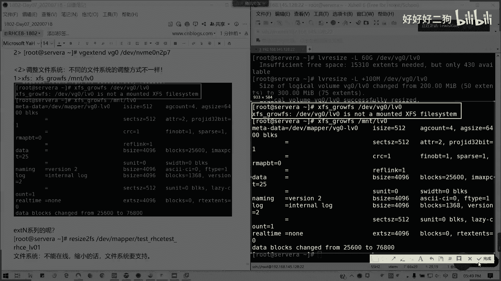
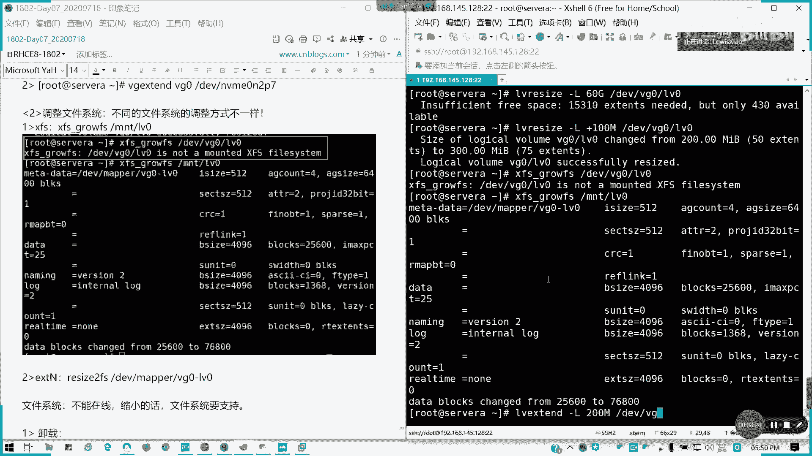
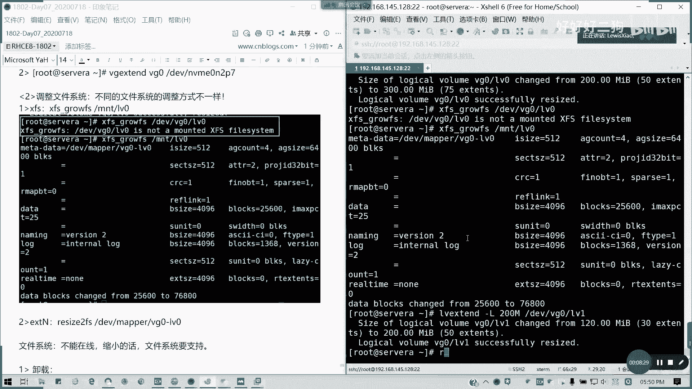
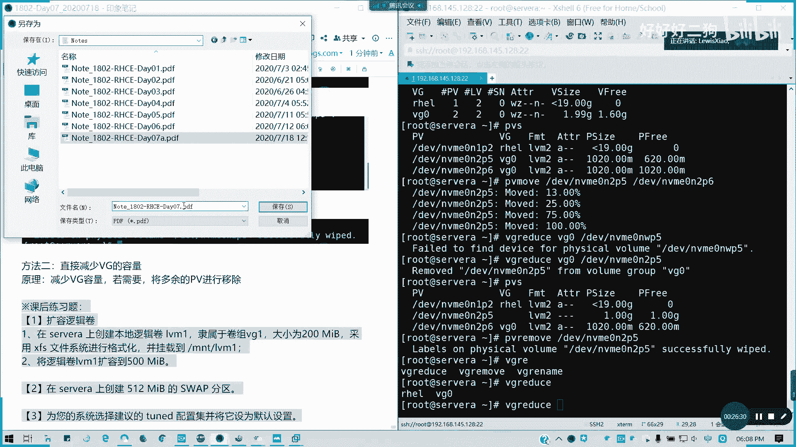

# Redhat红帽 RHCE8.0认证体系课程：P44：LVM调整与管理 🛠️

在本节课中，我们将学习逻辑卷管理器（LVM）的核心操作，包括在线扩容、离线缩容以及如何调整卷组和物理卷。这些技能对于动态管理Linux系统存储空间至关重要。

## 在线扩容逻辑卷 📈

上一节我们介绍了LVM的基本概念，本节中我们来看看如何在线扩展逻辑卷的大小。在线扩容意味着在不中断服务的情况下，增加逻辑卷的容量。

**核心命令**是 `lvresize` 或 `lvextend`。在扩容前，必须确认其所在的卷组（VG）有足够的剩余空间。

以下是扩容逻辑卷的基本步骤：

1.  **扩展逻辑卷**：使用 `lvextend` 或 `lvresize` 命令增加逻辑卷的容量。
    ```bash
    # 将逻辑卷 lv0 扩展到 200M
    lvextend -L 200M /dev/vg0/lv0
    # 或者增加 100M
    lvextend -L +100M /dev/vg0/lv0
    ```

2.  **扩展文件系统**：逻辑卷扩容后，必须同步扩展其上的文件系统，否则新增空间无法使用。不同文件系统的扩展命令不同。

## 扩展文件系统 🌱





逻辑卷扩容后，我们需要扩展其上的文件系统以使用新增空间。XFS和EXT4文件系统的操作方式不同。



以下是针对不同文件系统的扩展方法：



*   **对于XFS文件系统**：使用 `xfs_growfs` 命令，**参数是挂载点，而非设备路径**。
    ```bash
    # 假设逻辑卷挂载在 /mnt/vg0_lv0
    xfs_growfs /mnt/vg0_lv0
    ```



*   **对于EXT4文件系统**：使用 `resize2fs` 命令，参数是设备路径。
    ```bash
    # 扩展 /dev/vg0/lv1 上的文件系统
    resize2fs /dev/vg0/lv1
    ```

## 离线缩容逻辑卷 📉

与扩容不同，缩容（减小逻辑卷）通常**不能在线进行**，且文件系统必须支持此操作。例如，XFS文件系统不支持缩容，而EXT4支持。

以下是EXT4文件系统逻辑卷的离线缩容步骤：

1.  **卸载文件系统**：首先卸载逻辑卷以确保数据安全。
    ```bash
    umount /mnt/lv1
    ```

2.  **检查文件系统**：使用 `e2fsck` 检查文件系统完整性。
    ```bash
    e2fsck -f /dev/vg0/lv1
    ```

3.  **缩小文件系统**：先缩小文件系统本身。
    ```bash
    resize2fs /dev/vg0/lv1 100M
    ```

4.  **缩小逻辑卷**：最后缩小底层逻辑卷的容量。
    ```bash
    lvresize -L 100M /dev/vg0/lv1
    ```

5.  **重新挂载**：操作完成后，重新挂载逻辑卷。
    ```bash
    mount -a
    ```

**注意**：缩容操作风险较高，考试通常只考扩容。

## 调整卷组与物理卷 🔄

有时我们需要从卷组中移除物理卷（PV）。这要求目标物理卷上的所有数据（物理盘区）必须先被移动到其他PV上。

以下是移除物理卷的步骤：

1.  **移动数据**：使用 `pvmove` 将数据从待移除的PV迁移到其他PV。
    ```bash
    # 将 /dev/nvme0n2p5 上的数据移动到 /dev/nvme0n2p6
    pvmove /dev/nvme0n2p5 /dev/nvme0n2p6
    ```

2.  **从卷组中移除PV**：使用 `vgreduce` 命令。
    ```bash
    vgreduce vg0 /dev/nvme0n2p5
    ```

3.  **删除PV标签（可选）**：使用 `pvremove` 删除物理卷的LVM标签，这不会删除磁盘分区。
    ```bash
    pvremove /dev/nvme0n2p5
    ```

## 总结与练习 📚

本节课中我们一起学习了LVM的动态管理操作。我们掌握了如何在线扩容逻辑卷并扩展对应的文件系统，了解了离线缩容EXT4逻辑卷的严谨步骤，以及如何安全地从卷组中移除物理卷。

**课后练习**：
1.  在Server A上创建一个名为 `av` 的卷组，包含一个200M的逻辑卷，格式化为XFS文件系统并挂载。
2.  在Server B上创建一个512M的交换分区。
3.  配置系统使用Tuned配置集，并将其设为默认。



通过完成这些练习，可以巩固对LVM各项操作的理解。下一节课，我们将学习 `stratagem`、`autofs` 和网络文件系统（NFS）等内容。