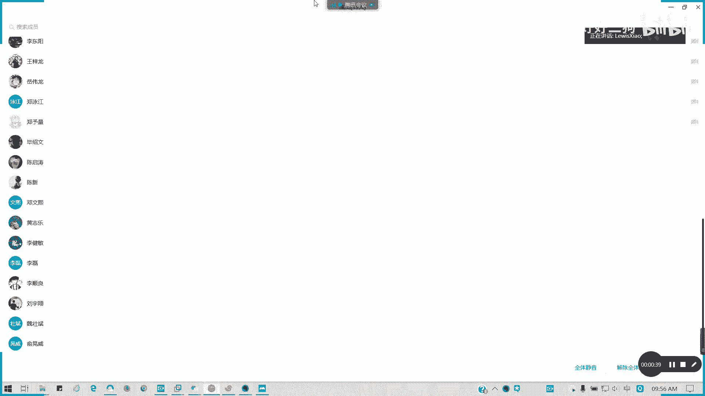
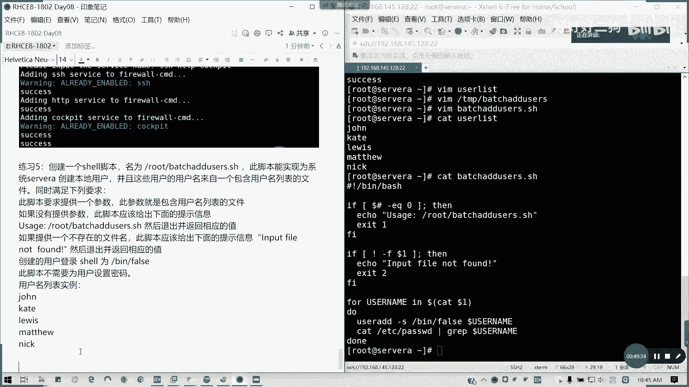

# Redhat红帽 RHCE8.0认证体系课程 - P45：45.Video_Day08_Day07课程回顾_练习讲解 - 好好好二狗 - BV1M3411k77W

好的我们开始啊，今天好像我先看一下那个39个人。

我先为了啊，我们还是还是什么叫做法外狂徒。

张三是什么鬼啊，我先记，我们按照正常的流程，我先留个档，先，反正没有改真名的，我一律就算没来哈，有多少因为他有多少没来。

我说那个张三张三是谁啊，这个人，我不清楚我的，我就直接把他移出黑影了啊，那好我们张三是你手机，你改一下吧，亲，都不改名的，我们看一下昨天的内容，昨天我们讲了什么，第一个我们的管理临时文件，管理学文件夹。

我这里的话只是讲了怎么自定义啊，自定义其实就是靠的是tmp fast点低，对不对，tb fans选d，然后我只要在里面有新建空文件，然后直接create a就可以了，懂我意思吗。

这个考试我们没太做太大的一个要求，我看了一下视频里面基本上没有啊，键盘没有，就是我们的那个考我我看的那个题库啊，基本上没有，然后呢第三个我们讲了条约，第二个讲调优，调优的话td对吧。

td我们主要是将我们的列出的配置文件，然后呢命令呢，命令是tn的dm，对不对，然后后面active profile对不对，我们结合这道题来讲，问题选择问题，系统选择零的tn配置啊，tin配置。

然后呢并调设置为默认，那我们可以称一下tn的a d m，当前是叫virtual guest对吧，然后我现在我看一下它的推荐设置，recommended对吧，如果他有指定说改到哪里，那我们就改到哪里。

那如果说当前不是virtual guest的话，我就那个profile对吧，virtual guest。

就行了，这个就是我们完整的一个步骤啊，昨天其实我们演示也是过了考试的话，就差不多做这么多就够了，但你要确定一下你的那个twin。

twin的那个服务有没有安装，第三个文件的a4 l是吧，文件s l这个我们已经讲过啊，讲过主要是如何获取对吧，还有如何设置，对于它是主要是针对于特定用户，特定组的一个控制权限，而不是针对于大类。

懂我意思吗，不是对大类，它是针对特定用户的，所以说考试必有必有这些题目的，我们上次已经有讲过啊，上次在第一本书已经有讲过，现在已经第八天了，如果我们在第二本，应该是我觉得我记得啊，应该是在第二天的时候。

第二还是第三天的时候，我们讲一个内容，所以的话如果不清楚不明白，麻烦大家回去看一下，这块内容这是文件的cl讲了，接下来讲了一个s1 linux，对不对，a c d有什么有一块端口上涨，我们今天会讲啊。

第一讲我们现在做主，第一个，sa linux 3种模式及切换方法，我们有个配置文件，对不对，如果你要直接改配，直接那个我们有临时切换，只限于enforcing，permissive之间是吧，临时切换。

临时切换的话，两条命令，对吧，cd force，然后再给看下，get the false，看一下就知道了，然后永久切换，有几千万，我们是不是要改成一个文件啦，改这一行，对吧，这一行的值，记住啊。

从其他状态切切换到disable，明白意思吧，从其他的两个状态切换到disable或disable，切换到其他两个状态，必须要重启对吧，因为标因为主要是s n news标签的问题，但是你要生产环境的话。

很多人就直接把别把s news直接disable掉，什么时候没有，对不对，这是我们讲的啊，这第一个，然后第二个我们叫安全性上安安全性上下文，安全性上下文，更改默认上下文的方法，s manager。

as contest，默认上下文对不对，杠a添加杠t类型，然后这里的话我这里我可以引号括起来就是type，它的类型以杠t以斜杠t结尾，下划线t结尾后面跟文件或目录，目录是带通配符的，对吧。

知道通配符是什么意思吧，文件属文，就这当全部以下的所有文，子文件和子目录全部生效，然后最后记得还原，就是说还原它的默认上下文限制，restore抗干rv，连接或目录，然后呢这个是零，这是这是我们的啊。

就说我刚才问上角完，还有一个是那个，临时修改上下文，全体call对吧，太不录，然后或者是或者是杠杠，reference，参考文件或目录，目标文件目录，前面2345章就这样，如果明白的请打个一啊。

前面三前面的四张2~5，然后接下来我们再讲第六章，会会会那个我们回顾第六章，我们讲第五，第五个回顾点就是我们第六章，值班管理，首先我们的，分区工具有几个，我们讲了disc基于disk party。

对不对，这party是比较比较难用的，要注意它的那个起始和结束区间，其他的还好，怎么方便怎么来啊，然后接下来我们的一个基本分区的操作步骤，分区是吧，第一步分区，第二步，格式化是吧。

也就是我们创建文件系统，也就是我们在这里的，第二步，我俗称叫mk fs，对不对，这样清晰吗，可以吗，可以吗，没有问题，这是基本分区的一个操作的一个步骤，从分区到格式化到临时挂载到永久挂载。

然后还有一个swap，我们从，同样分区，对吧，到mk我们先从福利刚开始，到分区，到mk sweat，到sweat on，对吧，所分区思维分区就这么写，然后还有我们讲了一个lvm，我写一个类型上去啊。

类型上去它是默认的，lvm操作步骤，首先还是分区，但是我们类型是叫八一的，昨天我们没讲啊，其实我们用默认的话也没问题，然后分区后面，不是格式化，是pv，然后多个pv我创建v区，对吧。

这个过程应该都知道哈，所以过程是非常清楚对吧，这样清楚吧，接下来我们讲回来，有一个lvm的动态调整，扩容在线扩容，首先在线扩容，首先你要那个，我们就lv extend或者叫做lv resize，对吧。

在线骷髅知道吧，这个步骤先确认够不够空间是吧，先确认够不够空间，然后呢我们再进行扩展路径线，然后最后记得扩展文件系统，然后收容成离线，首先有帽，然后呢要进行检查，然后呢，lv reduce。

lv resize，先缩小文件系统啊，这是离线收容一个做法啊，先卸载，然后进行文件系统检查，但你这个前提的话，你的稳定系统要支持像xbox就只能扩不能说啊，然后考试的话必有一题的，必有一题的，就这个。

所以的话有些人分得过大或者怎么样对吧，通常来说你要扩容换你的卷子，你通常你要从考试通常考扩容，然后扩容的话，你只要卷组，比如说一开始他要你看题目要求，比如说500兆的话，我们卷子都做到600。

他然后扩扩容700的话，我们卷子都做到800，做多一点没事的啊，空间如果足够的话，做大一丢丢都没事，但是不要把全部都做了，然后扩啊死了是吧，过头了，那怎么说，那说那说坏操作错误的话。

你把整个整个都影响到了，所以的话这个太得不偿失对吧，所以的话这种扩容的话，建议啊，略大于目标大小，这个是我刚才说的好吧，我们v g s如果这就分预分配的时候，我们要建议。

比如说我的考试里面是不用你分配的啊，考试他他他已经有个卷子在里面了对吧，比如说它扩容，它比如说一个空间分区从500到括号700刀，他卷子其实有一区的空间给你的其实是够的，如果不够的话。

我们再加分区就行了，加那个加物理卷就可以了，然后还有一个就是那个，vg收容我们讲了一下是吧，移动整合pv，然后呢，移除空闲的pv就可以了，对吧懂吗，这个是v区的收容，我们就讲的这三个。

那接下来我们看一下两道题目，讲完我们休息啊，相信做完的话，你们都基本上都ok的，其实题目的话我们昨天不做就演示过了，然后呢，主播今天我弄一下练习一扩容逻辑确s5 a上。

我们建本地的v m一属属于逻辑组200兆是吧，长长x s然后挂载，然后让扩展和500，对不对，那我们现在要先分区。

可以看一下，当前是有五六了，那我就创建一个七吧，在这里要求500兆，那我就创建一个1g就够了，然后我们这里的话，它的那个文件类型我们可以改一下，叫八一，直接输发一就行了。

就直接转换成直接转换成我们的lv，昨天好像我没步骤，但是没这个步骤，其实也可以，没有太大问题，然后我们p完啊，t完我们再p一下，就是现在我们创建一个linux a b m是吧，那我们w写入磁盘。

然后呢让net读取part probe，然后lsp ok看一下，有了，而且就是物理卷，嗯对只需要加一个物理卷就行了，对吧，然后逻辑卷创建，看到pbs就知道了，然后呢，vg一哪个物理卷创建的卷子，对吧。

lv creators，它要求是千千串的200兆，对吧。

那我们直接etc fs tab l v l o k i d。

先看一下，考试的话他一般会给直接给你一个分区了啊，fs tab，我们直接复制这串，然后接着我们创建一个挂载目录，待会儿再创建，现在挂载之前我都没关系啊，dx fs defaults。

然后我们继续创建一个叫做mt l v m的目录，他应该是mk，第二，猫子杠a，为了截图啊，我先删掉，我们第一步已经先完成了，然后接待扩张，这是步骤一步骤一，步骤二扩容，先看一下v g s各部空间。

剩830 820兆，我的vg 1，先扩先扩容逻辑卷，再扩文件系统，抽了500兆，呼呼呼，然后再插fs，因为它是tfs文件系统，那tfs grow fs，记得这里是写挂的点，然后呢再验证一下。

所以扩大了这个范围了，495g是允许的，好这道题如果可以会的话，打个一，昨天那期我先讲了哈，那接下来我们讲第二部分啊，第二个题目，第二题目的话，swap也是，其实我做过的就给大家一个练习啊。

再去再做一个分区，我这512我就512就行了，分区类型t，然后呢第八个分区八二，然后呢我们p一下w保存，然后接下来我，mk 4 y，对先趴的probe好，k s y dv m v m0 n2 p8 。

他uid也有了，然后呢，我们swim，对吧，我们拖到259，原来是2048，然后呢写到etc fs tape里面，uid的上面已经有了，类型挂载到sy类型，选项默认，零零，爆炸a就行了。

这道题明白请打二。

步骤相当的清晰，相的清楚啊，然后是不是我们还留下几道练习，留下几道在舍友的练习，我们讲一讲吧。

所有相关的词我顺便也讲一讲啊，这也是不做，因为昨天我时间关系没讲，但今天的话我也讲一讲，这里的话我们讲到第六个。

43关练习，第一个，等差为四的四，等差数为四的数列，对吧，我们是不是有这道题。

怎么做呢，vam，我这里是s3 s01 ，bbs解析器，然后这里用for i in do了，我直接用命令就可以了，用多了，我的命令是sq 2，起始位二步进为四，然后他的那个末末尾50，echo多了i。

然后dg脚本结束。

这道题第一题的结果。

这道题没有问题的，请扣一。

我们这道题好像貌似讲过，所以我就不贴这里了啊，这道题讲过，我们是不是有几个题没讲，123我都讲了，但是看了下第六篇笔记，那我就写讲那个，456讲，然后还有那个第九题，我讲了没，我看一下这道题。

好像我讲过了，所以罗汉第四，哦456456978，我不讲行吧，那我就改改成练习四吧，这个我就因为我当时我忘了一个次序啊。

我们看一下练习四，这个就不讲了，不要不再回顾了，我们看一下练习四，换一个shell脚本，写一下功能，我要自动添加防火墙及规则，可以自己定义啊，添加规则必须永久生效，来我们看一看怎么做，我要添加规则。

那我们现在我就写一个s3404 ，是我们从键盘读取那种锐的杠p，please input the service map，因为我们后面船舱有多的零，多多了，一多了，二多了三，对不对。

所以这个就我们就直接定一个变量就好了，它变量里面可以存储多个值的对吧，然后for i in server snap，就它是不变的名取值做一个循环，do，我们先提示一段字。

echo ending dollar，i service to firework，cmd，好five or simd命令，我们后面会再讲啊，firework cmd，permanent。

我们在今天就要讲防火墙了，先先讲一下就怎么添加服务a的service，这我们就不是不放不放个端口号了啊，就不查端口号了，我们就直接放服务就可以了，多了，i对吧，当然后全部做完之后。

记得记得写一句firewor，cmd刚刚v6 ，对吧，然后呢我们执行一下，后面我们跟，零四啊，现在输入我们几个服务，比如说我的那个s h hdp，还有cookpit，有些已经有了，我就假设没有。

我就这样添加。

对不对，那这样的话我们的脚本就已经完成了。

这也是我们练习的第四题，如果没问题，请打四，有问题可以提问。

练习五练习，我们讲一讲练习五，创建一个shell脚本，然后叫做beat users啊。

那为系统设为a去创建本地用户啊，但是有一个用户列表的一个文件，然后呢如果每一输入的话，就会给出提示信息，然后如果那个说文件不存在，那就给出个叫input file file并反向值。

然后我们shell都是been force，那不需要设置密码，我们的实力在这里，那我们现在就我们输入一个实例吧，我们就是啊先定一个名字叫user list，然后我们把用户名导进去，然后写剧本写小板。

tmp back user，然后呢我们现在用bing batch，因为它不是它不是后缀ssh结尾的，等下好像说他他就好像我提示不了，那我们就我们就是那个是这样吧，我们当前目录下的root吧，站位好一点。

没事啊，只是换个名字，其他什么都没变，好bbs点击器，然后首先我们要满足第一个要求，没有提供参数就会返回提示信息，那我们的是不是提供参数，后面个我们是不是可以用个数来统计啊，对不对。

个数统计是不是多了紧啊，多了几，如果等于零，那就说明我后面没参数，懂我意思吗，这第一个我们第一个条件echo，usage，他反正他什么提示信息就造出，look back at the users。

点s h，然后呢返回一个值，比如说他是那个后面没带参数的，是不是选择那个就说不正常退出，我们选择一就可以了，对不对，他退出代码是不是有很多个适当的一个参数啊，不要乱退啊。

fi然后写第二个条件就是文件不存在，文件不存在，我们是不是有一个针对于文件和目录测试的，对吧，文件不测试，那如果我们do了一，因为我们只提供一个参数参数，也就是我们的文件列表，我们的那个如果文件不存在。

那就我们文件存在是不是杠f是吧，多了一，但不能在我前面再加个非，感叹号不就可以了吗，对不对，文件我多了一这个文件，这个目标不存在，而且它不是一个呃呃就他是个文，它是存在，而且是文件，我们上面打算飞。

懂了吧，打算飞，那就是这个条件已经否定掉了，then，bo，input fire not father，然后因为文件不成为那个命令文，文件不存在，我们退出只是二，对不对，不不存在的命令或文件名嘛。

对不对，我们写的是不是这样，fi对吧，然后接下来我们要我们写主要循环题，就是我要创建用户，这就出问题了，那for我们定一个变量叫username，这里的话因为我们的文件名是多了一。

那我们是不是开多了一把它列出来就行了，然后按照每一行，每一行里面每一个，他们就把变量重复赋予一个username里面，然后执行一个循环迭代赋值，迭代赋值do做什么呢，user add它不需要设置密码。

它只需要一个类型叫been false对吧，username，然后我们这里是，就可以了，然后我想如果我想那个再完善一点，那我就直接cat etc pad grape，是吧，我把这一行列出来。

其实我也不用列id了，我直接就这样就可以了，懂我意思吧，好我们循环结束，我们看一下user list，看一下我们的脚本。

然后呢我们开始执行。

所以要理解我们的。

我们到底的那个我们这个任务段是要干嘛的，我写这些是要干嘛的，然后我现在来做一下测试，f h biusn s h，比如说我这里什么都不输入是吧，然后呢我输入一个不存在文件名对吧。

然后我现在输入一个存在的uer list会怎么样呢，懂了吧，全都列出来了。

那这道题就讲到这里，明白的请扣五。

我上面好像没漏的截图是吧。

漏截图，一个脚一个脚本，我把它截下来。

好这是练习舞，我看看，有疑问的可以提出来，然后这里我们可以先找一个练习九，69我在这里，分支，679678，我不讲，六六的话，那个是可以，你可以做一个精细大任务，到时候期待你们的作业啊，如果这边有的话。

可以写一下678，这几个是一个大作业来的，然后呢在server a上执行一个root lex。s h的脚本，然后其实很简单啊，我们来写一个case就行了，同样，case，dota一就是我们后面输入的。

我们那个本身命令是多了零，对不对，我dota一我输入什么呢，k多了一in来我们写分支，rehaecho，sentence，然后两个分号对不对，我们第一个分子写完seals，第二个第二个选第二个选项。

echo，reheat，然后记得我们还有一个出口，就是其他非任意值，echo，usage，就这样，然后后面记得结尾esc。

678我们不讲哈。

刚才说了6789，给大家去思考一下，然后呢好我们来测试一下，什，么都不说是吧，好测试完毕，明白了请打九，有疑问题，例题，第678留给大家去做一个大思考啊，六期我们的题题目678，这个很实用。

但是这里因为时间关系我就不再讲了，这是第七个，你的堡垒机，那个的话是一个大项目，报第八的一个机会，环境部署，第六的话你其实也可以做一个大项目来的。

这些题目呢留给大家一个思考啊。

这样做的话可以可以做几个小时或做几天的，解堡垒机是吧，其实像我我这边我可以把那个把提示告诉大家，然后大家可以自己去想去做，我们涉及的一些参考要素已经列出来了，那其实我就不应该。

不用再去做更精细的提示了吧，这一块的话留给大家去思考啊，678我就不再发答案了，现在10：52，我们11。10分回来，奖励11：15啊，之前我们回来讲了一个我们的第八章啊，我们红帽的一个新特性。

stretch。

