# Redhat红帽 RHCE8.0认证体系课程：P45：Day08_Day07课程回顾与练习讲解 📚

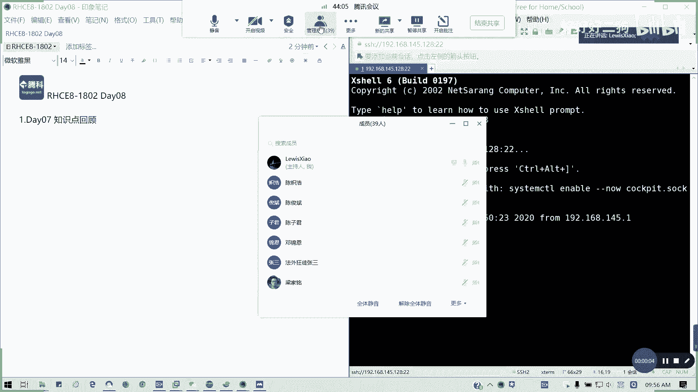

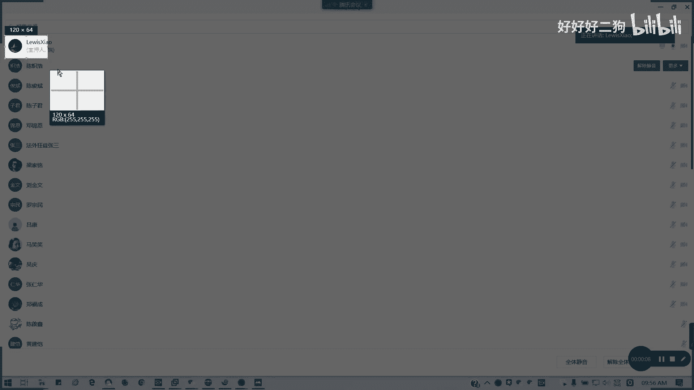

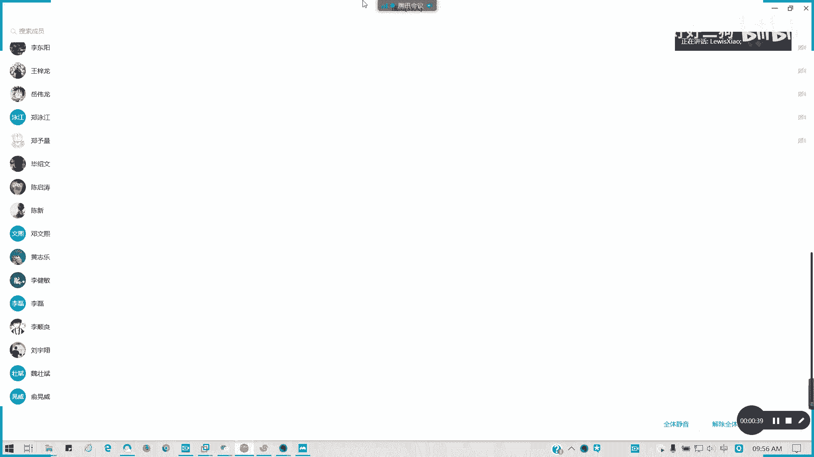

在本节课中，我们将回顾第七天课程的核心知识点，并通过讲解相关练习题来巩固所学内容。课程涵盖临时文件管理、系统调优、SELinux、磁盘分区、LVM逻辑卷管理以及Shell脚本编写。

---

## 课程回顾 📖

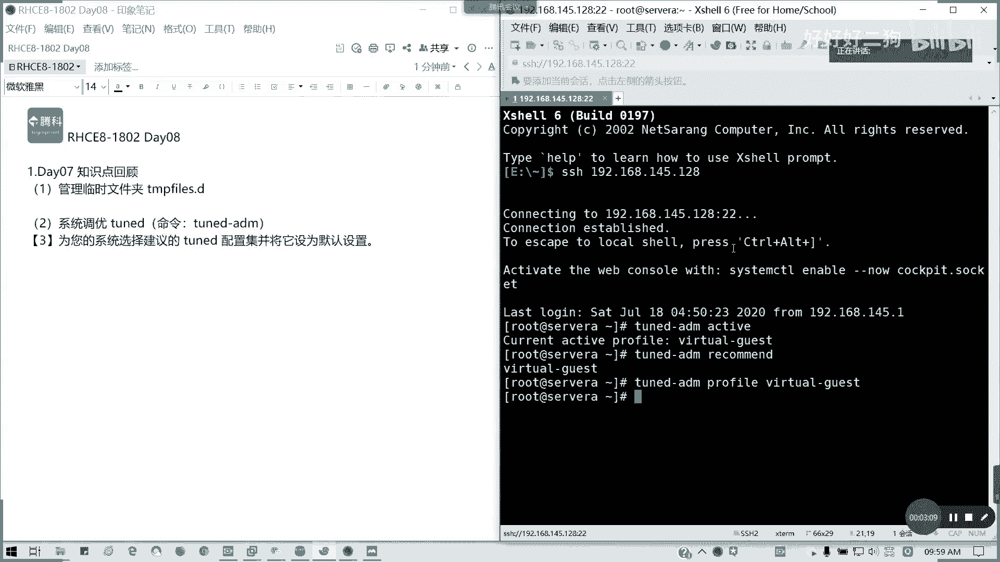

上一节我们介绍了多个系统管理主题，本节中我们来逐一回顾并梳理关键操作步骤。

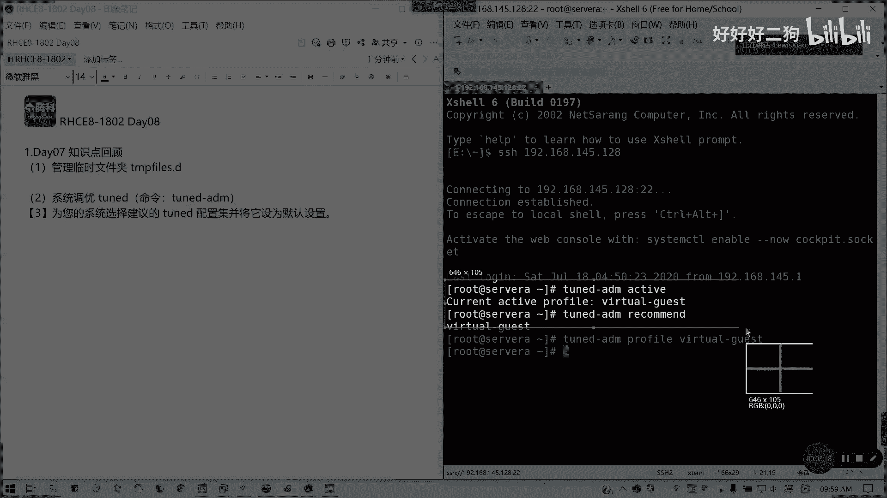

### 1. 管理临时文件 🗂️

管理临时文件主要涉及自定义临时文件清理。其核心是通过创建 `/etc/tmpfiles.d/` 目录下的配置文件来实现。

**操作步骤**：
1.  在 `/etc/tmpfiles.d/` 目录下新建一个配置文件。
2.  在文件中按规则定义需要清理的临时文件或目录。
3.  使用 `systemd-tmpfiles --create` 命令使配置生效。

### 2. 系统调优 ⚙️

系统调优工具 `tuned` 用于优化系统性能。我们需要掌握列出、查看和设置调优配置文件。

**核心命令**：
*   列出所有配置文件：`tuned-adm list`
*   查看当前活动配置：`tuned-adm active`
*   设置活动配置：`tuned-adm profile <配置文件名>`

**典型考题步骤**：
1.  使用 `tuned-adm list` 查看可用配置。
2.  使用 `tuned-adm active` 确认当前配置。
3.  根据题目要求，使用 `tuned-adm profile` 命令切换到指定配置（如 `virtual-guest`）。

### 3. 文件访问控制列表（ACL） 🔐

ACL用于为特定用户或组设置超出常规权限模型的精细访问控制。这是考试重点。

**关键操作**：
*   获取ACL：`getfacl <文件或目录>`
*   设置ACL：`setfacl -m u:<用户名>:<权限> <文件或目录>`

### 4. SELinux 管理 🛡️

SELinux 提供强制访问控制。我们需要掌握其三种模式及切换方法。

**三种模式**：
*   **enforcing**：强制模式，拒绝并记录违规。
*   **permissive**：宽容模式，仅记录违规。
*   **disabled**：禁用模式。

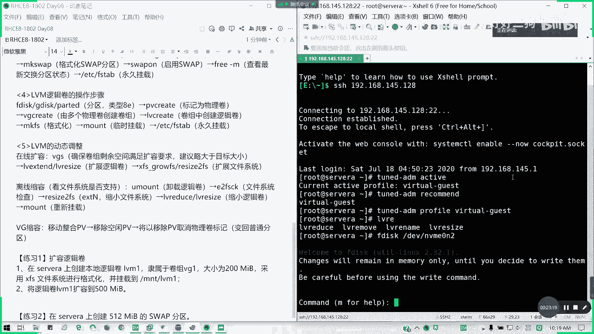

**模式切换**：
*   **临时切换**（仅限 enforcing 与 permissive 之间）：
    *   `setenforce 1` （切换到 enforcing）
    *   `setenforce 0` （切换到 permissive）
    *   使用 `getenforce` 命令查看当前模式。
*   **永久切换**：编辑 `/etc/selinux/config` 文件，修改 `SELINUX=` 后的值。**注意**：从 `enforcing`/`permissive` 切换到 `disabled` 或反向切换，必须重启系统。

**安全上下文管理**：
*   更改默认安全上下文：`semanage fcontext -a -t <类型> “<目录或文件路径表达式>”`
    *   目录路径表达式通常以 `“(/.*)?”` 结尾，表示应用于该目录下所有内容。
    *   完成后需执行 `restorecon -Rv <目录>` 恢复上下文。
*   临时修改安全上下文：
    *   `chcon -t <类型> <目标>`
    *   `chcon --reference=<参考文件> <目标文件>`

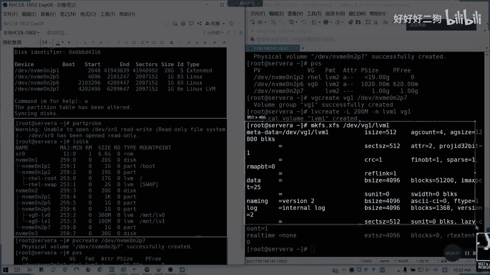

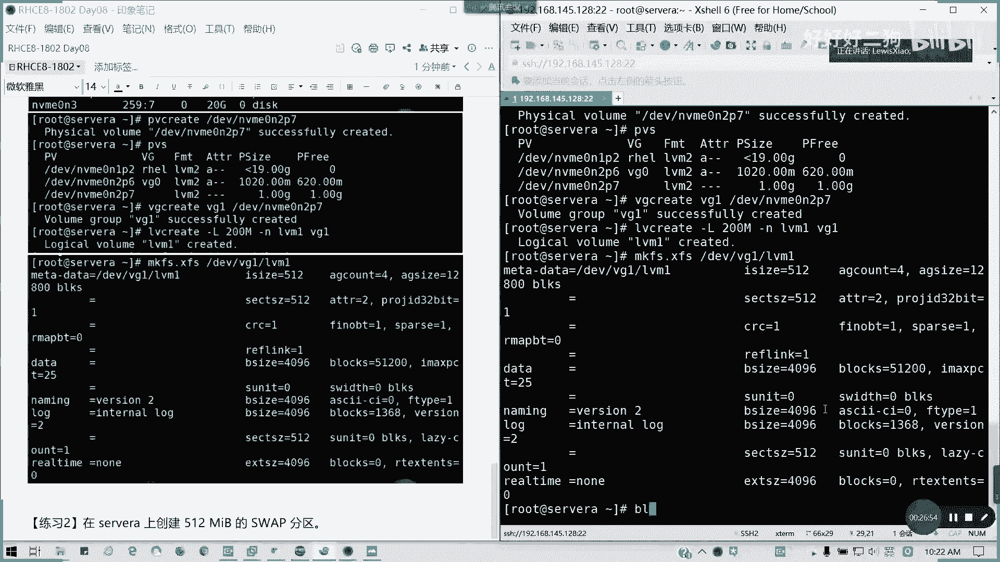

### 5. 磁盘与分区管理 💾

我们讲解了基本分区、Swap分区和LVM逻辑卷的管理步骤。

**基本分区操作流程**：
1.  分区（使用 `fdisk`/`gdisk` 等工具）。
2.  格式化（创建文件系统，如 `mkfs.xfs`）。
3.  临时挂载（`mount`）。
4.  永久挂载（编辑 `/etc/fstab`）。

**Swap分区创建流程**：
1.  分区（类型设置为 `82`，Linux swap）。
2.  格式化：`mkswap /dev/sdXN`
3.  启用：`swapon /dev/sdXN`
4.  永久生效：在 `/etc/fstab` 中添加相应条目。

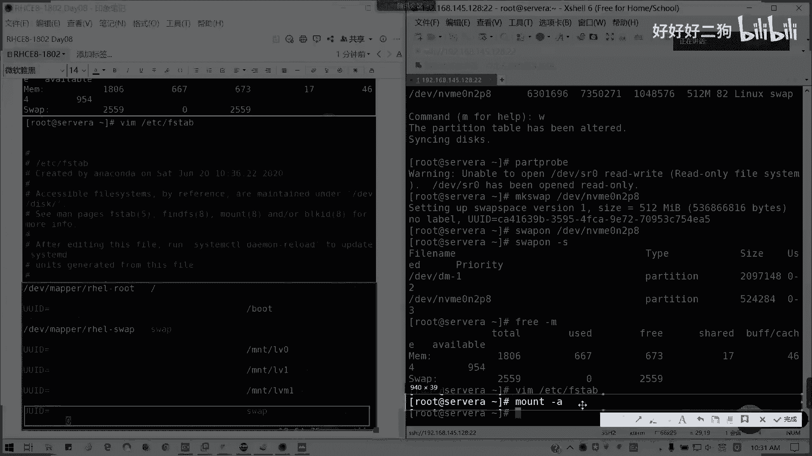

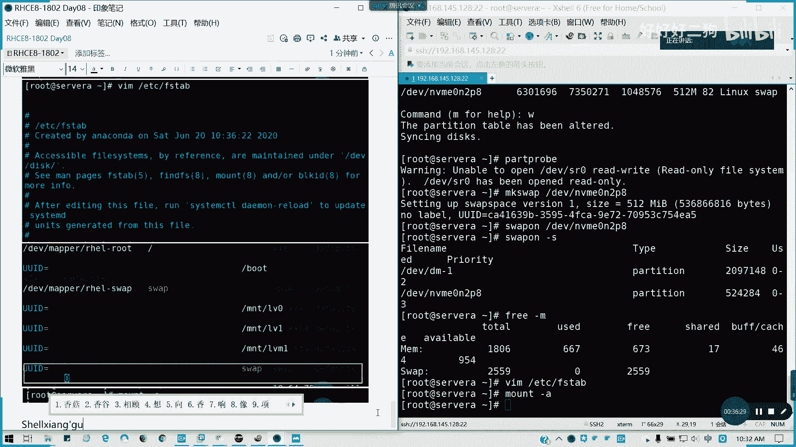

**LVM 逻辑卷管理**：
以下是创建LVM的基本步骤流程图：

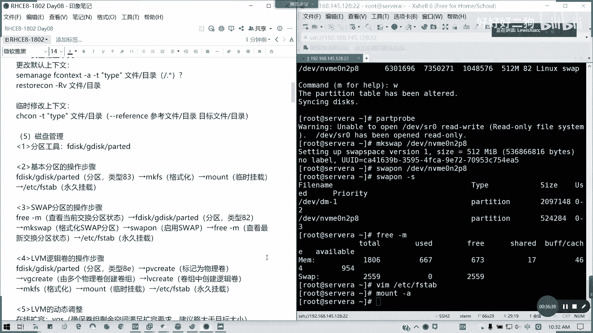

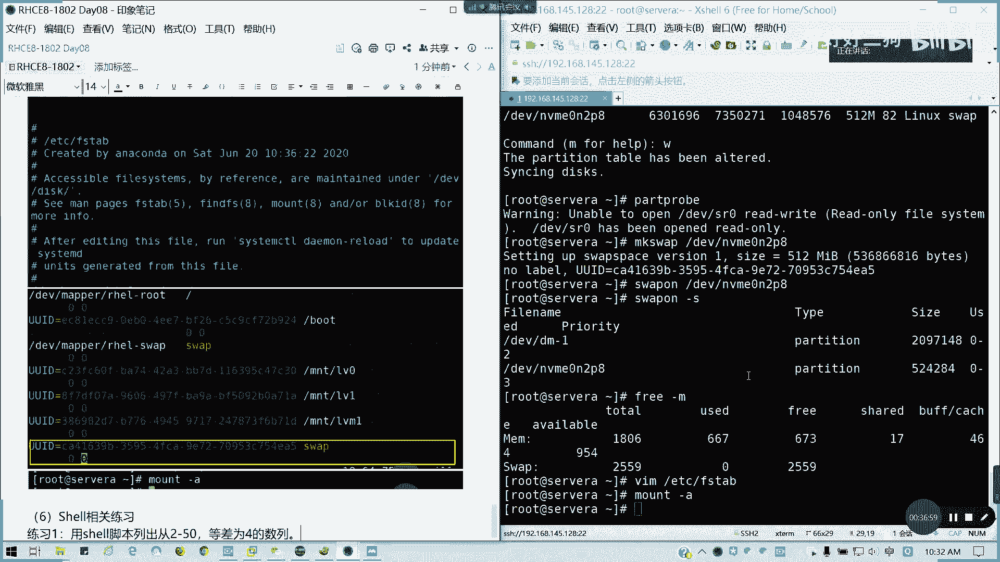

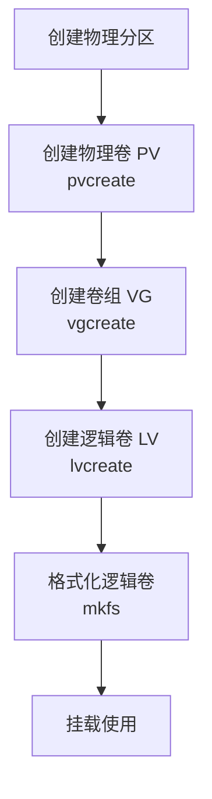
```mermaid
flowchart TD
    A[创建物理分区] --> B[创建物理卷 PV<br>pvcreate]
    B --> C[创建卷组 VG<br>vgcreate]
    C --> D[创建逻辑卷 LV<br>lvcreate]
    D --> E[格式化逻辑卷<br>mkfs]
    E --> F[挂载使用]
```

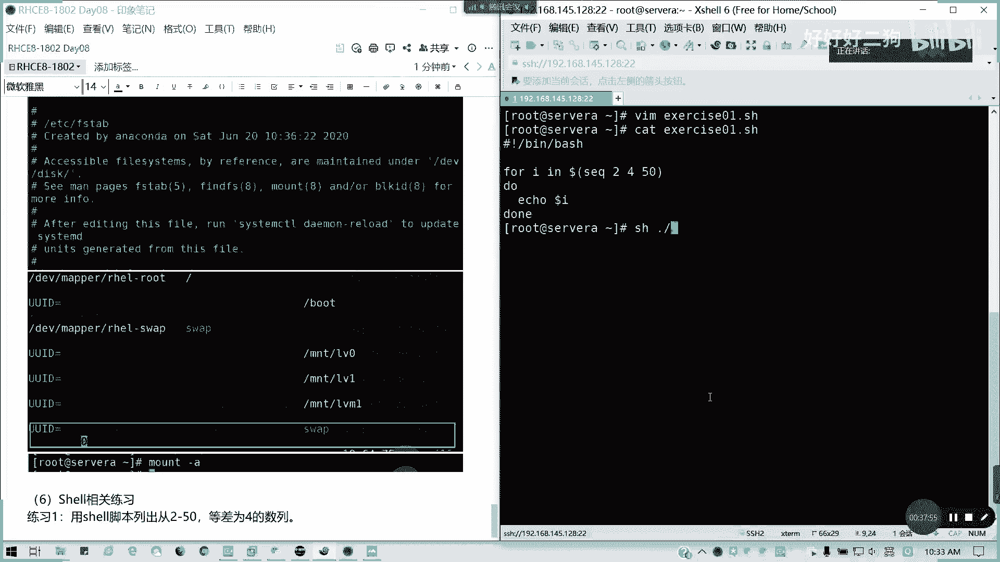

**LVM 动态调整**：
*   **在线扩容**：
    1.  检查卷组是否有足够空间：`vgs`
    2.  扩展逻辑卷：`lvextend -L +<大小> /dev/<vg名>/<lv名>` 或 `lvresize`
    3.  扩展文件系统（以XFS为例）：`xfs_growfs <挂载点>`
*   **离线缩容**（文件系统需支持，如ext4）：
    1.  卸载文件系统。
    2.  检查文件系统：`e2fsck -f /dev/<vg名>/<lv名>`
    3.  缩小文件系统：`resize2fs /dev/<vg名>/<lv名> <新大小>`
    4.  缩小逻辑卷：`lvreduce -L <新大小> /dev/<vg名>/<lv名>`
*   **卷组缩容**：
    1.  将数据从待移除PV迁移到其他PV：`pvmove /dev/sdXN`
    2.  从卷组中移除空闲PV：`vgreduce <vg名> /dev/sdXN`

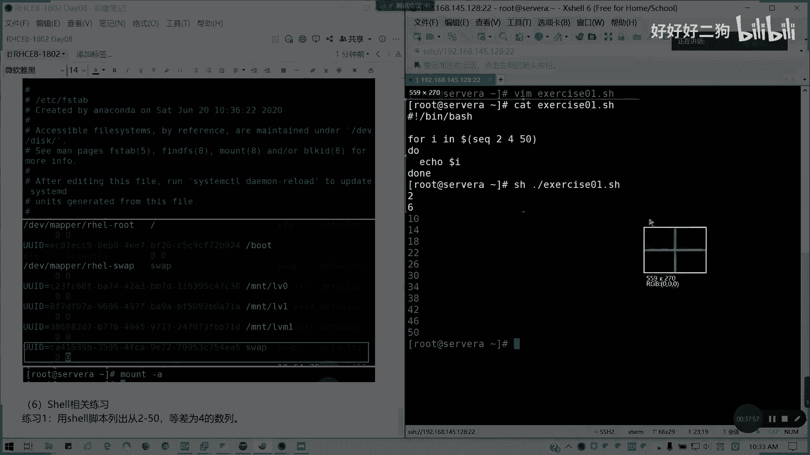

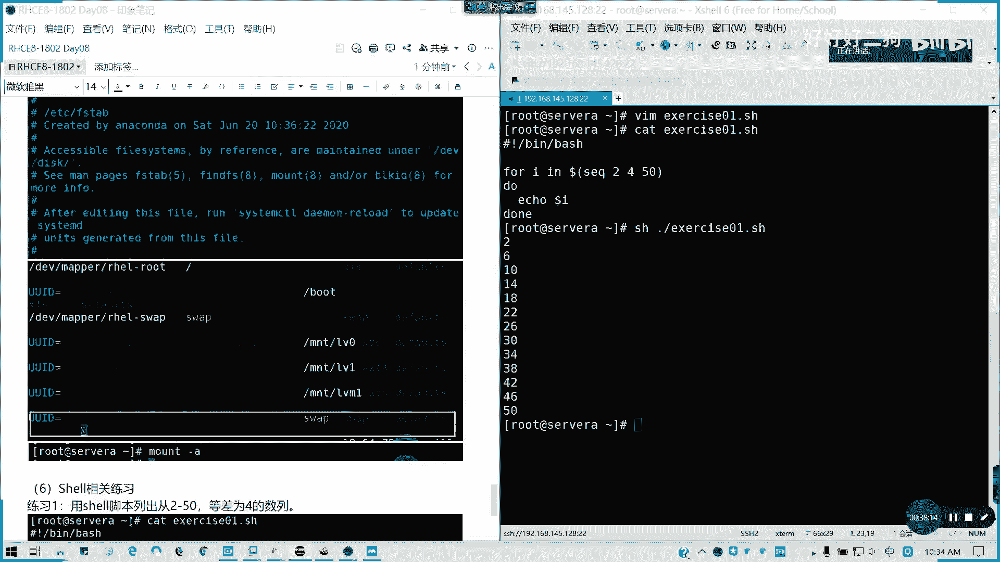

**考试建议**：进行LVM扩容时，分配的空间可略大于题目要求的目标大小，避免因操作误差导致空间不足。

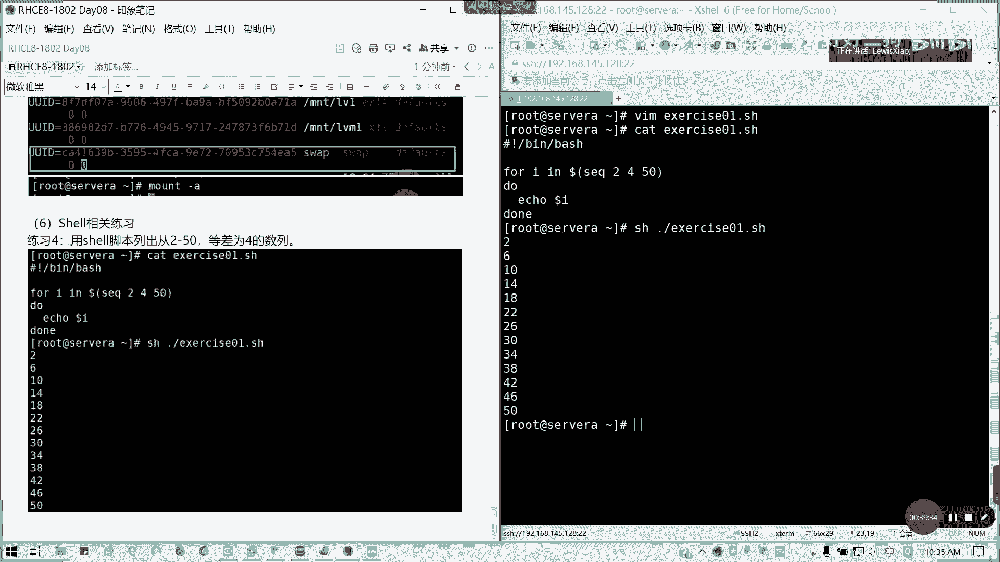

---

## 练习讲解 💻

以下是针对课程知识点的具体练习题讲解。

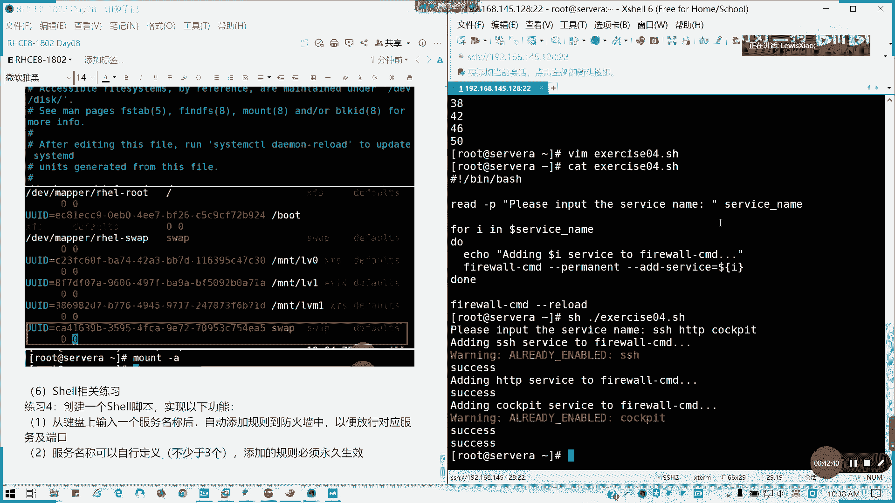

### 练习一：LVM逻辑卷扩容

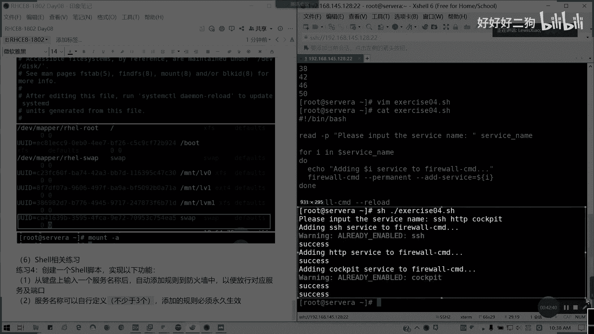

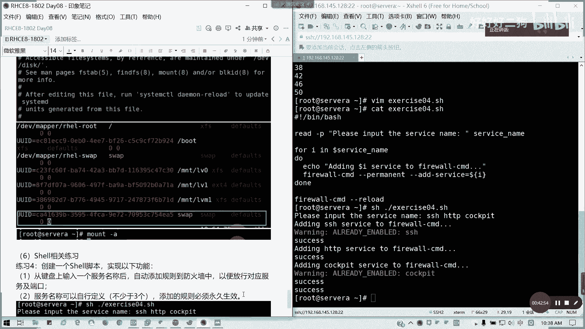

**题目要求**：在 `/dev/sdb` 上创建属于卷组 `vg1` 的逻辑卷 `lv1`，大小为200MiB，格式化为XFS并挂载。随后将其扩展至500MiB。

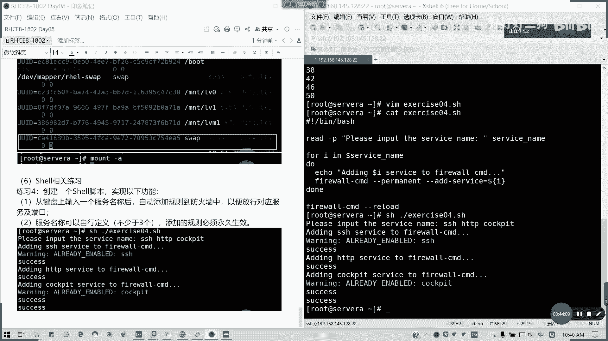

**操作步骤**：
1.  **分区**：在 `/dev/sdb` 上创建一个新分区（例如 `/dev/sdb1`），类型设置为 `8e` (Linux LVM)。
    ```bash
    fdisk /dev/sdb
    # 在交互界面中：n (新建), p (主分区), 1 (分区号), 回车 (起始扇区), +1G (大小), t (改类型), 1 (分区号), 8e (LVM类型), w (保存)
    partprobe /dev/sdb # 重新读取分区表
    ```
2.  **创建物理卷(PV)**：
    ```bash
    pvcreate /dev/sdb1
    ```
3.  **扩展卷组(VG)**（假设 `vg1` 已存在）：
    ```bash
    vgextend vg1 /dev/sdb1
    ```
4.  **创建逻辑卷(LV)**：
    ```bash
    lvcreate -L 200M -n lv1 vg1
    ```
5.  **格式化并挂载**：
    ```bash
    mkfs.xfs /dev/vg1/lv1
    mkdir /mnt/lvm
    mount /dev/vg1/lv1 /mnt/lvm
    # 永久挂载：将 `/dev/vg1/lv1 /mnt/lvm xfs defaults 0 0` 添加到 `/etc/fstab`
    ```
6.  **扩容逻辑卷**：
    ```bash
    vgs # 确认vg1有足够空间
    lvextend -L 500M /dev/vg1/lv1 # 扩展LV
    xfs_growfs /mnt/lvm # 扩展XFS文件系统
    df -h /mnt/lvm # 验证扩容结果
    ```

### 练习二：创建Swap分区

**题目要求**：创建一个512MiB的Swap分区并使其永久生效。

**操作步骤**：
1.  **分区**：在目标磁盘上创建新分区，类型设置为 `82`。
    ```bash
    fdisk /dev/sdX
    # n, p, [分区号], 回车, +512M, t, [分区号], 82, w
    partprobe /dev/sdX
    ```
2.  **格式化并启用**：
    ```bash
    mkswap /dev/sdXN # 例如 /dev/sdb2
    swapon /dev/sdXN
    ```
3.  **永久生效**：在 `/etc/fstab` 中添加一行。
    ```
    /dev/sdXN swap swap defaults 0 0
    ```

### 练习四：Shell脚本 - 自动添加防火墙规则

**题目要求**：编写脚本，可批量添加服务到防火墙规则并永久生效。

**脚本示例 (`add_firewall.sh`)**：
```bash
#!/bin/bash
# 提示用户输入服务名，可输入多个，用空格分隔
read -p "Please input the service names: " services
for service in $services
do
    echo "Adding $service service to firewall..."
    firewall-cmd --permanent --add-service=$service
done
# 重载防火墙配置使规则生效
firewall-cmd --reload
echo "Firewall rules updated."
```
**执行**：
```bash
bash add_firewall.sh
# 随后输入服务名，如: ssh http cockpit
```

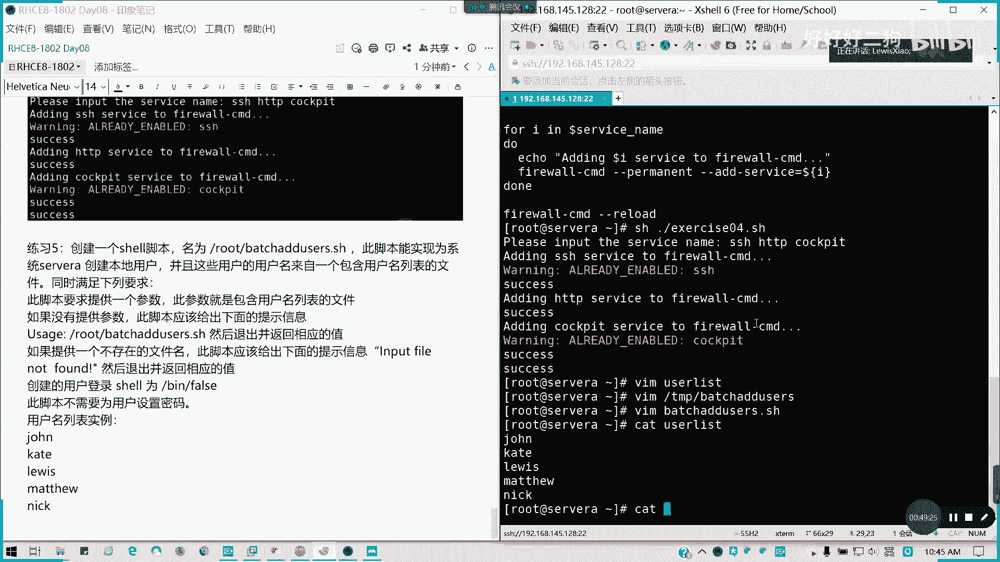

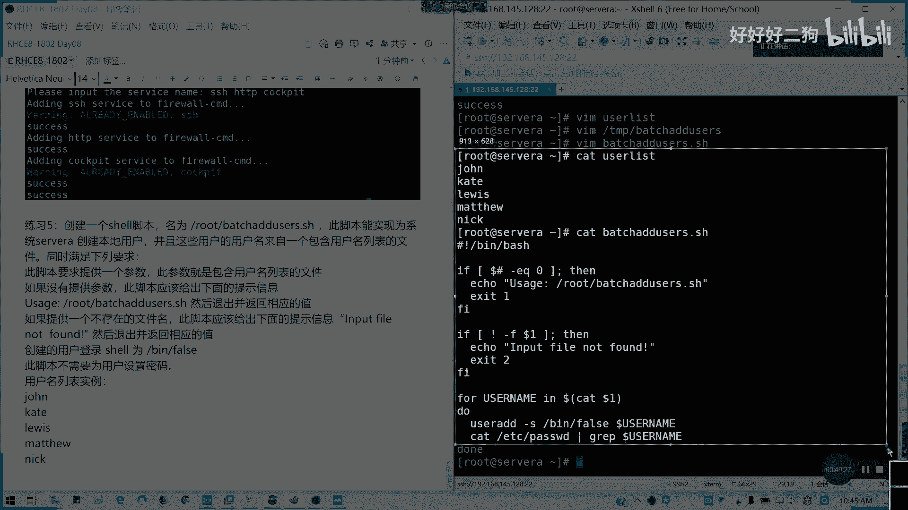

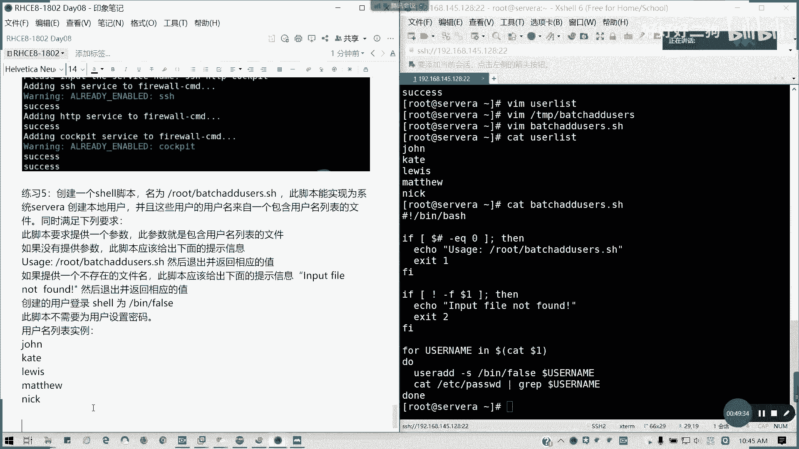

### 练习五：Shell脚本 - 批量创建用户

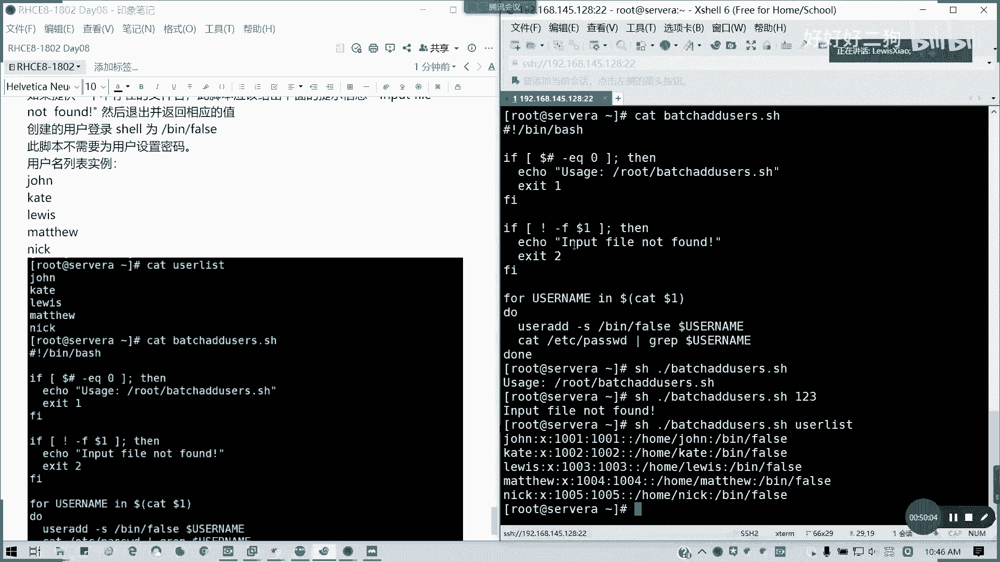

**题目要求**：编写脚本，根据提供的用户列表文件批量创建用户（不设置密码）。需处理无参数、文件不存在等情况。

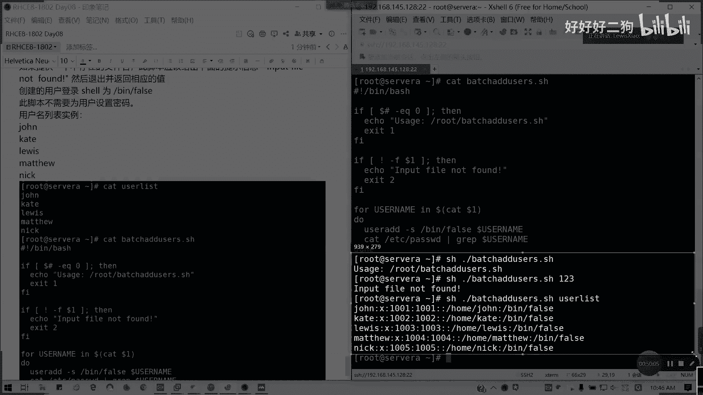

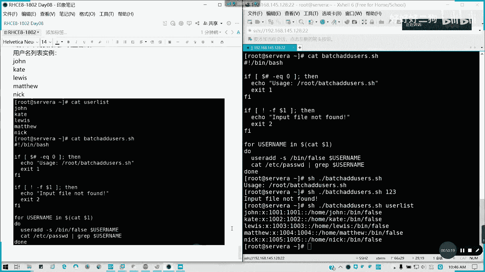

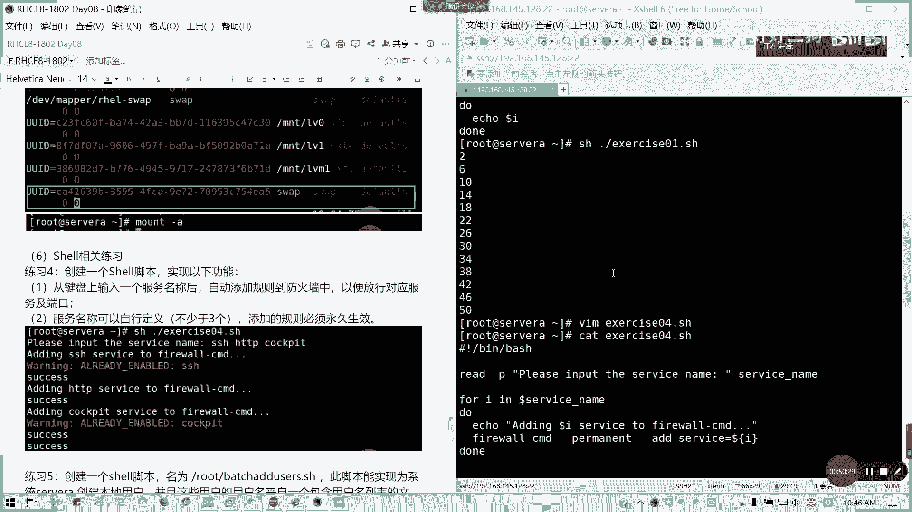

**脚本示例 (`batch_users.sh`)**：
```bash
#!/bin/bash
# 条件1：检查是否提供了参数
if [ $# -eq 0 ]; then
    echo "Usage: $0 <user_list_file>"
    exit 1
fi
# 条件2：检查提供的参数是否是一个存在的文件
if [ ! -f "$1" ]; then
    echo "Input file not found."
    exit 2
fi
# 循环读取文件中的每一行作为用户名
for username in $(cat "$1")
do
    useradd -s /bin/false "$username" # 创建用户，并指定shell为/bin/false
    echo "User $username created."
done
echo "Batch user creation completed."
```
**用户列表文件 (`user.list`)** 内容示例：
```
user1
user2
user3
```
**执行**：
```bash
bash batch_users.sh # 会提示用法
bash batch_users.sh not_exist.list # 会提示文件不存在
bash batch_users.sh user.list # 批量创建用户
```

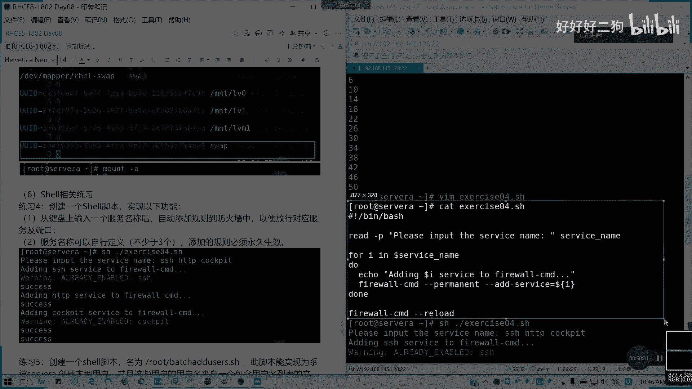

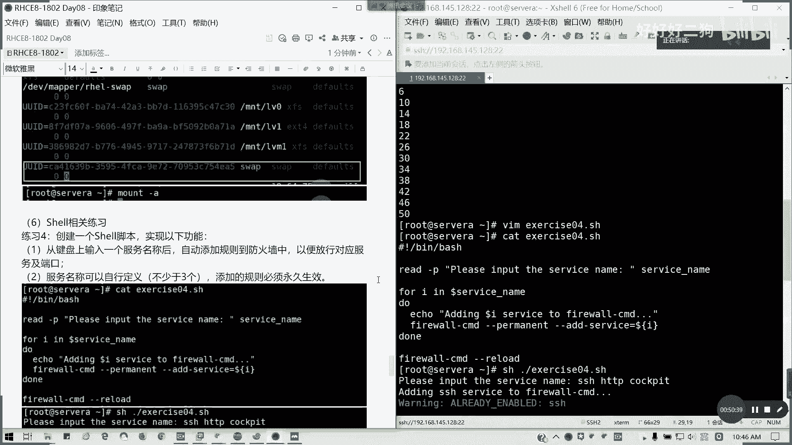

### 练习九：Shell脚本 - 简单的服务管理脚本

**题目要求**：编写一个脚本，根据输入参数执行不同的服务操作（如启动、重启、停止）。

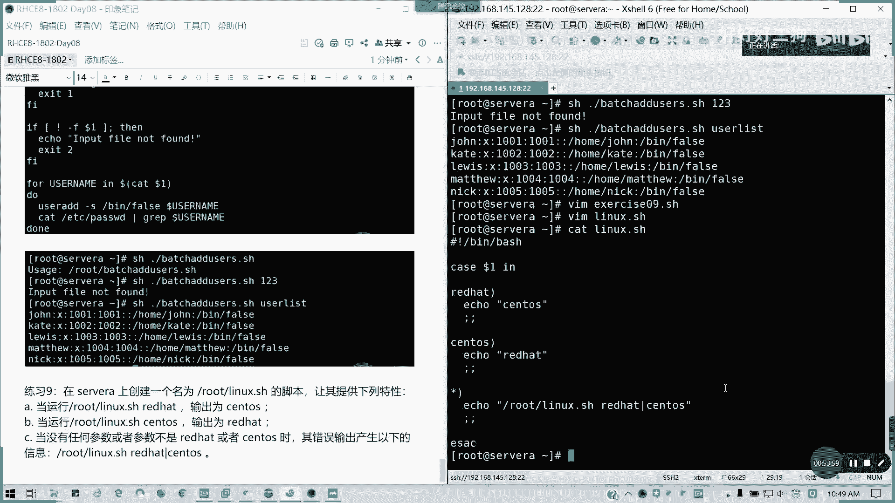

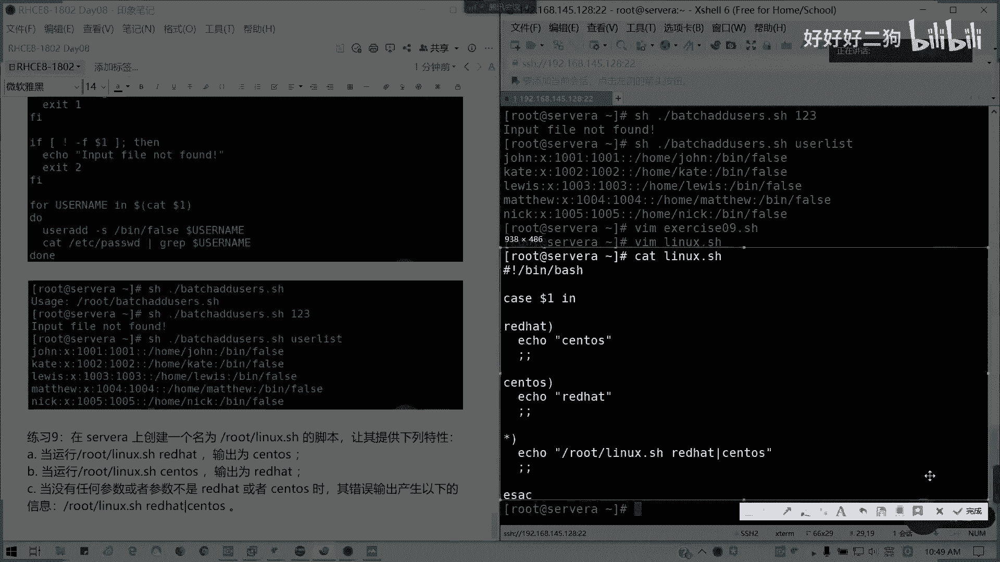

**脚本示例 (`service_mgr.sh`)**：
```bash
#!/bin/bash
case $1 in
    start)
        echo "Starting service..."
        # 此处替换为实际启动命令，如 systemctl start nginx
        ;;
    stop)
        echo "Stopping service..."
        # 此处替换为实际停止命令
        ;;
    restart)
        echo "Restarting service..."
        # 此处替换为实际重启命令
        ;;
    *)
        echo "Usage: $0 {start|stop|restart}"
        exit 1
        ;;
esac
```

---

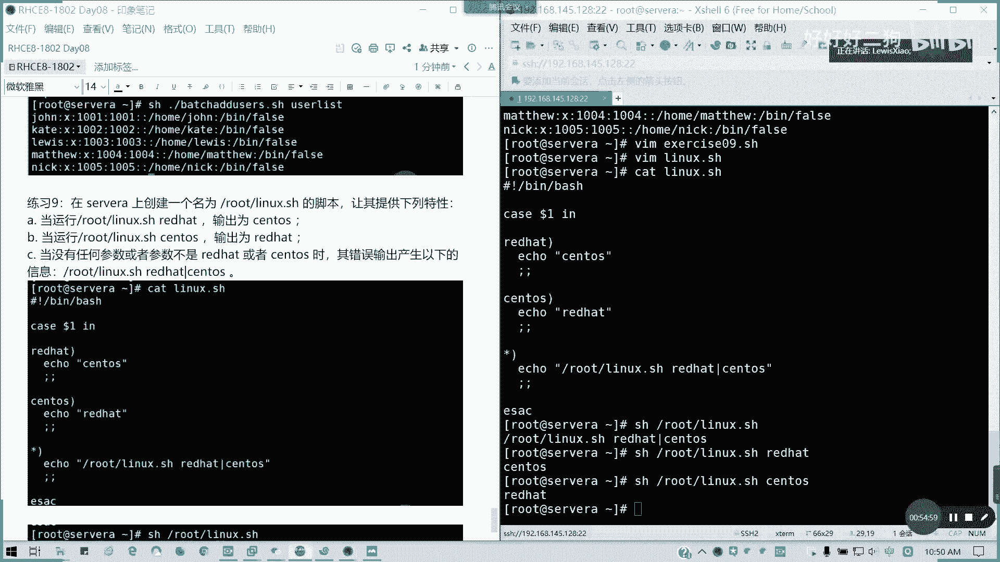

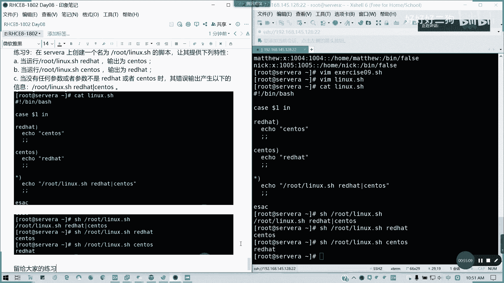

## 总结 🎯

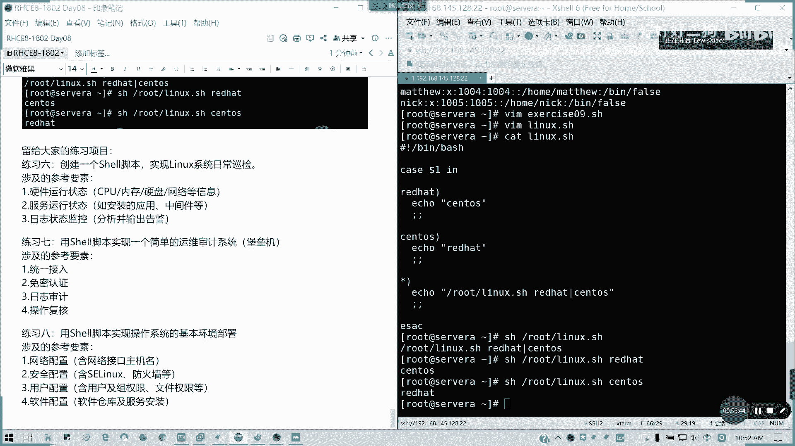

本节课中我们一起复习了第七天的核心知识，包括临时文件、系统调优、ACL、SELinux、磁盘分区和LVM管理。并通过多个练习题的详细讲解，巩固了逻辑卷扩容、Swap分区创建以及编写实用Shell脚本的技能。这些操作是RHCE认证考试和日常系统管理中的常见任务，务必熟练掌握。对于更复杂的综合练习（如堡垒机搭建），建议课后深入研究和实践。