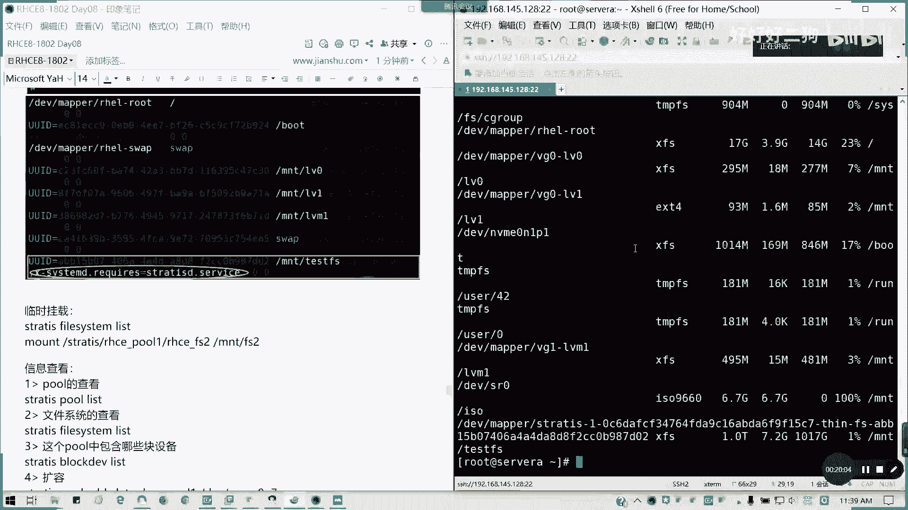
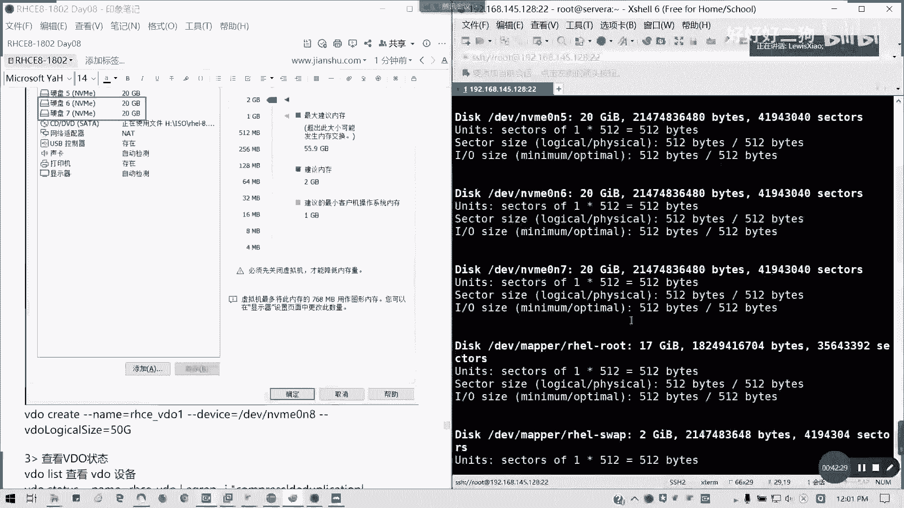
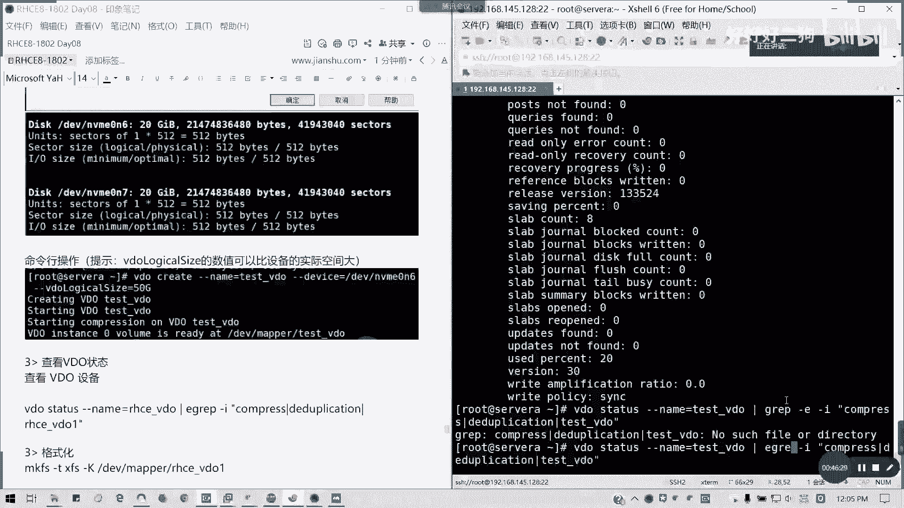
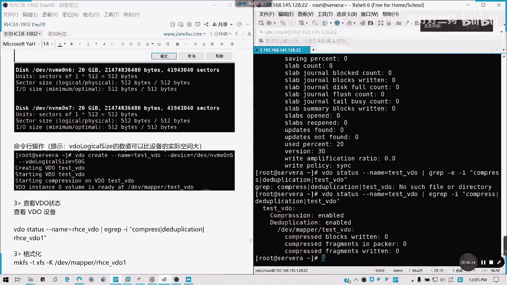
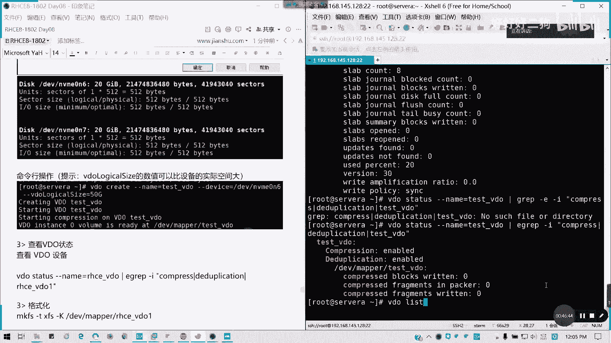
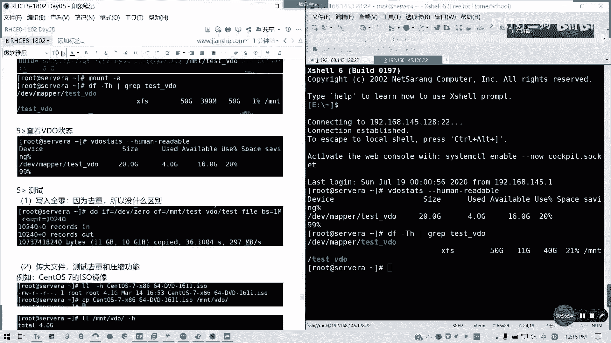
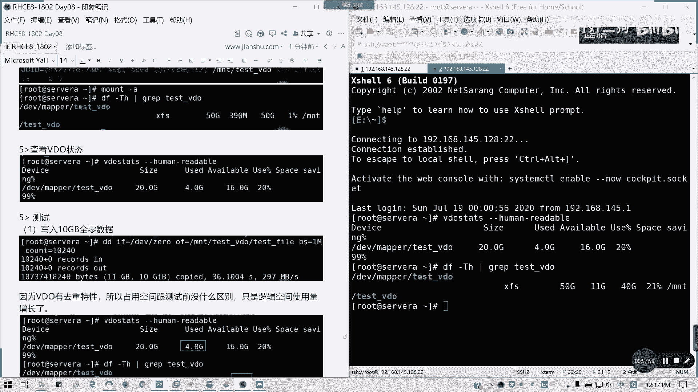

# Redhat红帽 RHCE8.0认证体系课程 - P46：46_Video_Day08_RH134_Ch08_Stratis_VDO - 好好好二狗 - BV1M3411k77W

好回来的话请打个回来的话请打个九啊，要不打个八打个八，打个八，回来之后先打个888888，我们早上先把我们的啊，先把我们的红帽新特性讲完，有两个啊，一个是strate，也就是我们的一个精简配置。

经典配置的一个共享的存储池，这个是我们在八点才有的一个东西，七点我们不讲这个啊，一个是b d o啊，其实它的一个原理呢，我们stratest的一个原理在书上是第八章哈，stratis原理。

它是将文件系统构建在一个精简的共享池里面，啊，我看有没有图可以找给大家啊，我这笔记我是没涂的，它是一种本地存储的一个管理工具啊，马上停止对他的那个最快的一个图片啊，或者等等，还是还是相对比较少的。

原理啊，原理我们知道了，那我们现在来看一下，其实他是那个存在它存在的目的啊，它是有精简配置，然后呢，通过它来实现经典配置，快照与基于池的管理监控等高级的存储功能，然后他的一个其实他问题其实会有啊。

问题就会有，我们现在的话主要他的一个守护进程叫strated，sweetest d，然后它是一个服务啊，threattest student service，然后接下来我们看一下大致的一个，操作步骤。

抱歉啊，这里无图，这里无图，所以的话我就只能通过我们的一个操作来吧，好吧，操作来截图给大家，现在我先清一下屏，然后呢，首先我们要安装两个包啊，一个叫strategy ci和stretches d。

在我们的在我们的那个包里面都有啊，df install e杠y strated，还有strategy，stratec l i，这是命令行引进它所入进程，明白我意思吧，哦我的牌没挂，好的装吧，没配啊。

没配那个我们把那个rap给配上，因为我昨天我系统还原过了，对不对，快速写一下，这其实我滚滚瓜烂熟了，所以都没所谓了，这两天在写多了，基本上都会熟的，好的，然后dnf my catch。

好了有了，那我们就直接装吧，strict d跟strict c l i，他连python 3都会抓，他的包是在我们的fg里面的，作为应用流的其中一个组件，他有装这么多对吧，然后他总共装九个包。

好做完之后我们要启动服务啊，第二步我们启动服务，启动我们的strated，来看一下strated啊，system control enable，strated，其实大了啊，他我看下他的状态。

status看一下，他已经启动，对不对，对吧，我们启动了这个状起，这个服务已经启动了，懂吧，大家可以跟着操作，然后接下来我们要创建一个词，创建词的话，通常说我们是它，我们建议是整个盘来用。

我看一下昨天我们的fdisk gl，看一下我们的那个我有一个盘mv v0 n3 ，是不是20gb还是空白的，对不对，还有空白的，那我们拿它来用吧，可以吗，我们有个命令叫stratus。

就一个词创建一个词，然后用，然后词名叫做test破，然后呢，我们用哪一个硬盘设备，就把整个硬盘当成十nm 0 n3 ，这个命的话就相当于把它作为一个strate，一个东strate是一个存储池了，对吧。

stratepoor list，我们已经有一个词，test for 20 gb已经出来了，然后我们在词上面，我们存储设词上面，我们自备完词之后，我们这个创建它的文件系统，创建文件系统呢。

用stratest file system create，然后词，然后上面再创建一个文件系统啊，stratus，file system对吧，文件系统他同样有，他可以同样做快照是吧，同样可以更名。

可以会毁掉是吧，可以有列表，那stratecreate，然后呢，我们的test fs，我的文件系统啊，我们先是在哪一个池里面创建我的文件系统，cs f s校线fs。

那我们看一下我们的far sim list，那我们创建一个文件系统了，对不对，他的图内，然后然后他用的546，然后创建时间，他device用哪一个，它上面有个strattest里面啊。

我们stratch文件夹里面test for test fs，它这是个我们装了服务中创建一个文件夹，其实这种时候可以直接，拿来用了哈，对啊，直接拿来用了，其实现文件系统已经在池里边，我们已经创建了。

对不对，创建砖之后，我们可以直接挂载文件系统，来看一下ui d在这里哈，u i d他这里最后一行就是英文u i d号，那我们直接可以挂载在那个etc，永久挂载啊。

永久挂载文件系统e v i m e t c fs tab，最下面一行u i d等于这个对吧，他这个已经帮我们提供了对，然后呢后面，t s f s我就突破这里，我们还没创建文件夹呢。

待会要是在我要创建的啊，然后呢我们的文件系统是x f s，对不对，他就用可扩展可扩展文件系统，然后defaults默认选项，然后我们还要加上一个他需要去，他需要挂载一个，x等于i n s。

我们的system d，一对不对，擦干啊，它有一个system，第一点设备是要挂载，所以它的我们的用法是差杠system d，然后，点requires就是我们需要，需要这样挂载一个服务。

strate就依依托于这个strate。service，就default后面加逗号啊，叉杠system d，我们算算计我笔记我是有点出问题的，所以的话我这里要写啊。

差杠system低点是requires啊，等于sistrate。service，然后后面后面是两个零，我还没哦哦对我还没创建一个挂载点，sweet d哈，我这里不要写错，其实就这一句最关键啊，懂吗。

记得default后面加个，括号，这样的话，我们就然后把我们把那个创建一个目录，n k d l2 ，然后呢mt tfs，然后冒杠a can fu d啊，这uid是不是没权了，我刚才uid是多少。

a b b15 b没找到啊，can find u i d，为什么没找到，我看一下，这不就是uid吗，唉我知道了，第二天还是要在这里看的，他这里的话它连在快了，所以的话他的那个device是不是怪怪的。

把横杠都省了，这ui d我们这里要看一下，这里才是真正的u i d，我先把它去掉，然后我这里bk i d，我先看一轮啊，我们为了保险先看一轮，然后把这uid就对了，不觉得很奇怪，ud不可能这么短的。

对吧，这样才是正确的，这里空格空那么多干什么，所以他拿这个为什么刚才没找到ui d，其实就是因为这样重点的话，我们就要加这一句逗号，deforce逗号，然后加上他的一个system低。

要求他启动这个strategy等思维斯的服务，引用他这个服务来，好我现在看一下帽子杠a，我现在刚刚创建了一个创建了一个那个，重新签证装订回来，转a可以了，df杠t h看一下。

对吧，虽然体操是一个精简制备的，所以你看到它是一个t的，对不对，其实他只有20g啊，默认选项啊。

它创一个一个t的精准制备。

我先说这一行就行了对吧。

它是一个存储池，然后做一个经典制备，它默认的选项好像是一个t，然后呢我们来看一下临时挂载的话，就是用mt对不对。

临时挂载wraitt strate，先看一下strate fire。

system list，他写上去才用了546啊，然后呢我们可以mt是吧，strate，然后test for test fs里面就他这个路径，然后挂到mt的，我们其实已经挂完了tfs，对不对。

挂载的方式是这样子的，临时挂载，然后关于我们的一个信息的查看啊，那接下来我们讲这一块应该都懂了吧，然后呢我们来看一下信息的查看怎么操作，首先我们的存储池的查看。

stratest plist文件系统情况查看，stratest file system list，那我们也可以查一下，我们的那个文件系统里面包含了哪些快设备。

stratus rock device dev啊，那我们如果要加盘啊，如果扩容的话，加盘怎么加呢，我们现我们我们加盘的话，比如说我们有个有个空余的磁盘设备，我们可以把它加到stratus进去。

比如说我要加一个这样一个盘，如果记得啊，我我我们记得存取东西都不能撑爆啊，如果撑爆的话，到时是起不来的，我们把那个扩容啊，我把空讲了，我先把那个机器关机，然后呢我这里我加一块m m m盘，我我试一下。

我加两块盘，因为待会我们讲到b d。

那么这个a我加多了，加多两块盘就可以了，因为我在b a b，所以我要关机。

首先我们要先加盘，那我们把机器开了。

放学了，呼呼。

我们是不是加了，我们加我，我们加了一个那个我们零三用了是吧，零三用了就在map这里已经用了，然后呢，我们现在加了零四个零。

我们把把那个m v m m device n v b0 n次，我们加上，将新硬盘加到库里面。

然后看后面有没有总结，要补充的，还没太大问题啊，然后我还是这个test for的这个词，然后把磁盘加进来，哦我加了n5 啊，比如说我把四跟五加进来，把四给我加进来，我们来看一看。

所以我们就变成60gb了，对不对，我加两个，然后我们发system，这两个这两个盘子盘嘛还是546，他这里空间还是没有变的，经典自备的足够快，我的我的现在这个自备的一个底的。

就是我们存储实际的空间已经达到60g变了，所以其实我们就是它的一个文件系统，就是在一个共享车上，然后我们注意啊，特别注意就是一个，我们如果往里面写东西，特别是要写空气问题啊，不要小孩写爆了哈。

你如果超过这个空间的话，会报报错一个问题的，虽然这里我现在目前没遇到，就他的经验支配时，如果超出空间的话，那那些性能是起不动的，也就是你比如说我现在我自备60个g b，那我就只能写60个g b，对不对。

懂吗，这词不能报哈，这一块的话没有问题，请打8a，strate学期讲完，他他其实是讲对讲一，这uid没有错的，这是一个精简制备啊的存储池，我们可以这么理解就可以了，这是我们的讲strate啊。

然后接下来我们讲v e d o，一起讲了video，一起讲了video，video什么呢，叫做虚度，我们叫做那个虚拟数据优化去优化器，其实我们就相当于一个去从减少设备占用啊，video的原理。

我们在书上面，我把这个图截下来了，到这里我手好像就有点那个，它是这样子啊，红帽企业八里面包含一个video的处理程序，它我们考试会考这个的啊，考这个v dio的，然后呢它是可以优化快设备上的数据空间。

一个占用video呢它是一个设啊设定射器，然后最大它除了减少快设备的磁盘空间，使用以外的，最大限度减减少数据重复压缩去重懂吗，从而减少它的节省磁盘空间，提高数据存储量，它有两个模内核模块。

一个是叫做透明的方式控制压缩数据，叫做k v d，一个ud是用来做重复数据的一个删除对吧，比如说我同时复制两个一模一样，就他只只只占用一个空间而已，懂我意思吧，懂我意思吧。

然后呢video层呢主要是用现有快设备的一个顶部，比如说我们比如说我们的瑞，这对我们本地硬盘，就是他在这个图上面我们很多快设备，然后快设备如果做阵列之后呢，我们可以把video架设在这里。

然后通过kv的底层去给虚拟机分配器使用，那么这些菜这边呢可以是加密设备，然后存储成了像我们的逻辑卷，我的文件系统也是位于video的设备之上，对我们建v video之后，我们再建。

我们在那个建立像我们的左右键文件系统，然后呢，这也是一个优化，使用优化存储设备的kv架构的里面，所处的位置就在这个位置啊，video呢为按以下顺序对数据实施三个阶段处理，以减少存储设备的一个。

磁盘占用啊，然后呢它通过零块消除，就过滤掉警方和零的数据块，而且仅在元数据里面记住这些快信息，非零数快就随机出一个下一个处理阶段，就一个经典配置是吧，如果你全部写零，它只会在从前面记录。

而不会浪费你的空间，好吧，这个过滤掉，然后重复数据会去掉冗余的数据块，比如说我做个副本的时候，它会检测重复数据块，并且有更新原数据，并且使用我们的重复数据块去引导原始数据块，不是上去冗余的。

像我们现现现在文件系统是不是，我两个文件是不是占两块地方对吧，两个文件的同样文件会占两块地方，但是在video里面只会占用一个地方，但我们可以做一下测试啊，然后呢利用通用重复数据呢，它删除服务。

它会将这个u d s内核模块呢，将通过其维护元素来检查数据冗余，这种内核模块作为video的一部分，提供这一部分是压缩，它是采用一个kb的内核，kb d的内核呢它是采用lz 4这个格式。

低压缩的压缩格式，对快进行压缩，并采用4k4 k对齐进行一个分组，这是一个video的一个原理，好处呢就是更加有效的去利用存储空间，原理其实就是取压缩跟去重，不要搜集驱虫。

好那我们来看一下video如何去操作，这也是红帽新特性之二啊，video操作方法，这里我们也是红帽的新特h168 新特性之二，上面我们讲的是新特性之一strate，我们首先来装。

我们可以dnf色垂下v d，它包含了哪些模块，对不对，k mod k v d，还有一个叫video，两个，我来看看啊，看看video，我们收到了我们的k我们要装video跟k v d对吧。

那我们直接装就行了，df那个store杠y k video，还有k mode kvd，装这两个，他这两个包呢，他在我们在在装那个标准的时候，已经装过了，然后接下来装完之后，我们创建vid卷。

创建video圈，我们现在没有盘了，是不是我要再加一块，那好我们现在又要得得关一下机啊，虽然现在我的硬盘很快啊，主要是我mvm，我要我这边我要加多两块盘，我为了做实验好吧，mvp是不支持热插拔的。

所以的话你必须要关机，讲完这块我们就上午就到这儿啊，就讲完这块就够了，然后下午我们就还有内容，就是讲那个网络文件系统破密码，还有就是后面的防火墙，就讲这三块没了，我们在建造建多两个盘吧。

为了我方便去我去我做实验，反正盘反正硬盘空间我一踢，然后我里面分了600g对吧，分600g，然后现在我看一下我自己用的多少啊，像我的像我的那个我的我的g盘，就拿一份取机的，你看都用差不多一半了。

我还我还有些东西还没加载呢。

ok那我们把它开机，我们加了确定硬盘了。

我们增加了两块盘，叫做nb nb 64班，六个磁盘七，我们再来做这个实验。

因为刚才一小心加不小心加多，就我十加多了，加了两个好。

我们重新连回来，嗯我用了两块虚拟磁盘在这里，然后呢好了，可，我们来看一下video怎么创建video create，我们这里可以创建比它大的，就是它的一个逻辑空间，可以比他大，因为他可可以采用驱虫嘛。

压缩驱虫压缩对不对，然后name等于test video一是吧，我tv d就可以了，那名字可以自己定啊，如果考试的话，跟你考试要求来d v m v，我先等等，我看一下我的fd 4个键。

不急，我看一下我们f disc，我们增加了一个nb 10 n6 个n7 。

先不急啊，我们确定我们的名字先啊，面向操作video create，首先名字我test下线video，然后我们用哪一个裸盘，这里指的是裸盘啊，d v m v m10 n6 ，我就用这个牌。

然后我可以创建一个logical size，它可以比他大好吧，它逻辑空间是可以比较大的，因为它有压缩驱虫的功能，比如说我要创建50个g对吧，实际上我是20kg空间是吧，它这个空间是可以比较大的啊。

因为它有一个压缩系统的一个特性，然后呢我们接下来我们查看一个video状态，用video list可以查看我的video设备，对吧，它只显示一个test video，那我们可以直接。

用video status是吧，然后杠杠name等于test点为dio，然后我们这里的话会显示很多东西，我们用egrep的参数，杠i就多重条件嘛，我们看一下我们的压缩之间有没有启用就行了。

compress对吧，第一down precation，如果我们这里什么都不写的话，我们可以看一下啊，不写的话是不是一堆信息啊，懂吧一堆信息，但是我们很多不需要的懂我吧。

所以的话我们我们就后面用e grape参数。

for the grape gu，杠i我忽略我忽略大小写，然后呢压缩compress。

因为我们要压缩驱虫嘛，第一duplication，然后我然后然后再涉及到我的名字叫做test video。

上划线v deo。

看一下啊，好像哦，用e grape正规翻译。

对吧，它的压缩跟驱虫状态啊。

压缩跟去重。

都启用的对吧，什么compression是吧，然后他的现在状态就是有没有我快被写入。

有没有有没有那个派克碎片。

有没有写入碎片，对不对，这里是压缩。

这是驱虫。

然后我们串完之后呢，这不是这图啊，然后呢我们串完之后是不是可以拿来格式化了。

对不对，串完我们video之后，我们是不是可以拿来格式化了。

格式化的话，mk f s，比如说我们格式差f s接着杠加杠k哈，点tf f杠k大k b v我们用不，我们用那个l s p k，看一下是不是有个tsv deo那里的，那我们其实其实我们就可以map对吧。

这里还没有啊，sp l k已经有一个tx b d，这里出来50g对不对，看到没，然后strate他一大堆东西啊，金库啊，这还有这些，那我们现在可以啊，mk f s点差。

fs杠k我们用d v map要映射啊，test video把它格式化文件系统，看看参数是啥，映射方式来，好接下来挂载，test video，然后呢，我mt是吧，那我要我我比如写一个。

文学我我我们就那个直接用挂载吧，我的ui d，太长了啊，重新创建一个文件夹，test video太长，我们写这一行就行了，我们uid是这个我们用的还是挂uid吧，习惯一点，那我们写fs type里面吧。

你看冗长的啊，uid我刚才我我复制一下uid，在这里还是挂uid好吧，你可以挂dev map都没问题，now mt test video，然后xfs格式是吧，default就行了，零零，抓罪哈。

然后wq保存冒杠a看一下，df杠t h gra，test video对吧，50g对不对，我们经典自备了一个50g的空间，然后呢我们可以查看video状态，用人类可读的方式啊，video states。

杠杠human，readable，这里可以看到我们的如果不加会出现什么情况，它是按照brock对吧，按照我们的bug，按照我们的区块块来来统计的，我们用human readable的话。

就按照我们的容量来算的，目前使用的4g对不对，那我们现在来做一个测试，我们来试一下，写入全零，mit test video，诶我看下bd if，我想想啊，if然后d v zero等于吧。

就我input input file，有个output file，对不对，我们用生成那个文件，is the directory，诶我不是挂载了吗，哦我写了个文件啊，我不能写出个目录，对吧，我写一个全零。

十个g的前20个g的前提，我们打开另外一个窗口看看。

我们看看现在的状态啊。

你看这里就变成一个11，你看行，写完了11g是吧，copy我写了十个g的数据是吧，我学了十个g的数据，然后呢，我这里我看到的df跟t h跟那个human，跟我们的这个q6 p差别。

你看我这里就变成11g，但是其实我占用的只有四个g。

对不对，懂我意思吧，所以其实看起来就没什么区别。

因缺它已经把蛆虫子去掉了。

对吧，因为b du jin有那个，驱动特性，那么我们传个大文件，比如说我传一个红帽八的一个镜像。

我们这样把它传进去吧，可以吧，让我们看看一个区别，我船在我们的mt，video test video对吧，我这里有个19test fire，那好我现在我传一个红毛八的一个镜像，我们传输。

等一下我把它删除，等一下我我去建一个文件夹吧，我要从设置去重啊，test video，然后呢，mk d2 是吧，我放两个目录，d2 我们设置到系统目录，系统功能，模式的方法啊，看一下我们用ftp来传。

现在刷新一下这个我们传一半啊，我不要删掉，我传一个30s镜像吧，快一点。

四居多。

因为这里是想用虚拟网卡去传输的，所以的话它也相对比较快一点，好带我们看一看啊，我们在内部复制就可以了，我传上去，我不用不用算两次，因为传实在有点慢。

然后我们船的期间呢，我们可以看一看它的空间是不断的增长的。

对吧，现在1。8区，然后我们看一下human readable，控制就会开始增长了对吧，对啊，所以我们复制第一份文件的时候，是不是空间一直在增长了，等它复制完，数据备份常被丢，如果你要是像压缩使用情景。

比如说你的那个冷，你的那个就是经典自备是吧。

使用场景我这里要写一下，我们的一些重复性高的数据存储全部最高，还有就是我们的通常是冷数据啊啊，还有就是数据备份，以及一些需要，经典制备的介绍，经典制备的一个场合，对吧。

我现在传完了04：39，我已经传完了，我们看看一看我们的是不是4。4对吧，我现在是8。7，对不对，我们看一下啊，现在传达文件传完之后，我们现在的空间，你需要43%，对不对，然后省出省68%。

让我们看一下我们我们的那个df杠h，然后grape，这是15车，看这三个数据传完之后，我们是8。7，那我们再复制同样文件。

我们cp是吧，这个文件，然后到dr 2里面。

我们这边看到。

m n t test video是吧，我们这里复制的话。

我这里他继续在操作，我们一边在看。

复制完了，那再复制到d22 里面，复制完之后呢，我们来看一看啊，查看我们现在情况，对不对，我们负责dr 2里面了，然后呢我们现在来看一下我们的d tube readable，甚至说还是8。7啊对啊。

因为驱虫嘛没有变化嘛，然后我们的占用大小呢就变成了20了，这里跟原来87是不是没有变啊，就实际占用的是我们是8。7，没有变化，然后这里就变成了20g了，就它会逻辑的话，就算上去的，对不对。

这个文件是相同的，所以这个场合其实用的时候就不要管了，这个设备是对我们这些重复性数据多的，一些冷数据的话，那就非常好的了。

对不对，然后呢我们这个小节我们就把它删掉了，因为我觉得目前来说还没必要这样用这个程度，我们的今天早上的一个内容，所有内容就到这里啊，所有到这里，如果，明白的话请打8b哈，理解清楚明白的话。

请找8b有问题可以提问关闭，就这块我们考试会考一道题，ok 29分，那我们早上的内容先到这里，我笔记可以先给大家看一看，中午可以做好练习啊，这是第八天的第一部分，然后下午呢我们还有内容。

下午的话就是讲auto fs，我们讲fs文件系统以及呃，牌照破密码启用目标，我已经讲过了，还有一个就是帮我强，就剩这三部分了没有了，134就今天下午会讲完，2。10分，我们这吧笔记先发给大家啊。

早上笔记，然后现在中午吃饭，我们先中午先这样。