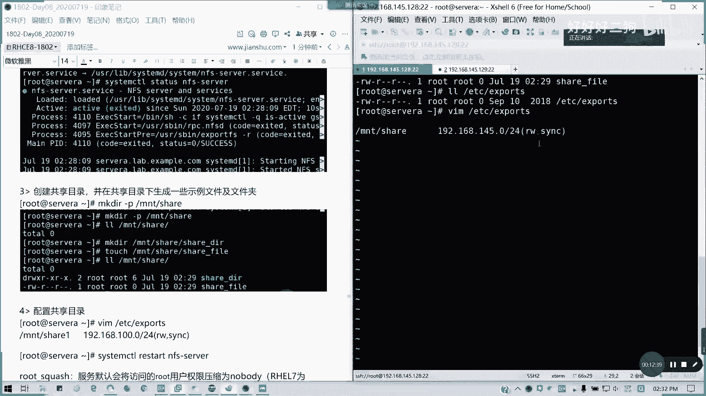
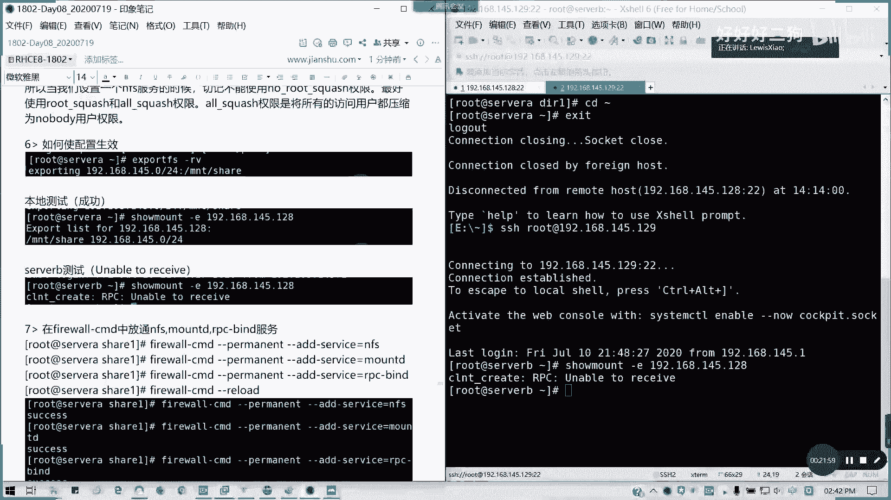

# Redhat红帽 RHCE8.0认证体系课程 - P47：47_Video_Day08_RH134_Ch09a_NFS_autofs - 好好好二狗 - BV1M3411k77W

ok重新讲过啊，没事。

我们现在剩什么东西没讲，n fs，还有那一个破密码，也是我们的系统的一个故障处理，还有就是我们的防火墙美甲，其他的我都讲完了，web的话，我们作为选学内容看时间，下午的话我们还有半天。

我们今天把cc结束，如果能听到请给个一啊，可以听到请给个一哈，我们现在的话，来看一下n f s访问网络附加存储，我刚才前面那一段我会把我我不会再，就是说我待会儿这段我不会保存的啊。

呃这一段我重新帮他讲啊，n f s访问网络附加存储，我们在c e7 的时候，以前六跟七版本这块是作为c一的内容，重点内容，rh c的重点内容会考两道大题，然后在csa又会考一个自动爆炸。

但是在c8 自动化因为侵蚀之下，我们不考服务了，那我们只考一道简单的一个自动挂载题目，就但是你服务端是要自己搭啊，服务端可能自己大，所以的话我们就把基本方法去讲给大家，首先我们来讲一个n fs。

我们的网络文件系统的概念，网络文件系统呢它叫n f s network fine system啊，目前可以啊，这主要用于不能用，仅限于了，主要用于unit和linux系统之间的相互共享，资源的访问。

对于windows来说，现在可以用用那个i s f s，但是我们需要借助第三方的工具啊，第三方工具类似的情形，你们相信你们都用过网络网上邻居，也就是以前的现在的网络文件共享吧。

网络文件共享在windows的话，为什么windows那个车型的，因为他是想用ser cn法作为一个工具，其实它是采用一种叫做简单啊，公共的网络文件系统c i f s对不对，那种跨平台的。

但是fs其实安全性会更高一些啊，我们fs呢其实我们想的一个问题，比如说我发布了一个目录啊，发布的一个目录叫做mt share或者是叫共享，这个目录，然后我服务器我发布出来之后呢。

我的客户端如何去访问辐射资源。

就是它发布出来之后，我怎么去像好像在我本地访问一样，去访问服务器端资源共享的目录出来。

这就是我们这一章节要说要说的一个目的，懂我意思吧，这章直接研究出这个东西，在我们挂载的目录之后，我们可以多个客户端进行共享，然后我们挂载我们客户端，就采用挂载的方式去访问，我们远端的共享文件夹。

但是注意你挂载还是跟以前一样，帮我们挂光盘是吧，挂我们的其他的一些存储多好，我们这共线创建目录肯定是要空的，挂的话，你去查找不到对吧，原来内容我查不到，这第一个，第二个的话，如果你要想要存文件。

那必须要把我们的共享文件权限打开，比如说写缺陷对吧，不然的话就只读懂吗，第三个本地挂载我们也可以设置权限对吧，这些的话是不是跟我windows共享是不是很像啊，然后至于我们的安全性方法呢。

这里的话为什么把n f s nobody划掉，因为我觉得这个是原来七点方面教材讲的，它也提供了一系列安全性的一个策略，足够的八呢策略基本相同，只不过他用户名改了对吧，如果是nn的话，就匿名访问啊。

匿名访问，他的那个对服务器的写入跟允许写入的话，它将采用低规格的，就不是用我们像我们的那个客户端。

我们就不是用root用户，直接去操作我们的远程服务器数据，它会降级成普通用户，nobody我们以前叫做nfs nobody，但现在到八里面改了名了，叫nobody，id为65534，我们可以看一下。

对吧，它是一个kernel over from user，相当于是内核的一个对吧，内核的一个上层一个用户，就是说权限没有多大对吧，只能用于我们远程的访问，他的id是6534，而且它是没有交互的。

懂我意思吗，然后像默认的权限，就是标准的权限去访问你的共享目录，也就是cs啊，没没有指定他就用这个值，好像接下来我们还有cobra验证对吧，cover验证安全性会更高。

像我们用的最以前用的最多的是k r b5 p，也就是客户端和服务端之间，所有请求都全部加加全部加密，对不对，这个应该明白吧，刚才我就讲了这么多，刚才九分钟没有，大家没有声音的时间，我就讲了这么多。

那理论说再多，我还不如来实践，对不对，实现我们这这里开始我们这这一章节，我们是需要两台机器，所以麻烦大家把我们现在除了server a之外，把server b我们上次不是说创建两台机器吗。

把server b也打开，然后现在我们来进行一个server a的配置。

首先我们server a要实现共享，我们要把服务端做好对吧，你没有提供服务，你哪来的共享啊，对不对，没有发布，我哪我哪哪哪，就好像比如说我课程没开，你怎么上课，对不对。

我远程链接没看我，你怎么连接进来，同样的一个道理好吧，那我现在。

我来装一个工具，但这个工具我们通常说在那个一开始装了，nfs utils，如果你们用最小化的话，你们可以装一下df。

excel杠y同样也是基于软件仓库的。

哦我重启的时候又没挂牌啊，对啊，nfs utils，在我们在按完整安装我们的红帽八的时候，已经安装成功了，所以的话如果你们最小化的话，是必须要装这个的，然后接下来装完我们启动ifs server服务。

我们直接一条命令system control enable，杠杠nfs server，让我看一下status，sas啊，我们服务目前是asset，因为asset因为我们还没有做配置。

就我们把机服务已经激活了，然后我们现在要创建一个共享目录啊，是不是我们接下来我们服务启动之后，我们是不是共享目录创建了，对吧，我要发布的东西给别人，对不对，那我们创建一个共享目录。

然后在里面生成一个文件，我们可以啊，m k d2 杠t to share，我们就创建shell就好了，然后里面是没有东西的，没有东西，对不对，那我们进去我们为了让客户端能够发现。

就是说能够验证我们挂载正不正常，那我们里面几个我们创建根目录，对一个文件就够了啊，我们touch touch，我们那个mk dr，然后touch一个需要five行不行，其实这里这里要干嘛呢。

其实我只是用来就是验证我，到底我的共享成不成功，我会发现东西对不对，而不是摸了一个一个目录空空，如也懂我意思吗，并在共享目录下生成一些啊势力的，这是我为了演示需要啊，就是让你们发。

让你们看到我是有东西在这里的，对吧，我就甚至这两个够了，那么文件夹有东西的，截个图啊，诶怎么被贴吧，那我们文件夹有东西了，那是不是要共享出去了，就我们也就现在我们已经有资源了，那是不是要共享出去啊。

共享出去我们配置一下共享目录怎么配置呢，我们通过一个导出export这个配置文件来进行，va配置文件啊，我看一下，etc exports，对不对，这个这个文件是我们要编辑的，他是这个发。

也就是说我们的一个共享文件的一个发布的，一个目录配置发布的配置文件，etc sports，那么好编辑一下，里面是空的啊，那我们怎么写呢，写的话就是我们的第一个，我们服务器的一个发布目录mt share。

然后我们的ip地址，我们现在是不是我们的那个lab域，我们的那个left the example领域。

是不是159在我这里啊，是192。168。一四点。

对不对对吧，那我们现在的话我们要让整个圆的反问，那我们就192远交68。145。024，刚好四，也就是说整个子网都可以。

然后权限呢后面括号写权限。

权限呢一个是可读可写rw，如果是只读就r o我们可读可写2w，然后加上同步。

我这里截一下图。

然后我说明一下啊。

所以我们的格式是这样子的。

共享目录我这里用黄色会更加显眼一点啊，共享目录。

然后这里的话是一个。

我们的网络地址范围，网络批范围。

中。

我们可以做作用的网络段是吧。

能理解吗，做个网络段，然后后面括号权限。

然后呢这里代表什么权限呢。

rw读写，如果说ro是只读。

我把箭头好像我这我啊我我算一个。

我写在这里吧，r w b权限。

可读写，制度。

然后呢上课，同步啊。

synchronization啊，synchris啊同步，但它是定时不是实时的啊。

好我们再把这里。

能理解不，这个有截图应该都比较清晰了。

然后呢弄完之后我们重启服务。

记得这里是一个修改式，是一个配置文件，所以的话我们记得要system control restart n f s server，记得要重启服务啊，然后如果通常我们也有那个root scratch啊。

如我们后面的一个选项，looks the crash，对于权限啊，我们如果后面加了一个root crash，就比如说这样。

我这里通常如果只要不降级啊，就是说按照原本权限来说呢，就是那个可以用no no supre，是不使用root那个降级，不过这样的话会很危险啊。

很危险，这种话不推荐使用啊，就如果是我这也是专门说的这个啊。

这里不建议使用这个权限，我所以把它擦擦掉。

这里我说明一下啊。

这权限呢通常我们用rua rush多一点，因为默认的话是lose lose crush啊，他这一个是将root用户压缩成为nobody，在我们红帽期以前叫做nfs nobody啊。

的确用户权限，但对这个用户的，对这共享权限是没有写入权限的啊，就对这个用没有的，也就是它是一个最低的用户能访问。

对不对，然后呢，就root你对远程文件夹你是没有写入权限的，因为它你管制管，你不用管别人的啊，管自己对不对，所以这个能懂吗，然后像note quest no roosequest的。

那就即使没有共享的，全是全写入权限的话，那我照样能够写入文件，那这样不是很危险吗，所以通常我们在设置一个n f s服务的时候。

切记不要使用no use rh，因为这样的话你连入侵都被人入侵，这真的不知道对吧。

后门大开，懂我意思吗。

是最好能使用啊，最好使用root quest和oequest权限，他就是所有用户呢都压分logo的用户权限，那就是最安全的了好吗。

降级使用，然后呢如何配置生效呢，用expf s r v。

这我不保存exports，fs就发布文件系统，gr v v是查看gr 4递归是吧，然后他是慢，我看expose fs，然后二杠二是什么意思啊，我看一下，cr v4 ，我们发布啊，发布这个目录啊。

发布这个目录，正式发布这个目录，我们只配置生效的，这些我们都不需要了，这些这些文都不需要了，我们就直接用图来说明，exports杠r v，然后在这里我们发布的是一四点，然后共享这个目录。

然后我们可以本地测试，用收帽子就可以，你在作用的ip范围内做完ip范围内，我们可以看我们的那个，看我们的发布发布的列表，对不对，用收帽子杠，一，可以看到我们的，就是说远端文件的一个发布列表。

像我们在其他在我们server b上也能用啊，so much，看看能不能获取到啊。

unable to receive，为什么，因为我们服务，我们本地是能获取，那我们远程不行，为什么我们防火墙没放，就他是没权限去接收，对不对，unable to receive，为什么。

我们我们没放通啊，对不对，防火墙挡住了。

所以这个时候我们要想想是不是防火墙的原因，所以这里的话我们会先讲防火墙如何放松，我们就先在我们的fire cmd里面，先教大家放通几个服务。

对不对，在我们server a上面，你要你要作为一个发，我们作为一个服务端，是不是我们要把端口开放出来啊，开放人家换的话，你闭门造车啊，对不对，我造个区都不知道啊，来firework c md。

这个我们详细的内容，我们现在下章章节就在下午晚些时候会讲，我们先讲讲基本的，我们放松几个服务，permanent，他问的是永久的意思啊，然后我们直接添永久生效的意思，然后我们添加服务。

add service等于放三个服务，nfs我到我的帽d挂载这个服务，md还有一个消息通，远程消息通知的一个服务叫做r p c，gm卖的，rpc如果你不会记得叫人品差，对不对，r p c杠半。

这是一个消息的一个，现在消息通知队列的一个通知，rv cm by也是放通，然后呢，此时把防火墙里露一下，好了，让我们在我们在测试啊，那我们现在server b再做一轮测试，可以的对吧，看到没。

是不是跟我们server a的本地测试一样的结果，那就是说明我们server b我们另外一台服务器，同个网段的，就我们作用域里面的服务器，能够去识别到我们的一个server a上面，发布的一个目录。

所以的话我们就可以实现挂载了，对不对，实现一个server b的一个挂载这一块，如果没有问题，请扣字母a啊。

我们分客户端和服务端来分别讲，有问题可以提问。

我server a一我们server a的服务端定配置就到此了啊，就通用的配置，而不是说我们加安全性的，就是我们普通的配置，安全性配置这里我不会讲，讲的话其实就是给kip 5 p的一个问题。

好我们看如何实现挂载啊，实现挂载鼠标好像蓝牙也没反应，我重新看一下好了，我们同样搜个b，我们要装一个包，叫做nfs utils，这个while，然后我们用它的客户端的功能。

我们现在接下来我们切换到server b操作，我们这里没配啊，没关系，但其实在serb上面，我们用rpm杠q a grape m f s，其实已经装了的，对吧，其实我们已经装了的，默认都有了。

如果我这里我没配样员，所以的话我们用旧图没关系啊，其实我们已经装过的，然后呢，我们要确认共享源，就是我们刚才的145。128，如果像出现刚才那个问题啊，我们刚才这个问题已经解决了。

那我们正常结果我们贴过来，这原因啊，其实我这里我后面又写了，原因是这样子的啊，所以我这里我就删掉了，因为前面讲了，我就不再重复，我们正常结果应该是这样子的，对吧，那接下来我挂载共享源。

我比如说我要挂载在那个我这边的，叫做fs shell啊，mk d2 杠p mt，我就挂在mfc shell里面，那我可以临时挂载，我也可以永久挂载，对不对，首先我们创建挂载点，然后临时挂载怎么挂呢。

mt杠t fs这里不用跟跟那个sm不一样，跟simc fs不一样，前面不是两个斜杠啊，现在192。168。14。18之后，m t我发不出来的m t share目录是吧，然后我这里的话为了区分手。

前面加了个n f s share，明白吗，然后df杠th看一下，是不是挂载成功了，我刚才发布的，是不是成功挂载了，我们这个t的类型就是它指定的，我们挂载类型是网络文件系统nfs，明白这意思吗。

这里的话记得要指定一个类型哈，然后这里是我们远程的地址，我还是写个注释吧，因为有小白在，类型是nfs，然后这是服务端，ip，发布的挂载目录，发布的共享目录，windows如果访问的话。

如果是c f s是两个斜杠的，但这里的话我们就直接对吧，windows其实如果我们发布的那个发布了ifs的话，也是这样访问的对，就前面跟cfs区别，就是前面没有两个斜杠，这是本地的一个挂载点。

因为这里主要是不够，所以说话它写成两行，显示这两行哇，反一点，因为我们是挂载，然后跟本地一样去访问，对不对，然后呢我们是吧，我们挂载的结果，在这里对不对，那永久挂载呢，fs tab来了对吧。

我讲实盘讲太多他了对吧，讲太多关于他的东西了，via a d c f s tap，在server b上面做，然后我们这里的话不用ui d了，192。168。14。228冒号，mt冒号。

后面是我们的服务器发布的目录，对不对，mt shell。

然后挂载到哪里呢，挂载到我们的n n t的nf s shell，因为为了区分啊。

不要两个搞混了，搞混了对吧，把两个混淆了，所以的话我们就把它区分开，我名字命格有点不一样，然后呢类型的文件系统是nf s g的。

不是x f s。

也不是e x t4 ，因为它是一个网络文件系统，懂我意思吧，所以的话就用n f s，然后挂载选项be false，默认就行了。

不fc部件启动不检查，不转储。

我们经常要跟fs tab去打交道的，好保存完帽杠a，冒刚a验证是否成功，然后我们先可以，我们可以去cd到我的mt的nfs渲染目录，是不是列出里面的内容啊，对不对，我们可以列出里面内容，对不对。

你看我现在我没权限写入啊，看到没有，我没填写入，为什么权限问题啊，这写入问题是有的，就这样，我们lol啊，我们看一下里面有没有文件，没权限啊，我们看到，没有写入权限。

此时啊，可以正常访问到共享目录，共享目录问题是通过本地，挂载点，通过本地的mt，nfs share来访问啊，发现没有写入权限，那如何去解决写入权限问题呢，我们看下面啊，我这里是第四点。

如何解决写入权限问题，我们因为这个ifs根本我们现在采用默认权限，那采用本地的，对不对，我们本地的话，因为我们是被压缩成了那个fs nobody了，对不对，就变成其他用户了。

nobody并不在我们的访问权限里面，你纵观你看到它的那个我可以看一下啊，这种官网他的他的那个词组是root对吧，但他是别人的root，不是你的，懂我意思吗，所以的话我们要加一，我们加一个写入权限。

在其他人加一个写入权限设置方法，一server端的共享目，这就是我的这边的话，我别的root对吧，server端的root，你跟客户端录制不是两回是两码事啊，对不对，就相当于我们部门也。

我另外我一个公司的老哥经理跟部门经理，跟另外公司部门经理两个不能不管是吧，你如果没有夜王的话，是不是，但如果要互通，我发不出来的，那我要给你授权写入，那没那没问题，我在服务端，我给权限就行了，降低哈。

主要是服务端我们是没有给那个其他用户，对于其他的root是不是其对于其他机械root，是不是对于我们因为它是压缩权限的，所以的话是不是对其对其他机械路程，是不是等于其他对吧，其他用户。

那我们server端共享目录，设置我们的o加w权限就可以了，来，我们要到二杠sd归o加w，然后mt sh，对吧，我们这样的一个写入权限，对吧，相对于，server登录其他用户，对不对，这个我刚才讲了。

那如果给它求权限呢对吧，我们将o加w给他之后呢，这个是server端的，对吧，server端我们设置好了，然后再client单看看开端，我现在我踏再踏出一个，我看的不是这种这种设置。

我踏踏出一个发一发现没有报错，对不对，是不是可以这样写入啊，这是第一种方法，懂吧，这是第一种方法，第二种呢就是一个no no lose crash，但这种基于安全性考虑，我们不太推荐啊。

这样可以用我们来做一个示范，那我现在把我的权限收回去，然后呢我们在vm下etc export，就不采用不采用root的那个权限压缩。

保存退出，然后重启一下三个服务，没有冲洗一个就可以了，然后我们把那个，我欧气大没啊，红球把把选w加上去，就刚才我们f一其实是在服务端的，我们那边看起来是root，但这边是nobody，对不对。

单排是全使用权限压缩的，对啊就是刚才我们引起写入说是不是nobody啊，这里我也补一下截图啊，server b的，就部署被权限压缩了，对不对，如果刚才就是我定一个权限的sb对应啊，好如果这样的话。

我直接我就touch一个fire 2，那我在这这里我直接touch，现在是l l，我看一下现在有个发音，对不对，touch发二，这是直接用root的，对不对，就直接有权限写入了。

那这种的话其实有点危险了，不推荐使用，还是如果我们要要给权限，还是直接在服务器中放放就可以了，在服务器上放是最好的，明白我意思吗，对应的思维我们也是可以验证的，就变成一个root的，好这个能理解啊。

能理解，然后请打b，我就是我们的扩张挂载，然后接下来我们会讲一个我们会讲一个什么呢，如果这个请打b哈，这个客户端挂载请打b哈，如果有有，如果知道的话啊，你理解的话，请打b。

然后接下来我们我们把自动过来讲，我们再休息吧，自动挂载，就这章的，我们另外一个内容考试也会考的，auto fs就是按需挂载啊，原理按需挂载，我们服务端不用做什么动作。

但我们要这里要把那个logo squatch去掉，太危险了，呼呼呼。

万一真的开后门都不知道懂我意思吧，所以的话按需挂载呢，当我们访问一个目录的时候，会自动把nfs共享部挂载到你的访问目录上，这是按需的，然后如果，如果超过五分钟没有访问，则会自动解除挂载。

就是这个是一个按需访问对吧，按需访问我们实现的一个方法就是一个auto，f f，auto fs服务自动化文件系统啊，顾名思义自动文件系统，然后呢我们auto fs服务如何工作，它是会持续去监听一个目录。

所以今天一个目录，比如说这个目录是mt是吧，然后，当我们，使用这个目录子目录的时候，比如说欧洲f m t o o f f，它会根据它会自动的根据我的规则文件，这远将将远程部的自动挂载过来。

就你不访问它就不会不会动，你访问它就动了，我意思吧，就像是自动门一样懂吗，我们进入自动门，我们不靠近它就会关着的，然后你一进去，它就自动打开的，就是这种自动挂载，因为按需嘛，我的目录规则。

就我的那个规则文件就是挂载谁挂载到哪里，那我们来看一下具体操作方法，首先我我们在设为a，我们不做任何的操作啊，首先提供前提情况下，我们server a仅在客户端，车尾端不需要做任何动作，懂我意思吗。

这段不需要做这种动作，我们在分文，我们在server b这里，我们server d是一个客户端，安装auto fs软件包，dnf，独特清下屏。

装不了，我配自家软件仓库。

我不用去配置，对不对对吧，那我就不用去写了，对不对，懂吧，重新挂载一下我们的光盘。

我看官方有没有mk dr吧，好我们dnf没开。

我连写都不用写了，懂吧，我们第一本书讲的东西啊，对不对，好，我们现在装一个auto fs，他是属于那个b sos里面的一个服务，一个包基本系统里面的一个包，好了弄完之后呢，我们启动启动这个服务。

它是一个服务来的。

诶没有反应了。

重新点一下，好连上了，我们从我们来启动启动这个服务。

好了。

来检查一下它的状态。

对吧，它是一个it running的一个状态，不要跟着操作啊，然后接下来我们要配置一个监听目录，先听目录啊，接替他某一个目录，然后它里面的二里面的映射文件，对不对，所以我们要编辑一个配置文件。

叫做auto master，auto。master，然后如果你有子配置文件的话，可以在auto。master。d里面写到这里，我就直接编制它主配置文件就可以了，这里有很多啊。

像这里有一个示例文件叫做mac m i s c的，我们在这里后面加一行对吧，这一行我就坚信一个mt目录，然后呢规则文件我们这次一写啊，规则文件啊，l d a p这个命名可以自己命名的，我们就加入这一行。

这把他绑上黑色，把它糊掉，不方便我编辑哈好了，现在我们这里的话用auto master，对不对，auto master编辑这个，然后在这一行是怎么加入的内容规则呢，它是一个第一个监听目录。

然后后面是规则文件，就它会持续监听一个目录，对不对，什么规则，文件是auto点，l depp这个名字我们可以自己命名的，然后配置完保存退出，那我们是不是缺个规则文件呢，对吧，我们确规则文件。

那规则文件这里是什么内容呢，所以我们可以把，我们可以把这个，可以把可以把这个视频文件复制过来，他有一个视频文件叫凹凸点，mic，auto。msc，对吧，我可以复制成一个o凸点l d。

如果你不知道怎么写的话，你就复制过来，然后呢，vim etc auto。l带，这里已经他有例子给我们了，对不对。

有例子给我们，对不对，看到没，这有cd是吧，有例子给我们了，对把它注释掉，我们来往后往下面写，已经有例子给我们的简单了，我们这怎么写呢，n f s我们就是挂载这f f s目录。

那我们的网络文件类型等于f f s。

文件的一些fs，然后呢，我们的挂载的地方就是我们圆14。128，mt share，同样虽然是挂在那个地方。

我这里把它滚上来啊，这行怎么写呢，我们的格式我加的是这个这个内容。

其实上面都是一些例子，我们写我们的格式都是，按需挂载点，就自动挂载的啊，这种挂载点是谁，然后呢。

参数选项，通常是指定文件系统，然后后面，后面的话是挂载圆，对吧，我们的一个远端的一个发布的目录啊，我把它缩回缩为几行啊，懂了吧，这个能明白吗，它上面是有例子的。

我们copy的一个参照btc目录下的auto。mac，我们复制过来，我们就这么写就行了，懂我意思吗，保存退出，我们不需我们可我们配改配置文件之后呢，我们要需要重新启动服务的，那我们来验证一下自动挂载。

我在挂载到一个nfs，对不对，但是现在我还没挂，我server b上面什么都没有，对不对，好我访问问题，这个目录我们本来没见的，对不对，但是他们防范突然都有了，懂我意思吗，自动挂载的。

然后我看一下df钢铁h，是不是多了一个就拖出来了，我们cd过去之后，我们发现df杠天使是不是多了自动挂载，多了一项出来了，就不需要我们是手动去挂这个东西都知道了，那这里的文件示例哈。

比如说我们的一个挂载的一个nfs，对不对，mt shell，然后我可以挂我的xfs，挂我的光盘，都可以的，挂分区挂光盘都行，那留下一个思考题，我们先我们先休息一下，然后准备讲的就是如何指定远程目录用户。

并挂载加目录啊，这个就是我在本地创建一个远程用户服务器，存在的，那如果在home里面如何，如何去挂载对应的加密文件，去实现我们的远程文件共享，这是有的吧，我们的域是不是这样对吧。

偶遇登录是不是挂载远程文件，然后那个文件是连文件夹是不是保存在本地的，是远程的服务器文件夹的，那这种情境思考一下，我们稍后继续，大概03：40好吧，讲了一个小时了。

