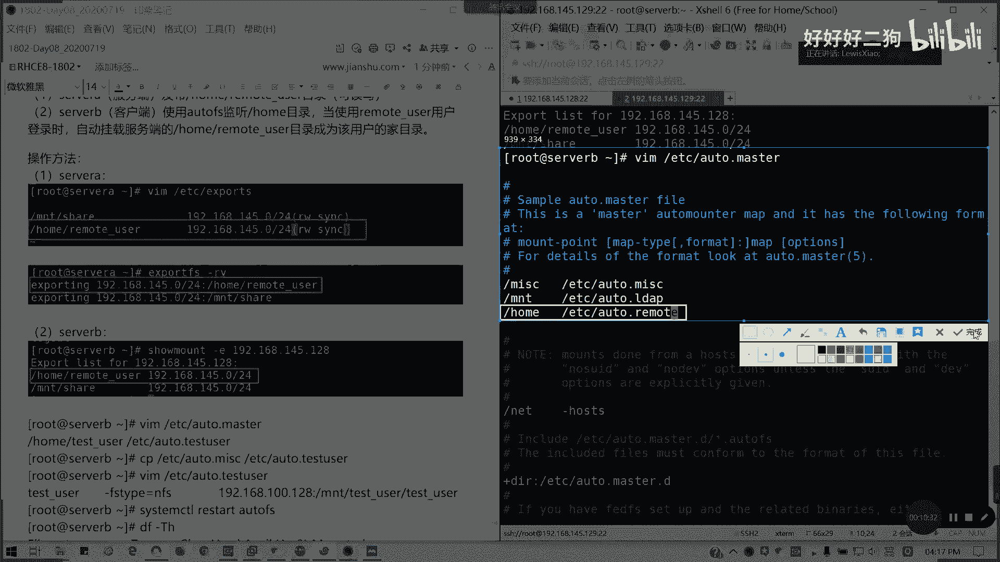
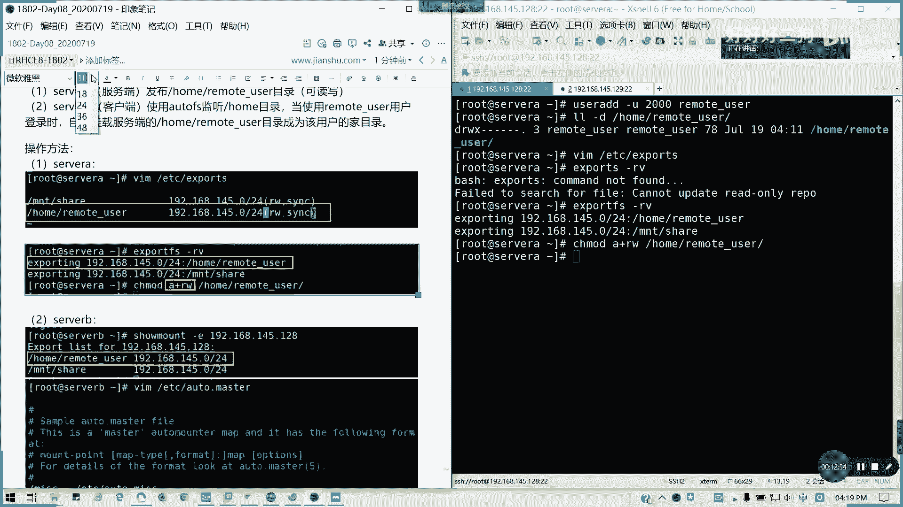

# Redhat红帽 RHCE8.0认证体系课程 - P48：48_Video_Day08_RH134_Ch09b_autofs实例 - 好好好二狗 - BV1M3411k77W

好，我们来思考这个问题。我们思考这个问题啊，如何指定创建用户啊，并挂载项目录。我们这种的话通常用在AD域里面，对吧？AD域我们挂本地挂载我们的内容啊，挂本地挂载，就本地我们登录我们的域账户呢。

它会直接把我们的。网络我们远程的那个预服务器，它通常的那个我们的用户文件，如果是用预登录的话，它会保持在远程远程的位置。然后我直接在别的机器。我比如说我A机器，我登网里面保存一些文件。

然后我在B机器登录的话，我们依然能看到，对不对？但这个文件并不是保持在本地是保持在远程目录。所以的话我们linux也要实现这一个同样原理，所以的话我们这里解决思路啊。在本地创建一个指定远程用户呢。

当然你这个服务器已经存在啊这。前提是该用户服务端已经存在。然后呢，自然后本地的home目录的下面会自动挂载服务器端对应的加盟的文件，从而实现。文件共享啊，我们假定情境，我们来实现一下。

现在我们这么多我们不看了，我们来确确定来看一下一个。MKD2。我们现在固员KDR，我们直接userad。比如说我创建1个2000，然后是我们叫做。remote user叫远程用户吧。铝模tous色。

然后加木的它本身已经有了，我就不再指定了。LL杠D。ho的美猫 user。对不对？他的那个属主这些已经定了的。然后呢。我们现在切过去是不是正常能够读取大家目录？remove啊。

我们是不是我们可以看到它的架目是homere user，对不对？好，我们现在回到这里，我们I杠F。home下面remous目录，我把它删掉。然后现在我删除这个目录之后呢。再切过去。对吧缺不了。

但是我们又想说，假设这个用户我们在远程云存在，那我们怎么挂过来，对不对？自动挂载，这个是我们要实现的一个目的，明白我意思吗？好。这里是我假定的一个情境。

Remote。user的加目录。被删除。无法切换。

我把介样到其中，那怎么解决呢？其实这个就是一个问题。然后。假定我们啊我们来做一个。远程用户啊远程用户我们我们没有做一个共享。比如说我在车维上面。我同样。建立一个。我同样建立一个用户可以吗？

叫叫remote user。对吧那我们的我们的那个。远程用我们的LL看一下。我我把问题画简单吧，因为我原来的一个。模把我原来一个原来的一个思路呢，就是在我们的普通目录上面创建，对不对？

那我现在的假定就直接在换目录上面，就在我们远程里面，他也有一个专用户是吧？那后我要把它挂载到我们的设设P上面来，我就假定这么搞。

但我们通常在scale环境的话，就不需要去去理会这么多了。

那么操作方法怎么搞呢？来。

那我们现在啊就是。需要完成事项就是将。本地将。或啊服务器啊。所我A。服务端。发布p的remo user目录。对吧我们服务端发布这个目录。然后呢。可读写啊。然后呢，搜B。客户端。使用。

自动挂载auto FS监听我们的。号目录。然后当。使用。remote user用户。登录时。自动挂在。服务端的。メモユさモド。陈伟。该用户的加目录。懂我意思吧？这是一个需要完成的。

东西。那好，我们操作方法来弄。来，我们再搜尾一上配置。🎼BDC isport。然后这里我们加一个。home里面的。呃，叫remote。优色。所以我再打个tab啊，为了对齐同样192。168。145。

024，然后不用no不要用路 no surprise啊。就可以了。

加色以下。

然后呢。弄完之后发布。It's ball F S杠 RV。

我们发布了一个叫做home remote user的这个东西。

好，然后在s接下来我们在serB上操作。这备。🎼同样smount杠1。192。168。145。128，对吧？我们看到了我们的。

发布的这行。对不对？

发布了这一行。然后呢，我们要编辑一个auto master，就刚才我们讲的。

点 master。

然后在这里加一行。叫做。我就先听我们的后目录就可以了。E。Oto。对啊。Remo user。Remote。就可以了。

加这一行。这文件名其实是个自己次取的啊。

然后呢。我们CP1下EAC的O头点麦克。到ETC的Oto点。Remote。🎼然后呢，我们再编辑一下EDC的Oto。点remote。

🎼然后这里我们把CD这里注释掉，然后我们在下面加一行。在行什么呢？Remote。有啥。对吧杠FS type等于NFS。我们刚才这里的我们我们记得加个权限，不然他他没法读，没法写啊。有啲 o加 w。

他现在远程是没有权限的啊。呃，我看一下OA加。RW好了。不一定要执行，我们所有的话都要啊。不然的话，他的权限会出问题的。那加木录的话，他要读写，对不对？他默认的话，只这其他人是加其他人是读写不了的。

这里我们记得加一个A加W啊，所以的话我们要补充一下，不然的话我刚漏了一个问题，不然的话我们的这个换目录它本身对于其他用户是没有任何权限的那就麻烦了，对不对？

好，我们回到测我B来这里是吧？这里我们写什么呢？192。1468。145。128。换目录下面的remote。Youa。

这里我还后面我要重启一下服务。记得我们从其他服务，为了稳妥啊重启服务。这是5A上面重启服务。

好，在Oto remote这里呢，我加了一行。

就是这个。

然后接下来我们重启一下。

O F S。

弄完之后，我们重启。System control restart。Moto F S。对不对？重写完。本来。我试一下啊。我切换到一个。Remote user。我现在应该生效了啊。

这是自动挂载了。

是自动挂载的，对不对？

这就是我们。一个模拟的一个就是一个情境模拟的一个环一个环境啊，就我切换着我就不会再报错了啊，懂我意思吗？那我这里的话我可以尝试一下写文件能不能成功就知道了。

哦。他老师。是吧。

可以对吧。有东西出来了对吧？这样就对了，这样就是我们的一个。想要的一达到的一个结果，就是它可以当做自己的加目录去使用，就相当于我们模拟出一个远程的一个东西啊。好吧，远程自动过来加目录。

这个例子我们讲到这里啊，刚才有一段混乱啊，包歉也都有点抱歉。啊，现在如果明白的话，请打字母C就我们第九章已经讲完。

关于FS就是举了这样一个实现例子，这个应用场景通常是在。

域里面啊应用场景通常是在域里面。

预控啊通常转应用场景在预控，懂了吧？这这这个题目的其实的意义在这里，预控懂吗？自动挂载，类似windows这样子。

预控的远程登录。第九章我们讲完。

