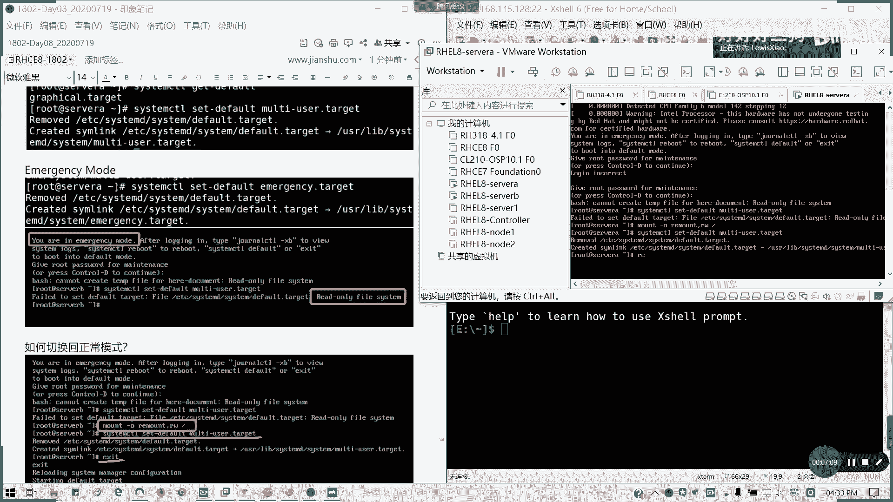
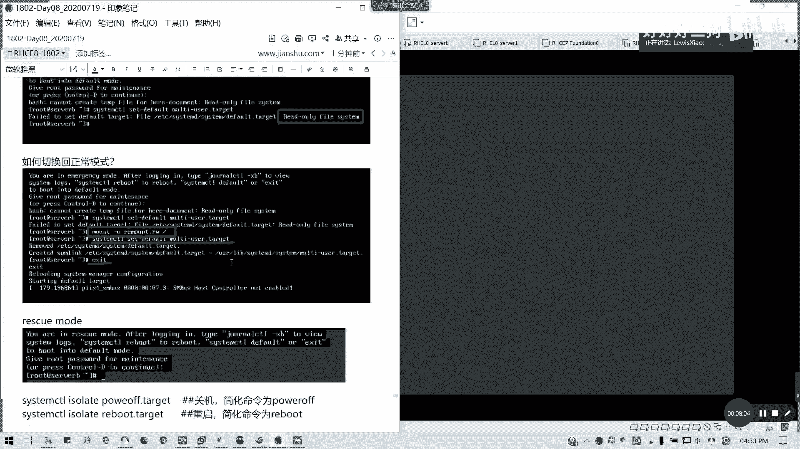
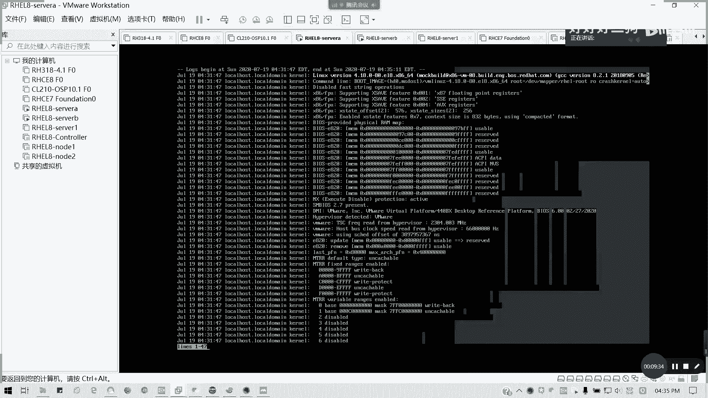

# Redhat红帽 RHCE8.0认证体系课程 - P49：49_Video_Day08_RH134_Ch10_管理启动过程 - 好好好二狗 - BV1M3411k77W

第十章控制启动过程，我们的我们的倒数，我们书上倒数，第三章最后一章我不讲，为什么，因为有些东西已经讲过了，因为有些东西我已经讲过了，所以的话我就没必要再重复了，所以等会我们重点来讲一下。

我们重点讲一下那个第十章的内容啊，第十章内容，然后看一下第一个选择启动目标，选择启动目标呢，我们我们在前面是不是讲了第一节课，第一天的课，如何切换对吧，如果切换图形界面，文本界面。

还有就是那个救援救援模式，以及我们的紧急紧急救援模式，以及我们的恢复模式，对不对，我们启动目标，目前在红帽八里面有以下四种，对不对是吧，选择启动目标，然后常见操作是吧，临时查看，查看查查看启用目标。

然后零时如何设置默认，如果4000万都懂吧，我就不再重复了，这个我们在第一我们在讲访问命令行的时候，一定有讲过，对不对，那接下来我们看一下如我们的啊，当前system control啊，好吧。

我这个切回去root，先，我当前的启动目标，system control get default，我们当年是graphical是吧，那我可以切到，切到文字文本界面啊，set defaul。

multi user target就可以了。

这个是切启动目标。

然后如果像切像，有些模式是不能随便切的，像紧急模式啊，紧急模式，这样你切完就不用启动了，对不对，现实就是这样一个解读系统，其实通常是通通常是那个出现故障的时候，我们才用的，对不对。

平常我们不要随便去切啊。

懂吧，图形界面切换的文本界面是这样子，那emergency mode，如果不小心我切换到emergency mode，那怎么办呢，比如说我就这样，就我就我就来进行这个误操作哈，那我重启。

这种是非常规操作啊，我是只想给大家看。

给大家看到，不要学，就看到这种是什么结果啊。

回到我们的vr vr，看到枪基本模式怎么怎么结果啊。

我笔记在旁边。

很久啊，有点慢，因为tvance mode的话，你要把它改回来了，但他这里会比较慢啊，我看一下他切到什么情况，你看没有，a job，sony就device map是映射的问题，粉丝要等他超时。

那你这个档期了嗯，没有，那这个是另外一个就是改密码的问题，sin record，要等它断。

比如说我现在我就不小心我进入一个救援模式，会出现怎么样，对吧，我直接是吧，他这里直接的话进入基本模式，而且我们输入root密码，对吧，他是一个只读的，对不对，只读。

那我们怎么办呢，我们要重新去挂载，只只能是重新去挂载，插成独显模式，我才能操作，懂吗，我们这里我们直执行直接执行命令不可以的，system control，set default。

我们不要说这些这里能够操作的啊，default，然后mti user target，这是一个read only five system，对不对，那我们要怎么办呢，这种情形多切换到正常模式。

我们要干o帽子杠o重新挂载我们的根对吧，remote，然后重新挂载成读写，然后后面盖根就可以了，然后我们这样切换，然后再report讲c e s i c就直接退出。

然后他就不会设定啊。

启动到我们的文本界面，都明白吗，可以明白吗，在emergency mode，在我们的救援模式，在我们的那个紧急模式下面，我们如何切换，我们必须要将我们的那个根重新挂载。

这样我们跟重新挂载，不然的话你会出问题了，对吧。

这样我们的根重新挂载remote，然后挂载成读写，这i e s c我可以看出它启动内容到底卡在哪。

然后像rescue mode的话，也是救救救救援模式，将这种出问题的时候，我们才才会这样，然后还有就是我们的关机跟重启是吧，其实我们运行这两条命令，而不是以前的i i t6 跟t0 了，对不对，代替。

nnt 0。

懂吧，现在现在是替代这个命令啊，这启动好久啊，诶又是剪力模式了，我不是切了吗，要出什么问题啊，我看一下，虽然no cctv杠x b。

好像没怎么写出哪里有问题。

好像没有没有没有没有怎么写出问题的，我看一下，我从我退出看一下。

当时我经常出，那就这模式他可能挂载啊，或者哪里出问题，那没事啊，我们在另外一台机操作都可以，这个的话其实讲完这个的话，这台机都给废了的啊，但是但是希望都有大家不要做那个出问题的话，我们要记得把它整回来。

我们现在的那个129还能用啊，先不影响课堂进行。

我一八先不管了，然后呢我们来教大家从如何重设root密码。

传统题目啊，这个考试我们实际上可能又会比较多啊，就说你一台机器不知道密码的时候，我要怎么去重设对吧。

我怎么重设，然后呢在考试里面你第零题懂吗，一开始就让你会密码，如果不会，那如果你密码不对。

零分登录了系统，这道题是属于零分的。

所以的话我们这里以serb来例啊为例，server a现在已经待会要看怎么回事啊。

我们以色为必然例为例，然后我们看看怎么去修。

就是说假设我们不知道啊，这个的话就是有问题了啊，我看一下是不是挂载的问题，诶我看这种xp，我看一下啊。

摸一下，system d没问题，这样帽子finish up，那个ui d是c92 那个，它主要是连接那个硬盘出问题了，416c6 d2 那个那我知道了对吧，通常像我们其实进入紧急模式出问题的话。

肯定是挂载挂载为为主啊，e c f s tab c6 哦，就这个我们video那个懂吗，六六出问题了，我们先把它注释掉，然后再然后再起来，这种是我们排错的一种方法。

明白吗，你看起来了对吧，看到没。

就刚才我看到看到那个video出问题，他那个挂他超时了，所以说我就把它关了，所以当我们设为a现在已经起来了啊。

待会再看v deo到底什么问题。

所以我就教大家如何去排错了，主要是这个c，有一个有一个机器起不来，有有一个硬盘我们挂了点起不来，所以的话就报错了，所以的话，这也看不到啊，fl啊，我看下，cn news auto river mark。

这个不要紧，主要是刚才那个挂载点没起来，就那个c6 的那个这里没了。

就刚才看到这个挂载点那个起不来，所以的话我们就通常那个日志啊，我们在11章讲的日志是不是很有用，对不对，我们在第一本书11章讲的这些，你要知道怎么去查，像刚才的话。

我们就他有提示说用journal这插句题外话，叉b啊，我们排除启动问题的话，最后组c t l杠x b，然后可以看一下到底从bot开始，从boss开始，我们从系统从系统领导开始，到底经历了什么步骤。

然后出了什么问题，然后我再把下一个问题解决了，所以刚才我把fs tape，我最后还注释掉，好吧，那么现在我们看一下sa如何重启，改密码来火力过低价，思维，笔记里面都有，我就不再改了啊，好这里看到没。

建造一个grab界面，我们有两个选项，一个是rescue的救援的一个界面，一个是我们正常的一个引导内核，我要改密码，我们要进进入的是我们的救援模式，紧急救援模式懂吗，也就是我们以前俗称的叫担忧模式。

从紧急训练模式切到单位模式，然后改密码对吧，因为我现在我假设前提我已经录制密码我忘了，我不知道怎么登录系统吧，那破对不对，好这里看我步骤杠一啊，按一啊字母上的一，这里直接到了修改内核内核参数的一个界面。

修改内核参数界面呢我们定位到linux，最好以前我们叫linux 16啊，七点的时候叫linux 16，8。6，linux对行，然后按n定位，最后然后我们可以啊，按光标我们定位到一个叫做，r o的地方。

因为它是夹杂一个尾根是吧，vv是一个尾根，然后后面再次加载一个实根的懂吗，再来一个尾尾根，这里尾根其实它就是为什么叫尾根呢，前面我们是有一些驱动程序文件，是要在系统启动前加载的。

所以他他为了方为了给这个环境对吧，鬼子给其系统启动提供条件，所以的话必须它要加载一个尾灯，也是一个v系统，我写的也是一个linux系统，然后用尾根去low我们驱动之后呢，在挂入我们的系统时根。

然后去加咱们的系统组件，对不对，你连驱动都驱不了，就说比如说你的硬盘这些没驱动的话，你怎么加的，对不对对吧，所以系统里面是有一个尾灯的，就是一些驱动，你也不要像网卡这些，你要驱动起来的好。

我们先谈了尾根啊，这里是夹在尾根的一个环节，尾根环境之后呢，他这个然后我们这里移到z l，因为我们为了加快速度，所以的话我们就不要后面的启动选项，我们按delete一直删，酸完怎么办。

r o我们把尾根的只读啊，把把尾根只读改成rw，然后后面加上r d。break，这个就是进入我们紧急救援模式的一个入口啊，他这里为什么斜杠呢，因为是换，因为它一行显示不了，显示不下。

所以都写显示到下一行，懂我意思吗，笔记里面有好，我们这里插线改完之后，我们下面有提示，press control嗯，x ctrl加x轴上对吧，可能加c是最q命令行。

然后esc是退出修改我们这里修改的内容之后，按ctrl加x，看到没有，我们进入一个尾根的一个救援模式，对不对，紧急救援模式，看到没，那现在我们要切换到我们的十根上面，切换到我们的系统的真实的根。

因为它只是一个尾跟系统对吧，后面的参数我们全部删掉了，就进入一个紧急救援，那我们如何切换到十根，salute是吧，change root gsx lute，对对，down slut，这是一个系统。

我们系统一个十根懂吗，实际的根目录懂我意思吗，就我们真正的根本区的在这里，我们现在当前是一个尾灯模式，intro fs吗，intro by fs就是一个尾跟系统，懂我意思吧，然后进入它的结尾模式回车。

那出现了一个叫s h杠4。4，这是我们所熟悉的一个单用户模式，也就是整个系统的话只有root一个用户，那此时是不是我们可以改密码了，对不对，改密码pass w d，或者是我们用echo直接一句话搞定。

可以吧，echo我还是叫red head，我假设不知道，然后我用pass wd，stand in是吧，stand in是吧，全面的输出输出变成后面输入，后面root，那这样我们更新问密码。

那请问做完之后我完了没有，没有啊，因为当前他进入的是尾根的系统，然后他sc news是没开启的，所以的话他的那个标签要重打啊，我们这里记得重打标签啊，重打sn linux标签，因为我们进入单人模式的话。

它的s60 是关闭的，不不不，如果不这么操作，你的系统会起不来，因为标签不一致，会导致整个内核崩掉，所以记得这一句，这一句不要打错，在根目录是在我们的那个跟挂载点杠点，auto reliable。

字有点小，因为它本身就是那个对吧，touch down，点auto revo，也不是点杠，auto reveal，懂吗，回车，就这是相当于一个强制重打sn news的一个，标记符系统指定的啊。

我们linux用指定的一个重打s linux标签的一个，相当于一个触发器，触发条件，懂我意思吧，然后两次e s i t退出，然后开始正常引导，看到没有，sa目标策略，c news，目标策略重打标签。

这个已经被要求，对不对，出现我们熟悉的这个界面，这笔记我都有啊。

这笔记都齐了懂吧。

在现在重打标签，重打完我们就可以正常登录了，所以考试记得这部不要出错，就在配网络之前，他一开始cc的话，你这机器你的密码不知道，你的网络也没配通，首先要重置密码，第一件事情啊。

我看他要求他有他有给定你的，他你这个是我们这个虚拟机需要设置密码，他会告诉你的，所以的话记得啊，从就是说从改密码，从打标签退出，很多人就是auto river，很多人错了吧，同体了啊。

我以为我那会我以为那会崩了。

那假如那个标签没有打没有打，就重重重置咯，就考试机马上重置，不要管了，他死就死了，你就重置就行了，因为他考试环境，我们的练习环境呢，课堂还债是错的，环境是可以重置的，对明白我意思吧。

现在不是在有他有一个上有一个叫做managed vm，或者是叫excevm console，然后它里留个窗点出来有个窗口。

就是说你可以从你对点茅台虚拟机，你可以进行强制关机，开启重启重置等操作，对，明白我意思吗，这样的话你考试如果遇到这种问题，赶紧重置，然后接着重新来过，不要再去排什么问题了，排到来蛮都反了，对不对。

这部非常重要的操作，如果明白的，请打个y，有问题请提问，记住啊，他点干auto revo啊，这个千万不要做错，很多人英文水平不好，我手残的经常出错对吧，少了点的auto revo，不知道怎么拼的对。

然后像我们的那个紧急修复系统问题，紧急修复系统问题呢，通常来说，etc fs里面的文件错误或手绘文件系统的，会阻止系统启动，大多数它会降级啊，降级到提供root密码的紧急修复。

也就是我们紧急救援模式是吧，损坏文件系统的ui d不存在的，就是等待嘛，对不对，就叫我刚才然后挂载点不存在的，还有挂载点错误的，像我这里提了一个例子，对不对，我故意改错的，其实刚才我就出现这个问题。

对不对，所以我就把紧急救援模式中，我把对应的航线注释了对吧，回到最最正常模式，我们再进行处理，懂我意思吗，就不要管它，到底我怎么为什么挂载错，你先把这行注释了再说，fs tap图标写错啊。

所以我们通常我们用帽杠a去检查，明白我意思吗，那好这一章我们讲完了，休息15分钟，我们接下来剩下的一个小时，我们还有第15章一个嗯，网络安全我们会讲一讲，就是一个防火墙，以及我们的。

以及我们的一个叫做snex端口，上下文讲完，我们就整本书结束，05：05啊，零五分左右，我们讲完讲讲最后一个内容，然后至于h t t p啊，我们的h t t p d阿帕奇基础，我们留在c一讲，c的话。

我想这基础的就稍微提一下，因为这个很多人可能不会，但是我们要经常用它来做例子好吧，那我们休息一下。