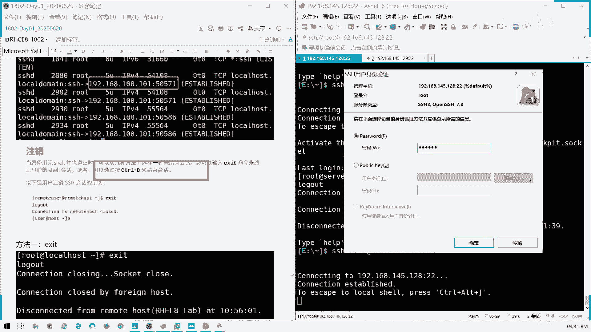
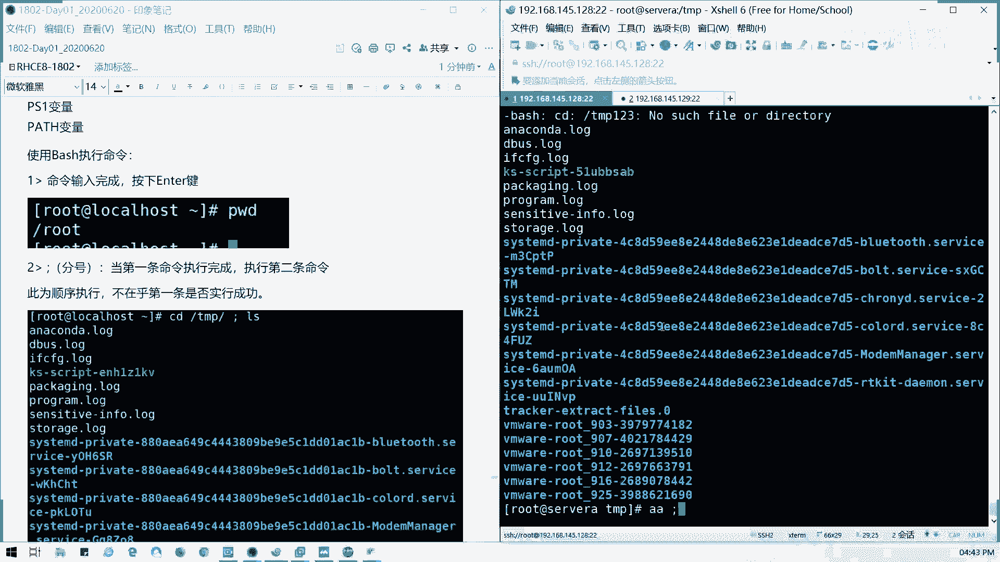
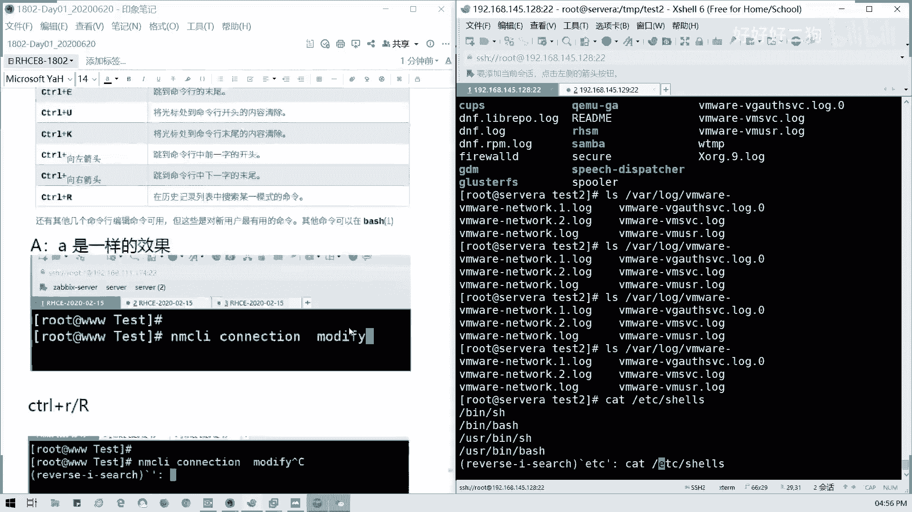
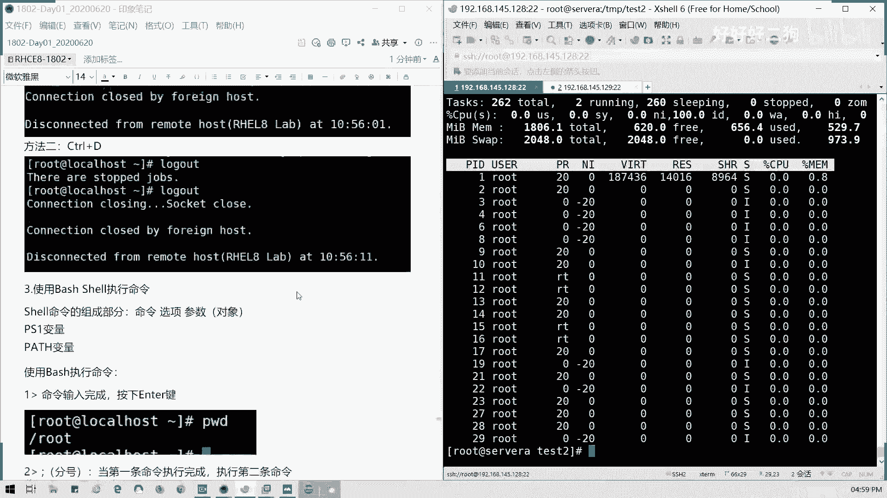

# Redhat红帽 RHCE8.0认证体系课程 - P4：4_Video_Day01_Ch02b_访问命令行 - 好好好二狗 - BV1M3411k77W

我们继续讲啊，讲讲这些讲我们就下课啊，就下课，就然后今晚今天东西不算多，但是就相当于一个基础啊，因为今天有点一点一点点那个翻车啊，没事我们看一下系统登录这块，对于服务器的话，是不是我们都有。

我们对p c c是不是直接接键盘鼠标，我们就可以连接，对不对，对服务器的话，我们除了接键盘鼠标之外，是不是都有远程控制口，对不对，同同时其实我们无论是接键盘鼠标也好，然后接远程控制口也好。

我们都是相当于一个控制台是吧，控制台模式我们直接指点我们的那个显示器啊，就相当于接键盘进水机器这样子，对不对，所以呢我们的本地登录呢，就是相当于我们直接接上键盘鼠标显示器。

但是linux下面基本鼠标很少用啊对吧，一个键盘就搞定啊，首先我们图形界面就是我们这这个样子，对图形界面。

文本界面就是这样啊，就这样，然后什么叫文本啊，t t y我们我们这里的话，如果我们登录文本界面啊，如果我们直接登录文本界面，我们的那个，我们这里是p t s是虚拟终端，就是我们通过外部连接啊。

如果是文本界面t t y呢，比如说我们在那个直接在我们server a n s b这里。

我们切换到文本界面登录，就现在图形界面，对不对，我们切换到文本界面是吧，p s是不是写的t t t y对不对，这是第二个字符界面，终端t t y就是基于文本的登录终端，就是t t y。

然后图形界面呢，比如说我看一下啊，我们打开一个终端啊，所以这个界面呢，以后我们就基本上除了考试之外，其实很少用啊，考试就是foundation，就这台物理机也就差不多。

这样的界面差不多可能桌面会有图标啊，比如说像我们p s，我们p t s是不是相当于虚拟终端，就是我们只是通过其他的方式连过去的，然后t t y就是我们的文本终端对吧。

我们终端，然后如果直接接显示器呢，是这个孔，它是一个恐受啊，我们回来对吧，t t y是文本直接登录的，登录的一个终端，直接登录的标识，然后如何切换呢。

对不对，我们这里如何切，我们看一下笔记啊，看一下笔记，这里的话是吧。

t t1 ，然后我可以切用alt a l我们键盘的a l t，然后加f加上那个f加那个f，如果是笔记本的话，可能会有一个他这里的话就是一个fn fn键，如果是笔记本，如果是笔记本，还有个fn键，如果没。

如果没有的话啊，通常说我们台式机的话，就是一个很alt加f一到f6 ，我们切换文本终端对吧，我们给大家切换终端，对吧，如果纯文本中断，我们是可以这么做的啊。

我们看一下server a啊，四个a我就我切回中段的话，如果是图形切过去就alt，然后在这里的话alt加f3 ，怎么样诶，怎么回事，不对啊，如果是在纯文本界面的情况下，因为我们这里装的图形界面。

所以当我们要加ctrl来切啊，我们要加ctrl切，如果是除你们装的是那种最小化安装。

或者是那种纯文本界面的话，也就是按alt然后加f n f一到f6 ，它只有六个终端界面，懂吗，就你最多你可以做三天，76000个切换六个窗口啊，六个终端终端的界面啊，是不是可以切六个对吧，1~6。

第一个是如果是装了图形界面的话，如果是我们没装图形界面的时候，它启动就是一个文本终端，那默认图图默认情况下它是一个图形界面，图形图形化界面呢我们f一是吧，ctrl加alt加f一是不是图形化界面。

然后f2 到f6 是文本界面对吧，这个f a呢是针对于你的笔记本上。

如果你的f f n它有特定功能的话对吧，如果有fn有特定功能，比如说我的那个加减音量键的话，你要实现它原本的f一到f 12。

是不是要加fn键了对吧，这个是我针对于笔记本来说的，如果是针对于我们台式电脑，我们f是普通，就是普通的f一到f 12，对不对，所以当我们就不用加这个fn键，看到没有，我们如果切换的话。

ctrl加fn加f2 加alt加f n对吧，f2 到f6 都是图形界面，f一是文本界面，那如果呢我们临时切换过去的话。

就切f n的f2 到f6 ，然后如果切换图形化，就是alt加f一懂吗，就图形切文本文本切图形，这个应该都会啊，那默认我们怎么启动呢，我们看一下它的默认启动目标，默认启动目标叫做啊。

我们叫做啊graphical。target啊，graphical。target，这里可以看啊，c啊，我这里这里好像用的中文，我们用英文啊，来这边看一下system control。

as a get for，我们就相当于我们i n i t以前六版本的，以前的i n i t，但现在七以后呢，全部交给system control这个这个主进程来管理。

就像我们现在可以get一下default是吧，然后呢，回车它是不是显示，我们默认是以图形化界面来来启动是吧，那如果我要永久切换怎么办呢，这个我们后面也会讲啊。

但是我这里先讲了，就如何切换永久切换图形界面和文本界面，对不对，像我们永久切换怎么做呢，比如说我们要切换到一个多用户界面啊，但有的有几个界面是不能切换的，比如说像永久切换，不能切换成rebo是吧。

也不能切换成power of，那你永久7万是不是一开机就重启，一开机就关机，对不对，然后还有一个叫做紧急救援模式，那一开机你就直接到那个救援模式下面了，那这几种模式是不能设我们的默认值的。

那我们可以设置就是一个多用户，还有图形界面好吧，那我看一下怎么设啊，比如说我要我测一下我们的server，我们的server a好吧，system control，然后我这里set default。

我们既然有get defaul，那我们有set default，对不对，里面mt user我们叫猫直接m u l，我们用tab可以补全，对不对对吧。

就不用记了，multier target，然后我们现在它就像它创建一个default，链接到我们的一个multi user target，那我们现在重启一下。

我们看一下它引导怎么引导啊，看到这里，对就相当于前的i n t3 跟t5 对二已经没了，就是嗯就是去掉网络链接的一个多用户模式，这个模式已经在七以后都被去掉了，对我们以前是有几种是吧。

第一个是担忧模式对吧，i n t e r的话是去，就不带网络链接的多用户模式，第三是完全的多用模式，第四留空对吧。

第五是图形化零关机，六重启，对不对，以前i i t啊，现在你看我切完之后是不是这样了，这是不是变成文本界面了对吧，就默认就变成文本界面了。

那我们现在重新连接上这台主机啊。

我这里是要45。18，然后比如说我要临时切换啊，我回回到这个笔记，我要临时切换到我们的。

那个图形切换到文本界面，我们临时切换啊，我们可以把它设回来，对不对，system control sd four，我们可以设回来，对不对，设置回来d e f a u l t，然后graphical对吧。

gr对吧，出来了，这里的话我们就设回默认图形启动，那我们如果临时要切换呢，就是用system control isolate，对不对，比如说我这里是把图形切到文本，那文本切到图形呢。

graphical对不对，有没有system isolly，我们看看什么结果啊，system control isolate。

临时切换的graphical target，好回车，那我们看一下我们的vma。

我们的原本界面，是不是变成图形了对吧，图形我们我们是可以通过快捷键切换临时切换，也可以通过命令来进行临时切换和永久切换，明白吗，好那这一块讲完之后呢，我们来看下一部分内容。

这个这一块我们就过了哈。

然后远程我们来讲一个就是切页面切换，那我们讲一下远程登录。

远程多目呢，我们大部分的工作场景啊，第一个是从windows连接到linux，对不对，我们通过一台windows一个跳板机，然后连接到我们的linux的生产环境，那我们那windows本身他不带啊。

大多数情况下它本身不带，我们的对linux的远程工具s s h协议的远程工具，那是不是需要工具辅助啊，一般来说对吧，比如说像插面里是我们x的shell，是自在里面，然后包括此刻c加t party。

对不对，像如果像mac我们的苹果系统，还有linux连接linux，那我们直接打开终端就可以连接了，对不对，你明白了吧，所以的话我们通常说比如说我这里我上，我刚才不是就这么连接的吗，s s h对不对。

然后用户主机那这块应该都懂了，怎么在windows，如果远程连接到我们的linux的，那个远程连接到linux主机上，这个就应该知道了吧，就我们刚才我刚才已经这么做了一步了。

懂吧，然后输入密码就可以了，就我们远程格式命令对不对，我远程之后呢，我们其实可以用我，因为我们s s h的默认端口是22，那我们也可以用l s of杠i，然后冒号22，对不对，它会有那个。

它有当前的一个连接情况给你显示啊对吧，我当前是不是server a是吧，就传回到，就我们连接，通过145。1的5637s s h c a，我们把这个server a的灯s s h我们给到了我们。

我这台现在这台物理机，我们的vm网卡啊，145。1的53174端口，对不对，走吧，比如我们通我们这台机访问他的话，是通过53174端口连接超到22端口，对不对，它是建立就它就是建立现在建立了一个连接的。

懂我意思吗，不过像自己这里的50175也是一样的，然后我们讲的连接，我们要讲怎么注销啊，怎么注销呢，ctrl加d对吧，我们结束绘画，比如说这里我要结束绘画，我们先把它ctrl加d。

是不是我们就退出来了对吧，我现在重新点回去，然后还有一存入加d是一个，然后还有一个x e x i t也是一样的对吧。

退出出口对不对。

我们连上如何退出啊，连上我们通过s s h的命令连上去退出。

两种方法，1e x i t或者ctrl加d是吧。

这个应该明白了啊。

然后接下来我们讲命令了对吧，就讲的终端如何连接，如何退出是吧，还有它的变量，这些的话我知道有人困了啊，然后呢讲的终端讲的变量之后，我们讲如何执行命令啊，执行命令通常说命令我们执行完。

比如说我们执行个p w d，就是查看当前的目录对吧，我们执行命令是不是按键t键了对吧，我们在windows也是一样，对不对，执行命令按键键，那好，我们如果执行两条命令呢，可以用分号啊。

分号，比如说我这里的话，分号的话它是顺序执行啊，比如说我这里我cd下一个tmp目录，然后空我们这里分号前后最好留一个，留留一个空格，然后l s对不对哦。

不是l d r l s是吧，他是顺序执行啊，不在乎第一条命令能否执行成功，对不对，比如比如说我执行了什么tm p123 ，或者是我直接aa是吧。

我假定这个命令我是不存在的，是不是他还他无论第一条命令执行是否成功，它都会执行第二条，这是分号的用法，懂吗，可以理解，不就无他，你第一条命令无论你是否能够成功，是否成功，他都会执行第二条多个分号。

我可以多个分号啊，对吧，多个分号就执行多条，这是分号的作用，还有一个货啊，货的话，两个四杠也就我们两个管道符编成了一个，我们就或是吧或运算符换算符的人，是当第一条命令执行失败的时候。

才会去执行第二条命令，懂吗，他的逻辑是这样的，而不是说成功啊，比如说我这里，我m k d r叫做test，我们创建一个test目录，然后我这里cd哈，t m p test，那我要两个竖杠是吧。

我看一下我这条命令，我的正常能不能正常执行啊，t m p test是吧，我只切换目录，但是我没，没有我这样子，我列一个test 2啊，但是我建了一个目录酶呢，明显没有，对不对，你看我第二条命令。

第一条命令不要第一条命令不要不要讲啊，第一条第一条命令的话是，我这就相当于我那个切过去，然后再见这条，我们看不出来了，我们看不出来，我们第二条命令看一下是吧，这条才是正确的，我现在建了一个test目录。

对不对，然后我现在我用货，我这条命是实行成功的切的目录，对不对，但是我后面的命令是不是没有执行，这是获得他的获得一个元，它的运，他的货运是他的命令货运算的一个一个啊。

一个基准就是你前面你一定要去失败的对吧，所以我们如果把这条命令换成c d t m，p t s2 ，然后我再创建是吧，那我们看一下是不是有一个test 2的目录了，对吗，懂吗，它的或运算是一定要。

你在前面执行失败的情况下，它会执行后面的命令，然后还有相对于说就是我们的与运算，两个m对吧，论语命令的语只有第一条命令执行成功的时候，我们才会执行第一条命令，比如说我们的刚才说的啊。

我们切换到一个天tm p test目录之后呢，我们来l l一下，tm p里面的test 2，对吧，是不是这个道理，我切换过去，我l l杠d啊，l杠d g p t s2 ，他就会把它切过去了。

第一条命成功啊，我们这是或运算或运算，因为第一条成功了，他第二条不会执行了，那么与运算呢会怎么样呢，我刚才是货啊，现在是雨，看到没有，它会列出来他们他们列它，它会列出来一个里面有没有文件。

如果加上杠d呢，就显示当前的目录嘛，当前目录权限对不对，懂我意思吧，就是第一条命令我执行成功的时候，用与运算的话，它才会执行第二条，那如果失败呢，你看看，我都直接不执行第二条东西了，这是逻辑语，明白吧。

命令的逻辑与和逻辑或逻辑货，就跟我们不我们编程的逻辑货币的区别，编程的货呢它是两者，只要企业能成功就能直就可以执行，但是我们在命令上面，你必须要前提下第一条失败才可以啊，这个可以明白吗。

所以我们这里的分号逻辑与和逻辑，或我们那个使用的时候啊，要是能够区分它们的一个区别啊，然后我们如果命令太长了，我们命令太长怎么办呢，我们可以分多条，对不对，可以分多条，比如说我这里举个例子。

我要查找两个是吧，我要查找这两个文件的最后一行对吧，我们要显示两个文件最后一行，比如说我这里，tell tell命令是显示文件的尾部哈，每日尾部，然后杠n的参数就是显示我尾部多少行对吧。

尾部多少行是明白吗，这个命令tell杠n，然后后面加个一，然后这里我命令主要是我写太长了，我就加一个斜杠回车，它就会进入，它就会切到第二行，这个命令其实还没结束了啊，还没结束了。

然后我输入我们的一个我们要查看的文件，我们查看多少个两个文件，比如说我要查看一个user usr里面shell里面dock，我要查看一个叫k pd s对吧，它的一个文档，然后查看remid对吧。

那我还是加一个反斜杠，那说明这个命题还没结束，我们继续下一行输入，对这种事相当于我们可视化好一点，如果说你这也我一般说到木耳的话，它就会到下一行，那这样如果有时候分辨不清楚的话。

可能会漏或者是会打错或者打残啊，打打缺一些东西，user shell啊，doc里面的k mode，比如说我查k mode那个read me的信息好，我们全部我们如果要分行没有结束。

就空格反斜杠回车继续再行，那这样我们回车是不是，我们查看两个文件的最后一行，不会吧，这叫命令分行的一个操作，他这个是讲的一个逻辑啊，要区分好它的关系，那这个明白了吗。

那接下来我们讲一下命令的执行的快捷键啊，命令执行快捷键，首先我们要讲到的是tab命令主权，type mini补全啊，通常说我们是不是我们标准安装的时候都可以，tab可以补全我们mini。

但是最小化的话可能没有我们少了这样一个包，叫bash come completion对吧，所以有些我们这个生产环境里面，你始终哎我怎么我就命令我记不全，然后我拍拍拍拍不出来，对不对，所以就少了这个包嘛。

你要你要去安装这个包才可以使用这个功能，但是我们在标准安装的那个linux，已经带了这个东西，所以我们就不用在意了啊，使用方法是吧，比如说我们针对命令啊，针对命令他如果确定啊，你是唯一的命令的话。

他会帮你补全，对不对，如果不说我们是sc是吧，它是识别到一个唯一的命令，他会帮你补全懂吗，针对命令的话是这样子的，就唯一的命令的时候有效，然后如果是我们关键字不能唯一识别跟命令。

比如说我们在sos sos是不是很多东西啊对吧。

唯一命令我按一下就出来了，然后如果他太多关联的东西，那我没按两下，是不是练把所有关系有关的命令都会显示出来，列表，这个能理解哈，tab按一下，如果上是唯一关键字，它就直接出来了，如果不是，它就会按两下。

你就按一下，出不来，你就按多一下tap，它就会把相关的关键字词就给你全列出来，懂吗。

然后针对命令选项，比如说我们这里配置我们的那个m c l i，我们配置我们的那个网络啊，到时我们讲的n c i，是吧，我们不知道他选项是吧，我们对连接是吧，connection不知道它选项它会命令选项。

它会列出来的，懂吗，就跟命令你运行到诶，我忘了它到底我后面要加什么对吧，后面要怎么去影响它的执行，也就按tab是吧，按tab它就会出来，我这个跟这个例子一模一样的，对不对，明白我意思吗，这个选项啊。

然后还有一种就是不全的，对啊，我不全我我命令不全的一个文件或目录名字，比如说我这里呼呼呼，我要cat我们我们的l o s v i r log，目录下的那个bo是吧，这个bot。log这是唯一的。

因为比如说我想想啊，像那个叫做，这些都是唯一的啊，唯一的我想想有哪些呢，比如说一些文件不不全的啊，我看一下，呼呼呼，我看看有没有别多的哦，比如说我ios我我我想ios vr绕什么东西，我编是吧。

变贵了是吧，很多的我我这个我这个命令跟我这个文件目录，如果说不写，就是我们记不得了，我只记得他前前面的部分，那我们是不是可以type出来，然后用列表在补全是吧，那对我来说也是一个帮助，对不对。

这个可以明白吗，就是对对tab能明白不啊，远程同学能明白吗，就关于我元命令补全的一个用法，这是第一个，好打的你我知道啊，好然后接下来我们对于命令快捷键对吧，命令快捷键有时候我们非常有用的，非常有用的。

比如说你打错一命怎么删除，对不对。

这里ctrl加a，是不是跳到命令开头ctrl加一到末尾去了对吧，ctrl加u我这个位置我全删掉对吧，末尾看这里全删掉，然后我在这里打一下啊，我我我我打了一部分命令出来啊。

ctrl加一就是相当于我们如果移到末尾，是不是将在这条命令我抹掉了，我可以从输，对不对，就相当于我们退格退到底懂吧，然后像这里的话，我移到这个位置，可能说他k后面的没了对吧，然后呢。

我们还有就是我们把这个命令继续补全啊，log然后我命令对股权，这就解释给大家示范一个例子啊，比如说network。lock，我们这我我都完全不是这样的，刚才我们已经是了，ctrl加a ctrl加e。

ctrl加u跟口加k那么ctrl加，左箭头左方向键是跳到前一次的开头吧，他写单词作为作对吧，前字开头对啊，都会跳到前置开头，这是以单词作为区分了，然后ctrl加右键头前四的末尾ctrl加r了。

我可以搜索是吧，我可以搜索命令，对不对，ctrl加r m的搜索命令，然后他会帮我们显示出来ctrl加l啊。

它可以搜索某个模式命令，比如说我们搜索搜索l s，它会把最近的最近跟他匹配的关键是是吧，显示出来，比如说这里我的catch shell，是不是我输的l o s对吧，如果忘记某条命怎么打。

就我输出最近的一些命令的话，我是不是我可以通过ctrl加r，然后我们搜嘛对吧，我们可以搜到他命令ctrl加r对吧，比如说我要输入一个叫做etc是吧，他就出来了最近的一条记录，懂我意思吗。

像可像大小写都是一样的效果啊。

ctrl r加r啊，也是也是一样的效果啊，懂吗，所以怎么查找呢，像这里我们查找一个rpm，对不对，在这里查到rpm，他就把最近的一条记录出来，但是如果你没执行过，他其实是去找历史记录的，如果你没执行过。

那那你是查不出来的，他是不会查一个history的列表，但我们讲到关键字呢，就是你曾经执行过命令的某些关键字，比如一般都是输入命令啊，然后查找历史记录中包含这个关键字的命令，找到正确的命令之后。

我们可以按上下翻页啊对吧，我们可以按照上下翻，如果查找的话，ctrl r ios对吧，ios如果找到正确命令之后才如果找不到，我们就继续切换关键字对吧，找不到不能用上下方向，上下方的话就变成。

也是看着上一条和下一条命令的那不一样的，我们查找的话，比如说我这里ios对吧，这里这里这里还没找到，那就ios对不对，还有一个还有一个那个比如说beats，对不对，他就只只能找到b开头的对吧。

所以只找得到我们在继续啊，再继续，然后我们ctrl可以撤销掉，对不对，这个是查找命令的查找快速查找，然后还有一个就是历史记录，历史记录呢，linux它是可以记录你执行过的思路操作，默认是1000条啊。

默认它这个容量是1000条啊。

他对创立了1000条记录，懂我意思吧，所以我们可以通过history history啊，我们有两种读音，history，我们可以看到我们当前执行过的，所当前最最新的1000条记录，对不对。

不会这么sery。

我们可以查到我们执行过的所有的命令，然后呢如果是叹号啊，叹号加命令序号，我们可以把命令调出来再执行一遍，比如说我tan 93，为了显示一个p w d，对不对，我刚才进球的3号位是不是p w d很快啊。

这样是不是很快啊，你查到命令之后，你要执行一遍，你不用再输一遍，你就叹号后面加命令序号就可以了，比如说我的主要退我，我要那个查我们的那个，我们我们要查一下top，刚才探79。

对不对，我79号命令对吧，他调出来又执行了一遍，这是很快的，这里我一直是探讨八就查看我们的网卡，然后小结啊，小节就这么多，我们第一第二节第二章的内容就这么结束了啊，第二章关于一个命令命。

就是一个那个命令行，如何访问命令行，包括我们的提示符做什么用，然后还有呢就是一个我们的命快捷键是快捷键。

以及我们的一个命令执行的与货啊。

还有如我们我们的界面切换以及登录注销，都给大家讲了，有没有问题，没有问题可以举手，问题可以提问，没有问题啊，没问题请举手，都没问题吧，啊，远程的没有问题，请打一个y啊，没有问题请打个y，有问题可以提问。

就针对我们下午讲的第二章的问题，多理解啊，是不是觉得太简单了，对，没有理想，那我们可以我们这样子，我们插一下第二章的开头啊，组第三章的开头，我插一下啊，插一下第三章的开头，第三个开头的就是关于啊。

我看一下第三章开头主要是关于一个，所以访问命令行，我们讲了，还有一个就是命从命令行管理目管理文件，我们讲我们先讲一下我linux整个架构。

然后其他的我们明天再讲好吧，我们讲linux架构，你把把这个我们写在最后啊，所以今天我们讲这这个东西啊，我们第三章我们开一个头，这笔记待会儿会更新号给大家啊，第三段，我们开个头，然后这里我录屏。

我重新再暂停一下。