# Redhat红帽 RHCE8.0认证体系课程 - P53：53_Video_Day09_Ch01c_管理资产清单 - 好好好二狗 - BV1M3411k77W

呃，我先说一下啊，就这个考试里面网络配置文件呢，它应该是一开始网络是通的了，对吧？然后它会有给你就是这机器IP地址这些然后包括你的用户名密码，特别考试里面，他会给给你说指定说哎。

我哪一个用户已经跟我的售管组就有的控制。我的那个被控端的哪些户已经建立了免密链接。考试是以这样子，但我们这里没有，所以我会教大家怎么做啊，就一个完整的一个过程。但考试你可能不需要做这个步骤。

因为我最近我了解才知道，好吧，所以为什么考试考11分呢？人家就是没有看看清楚用户直接在root做，全部做完一分都没有。对董华石说没错啊。一切我们按照考试说明来。s安装是2它会新一点啊，2。9。1。

因因为通常说它的fe多ra瑞官方呢，它在它会在那个官方版啊，DS不写，你就通，你就解释报域名哦。你红如果是8。3。14的话，你这个应该是8。2或者是8。1的版本。第二次不写的话，你解释不了域名的。

UID你建议建议你你可以注释掉，但不要删啊，注释掉可以。我这里2。12。9。10。1跟2。9。11没有太大关系。CtoOS的版本会新一点，因为它会先发布先息测试，然后没问题，它红帽才会更新的。

能用就行嘛，对不对？何必追求那个版本呢？就个版本可能就修一些bug或其其他的，但是对我们大又没什么影响。O，O。还有没有其他问题可以提啊，就。还有其他问题可以提啊。我希望大家环境都能装好啊。

然后我们接下来会讲配置。有些还在装，所以我们稍微等一等。而且我这个讲呢，我我这里这个讲呢基本上就是一个完整的一个过程啊，考试是不需要那么复杂的。但是呢我们自己用，我们要知道这会怎么用。

不能总依赖考试环境吧，我们练习环境对不对？马娟娟这个没有问题啊马娟这没有问题啊，你赚了这么多没有问题。然后你再验证看能不能通，可以就OK了。

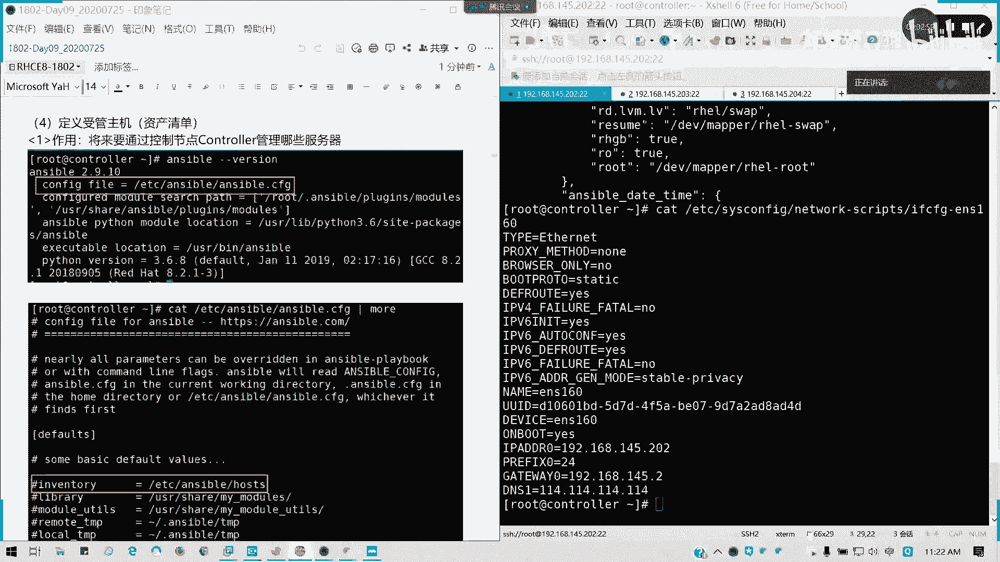

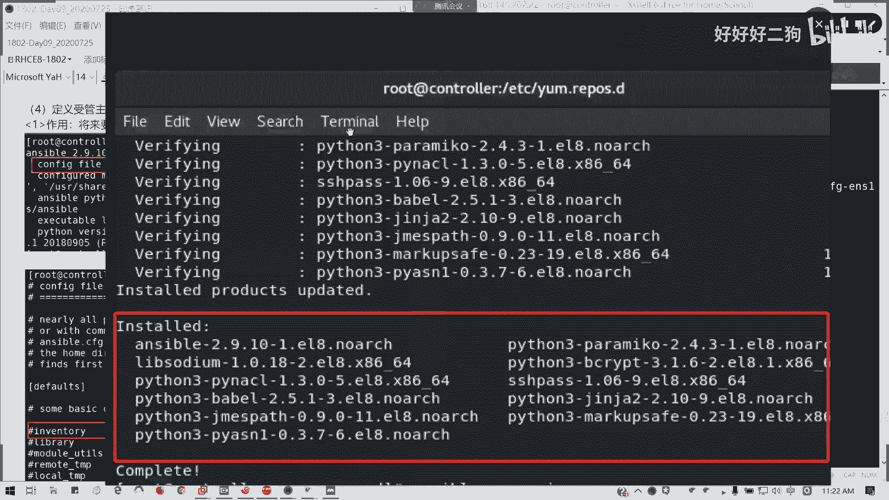

语气多很多吗？

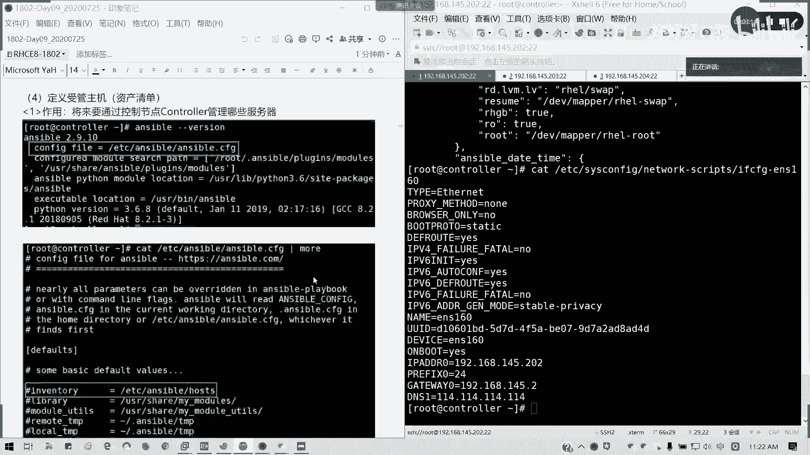

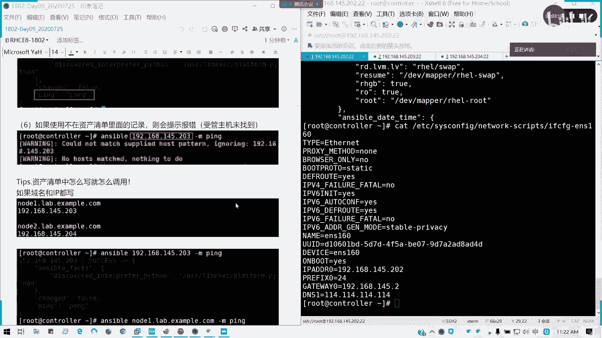

多不了多少吧，笔记。也就这么多，1234567891011个包，你这里也不是11个吗？一样的。也是11个啊，只不过你是。两列是吧？亲两列。能用就谁？我这己是排在一个竖行的，所以的话就十一行嘛。

你是66行65。5行，对不对？所以的我们数量是完全一样的。And the。还好我很清醒，所以我没喝多啊，可能我因为我。所以所以的话我还是比较清楚的。看看其他什么问题，如果装完的刚才没回Y的。

请给我回个没有装刚才没回六的，请给我回个6啊，如果装完弄完了。我看有多少个。没回的才回啊，一个。两个3个、4个。一个、2个、3个、4个、5个、6个、7个、8个、9个、10个、1112。13。

14151617、1819，还有一大半轮没做完呢。对了，没有问题啊。马军定你这样这个没有问题了。12。1是你另外一个徐网桥的一个地址，不用管。它是一个那个linux里面默认一个虚拟网桥的一个地址。

1个B20我也不用管。你去看一下网卡嘛。

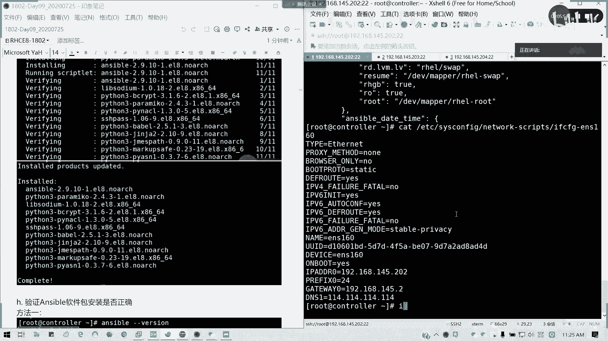

我们网卡的VR，我们的虚拟网桥B20，它配的是12。1啊，但这个网我们的虚拟网桥根本不用啊。懂我意思吗？娟娟。对啊，它有B20，它有那个B20的一个接口，我们这里没配。所以的话我们显示会这么多。

没有关系啊，在练习环境可能会可能那个就是说它网卡可能会更多。但没事，我们练习环境后面我们考前回来再讲。接下我们讲一个定义瘦管主机，讲完我们休休息。然后如果大家啊叫餐的话，可以先待会儿叫啊。

我们讲一下定义瘦管主机，我先把屏清一下。售款主机呢它的作用就是我们将来要通过我们conttrol的节点来管理哪些服务器。我们我们先啊默认的1个S5配置文件，我们可以看到我们的那个。

他定义的哪些默认哪些位置，看看他自己找的简号，但是他说的是一个叫farm default，ba呃fuarm basic default warrior啊，它的默认值。这是一个全局配置文件。

我们待会儿又讲一要配置一个优先级。今天下午会讲到。

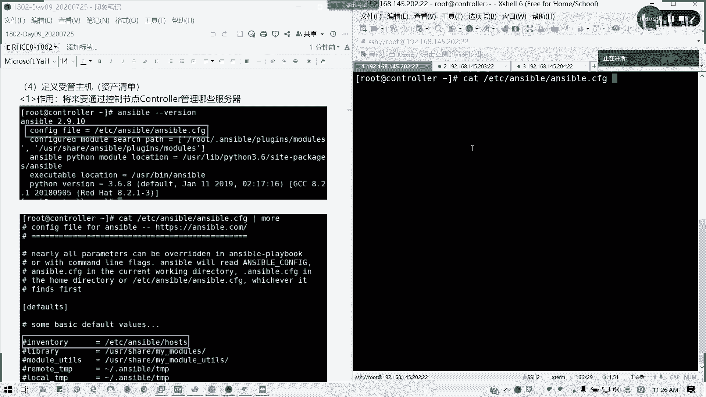

看到没有？我们这里有个an inventoryvent对吧？资产清单对吧？等于后面值是ETC host，我们默认是定义在这里。那我们通过这个文件来。

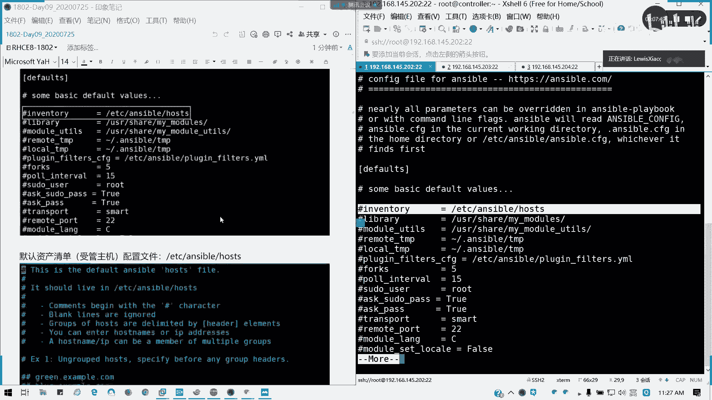

默这默认的资产清单定义配置文件，我们来讲一下资产清单如何定义。我们编辑这个文件啊编辑这个文件我们来看看它其实这个文件很很好的，它是一个default默认的一个anterible的一个host文件。

它这里呢已经帮我们。写了一些例子，我这里稍微解释一下啊。

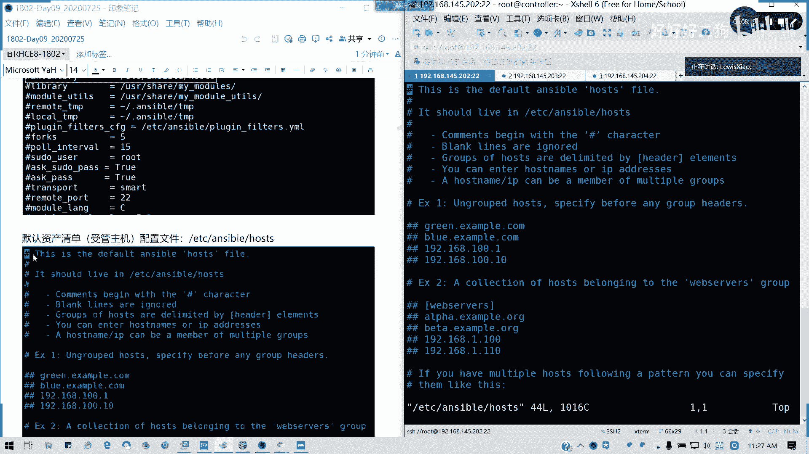

首先我们可以定义。没有分组的的一些啊没有分组的一些组织清单。就这里我们前面不写不写那个中括号来写分组的信息的话，那它就是一个没分组的一个零散的一些受控组织受关组织列表。它这里列出了。可以既可以是域名。

也可以是IP地址，对不对？懂我意思吗？但他这两个我跟你说啊，这两个我跟你说跟大家说，不是一回事儿，你怎么定义就怎么引用。你不要说又定义主机又定义IP的那这样不就是对吧？就定义主机呢，我用IP地址。

这样就是两回事了，懂吗？这是第一种它的例子一。不分组的粒子2。就一个分组，然后下面列出来，对吧？懂吗？然后如果我是有，然后第三第三种，它是那个也是他也是一样。但是如果我要写一个集合，我们上次讲。通佩服。

🎼对不对？我可以后面，比如说我数字就001006，这是允许的，可以这么写，懂吗？也是一样，然后我也可以多个分组，然后我一个总大分组，我接下来我会讲这个东西。

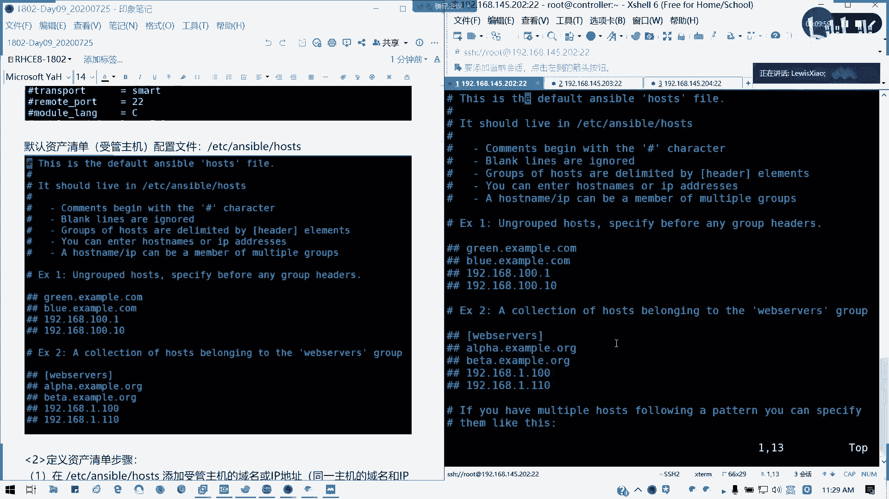

好，我这里我来写东西啦。我要写东西了。我们怎么去定一个资产清单？比如说我这里我们刚才是不是定义了一个两台，一个note，一个note2，对吧？本来正常我要四台的，但是因为照顾它的配置问题。

所以的话我就两台就够了。我们在后后面接着写。我可以node一点Lb点一张火号。好，我也可以写IP地址，这里我写井号的话，是它这有两种的表达方式，对吧？那它这两种的话定义的东西不一样的。

你怎么怎么定义怎么引用啊。试听的学员可以先做可以先先听一下，可以看一下旁边的同学的讲解。好吧，现在在讲S我的一个资产清单的一个配置。现在是我们第九天的课程，我先说明一下OK然后呢。我们你第二台。

我们可以note2啊，note2192。668。145。204啊，它我这里打井号呢，它是另外一种表达方式，但是你可以同时写，也可以只写一条。但是你怎么里面怎么定义，你能怎么引用，懂我意思吗？然后呢。

我这里定义完我写了域名。好，我拼一下我现在是不是。我现在还不知道这台主机是在哪，对不对？对吧为什么？因为我们这里的话，因为我们解析这个解析只是我们我们实验环境，我们的局部范围。但是我在互联网。

我们用DNS，我们用1144个114是找不到的。所以我们要这里要写一个应解析的文件。在考在列习环境已经帮我们写好了，包括考试环境也是帮我们写好。所以这里不用管。但是在我们单独定义的一个实习环境呢。

我们在这里逻实学环境呢，我们是要写的对吧？要让我们认识到他其他主机。来。这里啊看下我笔记这里有了按O是吧？我们就把当前自己的先写IP后写我们的主机名，我们的域名。

比如说我202conttroroller点lab点exle点com。192。168。145。203n一是吧？然后204我也写上。好，保存退出。这就是我单方面我就认这个IP就是在主机了，懂我意思吗？

硬解析跟windows是一样的。好，我再拼一下是不是已经通了，对不对？

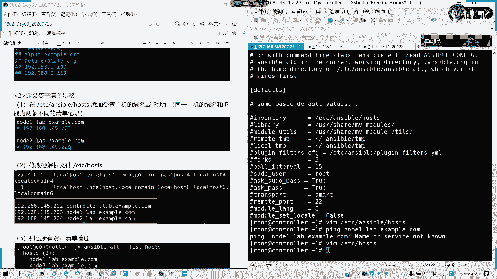

好，通了之后，我列出来资产清单我先验证一下能不能找到。用ansible host all or是代表是资产清单里面的所有内容，对吧？然后this host。是不是我当时也是写了两台。对不对？

接下来资产清单。然后接下来我要怎么跟他联通呢？我们要是我们要配置公司要，懂吧？每个用户都要配置啊。每个人都做配置，考试里面不用做这一步。每我们在这里实验环境，我们自己搭的一个ensible里面。

每个用户都要做配置。为什么我要建立一个互信关系？也就是说我要让我们社款主义知道我的存在，而且我是可以受信任的。我这样我才可以让跟你发号施令，懂吗？刚才讲S我基本架跟我已经讲了。

我们controller相当于是一个指挥官指挥部，然后我下面是我的士族。然后我要先建立信任授信关系，那我才能复我才好，我才好，我跟他发号施令，指哪打哪，对不对？好，我们来做一下复习一下，他来复习。

SSHK证啊杠K证，我们来做一下无密码验证。先生成自己的公司钥，对，把自己的公钥私钥先生成，我们按照默认的保保存的一个东西东西就可以了。然后我们现在我复制到note一。

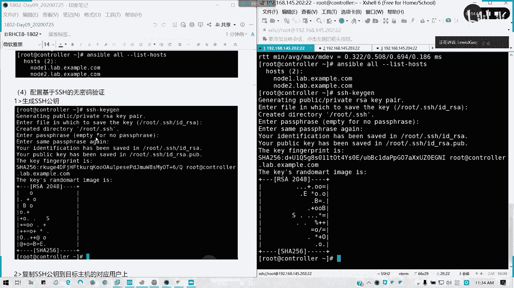

因为我我们我这己就root跟stud两个用户啊，所以当我们要分别复制。对吧对应的用户at特主机地址。然后输入对方的我的受管主note的路屏密码，然后它就可以成功了，对不对？那我们上述步骤做完之后。

它会留下一个印记了。在conttrol那里就留下一个印记，就是我哎我建立了一个互信关系。那我现在我把我换成那个SSH。是不是不用输入密码，我就可以直接过去了，对不对？那同样我们给note2。

包括student用户也做一波。啊，不对啊。就ki准已经生成完之后，每个用户的ki准可能都不一样。你就把student啊。他这里remamd啊，我们这里同样输入student是用密码是student。

哦，说错了啊，再来一遍。好了，然后同样。我复制到。note2。student也是note2，然后我回到student一会我再付一波。好，我自己先切到st用户。然后呢，我同样生成一个自己的公司要。

因为待会我们要需要用普通用户来进行，懂吗？普通用户来进行S的一个管理。所以的话我这步我先坐在前头。我先把这个步骤做在前头。然后student的。好了，我们做完了。这样的我们互信啊就做完了。

互径做完了之后呢，我们可以来测试一下我们当前root用户下啊，S我能不能收正常的收到命令格式是这种是临时命令格式啊，ensible node一我们刚才这这样定义的，是不对？怎么定义怎么引用怎么定义啊。

那我的一点lab example点com，然后杠M module啊，我们临时命令有了mod，我们的一个模块。然后后面我们用拼？看他们有没有返回时。看到没有？它是绿色的，就证明他状态没改变啊，就他的那个。

他已经执行成功，然后他返回的S特我事实，也就是我们售管主的一个信息，对吧？他没有发生改变，但是拼它的默认返回值是砰啊，那证明我们可以正常连接到我们的售管主机。然后如果我们改成145。203。

会发生什么结果呢？就是同样的现态手机IP就是我假设我使用没定义的。清单会使样怎么样呢？对吧？没有匹配到它提供的一个hosse pattern，所我们的主机的一个主机一个段，所以它会把它忽略掉。

对吧算局位所找到。那这里我要想一点，就刚才再强调了一遍，我们的售管组建清单怎么写就怎么调用，对吧？你写张三就调张三，然后你不要写张你不只写李四调李四，然后不要戳乱，就调一个王五出来，懂我意思吗？

我们的寿管主建清单，比较严谨啊，怎么写就怎么调用，那我们可以编辑一下，把他的啊这是这是那个。这个事应解析啊，我们锤到我们调动资产清单的那里。我们卡布把把注释去掉就可以了。那我们再试一下立即生效的啊。

视频已经返回框了，没有太大问题。

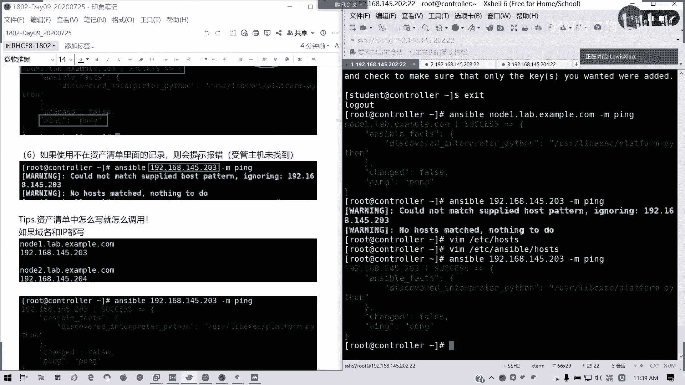

对不对？就两条记录他都生效。

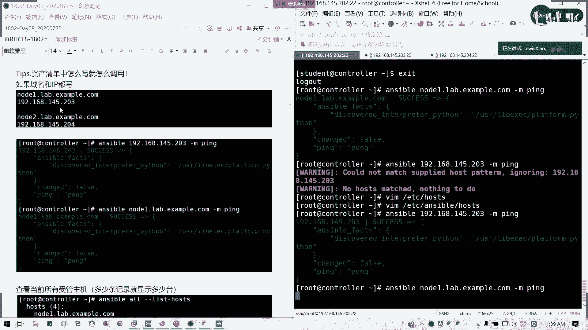

然后呢，如何查看当前的收款主机，现在列出来应该是有4台了。对吧它每一条器度当成一台主机，所以它总共列出来4台，懂我意思吗？这部分如果明白了，请扣。C啊小写字母C有疑问可以提。能明白吗？OK。😊。

如果IP变了，那掉IP的话就报错了，你拼不通啊。对吧。你钓域名是成功的，那调RP就不一定了。我知道你你局域网变了，你这个清单的话，你列出来。你掉IP就会失败，因为你找不到了。陈立清明白吗？O。

其实这种学这个工具呢发号施令很简单，就不用我们人肉一台台去敲了，懂我意思吗？就包括你们是刚才试听的这位同学啊，都知应该知道，我就直接我可以去躲在控制端，我就可以部署命令了。考试应该是要求你写域名的。而。

考试还有考题分组就作分组。所以这样接下来我讲这个分组问题，我们现下继续讲分组啊。资产清单的几种定义法。电位域名啊，你就写进解析喽，这个问题不大。但是基本上你考试直接写IP就可以了，就不要写域名就更好了。

可以可能简写啊，考试这个我们考进后来再说了。我们怎么来定义啊，资产清单我们还也可以定我们资的售管主机组。IV变了，你域名，你只要做好解析，你你你你不成吗？对吧女域名是不是做好解析了？或自询多个地址啊。

这个你要看具体的解析了。好，我们来看一下，我们回到那个资产清单的一个定义，我们也可以把它加成一个组机组。比如说我们把node一定义成wi server。把note2定义成DB server，对吧？

懂我意思吗？就是我们人为的将自然清单我们分组分组别。就比如说我把note一变成一个web服务器，把note2分组为第一B服务器，能懂吗？好，那我这里的话，我保存退出之后，我。可以调用成我们的一个组名。

对吧组名也能通，对不对？懂了吧。我把它分组了，我分组的话，如果组里面有多少台，我就多少台，看到没有？组里面是有两两个项，两个主机项，它就返回两个结果，明白我意思吗？

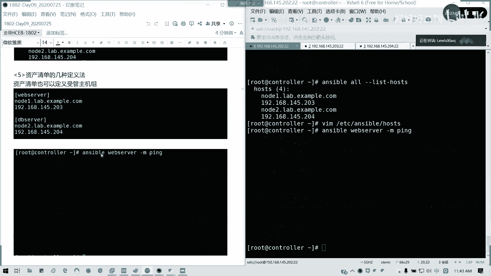

然后我也可以用范围。是吧我用范围我改一下，就刚才我讲的这个。范围的话，我这里我就改一下，我自己把它注释掉啊。因为待会我们还用它。我可以采用范围简化定义。web server同啊我这切成全角了啊。

我切有半角web server。这里n我可不可以写成一冒号2啊，或是一点点2啊。都可以吧。一冒号我们说的是一冒号2表表明一个范围，点lab点exouble点com。那是不是它这里就相当是两台了。

一条记录，相当于两台机器。对吧。然后第一B车文我有IP地址，我也可以这么搞。192点168。145点，括号括起来，203冒号204。

那后我这里我用那个anserible all this host是不是也是同样是4台？对吧。懂我意思吗？然后呢，我也可以定义多个组机构成组，也是我组里面，我上面还有个组。多级分组。可以做来，我们来看。

同样编辑这个组机清单。我把这个分组回来啊，我把这些删掉了，把这做注释我就不要了啊。把这一个我们去掉注释。把这行删了。我把前面的注释去掉，但你可以用s，我们可以用那个批量替换在我这里。因为我项目少。

我就用手动了。好吧，好，那我们这里我们可以往下再写个分组。叫做service分组，但是你要写一个children啊，冒号children说明他下面还就儿子嘛，对不对？我下面还有成员，组成员。

我叫做service这个大组，然后后面冒号写children。ILD不是LID很多人写错了啊，chren，然后我这里就写一个分组。对吧可以这么定义的。好，保存退出，我列出来啊。好。

我打井号的都是注释掉的。我现在生效只是这么这么几行。然后呢，我这里同样我列出来主题列表。是不是两台啊？然后我我直接用分组来。测试一下我们的一个连接情况。其实我们用杠M拼就可以了，对不对？同样成功。

懂我意思吧？同样成功。然后验证税款的主机清单啊，验证税款主机清单。

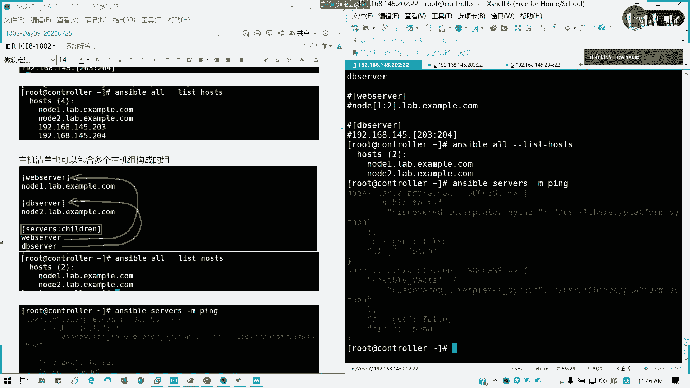

就是我们也可以用all所有整个主机现在都验证service跟service是大组是吧？小组还有单台主机都可以。那下面给大家点时间，我们现在是休息，然后给大家叫外卖的一个时间啊，如果说订餐的时间，然后呢。

请把所有的免密。联通性做好。啊。就我刚才做的一些，请把所有的免密联动东西做好，我们所有的手机可以吧？那现在中转休息15分钟给大家。做练习还有我们那个订餐的一个时间。好吧，那待会我们继续。

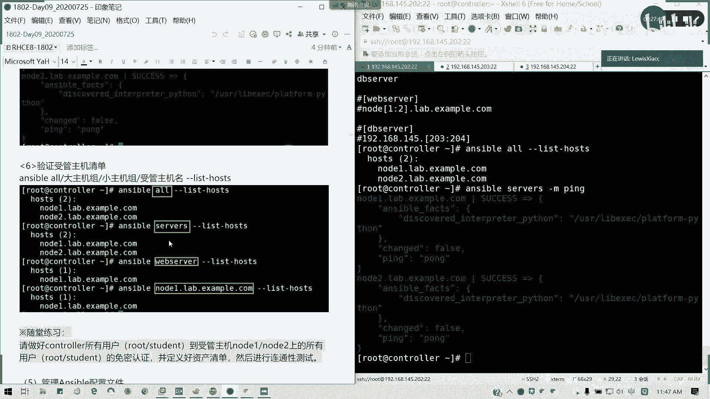