# Redhat红帽 RHCE8.0认证体系课程：P53：管理资产清单

## 概述
在本节课中，我们将学习 Ansible 资产管理的基础知识。我们将了解如何定义资产清单文件，如何配置控制节点与被控节点之间的免密连接，以及如何对主机进行分组管理。这些是使用 Ansible 进行自动化运维的第一步。

## 资产清单配置文件
Ansible 通过一个名为 `inventory` 的资产清单文件来管理它需要控制的主机。默认的配置文件路径由 `/etc/ansible/ansible.cfg` 中的 `inventory` 参数指定，通常是 `/etc/ansible/hosts`。

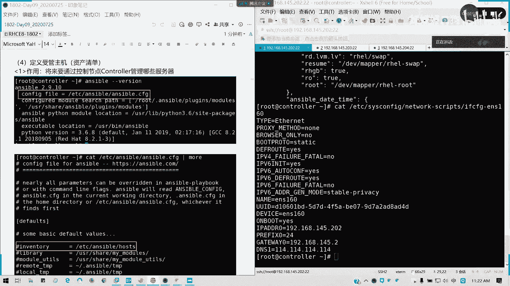

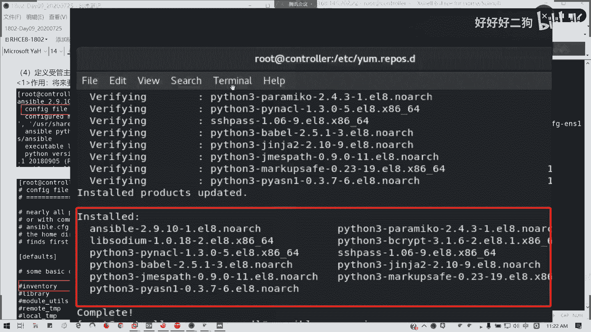

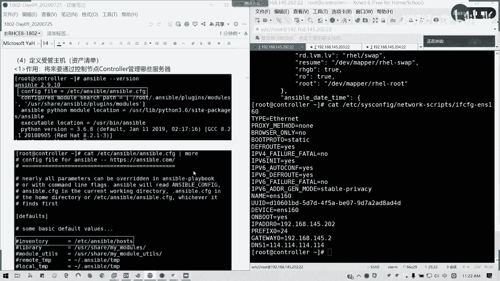

我们可以编辑这个文件来定义我们的被控主机。文件本身提供了一些示例。

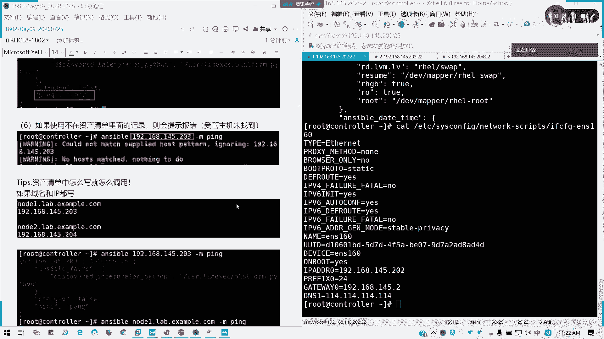

### 定义单个主机
第一种方式是不进行分组，直接列出主机。主机名可以是域名或 IP 地址。

```ini
# 示例：未分组的主机
node1.lab.example.com
192.168.145.203
```

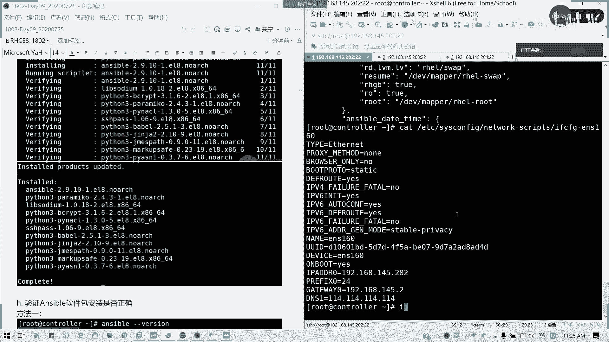

**注意**：定义时使用什么标识（域名或IP），在调用时就必须使用相同的标识。

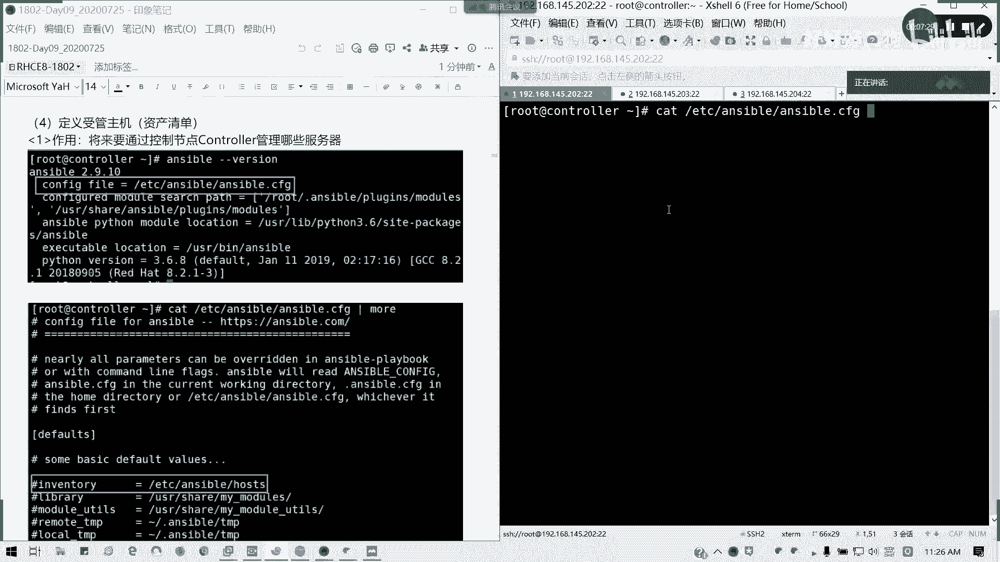

### 定义主机组
我们可以将主机进行分组，以便批量管理。组名用中括号 `[]` 括起来。

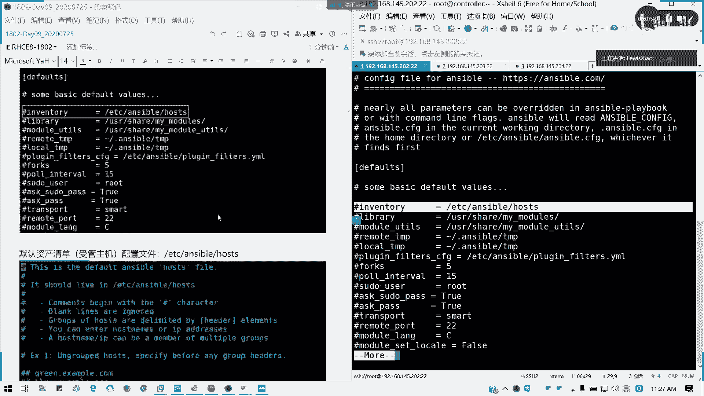

```ini
# 示例：定义一个名为 ‘webservers’ 的组
[webservers]
node1.lab.example.com

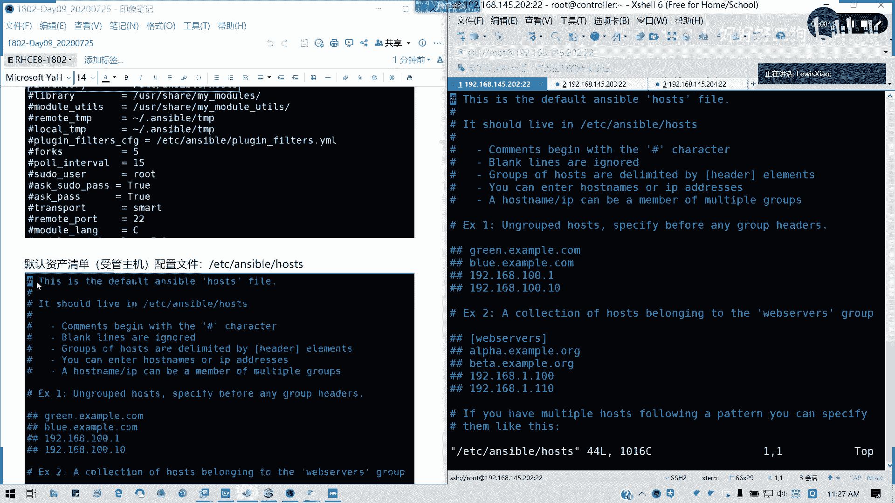

# 示例：定义一个名为 ‘dbservers’ 的组
[dbservers]
node2.lab.example.com
```

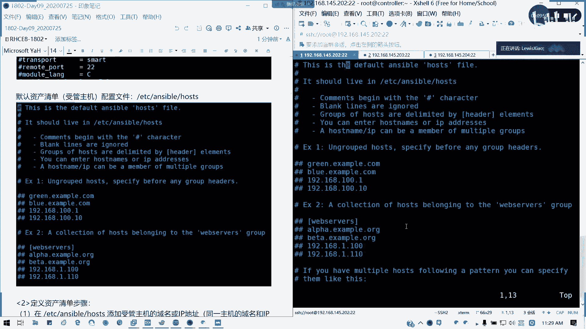

定义完成后，可以通过组名来引用该组内的所有主机。

### 使用范围简化定义
对于具有规律性名称或IP的主机，可以使用范围来简化定义。

```ini
# 使用主机名范围
[webservers]
node[1:2].lab.example.com

# 使用IP地址范围
[dbservers]
192.168.145.[203:204]
```

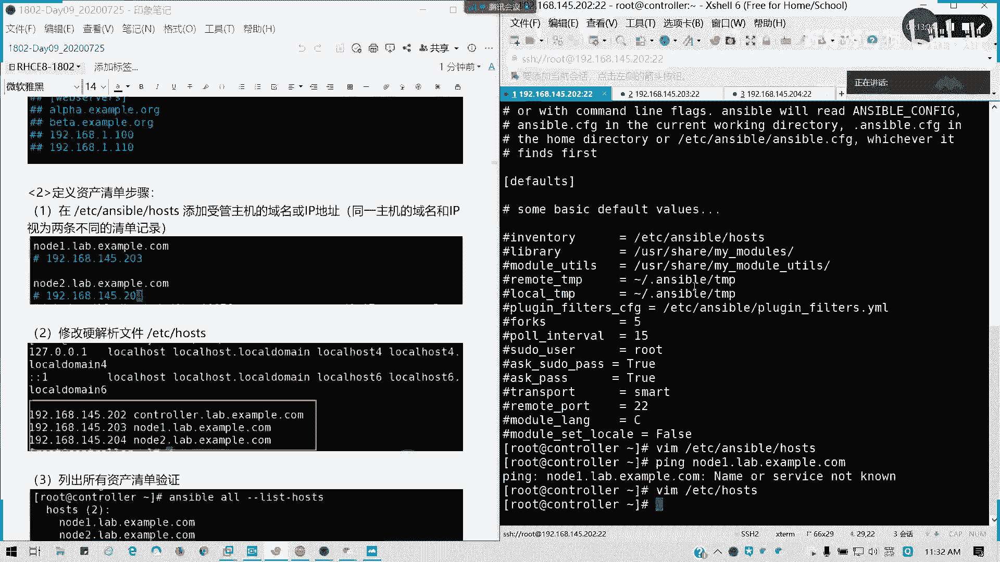

上述定义等价于分别列出了 `node1.lab.example.com`、`node2.lab.example.com` 和两个IP地址。

### 定义嵌套组（多级分组）
Ansible 支持创建嵌套组，即一个组可以包含其他组。这通过 `:children` 关键字实现。

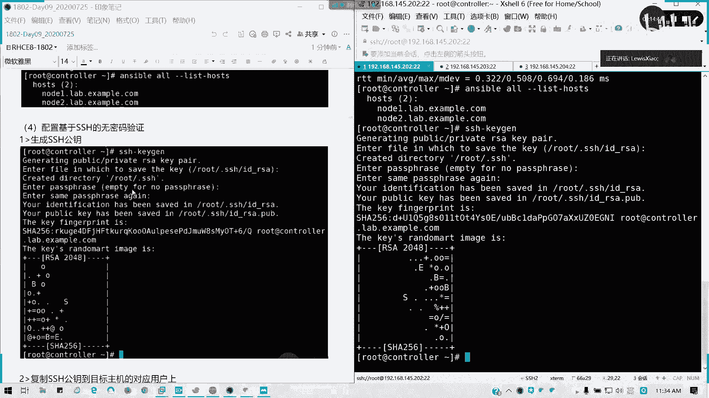

```ini
# 定义两个子组
[webservers]
node1.lab.example.com

[dbservers]
node2.lab.example.com

# 定义一个父组，包含上述两个子组
[services:children]
webservers
dbservers
```

这样，当对 `services` 组执行操作时，会同时作用于 `webservers` 和 `dbservers` 组中的所有主机。

## 建立控制节点与被控节点的连接
定义了资产清单后，控制节点需要能够连接到被控节点。通常，我们配置 SSH 密钥认证来实现免密登录，这是 Ansible 工作的基础。

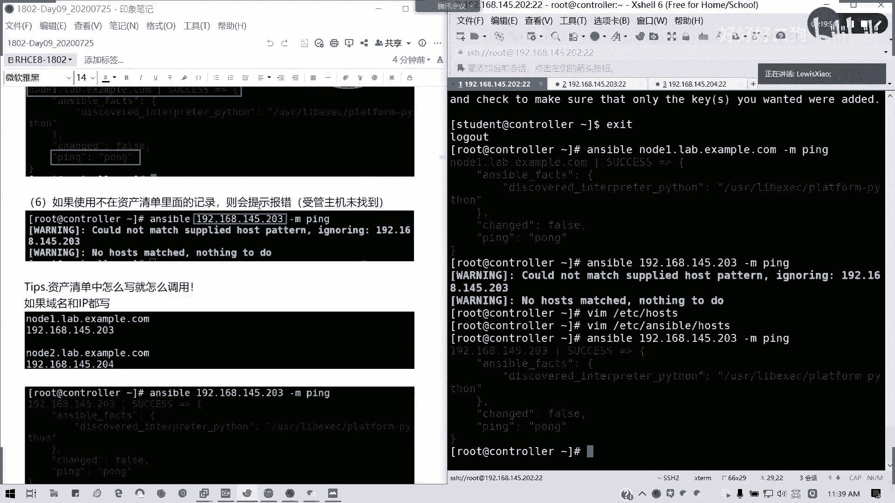

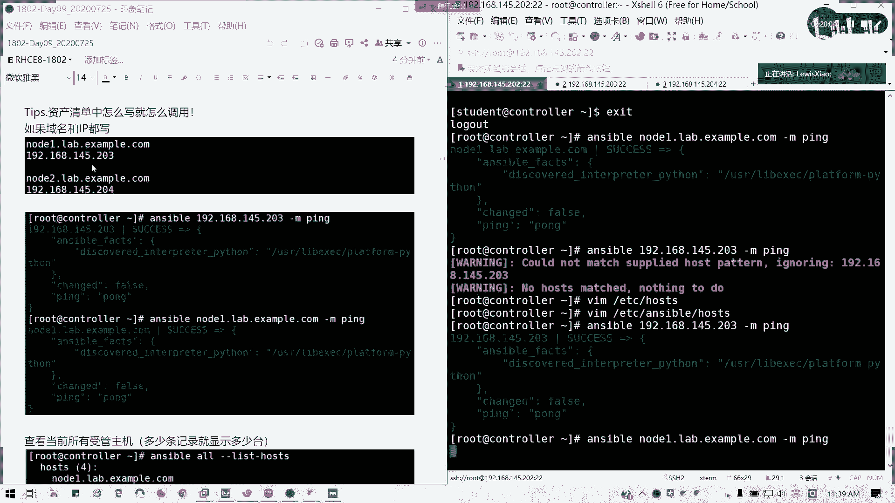

以下是建立 SSH 免密连接的步骤：

1.  **在控制节点生成 SSH 密钥对**（如果尚未生成）：
    ```bash
    ssh-keygen
    ```
    按回车接受默认设置即可。

2.  **将公钥复制到被控节点**：
    我们需要为每个用于 Ansible 连接的用户（如 `root` 和 `student`）分别执行此操作。
    ```bash
    # 以 root 用户身份复制到 node1
    ssh-copy-id root@node1.lab.example.com
    # 输入 node1 的 root 密码

    # 以 root 用户身份复制到 node2
    ssh-copy-id root@node2.lab.example.com
    # 输入 node2 的 root 密码

    # 切换到 student 用户，并为其建立免密连接
    su - student
    ssh-keygen
    ssh-copy-id student@node1.lab.example.com
    ssh-copy-id student@node2.lab.example.com
    ```

3.  **测试连接**：
    配置完成后，可以测试从控制节点是否能免密 SSH 到被控节点。
    ```bash
    ssh root@node1.lab.example.com
    ```

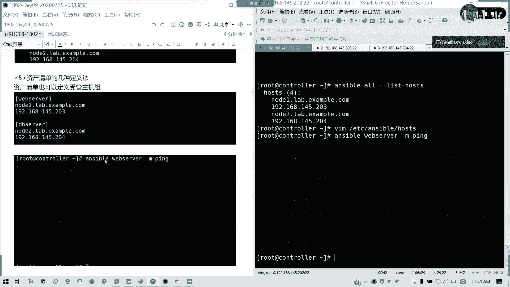

## 验证资产清单与连接
完成资产清单配置和免密连接设置后，可以使用 Ansible 命令进行验证。

1.  **列出所有被管主机**：
    ```bash
    ansible all --list-hosts
    ```

2.  **测试到特定主机或组的连接**：
    使用 `ping` 模块测试 Ansible 是否能成功与被控主机通信。
    ```bash
    # 测试单台主机
    ansible node1.lab.example.com -m ping

    # 测试整个组
    ansible webservers -m ping

    # 测试所有主机
    ansible all -m ping
    ```
    如果返回结果为绿色且包含 `"ping": "pong"`，则表示连接成功。

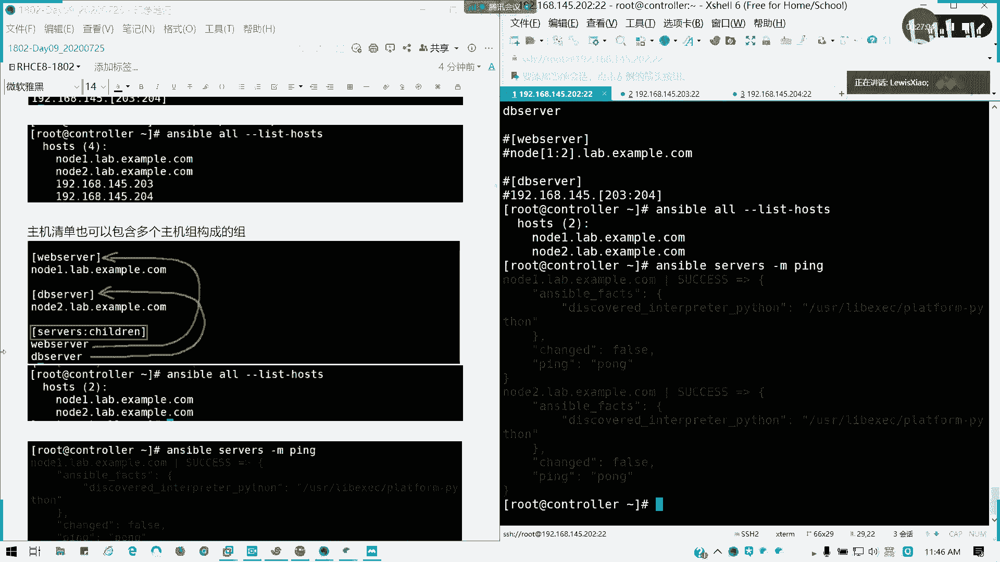

## 主机名解析
如果资产清单中使用的是主机名（域名），需要确保控制节点能够正确解析这些主机名。
*   **在实验或考试环境中**，通常已预先配置好 `/etc/hosts` 文件或 DNS。
*   **在自定义环境中**，需要在控制节点的 `/etc/hosts` 文件中添加记录。
    ```bash
    # 编辑 /etc/hosts 文件
    192.168.145.203 node1.lab.example.com
    192.168.145.204 node2.lab.example.com
    ```

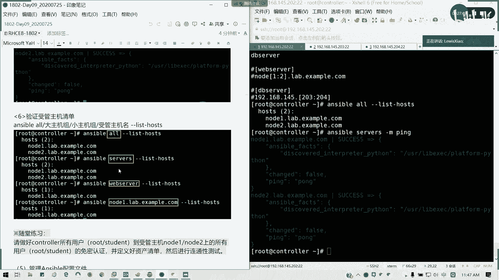

## 总结
本节课我们一起学习了 Ansible 资产管理的核心内容。我们首先了解了资产清单配置文件的结构和多种定义方式，包括定义单个主机、主机组、使用范围以及创建嵌套组。接着，我们完成了建立 SSH 免密连接的关键步骤，这是 Ansible 自动化执行的基础。最后，我们学会了如何使用 `ansible` 命令验证资产清单和主机连接。掌握这些知识，就为后续编写和运行 Ansible 剧本打下了坚实的基础。