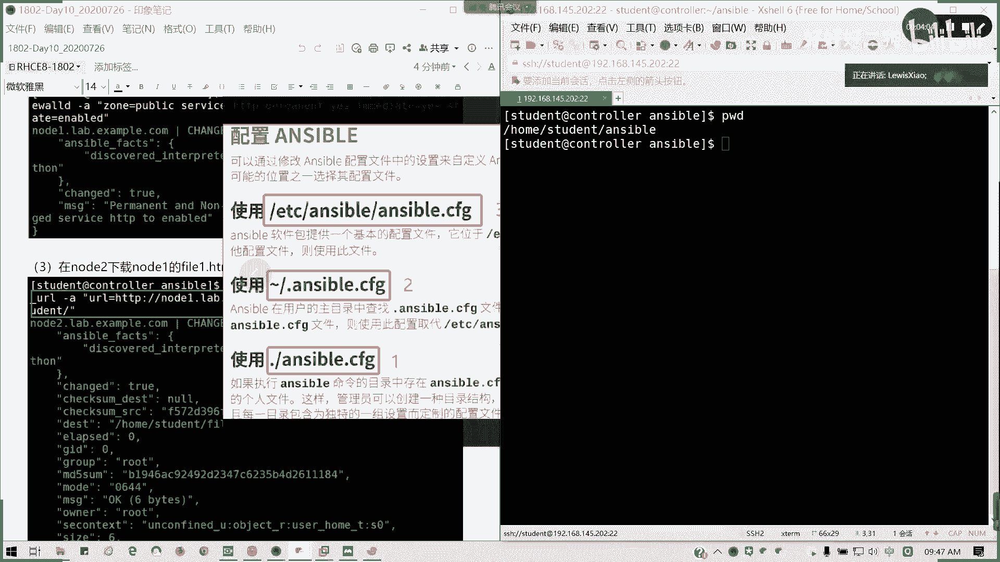
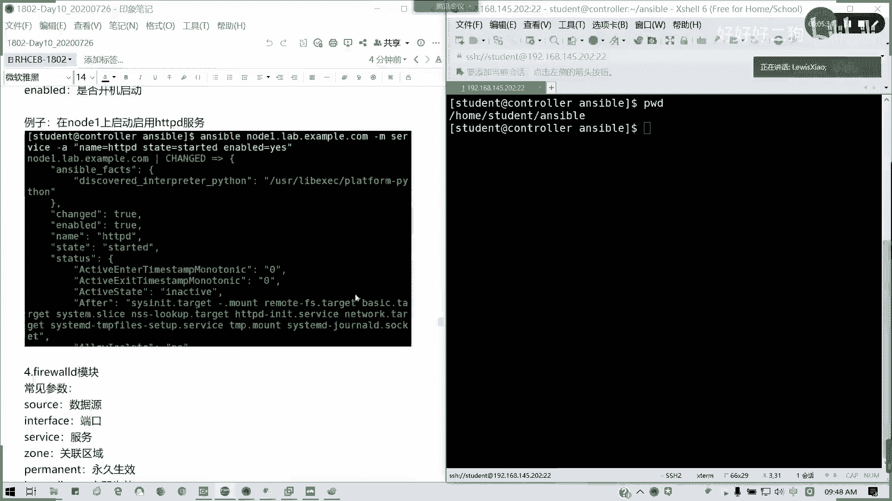
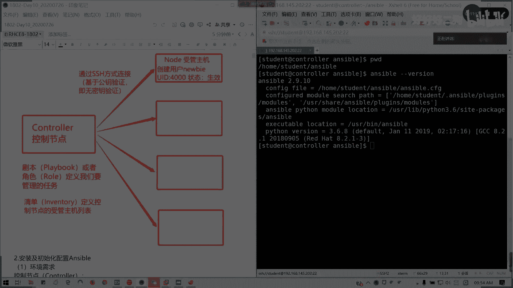

# Redhat红帽 RHCE8.0认证体系课程 - P57：57_Video_Day10_Day09回顾答疑 - 好好好二狗 - BV1M3411k77W

好的，那我们开始今天的课程，各位同学们，各位师弟师妹们，大家下午好，早上好啊，大家早上好，然后呢，我是小朱师兄，今天啊真的面授空荡荡，没有一个人啊，因为很多人请假，我怎么样，但是很理解啊，很理解。

就是说，工作还有各方面自己的私事等等啊，所以的话啊基本上我讲啊，我讲我的那个echo这一块呢其实很比较重要啊，比较重要，s5 这个比较重要，就在自动化运维里面呢，我们通常就是可以取代我们人肉运维。

然后呢昨天我发现很多啊很多人不熟的啊，很多人不熟的懂吗，包括刚才李东阳在问我的那个问题，其实这个不羞耻不羞耻啊，他说切配置文件很正常，为什么，因为你在工作目录上优先是最高的，我把那个图再放出来对吧。

优先级哪个哪个是最高的，要搞清楚啊，有的话应该现在还现在应该在听了哈，我们那个优先级优先级，我们默认是有一个单色波点，cfg的一个配置文件，默认是answer波点cfg的配置文件啊。

cfg配置文件呢它是一般来说不可能没有，我装好s5 之后，肯定有一个可就是在e t c enerable目录下面的，enable。c f g，这是就是说你默认情况下它就采用这个配置啊。

默认情况下才装的配置，如它它生效是全局啊，生效是全局，生效是全局生效啊，基本的，然后我还有优先级更高的两个啊，那率更高的两个，一个是点answerable，点cf区，在我们的工作目录下面。

在我们用户的工作目录不一定是root啊，在我们用户的主目录里面，也就是我们工作目录啊，加目录里面如果有这个点ens或者cf区，这个隐这个文件是隐藏的，因为前面加了个点，然后呢有这个文件的情况下。

我会优先采用哟，这它这个配置，也就是说它的生效范围，仅在当前用户登录下生效，而不是全局，然后还有一个优先级更高，但是它作用范围更小的，就是在一个指定的工作目录。

指定的工作目里面点answer for也没有，没有点了啊。

ensable。cfg啊，比如说我刚我在这里，我的工作目录是home student用户下面的exile，那他的那个作用范围呢，仅在当前的工作目录下生效，但是它优先级最高啊，根据我们啊具体生产生活啊。

我们且不说考试啊，就是说那个具体的生产生活情况也好，都是最小范围为最佳，因为影响的是最小的，你可以在此范围内低于自己的资产清单，执行我们enerable的一个配置对吧。

而你其他的一些其他的你如果在其他目录上，你可以部署其他其他的s5 项目，而且你不会啊受到任何的一个影响。

懂我意思吗，这个就是我先解答一下李东阳的问题，为什么要切换啊，嗯嗯根据考试的经验，很多人在这里翻的车。

不少人这里翻的车，懂我意思吗，所以先看清楚自己的公众目目录，不要说从他呢也考试说明，不包括你的那个做题的时候，你的说明都在都有跟你说这个事儿啊，不是说这个事儿，如果这个不知道哎，麻烦点一点看一看。

然后不要直接愣头青，看到看我们后面看到练习题，看到题目直接什么都不管，我就直接在路上干开干是吧，部署完诶，全部跑成功了，结果呢考试没分数啊，没没多少分数啊，反正我知道是11分，懂我意思吧，明白的话。

你自己扣个一给我啊。

好的，那我们呃这样子，我们昨天我们讲到的那个软件包。

我们回大概回顾一下昨天讲的东西啊，刚才我讲的有一点呢是一个单词，基础基础基础架构，基础架构就是这个图，你沟通部没有的话，你那个你工作部如果没有的话，哦没有，ascio sap区，你的工作部是在这里吗。

你的工作目是在这里吗，这是一个临时目录吧，你这个answer vision，你看一下嘛，对不对，ancial刚刚分手，你就看一下你的配置文件到底在哪里，哪里tab到底在哪里对吧，你这个你要知道啊。

反正我进那个目录，然后，你进到那个目录，你看一下就知道了，懂我意思吗，不要弄错啊，不要弄错啊，千万不要弄错啊，工作目录你一定要是绝对是ok的啊，绝对是ok的，就是说我不会说考。

就是说你的可连生产环境肯定就跑不了脚本，或者是会出错，如果嗯哼如果呢，如果你在考试的话啊，假设你就解决他在考试的话，那你也会真的是不知道这个分数丢在哪啊，但是我可以告诉你，你是明确的丢在那了。

点s5 加木没有，那你的s voguversion，你现在用的是普通默认配置啊，李建敏啊，你在路途用户下，你现在用的是默认配置文件啊，还要还要还要不要我贴那个图啊，自己设置啊，你自己touch一个。

对不对，我昨天怎么写的，我昨天怎么写的，手工创建手工创建啊，文文你这文件是手工，你自动拧它，它自动帮你来啦，其实把书看一下更好理解，是其实把笔记看一下也更好理解啊，我笔记我昨天有这个图的，我贴过来看看。

我先解答一下昨天大家遗留下来的问题，不要说今天真的是你昨天连一头新的诶啊，我会了111，然后结果呢今天倒过来实验啥都不会啊，哎终于有人来陪我了，哈哈来啊，对面这边，对面那边，然后通过程序可以连上来。

因为那那那篇课室的话，老师在在忙活啊，呃我之前的程序器了，所以没办法，你用腾讯会连上来吧，所有的麻烦的没有啊，不会啊，你可以用hdmi，然后那个gm一边看一边操作吗，可以吗，优先我知道你昨天应该有事啊。

没听课，昨天的东西我现在回顾啊，我等你五分钟，现在昨天我先解答一下别的问题，然后带我回顾一遍，哈哈没有，因为确实昨天翻车有点多啊，当时我看了，我看了，结果就看配到这个宿舍里去了，证书免密吧。

你说的是免密认证吧，免费的这个是需要的那一段hdmi，在这里你看到那条线的那个长长的线对，就这你接上去，你刚好把电视开了，就把电视开了，你就可以一边看一边投嘛对吧，就把腾讯会那边投过来，那不是很方便吗。

不用不用不用你遥控，直接点那个。

等一下就开了，我把这个图贴过来啊，把图贴过来，优先级概述，你看你你把屏幕切到扩展，等你把屏幕切一下，应该就可以了，最优先级概述能理解吗，李建敏能理解吗，有了有了，你就你扩展嘛，不要复制嘛扩展。

然后你把那个腾讯会拉过来，然后对啊，把这个拉过来的声音关掉就可以了，你把扬声器关了就可以，这一块能理解吗，好啊，这一块的话我们来看一下，我们来看一下那个内容啊，我们来看一下我们的，对对对。

马娟娟没有错啊，除了这个默认的配置文件之外呢，对的啊，娟娟应该就对的，其他两个肯定自己要自己创建的，不创建的话，你拿来配置文件，我上天调给你啊，不可能的，还有其他问题吗，我看看大家有没有其他问题啊。

看到了是吧，就是这个吗，你要文件它都说要存在的，你不存在，你哪来的配置文件，我上去调给你啊，好陈启涛，我看一下你的问题，你这个service你的清单，你看看你的工作目录又有问题了吧，你的清单你的清单啊。

你的东正摩托，你又在你的家，摩托干嘛呢，麻烦cd我看一下好吗，你看这种就是翻车，翻太多了，你可以把屏幕拖过来，那这样会方便一点，就把它学会弄一下对，我看一下，我其实现在集中时间解答大家的问题。

就是大家来提问题，我来看这位针对性会强一点，因为昨天很多确实是翻车的，对啊，翻了不少车，而且这个呢我且不说那个考试啊，我看一下，novel host，我看这，你要配置文件，我看你怎么写service。

你的你的配置文件inventory怎么写的，on student esible inventory。

没写server什么意思，来了来了，你的那个问题我发给你啊。

我把这群我拉过来哈，拉过来都没有开吧，你选择电脑音频之后呢，你把你你把你把整个关掉就可以了，你把整个你你选择电脑音频之后，你把那个关掉就行了，就把那个你的电脑的那个音效那个关掉就行了。

你看我这边就可以default啊，你的配置结又少了一个s啊，我不知道怎么鬼啊，对不对，这些很多这些翻车的东西啊，很多这些翻车的东西，特别是注意啊，我现在留留到十点半时间，你一个问题，你们有做题。

然后我再来讲复习内容，忘的话没什么用啊，很多翻车的翻翻的都自己都不知道的对吧，忘了我看一下两个样名写在一个rapper文件，两个样原写在一个rapper文件，你就在后面接就可以了，就昨天我的命令。

昨天那条样是吧，昨天那个你到后面接就可以了，但是我们在练习或者是在生产环境，或者是哪怕在考试环境里面，建议写成两条不会错，我把那个昨天的样子给拿出来啊，你大家稍等一下，我做一下那个拿出来，对啊。

格式参考。

这个没有错啊，参反正他有示例文件的，你们怕什么呢。

我把这个图截一下啊。

就我把这一段就把fire开始的这一段是吧，我第二个文件fire开始这一段接在这里。

我留个空格，接在这里也可以。

懂我意思吗，我把这里我接到我接到后面就fire我，我这里就是我干a，你是你就是你是不是要两就是两个配置段嘛，两个配置斜，那我把它接到后面就可以了，不用带引号，直接过去就可以了。

这就是可以把两个配置文件写在同一个，就两个样，我们的样源的两个配置段写在同一个文件里面，这是可以的。

如果把那个fire你就去掉，把fire这个你不要懂我意思吗。

后面跟着就搞定了，政委知道吗，明白哈，还有其他问题吗，由今天我改由你们来提，不然的话真的不知道啊，有问题这两题啊，还有些问题吧，尽管提不怕你们来啊，这些基本的东西现在还没讲到和还没讲到。

另外一个核心叫做变量40，有问题吗，可以提，真没有，自己弄了，一只都没，继续提啊继续提，我看你们有什么问题，你们现在实验各种翻车，我可以我可以救你们哈，在考如果在说不好听，在考试，那就惨了，不明白。

所以免疫突然失效的问题，昨天你就搞个server，第一次我第一句了啊，还有其他人吗，我觉我觉得应该今天我看下，今天听课的只有三二十八个人，28个人估计有28个不同的问题，我相信啊，不是啊。

这是创建随机随随意取个名字，那没问题啊，呃还有前轮游艇啊，有问没有问题的请扣个y，没确定没有问题的请扣个y，有问题你继续提问，这个题目有什么问题我还没讲，有什么问题请说，创建包含行内容。

这个我们用copy可以吗，为什么不能创建呢，你先创建一行内容，再做符号链接啊，为什么不能创建呢，你符号链接不要搞反了，不是在这个目录上面创建的，不是在这个目录创建，是这个目录上面创建。

那符号链接你估计搞反了，否定接source跟pass这两个不要搞反，他应该这样的话应该是反了，反的话你就反向链接，那就不对了，我要把它练就应该source我们源头是deaf off。

对我们source 4应该是deb os，然后呢pass是才是vr 3 html那一个，这个才是对的诶，怎么样哦，我把快捷键取消啊，不然的话它会转移啊，这个才是对的对啊，如果反过来就是就就真的反了。

所以这个问题啊，这个问题很多人搞错的，这到底我的快照是哪哪到哪的，不是我的不是快照啊，我的软链接，我的硬链接到底是哪个到哪个，哪个是源头，要搞清楚，还有其他问题吗，反子，明显就反了，对吧，明显就反了。

false不用加你换过来就行了，就他的那个source跟pass的两个路径调换位置就对了，还有现有问题吗，继续提，多练习，我不会全职，我不会讲，但是我们可以啊，针对你们列列出问题，我一个个解答。

这样的话我觉得你们效率会高一点，然后待会我再通篇复习一下昨天的内容，那是最好不过了，因为昨天我们讲到了哪个地方，讲到了我们的临时命令，讲了两个大模块，一个是文件模块，一个是软件包模块啊。

今天我们还有那个系统模块，以及我们的网络文件模块以及playbook以及变量，事实我们今天要讲的内容，今天是讲到五点钟的，看下有问题吗，没有问题的各位请扣y，有问题继续提问，没问题请q y。

有问题请继续提问，真的不要说留的问题留到最后，然后然然真的什么都不懂，那就真的很吃亏的，然后有没有问题，你们做过才知道，对不对，不做题，真的我不知道怎么说，在这里你可以放全屏都没问题。

你放全屏应该应该也可以对啊，你这你那个同学你放全屏录哦，那你把旁边你可以去掉吗，旁边你这接着你不用看了吗，对啊，你把它对点一个箭头对啊，这样会好一点，真的都没有问题吗。

那好我这边我回顾一下昨天的知识啊，不浪费时间，先回顾昨天知识，然后我们休息一下啊，昨天主要是enable基础架构，ansible基础架构呢看到没有，这个图意图搞定所有，你只要理解那个图就搞定了。

懂我意思吗，一个指挥部，我要命令我下面的授官主题就是我的士兵是吧，发号施令，指哪打哪，我要你干嘛，你就干嘛，那好我们之间是不是要建立一个关系对吧，建立一个信任关系，那就通过免密认证的一个形式。

懂我意思吧，免密认证我们就可以达到这个目的，免费认证，这是第一个，第二个我们的我怎么去发号施令，那我们要通过剧本或是角色剧本，昨天解释过，我们演戏是每个人有一个剧本，对不对，有个台本里面写明你要演的。

怎么你要你的神情，神态里的台词，你的角色到底是什么，对不对，然后每个人他是分工怎么样都有写，对不对，那eniable，其实他也是利用这样一个类似的一个原理对吧，这个原理，然后发号施令。

然后确保达到它的一个目标态，对吧，所以到达目标态，然后你的这些数款主机哪里来，我们的资产清单对吧，资产清单可以定义，对不对懂吗，所以这个图你能理解，那我们n s不就好学了，如果不理解，那没办法啊。

其实我们昨天的一个过程呢，我们第一章的过程其实就是把这个框架搭好，懂我意思吧，然后呢环境配置需求，我们为什么不用那个练习环境，因为用列循环境的话根本不用装，对吧啊对啊，都有啦。

但是我因为考第一个考虑到大家的一个实际，我想教大家如何去自己去部署，这是第一个，第二个，第二个就是我们的有些配置啊，有些配置大家打发要求啊，有些配置达不到要求懂吗，达到要求。

所以所以的话我们采用最小化的，就是两台考试，如果是我们去报名考试的话，考试我听说是五台机器啊，五台机器懂我意思吗，嘟嘟，然后呢，我们手段的装修很简单，因为主要是我们我们挂一个样本就可以了，对不对。

我们本地样品要装，因为他的那个python的那个关联组件在里面，然后我们现在的最新版本三，tv s已经到2。9。11，2。9911，然后我们的那个，然后刚才有人问啊，刚才有考古老师有那个在刚好在插插。

我插插队，在问那个配置的问题，我这个我记得我在第一个班的时候已经说过了，啊对吧，我在第一节课是不是已经说过了，我要求什么配置，我有讲，然后python呢我们主要主要他的在七跟八的一个区，别。

就是它的python版本七的话是2。7。58，现在是3。6。8，可能你在那个8。2的版本能更新，对不对，8。03和3。6。8足够了，我们考我们的在练习环境里面是2。8，其实差不多啊。

所以我知道大家怎么安装是吧，这里的话安装知道吧，用其实它不在我们的标准包里面，不在我们的仓库里面，它像一个叫叫做extra package for enterprise linux啊，linux的企业。

linux的一个叫做扩展包不会做吗，然后呢安装跟验证清楚吧，安装灯组验证eniable，杠杠分水，我们用起来对不对就可以了，然后呢初始化配置，我们初始化配置要注意两个东西，一个叫做资产清单。

也就是我们的主机列表，组织列表呢要不单调介入是吧，单条记录，然后呢要不就是我们的分组，对不对，可以分组，对不对，可以范围用括号简化范围，可以我分组里面再创一个大组对吧，大组做小组。

然后记得这里有一个冒号丘人，对不对，大佐啊，就是他的儿子，对不对，然后呢呃我想然后分组，如果你在本地的实验环境呢，我可以用in解析来做，可以吗，并解析，然后记得我们做完之后，我们要如何连接呢。

免密认证公司要免费认证，对不对，免费的，这是不是必做的，当然我们如果在考试或者是我们模拟练习里面，它会有说明某个用户已经做好了，针对虚拟机里面用户哪些指定用户的免密认证，那这一步是不需要做的。

但是我们平时在自己部署环境的时候必须对吧，你要建立好一个信任关系，而不是你在运行，就是说输入密码，那不是他效率太低了吗，对吧，然后验证知道了啊，验证之后我就不再讲好刚才讲的配置文件，大家问题最多在这里。

是不是到底我应该用哪个配置文件，其实告诉他最好是用优先级最高也是，而且影响范围最小的，懂我意思吧，影响范围最小的就是我们的工作目录，我们在工作目录里面，他他在创建的话，它优先级最高对吧。

但是你每次你在control的时候，你麻烦你切到你的工作簿下面，如果你不确定，你就学我的，对吧，所以呢就那个我们优先级配置高配置最高的，我们是推荐使用，而且考核如果是我们到考试的话，我去学问过学员。

他是有这个要求啊，因为我们不能过多说考试的事情啊，然后呢记得啊先验一下是吧。

如果我的默认啥都没有，我就用默认配置文件，然后我在家我在某个用户对或者工作后，也就是我们家木有的话，那它的生效范围是就就是它的用户啊，注意它是前面有带个点的。

如果是工作目录，那直接用公共目录最高，对不对，然后呢优先级概述刚才说了。

然后配置文件示例啊，大家如果不会写，请看一下默认的配置文件basic啊，我看我再给大家看一下好不好，less一下，呼呼呼，这里啊some basic devop volumes啊。

你们这里其实你可以直接拷贝的，懂吧，自己如果忘了配置项直接拷贝过去，然后我们挑主要的就行了，挑主要就这么多，其实这两个都不需要对吧，这两个我都不需要，主要是这个我直接改一下好吧，对吧。

然后呢这里的话我就改成对吧，home student目录，就是具体到我们的练习或者考试的时候，他这个用户是不同的，每个人都不一样，对吧，然后通常这里的话肯定不是root的，对吧肯定不是root。

我们就写这几行就行了，然后后面下面我们加一个提前，对吧，pvillage excreation，这一大段知道怎么写，不要不要我再把把图片贴过来，privilege escalation。

这里建议用should do，好吧，不要说你你可no一用should do no，二用su，那不是乱七八糟吗，对不对，而且su这个方法其实不太好，为什么你这样，你把他把把把。

把你的那个普通用户权限无限放大了，懂我意思吧，我们所以我们在可控范围内呢，我们还是需要说那个把我们的速度就可以了啊，我们用这个图贴过来。

好这一章我们就回顾到这里，这一章第一章内容如果没问题，请回一，数字一啊，这张往往是翻车最多的一个地方，一就，一句话叫什么来着，一朝失足啊，一招错误啊，弄错满盘皆输啊对吧，你的价你的架构都不理解。

那架构你都弄错了，那我没办法喽，su为什么出问题呢，icu为什么出问题，你的用户你不在vs里面呢，在vo组，那你那你这个注释做了没啊，这个做对了吗，你su这个做对了吗，这样考试两种方法都可以。

但是我建议大家用should do啊，用手度会更好，没事我们用哪种方法顺手用哪种方法，建议大家用，should do哈，这是第一章内容。

第二章我们讲的第一步讲的前面的一一大半。

首先eniable临时命令的格式，大家要知晓，对不对，临时命令格式懂了吧，animal，后面加资产清单里面定义的主机组或主机，都是套我的作用域在哪里，然后呢后面我加杠后面带模块。

如果是杠m shell的话，你就可以省略对吧，然后呢杠a参数，我的我的那个命我的模块里面什么参数啊，然后后面我可以自带资产新的配置文件，当然啊幂等性大家应该知道啊，幂等性刚才我已经讲过了，幂等性。

然后呢我们是否在昨日的练习，如果你不懂的话，请推荐参考这个东西，前提你英文也要会啊，你要会看啊，懂我意思吧，and serable dog，非常好用的一个，不对吧，不会就dock一下啊，不会快。

你的不会请dock一下对吧，它里面有它里面已经告诉你哪些模块能用，哪些不能用哪哪哪些模块是必备必须的对吧，等于的话就是必填项一横杠就选选项，懂我意思吗，网站的话，如果我们在上不了网环境环境的话。

你这个就不能用了，除非你把整个网站下载下来，但是我觉得没必要直接搜o dog看一看就知道了，那我们昨天昨天主要重点讲了，文件模块里面的下载，copy copy，除了我们可以从我们的控制组。

控制端复制文件到售管主机上之外呢，我们还可以直接在售管主机上生成内容，就像我们昨天的那道练习题是吧，我要生存那个我直接用copy就行了，然后只不过我的那个，soft我们换成content就可以了。

赛尔创建目录或文件啊，托福堂这里来设置文件属性，我们可以创建目录，我们可以创建文件，换成空文件，用touch啊，不是fire你fire你这个文件你要存在，懂吧，然后我也可以拿来创建我们的链接对吧。

刚才讲了链接，你不要反了，source是你的源头，因为这里已经存在的文件或文件或目录，然后你要创建软链接的话，你的pass你要写上一个，你的软链接的那个具体的位置在哪里啊，这是第二个fire。

第三个flash反过来，我从售管组件拉文件到我们控制端对吧，如果默认的destination和source的话，那它就会在我们的目标端，我们控制主机这里我会新建一个目录对吧，然后后面跟你的那个绝对路径。

就就你的绝路径，这样目录录下来，如果只fat的话，就直接写文件，懂我意思吗，还有line in fire这个经常要用，就是比如说你的那个改某个文件，你要写具体内容，按按照行号啊。

按行来具体来进行修改的话，lying fire很很很实用啊对吧，我们在生成一个文件，我们在写文件的时候也可以用line in fine，也没有问题，但是你要定位好你的插入你的，我要修改的那个位置。

通过regular expression的正则表达式对吧，这表达式来进行定位，然后用line来写修改后的内容，pass是我们的文远端文件路径，对不对，还有state我们要写修改生效或失效。

这个默认是生效的啊，single laze文件同步，这跟其实跟我们的copy差不多，软件包模块重点young repository，软件仓库，刚才有人问问能不能两个写在一块，可以可以啊。

young repository，是不是跟我们的rapper文件的那个有点类似啊，对吧，或者我们可以叫做就跟young cafe manager，其实里面默认配置是有点类似的对吧，好的。

然后呢这样直接安装对吧，安装软件源样很简单的好吧，它有更新安装版本删除记得吧，然后里面必要就是一个nt软件包名称，如果这一块都明白的话，请打个二。

我们昨天是讲到了这里啊，我看一下马圈圈的问题，全局配置的文件，你也可以自定义这个文件你是可以自定义的，你只要你在ensable。cf区域里面，inventory，内行，就可以了对吗。

我们这里是可以自定义的，不是说一定约定俗成，只不过我们为了方便，为了好记是吧，懂我意思吧，反正这ok吗，ok的话，请回个一，然后其他人没有问题，请回啊，我们讲完了，这一章指前面的内容。

这文件不是死板的哈，除了enerable。cfg 41定要这个命名之外，其他的你随便啊，你的清单你可以自己要叫张三李四王五赵六，没问题，随便你命名，但是你要引用一定要正确，没事你得感冒。

是不是冷到打喷嚏，没事没事，还好我们这隔得比较远，还好好的，那如果没问题，我们稍微休息15分钟，我们50分，我们来讲剩下的剩下的东西啊，我们软件包模块已经讲过了，看一下创建样模样的话。

我看一下你的unsuperparameters from the pository，我看一下啊，你的f dream，你的那个bac rl就出问题了，这是第一个，然后你的jpg check你写的什么东西。

诶，我想知道你这个写的什么东西，陈志浩，有两个地方错了，这什么东西来的，明白自己错在哪里吗。

对啊案例有对不对对吧，他下面我们的那个每个iso dog gv，是不是下面有example啊对吧，是不是有我们的example啊，看到没有example的话。

我们直接用案例就不会错了啊，对啊，手残党一大堆啊，我见功夫少了，你这个龟公子也不熟嘛，然后没问题的话，我们稍微休息15分钟啊，用案例，这个是一个剧本，接下来我会教大家怎么写剧本啊，这是剧本的格式。

但如果考试他要求写临时命令呢，你要会写，休息一下。

