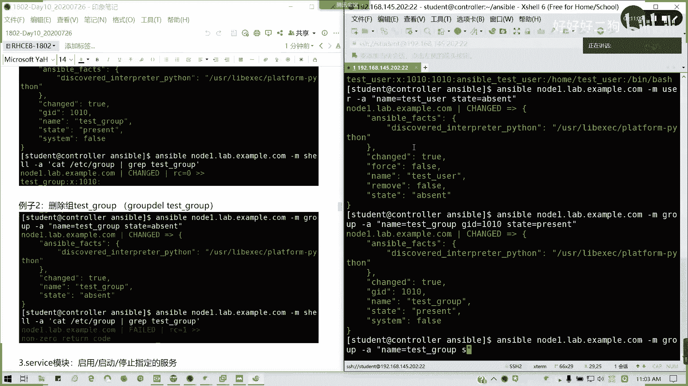

# Redhat红帽 RHCE8.0认证体系课程 - P58：58_Video_Day10_Ch02c_Ansible临时命令_用户模块网络工具模块 - 好好好二狗 - BV1M3411k77W

然后呢，我看一下录屏啊，像你昨天说的啊，像昨天说的那一个我们的一个软件仓库啊，一个extra package for enterpriseterpri news这里我们看一下。哎，我这里没没反应啊。

我看一下那个EDC我我LL啊。其实他装的什么东西呢？主要是1个EPAAL开头的那些。对。是不是EPL开头那些，然后他有一些测试的，还有一些modular是吧？因为他原抛N鼓不在这里，你看。懂了吧。

他写的一些样员。懂我意思吧？所以我们为了获取它的一个extra package。才用了他。懂了吧。原来你知道我还不知道这个之前呢，我是用离线去打包样明这些结果缺东西了。所以的话如果我们现在联网情况下。

我们是不需要的。当然，在练习环境，在考试里面是不需要的。里面语音有啊，他会给你一个指定的路径。然后你那你去去下载就可以了，懂我意思吗？这是我们自己搭的情况下。对吧我们自己搭的情况下。

我们来我我们我们自己搭，我们就这样的话，是不是我们就学到一招了，对不对？

那我们在企业里面，我们部选选则，我就不不用去考虑这么多了，我们直接用就行了。啊，直接打，然后这因地制宜嘛。而且你这样你8G内存也能跑，甚甚子啊我三台机器8，每台机器分一两G，那我8G内存是不是怎么跑了？

来6G。下单是16是吧，你要加到32。我就刚。就就换16嘛，可以啊。或者换32吧，你干脆就。没有你换32可以啊。你直接换32把浏览器。八代是吧。他说了是吧，他说那就没办法喽。

但是有时候呢他说的只是一个保守值。像我这台机器，他当时说最大只是32，那我强一，我就怼6次。支持啊。你你可以啊，你买一条324不行退货啊。就京东啊。你淘宝不一定可以啊。你下一条什么叫像镁光啊。

什么海立士啊、三星啊，你下一条32的2666嘛。对吧你这你八大应该是2400就可以了。八代应该是你八代CPU是吧？八代应该是2400十代上2666。然后如果你这些可以往下，你下2666嘛，一单条32。

看能不能插嘛，不行退货嘛。请视做一般般。一般海力是美观或者是那个三星。美光有的。美光有的，你这些这些配件的话不会找我啊，英瑞达英瑞达也就是美观嘛。子品牌吧。你可能上你现在下单，应该上午上午下下午就到了。

没有啊。

不一定看一下。そうな。对呀。你直接送到这里。当场拆。可以都行。😊，可以了，OK。这里啊不是在conttrol VS度啊，懂懂我意思吗？陈启欣。这个我他这没有3到。你单条32，淘宝上有。

单调30应该是有的，不是说没有他那个你只要你要你要你要看一下，知道。送不完主机对呀，不然的话怎么办呢？淘宝是有的3条3号，我买了的。700多块钱。不到800，可以买一条美光3万。2666。

So说完主题yes啊。

有问题继续提啊，刚才又又不就又不提问题。

反正先试嘛，就像我当时买U盘一样，我说。哦，重新做到这一步啊。有的，我看一下那个上面有的不是第三方的。第三方。就京东第三方有的。其实跟跟淘宝差不多了。这个第三方会久一点。你没事的。

你你你到时买买来到到时再到时不行就退嘛。是吧。不一定不一定。心里有一个。我这台为什么我我才我我这台为什么当时不会翻车呢？因为我看到京东，他们那个第三方明确配置写了加配可以到64G。所以我就直接买了。

懂我意思吗？研究一下嘛。

好，那我们先啊先不讲那么多，我们来看一看我们接下来内容。好吧，时间关系讲我们刚昨我们讲了两个模块。现在我们讲第三个系统模块啊，能听到我声音吧，应该都啊。系统模块我们主要讲user用user啊USER。

USER它是三个命令的结合，user adduser modeuser de还记得我们。第一本书的第六章吗。三个命令的结合常用参数是是不是跟我们的杠U啊、杠C啊、杠G啊，是是不是类似？好吧，这些都懂啊。

都懂，那我们直接看例子好吧，直接看例子，大家更容易明白。首先我们在note一上创建一个test user用户ID为1010。S色宝。为什么我一开我现在还要讲临时命令，你不讲临时命令，你的剧本你不会写。

但系扁装更M优势。杠A参数name等于t下划线userUID等于1010。然后呢，我的coma我的注释啊，就我对于这个用户的描述，为什么外面用双引号里面用单引号呢？为什么外面用双引号会好一点？

因为里面的话我要写东西，特别是加空格的时候，我要用引号括起来，对不对？层次结构啊，anserible testus。So。并b对不对？然后呢，geneity XSH case就是它会自动生成一个公司样。

这其实我这句话鬼不写啊，然后呢state。等于。Present。

对吧这里我们的anible，我们的load音已经返回一个结果，它我们称之为叫做anwerible的事实。

既定俗称东西我已经完成了，那我返回给你，这叫事实，对不对？然后他这里已经是不是返回了我们创建的一些内相关内容信息，对吧？那我们直接验证的话，我们其实连那个主机我们不用连了，我们直接用shall。杠A。

アイティ。是吧。T user我们直接查这个用户。

懂了吧？或者是直接cat这样就我这里cat。ETC passW点。注意啊，他这里是不能用我们的别名的命令。比如说我们的LL就就起就起不了作用。必须要他用他的原本的命令LS杠L懂我意思吗？可以吧？好。

这这个例子明白吗？那我要删除，我不要了。😡，那我把这但我就是留一个name就可以了，对吧？然后。我们的state。等于aent。当然他这个删除只是简单的删除，它只会移除你的记录。

不会删除你的加目录这些的，懂我意思吗？跟Uer dial是完全一样的，对不对？然后group模块创建用户组。

跟group这些的结合啊。Group。杠A。name等于ts下划线group。然后GID等于1010state等于present。

对吧。然后验证的话，我在这里我就不再演示了啊。

然后我要把它删除。那我这里。state等于afon就可以了。

对吧。这两个如果明白的，请打字母A。

好的，弄完之后呢，我们来讲一下service模块。service模块呢主要用于启动启用停止指定的服务，是不是跟我们的stem controll很像？

对吧。好。

参数。名字、服务状态以及是否开机启动。那我们看一下第一个例子。

我们要启动启用HDDPD服务啊。

杠Mservice。杠A。name等于HGTPDstate。前提你这个服务也要安装哈，start starteden等于yes。等一等啊。

哦，我没装是吧，没装，那我们就用样模块来装一下就好了，不急哈。

反正哪里出问题，我们就哪里解决。就不用急了。

好了，装完我们再把扶起来。当然它这个状态啊，除了你可以启动，你也可以把它静止，就就把把它那个把它就说启用关闭，就enable they弄。然后它它那个如果我们其他的像我要把它diable。

不就就star我可以stop是吧？sping。然后还有一个叫做restar，对不对？restar就我重启。

都可以啊。他列出很多的一些信息，这些信息都可以可以看啊，这就这我们事实后面可以引用的，懂我意思吗？这例子没有问题，请打B啊，我们的service的应用没有问题，请打字母B。

好，接下来我们讲防火墙fire沃D模块。fire沃D模块呢这里比要复杂，就跟我们的fire沃CMD它的用法差不多。啊，参数有数据源端口服务关联区域永久生效，立即生效防火墙规则状态以及负务规则。

我们是不是在第八天的讲课之不讲到这个东西，当时可能你没来啊，听后面应该有问题了啊。好，我们看一下，我们刚才状HDTPD服务，我们要加node一啊，node一这个HDTP服务我在放行。

首先我的模块fire沃低是吧，杠A。我的造要在public区里面，我的service服务我的服务名称叫HTTPHTTP没有B啊。永久生效，permanent等于yes。

对吧立即生效immediate等于S，然后state。这条记录要生效。当然我们不需要在你reload了。

懂吗？他已经帮我们自动卤肉过了。这据我们就不需要不需要再卤肉了，懂我意思吗？这是第一条第一条例子。你看下面的那个。MsG嘛，它的message已经说了啊。对，然后呢我们的副规则，我们要将145。

0放通SSH服务啊，n一添加副规则，我们来试一下。

杠A后面which rule。然后后面等于就是直接我们引号括起来就这么负规则就可以了，对吧？如果 family要很熟啊，等于IBV4。sourcece addressdress。

我其实我没我没看讲义敲的啊，我自己我都会我能背的啊。

5024位，然后呢，service呢。等于FFH。然后acept对不对？然后后面我们再perman。

Immediate。State。O。可以了吧。这一块啊大家大家其实要对防火墙比较熟啊，对防火墙比较熟。如果这块没问题，请打C。

好了，然后接下来我们讲一个下载文件。

下载文件啊。我们net tools模块，我们只讲一个下载文件就可以了。下载文件呢就是从远端，我从互联网这些都可以，我拉拉文件过来。现在我们的例子就是从node一上下载fi文件到node2里面。

那我们首先是不是要在弄迪我生成一个文件啦？copy是吧，我只是的么就copy模块，参数content等于。我就写一个hello好吧。记得后面加换行，因为不加换行的话，你执行完命令的话。

它会跟着那个提示符的。Destination。我就写在我们的VR3W里面。对吧就放放网页目录，我们刚才不是已经写了吗？就是装了吗？你直接放放在这里就行了。它自动的类型就变成s den梯了。

因为在那个目录下面的基成啊。

好，我接下来我要放松服务，对不对？刚才我已经放通过了，对吧？我们在上一步操作里放松过。然后接下来我们要在note2上面下载，那我们就把这个作用的受管主机，我们手写的note2耐ap点apple点com。

杠Fge下划线URL杠A。对吧URL等于HDPnode1。点example lap点example点comM。然后发一点HTML就是我模拟从一个网上下载啊，我这里是局域网。

然后destination home的 student目录下。就note2的啊这里。如果你这里域名解释失败404的话，我看一下。

directory require failednval service no为什么我们没做硬解析。

懂吗？我们的203，我们要做一下应解析，因为他不认识这个note2。

对吧。考试我们做在练习完境或是在那个真实的考试里面，我们是不需要做这步的。我要加就一次性把摄相机加了吧。马上生效了啊，来，我们这边都不用管了，回到这边。还是不行哦，因为诺德尔也不认识他。

那其实我们可以用那个需去编辑，但是我这里我就费事了啊。同样我们把这三行那种我cat一下ATTC后sse，我把它复制过去。或者我们追加也行啊，用A口追加都可以，你们随便啊。好吧。

总算可以了吧。主主要是在那个二加。OK这个就是下载完，那如为下载成功，是不是我们我们这里的话可以验证的啊。我这有没有贴图贴重复了？

有了对吧，OK。😊，那这部分如果没太问题，请打没问题的话，请打D，有问题可以提问。没有问题，请打字母D。

好，我们第二章就讲到这儿，我这里先不休息，我切一下录屏，然后呢准备讲第三章，第三章比较比较短的一个时间啊。

