# Redhat红帽 RHCE8.0认证体系课程 - P60：60_Video_Day10_Ch03b_AnsiblePlaybook练习 - 好好好二狗 - BV1M3411k77W

好，我下午先记录一下人家签刀哈。

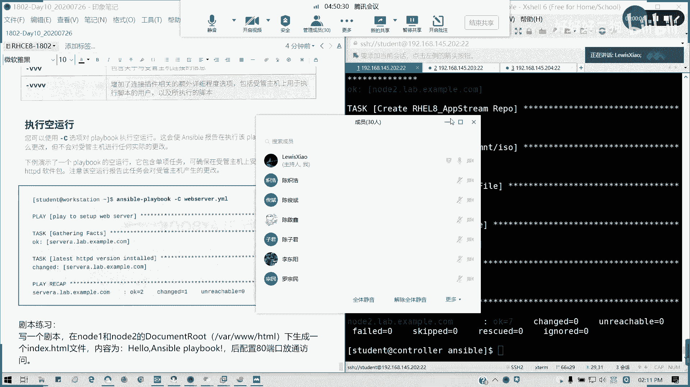

今天少了一波人。

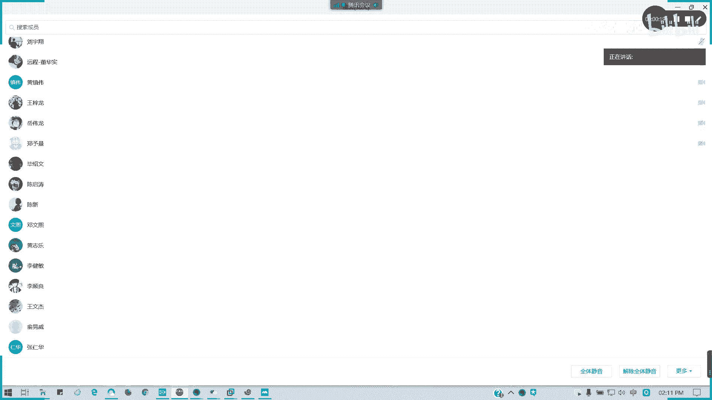

好的，我先解答一下中午人家提的一些问题啊。呃有有一个学员问的问题啊，是不是因为我有密等性特点，所以在执行剧本或命令的时候，即使多次执行也不会有覆盖或者其他问题，它会去判断，保证在受控主机上执行的时候。

仅执行一次不会重复，这是是没错啊，这个问题是对的。因为密等性的话，它是有一个达到目标状态，反正你我达到这个修改，就说达到我这个要要求的时候呢，我是不会再进行第二次修改，懂吗？这是第一个问题，第二个的话。

他有问到，如果剧本有一问题执行和报错啊，它会自动回退吗？或者是保持现在报错状态，已完成就会完成，报错地方不会执行，不过我是想讲讲的就是呃已完成的，它就会完成。当然你前提你可以进行一个语法检测，对吧？

你本身你缺乏它不能保证你的逻辑不出现问题，但是它可以检查你。语法尽量不出错。当是你逻辑出现问题的时候，它会执行正确的部分。错误部分的话，我们在讲任务控制的时候，我们可以把它重新定义。就我们失败。

还有说发生改变条整，我们可以来定义，或者是说我们可以忽略错误强制执行，或者是我们有一个回退的方案都可以来这么做。这是我们后面讲任务控制的时候，我们会讲到。那今天不讲这么多，我们先来看一下啊上午的练习。

那道题我讲一遍。这是关于一个这里啊note一个node2，这个目录我们不需要再创建了。为什么？因为我装HTTPD的时候，大家do目录已经有了，所以我们就不用写这一步。那还，我们开始。哦。

我的名字叫web contentmo。可以看得清楚啊，我要compmemo，然后剧本开始。那。是吧我这里可以写可以不写啊。我这里的话就是那个叫做。建议还是写吧，就整个剧本名字还是写吧。因为写的话。

我们可以就是说。至少我这个剧本的用途我可以知道，对吧，别人可以知道你自己不要说你我们剧本的话，除了你自己看，你要给别人看的，对不对？好，然后我的作用率。我是这里因为我只有两台机，所以的话我就所有对不对？

好，接下来。任务。那后开始我们有几个子任务，对不对？第一个任务。就直接那个。这只有两个任务为已啊，我们我们可以用copy，对吧？用copy参数。用copy算数。用copy参数。好。

我们看看啊copy参数。然后呢，这里我们的copy方我们的模块，然后用content。cont我们自己就写一个helle。Aner包。Pray。Book。换行记得啊。不然的话，你会跟在你后面。快了。

然我们的destination。对吧。然后记得写上我们的类型。刚学过IC news的啊，不要忘了。好，我这里的话我发握低，我要配置了。这里我发言题，我看一下那个看一下李顺良的答案，他不其实我觉得。

不需要。不需要去写那个。什么呢？不需要去写启动f窝，因为默认它是启用的，不需要啊。我们发我第模块。然后呢，首先先放行他的协议，再放行它端口。servvicGDPD。然后呢，还有一个。

我们还有一个叫做permanent。yes是吧。或者处也行。Immediate。State。这条项目要enable的。那我再写一个。这个是。对吧。这写一个放空端口的。我放错1个80干口，对不对？把我的。

这里就不是 service备，是port。然后记PURT。记得是80斜杠TCP为什么它是一个协议来的？你要你要因为我们端口是有分UDP跟TCP的。然后呢，同样permanent跟immediate。

好了。

好的，那我们来看一下S杠playbook。我先我们先养成一个习惯啊，sign tax track。

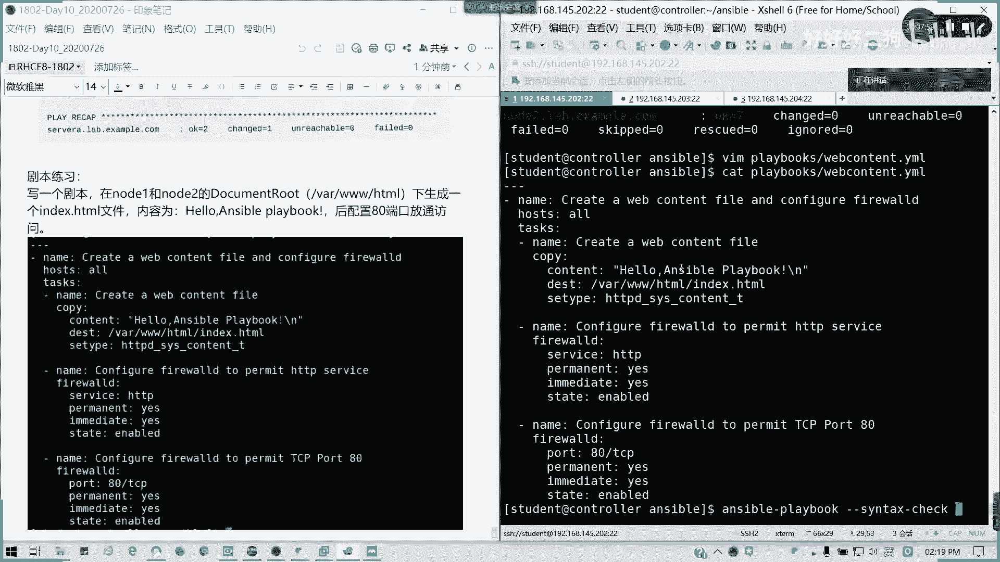

没有问题。

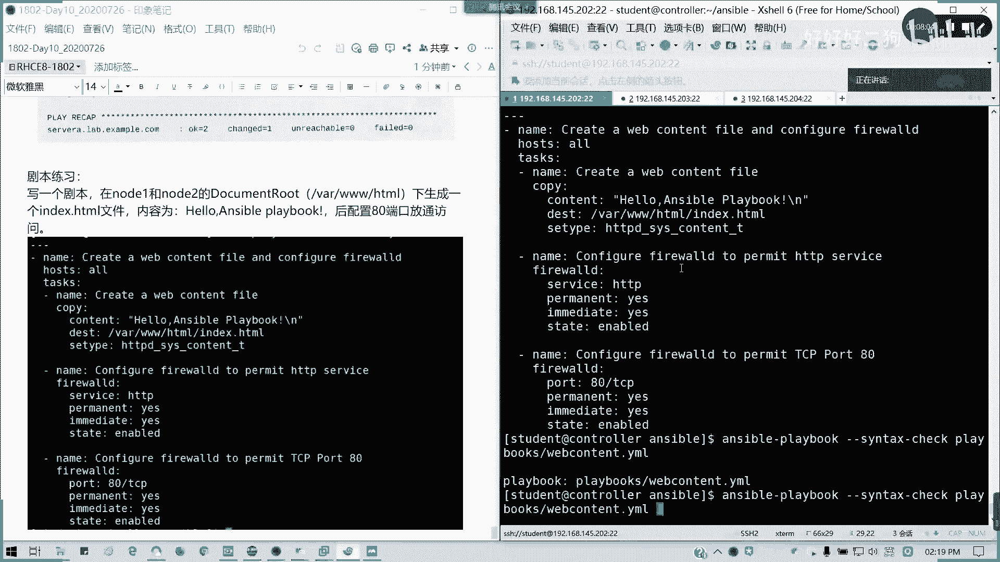

那我刚部一看一下。来执行变。

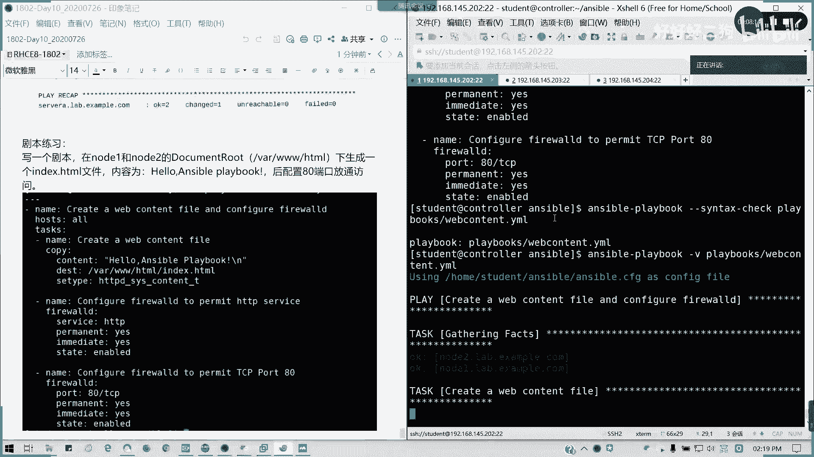

应该是可以的啊。我用杠逼，我就知道我当前是不是用我们的那个自定义的配置文件了。对吗？我不加杠V，你还可能不清楚了。那我我这里反问一下，我在这台机上，我分别Q一下。对吧note一note2都成功。

这题如我明白了，请扣个Y，有问题可以提问。不难啊，对不对？像我们这类的练习难度的话，基本上也就差不多这样。主要是大家要理解啊。

SE type这个参数是指确定我们的指定我们SElinux的上安全上下文类型。我们在我们在那个第八天是不是讲过？有问题吗？没有吧。好的。没问题的话，给大家消话两分钟消话一下，我这边我把笔记啊，我笔记。

我接下来待会儿我们今天会把第四章结束。把，第四章结束啊，管理变量跟事实。我现在我现在练习题我全讲完了啊。就昨天布置的跟今天的我已经全讲完了。只不过我我没有用临时命令，大家转化一下就行了。懂我意思吧？

我现在我要讲变量跟事实，我们下午两个多小时之间，我们就讲这个东西。因为这块昨天我在那个他的一个考点里面，我已经就他的一个知识点里面就有了。稍等一下啊，我把笔记贴过来，然后我们马上开始。

这第四章我们涉及几个内容啊，一个是管理变量。一个是。加密啊S of bo变量加密哎，笔记太长了，所以的话估计它复制不过来啊，等一下啊。我们无论如何我们是在那个讲。每每一种语言的时候就每那种工具的时候。

特别是像我们要么也可以理解成一种语言，对不对？要么可以理解出这种呃一种编程语言，我们可以这么理解。所以凡是一种语言的话，我们都会涉及到一个变量。对吧。变量如何去引用？他这里的话有很多种啊。

我我把笔记贴过来，然后立即发送啊。切完之后立即发给大家。应该是第四部分的，今天的第四部分内容有点卡，因为它那个涉及的图文有点多哈。我看一下大家有没有问题先。哎，张仁华，我看一下。

Chage你这个哦你没有装HTTPD服务。没装。伪装HTTPD就这样的了。但是文件不存在啊。对吧。没妆服务嘛。好的，那我们接下来我们把笔记贴过来。还要转圈圈啊，稍等一下。好了，应该是可以了。我看一下。

这里应该是第四部分的RH294。CH04今天就讲完第四章就可以了。好，我现在先把笔记发给大家。那有笔记参考，大家会学的更好一点。6兆多哈。6兆多的笔记。这笔记其实如果这积积累起来都可以出书的。

但是记得啊不要上传啊。不要不要随便丢到网盘去啊，因为这个是有版权的。那好，我们开始第四章管理变量和事实。管理变量事实呢，首先我们来讲变量啊，S5变量的一个简介。S5呢是支持利用变量来存储我们的数值啊。

我们值的话，包括我们一些命名啊，或者是我们密码等等，这些都可以啊。周六日都没空，什么鬼？嗯。王建凯怎么了？

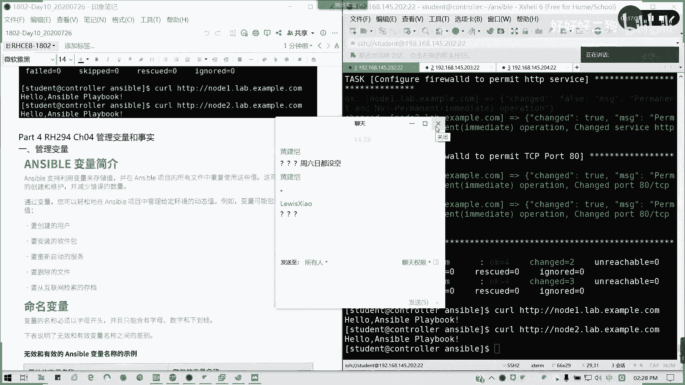

好吧，发错了啊，有什么事情在群里面说啊，然后呢。S伯变量呢，我可以通过存储变量之后呢，我可以在所有文件里面重复利用这些值，我们可以简用它来简化对吧？简化创这些数目项目的创建维护，并且减少错误的数量。

我们可以通过变量，可以轻松的在ensible项目里面可以管理这些给定环境的动态值变量呢可以包含以下的。比如说我要创建哪些用户，我是不是可以用变量的存储。呃，我要安装软件包，可不可以？

还有我们的需要去布置部署的一些服务，对吧？要删除哪些文件，我是不是可以列个列表？还有呢我们这些存档对吧？都可以，对吧？然后命名呢。其实跟摄友差不多。只针支持字母数字跟下划线啊。

这里表这里的表我们就看到了有哪些是无效变量，哪些是有效变量。像第一个。空格空格它会识别成两个变量。好吗？空，如果你这个变量里面带一个空格的话，它会识别成两个变量。所以呢我们加个下划线就可以了。

这是第一个啊。第二个的话。你不能用点。对吧。点的话在这在S我们的里面也有特殊含义，就是它的下一期下它的那个下一个层级的值，懂我意思吗？第3个。机不能竖字开头。而且带了空格，对不对？必须以字母开头啊。

而且下划线开头也不行。我们sha要变量是可以下划线开头，但在enssible文文件里面定义的变量不能以下划线开头。啊，第四个的话，你有一个兜日，对吧？美元符号特殊符号也不支持。定义变量。

我们关于变量定义的位置啊，我们通常有分为啊全局范围内生效，全局变量从命令含务S5设置配置的一些变量。第二个在剧本内。也就是我剧本内有效，对吧？第三个，变量文件本质也是剧本类调用，有效范围也是剧本类。

那我们看一看。首先我们来看一看如何引用变量文件。我这里新建一个，我这里就一个创建用户作为例子啊，用user模块创建用户作为例子，我们来来变再编一个变量文件叫wifi。然后我变量名字呢。

user name。太下心因所一是吧？然后我来写一个写一个剧本啊，不能说脚本啊，这里都是剧本play book。Test4。点下吗。抬头，然后。Tax variable file。然后呢。

host我座用于的所有主机一只有两台。然后这里我用vas filesvas files这个列我们我们的选项值呢就带我们。我们可以在后面直接写，或如果你有列表的话，我可以用列表形式。声明我要附加的。

我要在剧本内生效的一个变量文件，对吧？写学对路径啊。Wfi啊。对不对？然后好了，我接下来写任务了。Task。我现在的这个任务能干嘛呢？Create。Use wire or variable file。

通过一个变量文件，我来创建用户。然后呢，右是。有我们用这个模块，对不对？我们模块要什么呢？是不是要用户名啊？对吧又没有怎么引用呢？这里引用是要有讲究的哈，两个括号中间留空格就变量名中留空格，留其空格。

懂了吗？两个空，我们要引用这个变量值的话。你用变量里面值，记得用引号括起来，两个大括号花括号括起来，中间左右空格留变量名。对吧我们的剧本是这样子的，我来检查一下语法。没有哎，我已经在直接运行了。

这是谁一情？他这里是劝取成功，对不对？但我这里看不到结果啊，我这我又我我那个通常我们为了看结果，我们加杠V吧。

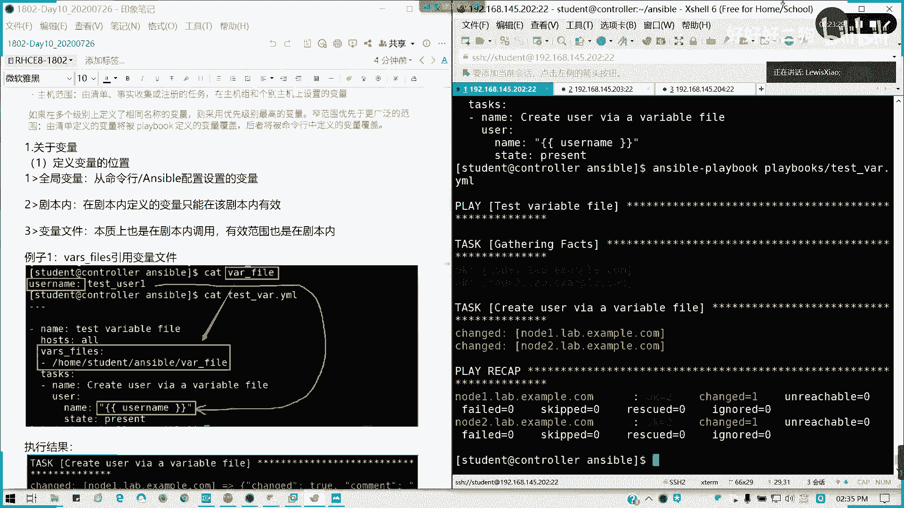

这剧的剧本是没错的。我们家杠D会看的比较清楚一点。对吧他会创在两台机上创建test user一的用户。那UID说配不同。因为我刚才我去进了一个tus用户的，在那个noode一上面。可以明白我的意思吗？

明白啦，我这变量是带外部带一个变量文件，然后我通过引用它呃引用它的一个值，对吧？这里。

明白吗？这例子如果明白的话，请扣F上早上扣到一哈，请扣F。这是带变量文件的做法。有问题提问。呃，对，签到的话记得待会补一下啊。大家可以对照笔记做一下实验啊，自己敲过的才是才是自己掌握的东西。

不要我看不要看我讲。除了我们变量文件之后，我们也可以在清单文件里面在我们资产清单里面定义，在资产清单里面定义注意，我们不能用冒号了，用冒号会报错，又等于。好吧，又等于我们来开始看一下test one2。

点下も。哎，我这个文件这文件好像是缺了是吧？我看一下。我要t82。1某的话。这里好像我缺了一个文件了，没事，我看一下。呃。

同样是一同样是那个文件啊。同样现在我就我写一遍，然后我我补个截图吧。开 one，然后play book直接改一下就可以了。对我需要缺要了个截图。我就把这行去掉。其他没有变。

那我这里我改成service问题也不大啊。

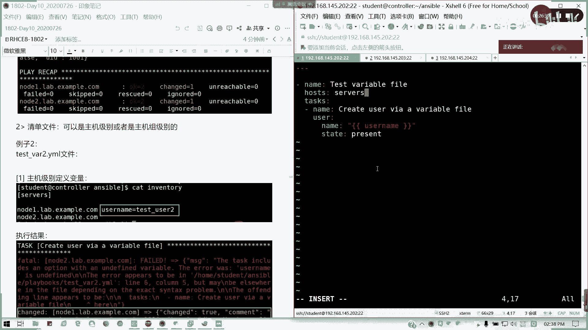

我们就用这个剧本来。笔记会更新的啊，这个这个这个只只是给大家参考啊。好，我们用这个还是用这个剧本，只过我把。呃，这个我把措释改一改啊，这这不用了。

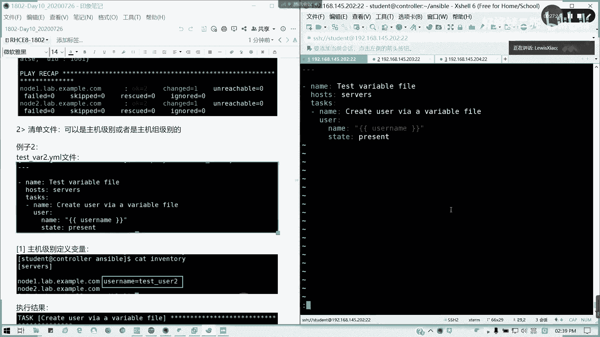

初示不改了。好，我们要看一下怎么在资产清单里面定义。

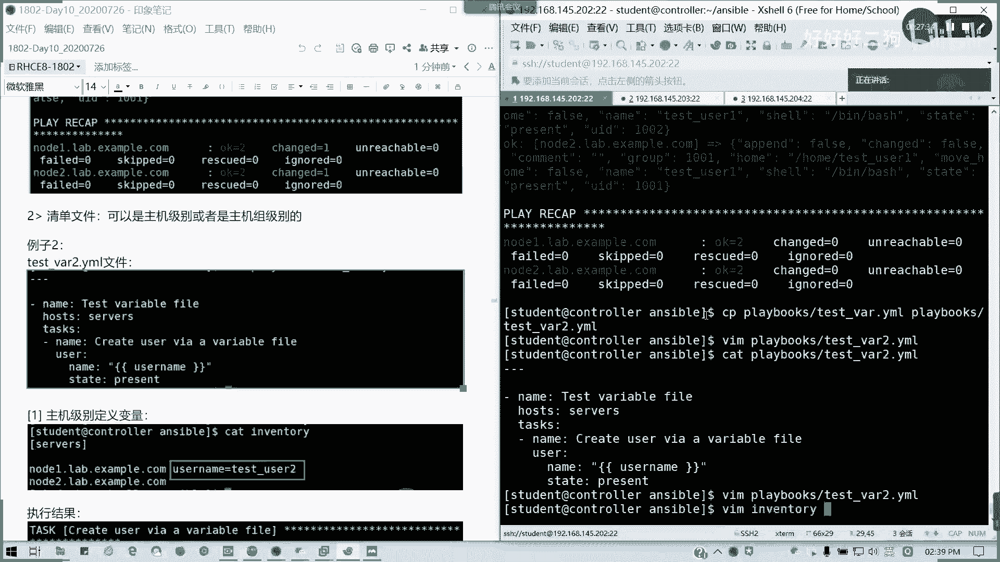

直接变成inventory，我们service对不对？我们可以在主机级别在户面跟一个变量。我看一下，如果我用这种写法会会出现什么结果啊，你自己看一看啊。

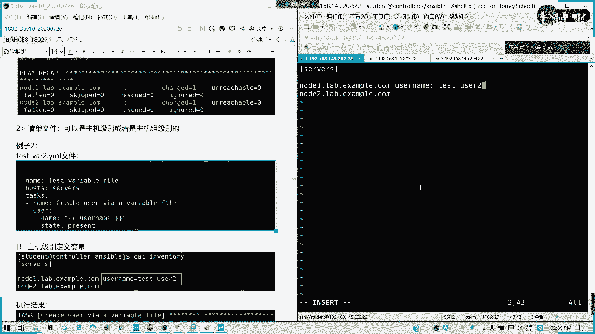

你看有问题的吧。报错对不对？他不知道他是那个jason还是央某文件，对吧？这种写法。他必须要那个。在这里啊，inventory它这种如果要赋予变量，它必须要key等于value这种用法才是可以的。

我们单独一个变量文件是冒号，但是到清单里面不不允许这么做。这剧本没变，我们回到清单。所以这里请改成。这。在清单里面啊，懂我意思吗？

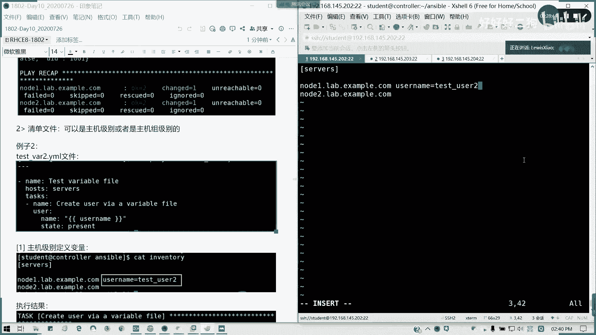

好。那我们现在。我们的清单是这样子的。就是我在note一上面后面加了一个变量，一个us name。

那我们现在来运行一下剧本。

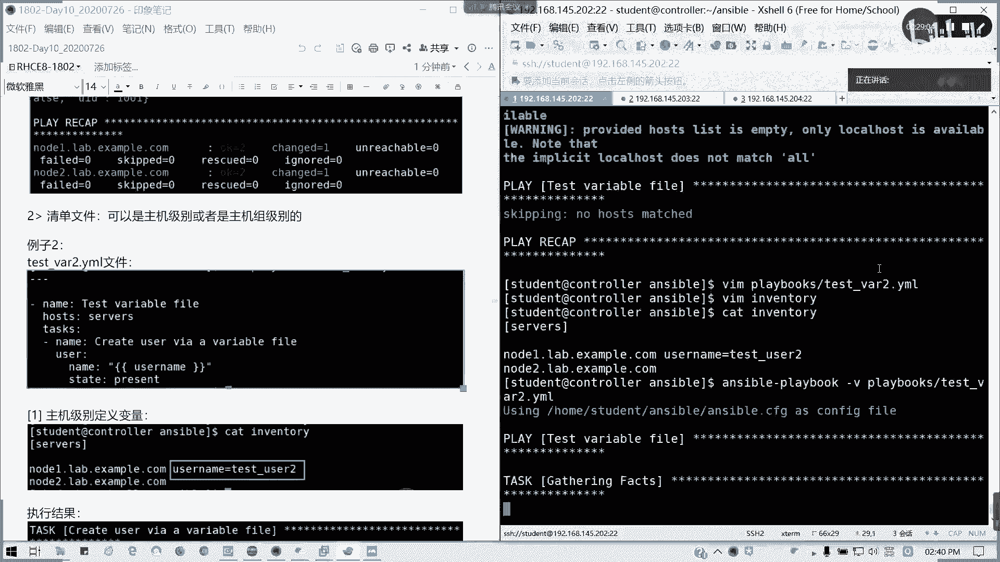

我都这样的干兵啊，给大家看清楚了我们都在干嘛。你看note2，它就fill了。但note一成功了。对吧我在note一上创建了一个test user2。因为note2的话，它没有定义变量，懂我意思吗？

这个就是在主机的一个级别，主机级别就是我们某一个条目里面定义变量的这是第一种。能明白吗？能明白的打一个区啊，字母区。是吧。记住不能用冒号空格啊，就冒号空格在我们清单里面只能用等于啊T等于value。

有问有疑问尽管提。讲完了那个。讲完了主机级别，那我们可以主机组的级别。主机组级别的话就在。组里面定义啊。我们把这行后面加的变量删掉。我们这里是不是有个service的主机组。

那我们后面可以用service。冒号VARS代表它的主机主机为变量。然后我这里加一个us色name。等于。ts下划线043。

好，我想问大家会出现什么结果？可以在群里面回答一下我。我执行Sibleplaybook杠V，然后play books里面tva点压某。会出现什么结果呢？我把这个变量我再打出来啊。我如果这样。

我再执行这个剧本会出现什么结果？在清よ。我在后面加了一个service冒号va，然后呢我再加了一个变量。看看。张荣华有提个疑问啊，你看看。两台机我都创建一个test user3的用户主机组级别的懂吗？

记得写法是service，就是我们的主，然后冒号VARS。然后下面你再写。能明白吗？明白打个H。非本非得把26个字母用完啊。Oh。这是主机主级别的。那我还可以在特定的一个。用户跟摸类啊。

同样还是这个文件没有变。还是这个目还是这个没有变啊，剧本我不变哈。首先我们有几个特殊目录，这几个特殊目录不是它系统本身不存在的。但是我们可以建立啊，我们先把。这些我们清掉对吧？还原到默认资产清单。

然后呢，我们可以。MKDRgroupva目录。然后我。VIMgroupva目录里面的一个工作目录，下面啊，我后面再加一个组名。对吧以主名命名的一个文件。那我这里呢我写一个变量。

这是一个特定的啊特定的文件目录了。us此在。

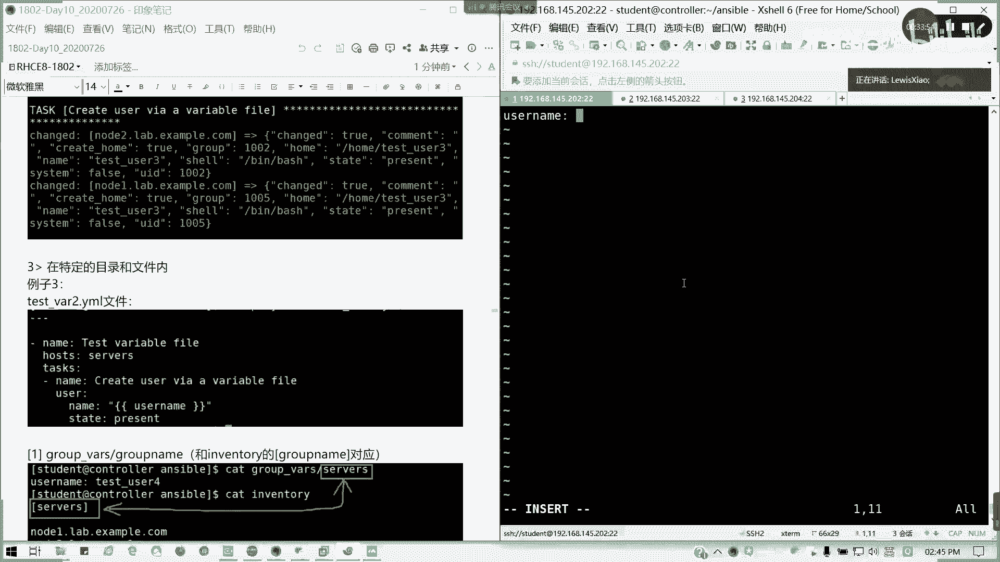

T user4。好。出现什么结果？我如果还是跑那个剧本。嗯。还有呢没了。是不是类似于我们刚才的那种做法？只不过他这也是是一个特殊的一个变目录跟变量文件。懂吗？这如果明白了，请打个I啊，请打字母I。

这个的话就刚跟刚才的server显buss是一样的。当然我们还有啊。我先把这个删了啊。或者不影响我们的实验。把这变量删了，然后呢，host我可以用hosva。然后呢，我直接面建一个跟主机名字一样的文件。

然后然后我这里username。Test user W。

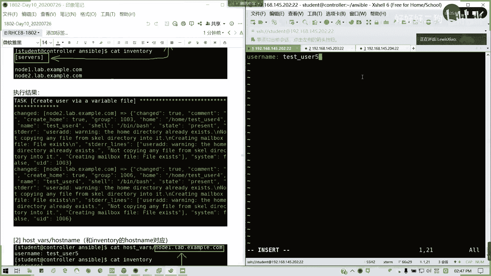

其实运行结果呢就跟我们刚才在是在那个主机清单里面，收款主机清单里面是吧？后面是下一个变量的结果是一模一样的。能明白吗？这里明白的话，请打个J啊。因为我们n2没有负变量，没有负值，所以的话他会报错。

就就剩那么两三个人打追吗？现人都是不是有点游离在外了？然后还有这这两个是一个特殊的文件目录啊，特定的文件目录。我现在这两个目录我都不要了啊。我们就剩这么多文件，剩这么多就行了。那还有一种呢，直接。

answerible我直接执行anl play book，我带杠一。我直接用export参数，我export选项我带出变量，可不可以？同样也可以的，全局的这种就全定义就就全局定义均义变量。

然后我在这个剧本里面生效，对不对？也是可以的。如果你带杠B的话，它会显示具体的结果的，懂吗？比如说我再建一个t user7。我前面杠B哈也不要就不要写杠B一了哈，所以不能不能合并在一块的。

比如说我对着这个t user机，你们看的更更明显一点。我就整个生效吧。定义在整个剧本内。懂吧。这个明白的话，请打个K。所以变量的一个位置小结啊位置小结。辩位是小杰。你们可以在剧本内进行定义。

可以在文件里面进行定义。对吧。可以通过资产清单来进行定义。几种定义法是吧？可以通过anil play book杠export杠1来进行定义。然后变量取值就是记得双括号啊，然后做括号。

然后空格前后空格不要那样。对不对？然后呢，稍微休息10分钟，我们讲辩论类型，这给大家先消化一下，可以吧？

