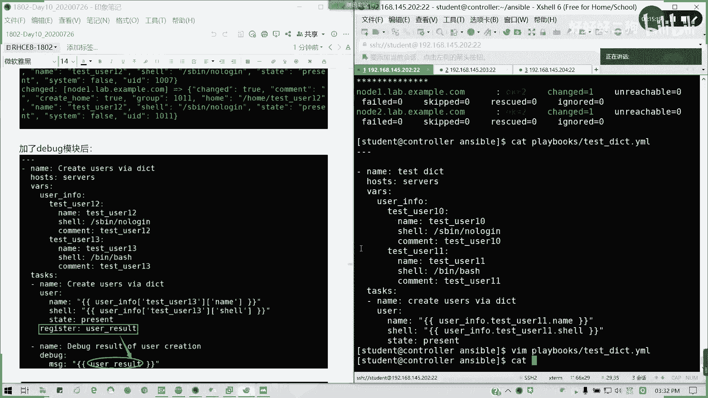

# Redhat红帽 RHCE8.0认证体系课程 - P61：61_Video_Day10_Ch04a_管理变量 - 好好好二狗 - BV1M3411k77W

29个人啊。好的，变量类型我们总结出几个，一个是常规型变量。就我们刚才的演示的例子。对不对？就是呢我们的常规的变量跟取值。K等于valueue或key冒号vole。对吧懂吧？但是这个你要看场合。

就刚才说的资产清单，你就不能用那个冒号会报错，懂吧？要等于。然后呢，接下来我们讲数组数组的话，同只限于我们定义变量，我们这个些变量是同一种类型。比如说我的用户名一批下来，我的软件包是吧？

是不是同一种类型啊，那这种我们就可以用数组来定义，我们直接看例子。

好吧。看例子，我们来写一个剧本。X83。作用于在我们servs这组其实也就所有了，懂吧？然后我们的这里用vas来定义我们的数组变量啊，vas来定义我们的数组变量。然后接下来我们要定义我们的数组名。

我们这里数组名叫user name啊，用户名。然后呢，我这里我可以用列表的形式来输输出我们数组名所有的值。对吧看有有有有没有看到我们的分层级的结构，有没有？

不我这里啊tex user01也就有多变量的形式的话，我们就这么写。刚才有人问到啊，多变量的形式，我们就这么写tex user0，我们就假设创建4个用户。但是我们这里呢不能全部创建啊，因为这个数组话。

我们调用或者调一个，你要多重调用，你要你你要用写多个引用值。那我们来看一看啊，我们的任务tasks。依然是创建用户。然后呢，有啥。这里呢。那。汝好。对吧这里的话可以优侧那我电用它的数组名。

对吧我列表名我们可以理解为列表名，然后我要调某一个值，用括号。懂我意思吗？不能全部啊，如果我全部的话会出什么结果，我给你看一下啊。我这也可以说不能用去调全部来。我直接先fint track。

看起来好像没什么问题啊。

来。好了出错了。他是会报告诉你说非依法的户名，因为非用户名只能有一个。你不能全部来，懂我意思吧？不能全调用，那么怎么办呢？他比说他说可能要转哈。type list它可以转成那种123是这样子。

但是这里又非to有错误了，那我们只能。这个剧本里面我们只能掉一个，那就掉怎么调呢？它这里数组是从零开始的。哦。所以我调第一个其实是我们创建了一个叫做test user0。二的一个用户。

可以看看啊，对吧？对吧。数组这里是从零开始算的啊。从零开始算的，所以的话我们调用的话是调用t02的一个值，懂我意思吧？

对啊，调某个值没有发货过起来。只能调用一个值啊，不能全部调用。这个是我们有说过的啊。我们刚才说过了，全部调用的话，你要看场合，有些参数是可以全部调用的，在这里不行。好，这个如果明白的话，请打字我L。

这是数组啊，同一种类型的，用数组不同类型的用字典。我们查字典的时候，是不是它有各种注解啊，解各种解释含义123，对吧？而且它都是不同类型的，有比如说我们一个单词有名词，有动词。

有什么形容词等等这些就不同条目，对不对？那其实我们这里也是啊，当我们变量的信息具备多种不同的元素的时候，我们采用字典来，我们比如说我们的太我们的用户的信息，是不是我们可以包含它的名字，它的sha有类型。

它的UID它的注解对吧？那我们现在来写一个taskmo。同样啊。Nap test。然后呢，我们作用的主机作我的受款主机是service这个组。好。同样我们定一个数组变量。然后做一个变量啊，一个主变量。

然后我们这里呢是采用这字典啊。变量组名叫user in four下划线啊。然后呢，我这里呢。我在定义层叫做。tesus10。对吧t10就它的一个字典名字，然后字典里面含什么内容呢？首先名称。Test。

U色10，然后它的sve类型。S speak。no no知道吧，就不可登录啊。不可加互登录common。tsus1。好，我再定义第二个字点。Tfus11。是吧同样那。看下划线user11sha类型。是。

Beba士。coma test use11。好，我现我这定义完了，我来写任务了。Task。那。Create what the task。 that was create users via。

dictionary啊我们 dictionary是不字点啊。然后呢，user我们有user模块，然后呢，是不是我们要创建几个啊一个主要我们关心的主要是一个。用户名跟登录类型，对不对？好。那。怎么引用？

翻过后。引起来空格是吧？user in，我们先从变量组名开始。然后用括号是吧，有两种写法。用括号，然后呢。带引号引起来引括起来叫tsus10是吧，到字点了。然后我在下一次层级。方块引号引起来，括起来。

我引到他的念懂我意思吗？So。

对吧。同样。有说下限用付字，然后从变从变量说明。到4典名。再到。需要这里空格，然后state。Present。给了。我们我们就这么写啊，然后我们来执行一遍。

是不是我们已经创建了我们的。两台机器是不是我们创建的test user时的任务？对吧。这个就是我们字典的一个用法。但我们还有一种另外一种写法，我可以告诉大家，先告诉大家。就我们后面会提到。可以这样。

如果不涉及到你的变量名含有点的情况下。我可以这样子。用点来分出上下体。如果存在，比如说像主完组均有时函点的话，我们就用括号。那括号这样子，我看一看行不行啊。比如说我改成叫t11吧，因为我这里有两个用户。

对不对？两个字典。

我再执行一遍。同样也可以，对不对？两种写法。

也可以，对吗？他这里的点是分层级的啊。

就按他是一个层次分级的另一种写法。

明白吗？明白的话，请打字母M。

这知道吧？同样的效果啊。

那我们呢。还有一个叫做register变量，也就是我们的结果，我们的给个转存变量。register变量呢可以将一个任务的输出结果定义到一个变量里面，方便我们后续任务直接进行引用。

我们看一下register怎么用，我们先把这个剧本改一下。因为我刚才我创建两个用户的，我把字典对吧？我把字典的调的那个里面的。调每每一条我们改一改，就us色1213为了我突出效果啊。

我把这里改一改可以吗？那这里我就改成12吧。然后我这里的话，我加道迪bu模式前我就应该应该都知道了，对吧？那我这迪bu模模式之后呢，我可以。

在。这里我们把做完的项目，我们可以用register。它显示其实我们可以用register这个变量，注意它是跟我们的task这个项我们的任务项目是同一个层级啊。

register里面us a result啊，我们转存到这里，然后呢，我们后面再加一个。

第bu个。Without。就是我们可以从输出结果里面，我们再获取一些有必有业务的信息，懂我意思吗？然后我这里用底bu模块，底bu模块其实就是输出，可可以将屏幕调试输出啊。MSG信息。

然后我再引用一下user result。

好，剧本就到这里结束。

我这个剧本都调调整一下。对吧我就加了下面这一块，还有一个register这一行，那么看看执行的结果。

看到没有？我们创建了一个用户之外呢，他也把。就是说我们服我们受管主机返回来的一个结果，就是说一个信息写到了register的变量，然后我们进行输出。明白我意思吗？然后是不是里面有一些条目啊。对吧。

比如说我们要输出。

结引用结果部分元数，我要输出他的UID。对吧我要输出我刚才创建用户的UID号。

我这里可以用点UID可以吧？或是用括号。多都可以。多个可以啊，UID嘛，你就你就MSG多个吧。对吧我这里我这里用一个。

然后我再我再我再说一下出来。

是不是？这里我们不用杠V啊不用杠V，我们也可以看到结果。因为杠V的话，只是我我用了对比懂吗？如果不加杠V的话，他是不是把他的结果说出出来了？

懂吗？MS这套调用的这个参，我们输出输出结果里面一个函数参数的一个值。

懂了吧？然我们也可以迭代引用。比如输错UID之后，我还再输，我还再弄一遍。

这个结果是可以迭代的，我再转存一遍register。再转件传件传到一个需要伪造。我们再讲一个变量，再新增一个任务。同样用debang命令debang的模块，然后MSG我的一个参数显示信息一个参数。

就迭代一用。对，传下一个吧，一级传一级嘛，你看。我这一期我出出玩，我再传到下一棋来。对吧。刚才我创建完是不是他的UID是10012跟1009，然后我再传到下一集来。知道吗？可以吧可以吧。他就输这个信息。

确实是forse啊，因为它不会对它只是输入信息，不会对你的当前的配置做出任何的改变。懂我意思吗？所以这个就是register的一个用途。我们有时候真的在结果啊。

在我们命我们的剧本的执行结果里面要调用某一份信某一部分信息的话，我们就可以用register的变量，然后一级一级传下来。

如果这个明白的话。比如说我可以调用啊，我再调用一个元素，就是它是否已经发生改变。对吧劝制的。我又可以引用它的一一部分结果。

对吧。

看到没有？那好，这一部分讲完有问题请提问，没问题，请打字母N单门吧。这就是我们4个。变量一个是。常规系。字典啊那个数组型字典型，还有register型。register就是我们转存，结果转存变量学。

明白啊。好的。

这个如果明白的话，我们停一下录屏，然后讲S。

