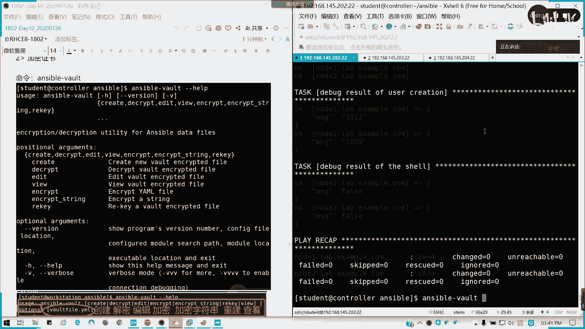

# Redhat红帽 RHCE8.0认证体系课程 - P62：62_Video_Day10_Ch04b_AnsibleVault - 好好好二狗 - BV1M3411k77W

好的，我们来讲answer what。SO box我们作用的类型啊。SOport我们看一下啊，我们作用是加密敏感数据密码等信息。通常情况下我们定义在变量里面。这用情景就是加密变量文件或者是证书啊。

但证书这里不太讲，我们主要讲那个。

我们看一下SOva的一个说明。

好的。马上看看啊。是不是列出很多的用法，通常不会。对吧不会就help对吧？不会就help。然后呢。男人很管用，man menu对不对？有问题找男人，对不对？或者是是男人就man一下，我们也可以这么讲。

懂我意思吧？那主要我们看一下。

s box的用法。

它简化版的usage啊，看到没有？它下面的一些参数。啊。创建解密。编辑。查看可能我们2。82。9不太一样啊，其实差不多了，只是选项掉了一下而已。还有我们的。inc加密就是已存在文件加密。我原为屏幕关了。

然后呢。还有加密字符串重建。对不对？这几个那我们讲一下。讲一下其中一些东西啊。哎，这里的话好像我这个图又丢掉了。没事啊，我把它铺补一下。

我现在一边一边上课，我一边解答人家气的问题啊哎。对吧这种服务的真难的，好吧。我们来看一看。and of forgot我要create second ya么。

我就创建1个SEC。

点完有没有？那我此时要输入我们的加密密码，然后再确认一遍。

对吧。

再确认一遍，我这里我补个截图啊，因为这个截图掉了。

好回车它会调用我们的1个VIM的编辑器。

对吧。我们这里定一个变量，好吧。同样是优色贷ts user势。右索20，角质纹质22。好，宝存它是临时调用我们的VM编程器，然后输入加面的那种，O我意思吧？

好。然后我们来我们现在我加密过那种，看一下是不是一对加密过的用S保1。1。

是吧。加密的内容你看不了的。那我们怎么看呢？用answible。What down what are will。赛克电压帽。sck联对不对？然后输入我们的密码。出来了。懂我意思吧？然后呢，我们输我们。

要写加密文件，写这个加密过的SOvol之后呢，这个我们在练习在包括我们的以后考试会考的啊，然后呢。如何调用？我剧本我写一个。🎼文名文件名叫tva。电押吗。对吧。谁个剧本啊。Qu8。

Users via what。Host。サーバス。对吧。然后呢，我调用我通过引用的外部文件可以吗？Whats fast。home student里面。

ible目录里面的一个seck点M刚才我们创建的一个加密文件。然后我们的任务是什么呢？ね。create users，对不对？然后同样的，我们就类似我们的刚才创建用户的一个剧版。我就创建我就不用其他了。

我就简简单单写一个。有此耐就可以了，对不对？State。对在其实你这个写的七八九十册，应该你自己都会写了，对不对？不就不用看了，自己都会写了。保存退出。那好。

我现在调用他的文件，我来看一看能不能执行。Error。attempting to de快 but no secret no no secret，我找不到这个vot的那个密码。对吧。我来看一看啊。

那怎么办呢？有两种方法，一种。是叫ask for pass这种吧，这种有这种这种方法。呃，asible playbook我们调用啊，这种是老版本里面使用的一个方法，叫做ask vote。

但现在暂时保留啊。tvat点M，然后他会问你这个wt密码。你看剧本执行了。对吧这是一种。但是我们建议用第二种方法，第二种版本方法是我们现在一直用的。这种方法呢在2。5以前的版本是可以的。

但现它我我我不确保说假如我们的S5出了3。0以后，那这个方法会不会被去掉？我们用的方法叫做whatt IDD。然 at pop调出。输入过密码的一个提示符，懂吗？对吧volt passport一样的。

哦，如果是出错，会这样子啊。因为刚才我们已经发生了变更改，所以的话就他这里的话就是1个OK啊，不是ch的，懂吧。方法3。我直接写一个文件放在我们的一个就直接写一个放纵我们用名密密码的一个文件。

比如说我就写一个pass点妖么。我就写一个字符上叫red hat，对吧？

然后呢。S果杠play book，我直接调用我们密码的文件。但字纯文本的啊，必须要全文本的。what password file等于pas点 ya某，我是用相对路径，nplay book。

然后这样就我就不用输入密码了。但是这个文件呢你建议加一些密啊，比如说我隐藏掉或者怎么样，对吧？这种也可以。三种方法都提供给大家，如果明白的话，请打O。然后接下来我们讲其他用法。三种用三种方法都可以。

但这个文件你要加强安全措施。我隐藏隐藏啊或其他的对吧？你这个你是相当于你把密码铭文写在里面了。这个应该是可以的。比如说你隐藏嘛，你前面加个点嘛，最简单的。有问题可以提问啊。然后接下来我们讲一下其他用法。

解密。好，我们看一下。我们来看一下啊，解密。哎，我刚才帮就是说这个问题还是很多的。我们看一下如何解密describe。Describe。我把刚才加密文件解密掉。Sck。点压宝。好。

输入我们刚才的密码是吧？dequest successfulces。那我们cat。数是出来了。对吧然后我可以把它重新加密反义词enscribe。对吧我重新加密了。懂吗？

接下来我们可以rekey，我们把密码更改掉，可以吗？

你们看一下rickki的话，比如说我改成。

啊。

Rhead Bali。Whereha。巴黎。

哦，不对，他这里的话他是要先输入当前的密码。然后我再输入新的密码。再次确认。🎼可以了，对吧？你把密码改了，然后我要编辑已传的加密文件怎么办呢？sible what adding不能用直接用VI嘛。

你用VIM试一下。

你怎么编辑嘛？

Added。s你有冇。

注密は。我们刚才更更新过了。对吧比如说我改成21。🎼保存退出。

就可以了。通常呢我们通过使我们使用加密文件来保持变量密码的敏感数据呢，最好也是最简单的，就是用隐藏文件。比如说我们的那个。是吧赛克连某。就前面加个点吧。我们改一下，前面这个点不就隐藏文件了吗？

然后剧本里面我们再改一下。

这里。这个点虽然看起来也不太安全啊。

懂意思啊？如果这里懂的话，请打个P。

好，我们这一块讲到这儿啊，S boys我们讲完了，那休息1010到10分钟，我们待会儿讲最后一节。

管理事实，也就是我们sible主机传回的信息。

