# Redhat红帽 RHCE8.0认证体系课程：P64：Day11_Day09Day10回顾01

在本节课中，我们将回顾Ansible自动化运维工具的核心概念、安装配置、资产清单管理以及配置文件结构。通过本次回顾，旨在帮助初学者巩固前两天的学习内容，为后续的综合练习和考试打下坚实基础。

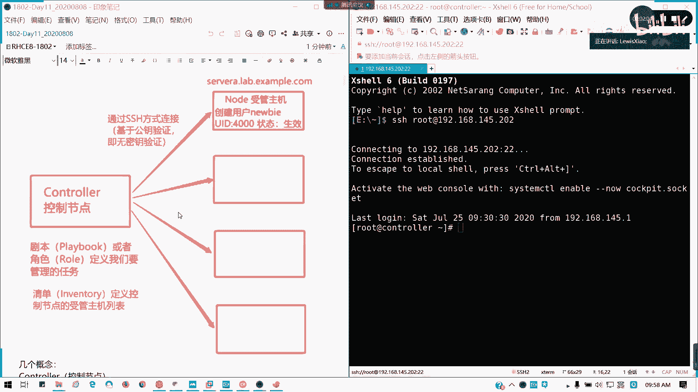

## 🔍 Ansible核心概念回顾

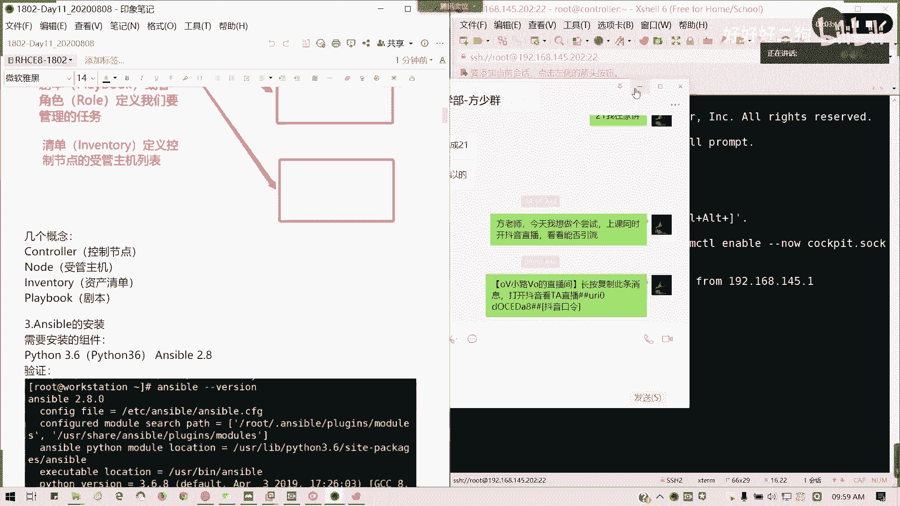

上一节我们介绍了课程背景，本节中我们来看看Ansible是什么以及它的核心架构。

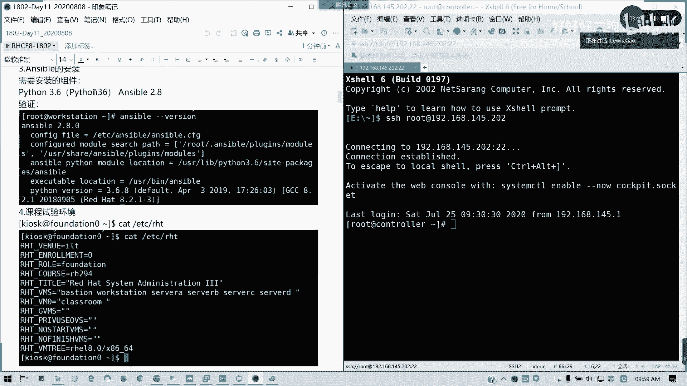

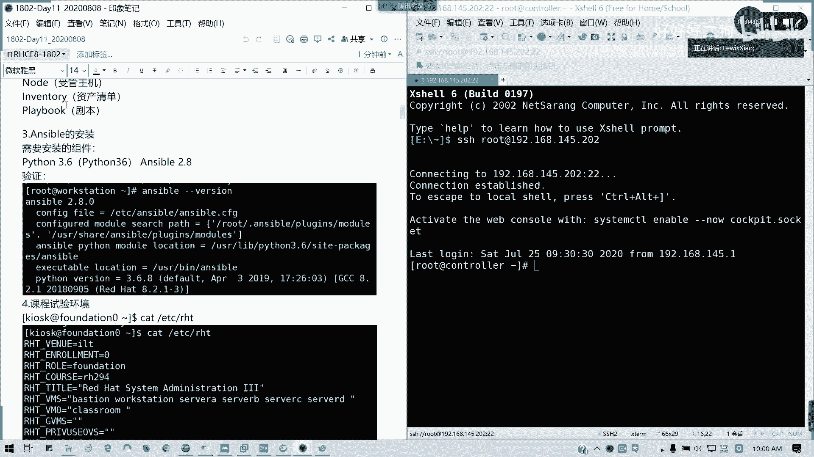

Ansible是一个Linux自动化运维工具。它通过一个控制节点（指挥部）向多台受管主机（士兵）发号施令。控制节点与受管主机之间通过SSH无密钥连接建立信任关系。建立信任后，控制节点可以无需验证地向一台或多台主机执行任务。

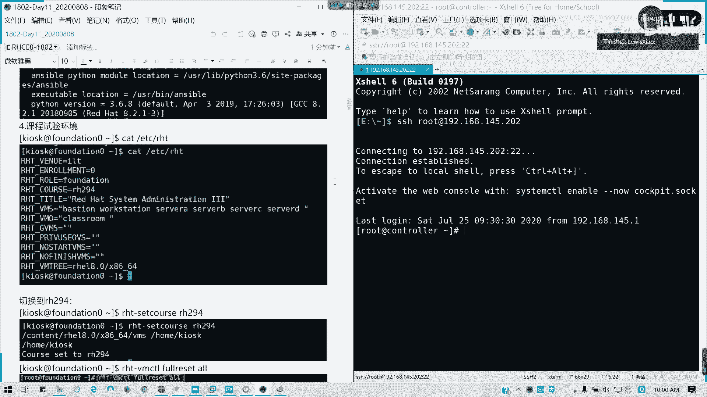

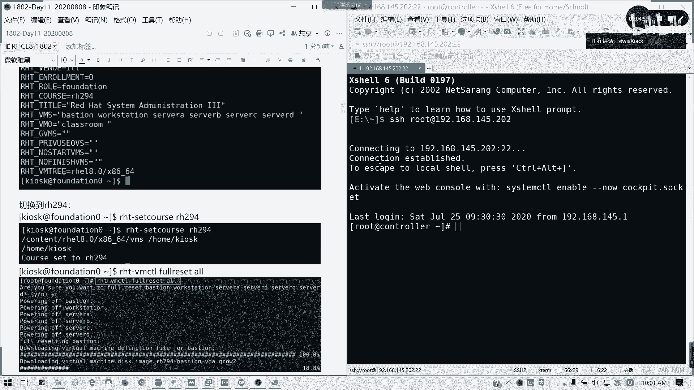

以下是Ansible架构中的几个核心组件：
*   **控制节点**：任务的发起方和指令的提供方。
*   **受管主机**：客户端或被控端，接收并执行来自控制节点的指令。
*   **资产清单**：受管主机的列表。
*   **剧本**：一系列需要执行的任务或命令的集合。

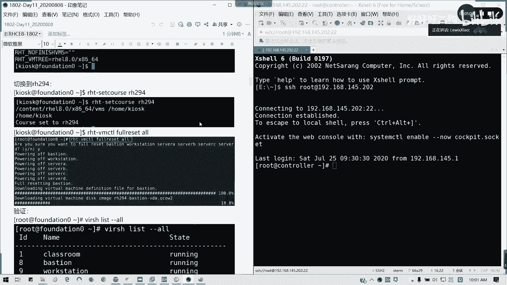

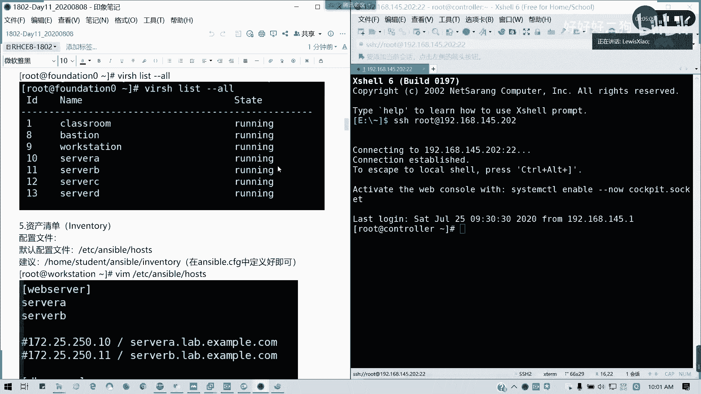

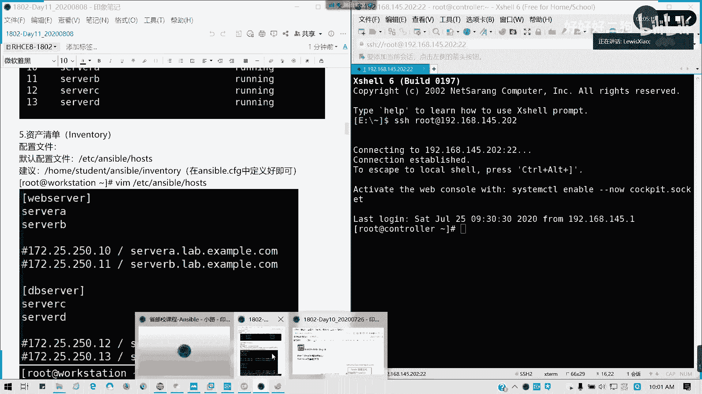

## ⚙️ Ansible安装与环境配置

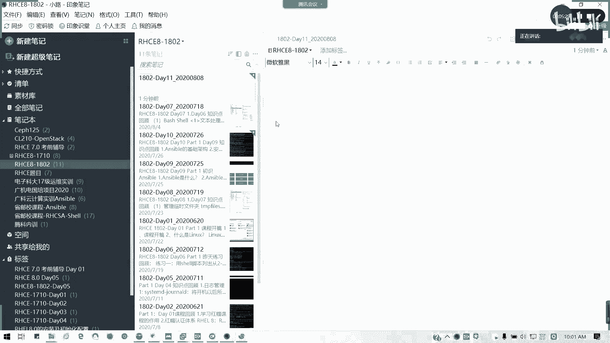

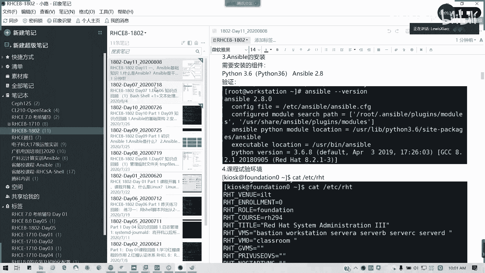

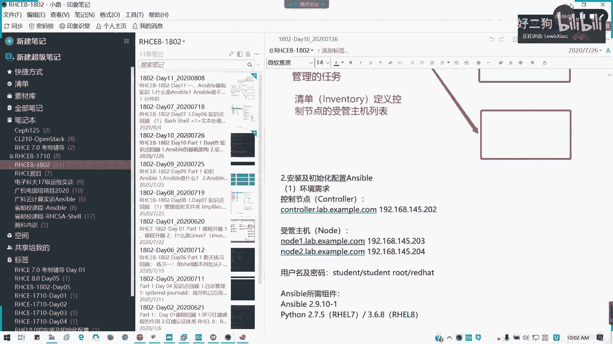

了解了核心概念后，我们来看看如何安装和配置Ansible环境。

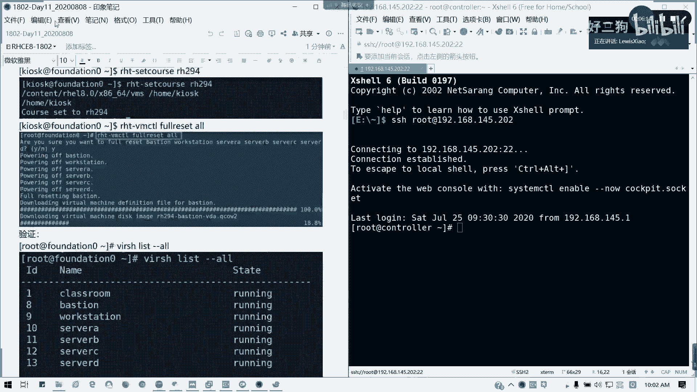

在Red Hat Enterprise Linux 8上安装Ansible，首先需要配置好YUM源，并启用EPEL（Extra Packages for Enterprise Linux）仓库以获取额外的安装包。

课程实验环境通常用于考前辅导或综合练习。目前，我们建议使用自己搭建的环境进行学习，这有助于更深入地理解安装和配置过程，扩大知识的应用范围。

## 📋 初始化配置与资产清单

安装完成后，我们需要进行初始化配置，其中最关键的一步是定义资产清单。

Ansible的默认配置文件位于`/etc/ansible/ansible.cfg`。但在实际考试或练习中，我们通常会在普通用户的工作目录下创建自定义的配置文件，以实现以项目为单位的独立配置。

资产清单文件（通常命名为`inventory`）定义了受管主机。以下是定义资产清单的几种方式：
*   **不分组的单条记录**：直接写入域名或IP地址。注意，域名和IP地址在清单中会被视为两条不同的记录。使用域名时，请确保已做好DNS解析或在`/etc/hosts`文件中配置好主机名映射。
*   **分组记录**：将主机按功能分组，例如将`node1`放入`[webservers]`组，`node2`放入`[dbservers]`组。
*   **范围指定**：可以使用范围来指定一系列主机，例如`node[1:2]`。
*   **组中组**：可以创建一个大组来包含其他子组，例如`[services:children]`，其成员为`webservers`和`dbservers`。

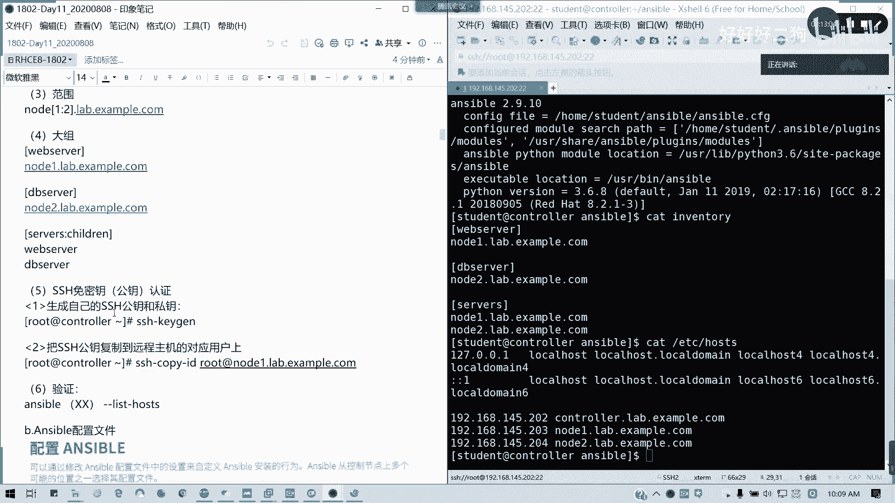

可以使用命令 `ansible all --list-hosts` 来验证资产清单中定义的主机列表。

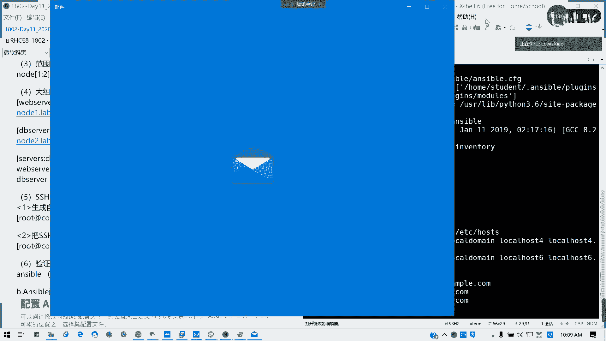

## 🔑 SSH免密认证

要让控制节点能够顺利地向受管主机发号施令，需要建立SSH免密认证。

我们通过`ssh-copy-id`命令将控制节点的公钥复制到受管主机对应用户的`~/.ssh/authorized_keys`文件中，从而实现单向免密登录。在考试环境中，务必仔细阅读说明，确认需要在哪个用户下进行操作，这是得分的关键。

如果需要双向免密认证（例如从node2也能免密登录node1），则需要在两端都执行`ssh-copy-id`操作。

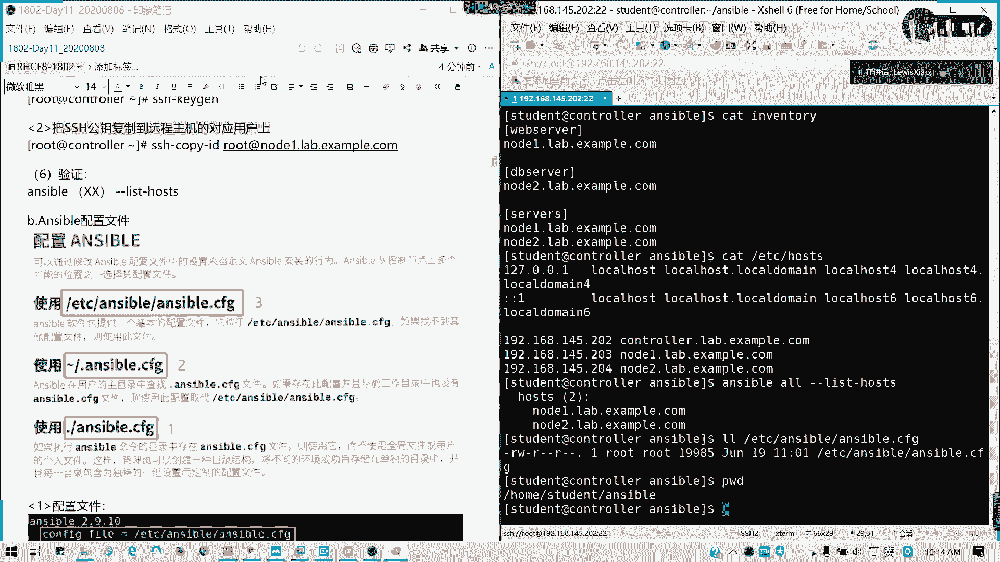

## 📄 配置文件详解

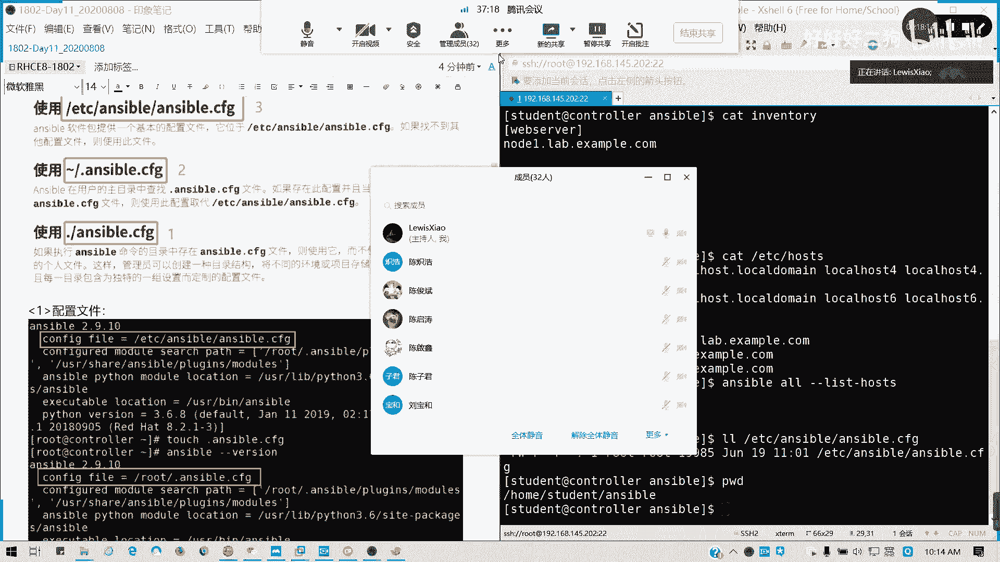

Ansible的配置文件决定了其行为方式，理解配置文件的优先级和结构非常重要。

Ansible配置文件的优先级从低到高依次为：
1.  **全局配置文件**：`/etc/ansible/ansible.cfg`。如果没有其他配置文件，则默认使用此文件。
2.  **用户主目录配置文件**：`~/.ansible.cfg`（隐藏文件）。如果存在且当前工作目录没有配置文件，则使用此文件，其作用范围是当前用户。
3.  **工作目录配置文件**：`./ansible.cfg`。优先级最高，但作用范围仅限于当前目录。这种方式的好处是可以为不同的项目或环境创建独立的配置，互不干扰。

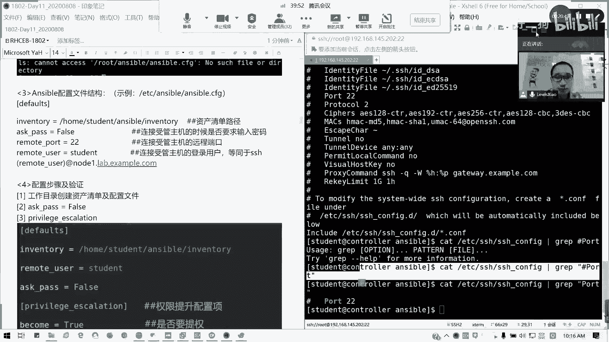

配置文件通常包含`[defaults]`配置节，其中定义了以下关键参数：
*   **`inventory`**：指定资产清单文件的路径。
*   **`remote_user`**：指定连接受管主机时使用的远程用户（建议使用普通用户而非root）。
*   **`ask_pass`**：设置为`False`以避免每次连接时都询问密码（前提是已配置免密认证）。
*   **`remote_port`**：指定SSH连接端口，默认为22。如果受管主机的SSH端口已修改，此处需相应更改。
*   **`[privilege_escalation]`**：权限提升配置节。当使用普通用户执行需要更高权限的任务时，需要在此配置。通常推荐使用`sudo`方式进行提权，配置项包括`become=True`（启用提权）、`become_method=sudo`（提权方法）和`become_user=root`（提权为目标用户）。

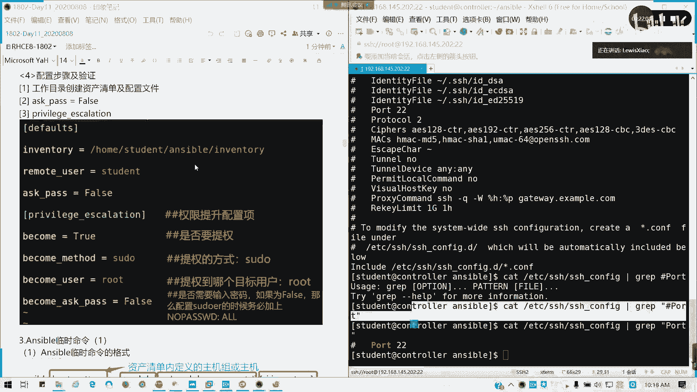

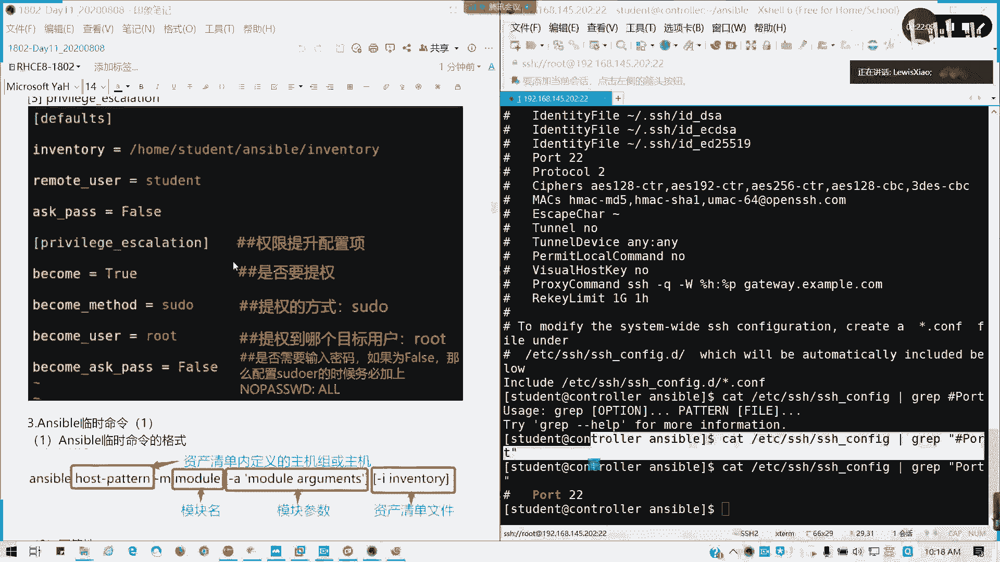

本节课中我们一起学习了Ansible的核心架构、安装配置、资产清单管理、SSH免密认证以及配置文件的优先级与结构。掌握这些基础知识是熟练运用Ansible进行自动化运维的前提。