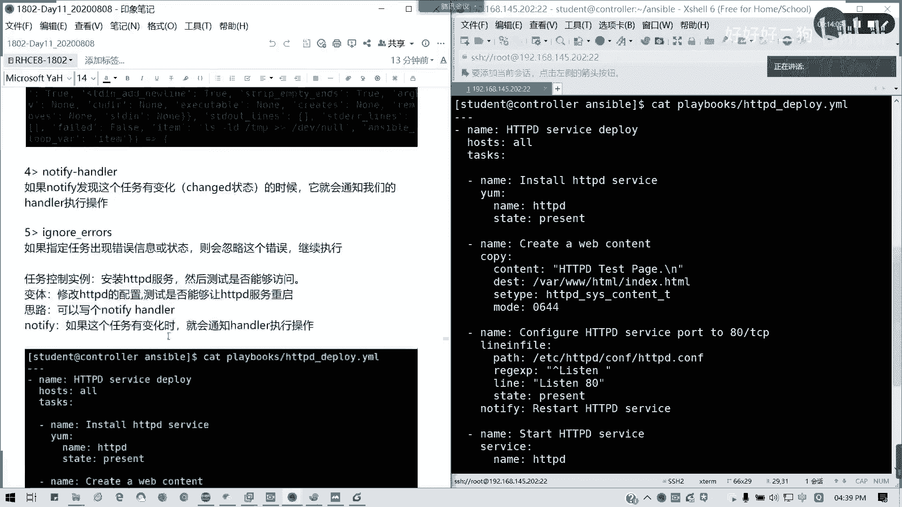
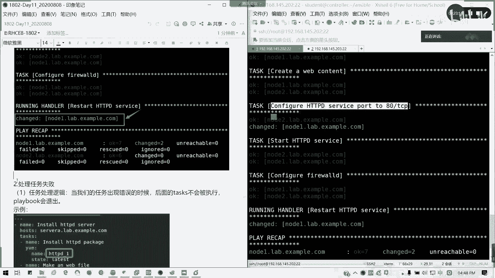
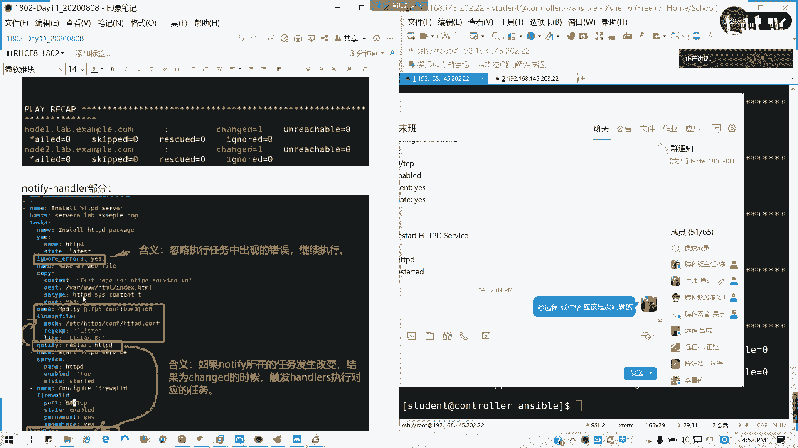
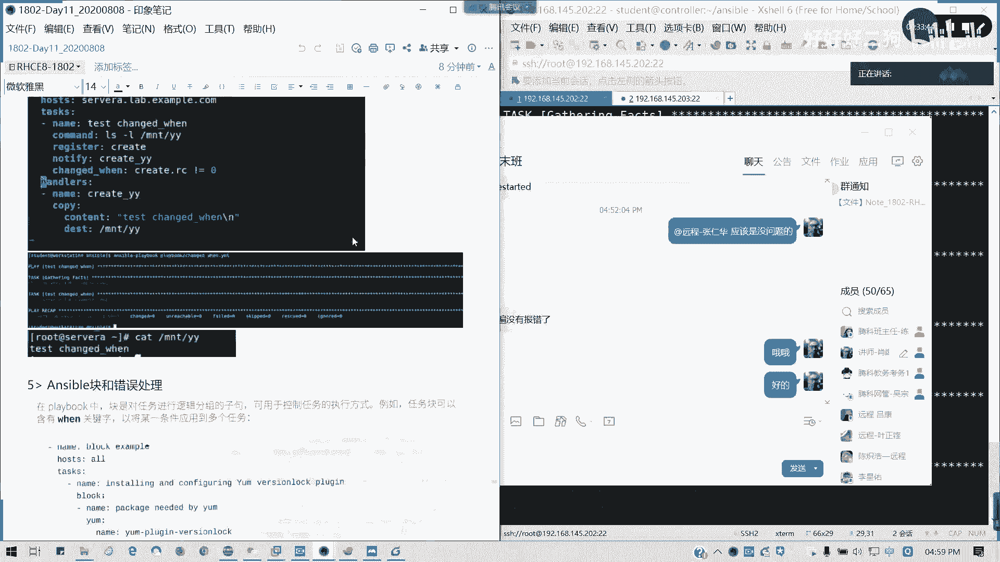

# Redhat红帽 RHCE8.0认证体系课程 - P66：66_Video_Day11_RH294_Ch05_处理任务失败 - 好好好二狗 - BV1M3411k77W

好，我这边开始讲这个例题啊。但例题的话，其实涉及到我们的一个notify handle的一个方法。notify handle呢就当这个相当于就是我收到有变化时候，我会直通知我们的一个控制执行一个操作。

懂吗？就我唉我一路设计执行执行下来，然后发现有问题了，我拐一个弯，我去处理一下，懂意思吗？收到提醒之后，notify反正提醒嘛，说提醒之后，哎，我去执行我指定的一个操作，然后呢。

刚才我们也讲到一个inor errors，对不对？忽略错误，就是他有错误的话，我就过。那我们现在来看这个例子啊。看一下。HTTPD部署啊，通常我们是不是要测试一下子才行的，嗯，对不对？

不可能说我服务就直接安装，然后什么都不管了。写剧写句写写剧本。我们就写这一个叫做。HTTB服务。部署。然后呢，host。我就写哦，好不好？任务呢我分为一下这这几块。首先我们是安装服务，对不对？

先安装我们的服务啊。先康动服。然后安装的方法就是一样。对吧。模块是样HTTPD。state是present都可以。认识。啊，是那样想。哦，name哦多了一个D。好的。这样可以了吧。stay。

那我们第一步是不完成了？因为。这步我不需要加任何判断，为什么？因为它装了之后，它它会它会提示啊，所以的话就不这里不需要进行任何的一个加加任何的一个操作，懂我意思吗？这里不需要。不需要加热何操作。

因为它本身的样模块会帮我帮我们判断。好，第二步。是不是我们创建一个测试页面了？那我们这里用copy的方法。对吧用告别方法，然后呢，还记得吧？cont对不对？HTTPDt page。那这里呢我就。

对吧我可以加换行服。然后呢， destination。我们放在我们默认的document录可以吧？对吧然后接下来我们的一个。那1个SD type。上下文类型是不是要指定？对不对？

HTDPD下划线C下划线考前下文T对位？我在SC6次之是讲过。接下来。Moode。0644。好。接下来。文们是写完了是吧，生成内容就写完了。写完了之后，下一步就是我们的。修改配置啊。

修改配置为什么要写呢？就以防我端口改变了。我可以立即立即重启我的服务，对不对？就是相当于把把我们的那个。服务从从这办0端口，懂吗？对吧然后我们使用拉ning范可不可以？我们使用拉印方案行修改都不可以？

Pas。我们的配置文件。是不是啊？然后。我们的我们用正则表达式来进行定位。我们这里写的是以list开头。对吧理审空格开头这一行，懂我意思吧？好，接下来回车。我要修改什么内容？就整行修改啊。

不要说写就写巴0。这是不对的哈。🎼6listson80，然后我这state得我新鲜，pre荐都可以。这是我们第三个任务。然后接下来我们这里要插入一个。not地发了。nify后面我们跟着一个标题啊。

Notify HD restart HDPD service。这为什么加这个呢？就是以防我们的服务没起来。就就这这个是加，就是我那个如果出现了异常，对吧？出现改变，他会做什么操作。

我这里先留了一个提醒在这里懂吗？现在我们写下一个任务。star hDP serviceok然后呢，我这里调用我们service模块，这里只是我刚才nifyify这里的话，只是留了一个。对吧。

我只留了一个提醒在这里。懂我意思吧？有个提醒。接下来service模块。那。HDDPD。内。yes for true都可以啊。Now， state。沙腿。对不对？好，那接下来我们是不是配置防火墙了？

要放空。对吧。我要配置防火墙，是confuturepower地。对吧。好的。接下来我们用firework机模块。P。这我们添加80KCP端口。对吧。谁城米内部啊。然后呢，我们在permanent。

Immediate。yes，对不对？然后最后我们来写一个hander。看一下啊。handdos我自己写。Rstar。他其实他的提醒的提的标题要跟我们后面一致啊。对吧就是他我接收到一个题。

如果是状态发生改变的时候，他会执行什么操作？懂我意思吧？所以notify跟hander这里的name要一致。哎，天猫是。要不要不是，只是这个步骤发生改变的时候。这可不是。正走资是不是要那个。

先杠不用不用不用。

不需要哦，他报错。有报错吗？我看一下啊，哎，我的桌机好像有问题。nify我这说定好像有点问题。应该是这样。对，因为它是属于同一个里面的。我刚才说就说错了。那后面我。看一下handlerers。

 handlele是写在前面的，就我的处理方法是怎么样的？手handle是一个单独模块啊。然后后面比如说我的那个HTPD发生改变，我是不是可以。看一下。service是吧。

我要调用service模么快做修改过它的网卡，它的那个端口配置。是不是我要重启肤啊？好了，谢怀。

可以理解吗？

整个剧本。然后这个的话就是我们写notify跟 handle的时候啊。

它是那个ning版任务发生改变的时候，如果结果劝取的时候就会促销handle进任务，懂我意思吗？它这个状态是劝取的，就就会改。但如果。不改他就不跳过这个操作。我们来执行一遍。没问题啊。可以了。

可以理解吗？这个。可以写吗？我们看一下执行结果。这结果已经出来了啊。所以说我们这里可以试一下，我可以试一下，把那个80端口改一改。

我试一下，我把我们把那个。单独改一改啊。比如说我把那个。

我把这里改稍微改一下，看有没有实用。比如说我改成82，对吧？我看一下。看一下就发那一个券子了，发券子之后它会执行一个handle的任务，就重启服务。好吧。对吧是不是改8我刚才改了82，然后又改成80了。

懂我意思吗？

能明白吗？就刚才我80端口改成82了，他会把它改回来，然后发生改变之后，它会重启服务的。对吧。等一下，我把这个重新截一下图就知道了。

对吧。就刚才我们测试了就是这样的一个结果，对吧？我们改了端口之后，是不是要把它改回来，发生che的时候，是不是改是不是？有效了。

我把这一个再补一个图啊。

我们这个任务叫应该是叫做那个。

叫做confiation hTPD啊。

confguration HTTPD哈这于。

OK这个能理解吗？

可以理解的，请扣2，我看一下啊。配置人写作不也起不来了。

我看一下这里有没有问题。already是80斜杠TCP吧，n permanentent我看你的剧剧本，看一下张德华，你的剧本。

这个配置写是写不来，我是指的意思说我的那个端口方生改变的时候，我可以触发重启操作。配置文你写说他不不管其他部分的，我只是管了一个端口，修方修改的对吧？你配注文写错的话，我不管的。好，然后这个报错。

我看一下你这个。你不哎你不你把那个右键，把那个快捷键输入表清你去掉。

重听一遍。

这个我看一下这飞桶啊。Public， permanent and non permanent immediate operation。

已经起了吧，我看一下你端口已经起过了。

我看下我在执行遍，看会不会报错啊。我现我在执行边有没有报错？因为你之前的端口已经加开了，已经开了。

我这边没有问题啊。

我看一下inage state。

这个我觉得应该是。Its already enabled in public exception calls。应该是不会报错的，对你的脚本是没有太大问题的。

只是提示说哪个服务已经起来了。

好，能明白吗？

那我们先看一看我们接下来一些东西啊，这些东西的话，比如说像我们我们在22号，我们再讲一下例子，可以吧？处理任务失败啊，我们任务处理逻辑呢，当任务出现错误的时候，后面的tk不会被执行。

它这个去整个区不会退出。比如说我把服务名写错了，对吧？

哦，浮务贫写错，它就会直接退掉。那处理任务失败的一个方法呢，第一个我们的获利错误。对吧。

第二个，我们可以强制处理。

有notify后面有错误呢，它不会会不会退退出。如果他那一个强制一般notify handle呢，它只管你前面的内容有没有问题，你后面内容出现问题，他他也绕退了，懂我意思吗？

然后呢。如果要强制执行，就是forth tenderous。明白我意思吗？

但是他强制执行有条件的。他强制执接就有条件的，就notify的。所在的这一结果呢。它的执行线有发生变化，他才会执行。然后我们也可以通过我们的。我我通过我们来指定我们所人工来指定我们的任务失败条件。

Fil one。fail failed when也可以，对吧？但我们就通常用feld way来指定啊。指定我们的一个任务人为资营的任务失败。我们可以比如说我们。可以来定义一个。任就人工定一个失败。

比如说。通常啊通常在正常情况下呢，它的。人工返回啊，就他的那个返回值。返人返回值，它的任务返回值转返回转转法不等于零的情况下都失败。但是我们比如说我们可以指定说。等于0。我们指定一个横吃饭，就。

横向失败的一个任务。对吧我们。我们比如说我们的那个。可以指定一个，这这是一个很失败的一个任务。你你应该知道吧，be force啊be force。对。be force的话。

command这个就就这个这这个command执行命令啊。be force的话，它是不是很失败了？他的状态嘛绝对是失败的啊，他他他正常执行是唯一的啊，RRC值唯一。所以的话我们可以通过。

指定的人为失败条件，就是说他这个执行是绝对是失败的。懂我意思吗？就永永恒永恒失败的一个例子。这个病for是不是不能登录啊，是吧？然后我们可以指定我们的。一个失败条件。比如说它里面出现了1个YY。

它才失败，其他都视为成功。可以懂我意思吧？就是我们一个例子。就它里面有出现YY这个字眼，它我们才视为成功。当然它不会改变，它只会改变我们的程序的执行一个流程，但不会改变它的一个结果，对吧？它失败。

他即便失败是失败。但是呢就。他直前执行了，但是后面的话这我任务的话就要正常执行，对不对？就是它变体的话，比如说我的comine reserve，我等于0。对吧。就当他RC值等于零度视为失败。

我就反反过来嘛，它是也很容易失败，这不是等于非零，对不对？我就让它等于零度失败，那非等于非零度成功，懂吗？

通常啊我们这个fa way呢一般在一个shall的命令里面定一个register的变量。在后续里面通过这个值来决定这个任务或后续任务是否就要执行，对不对？然后像chrenge win呢。

就是发生改变的时候才会执行命令。比如说我刚刚才改了端口对吧？改了端口，那影响一个任务呢是影响最大的是谁呢？就是hands。所以通过chanrenge when来控制什么时候来执行这hands。

懂我意思吗？这个图能能理解吗？tch way就notify它通常可改变是不是要执行hand但你要根据chch way来判断它的条件。懂懂我意思吧？那这里又是一个实验，对吧？比如说我这这里的话。

我把前面的话把这命令改成LLS杠LD然后MTYY。然后我把它都体反式写了。他ch外呢就是他这个命令的执行结果。对吧不等于0就视为改变。视为任务发生改变。如果存在的话，那RRC等于零的话，懂吧？

然后这个任务的作用呢就是当这文件不存在的时候。我把它串出来。懂我意思吧？在这里粒子钉经写了。然后接下来这个快跟错误处理呢。

快的处理呢简单讲一讲，我们下我们接下来我们后下最后一节课我们来讲一个例子啊，就是这里的话。

相当于我把整个如果写着brolock的话，下面这整一块。

整一块就相当一个块，就相当一个整体。我运行的，我我如果执行就都执行，不执行都都不执行。懂意思吧？我建得这主要加一个判断条件的话，在这一块的话。懂吧。先号我看。对啊，算算张对对，没错。

他放上是不是anerible distribution，是不是 center。如果不是这些全部不执行。如果是的话，他执行这一块的内容。懂我意思吗？比如说rehead也是一样的。

我们这里的例子可以就是rehead，对不对？我们的SS distribution，我们这里是RG18。0嘛，所以是rehead才是对的。

然后在rescue跟 alwaysway呢就是它是asSible distribution，是它的S fan里面自带的。

就事实里面自带了一项东西。然后像我们错误位置，我们错误其实可以进行修正的啊。发生错误的话，我们比如说这里我写了一个错误的对吧？然后他我可以我可以在就是说犯错的时候，我可以写一个急救，就rescue嘛？

就犯生错的时候指行怎么操作操作。比如说这里写一个peal failure。

对吧。

如果成功，他就不会执行这一行。

还always的话就是无论成功或失败。他都会执行。

懂吧，这就是一个任务快。好了，就具具体这块内容我们会就先给大家看那么多吧。然后呢，我们在22号那天的。最后一天我们课程里面，我们会优先把这内容讲上，把这这这种例子补上。因为时间已经到5点01分了。

最后一天讲什么呢？就说这个复习重要呢，我们讲。那个最后的模板，还有一些是就是那个J two模板，军加 two的模板，也就temporate的一个使用。然后接下来就是一个。这一些参数的调整。

比如说大项目并发的一些调整，然后最重要的这个角色。然后后面的一些执一些执行，就是那些啊，我想想还有一些就是我们的一个自动化任务。这块的话我们就简单讲一讲就行了。

对吧了讲一讲考试考试呢他会考一些食盘这些的我们会讲到。磁盘了还A色部弱会讲到。但是这个任务控制跟失败呢，我可到时我会整理一下，看大家待会我整理到几道习题给大家念一练，可以吗？好吧，那我们今天先到这儿啊。

笔记跟那个笔记我现在传发给大家，然后视频稍后传。没问题的，请扣Y哈。我们今天的课程即将结束。然后练习操我到我10点会发送嗯。我们下一节课22号最后一天不是明天啊。笔记先给大家6兆多。

今天我们就只讲第五章。

OK那我视频先断了啊，感谢各位。😊。

