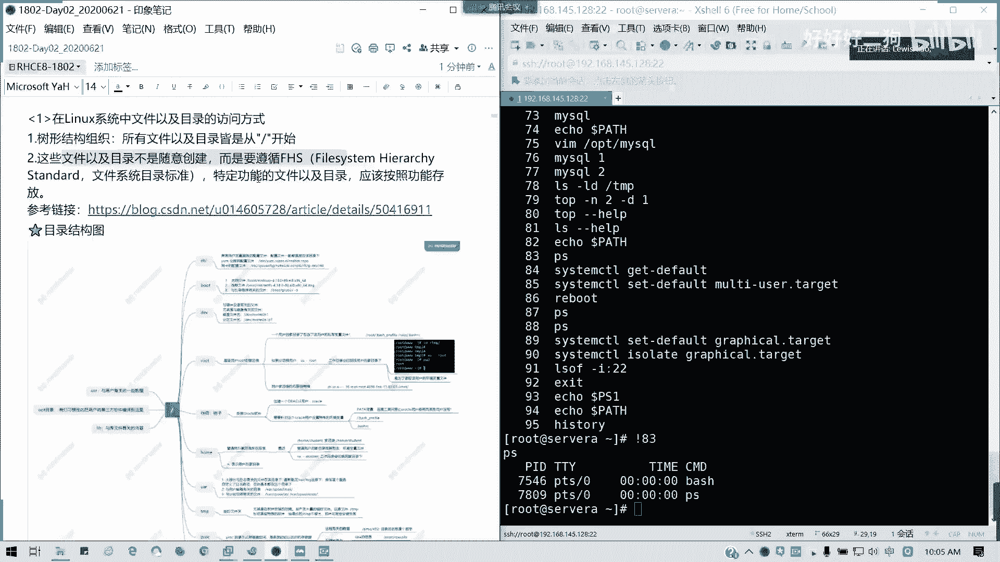
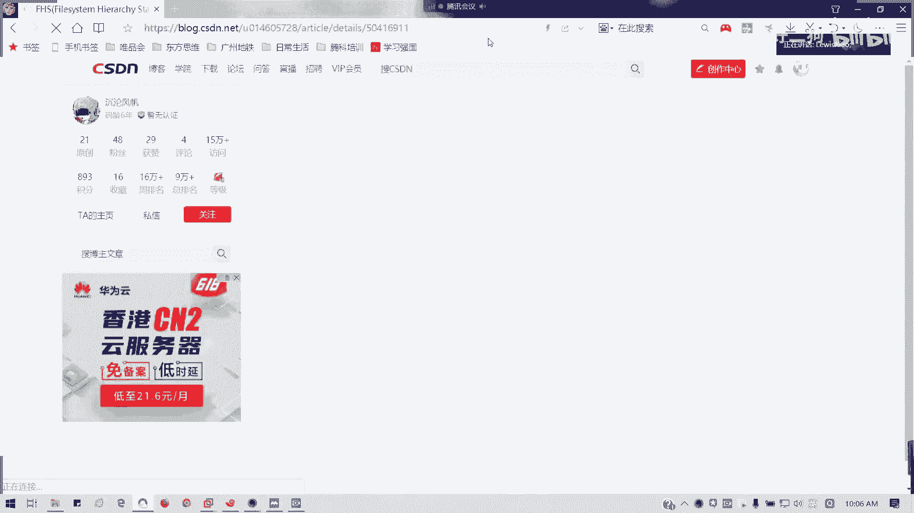
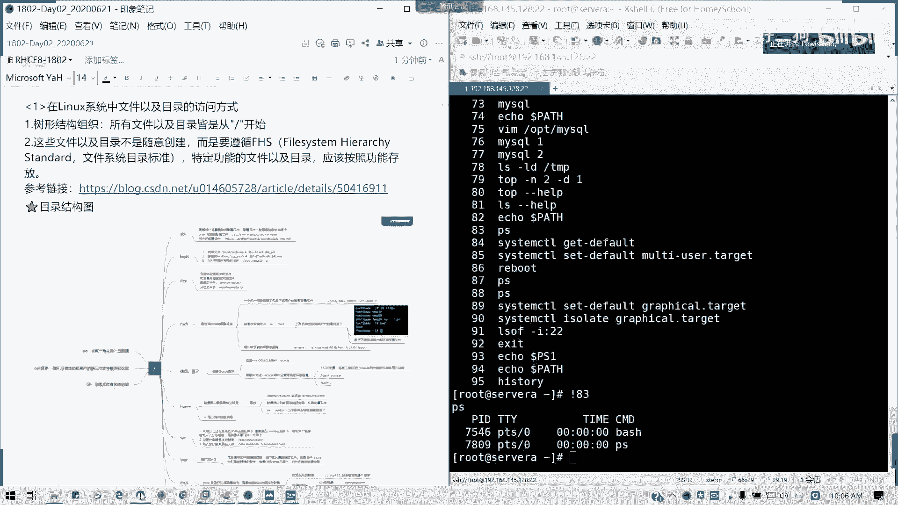
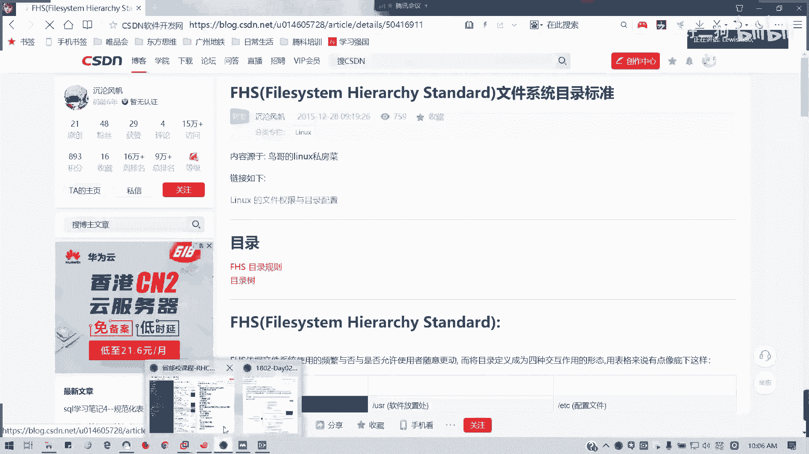
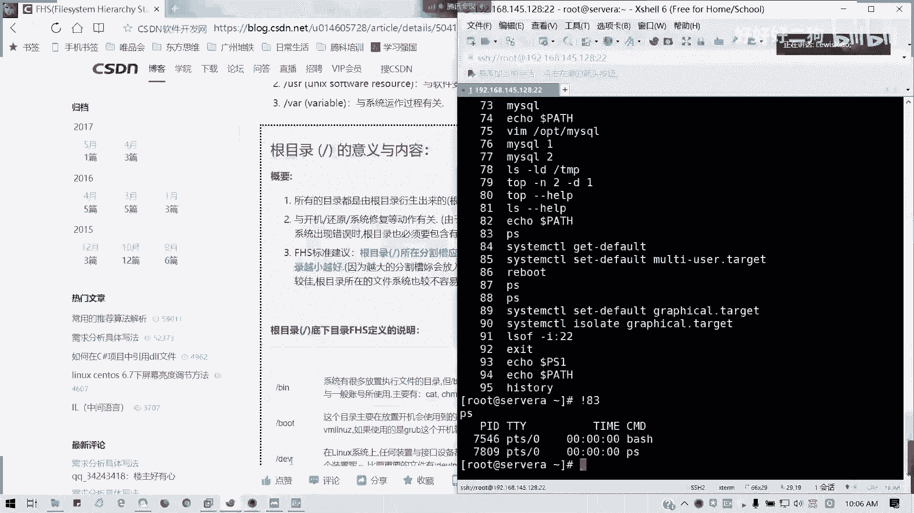
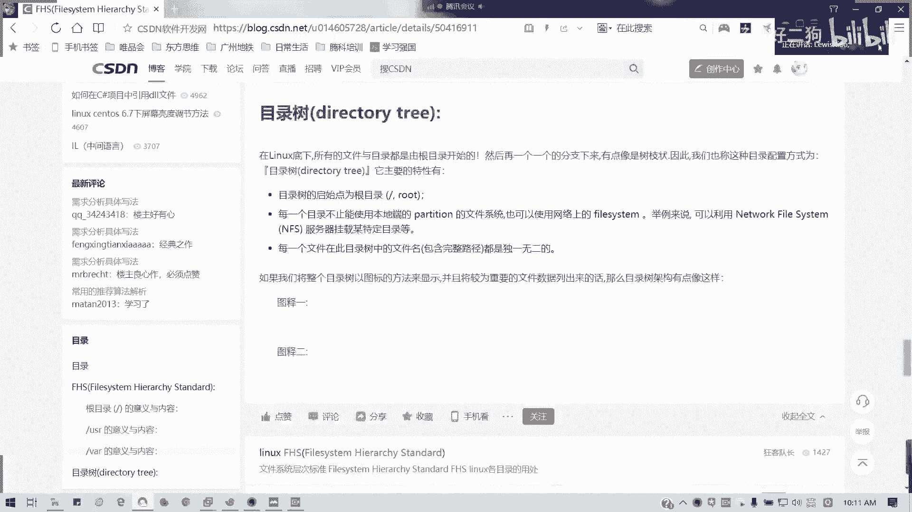
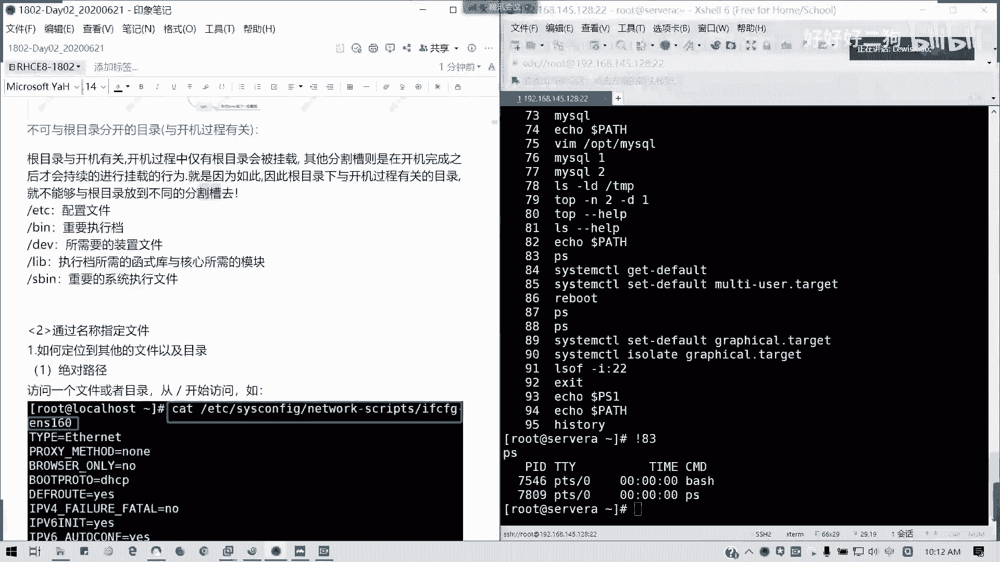
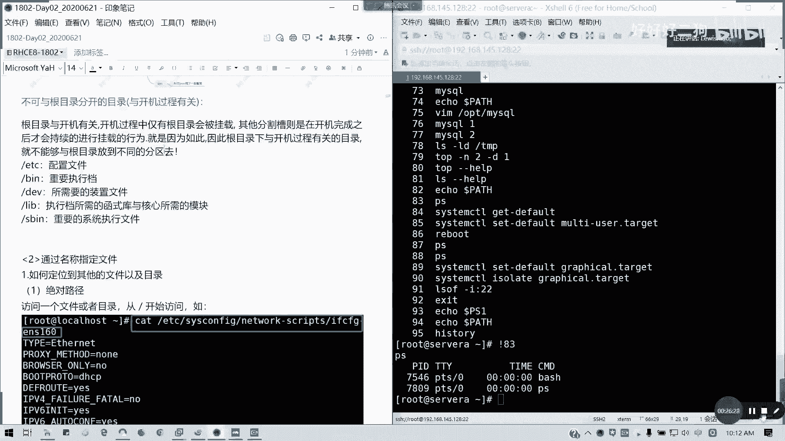

# Redhat红帽 RHCE8.0认证体系课程：P6：课程回顾与基础概念梳理 📚

在本节课中，我们将回顾上一节课程的核心内容，并对Linux系统的基础框架、命令行访问、文件系统结构等关键概念进行梳理和总结，为后续深入学习打下坚实基础。

## 课程回顾概览

上一节课程我们主要完成了入门引导。首先介绍了红帽课程的学习价值，当前开源趋势和国产化背景下，Linux系统因其安全、高效、多任务特性而备受企业青睐。其次，我们对比了红帽RHCE 7和8认证体系的区别，重点指出RHCE 8将核心放在了Ansible自动化运维上。

## 红帽认证体系详解 🎯

我们详细探讨了红帽认证。RHCE 8的考试分为两部分：上午2.5小时考察CSA（红帽认证系统管理员）内容，下午4小时全部考察Ansible。这表明考试难度有所增加，要求考生对Ansible剧本、模板和角色非常熟练。Ansible的强大依赖于扎实的Linux基础命令。

红帽认证架构（CA）包含多个方向，目前全球有效CA约1300人，国内约600人；而有效CE（红帽认证工程师）全球超过7万人，国内约3万人。CE证书有效期为3年，是进阶学习的基础。

## 系统安装与远程连接 💻

我们手把手演示了在VMware Workstation Pro中创建虚拟机并安装RHEL 8.0系统的全过程。过程中特别强调了网络配置（如IP获取）的注意事项。

我们还比较了RHEL（红帽企业Linux）和CentOS的异同。两者命令完全一致，主要区别在于：RHEL是企业版，提供付费技术支持与订阅；CentOS是社区免费版，可能包含更早的新特性。当前最新版本是8.2，但考试仍以8.0为准。

在远程连接方面，我们讲解了如何通过配置虚拟网络（NAT模式），使用Xshell或SecureCRT等工具连接虚拟机，这是后续运维操作的基础。

## 访问命令行与Shell基础 ⚙️

上一节我们深入讲解了如何访问Linux命令行。Linux系统由内核和Shell构成。内核是系统核心，而Shell作为“外壳”，提供了用户与系统交互的界面，主要是命令行界面。在生产环境中，命令行是主要的操作方式。

我们介绍了Shell环境中的几个关键概念：
*   **PS1变量**：定义了命令行提示符的格式。格式为 `[\u@\h \W]\$`。例如，root用户显示为 `[root@hostname ~]#`，普通用户显示为 `[user@hostname ~]$`。
*   **PATH变量**：定义了系统查找可执行文件的路径。用户安装新软件时，可将其路径加入PATH，以便直接执行。
*   **终端类型**：包括图形界面和文本界面，两者可通过快捷键或命令临时或永久切换。直接连接服务器进行操作称为控制台（console），本地文本界面是字符终端（tty），通过网络远程登录则是虚拟终端（如通过SSH）。

## Shell使用技巧与文件系统框架 🗂️

在Shell使用部分，我们学习了几种提高效率的技巧：
以下是命令逻辑操作符：
*   **分号 `;`**：用于顺序执行多条命令。
*   **逻辑或 `||`**：前一条命令执行失败后，才执行后一条命令。
*   **逻辑与 `&&`**：前一条命令执行成功后，才执行后一条命令。
*   **反斜杠 `\`**：用于在命令行中换行，输入多行命令。

此外，还有 **Tab键补全** 功能，以及 **Ctrl+A/E/U/K/左右方向键** 等快捷键，可以快速移动光标、删除内容。`history` 命令用于查看历史命令，使用 `!序号` 可以快速执行历史记录中的某条命令。

最后，我们初步了解了Linux文件系统的框架。Linux采用倒树形结构，一切从根目录 `/` 开始。这种结构遵循 **FHS（文件系统层次结构标准）**，该标准规定了特定功能和文件应存放的目录位置。

例如，关键目录包括：
*   `/boot`：存放系统启动文件。
*   `/home`：普通用户的家目录。
*   `/usr`：系统软件资源目录。
*   `/var`：存放日志、数据库等经常变化的文件。
*   `/proc`：虚拟文件系统，存放进程和系统信息（在内存中）。

在企业环境中，通常会将 `/boot`、`/home`、`/var` 等目录单独分区，以提高安全性和管理灵活性。

---
本节课中，我们一起回顾了红帽认证体系、系统安装、命令行访问基础以及Linux文件系统框架。理解这些核心概念是掌握Linux系统管理和迈向Ansible自动化运维的关键第一步。下一节，我们将开始学习如何通过文件名来定位和操作文件。