# Redhat红帽 RHCE8.0认证体系课程 - P71：69_Video_Day12_第911天知识回顾 - 好好好二狗 - BV1M3411k77W

好呃，我们9点40分，我们就事不宜迟啊，事不宜迟，我们直接直接来哈。首先我们通过一个回顾，还有我们的那个练习来回顾一下我们前五章讲什么东西啊。我们记得上次讲的第五章完的啊。隔了这么久。

我发意次我基础架构大家都忘了，来，还是那个图。还是那个图啊，我们万年不变那个图啊。还是这个图，对吧？还记得吧？指控制节点作为指挥部，我跟下面的收管主机，我建立好关系之后呢，是不是我可以发号设令了？

这就是我们ensible做批量管理，去做那个批量部署的一个作用。然后通过什么去发号设令呢？就是我们的。关于我我们的一个剧本或者是叫角色。角色的话，我们今天肯定会讲到啊，角色肯定会讲到。

所所所以这几个概念呢。几个概念还是关我们的控制节点，我们的角色，我们送换主机资产清单、剧本有印象吧？有印象吗？控制节点是吧，指挥部对吧？然后呢，税管主机就是我要去让他我我控误节点，让他去运行命令。

达到我们的目标状态，也就是我们所做的一个密等性啊。然后呢，还有就是我们的。还有就是我们的一个啊。资产清单其实就是收款组织的一个列表。剧本就是我们要执行任务啊，我们。演员啊这些的话，是不是拿拿着一个台本。

拿着一个剧本，上面有你要说的话做的事做的事情，一些神态动作等等，对吧？然后呢，接下来就是我们的安装跟初始化。应该叫做aner的部署啊。部署的话我们有几个东西，一个是安装。安装的话。很简单哈。😊。

只要有互联网，有那个EPL那个源就可以了。然后。接下来资产清单。自清单我们可以几种情况啊，就我们的初始化配置啊，自清单我们默认的配置文件。我把昨上一周就上一天的笔记我复过来。呃。

像资产清单我们有几种情况，对吧？几种情况都可以。但然里面啊IP还有我们的域名是视为两条不同的记录，能明白我意思吗？在我这里，我既可以一条记录，单条记录啊，就单钉啊一条记录这样写。

或者是我可以把一台或多台主机做一个分组。然后分分组我也可以将众多分组结合起来，我再分一个大组。对吧。就那个我们下面的叫做service点children，对不对？看到没有？第四种情况啊。

然后我单主机我也可以用范围对吧？用范围来简化定义，能明白我意思吗？这个还记得哈。我待会全部我待会回顾到5章，回顾完的话，我会讲练习的。好，接下来我们。推文清单中呢。我要做什么事情？

免密钥认证免免密要认证啊。免密要认证。秒要政策话两个步骤。还记得吧。免密要认证，先生成自己的公司要，然后把公钥复制到远程主机，我们的授管主机的对应用户上。有也就是我们单项建立的关系。懂我意思吧。还记得。

然后当然我们最好的话在这之前我们做一个准备，就是我们在这个我们因为我们的练习的这个我们自己搭的个S博环境呢，这域名呢你都是一开始都是那些你在互联网上是没有解析的，对不对？所以的话我们这个。

硬点期还是要做一下。但在我们实际考试是不需要的。对吧应解析还记得吧？好，然后验证了这里的叉叉啊，enssable然后叉叉。list啊就是验证我们的售管主机的一个数量到底对不对数，对吧？好。

我这里我们之前我们自己搭的都一直是note一note2，你后面可以扩展成扩展到note3n4等等都可以。好，这一块没白，就如果还记得还明白的话，请扣个一啊。在群里面可以扣一哈。因为隔得太久。

我先带大家重新把这个过一遍。好，接下来。这是资产清单的这个步骤啊。第3个。我们讲到配置文件。现在姐说没没你，没关系，待会我会再解一遍哈，待会再做练习，我再我会再解一遍啊，放心。然后接下来讲配置文件。

还记得这个优先级吗？但这里再加一点啊，还记得这个优先级吗？对啊，我在前面Sible主要。主要知识点我要写一下啊。主要知识点，他这里的话是有一个就就之前我们的一个学员提供给我的啊，他的邮件里面。

他当时是艾我这该考了满分的啊。所以所以所以的话这块知识点的话都在这里总共46个点。就之前我已经和他提过了。好，配置文件啊，我们优先级优先级我们要注意。原来最后一个都是姗姗来迟的啊。

那这里的话我就补充一下S5配置文件优先级。首先我们原本是讲了三个啊，原本讲三，我现在在向在家在复习了，在复习。然后待会我要听，因为我们课程隔两周，隔两周可我怕很多人把这些东西忘了。所以我我重新再过一遍。

好。然后有一道练习给大家啊，有一道练习就是可以概括我们想的所有的东西。Sible配置环境优先级。像如果我们有一个环境变量叫enserible孔，这之前我没讲这优先级最高的。如果有环境变量，它最高。

这是第一个。然后第二高呢。就是我们的工作目录下面，对不对？所以我们现在我都是切到普通用户里面的一个S模目录。我在里面建的备置文件，懂我意思吗？然后。他的当然我优先级最高。电视的那块，然后他的那个。

作用范围更小。当然这个A模pro除外，因为它有环境变量，就用它的配置文件。然后接下来。四肢的。次肢的就是它的一个我们我们在用户目录下面建的一个叫做点用户加目录啊。

点N色备点口费点A色备口费呢主要是它的作用率在我们的。用户作用于是当前的用户啊当用户。然后最优然后如果里面什么都没有，那至少也有配置文件可以生效吧，对吧？有配置文件生效的话。

那就是在ETCS下的S点confi。那文件要怎么写？没反应是吧。先重新接一下吧。嗯，行。配置文件的一个结构。对吧defat节通常我们就直接我就干脆这样吧。智力是源这本CS区。

然后我这里的话我是配了普通用户加上提全。

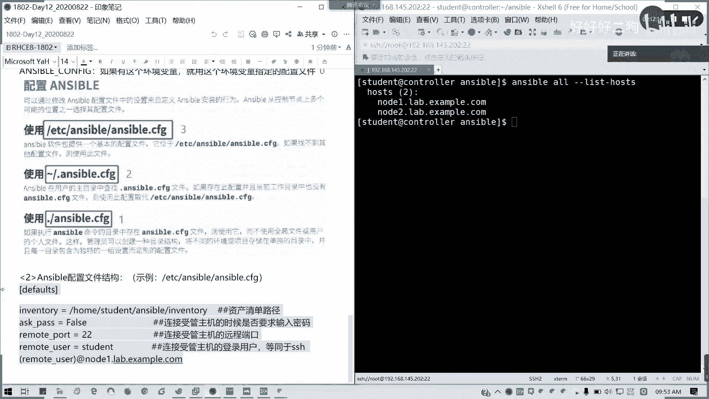

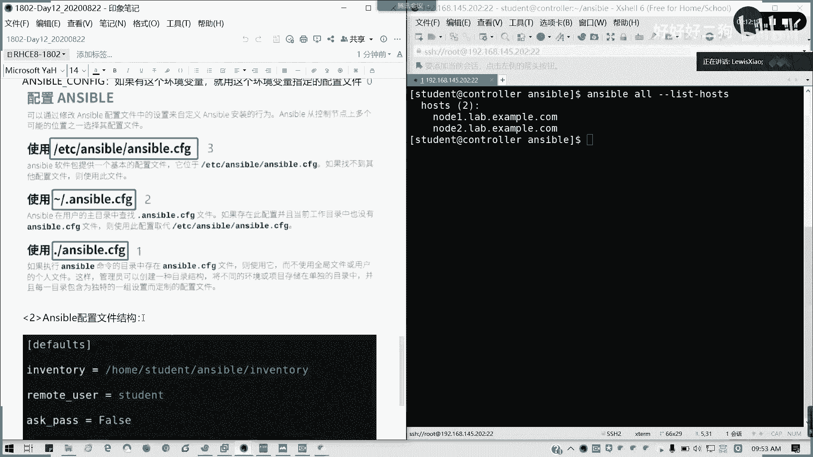

我直接就贴这个图算了啊。我直接推这个图算了，那这样的话会。就知道我们平常啊我们如果要用普通用户。普通用户去连我们的，就是说我们收款主机，包括我们的控建都是普通用户的情况下呢，我们可以啊通过我们的。

首先把清单用户跟那个。密码。端口的话，如果是默认22，可以不用写。然后下面配置一个提全配置项啊，提前配置项p escalation啊。这把声音的话，你插上耳几乎是把它关掉都行啊。然后呢。

这里四个比抗价还记得吧？好。配自算机的干嘛呢？如果你是哎看不到是吧？被告。网络循为不佳。然后呢，我们看到啊就是说如我如果我们做了一个提全配置项，记得我们在那个社管主机上。宿管主机记得。做是多的配置。

建议大家做尺度的配置啊。OK。

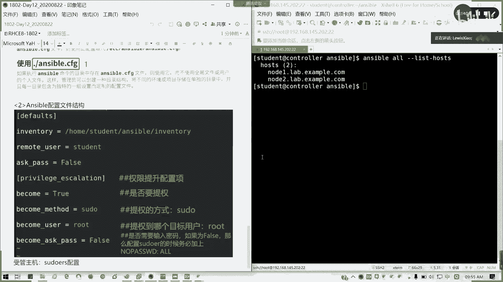

这个点啊我们讲到S博的配置啊，这点没有问题，请打。数字2。因为隔太久，所以的话我带大家过一遍啊。得到我一道练习。

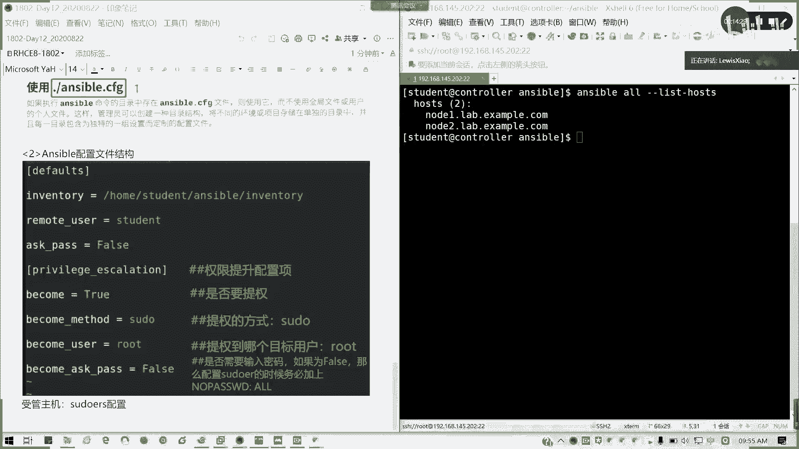

第3个。

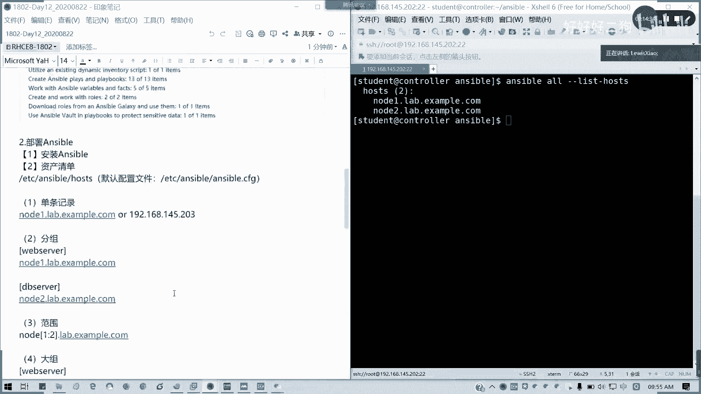

那我们讲第二点哈，复属原则。第三个，我们的临时命令或是我们的模块。

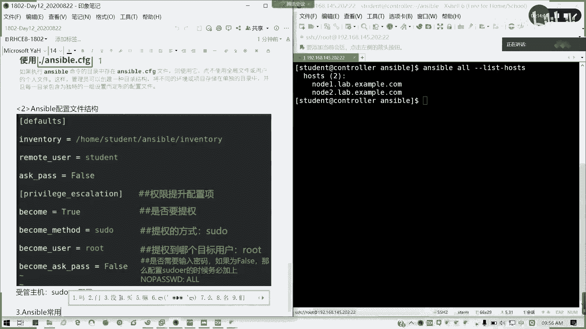

好，其实下面下面有插头，如果是双脚的话啊，三角的话在下面插头临时另意格式啊。

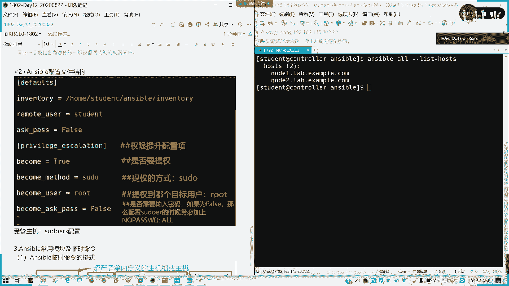

没有，这个插头是有点问题的啊，小心。对我我的手提都我的手提现在现在都没没关上电了。

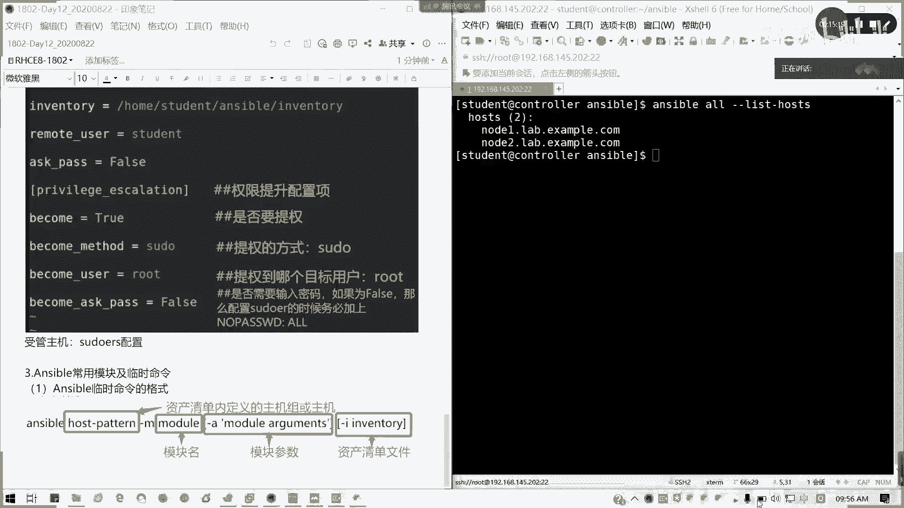

哎，接触不良了，😔，谢谢谢谢。打话。哈边嗯。好边呢。我。咁。Yong。供も翻。跟我问那边，稍等一下啊，我把那个。我插头换一个位置啊。行。好，可以了。

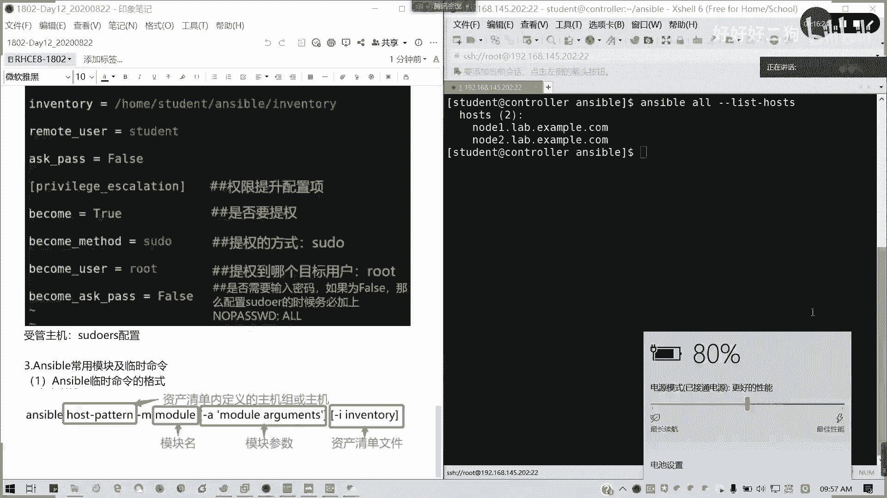

接下来临时V格式知道吧？Sible后面你的资产清单定义的主机锁候主机，然后杠M模块模块参数资产清单文件，对不对？那我们还讲到了密等性。别模块的话，我就简单列一下。

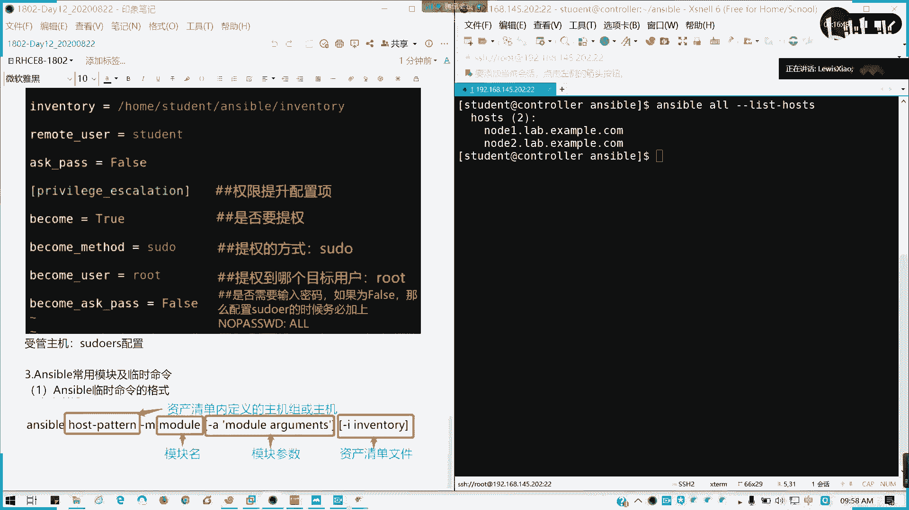

虽然看起来跟我们的那个上周的就上一节课的笔记似曾相识啊。我因为圣战僵持我就不在里面做很大的篇幅了啊。像我们讲到了密等性包文档参考。文档参考的话，如果。对吧anible杠do。

在我们的练习或者是实际的考试里面，其实都没问题了。sible杠B它是列出详细的一个说明。然后sible杠S呢是列出事例啊，列出我们的一个应用的一个例子。那后网站呢是dooc点S文点com。

然后呢文件模块我们讲了好几个，一个是copy复制文件，或者是直接在授管主机上生成文件内容，对吧？然后f取模，然后范围模块呢。从控制主机复制文件内容到收款主机。或者。直接生成。在售管主机上。

直接生成文件内容。对吧所以生请文件。这个是copy模块给做到的。然后换模块呢一般是用于在授款主机上创建目标目录文件或者链接，对吧？再说呢主要是从受管主机上拉取文件到我们的控制节点啊。然后。

line five呢就是增加跟修改文件内容，能理解吗？那最我件那容，然后singleize呢。主要。是文件同步，类似于我们的阿think。然后呢。软件包模块我们主要讲两个啊。

后面我们再会会在在第十章会补充。软件包模块。是不是young repository。搭软件仓库啊，这练习我们一次就做不少，对不对？软件仓库，然后还有我们软件包管理用样，其实还有1个DNF也是一样的。

模块的用法一模一样。系统模块我们讲了user是吧，创用户的创删改用户都是用。user模块对不对？这些参数我就不用再列了。因为第11章第11天的我们的那个笔记全都有。我就我这里为了节省篇幅，我就不再列了。

ro模块。对吧创建组删除组service模块，启动启用停止指定的服务。fi world第一模块。防火墙的操作啊，我们之前在第八在第八天都是讲过防火墙啊。然后我们还有一个叫做comman跟需要模块。

就之前我们一直用的，但是没讲。可慢跟炫要模块呢，其实两者是有一丢丢区别，都是在授管主机上运行命令。就我讲到有一些。有有一些可能啊，我们。在之前没怎么涉及到，但是我们又提提及了，我会讲一讲。

这里啊稍微做一下补充。command某sha的话是在shall命行命令，command是在运行受管主机命令行中的命令啊啊，然后它的区别呢很多情况下就是它当然注意啊。

它不是在受管主机的shall上这样处理。所以的话我们。不能直接访问啊，无法访问所有的环境变量，包括我们的别名这些就不能用了。像我们的，如果你尝试在我们的临时命令上面。

或者是我们的用剧本里面参数里面带上LL行不同的。你要用它的原始命令格式，也就是LS杠L，知道吧？然后呢，像shall跟command是吧？command的模块不会使用shall进执行。

比如说像多的 home啊这些的变量都不能用，而且我们的。从定向管道是吧？分号都不可用。那需要模块呢，它是通过需要程序是执行的，但但会有一个注入风险的。他就因为你直接调用需要命令嘛，对吧？然。

n to模范玩这也。只提到1个UIIget UIL后面还会提到个UII在第十在第十章我你提到1个UII。好，我们。第二部分。的内容就这么多，明白话请周三。啊，突晚加班哈，哎，真辛苦。我点完后。

我要出差了。这是我们第二个部分。明白的话，请扣3啊，请扣数字3啊。第二个部分我们过了一遍。明天都没课了，你们你们加班就加吧。哎，有时候真的是现在是吧？考试。辅导过9月6跟13、9月6、9月13两天。对。

如果有报名的话，应该都会收到通知。而且我在之前呢，我也在前几天我已经发了9月6号的我们要讲的内容。就那个前面的。半天的一个题。有没有收到？学上有吗？学校有的就是我发给大家1个CSA的一个综合练习。

可以先做一下，到时候我会讲。第三个我们讲的是一个剧本。Prybook。facebook我们主要讲几点。第一个我们剧本模型要我们将临时命令转化为剧本，知道怎么写的吧？

三个或折号三个横杠开头证明是样本文件啊。左天也要产迷你剧本的用途，然后后面售感主机在哪？第二就是我的有其他参数就写到后面。比如说像收集事实，或略错误等等。如果是全局都写在前面，如果是局部的就写在后面啊。

它作用是不一样的。然后呢，我的任务呢，我分我可以任务中间我可以分行，是吧可以隔空行，我们可以区分我们就是我们可以区别我们的任务，懂吗？然后任务呢，我第一个任务名字。用什么模块参数是什么，对吧？

然后后面第二第三个任务这样往下。要么格式的语法注意几点，首先缩进，很多人都败在说进上啊。很多人都会败在缩进上，有时候真的不知道怎如如果你缩进少两个空格就会出错了。

所以所以那个剧本的格式包括样么文样么文件的格式。很严谨。对吧有时候不小心你的两个两个空格，你没没没有打，你就相当于你跟前面是同一个列表的那就出问题了，对吧？列表用横杠，然后我们可以空格接接接啊。

接你的那个删数名字，然后。那是吧，我们要参数里面。是吧。这里是没有空格的啊，R文一，然后空格玻璃一啊，这里看出来好像有个空格，其实不是的啊。

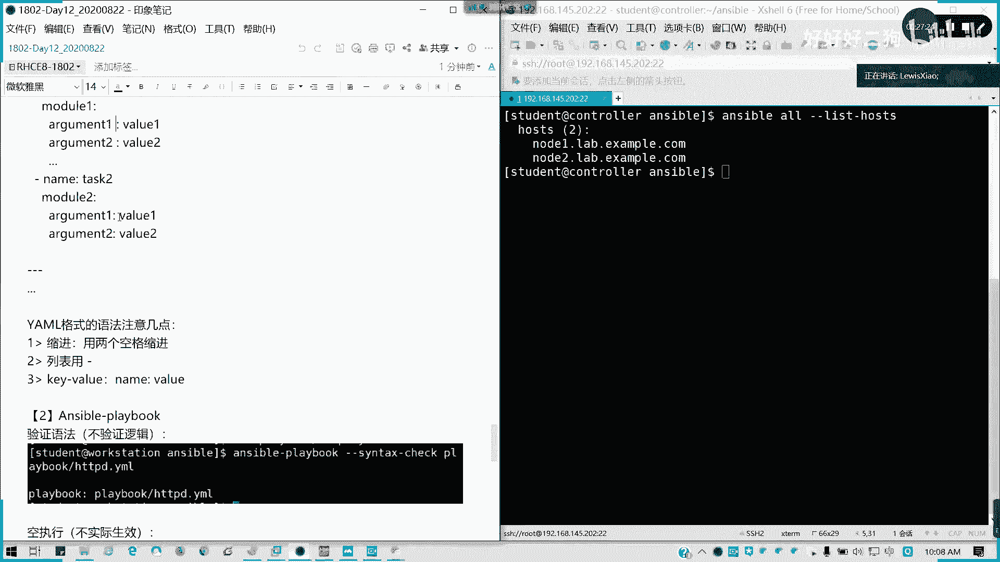

然后这一剧本的话，我们记得。且每次写完先跑先把语法验证一下。先把语法验证一下，然后再试一下，建建议试一下空运行，然后再执行我们的剧本。明白我意思吗？

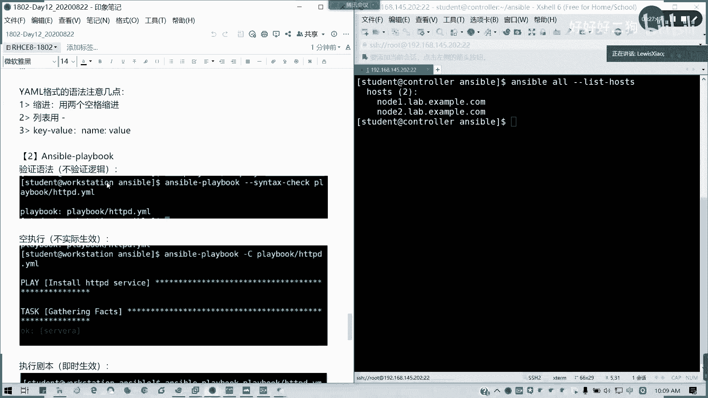

然后后面我可以详细程度，我可以一般我带杠V就可以了。带一个V就够了。你带多个V的话，除非你真的要看日志啊，其他其他的我觉得没必要，就一个V，我就足以看到我当时当前剧本的一个执行状态了。第三章回顾到这里。

有呃有问题请提问，没问题请扣数字4。我现在一张张到第五张给大家过一遍，然后留15分钟到20分钟给大家做练习。对吧。然后接在来讲第六讲价模板。没问题，请扣4哈。学校好像没反应的。如果这张这章节没有问题。

请扣4。数字4啊。好，接下来我们来涉及到一个就是。变量与事实。这里的话我我们会在包括综合练习，包括我们的考试都会比涉及到，而且会内容会比较多。

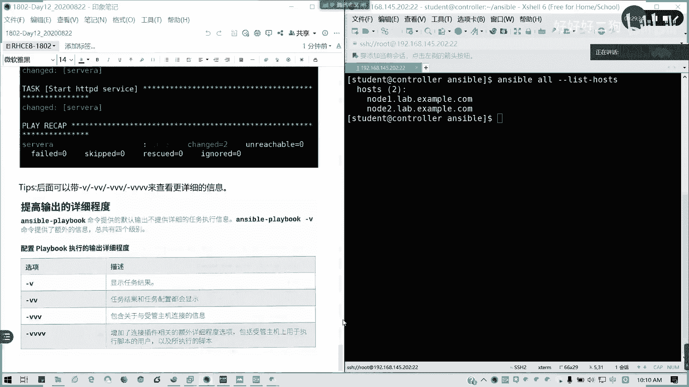

第四点，变量与事实。首先关于变量变量名称。啊。我们的名字是吧，只能与字母开头，然后你可以带字母数字下划线，但是不能带其他特殊符号。然后变量定义的位置我们有几种情况，一个是剧本内，一个变量定义。

也就通过bus可。对吧最为定义通常就是。Vs下面直接定义，对不对？然后文件定义我可以将变量放在外部文件有几种形式。第一个va files，对不对？B fast。

然后还有我们的group bus跟ho bus对不对？特定文件。这种这种这种呢他的级别呢会。我们这种级别稍低一点，在资产清单里面的话，它是主机要求，它的资产清单。如果你重复定义的话。

它的主机级别是最高的，然后才是主机组，懂我意思吗？还有一种最优先级最厉害的，我直接替换变量。对吧。answible playbook，然后后面杠一直接全局替换到变量。

所它这种的情况就是你哪怕你在剧本里面或是我的剧本文件里面已经定义了变量，它的优先级是覆盖过覆盖过其他的这种优先级最高。第4个啊。变量引用是吧？一个因因为为了避免python的语法冲突。

就pyon语法的歧义，所以的话我们通常都是双引号，两个大括号，中间留空格，中间写变量名称。啊。然后变量类型呢通常有几种，还记得吧？一个是常规型变量。常规型变量。在通常我们是用呃变量名冒号空格带变量值。

但是在特定情况下，比如说在我们准资本清单列表里面的主机列表，我们就不能用冒号了，用等于了。懂吗？然还有一种就是同类型的变量数组。不同类型的字典懂我意思吧？这一点就是哎我一个条目里面有不同类型。

然后不同类型里面有不同属性值，就跟我们。三四点是一样的。还有一个注册变量register可将一个任务的结果输出到一个变量里面，方方便引用。还是要吧，比如说我保存一个命令执行结果。

然后我在里面再调一个属性。啊。那还我们讲到的一个叫做。叫做ansable boat。对吧and box加密变量啊，通常加密变量或者是敏感信息的。通常我们要知道它的用法。

create啊创建查看编辑就有文件的编辑。还有就是我如何去在剧本里面调用，对吧？调用执行。然后呢，还有呢就是那个。加密解密重建密码OK这是第一部分。关于变量。

事实呢就是我们的N我们的受管主机返回来的信息，对吧？包括它的一些像它的机器的硬盘大小啊，内存容量啊，对吧？它的网络IP地址等等都可以用，是吧？通常收集事实，我们要把getther fat。打上打上y啊。

然后第二个事实呢，可以两种方式。entle fact，然后后面是吧，一级一级下去，用方括号带引号，或者是直接用点。但是点的话注意，如果你的那个参与引用的像指向里面本身带点的话，会引起歧义。

所以的话就像那个ho bus这里就不行。我试过的。S我40事例有这么多，对不对？有这么多常经常用的也就这么这么一些啊。比如说像NVM的话，可能他的调用项目不是这个了。然后自定义事实这个我们了解一下好了。

在f点D里面直接定义自己定义。然后几个万能变量，我们或者是叫做魔法变量是吧？hose fastgroup names groups以及我们经常用的叫做inventho name。这个没有问题。

这这部分我们就过过一遍啊，到这里，然后没有问题，请扣数字5。然后我们讲到我们在上周啊上上两周讲到任务控制，对吧？任务控制呢。首先，循环。循环我们可以在列表中任务中列表定义或者是我的变量中定义，对不对？

懂我意思吧？只循环的值呢写在我们的Ien变量里面，这个变量不用我们自己定义的。在look里面，我们这些的话统称为标签。然后在变量中的话，我就在vas里面调用，对吧？

然后记得我们在录子里面就写它的一个变量组名。懂我意思吧？字典如果是字典的话，我要转换变动的话，我们要用一个变量转换器叫d to items。

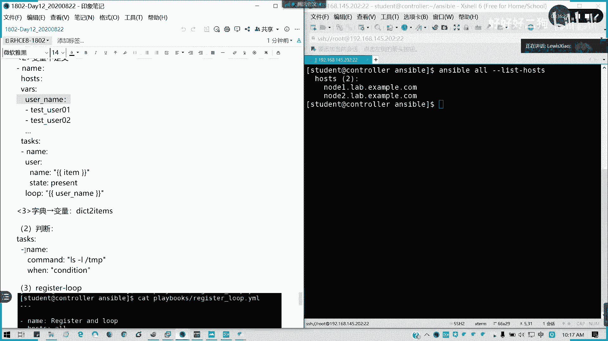

判断呢。加个5，对不对？比如这里用command，然后判判断喂我后面加条件，对吧？

然后还有register跟lookop结合，对吧？跟录相结合，通常说它调用的是一个状态返回码，和这个我这个例子啊，懂吧？存在一个注册变量，然后我再次用判断去输出。

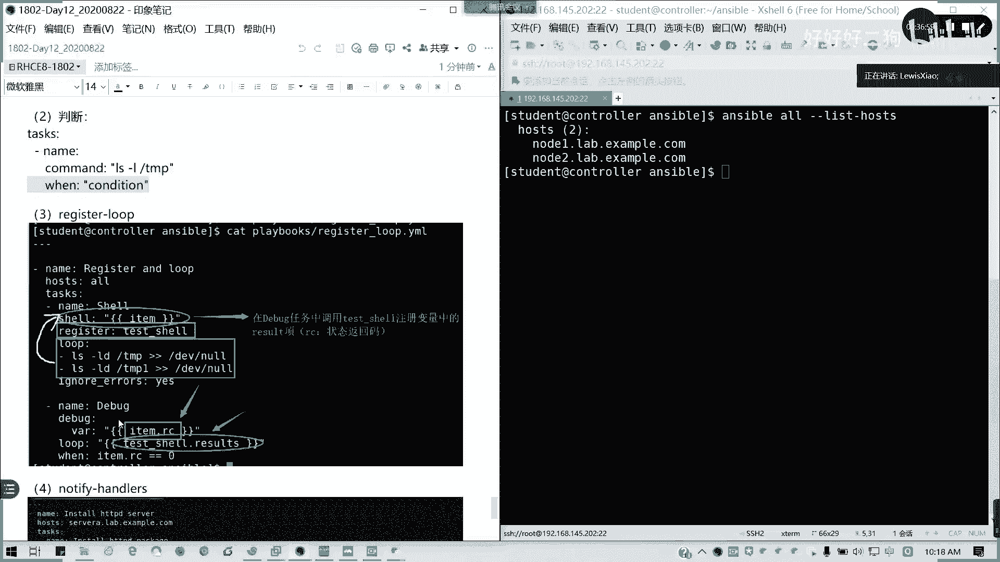

可以精细化筛选。精细化去做一个一个状任务状态，一个筛选。诶。

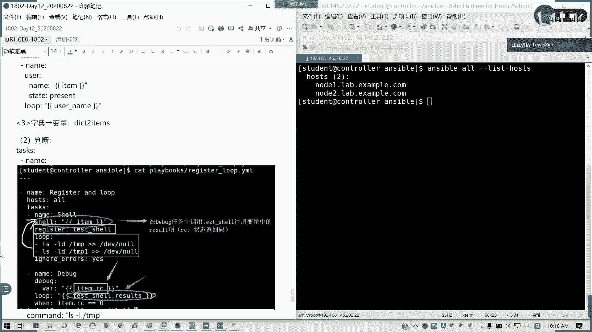

然后我们的一个触发器notify handle，对不对？当它的我们定义notify这个地方，它的任务状态发生改变之后呢。发生改变之后，他会。执行触发性内容懂我意思吧？当前仅当他的任务状态发生改变。

然后接下来就是我们一个处理任务失败。

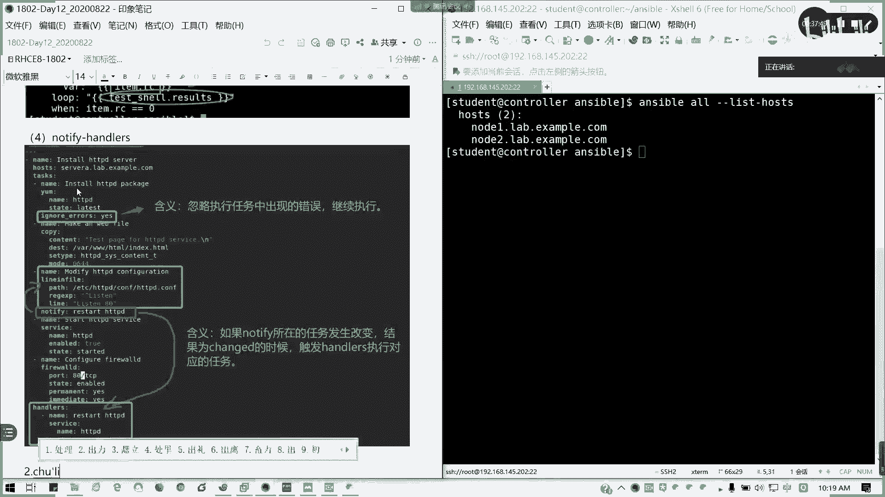

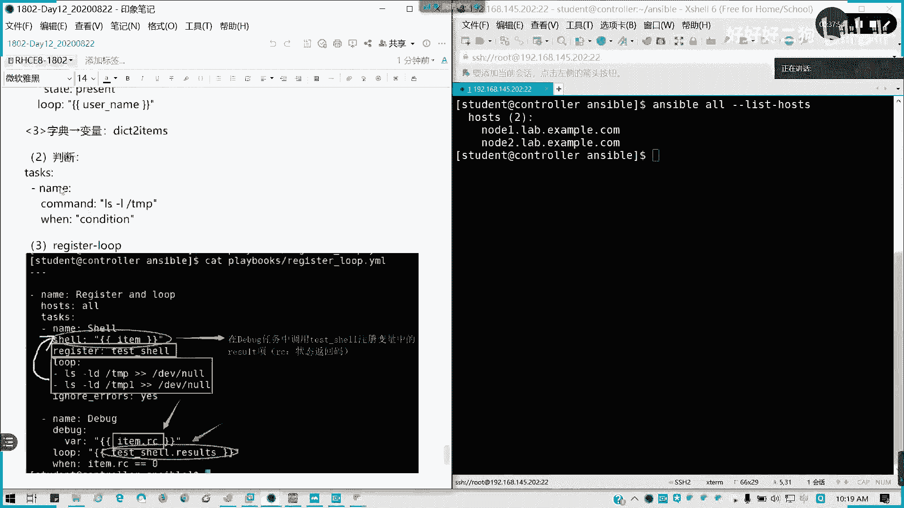

对我猜出来讲啊。

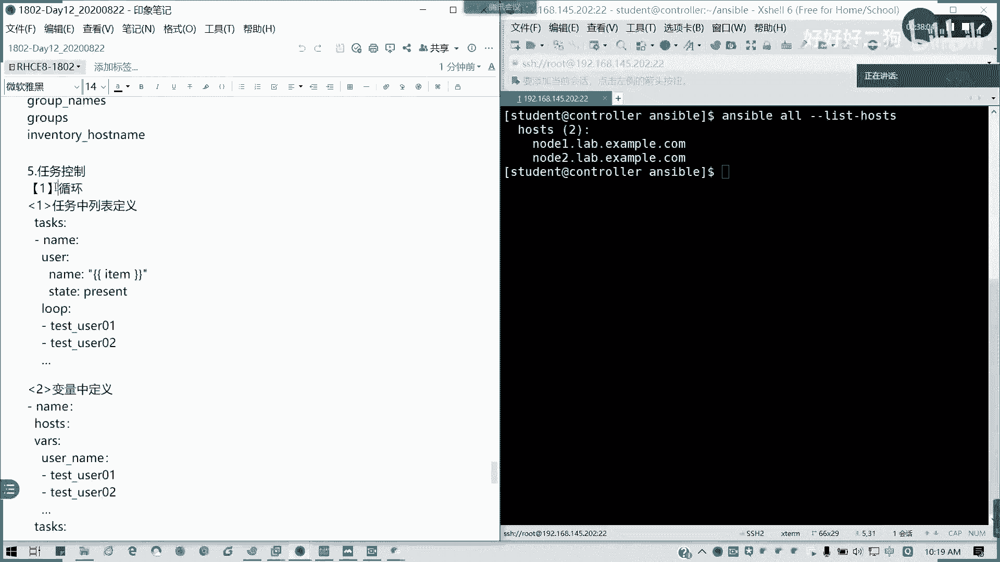

第六个，处理任务失败。所以任务失败呢，我这里刚好有一有一个图，非常的好。当时是我们我在另外一个班另外一个班国陪伴的时候啊，国陪伴的时候，一个中职老师。

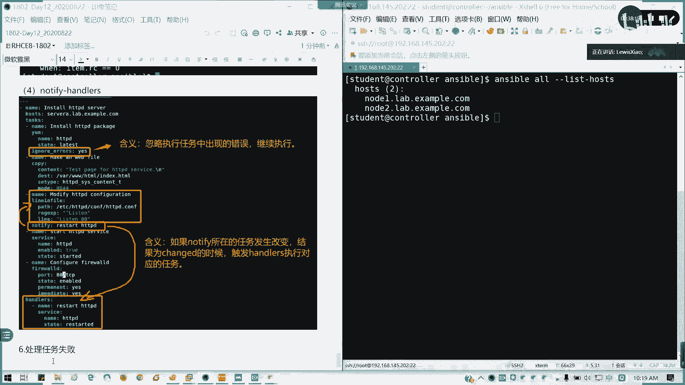

晚上啊就晚上为了消化去整理的一整理一个图，我会发给大家非常好的一个图。其实用这个图我就可以概括出一切了。

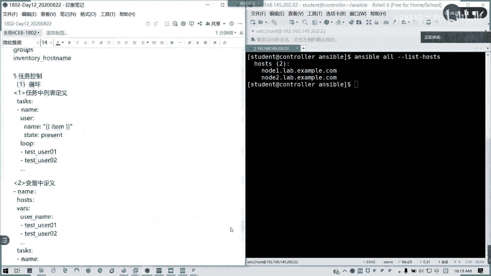

我发到QQ里面了啊。

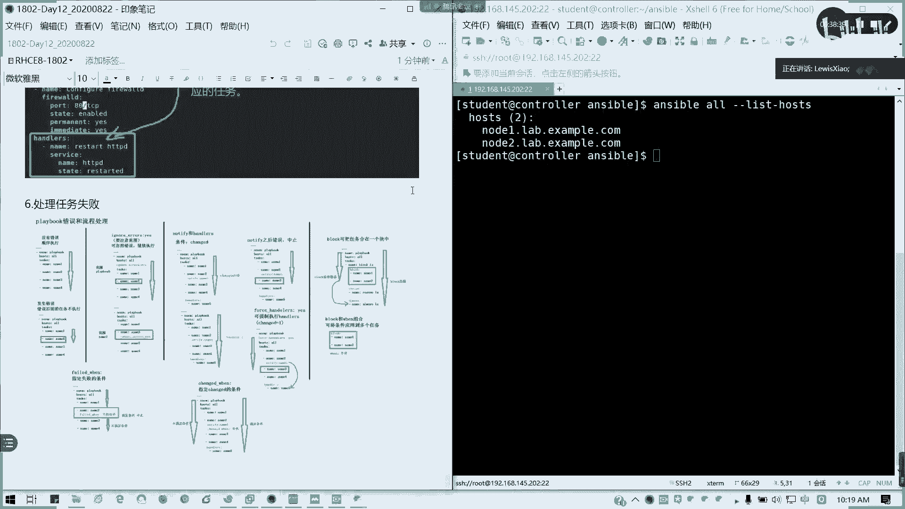

这图来，我这这里投一下屏，看到了啊。playbook流程错误之理处理啊，没有问题的话，没有问题顺序执行，对吧？发生错误的话，那后面就不执行了。这种这图能很容易理解吗？对吧？

然后如果我们加上一个ignignor errors等于yes。注注意范围哈，如果是全局的话，我就直接忽略错误。我哪怕出错了，直接把错误的任忽略掉，继续执行。如果是在。任务的范围里面。

那只是任务里面的这个。对吧。任务里面有效，但不是全局了，懂我意思吧？他只是忽略部分的。任务的语句。懂我意思吧？它的作用范围是不一样的，这是第二点。第三点，notification条件是发生了改变，对吧？

如果条件不改变，我就这样跑下去，对吧？如果条件发生改变，它会执行出发器里面的语句。但是如果发生错误的话，notify之后发生错误的话，它任务会终止。

但是如果加了一个forth tenderer就可以强制执行它。懂我意思吧？然后我们还讲了一个fd when跟chch when，对不对？feld web是人为定义。

他的错误就是说到底什么任务什么时候才是失败的。懂我意思吧？人为定义，我这个任务什么时候才失败，满足条件才终止，不满足条件继续。比如说我就执行我一个破命令，那我就可以我就可以人为定义说哎。

我这后任务我的状态，我的状态返回了码为零，我才是失败了。可以吧，然后还有一个劝主位，就是我的任务状态改变的一个条件，对吧？满足我指定状态的时候，我才会通常我们的跟nott法连用。

跟nott法hander连用。就通常我认为把足方式改变的时，我要不要执行handdoler的，我是不是可以人为的定义。啊，最后一天大家都基本上来齐了哈呃。前两天我看到你啊，然后呢，还有我们的brock。

brolock的话，我们之前都讲过，brorog是把任种合成的一个块里面。把任何的一个块里面出错的话，我没有错，我就直接执行。出错的话，我整个块就不要了，对吧？就直接跳出，但通常他要加个N，对吧？

可这样提提条件用的多扔务嘛。我如果是玩一下的话，我是不是我我我当条件判断为真的话，是不是我可以。去执行我的整个区块内容。如果条件为甲，我直接全部跳过。

然后当然它整个块里面有一个rescue跟always rescuecue就当flock出错的时候，我就跑rescue的任务啊。救援懂我意思吗？然后alway呢，无论他的任务是我在这个区块里面。

我执行成功或失败。我全部都会会执行。懂我意思吧？这个图就总结了。

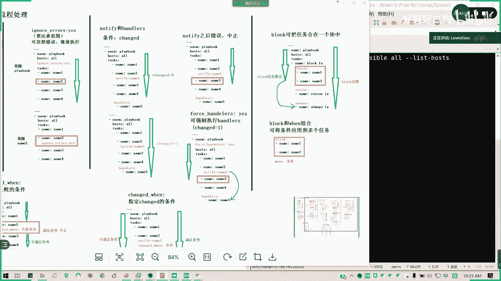

我我们要感谢沈电子的王老师啊，王老师帮我们总结这个图非常的好，对吧？我就不用其他的什么注示，我用这个图就可以可以解决所有的问题了。好。如果明白的话，请扣6。我第五章已经复习完毕了。

接下来给大家一个课堂的练习。

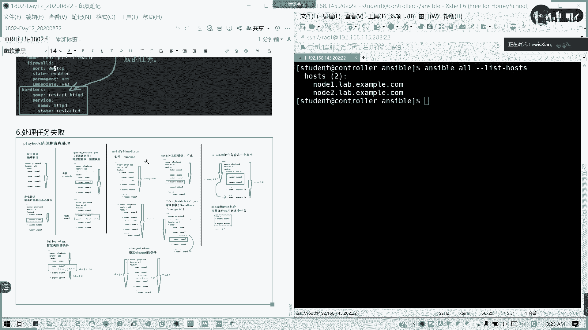

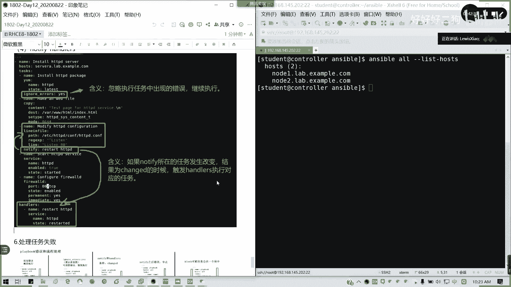

给几个给给一两个练习吧。这插作不太稳的啊，你如果三角的话，你直接插插桌底下。哎，我随机便了。没事没事。如果如果如果你不稳的话，你直接插座底下。因为我再讲没有用，我给大家二三十分钟的一个练习，好吧。

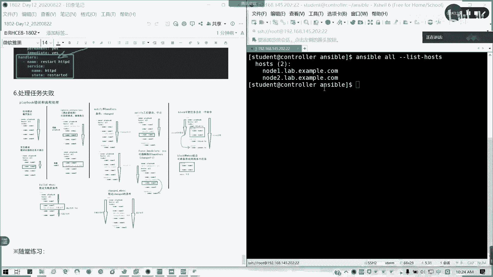

还是需要给大家做一下的。这是第一个练习。第二个练习呢。我看一下啊。

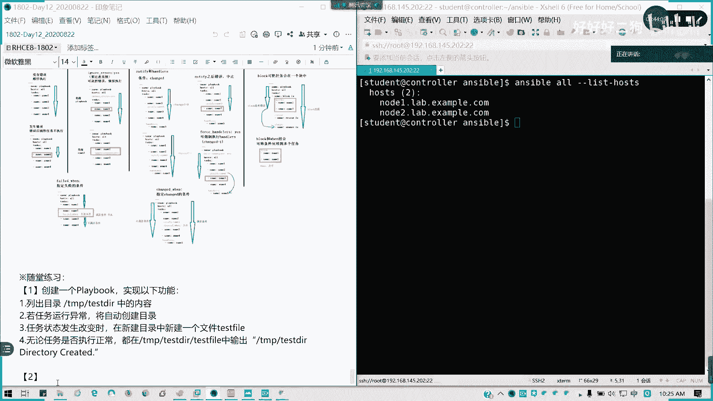

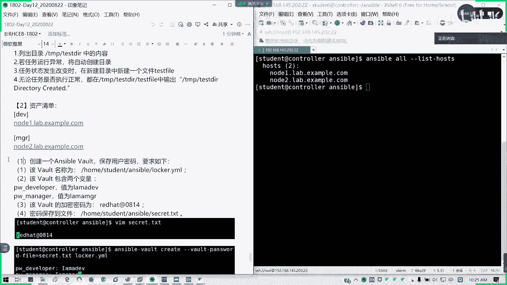

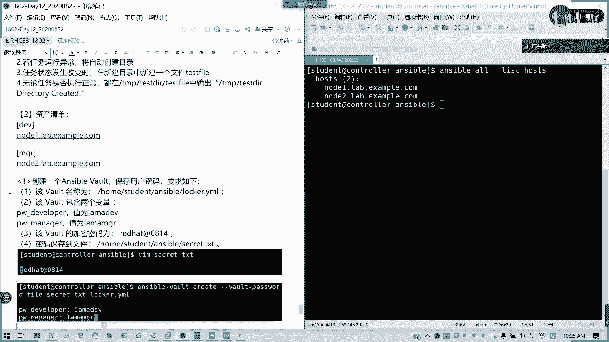

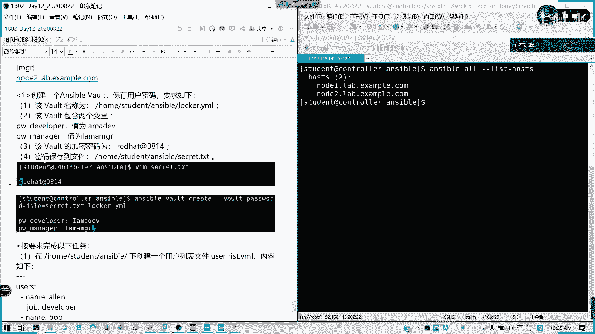

这两个练习我觉得应该可以。

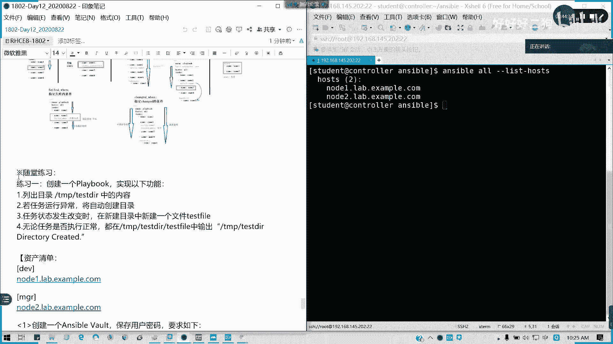

概括所有吧。

。

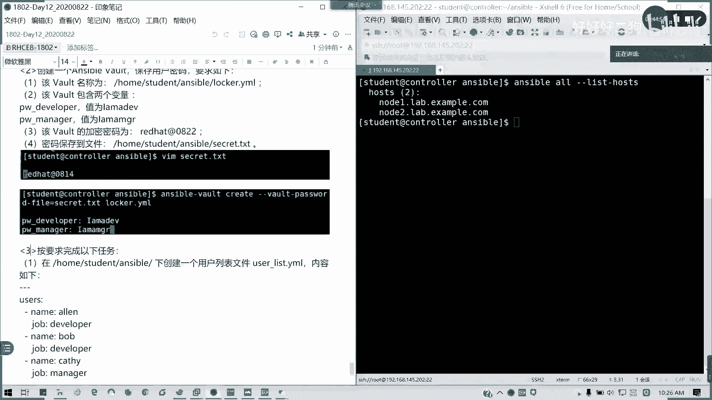

我把这练习我发到QQ群里面。给大家大概20到30分钟时间。好吧，来，各位。Q学里面有。讲归讲还是得做一下吧。综合就如果是练习第二练习二的话是一个综合性的大题。他还有第三个点，我忘了贴了。还有练习3。

那月三会用到电学校的分组。现在够不够？30分钟过完。太久太久没练了，对不对？现在干好练习给你们。我刚好把刚才把1到5章用过了一遍。对。你你为。我们上次讲到第五章，讲讲讲到那个任务控制跟。处理任务失败。

这几道练习我就你如果会的话，基本上签5张都OK了。11点我们继续啊。有问题可以在群上提问。然后呢，我们这边稍微休就连同练习啊。

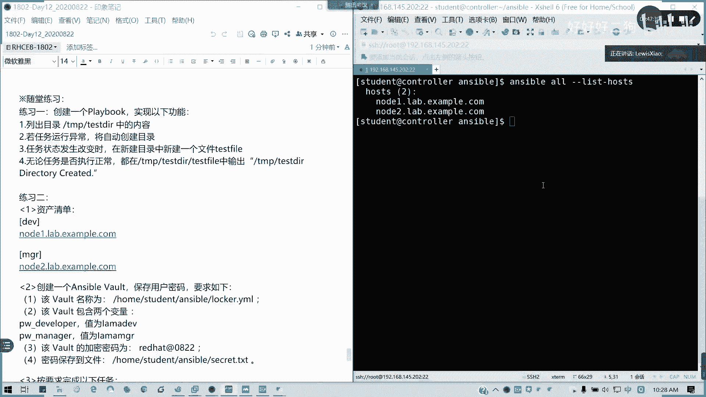

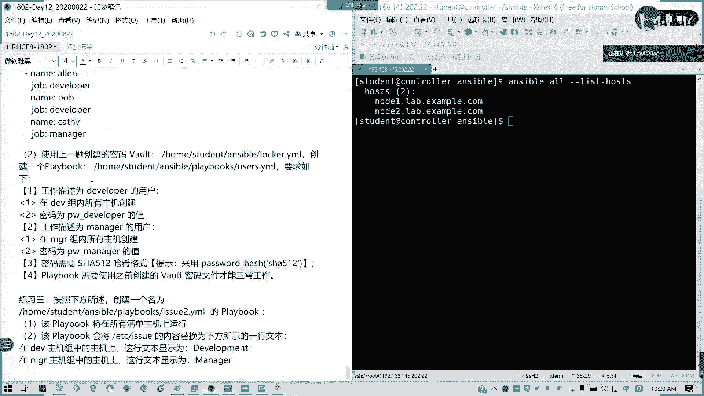

连同练习休息30分钟。稍后11点，我们会继续，有问题可以在群上提问。

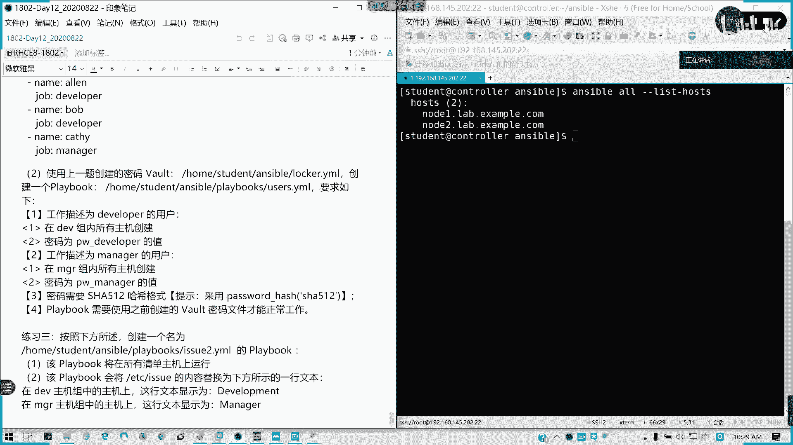