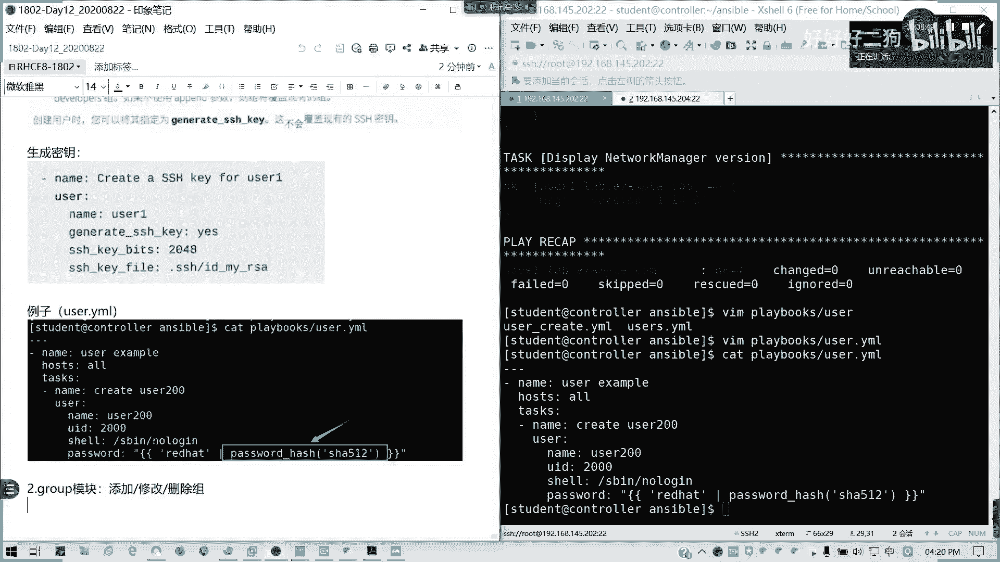
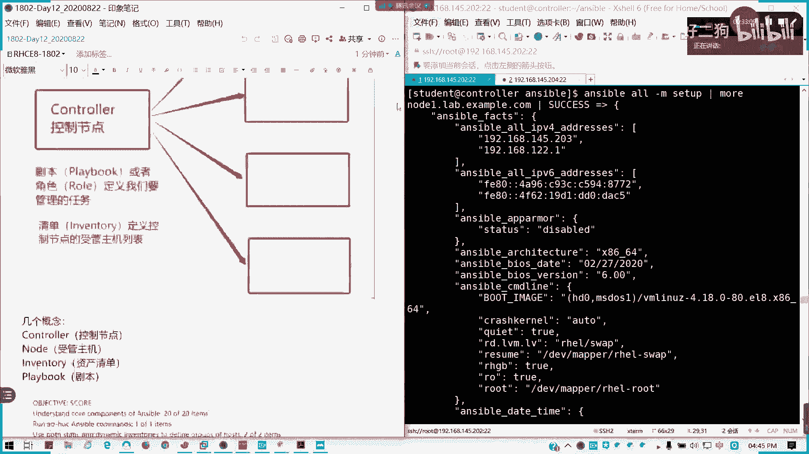
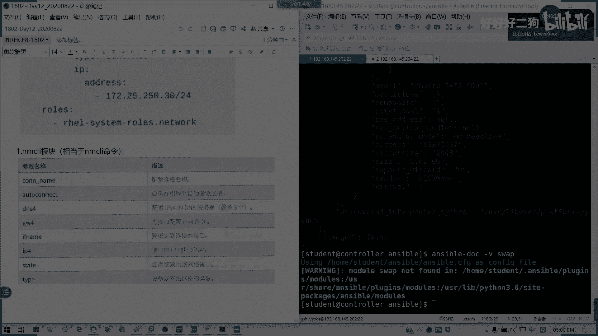

# Redhat红帽 RHCE8.0认证体系课程 - P75：75_Video_Day12_RH294_Ch10_利用Ansible自动化Linux运维 - 好好好二狗 - BV1M3411k77W

这一章呢我们来讲到使用。N。使用我们的anible来自动化linux任务。这的话我会把相关的模块我们简单就是我们讲过的话就简单过一下。没想到一个重点，像一个磁盘模块，我这里要讲一下。

使用S我们的书本上最后一张啊，是倒数第二张，最后一张总复习我们不用管。到这里软件包管理我们的样。Good。DNF模块。让你跟DNF模块都是拿来安装的。对吧安装软件包。我这个不用再再演示了吧。

都知道怎么用了。其实你这里把要换成DF是完全一模一样的。杨美和之有没有讲的太多了？Package factor。pa pass pet的话是收集。售管主机上已安装了软件包的信息。对吧。我这里我可以。

通过f package fat把把我们软件报型导出来，然后呢。在answable fat package里面可以列列到列出来。然后我这里加一个判断条件，就是我可以显示某个软件的版本。

比如说我这里的name manager，我可以选成它版本。你看前面的话，它会列出所有的我们安装的所有模块列表的的软件包的列表，但是列出来太多了。后面我只筛选了这个。懂我意思吧？我只列出了他的歌神。懂我。

懂我意思吧？

package模块呢我也可以拿来装，对吧？

拿后来安装我们的软件包，可以跟我们的类似于我们的y，对吧？其实这相当于我们RPM的一个模块参数。同样可以拿来装的package也是可以的。就我们现在装软件包有三种啊，对吧？

ymDNF跟package package都行。接下来。

PM杠K模块导入GPGK如果我们GPG是yes的话，我们可以通过RPMP来导入我们的GPG。但这个步骤呢通常会在我们部署软件仓库的时候，已经把它导入了。而而且我们这个例子呢。

只能在我们就目前我们这里是没有GPT的P的。我们在那个列习环境上面有。可以可以去试一下啊，这个地址是我们练习环境的地址，练习练习环境的那个软件在这儿。然后接下来我们软件包已经讲了，已经就给大家过一遍啊。

接下来。

用户管理。用户管理优怎模范我们讲的太多了。对吧。🤧咳。

创建屋生成密钥的话，我们可以用这个啊。

同样也可以，我可以用user模块来生成我的SSH密钥。就generate SSHSSH杠K，然后还有我可以指行它的位，它的那个。加密位数，而且还有它的一个。公钥的一个路径，对吧？都可以指定。

这里我就不详细讲。但实力呢。我们这里提到了一个。一个例子啊。优手联M这里的话其实就会用到我们的。我这里我用我我自己手打出来好了。有色联压某，我自己手打一个例子。

Useer example examplehos。老虎的任务是。这样子，然后调用我们优色模块。这也是相对比较全面的哈name user。200。UID。2000，然后他的sell是不可登录。然后密码。

可以采用哈希啊，可以采用哈希编码。加灭嘛，不是铭文。比如说我就输入密码是readdhead。Password。下划线hsh。然采用上512。我们今天练习是不是有涉及到？对吧。

好，接下来。啊，有些东西都是在。复习的啦。我们讲我们在第二天讲过的group谷模块。有些提到过的，我就。

给大家复习一遍。

懂了吧？这个我不用再想啊。创建组这个不用再讲了吧。我们之前是不是有例子的？group模块不用再讲了吧。我就简单切一下书的例子好了。

创建组。

其实这个不用再讲了啊。group我们讲的多了，然后有一些。还有像no host模块。在寿管主街。上的。龙。postst文件中。添加或。删除主机密钥。

我们看看。一个例子啊一个例子是在那个。例子我看书法上例子，我要解释一下。

哎，刚打字不见了。

这个是用于在寿官组件动hos里面添加三个组件密钥。它这里可以使饮水中入卡插件，然后去。调用我们外部来源的一个频据啊。然后还有一个这个我们通常我们比较少可能比较少用到。如果你后面跟有搞到一个授权的话。

那就需要的。那后还有一个叫做ize case。Alsoize kiss。未用户。添加或删除SXH授权密钥。同样也也是看这个例子啊。

可以通过also case模块来直接添加授权密钥。授权密钥的话，你证明哎，我就是我就证明我是好人，对吧？我把ki key添加里面，然后只要添加到公应通从公钥添加，然后也可以从UIL去提取这个密钥。

这个就是我们的用户管理模块。第3个。进程管理。这融管理我们涉及到的有一个。艾特魔怪。是不是我们讲过任务管理里面的一次性任务啊？一次上务任务的话，我们有一个。参数啊。可骂的是吧。交易层命令，然后单位数。

还有的。现有脚本文件，然后包括它的状态，还有座椅的运行会不会再次及执行，还有我们的时间名称。unit啊单元，我们这里可以写一下。艾特等下宝。那是吧，艾一张包。然后呢，host。note一。然后呢。

task我们的任务。这个这这个看一下我我写什么任务呢？🤧咳。比如说我添加一个叫做。右手201的1个任务吧。然后用艾参数实行一次性命令IATTATcom。直接写。我这里用引号引起括起来吧。

user adduser201。然后呢，count。就一次性我在多少分钟之后运行，比如说co等于3或者22分钟运行运行。然后单元。是minus。Unic。yes对吧。unic就是一再运行。

它不会再次执行了。う嗯。

那我们来看一看啊。

嗯。好，劝制成功。我们我们用一个N字回个命令来看一下。

看到没有？一个任务已经出来了。这不两分钟后啊。

好，我们有一次性模块，一次性任务。那我们就有。Cme模块。也就是他是一个周期性的任务。将。任务写到。指定用户的。

框态里面。参数。

这有special time就一系列的。重复数现时间，然后state是吧？present是出创键F删除，然后。confi如果有大量的服务器文字需要维护的话，我们需要有一个预先编角的一个文件，对不对？好。

我们来看一下。可电压吗。那我这里。前面啊。嗯。🤧C模块。然后这里我可以。他名字。执行用户，比如说。🎼是root或是对吧？或是我写stdent也可以。谁来执行这周性任务？然后这也可以定一时间。

minutes是吧，比如说我写0our，写凌晨1点是吧，凌晨1点，然后job。执行什么呢？比如说我打包是吧？这样可以吧。

就相当于他会把。没有，这是一个计划任务。把一起打包做备份嘛。作本子里面写明任务的内容。

🤧欢师宝。playbook我看看一下cro。嗯。5860啊。这一个警告啊。

那么看一下。我执行一个Cown tab。有了吧。他会写帮我们写到。cont里面，然后这个name呢会写到这里来。明白了吧？然后接下来我们会继续讲两个系统模块。

service什模块是等低模块service什模块我们知道了吧。它是有两两个模块的。其实像sstemD呢。它的功能会比service更全。用法差不多啊。用法差不多，然后。如果这等地他允许守护进城。

重新加载就守护的进程，它会允许重新加载，但是但是service不行。然后还有一个就是我们之前没讲到reboot。

reboot模块呢。它是比shall关机更加安全，它是这样子的，就reboot，我可以在运行的期间，我可以让我们让我的受管主机关闭，然后再重启，对吧？然后再继续运行我的剧本。

后面我可以加太帽的话，就是一个延时。那我们后面在他这里会顺便讲到一个sll。还有 command曼的模块。

官方解释啊。

他也可以交换一些任务，但是就是说为了更安全，所以的话某些模变量不能用流硫操作服就没办法操作，对不对？

像税友的话。不用讲了吧。有时候要清理变量呢，我们通常就包对我们的管道服。那我们的command这些事例的话，我都在直接在书本啊。因为因为这些的话我们就不再细讲了，我们都讲过了。

这个讲过的对吧？不再重复。然后还有一个叫做。Anible下划线烟V。列表。我可以啊通过连接安色不收款主义上收集事实，然后呢可以访问环境变量。有一个子列表，它包含所有的环境变量在。在里面的啊。🤧咳。

通过S我EMB来获取。然后呢。总任务。打印所有的。环境变量。在艾特里面，然后点bug。我这里少了一个空格。第bug。在这里M追。但我们可以采用low look up插件。来返回变量。

安色候看EMV等下号。

はい。

它显示当前的ensible所有的环境变量信息。

所有环境变量全在这儿。然后第二台机也是一样的。露处也是一样的。OK answeribleEMV我们的一个系统管理模块就补充这些内容到这儿。接下来。有一个。存储。赛叉还有那个防火墙模块。🤧我们先讲一下。

赛套模块。这以套模块呢我们默认啊。默认情况下，我们在收集实在运行任务的收集事实的话，他会去收集我们的是S fat，对不对？所以我们通常手工执行S杠M他然后我可以加一个过滤器。

书袋多的话，我们可以用frer。对吧用非ta来过滤一下，像我们这里anserible。哦。杠LC套是不是里面？一堆东西。是不是太多了？蒙可用非er。F filter我们来过滤我们是我们的信息。

像这些的话是不是有些是。

不需要的对不对？

不需要的话，我可以用S我 filter。

Anible。比如说S我杠。然后我这里可以用杠A。shift过滤器等于。Ansible。deices比如说我我只显示我们的设备。

对我就只说出我的。设备这一块。

其实像M次活杠MC套破实在太多了。

么回到前面去了。

是。当时图又没了，因为它同步之后呢，他他会就是说同步一分钟前内容所要更改的笔记老是不见了。🤧咳。然后接下来我们来讲。存储。存储模块大家很关心啊。就是说我会我们在ible可以用它如何分区。存属管理。首先。

我们来这是第五点哈第五大点。存储管理。首先我们只讲到一个party用来分区的模块。party的模块主要用来分区用，是现当代替我们F disk相差呢我们的一个party文party命令哈。

我们来看参数，像分居对齐啊，快设备啊。

对吧三区编号啊等这些，我们直接看这个例子好了。说上这个例子其实我觉得也OK了。

其实这个是调相当调我们party命令。就是那个很难用的那个。

书上例子是这样子，比如说我要创建1个10GB的一个分区，然后使用party，我这里第一个device，我指定我的要分区快设备。然后后面number是分区号，第三个sstateay present。

是不是我要分区可用，对吧？第四个，我的大小用part and不是star啊，用part end。来指定就可以了。就相当我们在第八天第七天就第八天时候我们讲的词万的一个part命令。他用法在这里。第二个。

LVG我们的逻辑卷。和LVOL我的卷组跟逻辑卷管理模块。嗯嗯。嗯，LV区是用在卷组管理。它的参数啊有PE sizeize，也就是我们的。物理单元的大小对吧？然后PVS它是设我们的物理卷的设备列表。

VG是卷子名称state。分 present action可以用来添加删除物理卷，对吧？有么卷组对不对？那么还有1个LVOL。这是创建逻辑卷的。

这里呢我们的练习会涉及到。逻辑键名称，然后我可以调整文件系统大小，是否使用收缩逻辑键大小是吧？文件系统跟逻辑键大小不一样的啊。然后呢，有没有快照啊，创建三度逻辑卷以及它的附卷组要指定，对吧？

我们逻辑卷是不是要依靠卷组的？然，我们看几个例子。创建物理学PV。

看书上例子就可以了。然后因为时间关系我们我我就讲一下啊。因这这这个呢是通过我们的。指定我们的物理券啊。指定P来。创建。微G我们的卷组，对吧？这是例子一。李泽。一子是。默认设置来创建一个微G卷子。

就我可以。调整啊。嗯。

调整套物理去。

Res volume group。对吧我可以把VG1的。我刚才是BDA是吧？他的他的物理券PV。为VDA是吧，这是调整它物理卷为VDB。能理解吗？采用LVG，然后创建LV。

接下来就创建逻辑卷。

う。🤧嗯嗯。大小为两区B。用LVOL，然后VG参数指定我的卷组。LV指令螺决的名称在指指令大小。可以理解不。LVG跟LVOL。第3个。Fire system。当RC省模块主要是用来创建和调整文件系统。

相当于。MKF S。

看参数就知道啊。对吧快车名称、文件系统类型。这是不是相当于我们把CSA的东西再过一遍啊？嗯嗯。我创建一个文件系统DBVDBE然后。我的文件性为叉FS，这是不是格式化呀？

是不是相当于我们把那个CSA的给西过一遍。所以你知道艾我跟我们的CS我们的基础信用管理其用在这里蛮好的。所以用了这个之后，我相信你以后如果大规模管理你不会再去写需要命令了，直接通过他们都可以，对吧？

然后还有moote模块。帽子部分我们讲过。在我们的EDCFS tab。中配置过载。

他的我们里面如果执行我们的剧本之后，我们任务之后呢，它会在。

ETCFS type里面直接生成一条记录。

比如这里我用UID来挂载我们的。一个文件系统，然后它是叉SS啊。

将指定。UID。的快设备。叉FF文件系统格式。挂载到。永久挂载到data挂载点。懂我意思吧？mountote里面pass是我们的挂载点。

就挂source是源头FS type是文件系统state present。然后还有一个交换分区。当然目前安ible呢。目前，anible。可能暂时还没有那个。交换分区管理的模块啊。我看现在有没有。

如果有的话，应该是有个swi的。没有啊，对吧？如果说我要实现的话，就是一个。可实现的方法。可这些方法我们可以这样。我们没有这个模块，那我们。可不可用命令啊？

可不可用命令啊？对我使用LB去个LVOL我是我设我是创建1个LB之后呢，是不是我可以MKFY啊？用command或需要命令，对不对？完全可以啊。

所以这是一个。实现的一个思路啊，当前的实现思路。然后我们最后讲。网络管理网络管理，大家现在啊。在anible rose里面。beible里面啊。还是不太成熟的啊。所以这里我简单讲一下。第一个我他主要。

主要应用到稍微延延后大家几分钟时间啊，几分钟就可以了。主要用到系统角色。其实我觉得不太好用啊。这叫做RHELsystem rose点network。他主要动态不太完善，主要是。所以通现在我们很少去用它。

像当然我可以你大家可以试一下，试一下我们这个task可以这么写啊。

我会通过变量，通过那个。

通过这个rose啊，就定义好变量，之后通过rose去实现。

但我自己个人是不太建言，因为它的那个功能还是不太完善的。因为目前很多的一些系统角色还在研发的阶段。

对，在这里说主要会就还是带一下。然后像我们的。MNCI是吧。有点卡卡一下啊，因为他格式有点没对齐。

这我们接下来讲几个MSCI模块，简单说一下MSSCOL模块呢。就是相当于我们的leval manager client这个命令。对吧连接名称是我引导出激活就自动连接。

然后还有呢配置IP地址DNS网关绑定的端口类型启用禁用，对不对？

我们的简要例子。配置网络。对吧MCI call这样子我们也可以配，嗯，就不一定要写。当然最然方便的还是直接改我们的。直接改组配置文件还是最方便的。然后还有另外两个东西，一个是ho name，改主机名的。

改主题名字叫ho snap。修改售管主机。

的主机名。这里直接我们用。

post step是吧，模范，然后nameap写完就可以了。然后最后一个就是我们已经讲过的。防火墙。发D模块主要是拿来配置。防火墙的规则放胶规则碳参数我们之前已经有提到过，我们这里再用表来稍微回顾一下。

然后两个例子可以对照，但是这里的话我们。已经讲过了，在默认区域，也就我们的public。中配置防火墙规则，还有我们自定义规则。

包括我们的。

不规则。在我们的第二章。有点卡又卡了哈，稍等一下。哎，又卡了。

哎，又卡了，所以刚才一卡的话，我这个东西就没了。

然后我们两个例子，其实的话都是我们见过的哈，见过的我先把那个字再调一下。还有两分钟，我就讲完了。其实这些我都不用再去具体去做什么演示了，对不对？上翻我啲。在梦区public中。

配置规则配置防火墙规则我们也讲过了。

对吧我们的比如说我们使用HTPD我们刚才今天。讲的利以提高我们的。此级到练习。

在指定区域是吧？

比如说我要在外网区配置的规则也是也是可以有的。然后还有一个负规则都知道了。那好，这这个第十章我们就提到这儿。然后我最后最后的最后。我给大家。刘。留一道留留一道相关的个相关练习。

在我们的练习里面会提到一个。磁盘的东西啊。作为课后练习。有几道关有有一些关于我们的磁盘练习，可以就是说关于我们的自动化。管理模块的这这一块可以给大家练到，稍等。这个是创建我们的一个。Playbook。

创建我们的一个我性使用使用我们的。剧本啊。来创建我们的playbook。这道题留给大家最后啊最后的我们最后的一个练习。我觉得这这个的话可以去去做一下。他的要求还是蛮多的。从我训练起，如如果。

希望大家到时在。群上啊在群上可以把答案发给我，到时候我可跟可以给大家做一下简要的分析。所以我们12天啊12加10其实是13天，我们是有6天加了一个小时的。我们所有。包括ensible我们讲了4天啊4天。

然后包括包括我们前面8天技是我们所有的。HCECSA跟C两个部分的课程到今天全部结束啊，一分东西都没找了哈，就按照课程表里面一分东西都没找。然后接下来呢如果报了9月底的。

9月底考试的各位可以在9月6号13号来我们的一个综合练习来做一下一个消化跟整理啊，就就得我们两天时间，9月6号13号两个周日，然后希望大家能够笔记稍后跟视频一起上传。

然后呢希望大家能够趁这段时间好好复习。当然如果有想重听或者是就是说想重听的各位呢，可以跟我们的校务老师咨询。下期预计是9月初啊，9月就后开发。所以这段时间很感谢大家各位支是现在现场的话。

终于多了一多出了一个人了哈，都就至少一就原来是一直一个人陪我的哈。然后啊如果各位啊。如果各位能呃能够对今天的知识能理解的，请扣个Y告诉我。9月。复习是？9月6跟13。9月6号9月13号，我们是那个。

我们是一个综合练习，也就是我们一个以练习题来作为巩固的一个时间。今天我讲的内容会今天的内容会有点爆炸啊。PPT我都看我我的PDF我看了一下，都好像有七八十页了哈。对啊，两个中日。

就专就以我们以练习来来代复习。练习在复习，然后当然都是为了我们的最终目标嘛。今天的PPT都12。今天的我们的PDF都已经有1212兆这么大了啊。好，那我们所有的课，我们这一阶段的红帽8。

0的课程到这里结束，非常感谢大家啊，期待我们到时在我们的。综合练习，上面可以这样蹬各位。好，辛苦各位啊。

