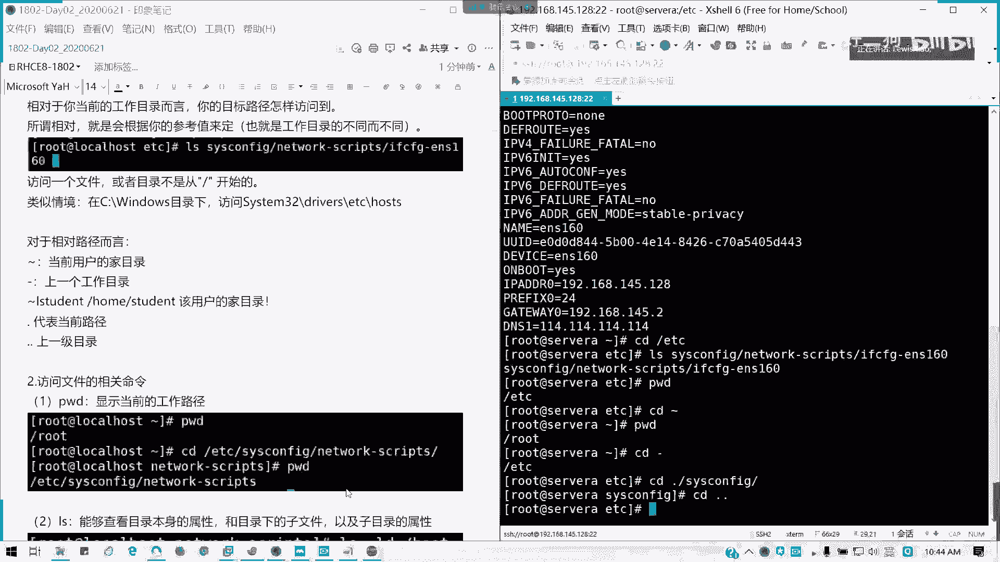
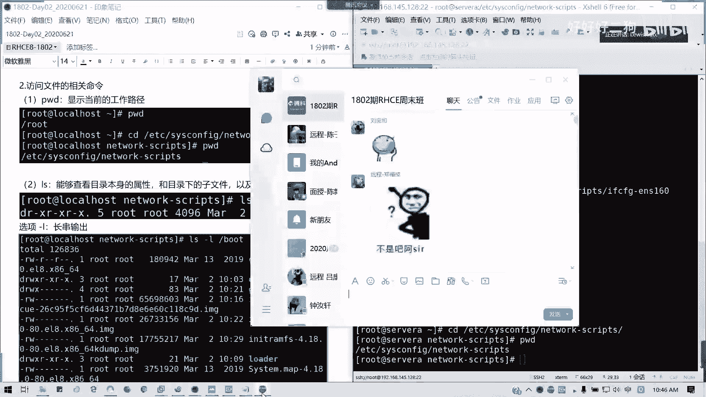
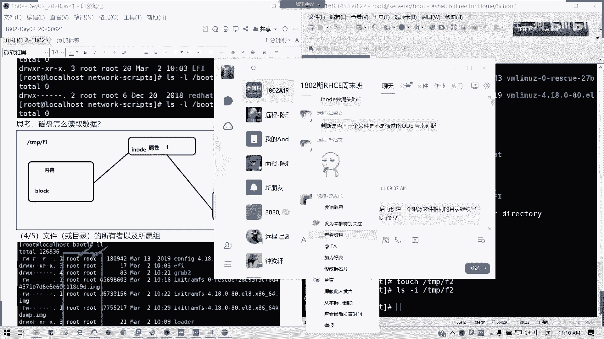

# Redhat红帽 RHCE8.0认证体系课程 - P7：7_Video_Day02_Ch03b_从命令行管理文件 - 好好好二狗 - BV1M3411k77W

我们回来啊，我们看到刚才是不是有人提的问题啊，这个问题就是说那个王子龙提的问题啊，为啥usr听之前听老师讲啊，全称就是unit system resource，这个没有错啊，没有错。

我们刚才已经讲了对吧，不是用户目录啊，不是用户目录，不是用户目录啊，记得我们是所有的那个约定俗成的linux软件包，我们都可以装在这放在这，所以的话这个的话大家请不要误解啊，不要误解成那个用户啊。

这个不叫，所以我不读user也是这个原因，它的usr它是三，它是那个unit软件资源对吧，因为系统软件资源的一个缩写，它这个它是这三个单词缩写，所以的话我们这里不读优势啊，不要弄错，所以你的理解啊。

你老师给你理解是对的，好那我们接下来我们讲第二章啊，有没有其他问题，我们讲第二章，刚才稍微久了一点点啊，unit shop where are。

resource，看看resources system或者shop where are都可以啊，系统资源和软件资源都可以啊。

我们在这里的话，其实在这里的资源是相对啊，相对来说shop very resource会更好啊，因为它是软件，不是系统资源，懂吗，他这种资源它只是占了部分，但是它软件资源呢我可以装。

就我可以把软件装到里面懂吗，王思聪，这资料我去查证过的，查证过的话，这个是没问题好，那我们接下来我们看一下，我们回到我们课件啊。

回到我们课件，我们看一下那个主要内容啊，我们当我们讲的主要内容。

就是如何通过名称去指定文件，我们这里清一下屏。

我看一下我的开启录屏没有啊，开了啊，首先我们在使用我们访问文件的时候。

是不是我们要知道它的路径啊对吧，如何去定位一个文件，首首先啊就文件目录我们统称文件。

因为目录车是一个特殊的文件，对不对。

所有在linux系统里面，一切皆文件包，我们的设备是吧，我们的配置文件，我们的引导都是文件，包括我的目录链接等等。

我们可以可以认为一切皆文件啊，然后呢如何去访问一个目录。

对不对，我们一般从根挂载点开始访问，比如说我们的网卡配置，对吧，我们敲的多的话，基本上不用tab就可以出来，对吧。

是不是我们的那个网卡配置，它是不是从我们的目录，我们文件是不是一级一级的，从根开始，etc目录。

six config目录，network secret secrept目录，就网络脚本的这些目录。

然后后面我们的网卡配置文件的名称叫做，i f c f g g e n s1260 ，对不对，所以我们上图里面啊。

它就是一个绝对路径对吧，什么叫绝对路径，我们可以理解为完整路径可以吗。

比如类似情景，比如说我们c盘的windows system 32 drivers meetc hosts。

这个文件知道改怎么用的吗，做什么用的吗，这个文件知道做什么用的吗，就相当于我们的linux下的etc host。

我们做硬解析用的，什么叫硬解析，强行将域名跟ip进行一个捆绑。

也就是说它不通过其他互联网的域名。

我们的域名系统dns去查找，直接以他为优先对吧，你在里面指定你的ip对应的域名是啥，这是啥。

它们两者的关系是相当于在本地范围内生效，在你当前的主机的范围内生效，懂吗，这是硬解析哈，我们通常通常域名。

如果域名解析服务器是不是要钱了，对吧，我们买域名解析服务器不要钱的。

那这种硬解析呢就是我们实验环境，我们通常会使用。

然后我们在，没有你可以太补全了，但是我建议大家如果能够记的话，就直接打拳就可以了对吧，你可以tab补全了，如果没有tab怎么办呢，你就补一个包呗对吧，那如果不能补了，那你就只能只能自g了，对不对。

懂不啊。

我已经说了，然后呢，什么叫相对路径。

相对路径和相对你的工作目录而言，可能要工作目，我们前面这一串就工作目的，也就是你当前所在的目录对吧，那我们初始目录呢就是我们的用户，每个用户的初始目录呢就是我们的家目录啊，他就是说相对于你的工作。

当前的工作目录而言，你的目标路径要怎么访问到对吧，比如说我们的我们进入一个etc目录，那我们这里的话我们就列出我们网卡文件，那相对于这个目录而言，是不是我直接用cs configure是吧。

network to the script，然后i f c f g对不对对吧，这是相对于我们当前是不是在e t c目录啊，对我们p w t，是不是可以列出我们当前的工作目录，对不对，e t c啊。

所以呢它是根会根据你的参考值来做决定，所以参考值呢也就是根据我们的工作目录，里面的文件的我们不同啊，公众的每个目录不同，我们就可以，这个情况是，就是说这个情况是根据你的工作目来做决定的。

就类似于我们在c盘windows环境下的目录下，我们访问这个访问system 3的这个是吧，是不是相对路径啊对吧，我们工作目录已经在c盘windows下面了，对不对，然后对于相对路径而言呢。

我们的波浪是吧，我们的波浪线我们讲过吧，我的波浪线就是相当于我们的家目录对吧，然后上一个工作目录，我们用我们我们比如说我们加入，我们上一个公路，我们不用杠对吧，上一共做公众目，我们用用杠来表示。

然后比如说这个student的话是吧，用户的加目录是吧，如果是student用户的话，我们的加入是不是home student呢，没有错吧，然后点代表当前路径啊，比如说通常我们访问一个一一个文一个目录。

比如切进去点杠cs，but confic，对不对，也是一样的，对不对，点的话就是当前工作目录路径，然后点点，做上一集大家明白吗。

有疑问啊，有疑问及时在我们群里提啊，可以随时打断，我会看到大家，因为如果看到我的我的qq图标在闪的话。

这全图标的少我就知道了，然后呢访问文件的相关相关的命令哈，比如说我们现在在加目录的话，我们p w d显示当前的工作路径是不是root对吧。

那我们切换到一个网卡的网卡的配置文件，工作目录，etc cs config，net works script，对不对，我们在p w d一下是不是当前的工作的工作。

完整的路径，完整的工作路径是不是这个这是p w d的用法，我们接下来这一章我们讲一些基本命令，大家可以跟着操作，不要再看啊，所有远程现场的面授同学都是，然后呢，我们l s啊。

各位其实基本上我们这个班好像没女生了对吧，远程我不知道有没有现场全是一堆啊，我们我们叫做那个马大楼。

对不对，因为我上个班是有女生的，上上我上课讲个班是有女生的，女生有时候真的解释会比较费劲一点点啊，那没关系，女生的第六感非常强，所以的话如果他一点就通的话，那基本上学这没什么问题啊，和尚没有。

我们至少有头发哈，没有女生是吗，我们讲第二个命令ls s，有诶我你是女的吗。

什么叫需要的话，我可以是你监是女的，然后好好行，我去那个什么整形就把你那个切了哈。

这个我们开玩笑，我们看一下第二个命令l s，这个命令我们用的非常多，它是可以显示目录本身的一个属性属性。

然后呢或者是子目录下此文件以及子目的属性，也就是说它可以列出属性用的啊，比如说我们这里的话，我们显示boot文件，我boot文件属性，那怎么怎么弄呢是吧，我们l s它默认是显示下面的文件，对不对。

如果加l的话，它就显示详细的信息，就像这里的话，后面加个d就显示目录的属性，对吧对吧，然后加上杠l的话就是一个长串输出，懂吗，长串输出也就是我们的具体的每一项啊，l l为什么l l。

有时候我们在ensable里面用不了呢，我想提大家一个问题，你我知道你陈启鑫说的啊，l l等于l s杠l但是为什么你用不了呢，我们在我们为什么在那个enable里面，我们特别是answer有没有试过。

我们调用那个模渲染模块里面，是用不了l l这个命令的，但是我能用ios杠l为什么对第三方说的对，他是别名啊，它是我们定义在操作系统默认定义的一个as，一个别名，但是ios我这个我教大家怎么做啊。

第一别名，比如说唉你不要你不要玩这种东西啊，不要玩这种东西啊，千万不要玩这种东西啊，有对吧，我之前我我学员给我的这个例子啊，千万不要玩这种东西，真的有啊，有有人就乱提别名，结果cd命令直接一个锅。

直接直接就整个现在就报废了吗，真的有这种东西的，所以这种别名不要乱定义哈，好奇害死猫啊啊，不害死人了，现在，有真的有，就是我只对没有，他找你喝茶喝那种什么可以聊人生的那种，然后第三天你就不用来了对吧。

这个茶艺很意很深啊，不是龙井，不是普洱，也不是绿茶，对不对，好像学到什么不得了的技能，这种千万不要啊，千万不要啊，我这是一个反例，入门等于入，从入门到入狱，从入门到从那个开始到放弃，对不对。

我们ios长串输出字母相当l l一样的对吧，然后长串输出我们的用法我们解释一下，首先第一列代表你的文就这一条啊，我们写的是这一个地方啊，我们这里笔记也有啊，都打出来了，那我撤销行不行，撤掉撤掉，好没了。

你们敢听我拍死你们啊，然后呢我们看一下啊，看一下我们的文件类型啊，我们左边啊，我们从左到右来看啊，你们可以在你们的自己电脑上，比如说你打l s杠l，然后你们任意一个目录啊，我们看一下哇。

然后呢二次元都出来了，好吧，我们看那个文件类型哈，我们文件类型前面的这一列是文件，文件类型，就是最边边的最左边的那个一杠代表文件，代表目录是吧，还有l代表我们的链接文件，我们可以简单理解为快捷方式。

比如说我们的etc是吧，ios杠l etc cs config里面的s a linux，我们后面会讲到这个sa neux的东西啊，他这个是l然后后面有个没有看到，它是相当于一个快捷方式。

也就是实际上它这个只是一个快捷方式，一个符号链接，它是一个软链接，然后连接到上一级目录sn ex的config，实际上也就是他我们访问这个文件，相当于访问它懂我意思吧，这个先给大家一个概念。

待会会教大家一个软硬链接到底怎么回事啊，只有一句口诀就可以记得清楚，这里我先给大家一个概念，l是链接文件，第一我看一下l n杠s跟杠杠s软件接，然后硬链接呢，是快设备，看来很多人有基础啊对吧。

这我们看到我们的第一块磁盘，我们装的是不是m v n10 mm 10，m v m a0 n e对不对，它是一个快设备，就比如说我们磁盘是吧，我们存储它是就是为什么要快设备呢，它是它设备上，它它是一个。

就是我们文件是存储在一个一个块里面懂吗，一个区块里面，所以我们叫快设备，第一全称叫rock对吧，l我们全称叫link啊，l i n k链接d的话，directory目录对不对，然后呢还有一个套接字啊。

套接字用于通信的一个文件啊，我们套就一个叫s啊，如果我们有装my circle的话，有装mysql的话，这里我就不演示了，如果没my circle的话，它有一个如果大家都知道啊。

我们的mysql是mary db的话，它有个套接字是吧，mysql等sock啊，懂吗，它是个套接字，文件套接字做什么用呢，它是用于服务的链接对吧，服务的链接我们通常如果最差一个知识啊。

如果我们连接那个mysql啊，mysql我们连接的方法大家应该有接触过吧，或少有些多多少少有接触过mysql吧，mysql链接方式有两种，一种是通过tcp ip协议，我们就是ip加端口，对不对。

是不是我们可以连带我们服务对吗，我们这左边的例子啊，是不是可以连带我们服务，像这里是吧，带杠p后面带端口，对不对，第二种直接通过套接字，就是mysql的话。

后面杠大s socket也可以连接到我们的服务里面，这个知那知道套件是做什么用的吗，通信端口用来通信的作用啊，用来做我们的远程，或者是我们的就是跟我们的中间件，跟我们的服务做链接时使用的。

它的通常的套件是后面文件的后缀是点sock，s是套接字，然后还有一个就是c，字符串设备对吧，然后我们这里有一篇文章叫做字符串，字符设备跟快设备的一个区别。

诶这没没事啊，他这两种呢我们是我们快设备呢，就是能够随机不需要访问，我们固定大小数据线的设备，叫快设备，就最常见的硬盘，对不对，最常见的硬盘，我们我们通常设备类型有字符快跟网络对不对。

然后字符设备只要字符设备呢，就是按字符流的方式有序访问对吧，比如说我们的串口，我们的键盘，键盘是不是要一个一个字符敲进去，它才会它的识别，然后在我们屏幕显示出来，那这种是不是字符设备啊对吧。

而快设备的话就是硬盘的话，你存你每个数据，你你数据可能分分别存在不同的区块里面，那我们访问的话，他是不是不需要按照数据来访问了，那这个是不是字符设备啊对吧，如果他是以字符流的形式的访问的话。

它就归归根于字符设备，如果是随机的话，就归快设备，这区别就是说它能不能被随机访问，对不对，像键盘我们不行是吧，比如说我们出这个fox，我们无理，这个他就按照输入完全相同顺序，返回这三个字符组成数据流。

对不对，但是硬盘就不一样了，它可能就是读取上面的任意块，然后就转去读取别的快的内容，而且读取的快呢在磁盘上面不一定要连续，也就是随机的懂吗，所以我们磁盘硬盘通常叫快设备对吧，懂我意思吗，对吧。

他这个是一个区别哈，什么叫字字符，怎么快速背啊，像这里我们直接m v m0 ，我们是一个硬盘载体啊，这里不是它的一个子子逻辑盘，它是一个一个块一个块载体，它在里面是随机的。

但是我们结果出来是不是一个顺序的，对不对，就是那种通电信号，对不对，通用信号它是一个顺序的，所以的话它是我们以一大块硬盘，一块硬盘，我们它是一个字符设备，因为它是通过电流的大小的一个切换。

通常什么12伏5伏，对不对，还有数据流它是顺序的，但是硬盘里面分区它是随机的，懂我意思吗，它随机放在任何快，所以的话我们硬盘分区作为一个快设备，但是我们的硬盘本身我们的接口对不对。

我的硬盘接口是不是一个字符啊，字符设备也就是它是顺序的，我输出输入什么电，就是电流，电流电流它所有特定的表示的，对不对，我们说什么他就得到什么，我们m v m0 相当于一个总线协议，对不对。

协议的话它是不是相当于一个字符型，明白我意思吗，v0 不是硬盘了，v m10 n一才是一块硬盘，能理解吗，远程的各位可以的话打一个y哈，可以打打y，我看一下啊，就这几种设备啊。

我们的文件什么叫一个命令改个名字吗，什么意思啊，不是啊，这个是详述它的一个设备类型是吧，杠b s是吧，l还有b还有c代表什么东西啊，在外行人他们他们是乱七就是乱七八糟的，但是如果在我们将来。

我们要知道他前面写了这些字符，它代表了什么类型，明白我意思吗，明白现场各位请举手，不明白的可以提问123，你不明白不到都都ok都ok啊，有问题吗，r w x多的阿特瑞斯等等功哈，你让我心梗取名啊。

我现在在讲前面就是我第一看到没有，我框的都是第一个对吧，框子第一个不要不要走神了，第一个代表他的文件类型，然后接下来我们讲权限这块东西对吧，你们看到r w x，然后后面有一些杠杠杠杠杠杠杠对不对。

总共九位，然后后面可能再加一个点对吧，这块就是我们的文件的权限，然后这里呢我做一个粗的笔记啊，我们权限呢我们一个文件呢它有它的权限，可以有三类啊，可以有三类，就是对于三类用户的一个权限。

我这里能不能看清楚我的字对吧，三个r w s分别代表我这个文件的所有者，也就是文件是谁创建的，那它所有者就是谁懂吗，所有的o呢，第二个是文件所有者所属的那个组是吧，它默认的话他所有者和所所组的话。

就是沿用他的一个所有者的设置，就他的同组的人，他的权限是什么，第三个他们两个除外，除他们两两种那两种人之外的其他人的权限，明白我意思意思吧，刚才提问的可以吗，两三者的权限是不一样的啊。

然后距离至距是具体的一个最具体的一个权限，r w s分别代表，那我们有两种，一种叫数值法，一种叫记号法对吧，这两种的话我们会在第六章的时候，关于第六第七章，第七章的时候，我们讲文件权限的时候。

会给大家详细说明，我们这里先有一个概念，所以我们第二列这里是第一个哈文件类型，第二类权限，我看下他什么问题，421对没有错啊，这个这个后面我再讲，因为这里也有很多小，就有些部分是完全没有基础的。

所以我就还是要详细讲好吧，这是第二个，第三个，文件个数对吧，文件及其本身下属目录的文件总个数，如果它是一个文件的话，它的文件数是不是一对不对，然后比如说我这个e fi目录对吧。

boot里面的e fi目录，它为什么是三呢是吧，我cd下e f i看我我l s杠l s杠l l l，然后e f i，它里面还有一个目录，对不对，ef i right here，对不对。

他这种的话就是他下属目录和文件总个数啊，就下属的而已啊，总他这里标的是三啊，三个二啊，这个是它加上它本身啊，它本身可能会有隐藏的隐藏，因为隐藏的话我们要l a才知道啊，我看一下三是怎么来的。

它是一个文件根目的一个总个数，这点这点不是啊，不是这样子的，点不是开启s linux啊，这个点不是这样子啊，这点的话是有那个我想想啊，它是一个开，应该是开启了那个就是说我们特殊权限。

特殊权限就是写保护那个才有用的啊。

这这个点的话后面我们再说，让我们思考一下我们盘是怎么读取，是我们是怎么读取数据是吧，我们通常我们一个，比如说我们tm p的f一的内容，是我们怎么读取的，通常啊我们是通过我们访问文件内容呢。

首先它会访问一个是吧，他会有记录一个什么信息呢，像我们这里有一个i know的概念啊，idol概念，idol概念呢是怎么样呢，我们比如说我们t p f一的一个文件，它是一个我们这里m touch啊。

我们怎么访问这里面呢，我们它是是不是我们那个l s杠i是吧，我们这里这样i的话，我们可以输出它的一个i know，i know是什么呢，是我们在磁盘里面的一个索引，对不对，我们存保存文件的时候。

我们磁盘是怎么去定位我们的文件呢，我文件系统是怎么定位呢，他不是说你具体放在哪个文件夹，他这样的话你太复杂了吧，那那那我，那我就有时候你的文件夹里放太多或重复，怎么办，它是有一个叫做索引值的东西对吧。

以我们创建一个文件，放置一个文件或目录，它是有一个固定的一个索引的，唯一的一个索引编号，我们叫做i know的值啊，识别io的号对，叫做识别号啊，i know也就是文件在我们这个文件系统存放位置。

它是一串数字来表示的，比如说我这个t m p f一的文件，它的一个i o的号叫66230，也就是它的唯一的一个位置，你别的只抢不走对吧，一个文件或者一个目录只有唯一的一个idol啊。

然后他i know的号，它里面记录了他的文件文件，它这个记录什么东西呢，一个属i know的号，一个属性对吧，还有它的一个，文件啊，我要干嘛，我要上课啊，他那个在找我，我要拍个照，我要证明我没事啊。

因为呃因为最近的话我确实就是说比较没有，怎么对吧，我我我基本上就是说可能你不能不行，我这个手机太烂了，主要是也会被蚊子咬，上了七天课确实挺累的啊，我在学校我待了五天，然后呢就在那个是吧。

在我们这个待了两天，所以的话我是一直在工作状态，所以的话就真的没什么时间跟家里不再联系，所以确实也抱歉啊，特别今天啊，今天是父亲节，我希望大家如果可以的话啊，给老爸说，我是自己给老爸打个电话啊。

那达不到今天吧对吧，所以想到这个我突然有点惭愧啊，因为因为我妈突然发微信过来，看我到底出了什么事情，因为儿行千里母担忧嘛，很正常，会理解，但当我妈，我妈就老是先担心诶，呃肖老师会不会被那个被外面人拐了。

或者是被卖了，还是说你欠银行钱，你出你在你在你的，别人好像被传销都出不来，对吧，所以我要把我的安全我的安全，我要报备给他换了，啊不然我去运动唱歌，哎好烦啊，我我都已经走走，会开始走这条路了。

好我们继续讲啊，这个知道吗，然后他接触的东西就是我上一次根目录区块，因为它要连接的嘛，对不对，我们一一边是去我们文件内容，然后一边呢就是我们记得上一个目录它的区块，那这样的话。

那那是不是我们就是说上一个目录里面，我可以访问起来，就是它的位置是吧，我可它就可以定义到我们的具体位置里面啊，这个懂吗，就他记得我们简单来说，思考一下我们的硬盘怎么读取数据，也就这样。

它里面其进入了我们的区块内容，然后还有他上一个目录对吧，就他有联系的，懂我意思吗，他上一个目录，比如说tm p它有两个文件f1 f2 ，对不对，它的区块分别是一，对不对，还有他的到底的内容怎么样。

就broke里面其实他存的是文件的内容，懂我意思吗，那行我稍稍等我几分钟，因为我被蚊子已经被蚊子叮咬了，不行了，我先去拿一下防温水擦一下，然后一两分钟时间好吧，把时间倒回来，是我不对。

是不是可以可以通过i note来，i know的，是如果你删掉的话，i know的，它是会它它是会放在那里，但是你删除文件，它并不会删掉，i know记录，除非它覆盖了啊。

好将来成为那个人父人母都是一样的啊，都会连我都打字，下一个note它是会那个怎么说呢，如果创建相同，你可以去试一下啊，你可以删掉那个f1 ，我比如说我删掉跟f1 ，我再覆盖一遍啊，我再覆盖一遍。

大家可以看一看啊，可以看一看我们这个操作会不会这样啊，我比如说我删掉i m gf tp f1 ，然后我再建回一个f1 ，然后看到i note是不是一样是一样的啊，所以证明它如果是相同文件的话。

它没有发生任何更改，它的一个idows是不会变的，如果唱出一个f2 ，我列一列一下，是变了，我们存储需要位置就变了，对不对，所以这个就可以解决，我们梁志成同学的一个问题啊。

好吧我们就可以解答梁志成同学问题了，这个这可以理解吗，我们不同文件的话，我们所以我们删除这个文件的话，我拍一下拍一下它啊。

这里我们艾特相当于我们就在这里拍了。

不同文件的话，i note是不一样的对吧，但是如果是硬链接到除外，硬链接指向的anno值相同的，懂我意思吗，软链接就不一样了，这个我们后面会讲讲到一个软硬链接啊，嗯他自己试一下啊可以。

然后我们接下来我们讲第四列和第五列，第四列第五列分别代表你文件或目录的所有者，还有所属的组啊，懂吗，松鼠的组，第四列第五列啊，就是他的那个他到底是谁创建的是吧，他所指的是谁，但这个课是可以改的。

这个所有者是可以改的，组也是可以改的，懂我意思吗，第四列，第五列，第六列是文件或目录所占磁盘空间的大小，它这里是以字节来表示，如果我们后面加上一个h，那这它是以人类可读的，比如说它有分字节。

kb造句等等，这些是吧，这是我们人类可读的方式，如果你不打的话，它就默认就是一串，他就会以字节单位，那不是计算的很麻烦对吧，接下来最后就我们日期，它是它，这也不是代表我们文件的创建时间。

它是代表文件或目录最后一次被修改的时间，也就是你什么时候改的，我就什么，我就这些什么时候，比如说我刚才的tm p f1 ，对吧，我们是这里的时间是不太准确的啊，这个是因为他剪了剪了好多小时。

所以它是显示了20号的23：09啊，有蚊子啊，你们去拍一下，有文字，有有有我看到这里，你这里，对我们我被咬了哈，然后呢，改变文件名不会改变，因为它的内容没有变它你的索引没有变化啊，这个是真这个是真的啊。

就刚才陈思浩我们那个陈总，我们的神州号师弟，我们问的问题，改变内容，改变文件名，文件内容改变文件不变，它的idol是不会变的，好吧，我飞到你那边去了啊，小心这蚊子的话确实确实那个有点毒哈。

我已经有已经被咬了两个包了，然后呢这次也是想最后一次修改的时间，比如说我现在我v i一下v i m一下f一是吧，我输入一下内容，123234对吧，我随便输入什么内容。

对吧，诶我又变成快捷键了wq。

我们看一下我们的l l f1 ，是不是我们的实践已经发生改变对吧，所以我们的内容本来是一个空白的文件，是不是里面加了东西，对不对，所以的话这里写的是文件或目录，最后一次被修改的时间啊。

或者写修改时间也可以都一样的，对的啊，乘4号同学啊，乘4号同学可以这么理解啊，然后后面最后一列就是文件和目录的名称，这个都知道哈，然后我们可以看一下那个l l杠。

h t h t r跟h显示时间有什么区别啊，我们这样讲，到时间我们可以看一下ht它是显示的是是吧，都是那个这是我们的月日时间，对不对，然后htr，就这几个它前身就有区别了，看一下f一呢，我看一下。

就排他这次是一个排序啊，如果ht的话，ht的话它是倒血对吧，从新到旧懂吗，htr呢从旧到新，然后杠h就是以文件名来排，懂我意思吗，这个思考题啊，就是给大家这么一个解法，懂了懂了吗。

带t参数它是按时间来做排序啊，按时间做排序，然后我们因为有隐藏文件在啊，隐藏文件在，所以的话我们这里的话，如果我们那个创建隐藏文件，那我们怎么显示出来呢，比如说我cd我我新建一个test目录。

在tp下面，然后touch是吧，有了是吧，然后我进入到test目录，然后我们新建一个隐藏文件叫touch。test好吧，我创建两个吧，然后我l l普通人是不是没有显示出来对吧。

点开头的就像我们windows里面隐藏属性一样，它就是一个隐藏文件啊，隐藏文件，那我们杠a是吧，是不是他就全部显示出来了，包括它的当前的一个点，还有我们上节目录，它都算在我们的文件个数里面好吧。

所以他总共这里是四条四个条目，懂我意思吧，它是连当前的一个目录有个标记，加上上一层目录都有，可以理解吗，为什么是四total，为什么是四，我们这里创建了两个临时文件对吧，222个隐藏文件。

然后再加上一个当前目录，还有一个上一级目录的一个索引，总共就四个，可以理解吧，在linux系统下的隐藏位置，点开头，就像类似于我们windows里面打了一个隐藏属性啊，windows里面就隐藏属性。

然后在linux下就点开头就是隐藏的了，好我们讲一下l s杠d啊，l s杠d它是显示目录本身的一个属性，如果不带杠d呢，它就默认情况下显示出该文件下面的，子文件和子目录，其属性就是不显示它本身是吧。

我们比如说ios杠d是吧，tp是啊，它显示本身的一个目录属性跟文件是吧，我们带l的话长串输出对吧，如果不带的话，是不是它显示下面的东西啊对吧，然后我们这里也可以用l点对吧。

l点上它列出我们的属下的一个文件内容，l点是等于l s杠d的对吧，不过l点呢它是相当于杠a d啊，我们这我杠a应该是l点的话，我等于l s杠a不是杠d哈，这里的话我们就要更正一下好吧。

l点等于l s杠a啊，我们这里的话应该命令在这里啊，懂吗，然后l然后l l是l s杠l的别名，我们通过可以通过alex命令，就刚才说的别名命令我们可以验证啊，这里，l点等于ios杠d。

其实l x l os杠d也是对的啊，所以等会这里的话，我们还是回来啊，l点的l x杠d，然后标原色是吧，我们的l l是不是等于l x杠l啊对吧，所以这也是一个系统的一个别名。

但是如果是在我们后面eniable学到的话，我们是不能用l命令，因为它这个别名它默认不读取，这里我们系统定义的很多。

像c p是吧，像我们复制文件，它有透明带钢i参数就是交互式，相互是复制。

还有各种grape，对不对，那我们也可以用alias去指定别人，比如说我们可以指定alex，比如说我叫做那个，this dr是吧，等于l s杠l，我这里头我们可以手动指定一个别名，对吧。

我们可以手动指定个别名，对不对，在我们临时的啊，如果要永久的话，我们写到一个br c里面，然后我现在我就写list第二，然后boot是吧，懂吗，可以自定义别名，但是注意啊，你不要乱来啊。

就刚才那个什么从入门到入狱的，这个就不要了啊，好吧，有些方便我们操作，我们可以指定别名，但是如果一些其他的像一些涉及到删除，特别是删除对吧，这些东西你就千万要谨慎懂吗，山的东西啊。

就是说这确实你怎么都救不回来啊，你增加修改，你按按规定做是可以，但是不要乱删好吧，ios命令有没有问题，有问题可以提问啊，ios命令有没有问题，没有的话，我们讲cd啊，cd就是切换路径。

这个跟windows一样，然后常用用法也差不多啊，如果比windows都多了一个cd波浪线，就切换到加目录，其他的一样啊，两点上一级点当前目录对不对，上两点上上一集波浪线加目录。

然后上一个目录cd杠是吧，列出它的目录懂吗，这就进入它的那个我们上一次的目录对吧，这个知道吧，然后接下来我们知道怎么列出来，怎么切换目录，那我们要我们要学如何去管理目录，管理目录啊。

创建我们先教大家如何创建目录，创建目录m k d a r，很多人真的我去教学生的话，他们连创建目录都不知道怎么创，或者就是在重新号界面，鼠标右键新建文件夹对吧，好n k d r。

比如说我创建一个tp目录下面的test 2，这个已经存在了，我们刚才创建过一个目录，对不对，比如说我创了一个test 3对吧，所以test 3，然后l s杠l d是吧，我们可以看到它的目录。

这个目录的属性才三，对不对，刚刚放电的，如果它的父目录不存在，比如说我的层级创建目录，我的父母不存在，那我们可不可以加杠p参数啊，递归创建对吧，懂吗，我们这个test 4这个目录它是不存在的。

但是我要创造下节目录，它就会帮你递归制作，记得带上杠p啊，然后删除呢我们这里用i n d r，但是用的不多哈，但是这里的话记得我们用绝对路径，因为用相对路径很容易出错，好r n d2 。

比如说我删掉一个test 2跟t3 ，对吧t3 ，然后t4 的话我删除不了，为什么，因为我们的那个，我们文件不是空的对吧，我文件不是空的，就是它的目录不是空的，所以你不能删啊，你他如果按d2 。

它只能删除空目录，那么通常情况下我们是用rm rm，对不对，但rm这目录这个这个命令呢，通常是用来删文件的对吧，他会告诉你这个文件这是一个目录，对不对，那如果是递归删除，那可以吗，后面加杠r了对吧。

他这一层层问你是不是递归删除，对不对，先问你说那个就进，我们先就说切切换到他这个目录，然后他发现有一个1111个那个空目录，对不对，他四然后删完之后再回来再塞，这是他删除的一个原理啊，懂吧。

像这里rm的话，它是一个交互式的对吧，交互式我们看到我们的那个别名是i m杠i，然后如果强制删除，就是i m杠fgo，就不不问你歪不歪了，直接就删了，对不对，所以不要求你们了，不要这样，我受不了啦。

不要笑啊，很多人都是这样守护的啊，懂我意思吗，漏个点直接哦，呜呼是吧，哦吼对吧，你你哪怕你执行一秒钟，0。1秒，你就你这文件肯定肯定挂了对吧，因为root实在是那种杀人放火都能做的对吧。

超级管理员啥都能做，那是不是权限太大了，所以的话我们在运维我们实际的生产环境，是不是一般root权限都是掌握在大佬手里的对吧，掌握在我们的经理或者我们的主管手里的，我们通常就用普通命令，普通用户。

对不对，这才是最安全的，而且我们要加审计对吧，运维审计就是审计这些，所以的话这个特别要注意啊，不要乱来啊，root这个用户不要真真的对吧，太危险了，对啊有堡堡垒机就是因为审计系统啊，有录像的。

就有时候这我以前被查过，就是不小心敲了一个重启，然后后面别人追被追查的都有都有的堡垒机，你看录像，它会把你所有的操作全部记录起来，完全可以追根溯源的，像是个什么，你看敲的su杠都被吊住了对吧。

所以我们在实际生产环境里面，都是有堡垒期去帮我们做记录的，其实这也是为了避免说我们操作失误，对不对，它也限制了某部分权限，对不对，对吧，所以你的选项参数你放在哪里都没有关系，你可以放在后面啊。

所以我跟我抛出一个思考题啊。

哎嘿嘿，这三个怎么不一样，这个问题我每个班我都会问对吧，杠星跟点杠星是什么不一样，有人能回答我吗，我看群里面有没有人回答我啊，思考一下以下三个命的异同，第三个呢，王子第一个就第三个是一样的。

第三个跟第四第一个一样的意思，但第二个你都危险了对吧，我当时就是有一个同事他要删一个文件解他，他他就说帮客户解决问题的时候就在那呀，那是一台生产机器，是提供web服务的，一台机器跟数据库的。

要不cos一个文件，i m gf新杠是f按f更新直接崩掉，还好有客站在客户的话，马上在服务器，就你一重启就完蛋对吧，怕队员了，你傻的吗，你拔电源，对吧，数据恢复啊对啊，你有容灾吗对吧，你有做。

你有做你专属的做镜像吗，对不对，像现在的话，以前你知道以前那种的，你知道以前的我那种情况是单机的，你恢复的话只是文件级别做，你没有在基础学架构做，所以这个很危险对吧，很危险。

所以的话建议大家不要乱删除啊，倒数也算副本嘛，双双击至少是多机热备上上存储，然后容灾，然后还有异地机房，对不对，现在各种都有啊，然后像学校那种更更更更简单粗暴，争霸卡还原卡是吧。

一重启你几几年做的东西全都没掉，对不对对啊，陈志浩说的没错啊，现在基本上都是这样，就是存储包括存储镜像还好存储，你要做镜像，你要做增倍，就每天增倍，每周完备吧，包括像我们在存储级别，我们在i o级别吗。

io级别就直接恢复了对啊，就是以直接对照文件区块，对不对，而不是我们文件系统，你磁盘照样恢复都没问题，现在都能做，然后容灾你多机房，对不对，你如果这边服务停了，我可以启用备用的，对不对，马上无缝切换。

可能时间会稍微短一，可能你会察觉不到，对不对，而且负载均衡异地啦对啊，异地一一层啊，你看那些什么腾讯啊，移动电信啊，联通机房啊，还有大家i d c全部都是这样做，但是我们以前拼搏这工作。

低价单位全是单机，单网线单机很危险的对吧，要如果多记的话对吧，两地三中心嘛对吗，两地三中心这个概念大家应该知道，所以现在的真的我们发展，现在你你至少你我们教过你们，你们将来在ca里面学集群。

也是有讲到这个东西的，就包括open style，我们的那个cf是不是都有多个备份的，多都有多个副本的，对不对，你不可能只有一个副本吧，想死想死，你就做一台吧对吧，我甚至看到有些音乐的话。

你这还是人手运维，然后他他就一个u对lemi d o s嘛，这sap里面做的因networker是可以背的，现在很多的就我们就处在那个i o级别，就是存储的io级别，我们的基础测试级别当我们叫存储啊。

还有就是我们的ha是吧，做ha做firever是吧，做那个两地三中心都可以啊，现在基本上都是这样，但是我们腾讯好像没，貌似没，目前没有这么做，大家可以到时候可以体验体验。

建议把这把这把这个我可以提点建议，把它做起来啊对吧，像学校那就更简单粗暴，连玉都什么都没有是吧，就直接学学校那种机器啊，就是说学生能能做实验就行，然后里面装个还原卡就重启，就定时还原c盘更简单粗暴。

对不对，然后他们有些店员直接就下课了，装之后电脑都不关机，趴着走对吧，直接总总电源一拉就走，千万我们在家，哪怕在家你都不敢怎么你你敢不敢，这突然你你你你你要加你什么东西，开的时候你直接拉电源。

然后在数据中心更加危险，对不对，这些机器都算是小四小时开的，一拉的话有可能机特别老，机器都起不来，我甚至我试过啊，就在我早期工作的时候，你知道一台机器十几年是吧，拍一拍有三点什么意思。

然后你看这里面十几年，然后然后机器一关机就起不来，然后起来之后你人站在机箱后面，我们再一个人在前面按电源，一个人在后面捡掉线，然后突然我们人变成我们我们那个人，我们这个人就变成一个人肉吸尘器。

他就那个风吹过来，那哇一堆灰尘啊对吧，当时有些机器真的用了18年时间都不淘汰了，但是现在一般企业都是用5年左右对吧，3~5年的铁定报废，报废机器在我们这里还是香饽饽对吧，因为服务器呢。

它虽然它的那个信他的那个架构啊，就服务器用的cpu，它价格可能是2年前，或者是就是说隔一代或隔两代，对不对，但它的性能是因为它是要求稳定为主稳定，然后他收敛的话，为什么服务器启动那么慢。

因为它要加载很多的一些硬件模块，对，硬件模块，所以的话它其服务服务器，我们是只要记它的稳定性就行了，然所以的话不要说一台服务器开机八分钟，十分钟，这是很正常的现象，这次我还试过说有硬件模块故障的时候。

他一服务器太他妈开机才40分钟，一个小时都有，对吧，你看他这种重启是有风险吧是吧，网卡卡死，reon，我们即使门外就断了，因为它磁盘这里掉了，这个是有时候你还不是掉一个磁盘，你要调你raread。

我就掉两个对吧，有认证这样的，然后还有就是像有些人就直接你看直接了，当做瑞的零快是快，但你硬盘坏几度，拜拜是吧，通常说我们是怎么做的呢，在系统盘，你系统盘你除非你是多机，而且你做的集群。

而且你钓鱼台没有风险的话，你可以做单盘论零，一般的话我们是系统盘座位的一对吧啊，就直通吗，j bd吧，但直通的话也有问题啊，我喜欢y的五，一般是用用在我们写写不平凡的时候，特别我们一般服务。

然后像有些也要高等于的做v6 ，甚至是1010是数据库的主力啊，主力基本上最后都做幺零的，因为它是兼顾了总于跟速度，然后还有就是五零跟六零对不对调，就是说他比较少，但是他的话主要是兼顾了，就是一个对吧。

你看人家都说了，v5 直接掉两块牌，你数据怎么恢复啊，v0 不是0+1啊，是1+0，0+1就re 016601是先调代化再做re 1，那你一个盘挂了不是全挂吗，等一样的这几个分组就挂了吧对吧。

v10 是你是先做镜像，然后再然后再把分两个分组条代化，所以你挂你只要不挂一边的磁盘都没有关系，同一边的你不要坏两块，你换两块，你换在两边没有问题，对不对对啊，开盘啊，这种你知道我澄清。

你知道我是笔记本电脑，我当时有一台共18年的时候要公司的笔记本，他就星期买完四个月硬盘直接挂掉啊，s s d的，我一个180g的，然后结果他妈看的是固件问题，然后而且没得没得恢复了，你看当时多心疼了。

数据全没了，就后面是找各种同事啊，或者是我移动硬盘里面存的东西，才恢复了百分之七八十对吧，其实s s d也是有风险的，所以的话我们就说他他的文章一，它是不是磁头的啊，寿命一到最后的话他也会对吧。

所以的话就最好的话，你们要像有些人家里有钱买nas的，或者是我们不重要的东西放云盘，重要的千万不要放云盘了，因为现在互网行动经常查的好吧，有些人就把机密文件发明盘，直接让你用。

你第二天你的公司就被查了对吧，记住不要把机密文件放在云盘啊，你那边放在私有云，就是单位里面的私有云还好过对吧，他一查查到一个某就某某单位是吧，某单位2020年是吧，才成本预算这类的都是一个机密文件。

所以千万不要乱丢云盘，云盘云不是一个安全十分安全的地方对吧懂吗，所以这个我提醒大家一点了，做备份，然后有些单位的话它是有防泄密的对吧，防水我们有防火，防火是防外来的，防泄密是防不出去的对吧。

而且有些还文件不落地，对不对，文件不落地啊，这这对都有些，现在的话基本上信息安全管控的非常的严格啊，像有些你这直接坐月，然后你封掉你的u盘，就封你的sb接口，对不对，光驱不会用，很正常的对吧。

我们基本上都是私有云，就单位里面的内部，私有云或者网盘的资源都是这样，所以这些，我顺便就提到了一个数据安全的问题啊。

你们经验多啊，现在产品质量很多，但多少钱的啊，好我们讲到了这个ios，这个就知道了吧，我就直接跳过啊，三级灯泡都是有要求的，三级灯泡特别像地铁，像交通集团有些收费收费网是吧，都是要三级。

现在最高等保等级保护是四级吗，普通的二级等保都可以，一级得保，没没没有人做的，一级登堡就等于相当于没什么虚，就相当于形容虚设啊，三级等保一般都是比较严，比如说像容灾。

你要你要你应急响应要多要多少时间对吧，你的数据会复制，你的网络中断，你不能超过多少，然后你的连通率有99。9%是吧，九九是吧，然后你的数据啊要防泄密啊，这些的你要做好，现在很多企业都是搞三级的。

然后你要做异地龙在中心对吧，然后你要链路至少两条，对不对，多重链路等等，这些都是啊自己搭建云盘也是有风险的。

小心啊，万一你这个云盘里没有漏洞，被人破了呢，跑远了啊，但是这个我顺便强调一下。

因为有人问到了好，我们看一下我们的移动目录mv对吧，比如说从我们移到一个不存在的地，方，是不是相当于重命名啊，所以我们重命名是没有叫做没有ren，这个命令的，我们就相当于一个r mv就可以啊对吧。

对吧杠滴哈，mv，如果把一个文件移动到一个目标不存在的地方。

那相当于是重命名，如果是移动到存在的地方，那是不是移动就是移动了，懂我意思吗，可以明白吗，mv既可以重命名，又可以移动文件这两个cp啊，cp的话它是用于目录或文件的复制啊，杠r了就服递归啊，递归复制。

然后杠a呢就等于pr，它是递归复制之外，还要还要保留我们文件的一个属性，懂我意思吗，可以懂吗，如果你它复制的话，你复制单个你可以不加任何参数，比如说我cp bot是吧，然后tp test，对吧。

它里面的话他要求说你也没有文件啊，所以就要杠r了，递归复制，或是在前面参数在前面后面都没所谓啊，然后我们tp test对不对，对不对，我们是不是bot里面的内容，对不对，然后杠a的话就把我原来的那那些。

属性都带上对吧，我们如果新复出的话，我们是他的权，他的那些权限啊，它属性都是新的，就按照默认来，如果要保留的话，就是带杠a或者是直接杠pr，两者一样，就是cp的，然后接下来我们讲文件，文件的话。

刚才我们讲到我们创建空文件，是不是touch啊对吧，然后还有一个a口，然后我echo也可以拿来创建，但是echo它是有占一个字节的，touch它是零啊。

echo的话就相当于标准输入输出test里面的f2 ，大家我们的tmp test里面a l，我们的f1 f2 是不是有区别啊，这里apple呢相当于我们已经输一个空格，所以它占了一个一个字节。

但touch上是完全空文件，所以是零，然后呢我们查看文件内容cat是吧，我们比如说我们的我们可以比如说我们cp啊，我们的e t c pass w d，这是一个存放用户的信息的，一个专属配置文件啊。

test我复制到这里，让我查看一下是吧，tm p目录下的test目录里面的pass w d对不，我一到我我把文件复制到一个存在目录上，是文件，它会创建一个创建一个一模一样的文件，然后在别的目录，对不对。

我们这样cat是不是一次性写完，显示完，然后如果输出行号的话，就cat加n杠n啊，输出我们的行号对吧，然后我们要分屏输出怎么办呢，更多啊，但它只能往后翻，不能往前翻对吧，分页懂我意思吗，懂吧。

但它是不能往后翻啊，它是那个它的用法是怎么样呢，我们到这里，它是按页翻的，如果是空格键是往下翻一页，它就不能往上翻，所以我们只能通过鼠标的拖来显示一些内容，对不对，然后我们还有就是如果要查找。

我们这里也可以查找功能，比如说查找一个叫做，查找一个叫做student，这里它也可以可以可以实现我们查找功能，它就会把它调目之前的是吧，把这条目之前的几行把它ip掉，跳过跳过显示，然后显示在我们。

我有包含我们student内行，懂我意思吗，可以吗，在mod模式下，我们是可以直接来查找的，还有一个就是如果要分屏输出，我们还有一个叫less，这也不是少的意思啊，对吧，它是可以往上翻，又可以往下翻。

懂吗，既可以往上又可以往下，然后方向键是吧，往上翻行往下翻一翻，然后page up是往上翻一页，空格键往下翻一页对吧，查找关键字，那我也可以查找上一个关键字是吧，n是下一个关键字。

它是python中for的，然后上一个关键字是不是按大写对吧，小n就是下一个大写，上一个懂吗，这是less的用法，这个k也是啊对吧，这k也是，对不对，看到吗，就往上跟往下放一行啊，放一行的话。

我们这也是k啊，对吧，这里就应该很清楚了，像这往下翻页的话，我们可以用page down，懂了吗，less more cat，如何查看文件，明白了，那pad查看文件头啊，head是头，对不对。

htmp test possible d默认文件下查看文件的投石行，然后我要加杠n的话，是不是我要查看多少行，比如说杠n一是不是显示第一行，好吧，这里我要更加空格哈对吧，明白我意思吗，杠n显示多少行。

默认十行，tell呢，尾部，默认显示最后是哈杠n，比如说我显示最后啊，我又是那个空格啊对吧，显示最不好懂吗，然后还有还有一个叫不断刷新的，就先查看一个文件的末尾啊，文如果我们文件里面有新增内容的话。

那是不是他的这个杠f，是不是他就会不断的去刷新对吧，他就不要填在那里，对不对，杠f通常我们来干嘛呢，查看日志，我们排排站用的，就比如说我们一个服务器异常，然后我们用tf杠f我们监听我们这个日志文件。

然后我在旁边另外一个窗口做一个操作，那是不是它会生成相应的日志，所以tell的话其实我们用的会更多对吧，用来排故障的情场合会很多文件的复制cp，我们刚才讲的应该知道啊，跟目录复制是一模一样的，mv一样。

对吧，就刚才说了常规文件管理命令啊，这都ok，然后呢我们稍微我看一下，现在我们讲了一小时多了，那我们稍微休息一下，给大家点外卖或者怎么样好吧，我们可能12点出头。

