# Rhce7.0环境配置讲解 - P1：Rhce7.0环境 - 蜜桃萌l - BV1cA411B7s3

。这个视频就给你们讲一下这个IHC7。0的环境怎么配置的。然后在这个视频的下面，我会放一个百度云的链接。然后等你们下载下来之后呢，这个环境就是这一共25个包，加起来的话大概有20个G左右。

等他们等把他们正常的解压之后呢，就会得到这么一个文文件夹。打开vNv随拟机。然后就正常的把这个寻机打开就可以了。这个环境的话，最好就给他分配8G的内存吧。低一点的话也是可以运行的，但是会比较卡。

因为它这里面会有三台虚拟机在里面运行着。お。这个的话就能分大的话，就给它分大一点。然后们运行的时候，不至于这么卡。这个。网卡的话就你们可以自己创建一个，然后也可以用现在自带有的一个网卡都是可以的。

只要他们它能和虚拟机里面通信就可以了。然后这里的话我就用Vnet一就可以了。然后把它打开。

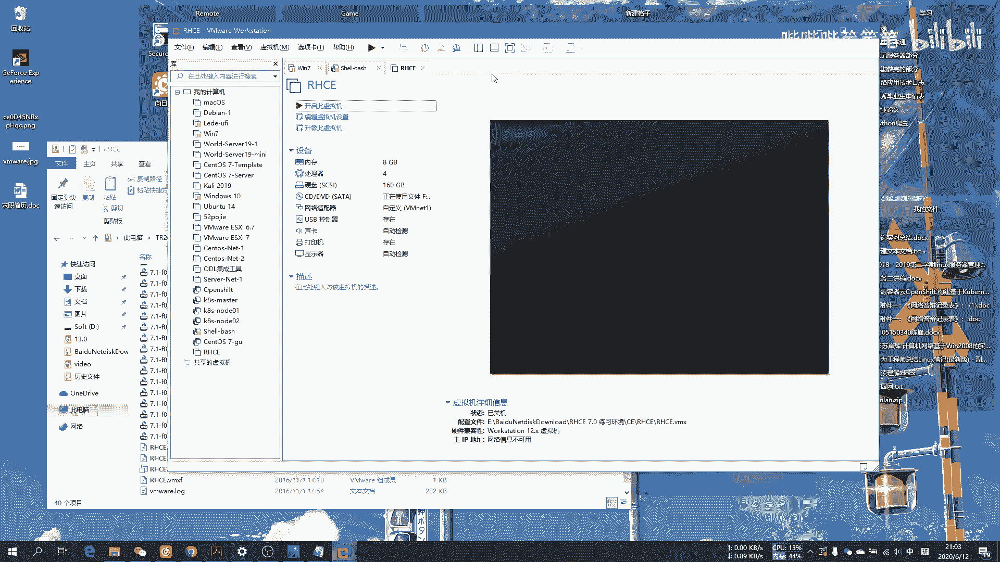

No。在这里的话，我们就选择我已复制该虚拟机。如果说是复制的话。他的那个呃mark地址啊那些什么的都会得到保留。如果说你选择移移动虚拟机的话，他那些mark地址就会随机的更改。啊，就看自己需求来吧。

都可以选。

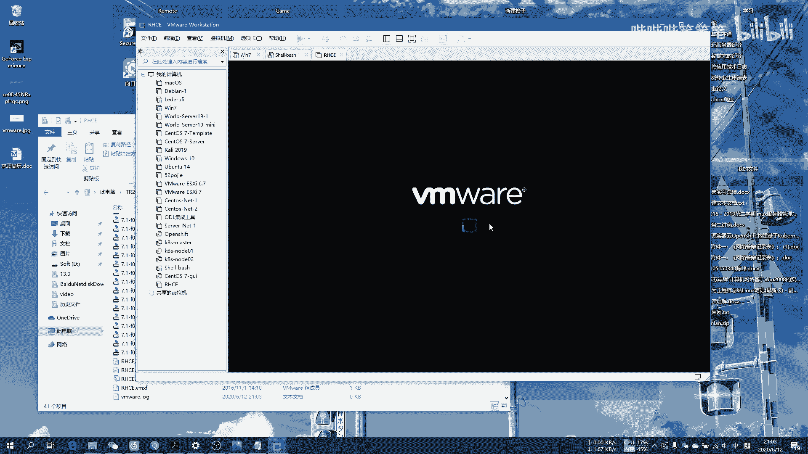

是。Yeah。然后这几个账户经常用到的就第一个第二个，然后后面那两个基本上是用不着的。等进到系统之后，我们再来看一下。

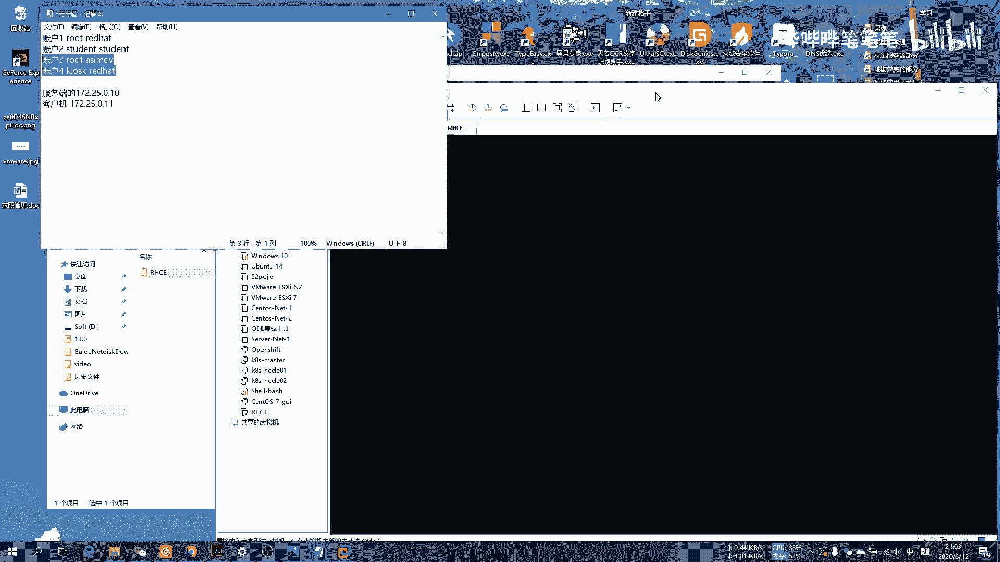

他这个IP地址是多少？172点。25的端。哦，0。250，那我们就可以在这边。自己的电脑上的刚才设置了一个Vnet1。给他加一个同一个网段的地址。就如果说你这上面本身就有1个IP的话，那可以像我这样。

点开它高级添加172。25。0点，它是2250嘛，所以我们就往后加一位就251。然后掩码的话可以不用管它，按照默认的就好了。

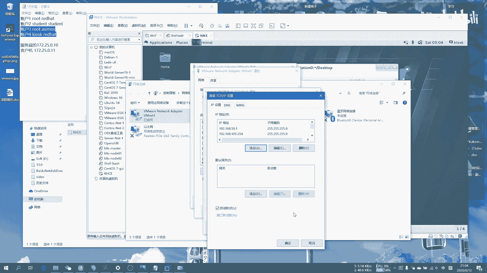

然后这个时候我们确定完之后去试着拼一下他能不能拼得透，172。25。0。250。好，冰痛了，那就可以了。

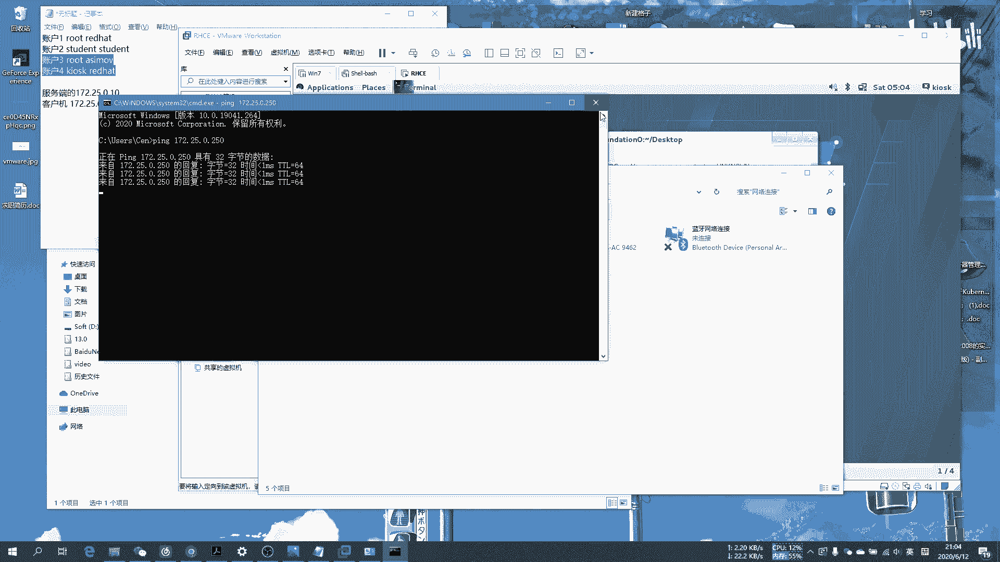

然后呢，再有个。manager VMS点开之后，这里面第一个是查看它的状态，然后第二个是查看一个图形化的，就是这双击它就是一个同样的一个用途。

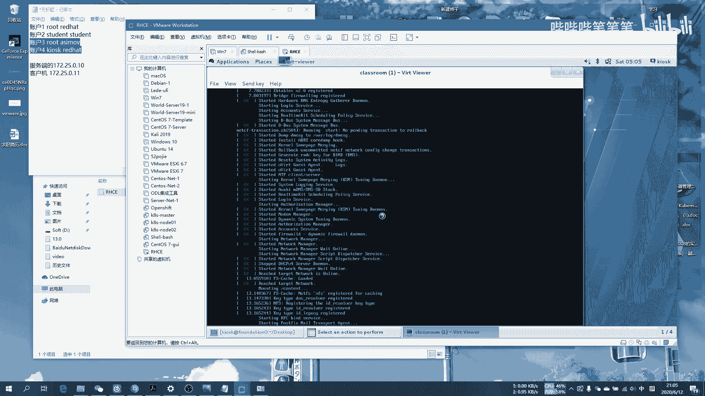

用来查看它里面的虚拟机的。这个卡拉输中呢就是我们平时作为一个资源机下载的，我们一般用不着它，就把它开起来，挂着就可以了。然后如果这个就直接。

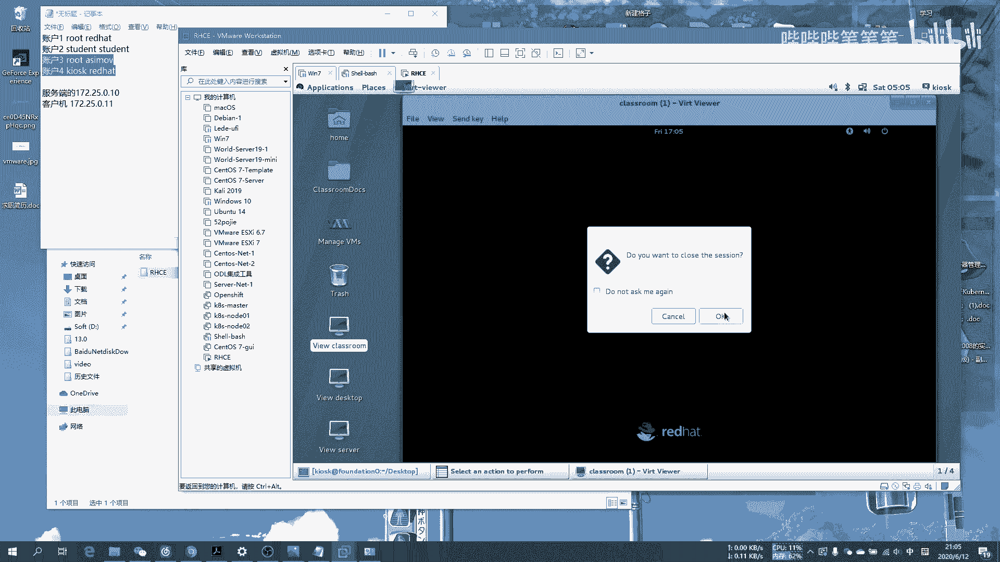

他说要不要关闭这个窗口这个绘画，然后直接关闭它就好了，他还会会后台运行的。呃，这些就顾名思义了，就开启重置停止和一些关机的命令。然后如果我们需要对这个KMS进行管理的话，我们可以从这个地方。

去找到一个虚拟机管理。程序点开之后呢，它会要求你输入一个账号密码吧，应该。要不然他是没办法访问到里面的虚拟机资源。然后呢，这个密码应该就是第三个阿西莫夫。不对呀，不对，那就re嗨。再不行就入他。

大写安溪莫菇哦。对。😔，大写的A，然后进去之后就能看到我只运行了这一台。

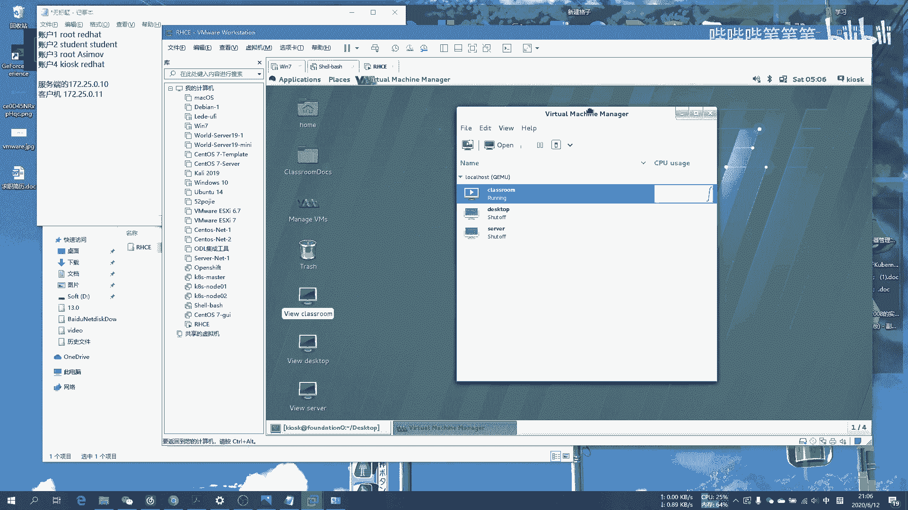

然后我们平时要用到做练习的，就是serverver和一个desktop，然后我们把它运行起来先。正因为要运行三台机，所以我们的内存需要大一点。如果4G的话，应该也能勉强的运行，可能会有点卡。好。

就双击之后呢，它就会自动运行了。然后等他运营起来之后，我们再来看一下这个。

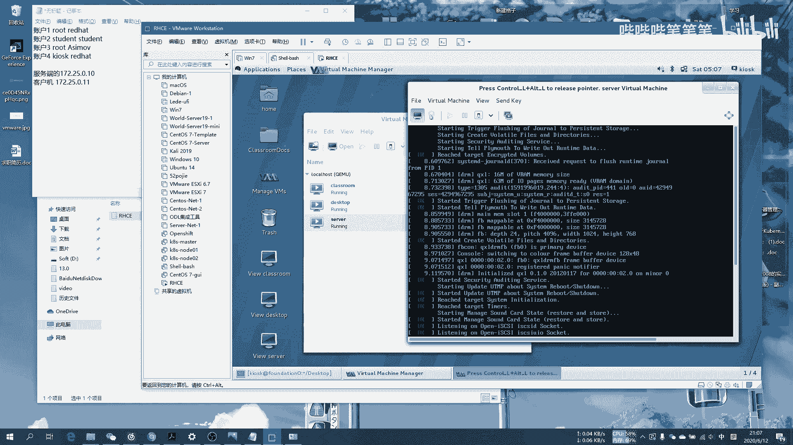

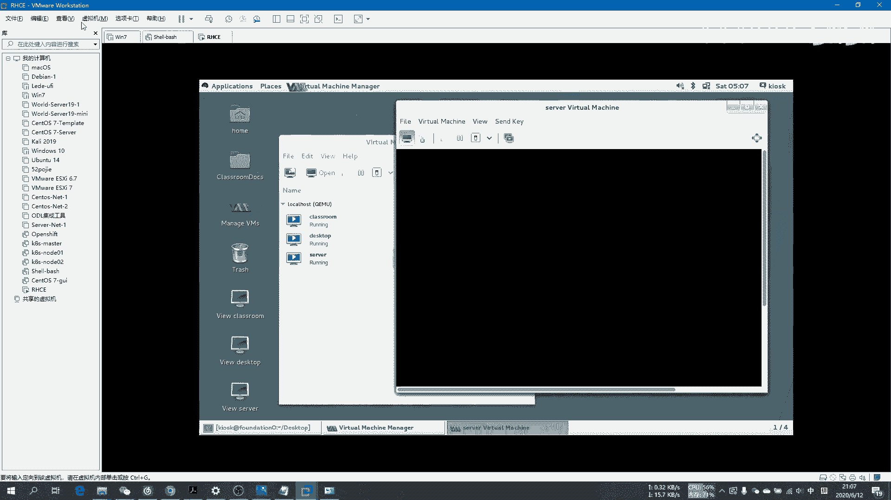

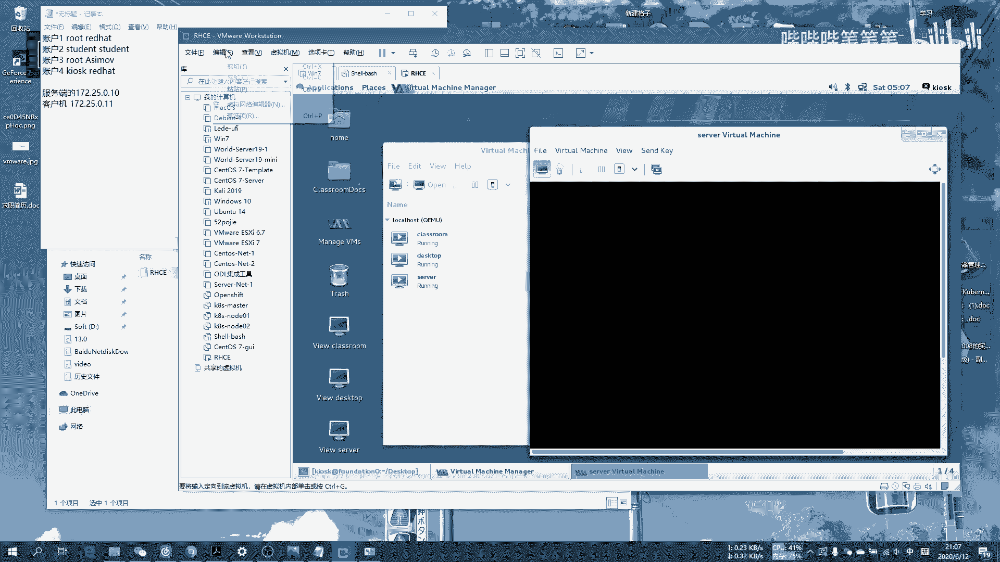

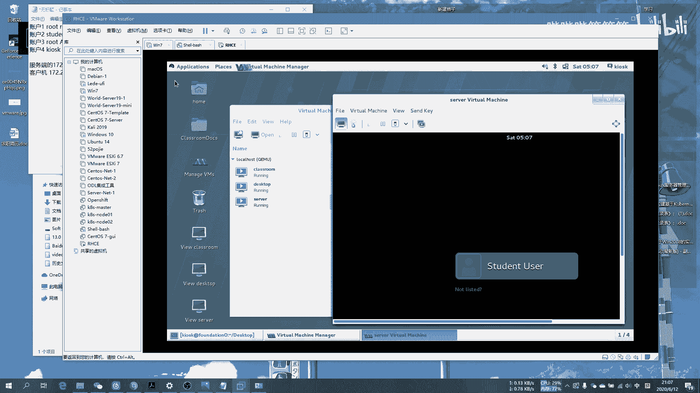

要不能放大的话，就直接这么用吧。他说st的一是那个。😔，要不试一下，用root登录一下。Not。Red hair。好，可以，那就用。那就用root权限来登录它，因为后面方便做题。

如果用普通用户登录上去的话，可能就会。出现一些要用速度的一些命令，就是SUDO这些。我们一般来说，这种虚拟机环境只用root环境就可以了。然后我们看里面的IP地址。它里面默认就会有1个IP地地址在里面。

我们刚才不是设置了1个172。25。0。251的地址在外面吗？到时候我们可以先拼一下，就P里面那台机器0。11。看一下他能不能通。好，OK如果如果说你们的电脑比较卡的话，那是又能拼得通里面。

那我们可以用到一个工具。就随便一个power cell啊，或者是叉el这这些工具都是可以的。🎼然后能连接上虚拟机就可以了。Yeah。🎼然后就试着连接一下它。央去2。25点0。11。然后一样是可以连接的。

账号密码就是root和readd high。

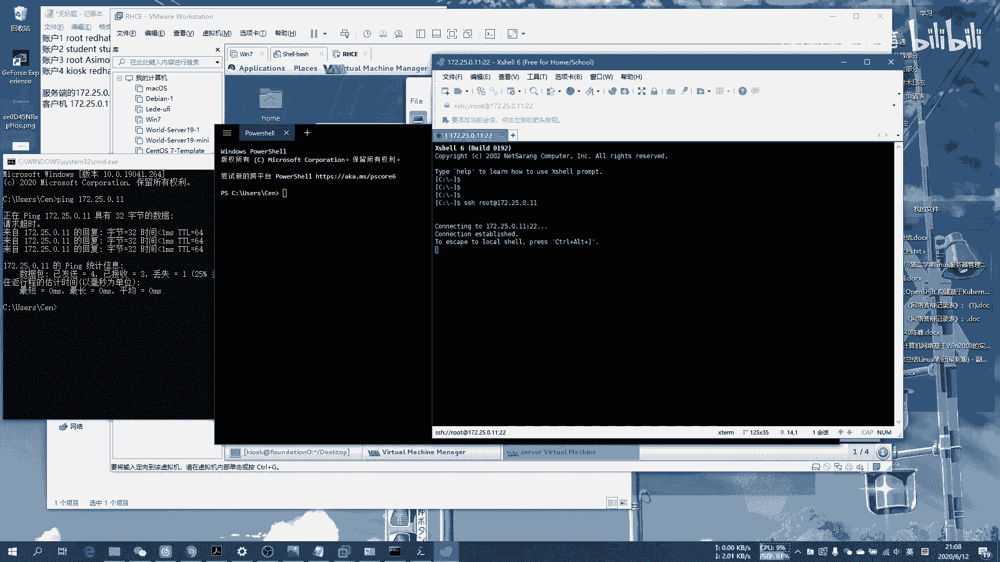

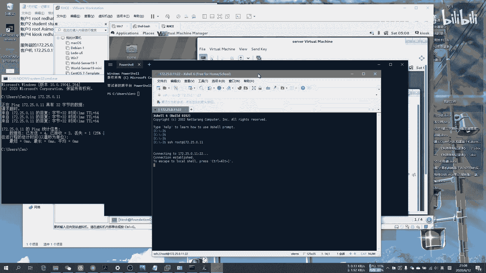

어。

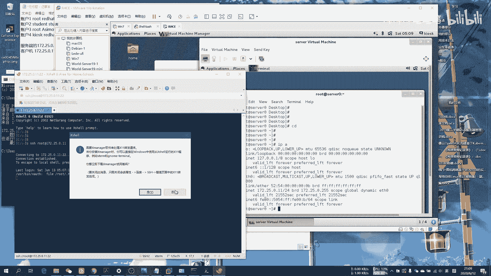

在这里操作的话，可能会比虚拟机里面会顺畅很多。啊，就这是实验环境吧，就我们有啊总会可能会出总有可能会出错的。所以我们可以用一个命令叫RHT。VMCTL然后forreet。

输入这台机器的名字叫server，然后我们就server回车，他说要要不要重完全重置这台服务器要就的。如果你输这样命令之后呢。

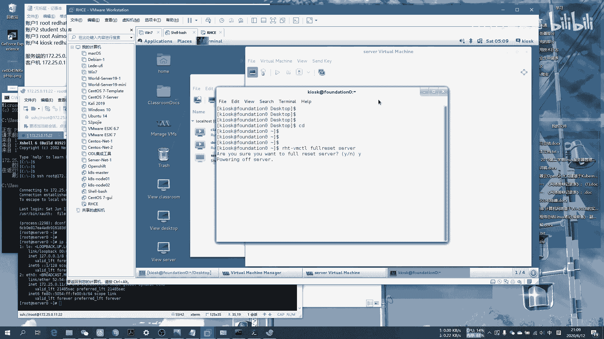

啊，就你这台机如果说做崩了什么什么东西的那我们就可以通过这个命令。来还原我的serv网，就回到我刚才那个状态。好的，好像他又运经起来了。😔，如果说不想用命令的话，可以用这个工具吧，应该是可以的。

等会儿再试一下。等他进到系头。😔，从置之后，他的IP应该是不会变的。

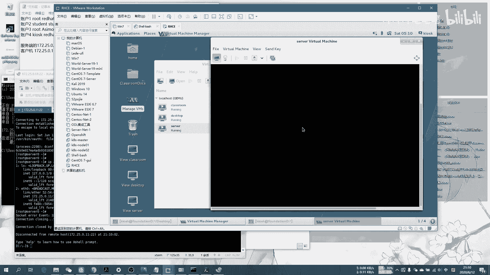

如果你们有兴趣的话，也可以研究一下怎么改这个网卡啊，其实改挺简单的。就这个0，然后里面会有这几个IP地址，就我们一般用他默认的172。25。0的段就好了。如果改如果你要改的话，就很麻烦。

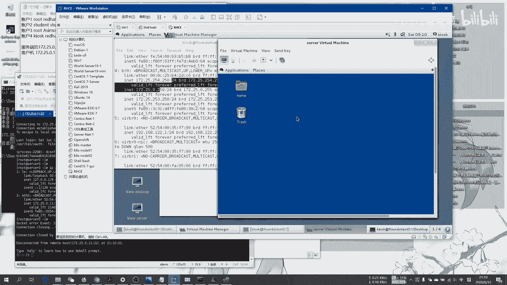

然后再看一下他的IP地址，应该不会变。OK他是不变的。就如果说我在里面啊什么一些磁盘的服务啊，那些都没做好，又还原不回去了，那我就得用这个。foot raise that命令来让他重置一下。

🤧那我试一下这个。这里有个re赛。O， so。😔，OK也是一样可以的。

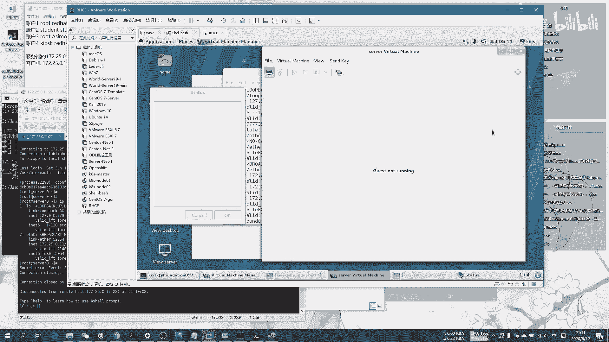

不用命令的话，就可以用桌面上的这个managerVMS来重置它。都是一样的。Yeah。看一下这个用root可以登录，用斯丢的。密码也是丢的。进去的话。他的权限就肯定不如root大。

会有很一些奇奇怪怪的麻烦麻麻烦出来。

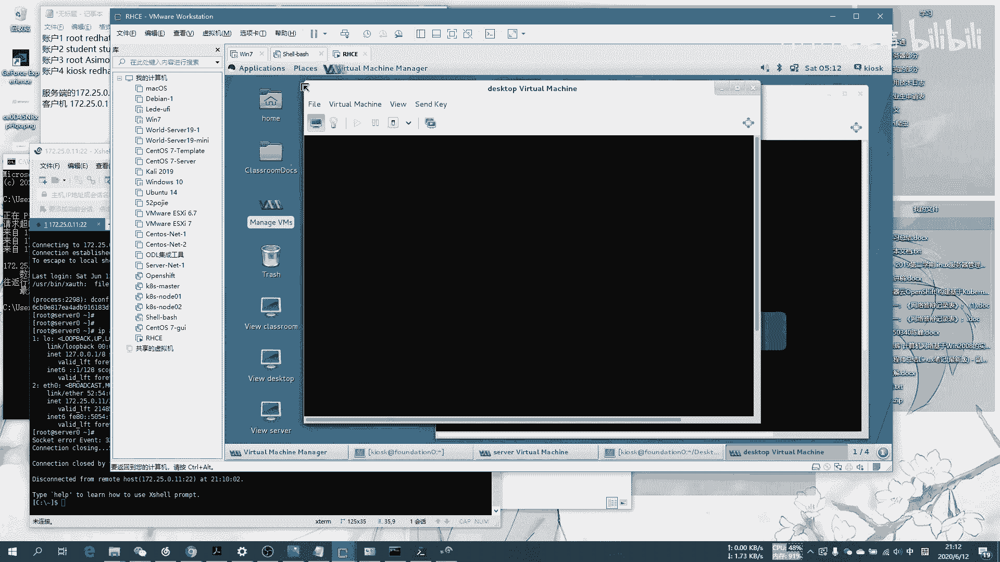

是。比如说MKTIR1个。文件夹。他会说我没有权限创建，所以我们就得用速度这个命令来让它创建。然后创建的同时，你还得输入一个root的密码。然后才能创建。哦，他说student密码。再去看一下。L6。

然后是能创建出来的，但是很麻烦，所以一般都是用root命令来创建。

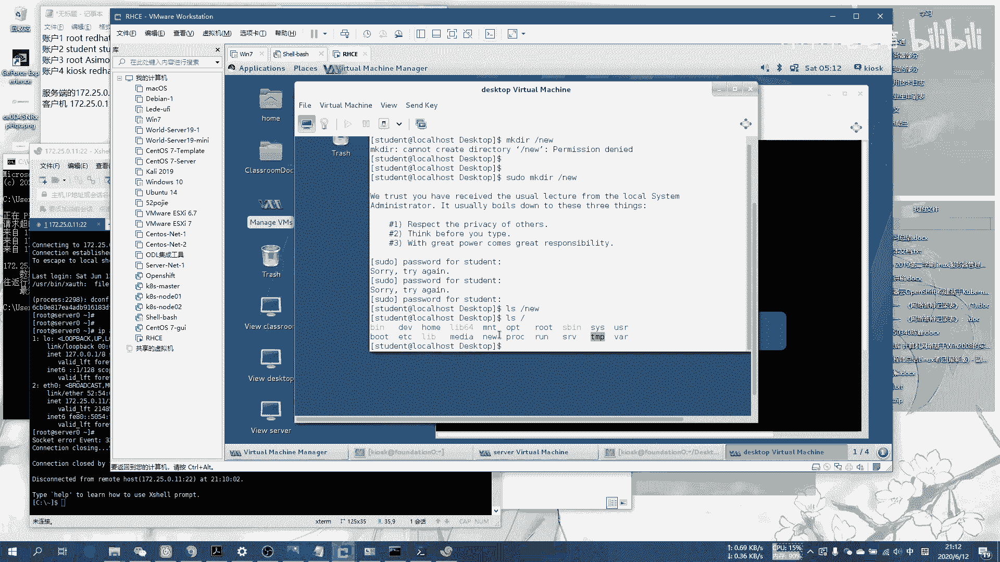

Notote。嗯还。

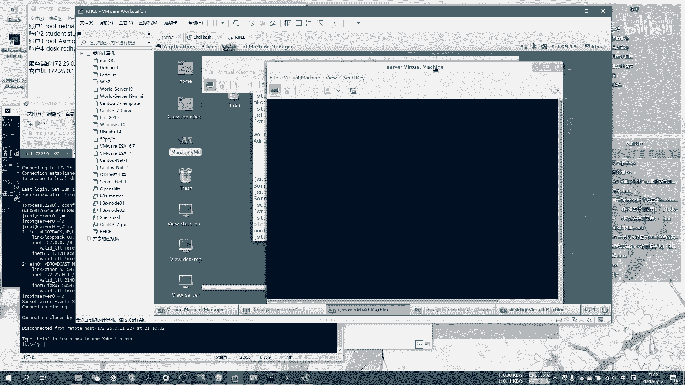

好吧，这个环境大概就是这个样子，就根据。题目来做题。然后呢。如果说不想下这么大的环境，也可以自己搭两台机器出来，也是一样的。两台sal7啊，或者是red hat7也可以。

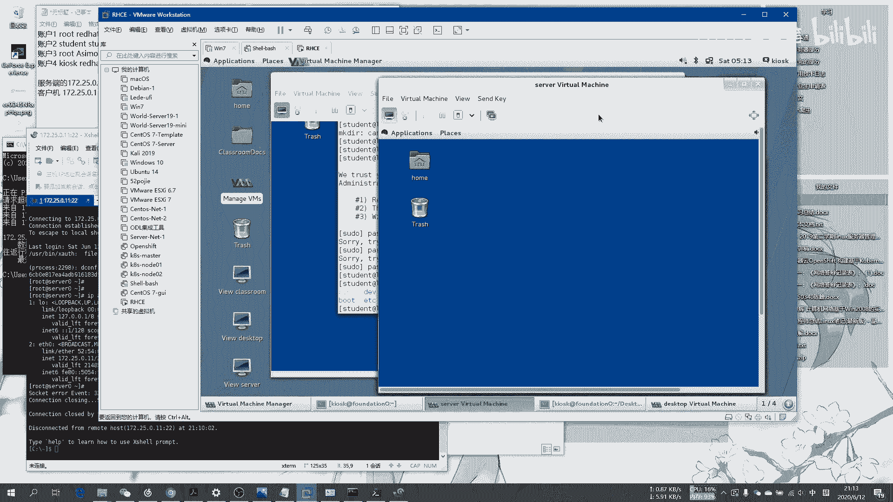

就用这个环境会比较方便一点嘛，都已经集成好的了。OK大概就是这个样子了。