# RHCE 7.0 环境配置讲解：P1：RHCE 7.0 环境配置 🖥️

在本节课中，我们将学习如何配置 RHCE 7.0 的实验环境。我们将从获取环境文件开始，逐步完成虚拟机的导入、网络配置以及基础使用，确保你能够顺利搭建并运行这个集成好的练习平台。

## 环境准备与下载

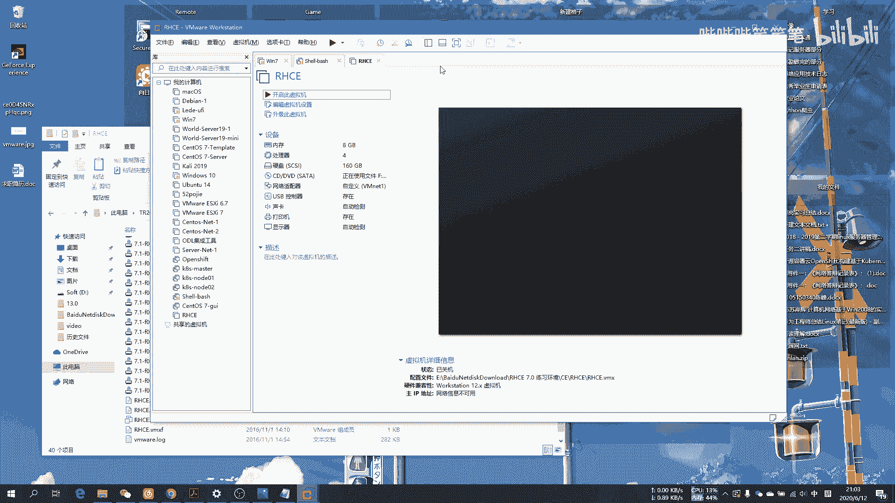

视频下方会提供一个百度云链接。下载完成后，你将获得一个包含 25 个压缩包的文件集合，总大小约为 20GB。

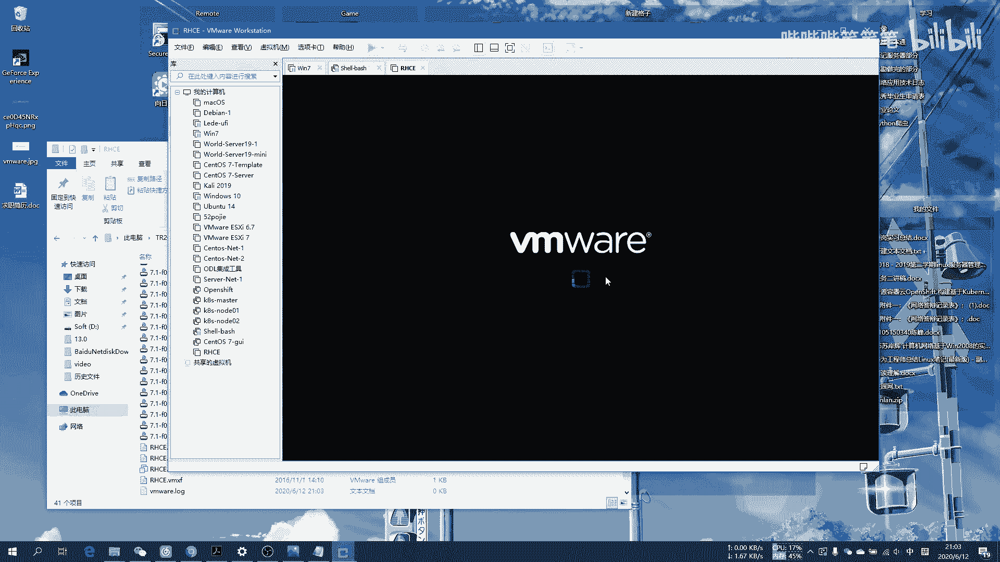

以下是解压与初始化的步骤：
*   将所有压缩包正常解压，你会得到一个文件夹。
*   打开 VMware 虚拟机软件。
*   在 VMware 中，选择打开虚拟机，并定位到解压后文件夹中的虚拟机文件。

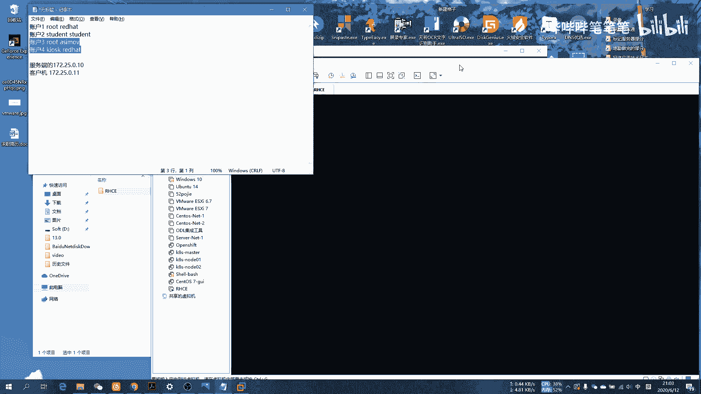

## 虚拟机配置建议

上一节我们完成了虚拟机的导入，本节中我们来看看如何优化其运行性能。因为这个环境内部会同时运行三台虚拟机，所以对宿主机的资源有一定要求。

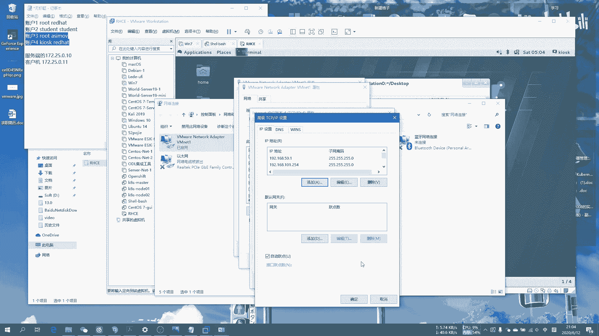

以下是关键配置建议：
*   **内存**：建议为整个环境分配 **8GB** 或更多内存。虽然更低配置（如4GB）也能勉强运行，但操作会明显卡顿。
*   **网络**：虚拟机网络配置可以使用 VMware 自带的虚拟网卡（如 `VMnet1`），也可以自行创建。核心要求是宿主机的虚拟网卡能与虚拟机内部网络通信。

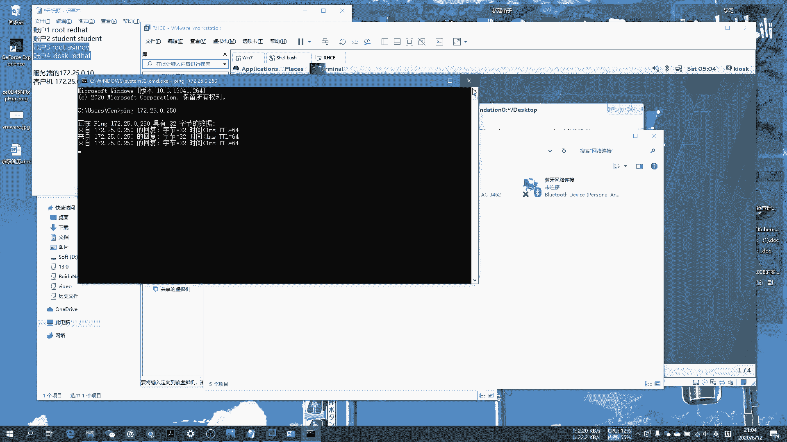

## 启动与网络设置

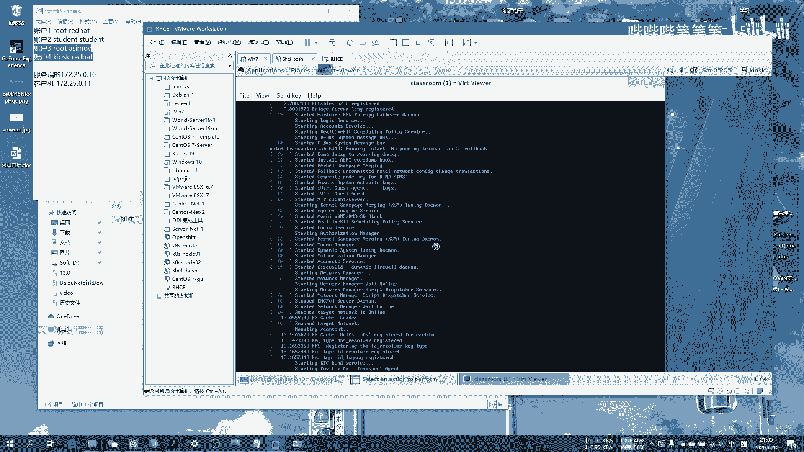

我们使用 `VMnet1` 虚拟网卡。启动虚拟机时，在弹出的窗口中选择 **“我已复制该虚拟机”**。这个选项可以保留虚拟机原有的 MAC 地址等网络标识。如果选择“移动虚拟机”，MAC 地址可能会被随机更改，可根据需求选择。

启动后，你会看到登录界面。常用的账户是前两个，后两个账户基本用不到。我们先进入系统查看网络信息。

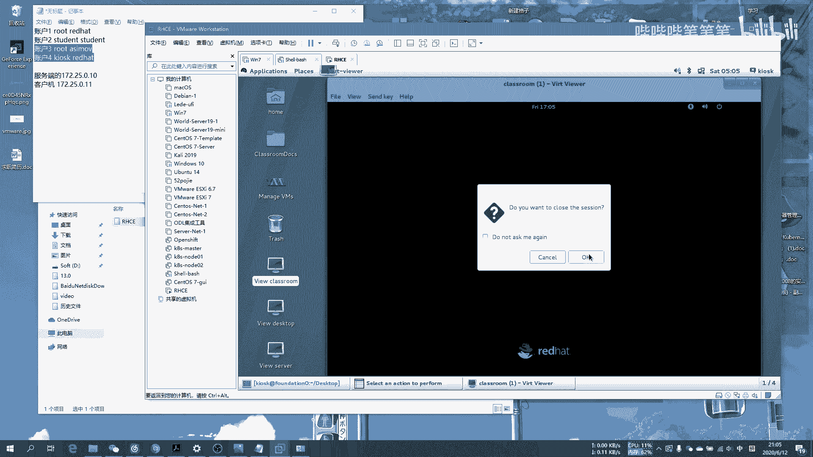

系统内查询 IP 地址的命令是：
```bash
ip addr show
```
或
```bash
ifconfig
```
查询得知，虚拟机的 IP 地址是 `172.25.0.250`。

接下来，我们需要在宿主机的 `VMnet1` 网卡上添加一个同网段的 IP 地址，以便通信。

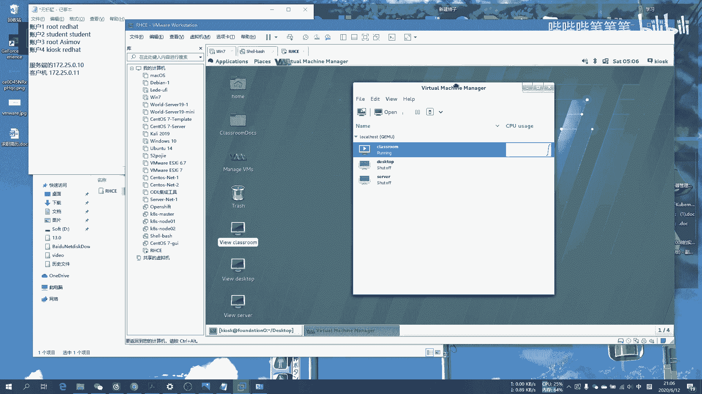

以下是配置宿主机 IP 的步骤（以 Windows 为例）：
*   打开“网络和共享中心” -> “更改适配器设置”。
*   右键点击 `VMnet1` 适配器，选择“属性”。
*   双击 “Internet 协议版本 4 (TCP/IPv4)”。
*   点击“高级”，在“IP 地址”栏添加一个新地址：`172.25.0.251`，子网掩码使用默认值。
*   配置完成后，在宿主机命令提示符中使用 `ping 172.25.0.250` 命令测试连通性。能 `ping` 通则表示网络配置成功。

## 环境管理界面使用

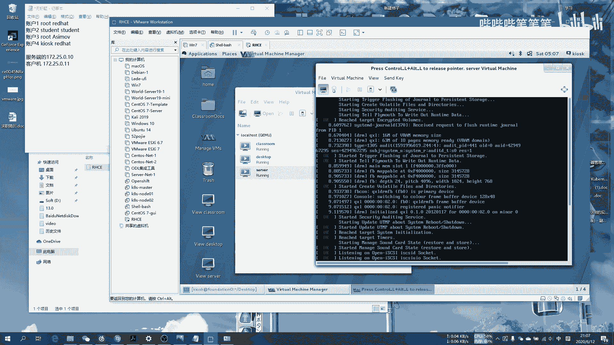

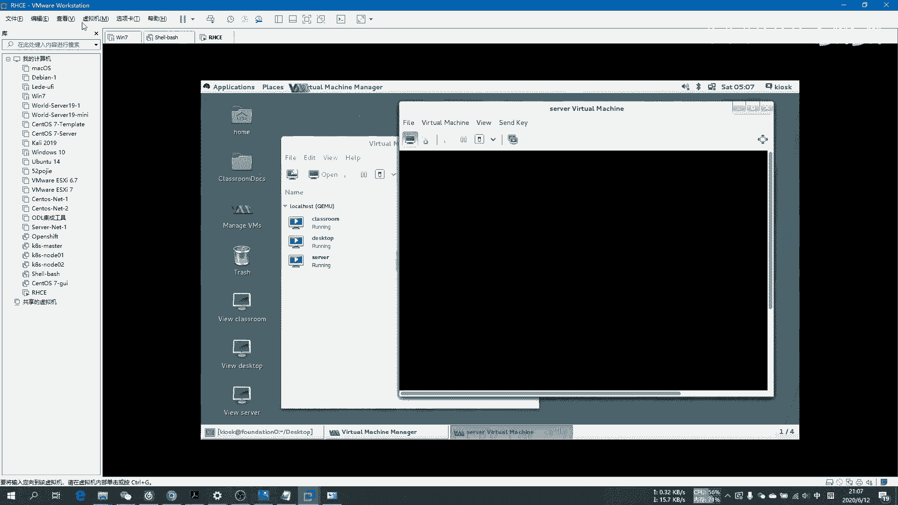

环境启动后，桌面会有一个 `managerVMS` 图标。双击打开后，是管理内部虚拟机的图形化界面。

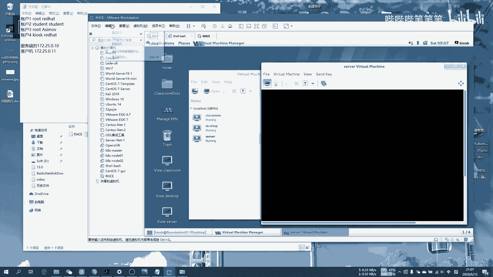

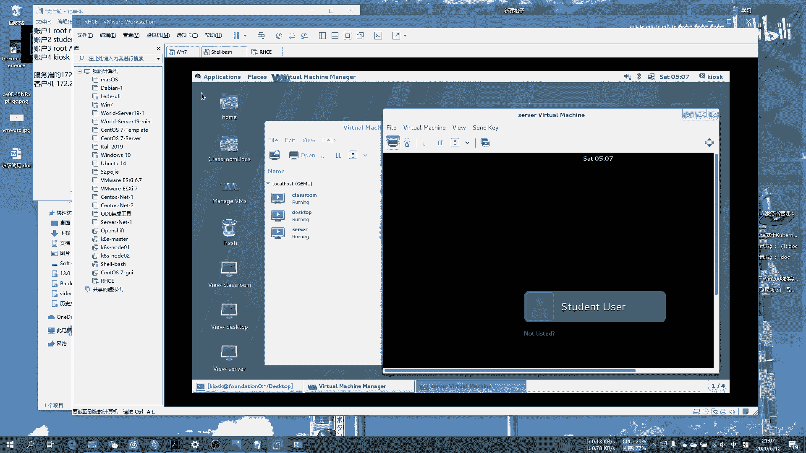

以下是管理界面功能说明：
*   第一个按钮用于查看虚拟机状态。
*   第二个按钮（或双击列表）可以打开虚拟机的图形化控制台。
*   `classroom` 虚拟机作为资源服务器，通常只需启动并保持运行即可，练习中很少直接操作。关闭其控制台窗口不会停止虚拟机，它会在后台继续运行。
*   其他按钮功能明确：启动、重置、停止、关机。

如果需要通过 Web 界面管理虚拟机，可以点击界面上的链接打开“虚拟机管理程序”。它会要求输入账号密码进行认证。

以下是可能用到的登录凭证：
*   用户名：`admin`
*   密码：`Asimov` (注意首字母 `A` 大写)

登录成功后，可以看到当前运行的虚拟机列表。

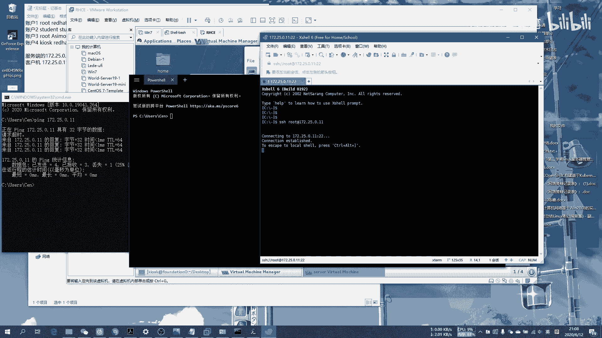

## 启动练习用虚拟机并连接

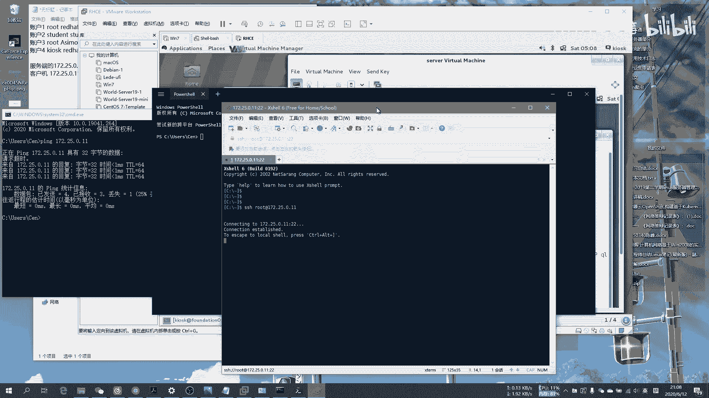

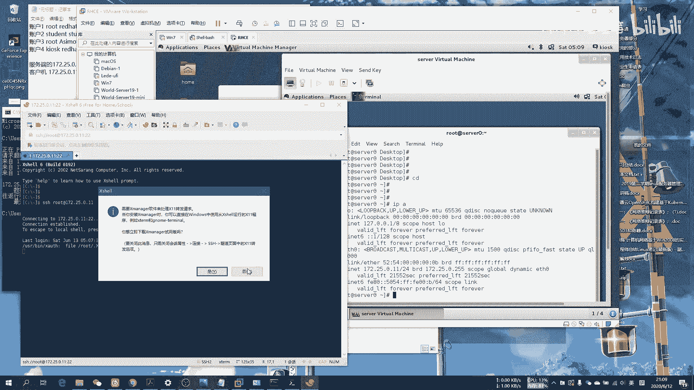

我们平时做练习主要使用 `server` 和 `desktop` 这两台虚拟机。在管理界面中启动它们。正因为需要同时运行三台虚拟机，所以之前建议分配足够的内存。

虚拟机启动后，我们可以直接在其控制台操作，但更推荐使用 SSH 工具（如 PuTTY, Xshell, PowerShell）进行远程连接，这样通常更流畅。

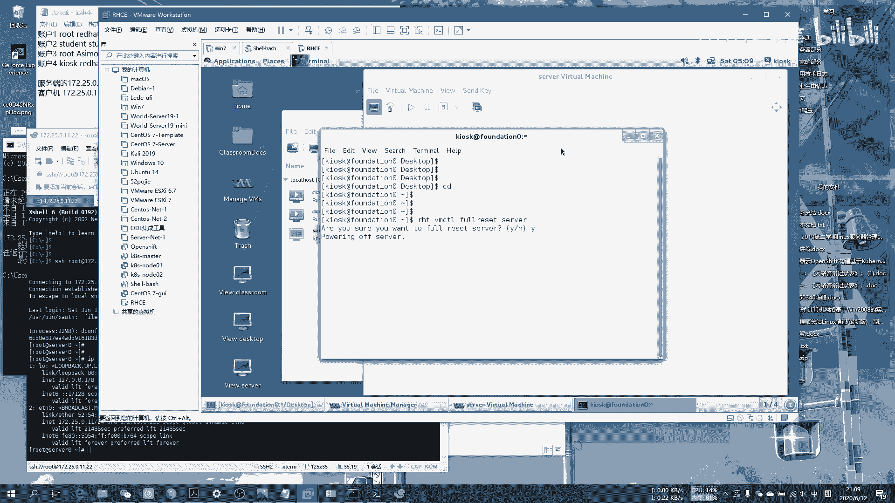

以下是连接 `server` 虚拟机的步骤：
1.  在宿主机上，使用 `ping 172.25.0.11` 测试到 `server` 的连通性。
2.  打开 SSH 工具，连接地址 `172.25.0.11`。
3.  使用用户名 `root` 和密码 `redhat` 进行登录。

## 环境重置功能

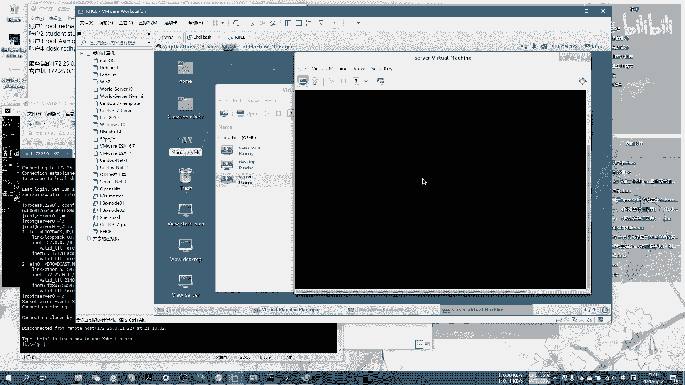

在实验过程中，可能会因操作失误导致虚拟机状态异常。此时可以利用环境提供的重置功能，快速将虚拟机恢复至初始状态。

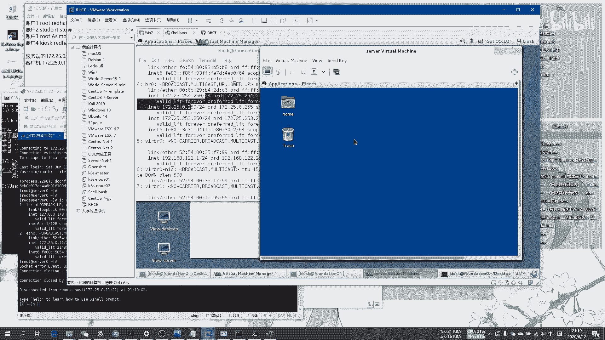

重置虚拟机有两种方法：

**方法一：使用命令行**
在 `classroom` 虚拟机或能管理它的终端中，执行以下命令：
```bash
rht-vmctl reset server
```
系统会询问是否完全重置服务器，输入 `yes` 确认即可。此命令会将名为 `server` 的虚拟机还原到初始快照状态。

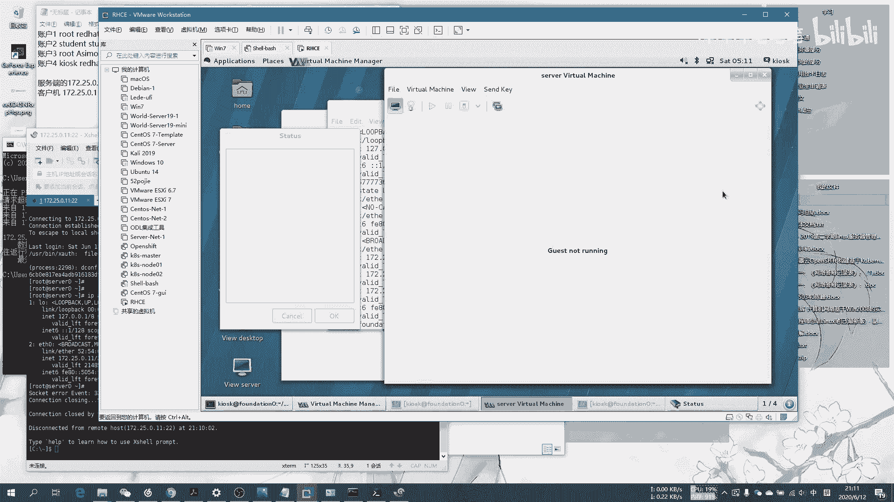

**方法二：使用图形界面**
在桌面 `managerVMS` 管理工具中，选中需要重置的虚拟机（如 `server`），然后点击 **`Reset`** 按钮。

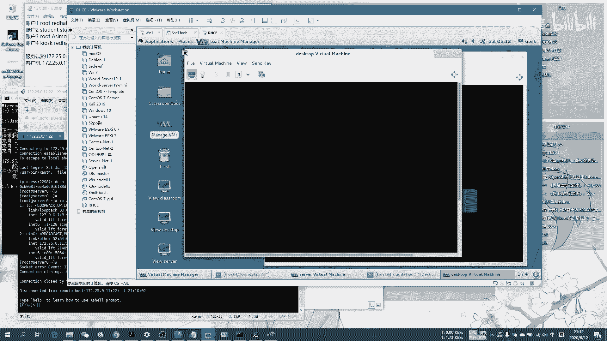

重置后，虚拟机的 IP 地址等网络配置通常保持不变。如果你有兴趣，也可以研究如何修改虚拟机网卡配置，但默认的 `172.25.0.0/24` 网段已能满足实验需求。

## 用户权限说明

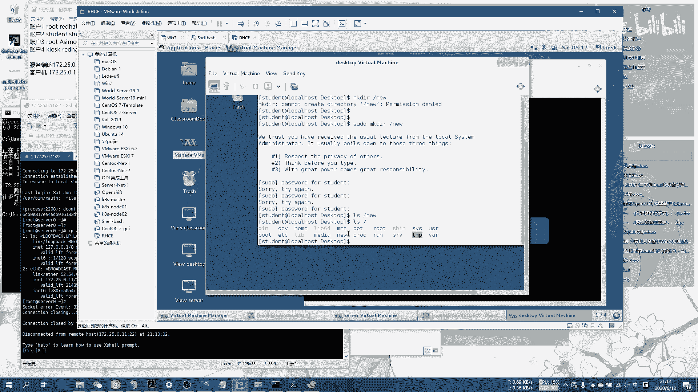

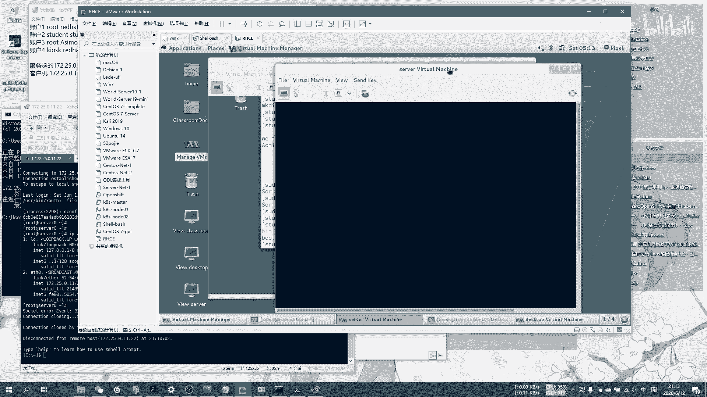

在实验环境中，建议始终使用 `root` 用户进行操作，以避免权限不足带来的麻烦。

以下是使用 `student` 用户可能遇到的问题示例：
以 `student` 用户登录后，尝试创建一个目录：
```bash
mkdir testdir
```
系统可能会提示权限不足。此时必须使用 `sudo` 命令并输入密码（密码也是 `student`）才能执行：
```bash
sudo mkdir testdir
```
这个过程比直接使用 `root` 用户繁琐，因此在学习环境配置阶段，使用 `root` 用户更为高效。

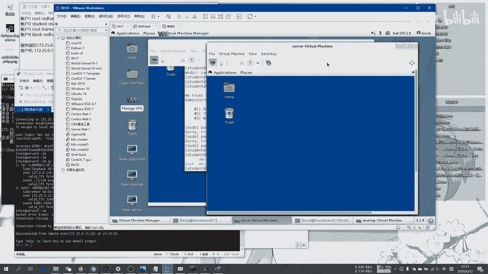

本节课中我们一起学习了 RHCE 7.0 实验环境的完整配置流程。我们从环境文件的获取和解压开始，配置了虚拟机的内存与网络，学习了如何启动、连接和管理内部的练习虚拟机，并掌握了关键的环境重置功能。这个集成环境已为你准备好所有必要组件，方便你专注于 RHCE 技能的学习。当然，你也可以自行搭建两台 Red Hat Enterprise Linux 7 或 CentOS 7 的虚拟机来练习，但使用这个预配置环境会更加便捷。