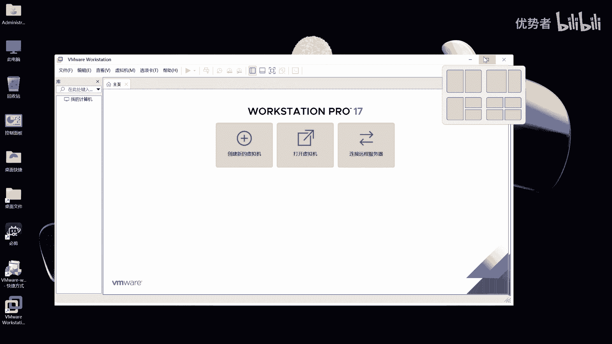

# S03：P1 官方教学版-系统搭建【VM】 - P1 - 一定能赶上 - BV1Du4y1Q7uz

哈喽大家好，今天装一下VMV2的17版本，装17版本是为了装红帽，99。0对16它也可以装，但是可能啊有一些啊兼容性的小问题，所以安装17可以解决这个问题，那我们今天就来看一下17是怎么安装呢。

首先呢我们先来看一下它的安装，嗯我这个是windows11的专业版。

对在这里安装，安装的时候，如果你的电脑要开启了虚拟化，windows的虚拟化，那建议你关闭或者是呃I额外的一个软件，在这里呢我们点下一步之后进行我们的安装，它安装其实很简单，只是中间有一个地方。

大家注意一下就行，其他的啊没有太大的变化，好我们点同意，必须得同意啊，价位不能用，下一步，好在这呢时候大家看一下有一个新增项，这个对第一个这个我不建议大家点啊，如果你要是如果想克隆或者是备份啊。

红毛九的时候如果开启它了，有可能啊有可能会在windows11中运行的时候，它嗯会出现卡顿或者是硬盘挂载不上的问题啊，那这是实验过的，所以不建议大家开启，因为开不开启，对于红帽来说没有什么太大的区别。

但是对于运行windows有区别的好，我们点下一步，在这儿呢我们要关闭这两个，之所以为什么关闭呢，大家应该都知道啊，那就不多说好，下一步，好在这直接下一步就可以了，没有什么两件快捷键而已。

安装安装的速度还是挺快的，一会儿就安装成，正在复制文件，大约不到2分钟时间就可以完成了，嗯马上就要安装成功了，嗯321应该就成功了，啊没有失误了好，这时候我们按照许可证，好我知道大家不喜欢看。

所以我把它哈哈哈屏蔽了好，那这时候呢我们可以看到呃，他已经安装成功了，我们双击打开看一眼啊，关于输入验证码，希望大家去买正版啊，不要去百度搜一个啊，好的，嗯这时候我们就安装完成了啊。

