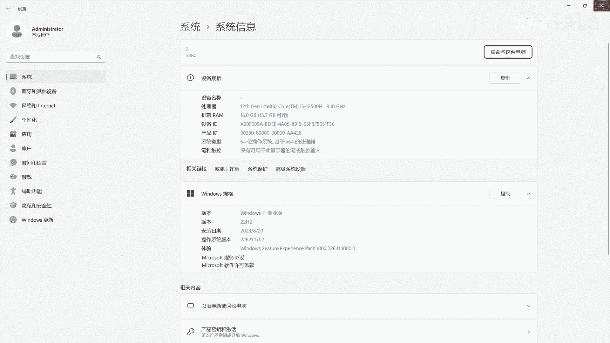
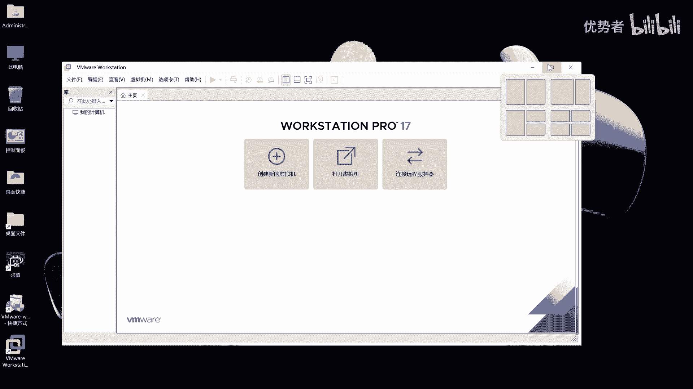

# VMware 虚拟机安装教程：S03：P1：Windows 11 系统下 VMware Workstation 17 的安装与配置 🖥️

在本节课中，我们将学习如何在 Windows 11 专业版操作系统上，安装并配置 VMware Workstation 17 虚拟机软件。此版本能更好地兼容 Red Hat 等操作系统，避免潜在的兼容性问题。

## 安装环境与准备

上一节我们明确了安装 VMware 17 的目的，本节中我们来看看具体的安装环境与准备工作。

本次安装的操作系统为 **Windows 11 专业版**。在开始安装前，请确保您的电脑已开启 CPU 虚拟化支持。如果您的 Windows 系统自带了虚拟化功能（如 Hyper-V），建议先将其关闭，或使用其他管理软件进行协调，以避免冲突。

## 执行安装程序

准备工作完成后，我们现在开始执行安装程序。整个过程较为简单，但其中有一处关键选项需要特别注意。

1.  启动安装程序后，点击“下一步”开始。
2.  阅读并同意许可协议，这是继续安装的必要步骤。
3.  选择安装位置，可以使用默认路径或自定义。

接下来是关键步骤。安装程序会提供一个增强型键盘驱动程序的可选功能。

**核心建议**：不建议勾选此项。根据测试，开启此功能可能导致在 Windows 11 中运行虚拟机时出现系统卡顿或虚拟机硬盘无法正常挂载的问题。对于运行 Red Hat 等 Linux 系统，此功能带来的差异不大，但对宿主 Windows 系统的稳定性可能有影响。

4.  取消勾选“增强型键盘驱动程序”选项，然后点击“下一步”。
5.  在接下来的用户体验设置中，建议取消勾选所有可选项目，然后继续点击“下一步”。
6.  确认快捷方式创建选项，直接点击“下一步”即可。

## 完成安装与验证

设置完成后，安装程序将开始复制文件。整个过程速度较快，通常在 2 分钟内即可完成。

文件复制完成后，安装即告成功。首次启动 VMware Workstation 17 时，软件会要求输入许可证密钥。请支持正版软件，获取合法密钥进行激活。

激活成功后，即可看到 VMware Workstation 17 的主界面，这表示软件已安装并配置完毕。

## 总结

本节课中我们一起学习了在 Windows 11 专业版上安装 VMware Workstation 17 的全过程。关键点在于：确保系统环境就绪，在安装过程中**避免勾选增强型键盘驱动程序**，并在安装后使用正版许可证完成激活。完成这些步骤后，您就拥有了一个稳定的虚拟机平台，可以用于后续安装 Red Hat 等操作系统。