Linux权限管理：高级权限管理ACL 🔐

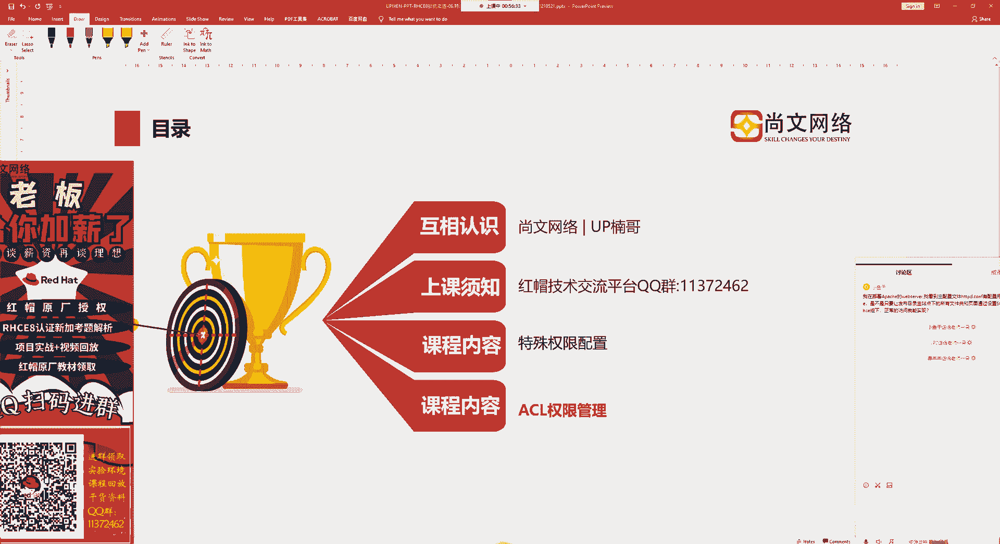

## 概述
在本节课中，我们将要学习Linux系统中的高级权限管理工具——访问控制列表（ACL）。传统的`chmod`命令只能将权限分配给文件所有者（u）、所属组（g）和其他用户（o）这三类。ACL则提供了更精细的权限控制能力，允许我们为特定的单一用户或组设置独立的权限。

## 什么是ACL？
ACL，全称Access Control List（访问控制列表），是一种独立于传统u/g/o权限体系的权限设置方法。它可以针对单一用户、单一文件或目录进行更精确的权限分配。

例如，假设用户“阿文”和用户“新斯科”都属于`root`组。对于一个文件，`root`组的默认权限是`rw-`（可读可写）。如果我们希望“阿文”额外拥有执行（x）权限，而“新斯科”保持原样，传统的组权限设置无法实现这种区分。这时，就需要使用ACL来为“阿文”单独设置权限。

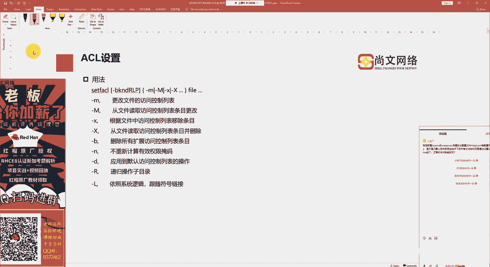

## ACL管理命令
管理ACL主要使用两个命令：
*   **`setfacl`**：用于设置ACL规则。
*   **`getfacl`**：用于查看文件或目录的ACL规则。

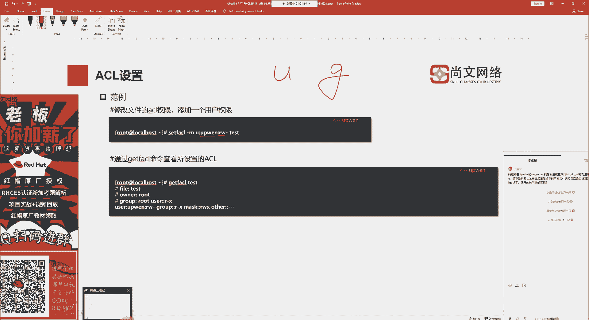

### `setfacl` 命令常用参数
以下是`setfacl`命令的一些常用参数及其含义：
*   `-m`：修改或添加ACL条目。
*   `-M`：从一个文件中读取ACL条目并进行设置。
*   `-x`：移除指定的ACL条目。
*   `-X`：从一个文件中读取ACL条目并进行移除。
*   `-b`：删除该文件所有的ACL条目。
*   `-d`：设置默认ACL规则（对目录中新创建的文件生效）。
*   `-R`：递归地对目录及其子目录进行操作。

## ACL设置实践
接下来，我们通过实际操作来看看如何设置ACL。

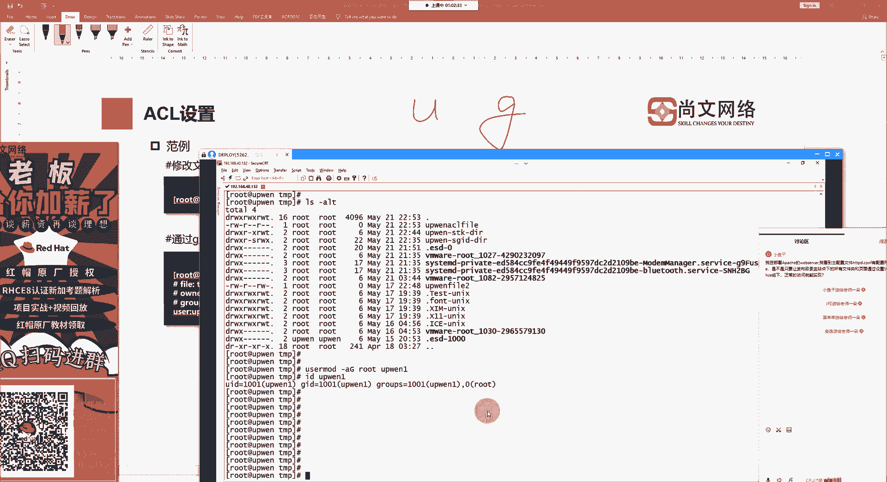

### 1. 创建测试环境
首先，我们创建一个测试文件。
```bash
touch /tmp/up_acl_file
ls -l /tmp/up_acl_file
```
文件默认权限是`644`，即所有者可读可写，组和其他用户仅可读。

假设用户`upone`被加入到`root`组中。
```bash
usermod -aG root upone
id upone
```
现在，`upone`的附加组包含`root`（组ID为0）。

### 2. 为用户设置特殊权限
虽然`upone`在`root`组中，但该组对文件的权限只是`r--`（只读）。我们可以使用ACL为`upone`单独添加写（w）和执行（x）权限。
```bash
setfacl -m u:upone:rwx /tmp/up_acl_file
```
这条命令的含义是：修改（`-m`）文件ACL，为用户（`u`）`upone`设置权限为可读、可写、可执行（`rwx`）。

### 3. 查看ACL设置
使用`getfacl`命令查看设置结果。
```bash
getfacl /tmp/up_acl_file
```
输出中，除了传统的u/g/o权限行，你会看到一行 `user:upone:rwx`，这就是我们刚添加的ACL条目。

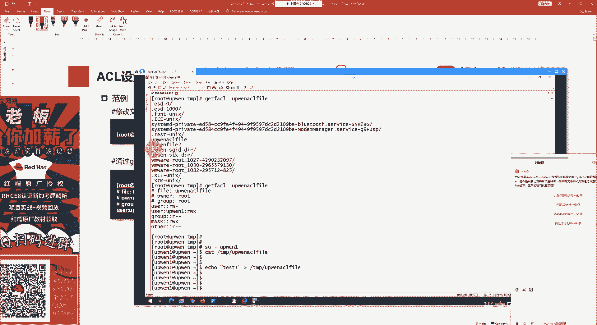

现在，切换到`upone`用户，就可以向这个文件写入内容了。
```bash
su - upone
echo "Test ACL" >> /tmp/up_acl_file
```

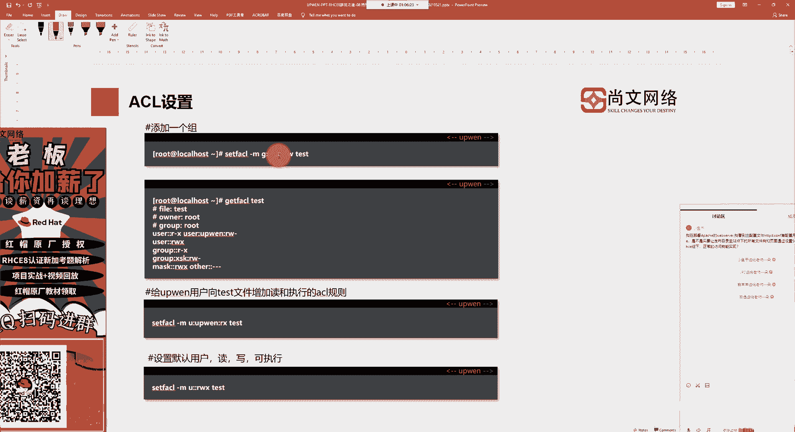

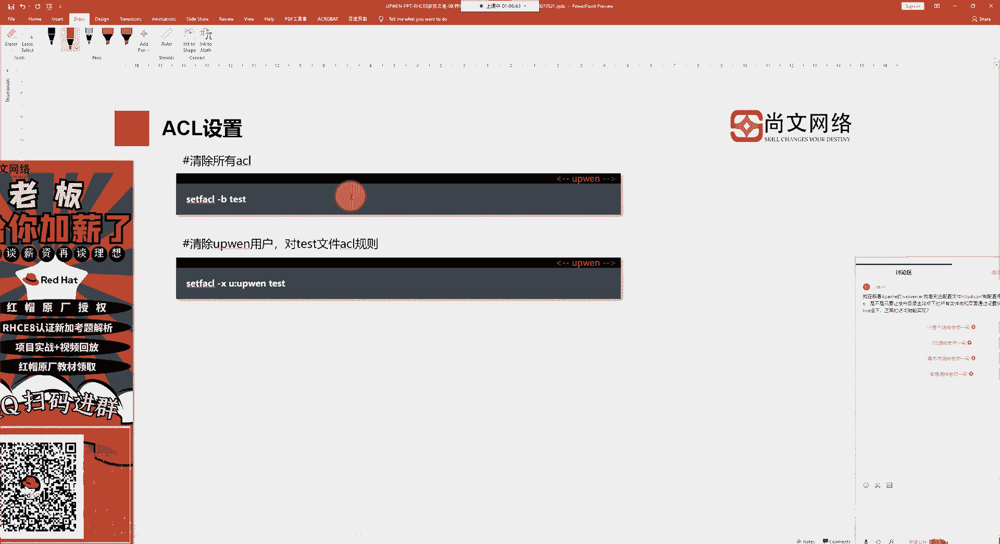

### 4. 为组设置ACL
ACL同样可以针对组进行设置。
```bash
setfacl -m g:groupname:rx /tmp/up_acl_file
```
这条命令为`groupname`组设置了读和执行权限。

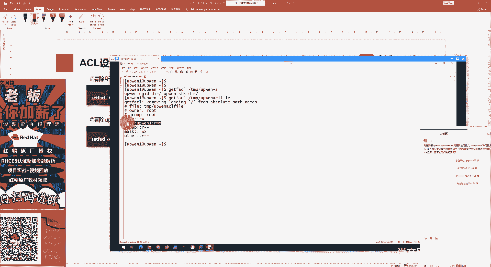

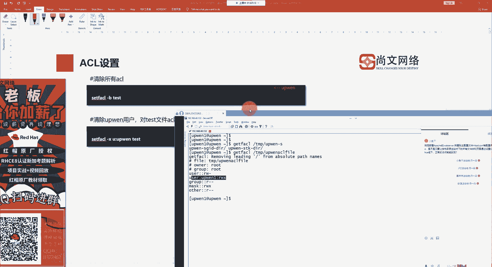

## 清除ACL规则
上一节我们介绍了如何设置ACL，本节中我们来看看如何清除它们。

### 1. 清除特定ACL条目
要移除为`upone`用户设置的ACL，可以使用`-x`参数。
```bash
setfacl -x u:upone /tmp/up_acl_file
```
执行后，再次使用`getfacl`查看，对应的条目就会消失。

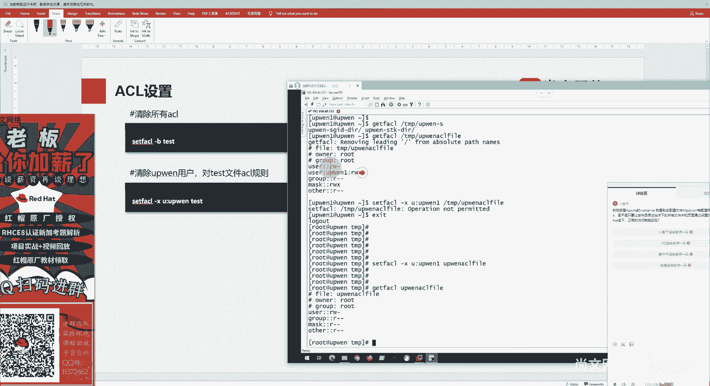

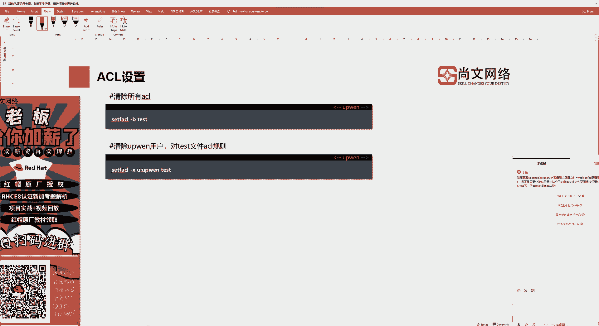

### 2. 清除所有ACL条目
如果要一次性清除文件上的所有ACL规则，恢复为标准u/g/o权限，可以使用`-b`参数。
```bash
setfacl -b /tmp/up_acl_file
```

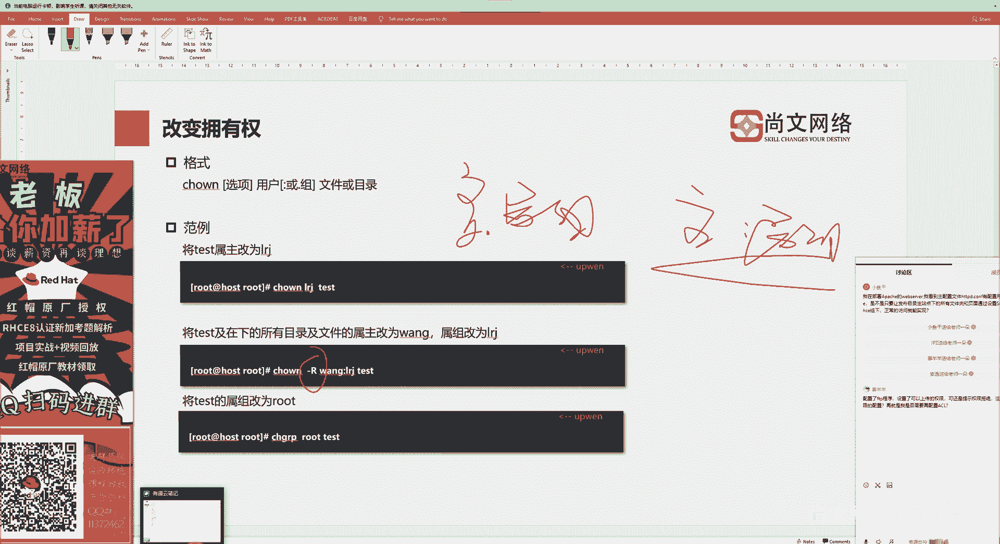

## 相关命令：`chown` 与 `chmod`
在权限管理中，除了ACL，我们还会经常用到`chown`和`chmod`命令。

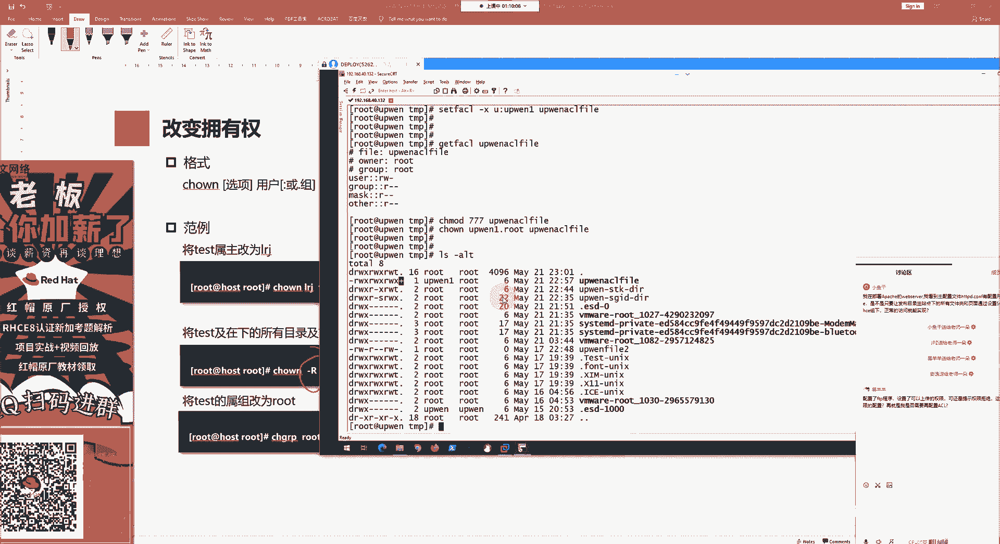

*   **`chown`**：改变文件的所有者和所属组。
    *   格式：`chown [选项] 用户名:组名 文件名`
    *   常用选项 `-R` 用于递归处理目录。
    *   示例：`chown upone:root /tmp/up_acl_file`

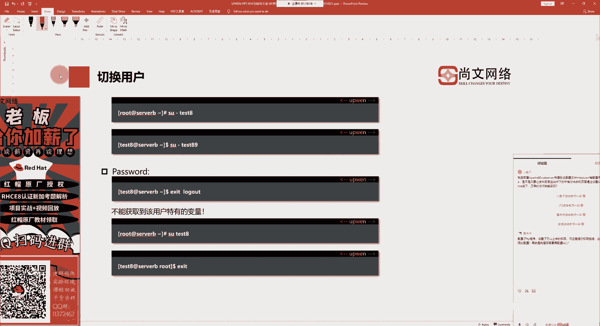

*   **`chmod`**：改变文件的传统u/g/o权限。
    *   格式：`chmod [选项] 权限模式 文件名`
    *   示例：`chmod 755 /tmp/up_acl_file`

这两个命令与ACL结合，构成了Linux完整的权限管理体系。

## 用户切换与环境
在测试权限时，我们使用`su`命令切换用户。`su - 用户名` 中的 `-` 符号代表切换用户的同时，加载该用户的环境变量和工作目录，模拟一次完整的登录。

## 总结
本节课中我们一起学习了Linux的高级权限管理工具ACL。
1.  **ACL的作用**：突破了传统u/g/o三组权限的限制，能够为特定用户或组设置更精细的权限。
2.  **核心命令**：使用 `setfacl` 设置权限，使用 `getfacl` 查看权限。
3.  **常用操作**：我们实践了如何为用户（`-m u:username:perms`）和组（`-m g:groupname:perms`）添加ACL，以及如何清除特定（`-x`）或全部（`-b`）ACL规则。
4.  **辅助命令**：回顾了改变文件属主的`chown`命令和改变基础权限的`chmod`命令。

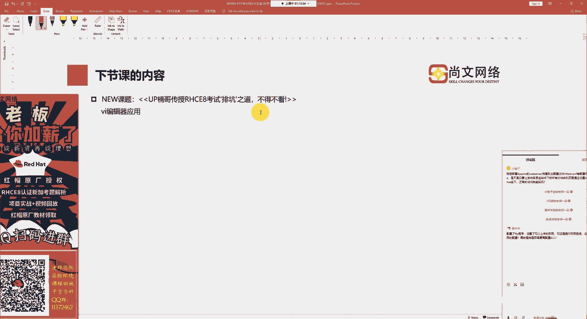


掌握ACL将使你在管理多用户环境或需要复杂权限控制的场景时更加得心应手。