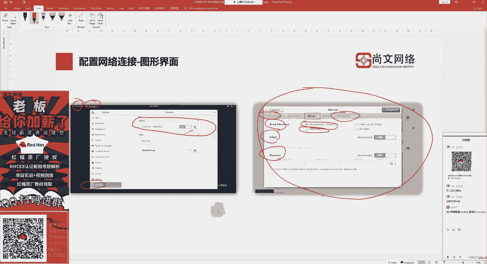
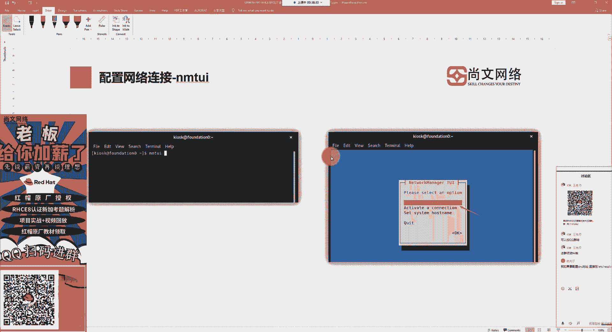
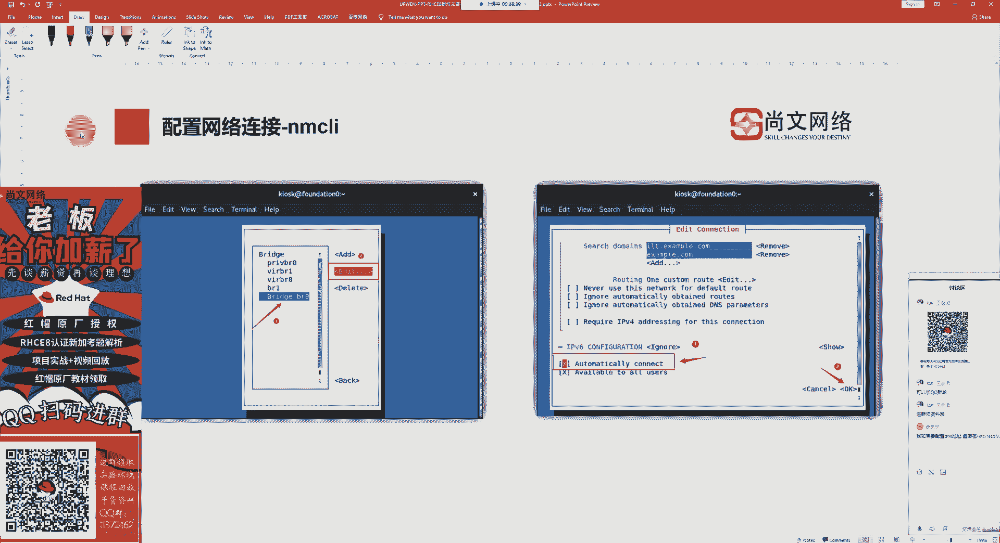
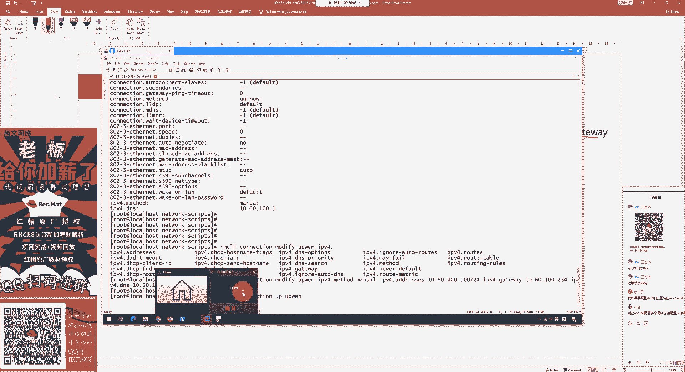
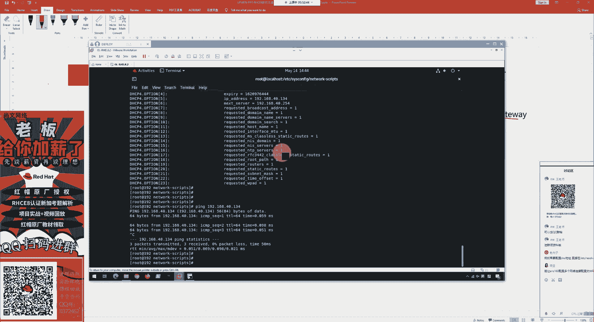
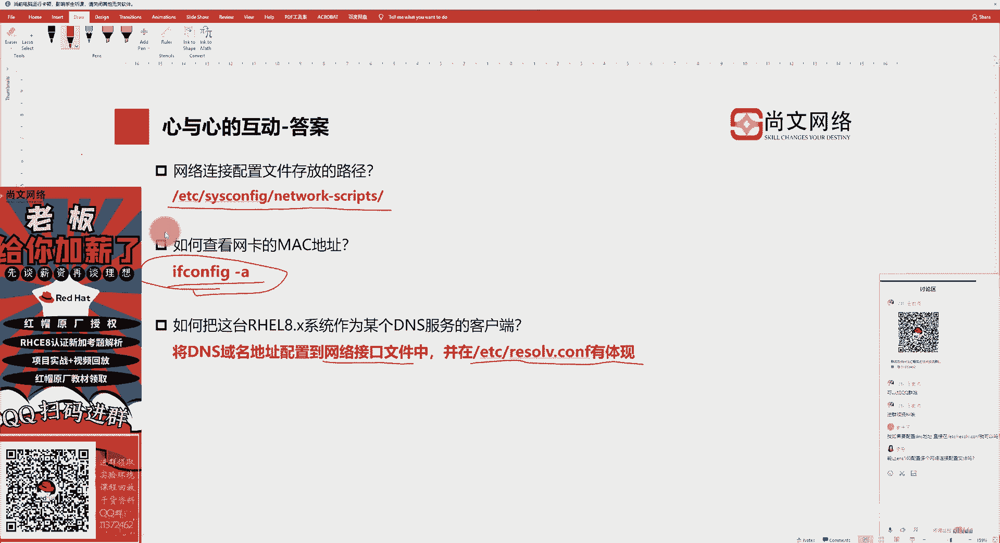

# RHCE8排坑指南：1：配置网络连接 🔧


在本节课中，我们将学习如何在Red Hat Enterprise Linux 8系统中配置网络连接。这是RHCE8考试及日常运维中的基础且关键的一步，确保虚拟机之间能够正常通信。我们将从了解核心配置文件开始，逐步学习三种配置网络的方法，并最终掌握如何测试网络连通性。


## 网络配置文件详解 📁


上一节我们提到了网络配置的重要性，本节中我们来看看Linux系统中与网络相关的核心配置文件。理解这些文件是手动配置网络的基础。


**1. 网络连接配置文件**
网络连接的具体配置存储在以下目录中：
```
/etc/sysconfig/network-scripts/
```
在该目录下，每个网络接口（网卡）都对应一个或多个配置文件，命名格式为 `ifcfg-<连接名>`。例如，网卡 `ens160` 的配置文件可能是 `ifcfg-ens160`。一个物理网卡可以对应多个配置文件，方便在不同网络环境（如不同办公地点）间快速切换。


**2. 域名解析配置文件**
以下是用于域名解析的关键文件：
*   **`/etc/resolv.conf`**： 此文件用于指定系统使用的DNS服务器地址。在RHEL 8中，不建议直接编辑此文件，而应通过修改 `ifcfg-*` 配置文件中的 `DNS1=` 参数来间接更新它。
*   **`/etc/hosts`**： 此文件用于本地主机名解析。当没有DNS服务器或需要内部解析时，可以在此文件中建立IP地址与主机名（或域名）的静态映射关系。
*   **`/etc/host.conf`**： 此文件中的一个重要配置项是 `multi on`，它允许一个网络接口配置多个IP地址，即启用“多宿主主机”功能。

## 配置网络连接的三种方法 🛠️

了解了核心文件后，我们来看看实际配置网络的三种方法。从图形化到命令行，我们将逐一掌握。

**1. 图形化界面配置**
这是最直观的方法。通过系统桌面环境的“设置” -> “网络”选项，可以进入图形化配置界面。在此可以轻松设置IP地址获取方式（自动DHCP或手动）、IP地址、子网掩码、网关和DNS等信息。此方法适合桌面环境用户快速配置。

**2. 使用 `nmtui` 工具配置**
`nmtui` (Network Manager Text User Interface) 是一个基于文本的半图形化工具，在终端中即可运行。它比纯命令行更友好，是考试和工作中常用的方式。

以下是 `nmtui` 的主要功能：
*   **编辑连接**： 修改现有网络接口的配置文件（`ifcfg-*`）内容。
*   **激活连接**： 在多个配置文件中切换，使某个配置生效。同一时间只能激活一个配置。
*   **设置主机名**： 配置系统的主机名，推荐使用完全限定域名（FQDN）格式。



**3. 使用 `nmcli` 命令行配置**
`nmcli` (Network Manager Command Line) 是纯粹的命令行工具，是RHCE8考试的重点考察内容。它功能强大，适合脚本化和远程管理。



以下是 `nmcli` 的常用命令和操作：
*   **查看网卡设备**： `nmcli device` (可简写为 `nmcli d`)
*   **查看连接信息**： `nmcli connection show` (可简写为 `nmcli c s`)。这里显示的是配置文件（`ifcfg-*`）的信息。
*   **激活/停用连接**：
    ```bash
    nmcli connection up <连接名>
    nmcli connection down <连接名>
    ```
    **注意**：修改网络配置后，通常需要执行 `up` 操作来使新配置生效。
*   **添加新连接配置**：
    ```bash
    nmcli connection add con-name <新连接名> ifname <网卡设备名> type ethernet ipv4.method manual ipv4.addresses <IP地址/掩码> ipv4.gateway <网关地址> ipv4.dns <DNS地址>
    ```
    此命令会在 `/etc/sysconfig/network-scripts/` 目录下创建新的 `ifcfg-<新连接名>` 文件。
*   **修改现有连接配置**：
    ```bash
    nmcli connection modify <连接名> ipv4.method manual ipv4.addresses <新IP地址/掩码> ipv4.gateway <新网关> ipv4.dns <新DNS>
    ```
    修改后别忘了使用 `nmcli connection up <连接名>` 激活更改。



## 测试网络连通性 📶

配置好网络后，必须进行测试以确保一切正常。本节我们将学习几个用于测试网络连通性和查看信息的核心命令。

**1. 基础连通性测试**
`ping` 命令是最基本的网络连通性测试工具。它通过发送ICMP回显请求包来检测目标主机是否可达。
```bash
ping <目标IP地址或域名>
```

**2. 查看网络接口信息**
`ifconfig` 或 `ip addr` 命令可以查看所有网络接口的详细信息，包括IP地址、MAC地址、状态等。
```bash
ifconfig -a
# 或
ip addr show
```

**3. 查看路由信息**
`route` 或 `ip route` 命令用于查看系统的路由表，了解数据包的转发路径。
```bash
route -n
# 或
ip route show
```





**4. 测试域名解析**
`nslookup` 或 `dig` 命令用于查询DNS记录，测试域名解析是否正常。
```bash
nslookup <域名>
# 或
dig <域名>
```

## 总结 📝




本节课中我们一起学习了RHCE8考试中配置网络连接的核心知识与技能。我们从理解 `/etc/sysconfig/network-scripts/` 等关键配置文件开始，掌握了通过图形界面、`nmtui` 工具以及最重要的 `nmcli` 命令行来配置IP地址、网关和DNS的方法。最后，我们学习了使用 `ping`、`ifconfig` 等命令测试网络连通性，确保配置正确生效。扎实的网络配置能力是后续所有系统管理任务的基础，务必多加练习。