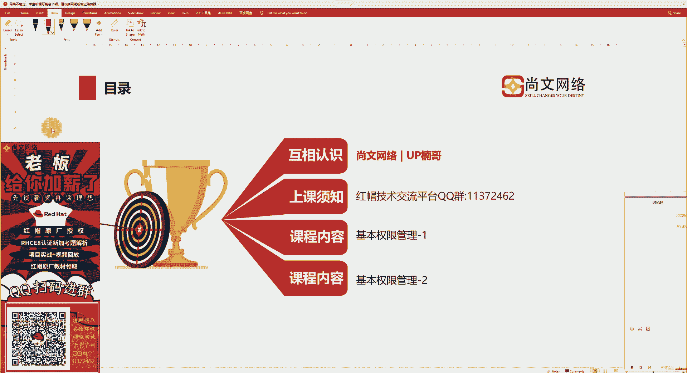
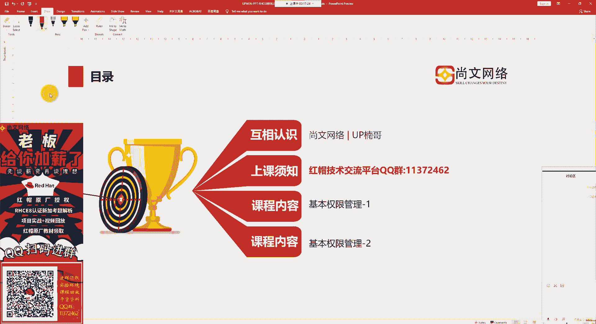
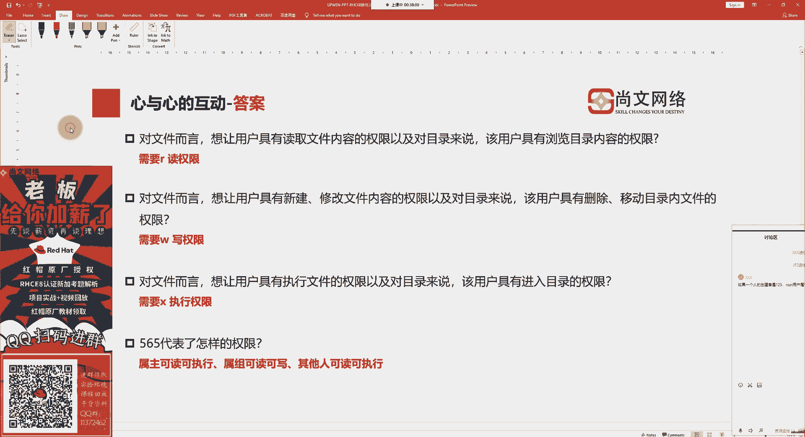

# Linux权限管理：1：基本权限管理

## 概述

在本节课中，我们将要学习Linux操作系统中的基本权限管理知识。这是RHCE8考试中的一个重要考点，也是日常系统管理的基础。我们将从权限的定义、表示方法、功能含义等方面入手，帮助初学者建立清晰的理解。

上一节我们介绍了用户管理，包括用户的创建、修改和删除。本节中我们来看看如何管理这些用户对文件和目录的访问权限。

---

## 权限的定义与表示

在Linux系统中，每个文件或目录都有一套权限属性，用于控制不同用户对其的访问能力。权限信息通常通过 `ls -l` 命令查看。

权限字符串由10个字符组成。第一个字符表示文件类型，常见的类型有：
*   **d**：代表目录（directory）。
*   **-**：代表普通文件。
*   **l**：代表符号链接（软链接）文件。
*   **b**：代表块设备文件（如磁盘分区）。
*   **c**：代表字符设备文件（如键盘、鼠标）。


随后的9个字符，每3个为一组，共三组，分别定义了三种身份的权限：
*   **第一组（2-4位）**：文件**所有者（owner/user）**的权限。
*   **第二组（5-7位）**：文件**所属组（group）**的权限。
*   **第三组（8-10位）**：**其他用户（others）**的权限。



每组中的三个字符按顺序分别代表：
*   **r**：读权限。
*   **w**：写权限。
*   **x**：执行权限。
*   **-**：表示对应位置无此权限。


例如，一个文件的权限显示为 `-rwxr-xr--`，表示：
*   它是一个普通文件（`-`）。
*   所有者拥有读、写、执行权限（`rwx`）。
*   所属组拥有读和执行权限（`r-x`）。
*   其他用户只有读权限（`r--`）。

---


## 权限的功能含义


权限 `r`、`w`、`x` 对于文件和目录的意义有所不同。

以下是针对文件和目录的权限功能详解：

*   **读权限**
    *   对**文件**：允许查看或读取文件内容。
    *   对**目录**：允许列出目录内的文件列表（如使用 `ls` 命令）。

*   **写权限**
    *   对**文件**：允许修改文件内容，或截断文件。
    *   对**目录**：允许在目录内创建、删除、重命名文件或子目录。

*   **执行权限**
    *   对**文件**：允许将文件作为程序或脚本执行。
    *   对**目录**：允许进入或切换到该目录（如使用 `cd` 命令），并且是访问目录内文件元数据的前提。


---




## 权限的表示方法


Linux权限有两种常见的表示方法：数字表示法和符号表示法。


### 数字表示法

数字表示法将每组权限（rwx）视为一个三位二进制数，并转换为十进制。
*   **r（读）** 用数字 **4** 表示。
*   **w（写）** 用数字 **2** 表示。
*   **x（执行）** 用数字 **1** 表示。
*   **-（无）** 用数字 **0** 表示。

每组权限的数字是其包含权限对应数字之和。例如：
*   `rwx` = 4 + 2 + 1 = **7**
*   `r-x` = 4 + 0 + 1 = **5**
*   `r--` = 4 + 0 + 0 = **4**
*   `---` = 0 + 0 + 0 = **0**

一个完整的权限用三个数字表示，分别对应所有者、所属组和其他人。例如，权限 `rwxr-xr--` 用数字表示就是 **754**。

**公式**：`权限数字 = (r ? 4 : 0) + (w ? 2 : 0) + (x ? 1 : 0)`

### 符号表示法

符号表示法使用字母来指定用户身份和操作。
*   **用户身份**：
    *   `u`：所有者（user）
    *   `g`：所属组（group）
    *   `o`：其他人（others）
    *   `a`：所有身份（all，即 u+g+o）
*   **操作符**：
    *   `+`：添加权限
    *   `-`：移除权限
    *   `=`：设置精确权限
*   **权限**：`r`， `w`， `x`

例如：
*   `g+x`：为所属组增加执行权限。
*   `o-r`：移除其他人的读权限。
*   `u=rwx`：将所有者的权限设置为读、写、执行。

---

## 权限设置命令 `chmod`

`chmod` 命令用于修改文件或目录的权限。它可以使用上述的数字或符号表示法。

**命令格式**：`chmod [选项] 模式 文件...`

以下是使用示例：

**使用数字表示法**：
```bash
# 将文件 file.txt 的权限设置为 rwxr-xr-- (754)
chmod 754 file.txt

# 将目录 mydir 及其内部所有内容的权限设置为 rwxr-xr-x (755)
chmod -R 755 mydir
```

**使用符号表示法**：
```bash
# 为所有用户增加对 script.sh 的执行权限
chmod a+x script.sh

# 移除同组用户和其他人对 secret.txt 的写权限
chmod go-w secret.txt

# 设置文件 owner 为读写，group 为只读，others 无权限
chmod u=rw,g=r,o= data.conf
```

---

## 文件所有者与所属组管理

除了权限，我们还需要管理文件的“所有者”和“所属组”。这通过 `chown` 和 `chgrp` 命令实现。

### `chown` 命令

`chown` 命令用于更改文件的所有者和/或所属组。

**命令格式**：`chown [选项] [所有者][:所属组] 文件...`

```bash
# 将 file 的所有者改为 alice
chown alice file

# 将 file 的所有者和所属组都改为 alice
chown alice:alice file
# 或
chown alice.alice file

# 只将 file 的所属组改为 developers
chown :developers file

# 递归更改目录 dir 及其下所有内容的所有者为 bob
chown -R bob dir
```

### `chgrp` 命令

`chgrp` 命令专门用于更改文件的所属组。

**命令格式**：`chgrp [选项] 所属组 文件...`

```bash
# 将 file 的所属组改为 staff
chgrp staff file

# 递归更改目录 project 及其下所有内容的所属组为 team
chgrp -R team project
```

---

## 总结

本节课中我们一起学习了Linux系统的基本权限管理核心知识。



我们首先了解了权限字符串的构成，明确了 `r`、`w`、`x` 权限对文件和目录的不同意义。接着，我们掌握了两种关键的权限表示方法：直观的**数字表示法（如755）**和灵活的**符号表示法（如u+x）**。最后，我们学习了用于修改权限的 `chmod` 命令，以及用于更改文件所有者和所属组的 `chown` 和 `chgrp` 命令。


理解并熟练运用这些基本权限操作，是进行系统安全管理、完成RHCE认证相关考题以及日常运维工作的坚实基础。下一节，我们将探讨更高级的“特殊权限”概念。