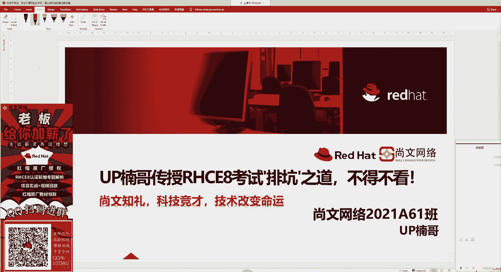
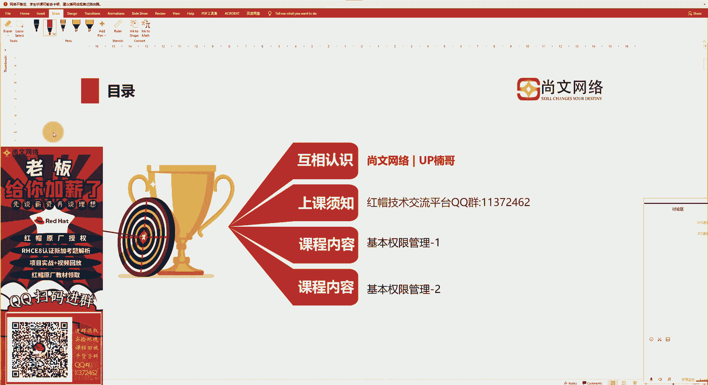
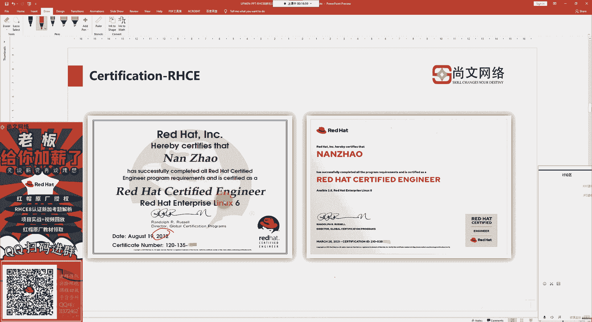
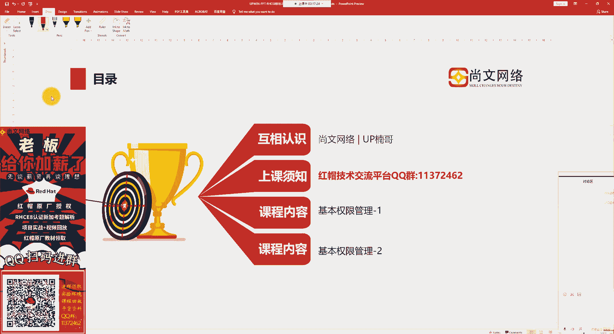
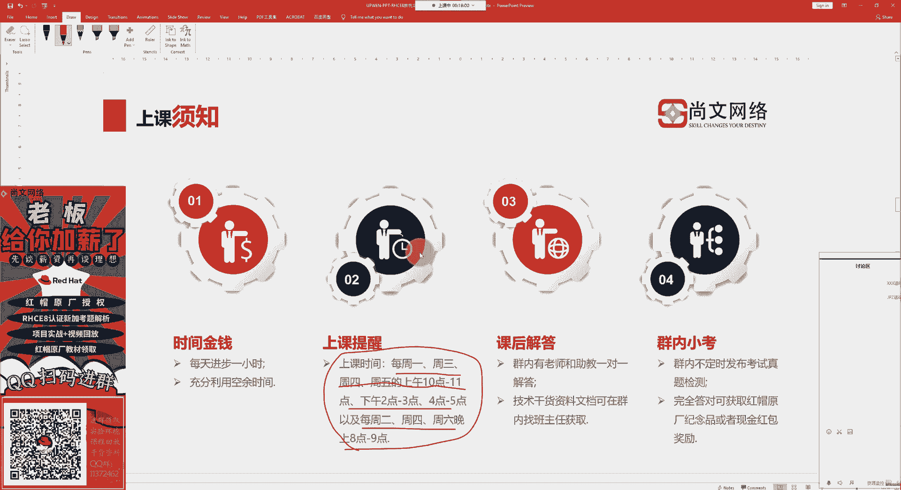
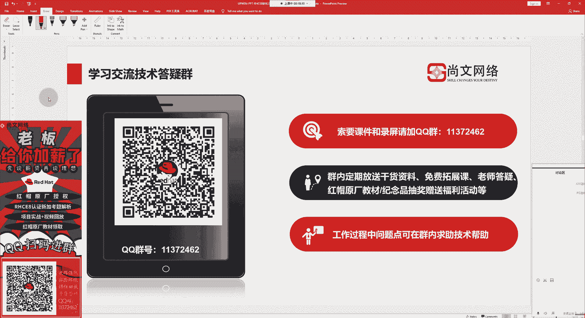
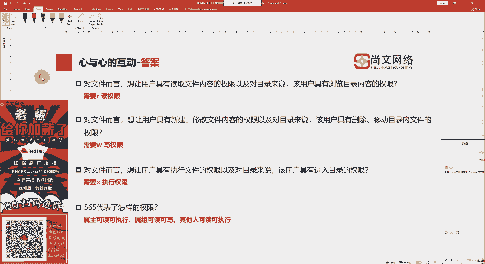
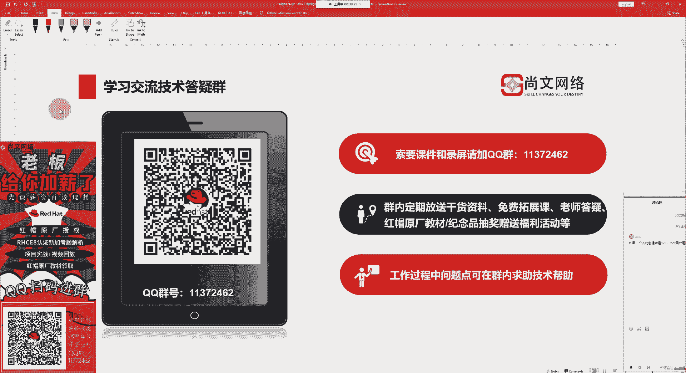

# UP楠哥传授RHCE8考试'排坑'之道，不得不看！课题之基本权限管理P1.mp4 - P1 - 尚文网络IT - BV1Y24y117o4

线上的同学能听到我说话吗，可以听到我说话，打个一试一下好吗，线上的同学能听到我说话吗，可以的话，打个一试一下好吗，好的那我们就开始来上课了，大家好，我是来自于尚文网络的阿普兰哥啊。

今天由我继续为大家来做关于这个红帽认证rc的认证的排空之道，然后不得不看啊，为啥不看不，为啥是不得不看呢，是因为楠哥亲身参加过lc 18的考试啊，所以说在考试之前考试中对吧，我们会要注意哪些细节。

通过我们的这一个课题，我们去给大家来做讲解，然后来去帮助大家干什么，顺利的能去通过，假如说我们线上的同学有这个想要去做rc 8的这个考试，有这样的一些想法或一些需求对吧，通过南哥的这个排除之道啊。

就可以帮大家来做什么的，来做一些这个这个什么呢，这个这个呃一些知识上的啊，知识点的一些讲解，我们南哥都会给大家去讲一讲，然后去排一排好吧，那么我们上一节课的内容呢。

是讲到了关于在考试过程中会考到了一个知识点是什么呢，是关于这个那个那个用户的是吧，关于用户的，那么呃关于用户的一些创建对吧，你这个创建的时候可能需要指定一些什么呢，指定一些参数对吧。

我们在平常的工作中也是啊，你创一个用户会经常的去去指定什么呢，指定一些比如说你的ui d g i d对吧，指定你的附加组，指定你的目录，指定你的shell的工作环境，指定你的过期时间对吧。

我们还可以通过user mode啊，modify这个命令去修改一下我们的什么呢，这个用户的一些属性对吧，然后呢我们也可以做一些删除的操作对吧啊。

但是我们在删的时候要注意是不是要去把那个加目录把它删掉对吧，我们通过usda杠r的参数啊，把那个加入，我们都会干什么呢，啊都会这个这个这个就是一块给删掉对吧，这是我们上节课的内容。

那么今天呢我们会来给大家去讲另外一个知识点啊，跟考试有关对吧，考试中会考到的啊，我们讲的都是一些精华对吧，今天我们讲点什么呢，是今天讲点啥，今天我们会讲一点什么呢，讲一点关于操作系统这个权限。

那权限上的一些这个知识啊，会考到了这个权限的一个知识点对吧，当然了，一个是什么呢，就是一个基本的权限啊，就是我们首先要搞清楚啊，在linux系统上对于一个文件来讲，一个目录或者说一个普通文件。

那么他的这个基本权限的表示方法啊，就是你要能看懂啊，这个权限是怎么表示的，这是第一个，第二个是什么呢，第二个是这个啊，第二个是啥，第二个就是我们的一些叫特殊权限，那么在考试的过程中也会去考到，好吧啊。

这那么接下来的话我们今天这个内容就会先给大家去排一排对吧，排空嘛对吧，先去排一排这个基本的权限的啊，知识这个我们学完了之后啊，我们就可以把什么呢，就可以把我们的一些知识啊做一些这个总结对吧。

然后剩下的什么呢，剩下的就是我们的真善美好吧，那我们来开始我们的课程，上文治理科技竞赛，技术改变命运，是咱们上文网络的企业理念，希望大家以后可以去多多关注，那我们上完网络好。

那我们就往下走走起来啊，按照我们的惯例对吧，按照我们的惯例是什么呢，我们还是会分为四个四个小小小的一个这个章节对吧。

那么我们在之前也给大家在其他的课程已经给大家去什么呢，去这个呃做一些啊，这个什么呢，这个关于咱们上方的一些简介对吧，授权也好啊，以及考试中心也好对吧，培训加考试提供一站式的服务对吧。

这是咱们上文的这个核心优势好吧。

大家可以去那个是这个事后啊，可以到我们的官方网站对吧，到我们门户网站，到我们的一些呃关注一下我们的微信这个公众号对吧，我们都可以做一些关注啊，顺便你也可以关注关注南哥好吧，然后呢咱们上完网络18年是吧。

这个能做到18年也不容易啊，那么靠的什么呢，就靠的是我们的service啊，靠我们是我们服务，那么我们给咱们的学员提供哪些服务对吧，ppt项里面都会有没毛病吧，对吧啊，这个就很好对吧。

然后再一个呢就是说我们可以面向全国对吧，不仅仅只是说某一个城市啊，我们是面向全国提供这种推荐就业的机会，那推荐就业机会啊。

希望大家以后可以去多多关注我们的上网络啊，因为这个因为什么有南哥在是吧，南哥到底是谁嗯，来自于社会网络是吧，而且是这个同时呢也是这个教学总监是吧。

呃我的一些这个知识的背景是吧啊知识的背景从我们的这个什么呢，从我们的这个传统技术架构的，我们讲，我们叫这个on primacy对吧，传统技术架构，这是一种。

还有一个呢是这个platform平台这一层好吧，再一个呢就是public cloud云端安了啊，我们呢会把一些传统的技术架构的知识对吧，这个把基础夯实了，夯实了之后，我们会转向什么。

转向到platform啊，然后我们会以什么呢，会以服务的方式对吧，大家我们现在都在谈服务，一个叫s，一个叫pass对吧啊，这个把技术架构作为某一种服务，把我们platform作为某一种服务。

然后把所有的这种服务我们可以通过云端落地，是落地了之后按需付费，我们就可以去使用什么呢，使用我们的s图，或者说使用我们part图，然后来去构建我们的新引发系统。

然后我们可以帮助企业去做啊这种数字化的转型对吧，做了一个很好的铺垫，然后从而会实现我们这种对吧，向南不一样对吧，我们都是从那个技术架构走过来的啊，然后呢会实现我们的一些这个啊其他的一些核心的价值啊。

那这个呢是我的一些啊一些项目经验啊，大家可以去再去了解一下啊，从传统运维到互联网运维啊，传统运维到互联网运营，然后那个行业上对吧，我们都会在一些主要的行业，都有一些这个行业的知识的积累。

所以说亮亮红帽认证啊，从16年12年开始，而是要6r c16 啊，然后从12年一直到现在对吧，难怪一直在专注于做红帽的啊，一些整个认证的体系，那么我们的linux操作系统也是从哦原先很重要的一个位置。

然后就变成什么呢，变成了一个不得不去学的一项技能。

对吧好，那其他的医生认证，因为咱们这个行业实在是太复杂了，对吧嗯，比如说网络的主机的虚拟化的对吧，数据库的那个安全的。

这都是我们的一些啊具方向性的一些认证啊。

就这些时间段啊，周一周三周四周五上午，这个南哥都是在现状对吧，我们都是在线状态，然后我们可以一块去一起去交流linux的技术，以及跟linux以外的一些啊as上的知识，或者说pass上的知识。

我们都是可以的好吧，都是可以的啊，然后再一个呢就是我们可以加群音。

对吧啊，放了一个扫码进群啊，那你扫码进群能干什，那能做到什么课件儿啊，录屏啊，以及我们在工作的过程中会遇到一些什么，这个寻求一些知识的技术的帮助，对吧啊，我们都可以加群，然后来啊领取。

所以大家这个可以一边听课，一边去做一些这个加群的操作啊，接下来的话我们就来看一下，那我们这个帮大家来拍一下这个权限啊，基本权限的一些概念啊，在考试过程中会考到这样的一些知识点。

那首先呢我们来看一下这个权限啊，什么是权限，我们在操作系统中如何去表示这种权限，那个权限呢我们是这么来做的对吧，二到十个字符对吧，第第二到十个字符每三个为一组，什么叫二到十个字符。

就是我们在下面的这张图片，大家可以看到啊，比如说这个叫b然后呢这个bin前面是一个代表着我们叫d啊，d的话往下看对吧，走到这d代表了什么叫directory啊。

d i r e c t r y对directory目录啊，也就是说你前面看到了一个d代表的是一个目录文件，除此之外这个目录文件还有什么，还有比如说杠啊，这个地方会有一个杠，杠代表的是什么呢。

就以普通文件啊，就是以普通文件，然后再往下的话啊，除了普通文件之后还有什么，比如说用l对吧，l代表的是一个什么是一个链接文件，而且什么叫软链接对吧，什么叫软链接啊，软链接文件好吧。

一个l那么除了这种软链接，还有什么，还有这种硬链接对吧，还有硬链接文件，那么他们之间有什么区别呢，各自的优势是什么对吧，大家一定会去比较关心啊，一定会好奇对吧，这个两种链接文件的一个区别啊。

大家可以去关注一下南哥的其他的课程好吧，在南哥的一些这个其他的课程里面啊，会有讲到软链接和硬链接的这样的一些这个知识啊，大家可以去关注南哥其他的课程啊。

那么今天呢我们就不在这儿去详细说软链接或者是硬连接，那还有呢就是那个b啊，那个b啊，如果你是个b的话，代表这个block b l o c k block块设备啊，也就是说就是一什么就一磁盘对吧。

或者说一磁盘中的一分区啊，这叫block，然后那个c字符设备，字符设备代表了什么，就代表了我们的一些什么，比如说这个鼠标键盘对吧，这就是我们的一些字符设备，常见的一些文件类型，我们就说到这儿是吧。

就这就这样集中一个d的目录，然后是什么呢，然后是这个杠普通文件l链接文件，然后c字符设备文件，那么接下来的话，那我们就看第二到十个字符，234对吧，这个234啊，从二到十个字符这里面就代表什么呢。

每三个为一组，南哥这张图片里面也已经都看出来了是吧，那这个左边不是三个字符，一组中间三个字符一组，右边有三个字符为一组，就是左边代表什么叫文件的拥有者，或者说这个文件的创建者，然后中间三个字符代表什么。

代表的是英语者跟英语者同意组织这样的一些用户的权限，右边三个字符是代表了什么其他用户的一些权限啊，其他用户的一些权限，三个组共九个字符，三个组共九个字符对吧，所以说是二到十，那么每一组下面都会有什么唉。

有r有w有x对吧，我们来看一下r代表的读，对于文件而言，用户具有文读取文件内容的这样一种权限，那也就是说对于什么对一对于一个杠对吧，就一普通文件，对于这个文件来讲，如果说他有了独的这样的权限。

代表什么呢，代表的是用户具有那个什么呢，去就相当于是什么，我们可以去读取到这个文件里面内容的这样的一些权限，如果你是一个目录的话对吧，就像我们截图志们这个bem是一个目录。

那么我们对他来说具有浏览目录的内容的权限啊，浏览目录内容的权限，然后x和w right对吧，w对于文件而言，该用户具有新建修改文件内容的这种权限，对吧，就有新建修改内容的权限，也就是说我们写的操作。

那么对于这个目录来讲，我们可以把这个目录做一些remove dr对吧，rm dr或者说做一些mv的一些动作对吧，移动目录或者说移动目录文件的一些文件这样的一些权限啊，这是right写的权限。

还有一个叫什么叫x x代表的是excuse执行，对于文件而言，该用户具有执行文件的权限啊，什么文件，比如说脚本文件对吧，这个脚本文件我们要让他去什么，我们要去执行一个脚本的话。

是不是要有x要有执行的权限对吧，当然不是今天对吧，我在后面的一些课程我们会讲到什么呢，那个叫特殊权限对吧，也就是说你要让它成为一个有效的这种s u i d的也好，或者s a d也好啊等等。

我们都可以让我们需要让什么让这个相应的位置要有一个x的权限啊，这样的话才会满足有效的特殊权限，对于文言而言，该用户就有执行文件的权限，那么对于目录来讲。

我们就会有一个进入或者说切换到目录的这样的一个权限，大家是不是还记得如何去进入或者切换到一个目录啊，我们是不是用趁着directory cd的这个命令对啊，我们用cd的这个命令来实现什么呢。

进入和切换目录的这样的一个权限，那你会看到我们这张图有一个是吧，有一位上比如说属主对吧，然后这个上面有个杠，你看到了吧对吧，这个杠表示什么，该项没有权限，该项没有权限啊，可能会没有写的权限，好吧啊。

不知道大家有没有理解到对吧，就是对于说对于一个文件来讲，或者对于一个目录来讲啊，当你具备的读写执行表示着什么，它的权限的一些表示的一些含义是不一样对吧，它的含义是不一样啊，好吧，我看有同学问啊。

一个如果一个人的创一个人的创建者是个三叉是吧，叉叉叉啊，这个我一般穿裤子专选叉叉l啊，你还比我多一个叉好吧，这个这个说说一个人的创建者是123，然后root用户属于数组还是其他人啊。

就是你的这个这个文件是吧，你的创建者拥有者是123啊，就是说你这个文件的拥有者是123，然后root用户属于数组还是其他人，这个就要看你的这个用户啊，你的那个什么呢。

或者说你的123的附加组也在root，那么这样的话root用户就属于什么呢，就属于数组了对吧，或者说附加组不是在root里面，那就属于什么，那就属于其他人的这种范畴，就是other这种范畴对吧啊。

选二字分数好吧好，那么我们通过这个命令是通过我们通过ios我们去看到之后，我们看到什么呢，除了属主属组和其他人的权限之外，你在这个地方还会看到什么呢，这个目录文件或者说这个文件的一个什么呢。

这个文件的一个这个属主和那个属祖是谁是吧啊，我们就以这个病为例，那么这个目录文件的属主是root，那么它的这个数组也是root对吧，就前面这个root是代表的是蜀黍啊。

就是那个拥有者后面那个root代表什么，代表的是数组对吧，就是和这个拥有者在同一个组织这样的一些用户啊，假如说我们会具备了一些什么呢，一些一些这个设置之后好，这是权限的一项定义啊，我们就讲完了。

那么怎么去表示这个权限对吧，怎么去表示这个权限啊，这个权限我们会看对吧，会有这样的一些表示方法，第一个是我们用啊这个数字的表示法啊，我们用数字表示法，那个数字表示法的话，我们是通过啊这样的一些形式对吧。

咱们刚才不是说了嘛对吧，你的一个基本权限二到十个字符对吧，然后我们假如说是这样写的对吧，那这样写，那么第一组代表什么，代表的是数组，就是那个文件的应用者具备了可读可写可执行。

第二组代表什么可读可写可执行，第三组可读可写可执行对吧，那么这个时候啊，假如说啊假如说你的属主，比如说我有一个读的权限对吧，甭管是属主属组还是other，我们有只要有读的权限，那么这个读我们用什么呢。

用四来表示，那我们用四来表示啊，那如果你有了一个写的这样一个操作啊，这样一个权限我们用二来表示x的话，我们用一来表示，那也就是说如果你的属主这一位我们叫user是吧，叫属主这位如果是满格了对吧。

权限是满的r w x那么也就是说是4+2+1等于几等于七啊，等于七对吧啊，等于七，那么也就是说啊我没有看到啊，这个四代表着什么，代表的是具有毒的权限，然后二的话代表了什么写的权限，一代表了执行的权限。

如果是零代表什么呢，光溜溜的对吧，啥权限也没有对吧啊啥权也没有好吧，然后这个时候呢你会发现啊，你可以你就就加了对吧，如果是等于什么呢，如果是等于三，那么也就是说是2+1对吧。

2+1是那个写和执行权限没错吧，如果是五的话，那应该是4+1，那也就是说是独家执行，如果是六的话，应该什么是4+2，就是可读可写，那么最后一个就像我们这个啊我用笔写出来的一样对吧，r w x啊。

那么这个呢就是我们一个啊这个呃这个满格了啊对吧，当然了，我们只是说只是属主，就是user，那这边数组也是一样的道理对吧，你如果是零代表什么沙宣也没有对吧，然后我们依次往下推，如果你这个地方是rw x吧。

那么你的数组也是奇other，如果都满足的话也是七，所以我们会有一个说法叫777好吧，也就是说我们通过数字你就能看到了，数组拥有者是具备了什么权限对吧，数组用了什么权限，阿泽代表了什么权限，好吧好。

这是我们的什么呢，这是我们的这个，那个啊权限的权限上的问题，好吧啊，权限问题啊，这是这个权限的一个数字表示法，当然了除了数字文化之外呢，我们还可以用文字表示法，属主对吧，就是比如说这个拥有者。

我们叫拥有者是吧，叫属主拥有者，我们叫什么呢，叫user，我们叫user对吧，user，然后呢你的数组啊，你的数组就是说跟应用者在同一个组里面这样的一些用户，我们叫数组，我们叫group。

那我们用grp来表示，既不是文件的应用者，也不是和应用者在同一个组里面的，我们叫什么呢，叫other啊，叫other，那么对于文字的表示法，如果说我我要给一个数数来设置权限的话。

我们应该是叫u如果你是一个数组的话，我们是一个什么，我们用g来表示，如果你是其他人，我们用o所以文字表示法就叫u g o好吧啊u9 ，所以我们在这边也会有写到啊，也会有写到数组u数组j其他人啊。

other，当然了，我们还有个什么呢，a那也就是说是u加g加o对吧，那我们就可以用a来表示对吧啊，用a来表示想让这个数组有一个执行的权限，那我们用g怎么怎么样对吧，如果让其他人具有一个x执行的权限。

我们用o怎么怎么样对吧，那么具体我们来看啊，这个就是说这个权限上对吧，权限上我们怎么去啊去使用对吧好了，那么我们通过前面啊我们会把一些什么呢，我们会把这个呃这个文件的啊。

就一个文件目录文件或者与普通文件对吧，它的权限定义啊，然后再一个就是说怎么去表示这些权限啊，然后再一个就是我们的权限啊，它的一些功能对吧，具有毒的话啊，具有什么样的权限，如果是写的话，具有什么样的权限。

不知道大家有没有去听懂啊，如果没有听懂没关系啊，这个我们都是有回放的是吧，这个大家可能都有第一次对吧，第一次这个接触linux操作系统和windows不一样，这是很正常的对吧是啊。

那么这个时候啊这个时候就怎么着呢，就要重复来看回放了对吧，这是第一个，第二个你也可以去那个什么呢，我们可以要一些资料啊，我们都可以去去拿好吧，那么我们来做一下心与心的小互动，这个对于文件来而言啊。

就一普通文件是吧，想让这个用户具有独文件内容的一些权限，或者说啊不能叫或者说叫以及对吧，就是and的对吧，并且对于目录来讲，该用户具浏览目录的内容权限，我们来讲一下你是一个具备了什么样的权限对吧。

这是第一个，第二个对于文件而言，想让用户具有新建修改文件内容的权限，以及对目录来说啊，具有删除移动目录类文件的这样一些权限，那只要提到修改，大家会自然而去想到什么呢，一个权限对吧。

再一个呢就是说对于文件而言，你要有执行了对吧，或者对于目录来讲，我可以去cd的啊，就是进入或切换到某一个目录这样的权限啊，大家可以想到哪一个权限对吧，那最后一个呢就是这个565代表了怎么样的权限。

那565代表了一个怎么样的权限，代表什么样的权限，代表老师想想对吧，大家可以去想一想啊，关于前三个的话，其实答案就是在我们的什么呢，就是在我们的之前我们所讲的内容当中好吧，那个第一个啊。

对于一个文件而言对吧，或者说对一个目录而言，我要有浏览目录或者读取文件内容的权限，我们要有r的权限对吧，就是要读的权限对吧，谈到这个修改或者删除，我们这时候就要有一个写的权限w的权限。

那么最后一个要想去执行某一个文件，或者说让目录cd的啊，这个excuse，就是那个那个cd change directory是吧，cd到某一个目录切换到我们一个目录，这样的权限。

我们要有这种x的权限对吧，那么565代表了一个怎么样的权限啊，首先看这个五五的话应该是什么，五的话应该是4+1对吧，4+1，那么四的话是不是读，然后一应该是x，所以它是这样一个权限对吧，代表的是4+2。

我们有什么呢，四是那个毒二是什么写，但是没有执行的权限对吧，最后一个五和我们前面的那个什么呢，数数是一样的吧，r杠x是吧，所以你完整的一个什么呢，完整的一个权限是不是应该用这样的方式对吧。

具有可读可写other，具有可读可执行的这样的一些权限，是啊具有一些这样的权限，不知道大家有没有对权限的内容做了一些深刻的理解，大家可以写在课后啊，拿到我们的ppt对吧，可以去看一下。

再去回顾一下我们这些权限上的一些定义好吧，这些呢都是我们的一些基础的权限啊，基本的权限，所以大家要去做一些深刻的去理解好，这个接下来的话就是什么呢。

一个重要的环节是什么呢，就是加群对吧，当然了，我们可以时时刻刻加群啊，只要你扫了左下角的那个qq扫码进群对吧。

