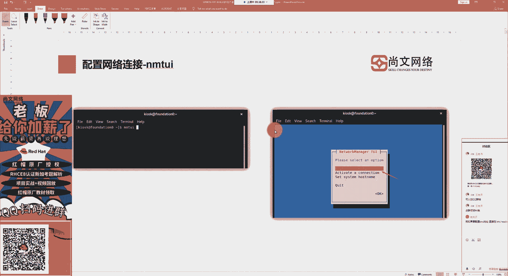
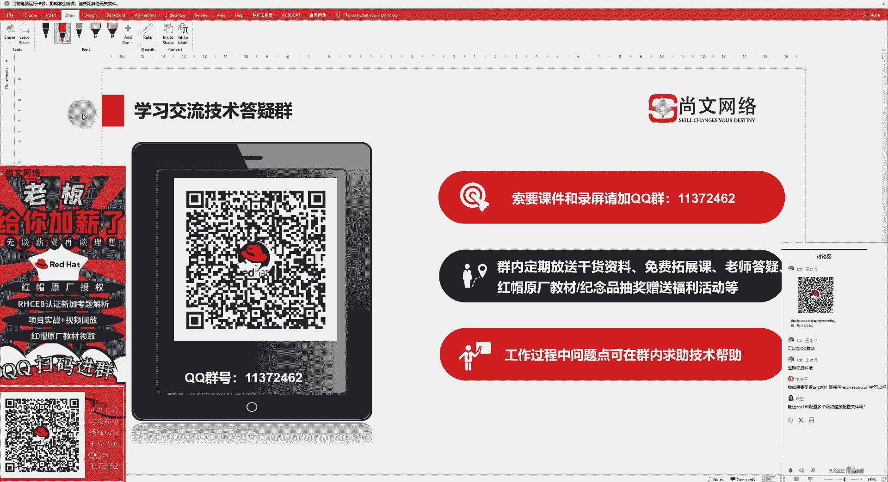

# UP楠哥传授RHCE8考试'排坑'之道，不得不看！课题之配置网络连接.mp4 - P1 - 尚文网络IT - BV1H84y1C7Z2

各位线上的同学能听到我说话吗？各位线上的同学能听到我说话吗？如果可以的话，我们就在群里面打个一，好吧。嗯。呃，我们来开始今天的这个课程了。大家好，我是来自于上文网络的阿普南哥。嗯。

这个今天呢由我继续为大家来传授一下，对吧？我们继续来排一排啊，关于整个的2CE8的考试的啊，我们遇到了一些坑，对吧？我们可以帮助大家来做一些这个排坑啊，所以说我们的这个课程啊。

大家可以去啊去啊持续的去关注啊，因为我们的这个课程啊是啊因为我本人是已经亲身啊参加过这个2CE8的考试，所以遇到了一些细节和一些问题啊，南哥都知道啊，所以大家可以在这个南哥的带领下啊。

来做一些这个啊梳理，是吧？那我们在上一节课的内容呢，我们会把这个安装的啊，就是。无论你是参加考试，你平常在练习的过程中，对吧？我们肯定要去先去把操作系统先装好啊，装好之后，然后我们在此基础之上。

我们去啊去这个准备一些练习，对吧？包括我们一些环境的搭建啊，包括一些这个呃命令的一些敲，对吧？敲击一些命令，我们都需要啊去这个这个在这个我们的练习环境中啊，来进行这个操作。那么我们今天这节课呢。

我们会这个讨论一个问题啊，就是说这个首先呢我们在不同的虚拟机之间，对吧？就是说假如说我们在这个考试的过程中，对吧？它一定会不仅是让你在一台虚拟机去操作，应该是会让你在两台甚至是多台操作啊。

这个虚拟机上来进行这个这个考题答题，对吧？那么这时候啊，我们就需要考虑一下什么呢？虚拟机和虚拟机之间的联通性，对吧？也就是说我们需要干什么呢？我们需要按照我们这种这个要求啊。

我们会先要把我们的虚拟机和虚拟机之间的网络，先把它给啊，这个搭建起来，对吧？然后这个配好了之后呢，我们还要去做一些联通性的测试啊吧？那么这一个部分是我们在啊在我们这个考试过程中啊。

我们会啊首先会要求我们去这么做对吧？啊，首先会要求我们。所以我们嗯从现在开始，我们要先把什么，先把网络搭建好，对吧？你可能有了虚拟机，但是你的网络不同啊，也不行，对吧？啊。

当然我们的网络里面会包含了什么我们的一些啊这个传基本的这个IP啊，包括什么呢？包括我们的这个呃主机名，对吧？然后这时候你会发现我们是不是能够联通啊，能能拼通啊，并且我们可以通过一些啊。

在没有这个DNS的情况下，我们可以去做一些解析，对吧？所以我们都要去先把这些的啊内容给这个做好了，否则的话，我们未来可能就没有办法去做一些其他的操作，对吧？比如说可能我们通过亚源，对吧？去安装软件啊。

啊，这是我们的啊这个第一部分的。啊，先把网络搞起来。那我们在今天的内容中，我们可大家啊就来看一下如何去把网络搭建好，然后去测一下这个网络的一些联通性。好吧，那上文治理科技竞材技术改变命运啊。

是咱们上文网络的啊是咱们上文网络的这个企业理念啊，希望大家可以去多多关注咱们上文网络。

那我们就开始了今天的内容。按照我们的惯例呢，也是分为四个部分，对吧？分为四个部分啊，呃，其中呢我们的内容课程内容的话就是第一个是啊去配置一下这个网络连接，对吧？然后第二个呢是什么？

第二个就是我们要去把啊网络连接的一个情况，我们去进行为测试，对吧？我们最什么我们要去学会一些命令啊，来进行这个测试的网络连接。

那这个上文我们可以去这个简单的来看一下，好吧，那咱们上文是成立18年了啊，18年的一个教学经验，打造于综合性的IT技术人才。所以大家看到这个上文网络四个字，不要给我们贴标签，好吧，就觉得我们只是做网络。

对吧？我们是呃致力于打造综合性的这个IT技术人才啊，这个我们呢这个包的优势是包含了什么呢？包含了我们的啊比如说红帽对吧？我们red hat啊的原厂授权，包括数据库对吧？

甲骨文oracle以及安全层面对吧？安全层面的以及思科和华为是吧？我们这些啊这个网络层面的一些啊原厂的这个培训，那除了培训中心是吧？我们还是什么考中心对吧？咱上网络是VE的考试中心。然后培训加考试。

我们会提供一站式的服务，对吧？大家在咱们上完网络对吧？呃这个参加完培训之后啊啊，根据自己的情况，对吧？我们可以去自信信心满满的去参加考试，对吧？所以我们会提供这种一站式的服务啊。

给大家来提供这样的便利啊，这也是咱们的优势。

那除此之外的话，啊我们可以。啊，咱们还可以去这个面向全国提供这个可以推荐就业啊职位的啊这样的一些机会，对吧？啊，那么咱们上网网络18年对吧？始终是坚持以服务为本啊，服务本，会给咱们学员提供啊。

我们的一些优质的学员服务啊，包括一些这个增值服务啊，包括咱们可以帮大家去免费的去做一些职业的啊IT的生涯规划啊，最近参加南哥的课程，之后我看有有一些同学在群里面就这个啥了，就开始啊念叨了是吧？

这个我这个咱这个行业太复杂了啊，这个怎么去选方向，对吧？啊，所以我们也帮大家去做一些专业的啊这种IT生生涯的职业规划啊。

然后这个是。该介绍一下这个阿普南哥了啊，我呢就是阿普南哥，来自于上文网络，是咱上文的红猫人证的首席讲师啊，也是上文的教学总监啊，网能就长这么个样，是吧？大家就就凑合着看一眼吧，好吧。

这个我的一些情况是吧，一些情况呃，在这个参加啊，运维技术运维项目已经112年了啊，然后同时参加教育培训行业9年以上。啊，这个传统的啊传统的技术架构啊，这是一个一个方向是吧？

然后第二个呢是什么planform啊平台这一层。第三个呢是这个public cloud啊，云端对吧？云端这一层。然后这个什么呢？啊，我们会啊按照我们的啊大家肯定是啊刚才工作的时候。

肯定会按照这个传统的技术架构，我们要去慢慢的去积累一些知识，对吧？然后这个积累了一定一定程度之后呢，我们肯定要往上走走到这个架构这一层，对吧？我们会去掌握一些啊planform的一些平台的一些知识啊。

比如说我们的这个中间件对吧？weserv啊，包括一些我们的一些这个常用的一些开源的啊这个工具，比如说消息地列的对吧？包括我们现在火热的容器啊，包括对容器做啊资源编排的那个工具对吧？啊。

然后再一个呢就是包括我们的一些数据库啊，关系型的非关系型的行式的劣势的对吧？这些内容都是包含在我们的planform这一层，然后我们会把什么呢？我们会把这些资源啊，传统技术架构的资源，包括平台的资源。

我们会转化成服务的方式，对吧？现在我们这个行业大家都。在做服务对吧？那我们最终把服务的这个呃的这个呃成果，我们会落到什么？落到我们的云端，对吧？落到云端之后，然后会形成一些啊产品啊。

然后我们是按照什么的按需付费，对吧？然后呢，我们来。后呢我们会发现我们会有一些这个经历啊，就是我们的一些经历啊，会慢慢的从什么呢？从我们的一些基础架构从而去转到业务层面，对吧？

大家可能啊更多是要跟一些业务人员打交道，对吧？这样的话我们可以啊很好的去帮助我们的企业去实现数字化转型，对吧？啊，提供我们的价值和能力，对吧？然后项目经验啊项目经验的话，这个南哥之前做运维出身啊。

做运维是什么呢？是这个嗯传统运维对吧？传统运维然后这个互联网运维，对吧？南哥都做过啊，这就是我们这个行业里边的两大啊运维的一个方向啊，包括行业上的啊，政府啊，政府教育对吧？啊，大企业啊，包括医疗。

还有这个互联网啊，这是我们在我们生活当中平常我们比较这个主要的几个行业，对吧啊？然后再往下的话就是认证了啊，关于认证的一些情况，南哥12年就考了RHCE6啊RRCE6。然后12年考的从12年开始。

从6到7到我们现在最新的8啊，包括右边是吧，就是这个这个8。X的一个啊红帽的认证啊。那么从12年开始，南哥一直是在专注于做这个什么呢？做红帽的啊这个整个认证体系啊。

对这个整个认证体系呢都有一些研究和探索，好吧。其他的一些认证对吧？因为我们这个行业实在是太复杂了，所以说我们不仅只是红帽是吧？不仅是linux，还有什么一些其他的啊一些这个这个知识，对吧？

我们比须比如说这个什么呢网络啊，斯科的是吧？操作系统啊，这个微软的对吧？包括一些我们的虚拟化的代表VIme啊，还有什么呢？还有这个oracle，对吧？包括这个什么呢？包括我们的安全啊，国策啊。

给我们颁化的CP，还有这个云端的啊，我们会以企业级的共有云对吧？企业级的应用啊，比如说以微软的挨er为例，好吧。

好，这是啊第一部分。那么第二部分呢就是我们那个上课的一些时间，对吧？上课时间我们怎么去上啊，大家需要关注一下这个地方是吧？上课时间是我们每周一、周三、周四、周五啊，上午10点到11点。

下午到2点4点到5点啊，这些是元旦呢我们会啊包括每周二周四周六晚上8点到9点啊，耽哥啊，我们是这个时间去上课啊，大家在。这些试卷队呢我们都可以去做一些这个交流。当然了，大家去加群，对吧？加了群之后。

我们可以随时的对吧？白天晚上对吧？我们都可以去，大家如果有随时啊，有时间的话，都可以我们这个都可以在群里面进行这个沟通和交流，好吧。好，这是上课的时间，大家可以去下载腾讯课堂的小APP啊，小APP。

然后这个APP呢我们会干什么？会有一个上课的及时提醒，对吧？啊，大家可以去加群，好吧？啊，没事，没有事没事，我们加个群，对不对？啊，也许大家可会在以后会有一些意想不到的一些收获，对吧？包括一些技术上的。

啊，然后这个呃这个我们会在这个什么呢？加群之后，我们能干什么，对吧？啊，给大家已经拉出来了，对吧？这些我们可以啊在群里面做这样的一些事情，是吧啊？

然，大家别忘了加群。那么接下来的话我们就来看一下啊，来看一下。首先啊我们这个刚才也在开篇的时候已经提到过了，对吧？假如说我们要去参加考试，对吧？你在平常的练习中。

首先一定要让虚拟机和虚拟机之间一定要互通，对吧？那么在linux操作系统里面对吧？操作系统里面跟网络互通连接配置的文件，有这样几个，我们来看一下，第一个。啊。

第一个叫ETCs config network杠 scripts。啊，就是说我们用来做配置网络连接的这种文件，我们叫profi。啊，我们就要跑fi啊。代表了在哪个路径下呢啊。

在ETCC configure network screen里面，然后你就里面会看到了很多的啥很多的配置文件。我们用FCFG啊，FCFG杠某某某啊，这个配置文件里面代表了什么意思呢？

假如说我们可能会有一个网卡或者多个网卡，对吧？那我们可能会按照什么呢？会按照网卡的设备名称，然后来去填充后面的部分。也就是说假如说我们第一个这个网卡啊，第一个网卡我们叫什么呢？叫EN啊，在我不的啊8。

X套系统叫ENS160。这是第一个网卡的设备名称。也就是说你的网卡的名称就叫它啊，ES160。然后ES160呢，我们会按照这个对应的关系，对吧？我们会在这个路径下会产生一个什么呢？

会产生一个叫ifFG啊ifFG啊，然后杠啊，比如说叫ENS160。那么这个配置文件，我们叫它的啊，那么这个配置文件里面就对应了谁对应了是ES160这个网卡的网络连接的配置啊，包含什么配置。

比如说你的啊叫简单的说是吧？比如说麦那个那个你的mac对吧？你的什么呢？你的MTU你的那个什么呢你的IP地址对吧？网关掩码DNS对吧？然后你的这个呃这个起网络是是通过什么样的方式，我们叫me是吧？

METHOD叫这种方法是基于谁啊，是基于DCP的呢，还是基于这种menu。啊继于这种手动的对吧？或者是基于这种静态的啊来进行配置啊，就在在这个文件里面我们都会有体现啊，当然了啊当然了。

这个一个接口可以对应多个配置文件，对不对？假如说你你这个呃我像我们之前像南哥之前在做运维的时候啊，啊，用这个什么呢？用这个windows的一个工具叫IP help啊，有这么一个工具啊。

这个工具的原理是什么呢？就是说我来到了啊，因为南哥对对这个对服役的啊，就是服务的这个用户，不仅只有一家对吧？可应该会有呃想想啊，应该会有至少服务了十几家用户啊，这个至少是一家，有点记不清了。

那么你到了每一家的这个假方到用户那边，对吧？你去人家的机房去做一些巡检，对吧？啊，比如说可能要去这个呃这个这个连到人家的这个办公环境里面啊，不管是通过VPN还是其他的方式啊。

有的时候可能还要去机房里面去。用你的那个笔记本直连连到了捅到人家服务器后面的屁股上去收集一些信息，对吧？通过管理口去收集一些信息啊，通过管理口里面去保存一些配置啊，那么你每到一个啊用户那，对吧？

它的那个用户环境一定都是不一样的，对吧？有的可能是192段的，有可能是十网这，有可能是172网的，对吧？所以说啊你服役了这么多家，然后呢，我们就通过这个IP help来实现一个什么呢？对吧？

相当于是我们做了一个批处理啊。通过批处理啊，你到了哪一家对吧？我们就相当于通过这个工具去切换，对吧？实际上也就是说基于windows的话。

我们是通过netH啊这个命令去做不同的啊这个啊本地连接我的这个网卡的一个IP地址的切换，对吧？有的时候可能是直DECP了啊，有的时候直接你要去设置人家的那个同一的段啊，当然这个段是人家给到你的这个地址。

对吧？那么我们像我们的这个linux也是一样的原理啊，你的一个接口我们叫ES160，同样的我们可以去分配不同的这个网络配置，对吧？可能在FCFG杠ENS160这个这个当中，我们设置的是一个什么呢？

设置的是一个静态的，比如说是192168对吧？然后1点X的一个段，那么假如说我还可以再来一个什么我们叫FCFG杠啊举个例子啊，我们起个名。叫阿普文好吧，可以设没问题。阿普文。然后他的什么。

它可能就是来自于叫DCP好吧，然后呢，我们去通过active的这种方式，对吧？active active方式，这样让某一个什么让某一个pfi对吧？让某一个pfi是激活的状态。

那也就是说你现在就当前切换到哪切换到DCP自动获取的方式，对吧？你再去可能去active一个其他的p那我们可能就直接让这个网卡对应的谁1921681点这个段，然后呢我们去做啊一些巡检啊，对吧？

运维这样的一些操作。那其实说白了就是。一个接口对吧，我们可以对应多个啊，我们可以对应多个这个p file名称。那么你的这个多个pfi的名称是不是都是来自于这个路径下啊，都是来自于这个路径。

我们要做的就是什么做IQ的一个切换，对吧？啊，大家要要理解是吧？要理解啊，有的时候说这个看到里面就有个ES160发现不要以为什么呢？它它是设备名称，对吧？它里面配置的是关联到对应的网卡的名称。

然后网卡的名称里面可以会对应多个pfi。啊啊大家要注意，这是我们的这个呃网卡，就是你的硬件的接口名称的设备和我们的profile的名称啊，是这样的一个这个关联好吧。除此之外的话。

我们还有一些在平常的过程中可能要去用到的配置文件。首先第一个那我们叫ETC的result点com这个配置文件相当于什么呢？相当于啊我们要做DNS。那我们要去指定DNSservIP对吧？

我们要把这个DNS的地址，我们要把它扔到这个文件里面。当然了啊当然了，我们的8点X呢是啊我们的8点X是怎么样呢啊，并不是说直接通过啊VI的方式啊，或者是通过icol方式。

或者是一些其他的方式追加到这里面，就说不是直接去写到这个文件。对吧，而是先要去通过一种配置。我们比如说叫DNS1啊DNS1等于啊比如说1。1。1。1啊啊通过这种方式先写到我们的那个p当中啊。

就是写到我们这个pfi当中，然后呢它会关联更新到哪，把这个地址啊啊关联到ETC康里面，转成了一个形式，我们可能叫name server是吧？叫name server。啊，1。1。1。1。

有的同学可能会问我直接写name server1。1。1行不行啊？不行，你必须要先干什么先在这个配置文件里面去啊，加上这样一条配置好吧，然后通过它然后去关联到我们的这个预算的康复啊。

在早期的啊我们的一些linux的发行版本里面，你是可以直接去写的啊，可以直接去写的。而且你写的话，你最多只能写三行啊，就是说你最多只能去写三行name server啊，因为它最多最多就只吃道三行，好吧。

嗯，这是一个。第二个呢叫ETC host的S啊，当我们没有，如果没有DNS的情况下，对吧？没有DNS的情况下，我们是不需要靠这个玩意儿来解析，对吧？靠这个hostS的这这个文件来解析，对吧？

里面会包含了IP和啊这个什么呢和我们的域名的啊，或者说和我们主机名的一个一一对应的关系。对吧啊，和这是一是一个一一对应的关系啊。嗯，这个什么呢？啊，你的域名可能会包含什么呢？包含我们的FQDN对吧？

FQDN啊，这是一个。然后还有可能什么？还有可能是我们的这个呃这个主机名，对吧？啊，可能是我们主域名啊，都是可以的好。然后这样的话，我们就可以通过pin的方式，对吧？pin的方式。

我们就可以去拼我们的IP，或者说我们的那个域名，对吧？啊，IP或者我们的域名。然后第三个呢是什么ETC的host点com。啊，ETC下面的hos点com啊，ho点 cof呢，我们这个平常可能不太用啊。

但是大家要知道里面有什么内容啊，里面可能有一个配置，我们叫m down啊，叫 multi down就这么一个东西。part on啊，m呢我们指的什么叫多学主机啊，叫多学主机啊。

什么叫多学主机大家可能都知道对吧？我们的那个那个比如说windows啊，我们的windows打随便打开一个吧啊，打开一个之后，我们可以看一下啊，我们找到NCP点CPL啊。打开之后。

我们会来看一下那个设备啊，我们的那个网卡随便找一个啊，就找找找哪个，就找一我的本地连接吧。啊，然后点击右键点属性之后啊，你就能看到我们的一些这个接口的IP的一些配置，对吧？你点开之后我的w。

然后你是不是在这个地方就可以添加多个是吧？比如说添加1。1。1是吧？然后一个这个8位的对吧？然后点就O啊，点击O也就是说你看我们同一个接口对吧？以同一个接口，我是不是可以配多个IP地址啊。

可以配多个IP地址，这个就叫多学主机，对吧？啊，叫多。所以啊我们在为什么说刚才又回到刚才那个话题啊，为什么我们的啊一个同一个接口，我们可以去有多个profile，对吧？啊。

我们可以啊在同一时间内我们去激活它对吧？激活它来进行这个切换，啊这样的话我们就可以相当于什么？我们可以配置多个啊多种IP啊，这叫什么呢？这就叫我们的多学主机好吧啊。

所以我们在平常工作在平常中跟网络用到了一些文件啊，除了我们的profile啊，再就是我们的如下的这几个啊这个配置文件。那么接下来的话我们就来看一下怎么样去这个设置了，对吧？啊，怎么去设置。

在这个linux操作系统下呢，我们对网络的连接啊，有这样三种啊，就在我们平常中可能有三种，第一种就最简单的对吧？我用这个啥用图形界面啊，图形界面，然后你找到那个啥啊，你找到你点这个activities。

然后找往下找，是不是有一个设置，对吧？有个设置里面就会有一个network啊，nettwork里面啊，就会有这个东西，对吧？然后呢，你会看到你的这个速率啊，比如说是千兆的或者是万兆的，对吧？

然后这个时候你会干什么呢？你看啊这个点开设置。对吧呀你就点开这个设置，点开设置之后啊，就来到了这个这样一个界面，对吧？你可以去找你的，比如说你的details啊，你的一些详细的设备啊。

包括你些一些这个安全方面的认证，对吧？然后再就是我们可以做IPV4或者说IPV6的这样的一些配置啊，那么接下来的话就很简单了，对吧？大家都是搞计算机了啊，这个我们就不在这儿啊，详细说了，对吧？

你要不然就这个automaticDCP要不然你就manu手动去配，对吧？当然了，IPV4DNS对吧？啊，包括你的这些路由啊，我们都可以来进行这个配置，啊，这个就比较简单了啊，然后第二种方式呢。

我们是通过叫NMTUI啊。

这个NMTY呢是基于我们叫network。对吧network的 managerr啊。举于这么一个东西啊，network manager啊，就它啊也就是说NMTY相当于什么？

基于network manager这个工具的TY的方式。什么叫TUY啊，也是就是说类似于一种图形化的方式，也就是说不用敲命令，对吧？咱不用敲命令，然后你通过NMTY，然后就跳到了这样的一个啊。

我们最起码是可以通过带有有带颜色了，对吧？network manager的TUY对吧？然后这个什么呢？我们可以去做一些啊以下的一些操作。第一个对吧？我们可以去编辑一个连接啊，去编辑一个连接。

到了这个地方啊，大家要注意的是什么呢？啊，到了它就是啊叫连接，对吧？啊，然后你要去编辑的时候是编辑什么呢？是编辑我们的这个叫叫什么叫prole啊，也就是说我们是要去修改我们FCFG。

啊ifG杠哎某一个接口的这个profi里面的内容啊，要修改它啊，修改啥啊修改你的IP的啊这个设置的方式，对吧？CP还是那个静态的啊。然后呢你如果是静态的话，你设置你的IP啊，包括你的一些网络啊。

这是一个啊。当然了，在这个部分里面，我们还可以去做一个事情，是什么？就是去添加一个这个profi也就是说我们要添加一个connection啊，就像刚才南哥举的那个例子对吧？

你在那个network script里面啊，下面可以去生成一个profi对吧？我们在这个地方可以去添加添加完了之后就会到那个目录下去生成了一个啊，它自动就会生成一个啊，我们可可以随便去起名字。

但是这个名字我们最好是和什么和我们的啊现有的网络啊网卡这个啊网卡接口名称来做一个什么匹配，对吧？嗯，你你起一个其他的名字的话，你这个可能就从管理的这个角度来讲就比较乱，对吧？

我们就尽量是和我们的接口名称做一个一一对应的一个一个一个名称的一个设置，对吧？那你设置了多个profile之后，我们这个时候就要去来到了第二个，对吧？我们要去做active啊。

同一时间只能是在一个profi中去生效，对吧？就相当于我们是把什么呢？把网卡的I址做一个切换，对吧？切换完了之后，然后我们就可以去连到这个不同的网络啊第三个呢就是我们的设置主机名是吧？

这个设置sstem的ho name。当然了，你的这个主机名，我们可以是单一的一台叫hose name，也可以是什么？也可以是叫FQDN啊FQDN。好吧。啊，设置都可以是吧？那么我们这个这个什么呢？

在在我们的这个按照这个呃红帽的一个规范的要求下，我们基本上就是要设置以FAFQDN的方式来进行统信是吧？所以说我们要设置啊长一点的域名。就大家可能都在某一个域里面，对吧？在一个域里面。

我们把FQDN把它配置好啊。好，这是这个NMTY啊NMTUY啊，那么还有一种是什么呢？啊，也是我们在这个什么呢？在这个设置的过程中啊，这是NMPY的一些内容啊。NM我们再来看NMCUI好吧。

那我们再来看NMCUY。

然后第三个呢就是这个NMCICRI指的是什么？基于network manager command line，也就是说基于什么基于命令行的方式，对吧？就是基于这个命令行。

那么从这时候我们就要开始真正的敲命了啊，而且也是我们的哎咱们这个考试中啊去考察我们的一个技能的知识点，对吧？他可能不会他不会让你去什么呢？不会让你去这个呃去通过图形，或者说通过NMTUI的方式来设置。

对吧？他更多的是考察你的什么呢？我们通过C2的命令来实现啊，那你如果要去设置我们的网络连接，首先第一个你是不是要先知道有哪些网卡，对吧？这是最关键的啊。

那么我们可以通过NMC1I deviceice啊dice来获得网卡的列表啊网卡列表，这个dice可以简写为D。那这个是可以简写为D的。啊。然后第二个呢是查看网卡的网络信息啊吧，你这个知道了有哪些网卡。

然后我们可以通过connection啊，connection实际上就是用来做什么啊？那个pfi中的啊对应的那种信息。就是你connection，你能去查看一些网卡的接口信息。然后这里面就大家要注意。

这里面就包含了什么，就包含了是你的那个网卡名称对应的那个pfi的这个名称。啊，然后我们是去售啊去售什么呢？去售那个网卡的profi里面的信息，就相当于我们是通过ca的命令啊去看。比如说ifFG对吧？

杠ENS啊嗯这个160。对吧啊，ES100对吧？啊，通过这种方式来查看啊。好吧，那那我们能这个查看时候，我们还可以去把这个网卡我们给把它齐起来，对吧？up起来啊，呃，你再做一些什么呢？

你再做一些呃对于网卡的网络信息的修改的时候，对吧？比如原先他可能是啊你可能要改改网段，对吧？改改网段，然后改改网改完网段之后你要干什么呢？你要先去up一下你的这个啊fi啊，去up一下，然后才会去生效。

对吧？啊，否则的话是不生效的啊，所以我们在啊呃以后啊我们去修改啊，去修改的时候，我们就要去up一次啊，要去up一次，这个很重要。那么你可以去启动网卡，也可以通过这个命令去停止，对吧？把某个网卡给停了。

对吧啊？就通过荡啊当来实现。所以在这个操作的过程中，大家要注意一定是什么呢？后面这个NNS33也好，还是一些其他名称。这个这个名称指的是指的是ifFG这杠某某某就是主要是后面这一块内容，明白吧？

然后它对应的是谁，它对应的就是我们的比如说ENS啊33这个叫interface就网络的一个if啊，就是interface的一个结构名称好吧，你做这样的一个操作不是动不是跟它有关系，而是谁。

而是这个文件里面的这个名称是跟它有关系，好吧，所以这个这个到时候你可以去通过什么，我们可以通过t键去补的啊，这个是可以通过t键去补全的是吧？当然前提是了。

我们在network script里面一定要有啊一定要有没有的话怎么办？我们接下来看啊，没有的话，我们就要去添加一个对吧？我们叫ad啊，要去添加一个啊，那么添加的话啊添加的话。

相当于我们在network script里面去添加了一个叫叫if cFG杠某某某哎，你后面起一个名称叫ES33，对吧？叫connection name那我们就叫ES啊33对吧？

然后这里面就会关联的谁验关联到的是某一个接口啊，你这个接口怎么来的，就是我们刚才通过NMI device这个命令去查看到对吧？罗列出来的啊，所以这条命令对吧？我们通过这个解析啊。

connection name是这个啊文件中的一个部分，对吧？if name指的实验指的是。我们那个接口的名称对吧？你需要通过NMI空格device来查看出来。然后接下来的话，你的这个设备的类型对吧？

我们相信应该大部分都是什么店口，对吧？我们的type是net啊net。然后这个什么呢？然后我们去干什么呢？啊，接下来你就要去设置我们的啊后面开始对吧？

包括下面这部分就开始设置我们这个接口的IP地址的信息了，对吧？首先你要去确认啊，我们叫IPV4点是一个啊这个手动配置的还是一个什么呢？还是一个alto还是一个自动获取的方式，对吧？我们要在这里面去制定。

如果你是一个自动获取的方式，相信大家都知道后面这些IPV4对吧？IPV4gway，我们都不需要设，对吧？如果你不是自动获取的话，你通过什么呢？通过这个啊IPV4点什么呢？

IPV4点啊这个这个menu的话啊，我们就要去设置什么IPV4地址IPV4。准备好吧。啊。好，这是这个呃我们的去添加一个对吧？去添加一个profi啊。

然后你一添加在network杠 squeeze里面就会有这么一个东西了啊，就叫FCFG杠ENS33。对吧就会多了这么一个东西啊。当然了，设置什么manual是设置手这个手动的。

你也可以设置为什么auto，对吧？也可以去设置一个auto啊。我们可以去简短的去看一下，好吧，我们可以简短看一下来到这个哪儿，我们CD到哪儿，CD到ETC啊，先clear一下，好吧啊，cleear一下。

啊CDET吧fi这个目录LL查看一下是吧？你看是不是有一个叫ifFG杠ES160对吧？啊，有这么一个然后还有一个什么呢？我们在之前通过什么呢？通过那个NMI的命令，我们去创建一个叫杠文对吧？

你可以去看一下 ifG杠up文啊，创建出来之后，我们是一个什么是一个手动的方式，对吧？有我们的IP地址对吧？我们的掩码啊，这prefi对吧？还有我们的gateway包括DNS来自于哪个域对吧？

然后你关键是什么？关键点是你对应的dice就是你的设备名称是是ES160对吧？啊，那么这个就是我们通过什么呢？我们通过啊通过。通过这个命令啊，通过一些命令来进行设置的，好吧。同样的啊。

你可以去ca一下ifFG叫什么呢？叫ES160，它的设置都是一样的，对吧？只不过说你看它的这种me什么me应该是一种啊这个DCP的方式，对吧？DCP的方式，然后它对应的这个接口也是ES160。

所以说这俩portfi啊，这俩profi我们都是基于ES160，所以NMCI啊，connection showed对吧？一车啊，你看ENS160，我们现在对应的是哪个啊。

我们现在的conne也就是我们的profi名称是ES160，那也就说应该是它对吧？然后你对应的dice是谁？是ES160这个设备对吧啊，这个设备。所以我们目前当前处在激活的这个过程中是谁呀？

是这个profi对吧？啊，是这个profi啊，那你如果要去切换到另外一个。呃阿普文这个跑菲尔的，我们是不是要去act另外一个对吧？我们可以看一下NM41I是吧？NMCLI然后。呃。

connection对吧？你t键对吧？大家通过这个tab键，你看我们可以去啊去做什么呢？去做一个啊，比如说啊我们通过什么呢去收一下啊，收一下实验，你t见补全了之后，你看有没有什么ES160。

还有什么up普文，对吧？我们可以敲up普文，敲的是这个up普文都可以补全了，对吧？这个里面的配置文件就相当于什么？相当于我们刚才我们通过啊配置啊设置，对吧？好。

然后接下来啊接下来我们来看一下如何去修改啊，也就是说在我们的这个练习的过程中，一个重点是什么呢？我们可能平常不会去增加这么多的，对吧？我们可能会干什么呢？可能会去在某一个的基础之上，我们去新建啊。

或者去修改对吧？那么修改的话，我们就要通过modify的这个动作啊，去修改了，而不再是艾了，对吧？就不再是艾是modifymod谁啊，刚才我们看到了，基于我们现在这个例子对吧？一个是叫up文啊。

一个叫什么一个叫ES160，对吧？在这个基础之上，我们去修改，那么你修改的话，基本上都是如出一辙，对不对？你要去指定你的方式是呢，还是manual，对吧？你是这个什么呢？

你是这个你既然是manual的话，你设置你的IP的一个地址的环境是多少，对吧？包括我们还在这里可以设置什么。IPV4点DNS。所以你在通过瘦啊，你在通过瘦的时候时候，你就会看到啊，就会看到这样的一些。

你看IPV4的什么的IPV4的med是一种方式，对吧？哪种方式manu的方式，IPV4的DNS，我们设置是100。1，对吧？包括我们啊包括我们设置的一些其他的这种配置，对吧？都可以去啊做一些这个查看啊。

好，那我们去通过NMCIconmod对吧？比如说up文啊，然后IP比如说我们是这个什么IPV4点me，对吧？我改为什么manu好吧，然后IPV4点dress对吧？

我改一个比如说10点60点100点100好吧，然后当然了，我们是通过这个啊CIDR的方式，好吧，然后包含了我们的言码，然后IPV4点什么呢？IPV4点这个getway对吧？啊，10点60点100点。

比如说254好吧，然后呢，IPV4。这个点儿DNS是吧，10点60点100点啊，比如说100点这个100万好吧，好，回车啊，我们就这么去修改。修改完了之后呢。

我们一定要记得去NMCUIconnection对吧？卡莱神，然后是up，然后这个up文好吧，注车啊。Okay。Oh。好。啊，这时候你会发现什么呢？你看我是不是连不上了，对吧？啊。

因为我们现在当前是用了ES160的这个portfi，对吧？然后呢，我们这时候可以回到我们的虚拟机啊，可以回到我们虚拟机我们来看一下这个当前的环境啊，当前的环境啊，clear一下，好吧，clear一下。

打开我们这个terminal对吧？啊，terminal之后啊，我们可以看NMCLIconnection啊，然后是这个事回撤啊。大家可以看啊，当前的这个up这个这个p是换成了up普文了，对吧？

然后我们刚才去可以看一下，是吧？我们可以通过叫NMCIconnection这个s，然后up普文回车看一下啊，它的一些这个呃。IPV4啊的I的地址是10点60点100。100是吧？啊，我们设置完了之后。

我们去拼一下，10点60。100。100啊，这个是能拼通的对吧？啊，能拼通了，说说明什么呢？我们ES160当前的这个啊网卡，我们设置成了10点60。100点这个100了，对吧啊。好。

我们在设置过程中就是这样来设，好吧啊，就通过这种方式来试啊。那这个时候啊你看NMCI啊，NMCI connectionnection up。对吧ES160啊。好，然后这个时候我们再来看啊N啊。呃。

NMCI connection show。啊ES。NS160预车啊，看一下我们当前的那个环境对吧？我们当前的环境啊是多好啊，是40。134了，对吧？40。134，然后我们去拼一下，拼192。168。

40。134预车啊，这个时候是能拼通的对吧？能拼通了之后啊，我们因为我们本身是通过这个net对吧？通过net的方式来看一下啊，我们再回来啊，这个时候是不是就啊这个又回来了，对吧？啊，又回来了。

所以NMC1I啊。

collection受回撤，你就会看到ES160当前的这个接口对应的是谁？哪个跑fi是ES160啊，其实就是说。ss configurefinetworkspace啊LLL对吧？

就是这一个啊profi名称好吧。当然你可以去NMCUI对吧？然后是这个connectiondelete对吧？然后up比如说。把它给删掉是吧？删掉了之后，你再去LL看一下的时候，那个up普文是不是就没了。

对吧？这阿鹏就没了，当前就剩我们一个跑fi，好吧。好，这是通过NMC1I的这种设置啊，不知道大家有没有看这个看懂是吧？然后这个大家可以去什么呢？可以去在课后啊去进去进群。

可以去问老师去要我们刚才做的这些操作，对吧？因为我们通过这个CRT做的这些log的操作。我们都是什么呢？都是有记录下来的，好吧，有记录下来之后呢。

我们这个课户都可以通过这个log来去查看我们做的哪些操作。然后呢，我看有同学在问啊在问，如果我要去配置这个地址，对吧？然后配置DNS的地址，直接在就可以吗？啊，这个南哥是不刚才说过了，不行是吧？

你要在哪啊，要在FG啊，在那个当中，我们要去指定一个对吧？去指定一个DNS的一个地址，然后他会更新到啊那个re当。然后接下来的话是说能让ENS160配置多个网络连接配置吗？啊。

这个刚才南哥演过演示过了是吧？我们是不是可以通过艾的方式啊，对吧？啊，包括我们啊你现在是不是可以通过啊NMC1I对吧？connection我们起个名字叫op一好吧。

然后这个呃这个这个ad我们去叫什么叫加个t吧，对吧？isnet对吧？然后connection啊CN杠 name对吧？起个名叫up一好吧，或者是阿2021啊，然后再一个什么if对吧？

if name是ES160啊，然后会撤了啊，这时候它是不是就创建成功了，创建成功之后，在这个地方就产生了一个up2021，所以说它是和什么呢？和ES160这个网卡是做绑定。好吧啊，是做绑定的。当然了。

有哪些网卡啊，device啊，你可以通过这样的方式，对吧？有哪些网卡有ES160，包括他默认的这个啊虚拟网卡要调节是吧？虚拟网卡啊。好，这是这个我们的一些这个解答啊。然后呢，生华的话。

我们来做一个互动啊，做一个互动啊。如何去查看我们的网络连接啊，就是网络连接喷是它的路径在哪啊，这个是不是在在哪个录像啊，大家想一下，第二个呢是如何查看网卡的mac地址。对吧如何去查看我们的mac地址啊。

这个mac地址刚才没有说过是吧啊，没有没有说过。然后再一个呢就是我们如何把这台80X的啊top作系统作为某个DNS的客户端啊，其实也就是说我们要去指定DS的那个IP对吧？其实这几个问题啊。

我们在讲解过程中都有提到对吧？啊，这个路径很重要啊，ETfi net。查看网卡的麦ag地址叫ifif confi杠A啊，这个命令我们刚才没有说对吧？啊，然后再一个就是我们去做DNS的话。

我们是不是要把啊配置到什么？把地址配置到网络的那个当中，然后在EDCcom中就有体现了，那么这个我们刚才没有说这个命令，对吧？这是我们为接下来啊，我们去做一些你既然把网络配好了，配好了之后。

我们是要做一些联通性的测试，对吧？那么这个命令是我们接下来的一个隐身，好吧。

好，大家别忘了加群啊别忘了加群。这个呃南哥在这个无时无刻的去听大家去加群，好吧。好。那么。

