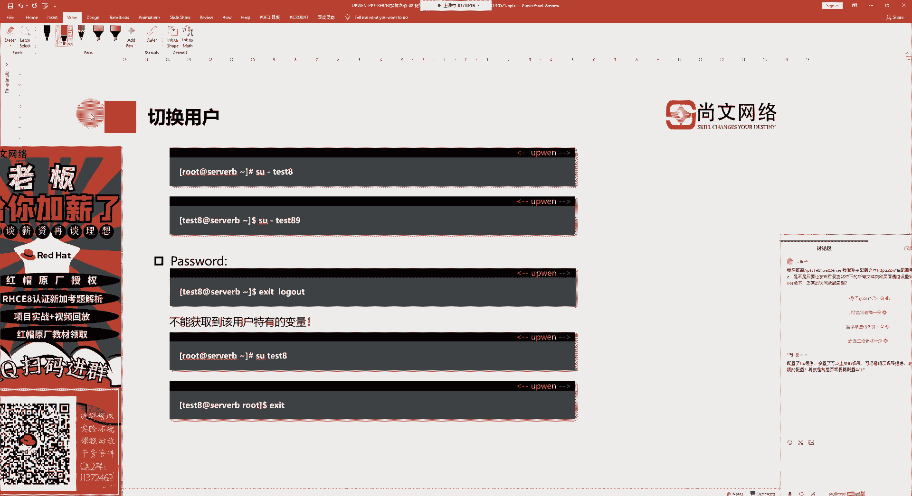

# UP楠哥传授RHCE8考试'排坑'之道，不得不看！课题之高级权限管理ACL.mp4 - P1 - 尚文网络IT - BV1484y1C7P5

好吧，那么最后一个呢我们来看一下关于叫a c l的一个权限管理。

那a c l我们叫防正列表是吧，它可以用来细分我们linux系统下的一些文件的权限，通过命令叫城之mode是吧，可以把文件分为u g o这三个组，如果说啊如果说我有一个用户叫阿文，它隶属于在哪个组啊。

属于root这个组对吧，举个例子，他在这个组，然后还有一个用户叫什么叫新斯科啊，这样的一个用户，然后呢啊我们可以叫什么，叫他也在root用户这个组里对吧，那么你在这个组里面的时候，那我们可以看到对吧。

我们可以看到什么呢啊看到这个up文也好，新车也好，他们面向于这样的一个文件的一个这个全局的一个权限是什么呢，比如说是rw，但是我想让这样一个用户多一个什么呢，多一个x的权限对吧。

所以这种情况下我们就要通过设置s f a c l对吧，设置我们的访问控制列表来精确更精确地去控制我们权限上的分配，这种独立于传统的u7 o的这种权限之外的权限设置，我们叫a c l啊。

access control list，访问控制列表啊，我们可以针对于单一用户，单一文件或者说目录来进行控制啊，对于需要特殊权限的使用了，有一定的帮助，是叫get。

我们可以通过set fc l来进行设置，通过get fa可以来干什么来进行啊，来进行查看，好那么接下来我们就来看怎么去设置对吧，叫sf c l怎么去设置，设置的话，我们首先呢我们要会加一些参数啊。

加参数的话第一个是用杠小写的m m就是那个modify的一个简写对吧，就是一个modify的简写，然后这个这是小m啊，还有什么呢，还有一种是大啊，大m是代表什么从文件去读取访问控制列表的条目的更改。

那就是说我通过一个文件来读cl的一些条目，然后来进行更改，那这个小写的x是什么，是根据文件中的条目来进行什么的移除啊，小写x啊来进行移除，然后大写的x是从文件去读取我们访问控制列表，然后并做一个删除啊。

就是说大写的m大写的x都是基于什么基于文件来进行读取访问，x是删除某一个条目，那么那个小写的b啊，b代表什么，是删除所有的访问控制列表的一些条目是吧，杠n啊，不重新计算有效解码的权限的一些野马啊。

杠d默认到我们的放到控制列表中，应用到我们默认的应用课列表的操作对吧，就default啊，默认那个选项杠杆啊，递归对吧，递归来操作我们的子母杠大l按照我们的系统逻辑，跟随我们符号的连接。

那么它的这样的一些参数会比较多，那么对于我们来讲，我们会看几个范例对吧，常用的啊，常用的这种a c r的一些权限的设置是什么呢，我们可以针对于某一个用户，比如说阿文这个用户来去做一些什么的。

细粒度的一个单独用户的一个权限的设置对吧，通过它来进行设置，我们叫sfc要杠m对吧啊叫修改，然后呢我们可以按照什么user这个这个这一组对吧，user也可以来按照group对吧来进行设置好。

我们可以去看一下这个文件叫test的这么一个文件，我们通过sfx l杠m修改，然后u冒号叫什么呢，啊up普文对吧，然后冒号rw杠代表什么，单独去开一个阿文这样的一个用户是什么可读可写的这样的一个权限。

可读可写的权限，好吧啊，我们来看一下啊。

可怜一下啊，这个touch一个叫什么呢，叫f啊，叫叫叫叫阿a cl file对吧，创建这么一个文件啊，up分a c l l s杠l t我们可以看到什么呢，up文a c l fl它默认权限是644。

也就是说是一个什么呢，是一个这种标准呢，叫可读可写对吧，64这样的一个权限，那么这个时候啊，假如说啊我和这个谁呀，我我这个阿鹏用户，我是和root用户在一个组里面对吧，比如说大家都在root用户的组啊。

我们假设user user mode对吧，杠a大g对吧，然后呢叫什么呢，叫这个这个这个root，然后是2等1回车，我们做了这样一个修改，也就是说让阿婆问一啊，加入到root这个组里面。

对吧啊加入到如何这个数据，那么你既然加入到了这个root组里面，我们敲id你就能看到什么呢，它的一个附加组是是零对吧，这是它的一个附加组对吧，那么这个时候我们就可以再往下看是吧。

我们可以我们可以对于什么呢，对于一个用户，我们叫sf a c l gm对吧，u哪个用户，比如说up文一冒号对吧，那么它默认的权限我们刚才看过了是一个什么呢，是一个叫那个64对吧。

那么我们可不可以去多增加一些权限对吧，虽然说对于我们的数组root主体中的用户是什么呢，r杠杠是一个啊，是一个什么是一个啊，只能读的对吧，只能查看文件内容，那么这个时候我们可以多加一个。

比如说rw可以吧，对于这个文件我们多加一个rw啊，多加一个斜的权限好吧，然后up文a c l fl预测，就这样来设置对吧，在原先啊那个什么呢，user它没有什么呢，他没有这个啊数组的情况下。

就是你的数组它会有什么没有这个不在入职的情况下，我们把它加进去，然后我们去给他增多增加一个w的权限好吧，因为我opp一现在和root在一个组里面，所以你刚才通过这样的一个命令去设置的实验。

设置的那个up noe c r fell啊，多加了一个权限对吧，多加了一个权限，那么这时候我们这个up一就会对这个文件具有写的权限对吧，虽然啊我们会有一个什么呢，会有一些这个执行对吧，有没有执行的权限。

或者说我们也可以去干什么，去再增加一个什么一个x的权限啊，这都是可以的，那么可以通过get f cl杠m对吧，阿特伦tcl fail这种方式看一下啊，把m去掉，r n a f a c e l。

查看一下这个文件对吧，我的数组是这个r，但是我实验，但是我iphone一这个用户是可读可写，可执行对吧，那么你这个时候数的up一回车，然后cd到c c d到我们的实验cd到啊，去cat一下好吧。

阿文a c l file tm p目录下是吧，是在tm p目录下的un a c l file，虽然这里面没有内容，但是我们可以去做一个什么，做一个ico的方式，因为我们本身就一个什么呢。

就是有一个这个啊一个写的权限对吧啊，tmp下面的up is your fail回车，因为我们设置了s就是我们的这个什么sf它多了什么，它多了这个用户多了可读可写可执行的权限对吧。

否则的话我们是没有办法对那个啥阿婆a4 l fail去做一个什么，做一个这个编写对吧，正是因为我们设置了啊这个sf cl来就可以实现了是吧。

那么你也可以按照一个组对吧，按照一个组的方式来进行添加对吧，sf l杠m g冒号啊，比如说哪个组，然后你让他单独去具备那样的一些权限好吧，那么最终的话我们可以去干什么呢，可以去做一些查看的一些操作是吧。

好那么清楚我们设置了很多的a4 l如何去清除对吧，我们第一个就是清除所有的角a c e l杠b那去清除所有的a4 l，那么第二个是什么呢，清除针对于某个用户的啊这样的一些cl的一些设置对吧。

就如同我们的这个什么呢，clear一下get f a c l那tp下面的up杠啊，等于a c l fl对吧，你要把这样的一个用户的一个把它给清除掉了对吧。

我可以去一次清除所有的cl，你是不是也可以去按照单个的a4 l来进行一个啊。

这个清楚对吧，比如说啊set，lf c l杠m对吧，或者用杠x然后u冒号啊，就是up一哪个文件，那个叫阿文a4 l file啊，tmp目录下的是吧，tmp目录下的那个up a c l，看一下啊，这个是。

权限是吧，没有这个权限，因为我现在是在r11 这个运动图像是吧，那么在f a c l杠x u冒啊，u冒号u冒号r一好单位是t m p啊，当前目录下的谁up主is your file对吧。

这样的话我们就把它给清除掉了，那你这个时候设置f a c e l啊，然后a c l fl你就可以发现什么呢，我们刚才的这一个条目就给它给删掉了。

好吧，就被清除掉了，当然了，你可以用小写的b来清除所有的什么呢，清楚我们所有的这种啊a c2 的一些设置。

好吧好，那么最后一个呢是改变拥有权啊，包括我们在刚才的那个互动当中给大家也提到了是吧，有提到了如何去更改一个文件或model的一个拥有者的一个权限，或者说属主属组的权限，我们就通过称之move。

称之o w n这个命令只要称之owner去更改，那么更改的话和生殖目的一样，也会有一个大r的参数来做一个递归的啊，比如说这种大r的参数去做一下递归的这种啊更改，然后在更改的过程中，我们可以用什么呢。

你的用户名好点儿，就是你说你的这个用户名是数组对吧，点儿实验点数组或者说什么你的数组冒号数组啊，我们通常可能会用更多的是一种冒号的方式，因为它比较传统对吧。

那我们通过城镇o w n这个命令啊去更改它的拥有者。

称之mod是用来改权限的对吧，比如说称之mod啊，777，然后up is your fail对吧，趁着ow那比如说阿文一点root啊，然后up in a cfl，这是两种方式啊。

你最终会通过l s杠a r t用来查验了什么r和a4 l，它的一个吸机器的权限加上什么呢，加上一个啊，增加了这样一个权限，好吧，好好就是啊。

切换用户啊，包括数，那么我们之前已经看过了对吧，数的时候要加一个杠代表什么呢，啊直接把这个用户的工作环境给他带过来了。

那么这两个互动啊，互联互动呢就是关于设置什么的，设置那个sfc的那设置什么呢，设置这个可读可写的这种对吧，可读可写我们就要有rw对吧，我们要通过那组的方式啊，或者说两个用户的方式来进行实现啊。

通过sf杠mu啊，或者说g冒号，然后是up对这样的一个这个实现，然后想在iphone 8 vp里面去做对吧，去实现只有什么权限，只有可读怎么办对吧，那你就用一个什么呢及一组的方式对吧，设置分组组的方式。

用它为什么r的权限就好懂吧，通过sfc 2，大家别忘了去做get f cl的一个设置，好吧，呃我看有个同学啊，喜羊羊同学又上来了对吧，又上来了，然后这个问提出一个问题，说什么呢，这个跟ftp有关的对吧。

配置ftp设置了上传权限，但是提示权限拒绝啊，这种情况下是否要做全形上的配置，或者说我是否要去配ac 2，首先呢你设置上传，但是其实全员拒绝很有可能是什么，很有可能是那个阿泽那一位是吧。

他没有w的权限好吧，你可以先把w权限来做一个设置，然后再进行测试，a c2 呢没有什么a c2 ，我觉得不需要去做一些特殊的这种配置，好吧啊。

当然你可以去单独去设置一个针对于某一个ftp的一个普通用户对吧，我们可以单独给他设a cl，这是可以的，但是一般情况下我们都是遵循什么呢，数组数组数组对other就好了，好吧好。

那么关于a c e l和我们的那个特殊权限呢，我们就讲到这儿好吧，马上就要下课了啊，欢迎大家在课程结束之后给予楠哥的课程做一些评论好吧，然后同时分享到朋友圈啊。

这个啊优秀的评论我们可以获得红包的一些纪念品啊，包括一些礼盒，战袍书包对吧，小南哥特别喜欢这个小红帽啊，这个每天晚上睡觉的时候都会搂着他一块睡觉对吧，小红帽还是很可爱的，好吧好。

那我们这个今天的内容就可以讲到这儿啊，那么我们会把什么呢，我们会把这个权限上的一些事情给大家讲，那么下一个啊下一个课题呢我们会讲什么，关于vi编辑器的一个使用啊啊从插入模式到我们就是从编辑模式。

编辑模式到我们插入模式，然后再去转换到我们的命令模式对吧，我们可以对一行做一些操作，对一些列做一些操作，就像使用我们的notepad或者说我们的office一样对吧。

我们是来去如何去高效的去运用我们的v i v n7 ，这是我们下一节课标给大家讲一个内容好吧。

希望大家可以继续的持续的去关注那个我们上网络，包括南哥的一些课程好，那今天呢我们就讲到这儿啊，这个这个结束之前送给大家一句话，将来的你一定会感谢现在奋斗好吧，大家别忘了加群啊。

