# Unix&Linux快速入门超详细教程：P10：02-4 Linux系统文件结构 📁

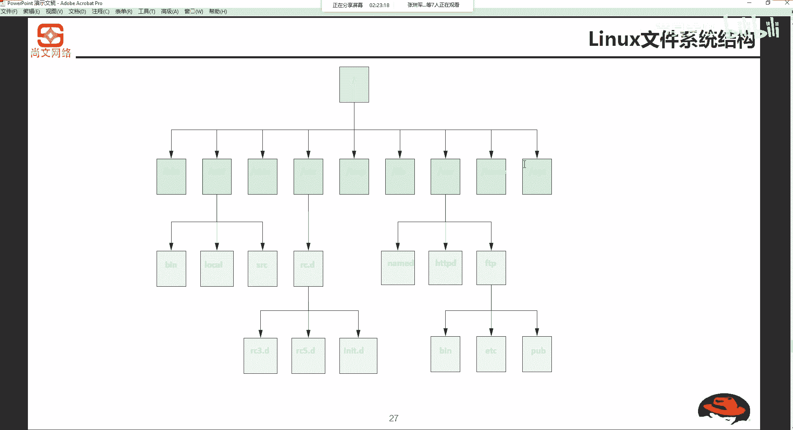

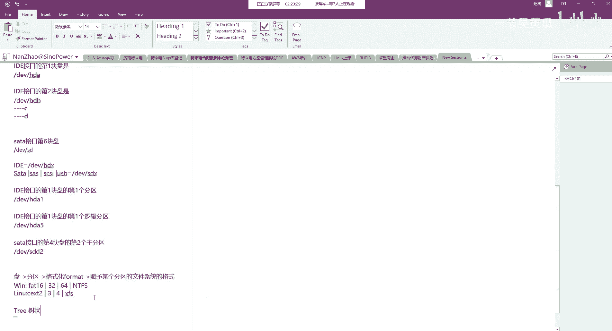

在本节课中，我们将要学习Linux操作系统的文件系统结构。理解这种结构是高效使用和管理Linux系统的基础。我们将从根目录开始，逐一了解各个核心目录的作用。

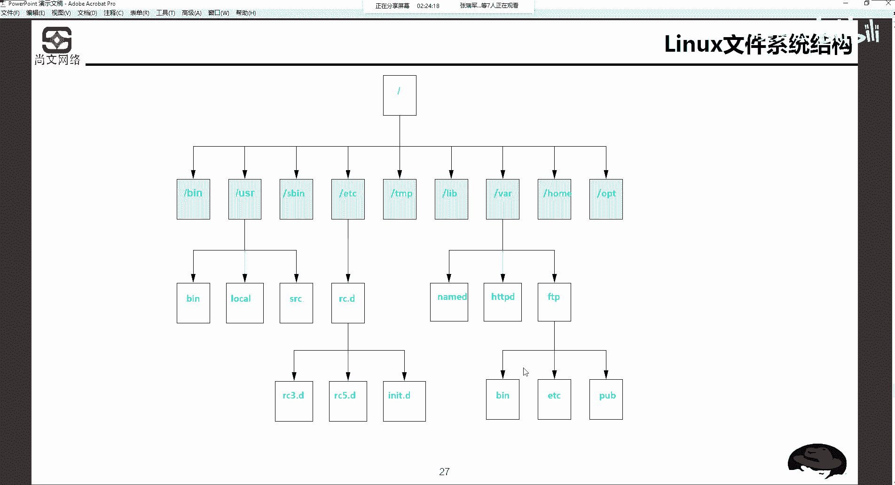

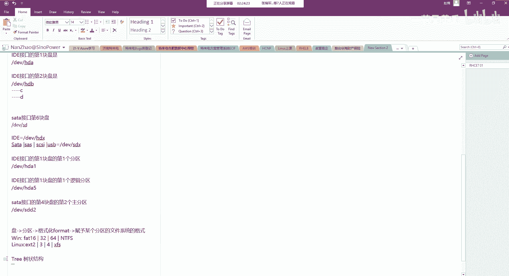

## 概述

Linux文件系统采用一种**树状结构**，其起点被称为**根目录**，用单个斜杠 `/` 表示。所有其他目录和文件都从根目录开始分支展开，形成一个层次化的组织体系。

## Linux文件系统的树状结构

Linux的文件系统是一个树状结构，其根目录是 `/`。从根目录开始，衍生出多个二级目录，每个二级目录下又有自己的子目录和文件。

以下是根目录 `/` 下一些重要的二级目录及其简要说明：

*   **`/bin`**：存放操作系统运行时所必需的各种命令程序，例如 `cp`（复制）、`kill`（终止进程）、`rm`（删除文件）。
*   **`/boot`**：存放系统启动时必须读取的文件，包括内核（kernel）和引导加载程序（boot loader）。
*   **`/dev`**：存放设备文件。Linux将所有硬件设备（如硬盘、键盘、光驱）都视为文件，并放在此目录下。例如，IDE接口的硬盘可能被标识为 `/dev/hda`，SATA/SCSI接口的硬盘可能被标识为 `/dev/sda`。
*   **`/etc`**：存放与系统设置和管理相关的配置文件。
*   **`/home`**：默认的用户家目录所在地。每个普通用户通常在此目录下拥有一个以自己用户名命名的子目录，用于存放个人文件。
*   **`/lib`**：存放系统运行所需的共享函数库。
*   **`/lib/modules`**：存放系统内核的模块。
*   **`/lost+found`**：存放系统非正常关机时产生的碎片文件，通常此目录为空。
*   **`/mnt`**：默认的光盘和软盘挂载点。用户可手动将外部存储设备挂载到此目录或其子目录下进行访问。
*   **`/proc`**：一个虚拟文件系统，其内容存在于内存中，是内核的映射。用于在不重启系统的情况下查看和管理内核参数。
*   **`/var`**：存放经常变化的文件，如系统日志。
*   **`/usr`**：一个非常重要的目录，通常用于安装用户应用程序和文件。
*   **`/opt`**：另一个常用于安装第三方大型应用程序或附加软件的目录。
*   **`/tmp`**：存放临时文件的目录。

这些二级目录下还会有更细分的子目录。例如，`/usr` 目录下通常包含 `/usr/local`（本地安装的软件）、`/usr/src`（源代码）和 `/usr/bin`（用户命令）等。

## 核心目录的重要性与应用

上一节我们介绍了Linux文件系统的整体结构，本节中我们来看看其中一些核心目录的具体应用场景。

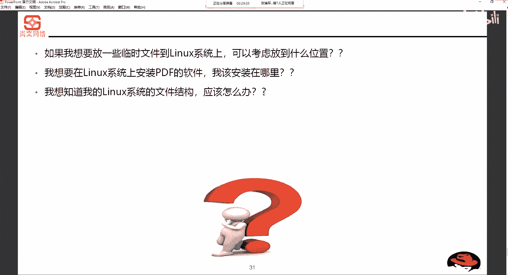

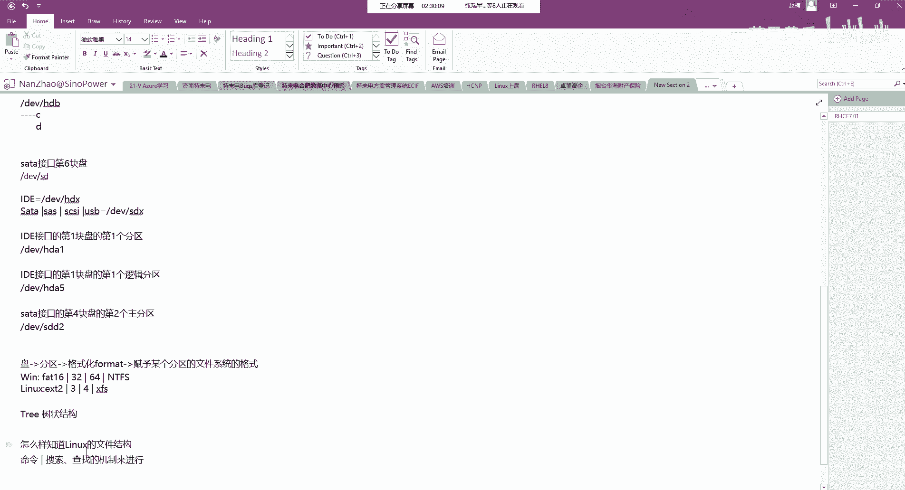

了解每个目录的用途，能帮助我们在正确的位置进行操作。以下是一些关键目录的典型应用：

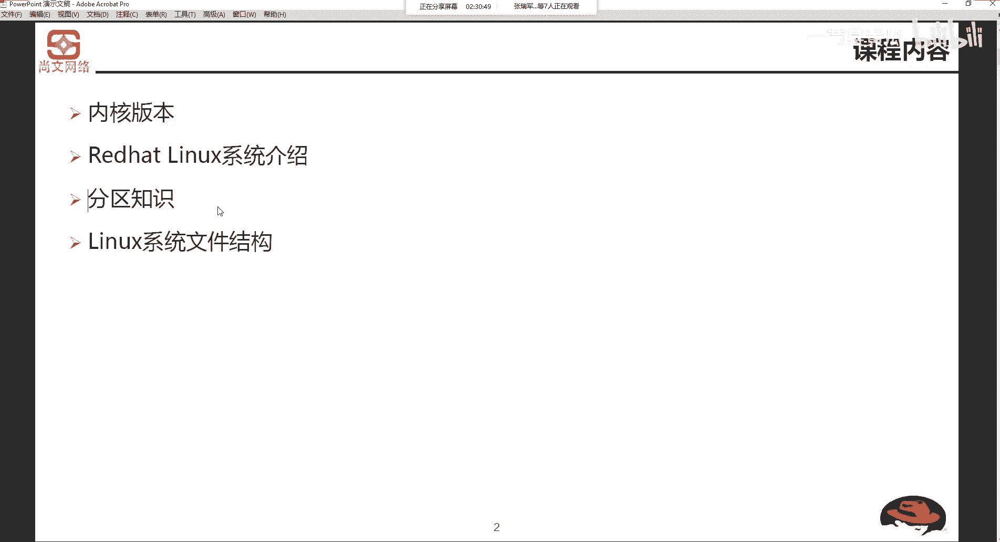

*   **安装软件**：在Linux系统中安装软件时，通常可以考虑 `/usr` 或 `/opt` 目录。
*   **存放临时文件**：如果程序需要生成临时文件，应将其放在 `/tmp` 目录下。
*   **查看系统信息**：`/proc` 目录提供了大量关于系统硬件和进程的实时信息。
*   **管理配置文件**：系统的全局配置通常位于 `/etc` 目录及其子目录中。

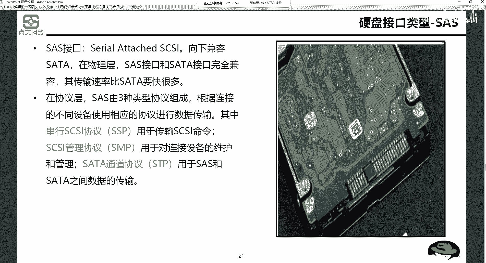

对于初学者，如果想直观地查看整个文件系统的结构，可以通过命令行工具来实现。例如，使用 `tree` 命令（如果已安装）可以以树形图列出目录结构。或者，也可以使用 `ls` 和 `find` 等命令进行搜索和查找来探索文件系统。

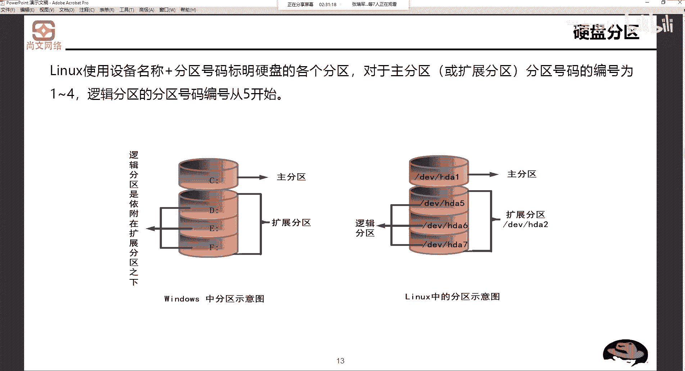

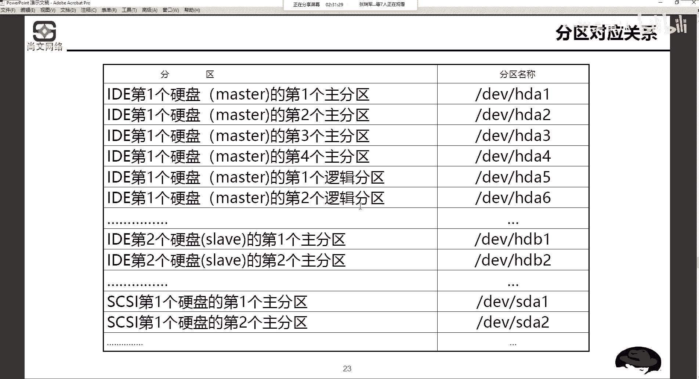

## 总结

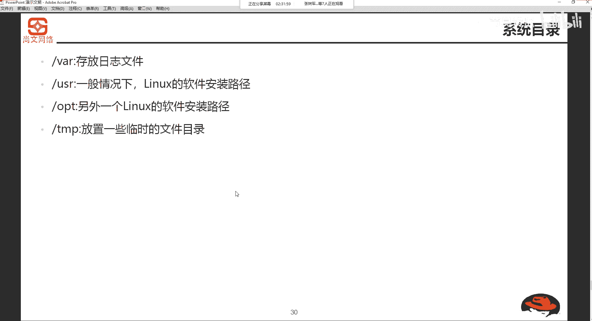

本节课中我们一起学习了Linux系统的文件结构。我们了解到Linux采用以 `/` 为根的树状目录结构，并详细探讨了 `/bin`、`/boot`、`/dev`、`/etc`、`/home` 等核心目录的作用。理解这些目录的用途，是后续进行系统管理、软件安装和故障排查的重要基础。在接下来的课程中，我们将更深入地学习如何在命令行中操作这些目录和文件。