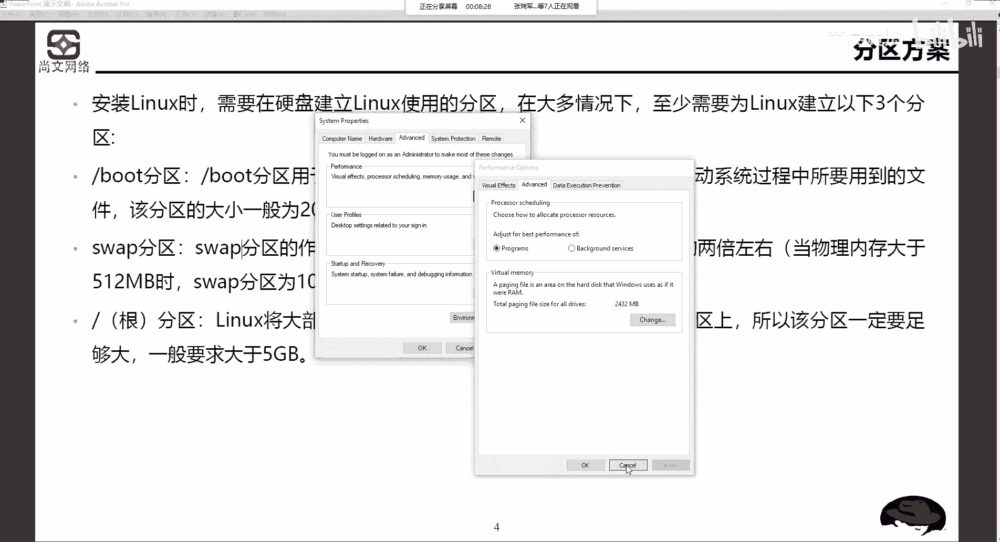
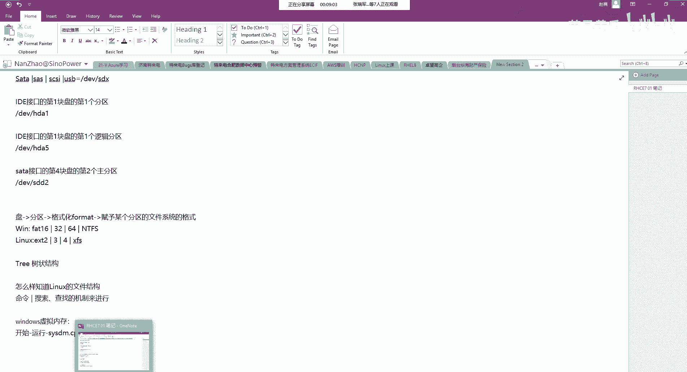
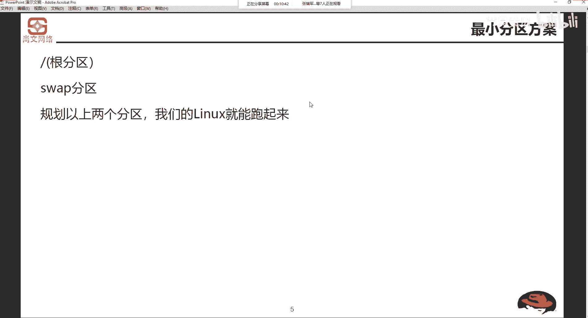
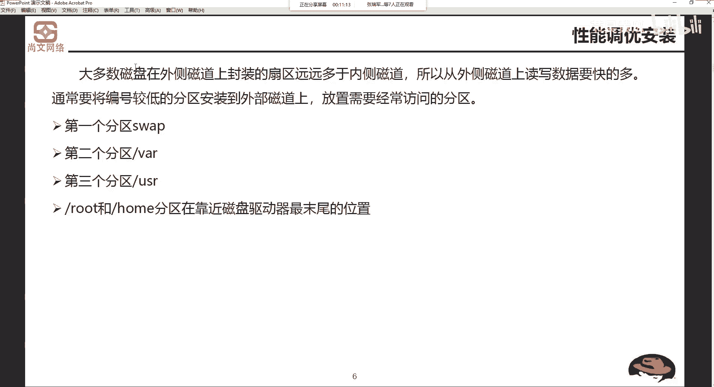
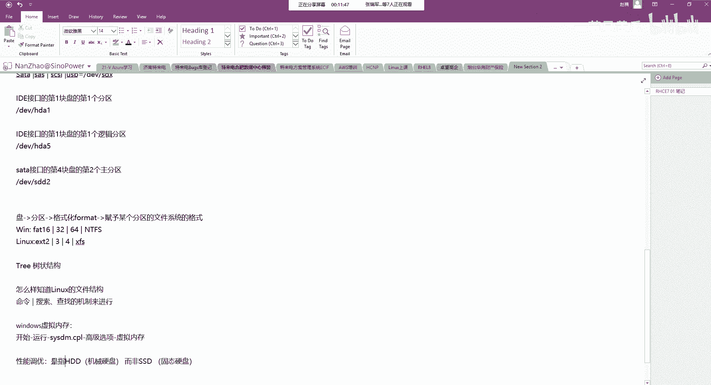
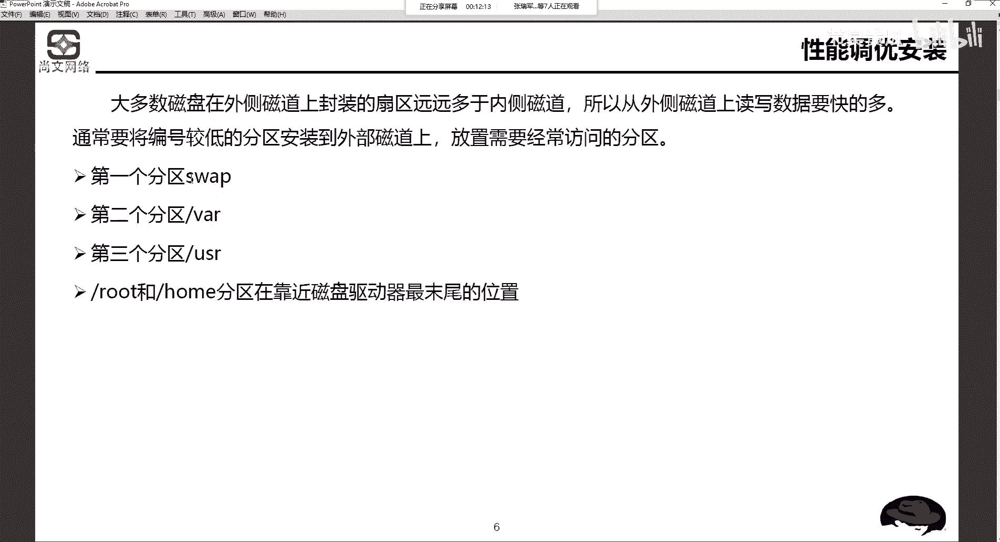
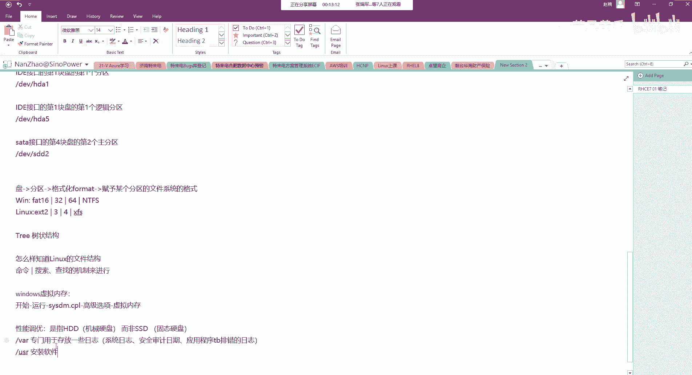
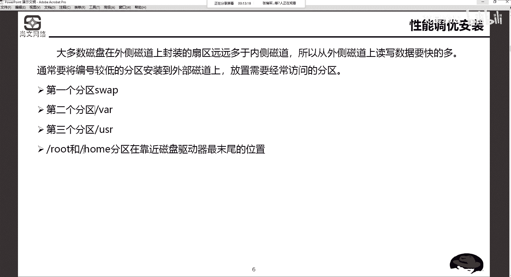
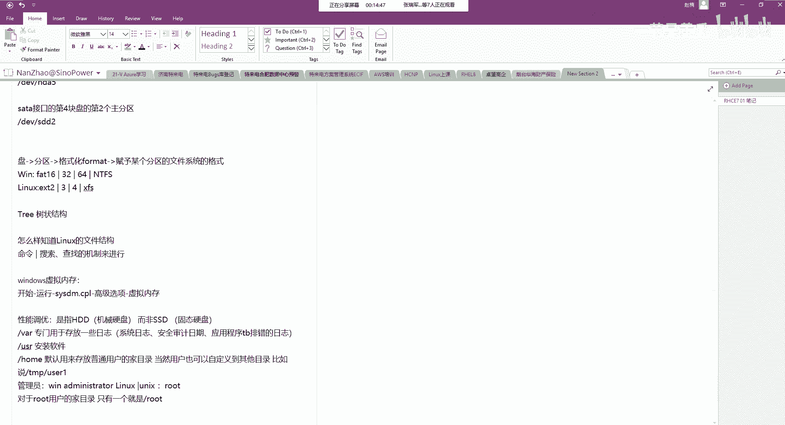
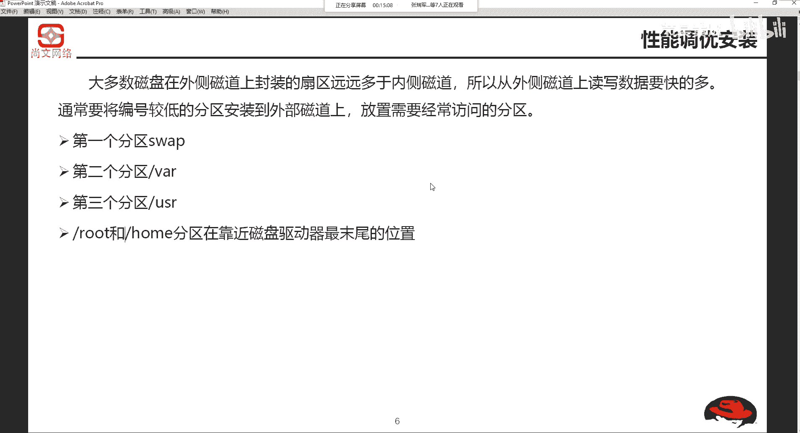

# Unix&Linux快速入门超详细教程：P11：03-1-1 Linux系统安装分区方案规划 🗂️

在本节课中，我们将要学习Linux系统安装前的关键一步：磁盘分区方案规划。理解并规划好分区是确保系统稳定、高效运行的基础。

## 概述

安装Linux系统前，必须对硬盘进行分区规划。本节将介绍分区的基本概念、最小分区方案以及针对性能优化的分区建议，为后续的系统安装做好准备。

## 系统安装基础

上一节我们介绍了Linux的文件系统结构，本节中我们来看看如何为安装Linux规划硬盘空间。首先，需要了解安装的基本硬件要求。

安装操作系统对硬件有一定要求。对于Linux系统，基本要求如下：
*   **CPU**：奔腾及以上处理器。
*   **内存**：至少512MB，推荐2GB以上。
*   **硬盘**：大约需要5GB可用空间。
*   **显卡**：VGA兼容显卡。
*   **光驱**：用于光盘安装。

特别需要注意的是，如果在虚拟机（如VMware）中安装，分配给虚拟机的内存不应低于512MB，否则图形化安装界面可能无法正常启动。

## 分区基本概念

分区是指在硬盘上划分出独立的逻辑区域，用于存放不同的数据和系统文件。Linux安装至少需要规划以下三个核心分区。

以下是三个必须规划的基本分区及其作用：

1.  **根分区 (`/`)**：这是Linux文件系统的起点，绝大多数系统和用户文件都存放在此分区下。因此，该分区必须留有足够大的空间。公式表示为：`/` = 系统文件 + 用户文件（大部分）。
2.  **引导分区 (`/boot`)**：用于存放系统启动所必需的内核和引导文件。没有这个分区，操作系统将无法启动。对于RHEL/CentOS 7及以上版本，建议分配 **200MB**；对于6.x等旧版本，**100MB** 即可。
3.  **交换分区 (`swap`)**：充当虚拟内存。当物理内存（RAM）不足时，系统会使用这部分硬盘空间来临时存放数据。其大小通常为物理内存的1.5到2倍。例如，如果物理内存为4GB，交换分区建议设置为6GB到8GB。公式表示为：`swap大小 ≈ 物理内存 × (1.5 ~ 2)`。

需要理解的是，`/boot` 分区实际上是根目录下的一个子目录（`/boot`）。单独划分出来是为了管理和引导的便利。同样，像 `/etc`、`/home`、`/usr` 等目录默认也都包含在根分区 (`/`) 之中。

## 最小分区方案

理解了基本分区后，最简单的方案就是只规划两个分区。这是最精简的安装方式。

对于最简单的系统安装，可以只规划以下两个分区：
*   **根分区 (`/`)**：包含所有系统文件、引导文件 (`/boot`)、用户目录等。
*   **交换分区 (`swap`)**：提供虚拟内存支持。

## 性能调优分区建议

对于追求性能的场景，尤其是使用机械硬盘（HDD）时，合理的分区布局能提升系统响应速度。这是因为硬盘外侧磁道的读写速度远快于内侧磁道。

以下是针对HDD的性能优化分区建议，将频繁访问的分区放在硬盘外侧（编号较小的扇区）：
*   **`swap` 分区**：虚拟内存频繁读写。
*   **`/var` 分区**：存放系统日志、安全审计日志、应用程序日志等，读写频繁。
*   **`/usr` 分区**：存放安装的应用程序和软件，经常访问。
*   **`/home` 分区**：默认存放普通用户的家目录数据。
*   **`/` 根分区**：存放系统核心文件。

而像 `/home`（用户数据）和 `/`（系统核心）这类相对静态的分区，可以放置在硬盘靠内侧的位置。

> **注意**：此优化建议主要针对机械硬盘（HDD）。对于固态硬盘（SSD），由于其读写机制不同，分区位置对性能的影响很小。

## 总结

本节课中我们一起学习了Linux系统安装前的分区规划。我们首先了解了安装的硬件要求，然后掌握了必须规划的 `/`、`/boot` 和 `swap` 三个基本分区及其作用。接着，我们知道了最简化的分区方案。最后，为了获得更好的磁盘性能，我们探讨了如何根据数据访问频率来规划分区在机械硬盘上的位置，将频繁读写的分区放在速度更快的硬盘外侧。合理的分区规划是构建一个高效、稳定Linux系统的第一步。