# Unix&Linux快速入门超详细教程：P13：03-2 RHEL7.x基于图形化安装流程 🖥️

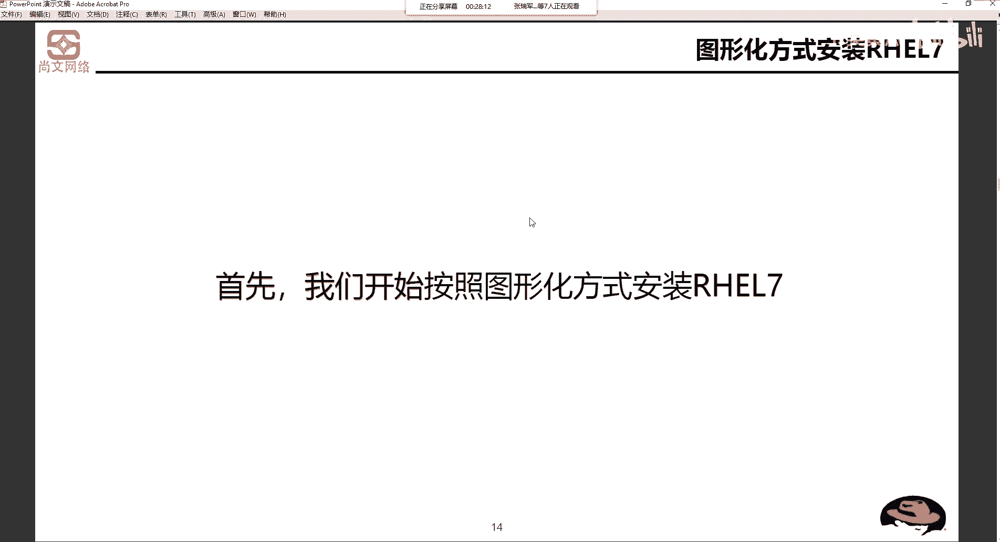

在本节课中，我们将要学习如何通过图形化界面安装Red Hat Enterprise Linux 7.x操作系统。我们将从启动安装介质开始，逐步完成语言选择、磁盘分区、软件包选择等关键步骤，最终完成系统的安装与初始配置。

## 启动与安装介质选择

上一节我们介绍了安装前的准备工作，本节中我们来看看如何启动安装程序。

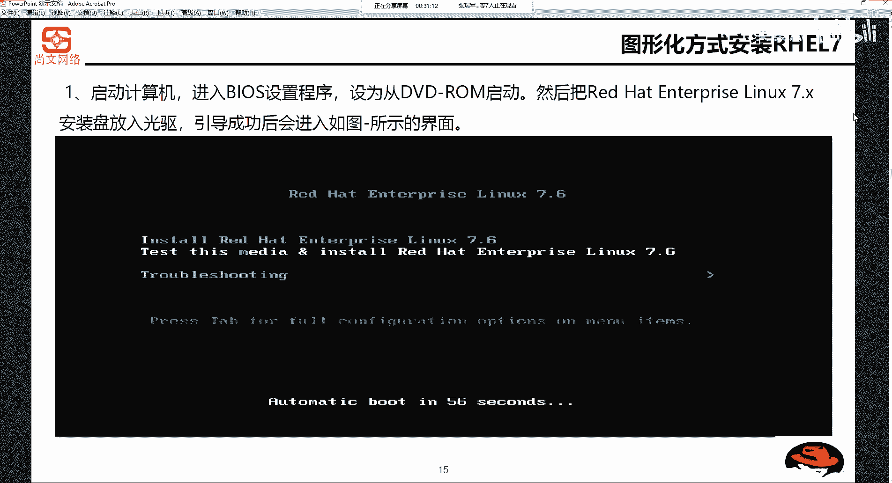

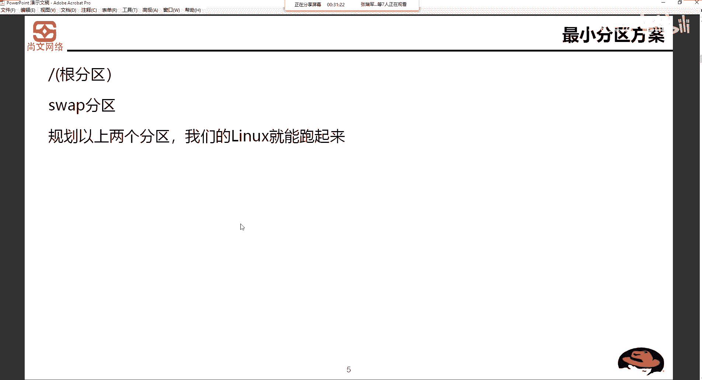

首先，启动计算机并进入BIOS设置，将启动顺序设置为从DVD光驱或USB设备启动。对于实验环境，我们通常使用ISO镜像文件来模拟安装光盘。引导成功后，会进入安装引导界面。

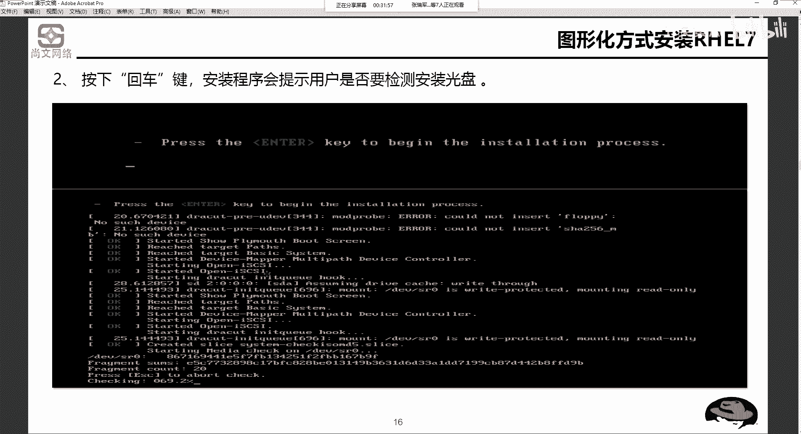

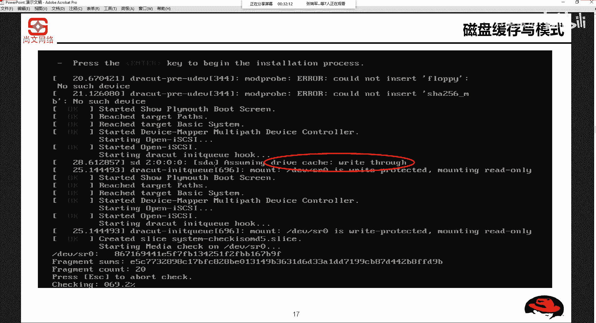

以下是引导界面的三个主要选项：
*   **Install Red Hat Enterprise Linux 7.6**：直接安装操作系统。
*   **Test this media & install Red Hat Enterprise Linux 7.6**：先检测安装介质完整性，再安装。这是推荐选项，可以避免因介质问题导致安装失败。
*   **Troubleshooting**：进入排错模式，用于解决安装或启动时遇到的问题。

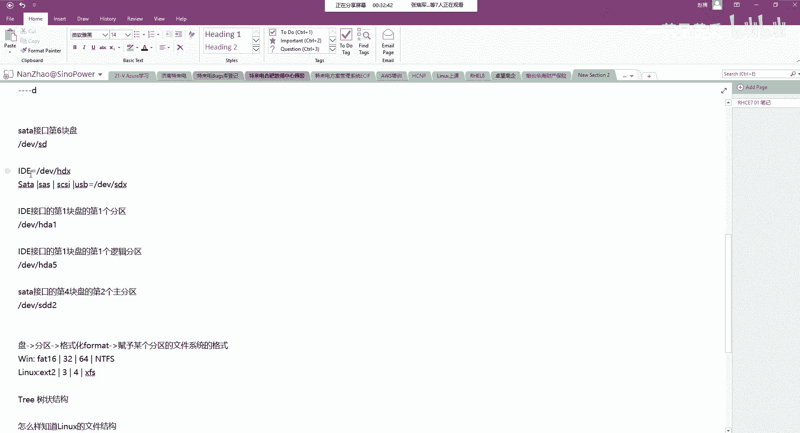

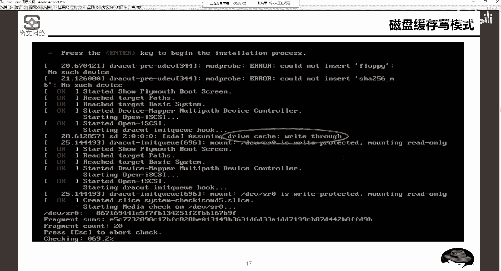

如果用户不做任何操作，系统会在倒计时结束后自动选择高亮显示的默认选项（通常是第二个选项）。

## 磁盘分区方案规划

在开始安装前，合理的磁盘分区规划至关重要。我们之前讨论过，一个典型的分区方案通常包括 `/boot`、`swap` 和 `/` 根分区。

接下来，我们详细探讨分区方案。一个常见的示例如下：
*   **CPU**: 2.4 GHz
*   **内存**: 1 GB
*   **硬盘**: 27 GB SCSI (在系统中显示为 `/dev/sdX`)

基于此配置，一个可行的分区规划是：
1.  **swap分区**：大小为物理内存的1.5到2倍。这里我们设置为2 GB。
2.  **/boot分区**：采用标准格式，分配200 MB。
3.  **/ 根分区**：采用LVM逻辑卷管理格式，分配15 GB。
4.  **/app分区**：同样采用LVM格式，分配剩余的所有空间。

## 理解磁盘缓存写模式

在安装过程中，可能会遇到磁盘缓存写模式的配置。这主要涉及两种模式：`Write Through`（直写）和 `Write Back`（回写）。

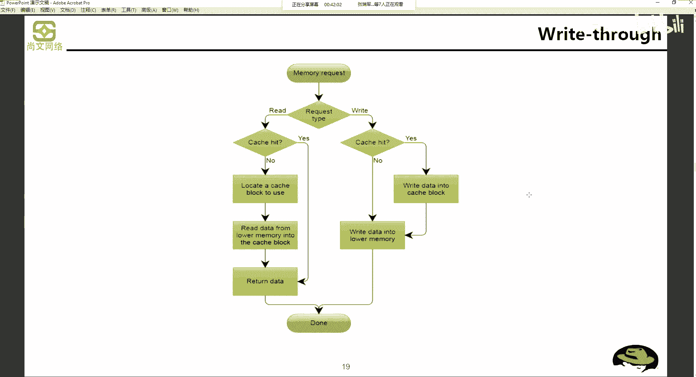

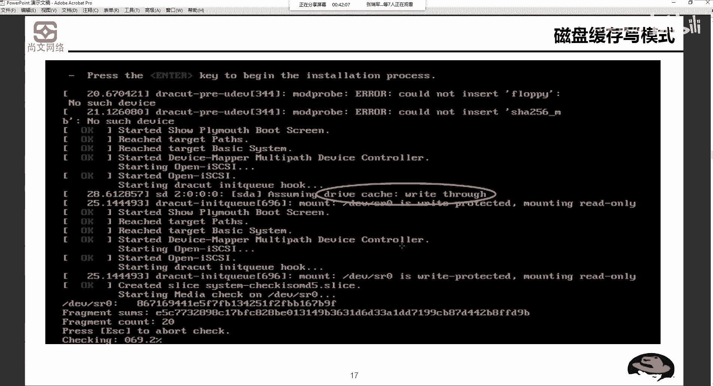

`Write Through` 模式在数据更新时，会同时写入缓存（Cache）和后端存储。其优点是操作简单，数据一致性高，但写入速度相对较慢。其流程可以简化为：
```
数据写入 -> 同时写入Cache与存储 -> 完成
```

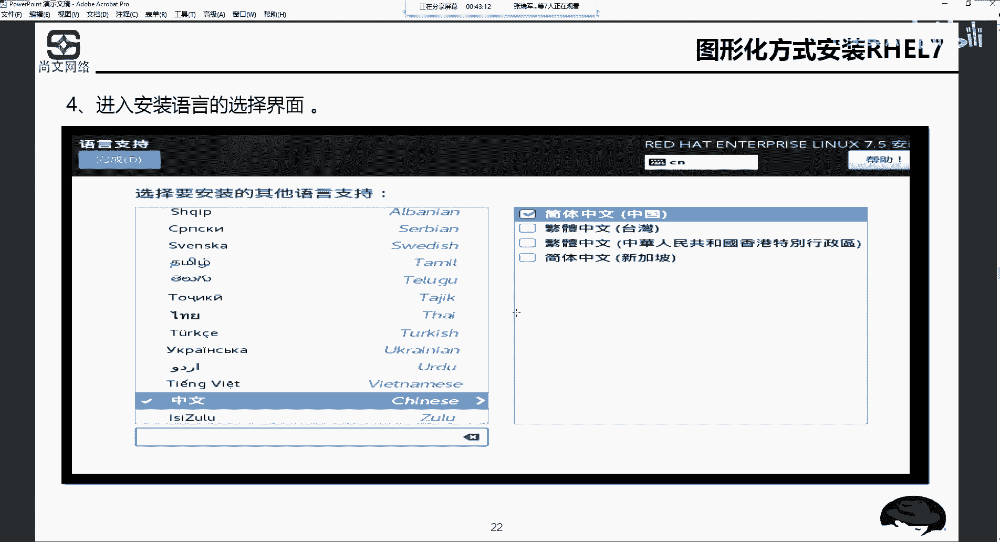

`Write Back` 模式在数据更新时，先写入缓存，然后在必要时才写回后端存储。其优点是写入速度快，但存在风险：如果数据在写回存储前发生系统断电，缓存中的数据将丢失，可能导致数据不一致或RAID信息损坏。这里的“数据”包括结构化数据（如数据库记录）、非结构化数据（如文档、图片）以及RAID阵列的元数据信息。

对于传统物理服务器的本地RAID卡配置，通常建议在生产环境中使用 `Write Through` 模式以保证数据安全。

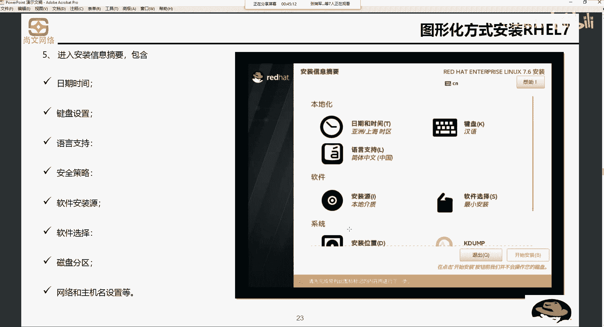

## 图形化安装步骤详解

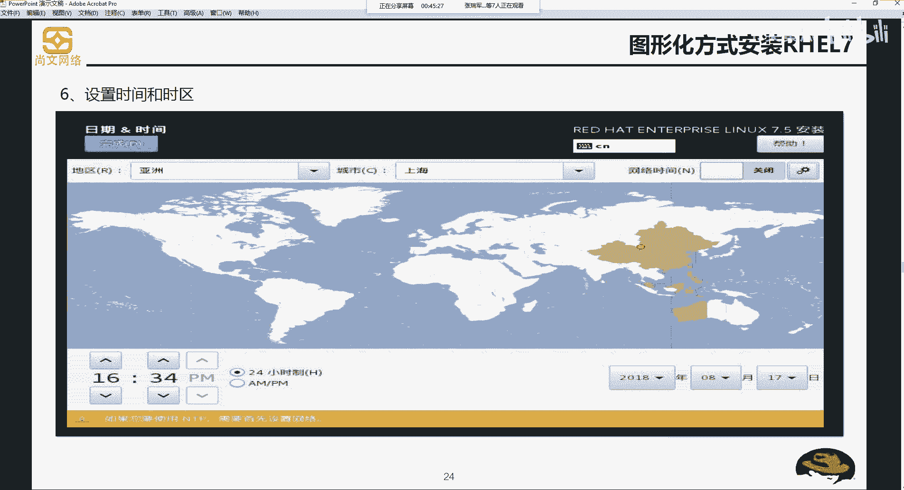

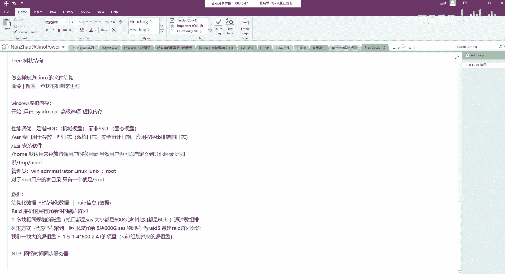

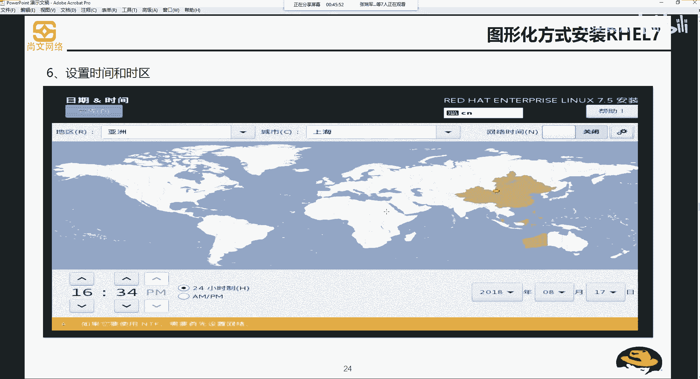

启动并完成初始检测后，我们将进入图形化安装界面。以下是核心的配置步骤。

首先，选择安装过程中使用的语言和地区。如果想安装中文系统，可以选择“简体中文”。接着，进入系统配置主界面。

以下是主要的配置项列表：
*   **本地化**：设置日期、时间和时区（例如亚洲/上海）。
*   **键盘与语言**：选择键盘布局和系统语言。
*   **安装源**：指定安装介质的位置（如本地DVD或ISO文件）。
*   **软件选择**：选择要安装的软件包组合。
*   **安装目标**：进行磁盘分区，这是最关键的一步。
*   **网络与主机名**：配置网络连接和设置主机名。

### 时区与时间设置

在时区设置中，通常选择“亚洲/上海”。界面右上角可以启用“网络时间”（NTP）同步，这需要系统能够访问互联网。如果未启用NTP，系统将使用主板BIOS中的时间。

### 核心：磁盘分区配置

我们重点讲解分区配置。之前提到的示例规划中，`/boot` 分区使用标准格式，而 `/` 和 `/app` 分区建议使用LVM格式。这是为什么呢？

**标准格式分区**的大小是固定的。当一个分区空间不足时，调整过程非常繁琐且风险高：需要备份数据、删除分区、合并空闲空间、创建新分区并恢复数据。

**LVM（逻辑卷管理）** 则提供了极大的灵活性。它将物理磁盘或分区初始化为 **PV（Physical Volume，物理卷）**，然后将一个或多个PV加入 **VG（Volume Group，卷组）**。最后，从VG中划分出 **LV（Logical Volume，逻辑卷）** 供系统使用。VG空间被划分为等大的 **PE（Physical Extent，物理区块）**。

LVM的优势在于：
1.  可以轻松在线扩展LV的容量，只需从VG中分配空闲的PE给LV即可，无需备份数据或卸载文件系统。
2.  同样支持缩减LV容量（需谨慎操作）。
3.  LV的空间可以来自VG中的任何PV，不要求物理连续。

因此，对于像 `/` 这样未来可能需要扩容的分区，使用LVM是更佳选择。Windows系统中类似的机制称为“动态磁盘”。

### 软件包选择与安装

在“软件选择”步骤，主要有两个关键选项：
*   **最小安装**：仅安装最基本的系统功能，适合服务器或高级用户。
*   **带GUI的服务器**：安装包含图形化桌面环境的系统，适合初学者或需要桌面操作的用户。

选择完成后，设置root用户密码（需满足密码复杂性要求）并可以创建一个普通用户。然后点击“开始安装”。

## 安装后初始设置

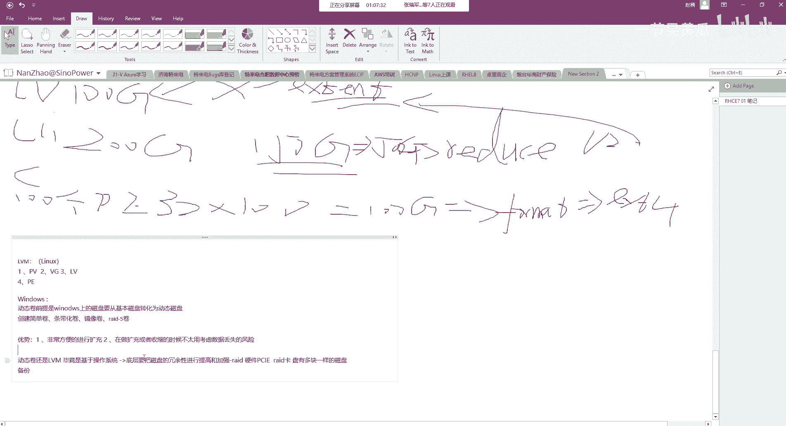

系统安装过程中，需要接受许可协议。安装完成后，重启系统会进入初始设置向导。

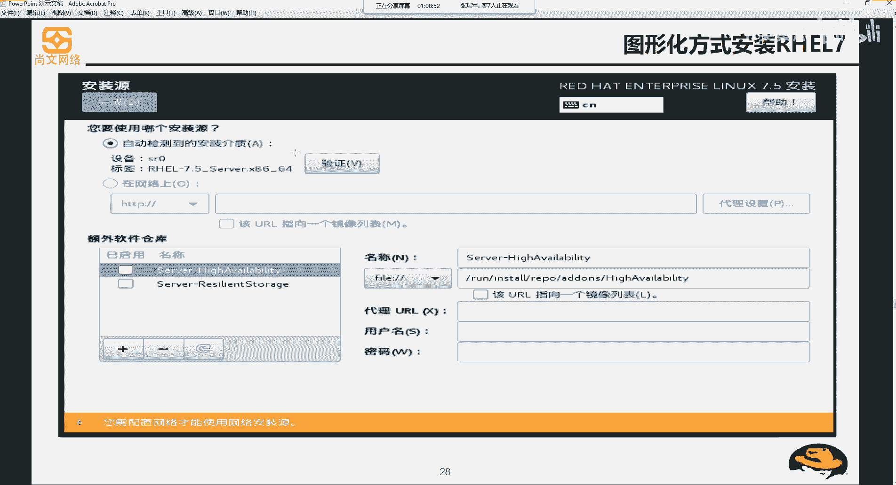

以下是初始设置可能包含的步骤：
*   选择系统语言和键盘布局。
*   配置时区。
*   注册或登录在线账户（如Red Hat订阅账户）。
*   完成许可协议确认。
*   最终进入系统桌面（如果安装了GUI）或命令行登录界面。

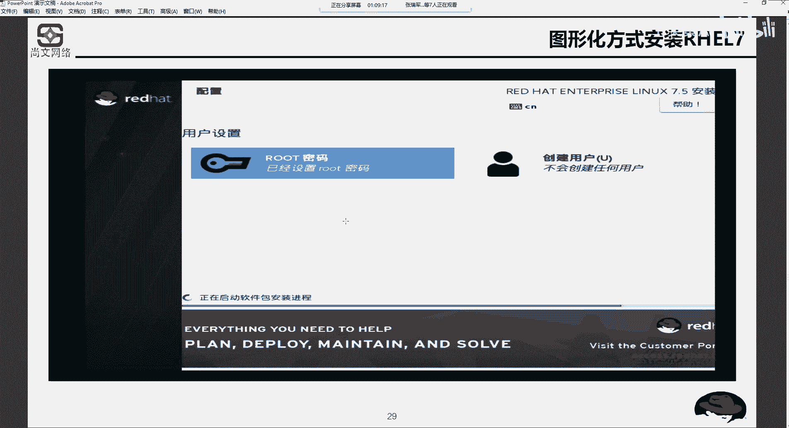

---

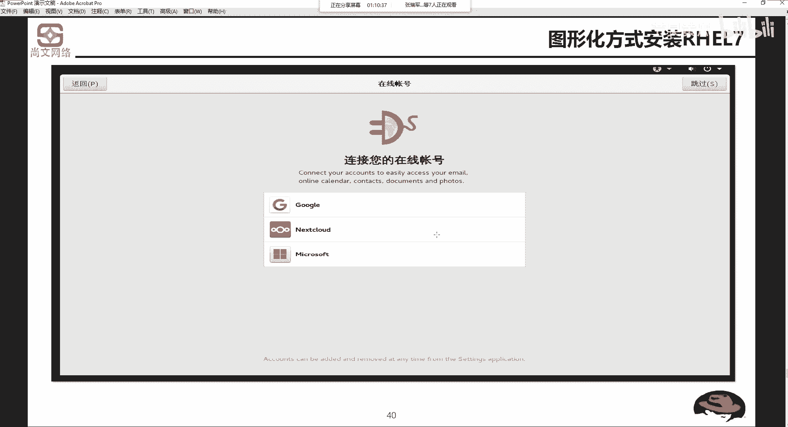

本节课中我们一起学习了通过图形化界面安装RHEL 7.x的完整流程。我们从启动介质开始，逐步完成了语言选择、关键的磁盘分区规划（重点理解了标准分区与LVM的区别）、软件包选择、网络配置等步骤，并最终完成了系统的安装与初始设置。掌握这些步骤是后续学习和使用Linux系统的基础。