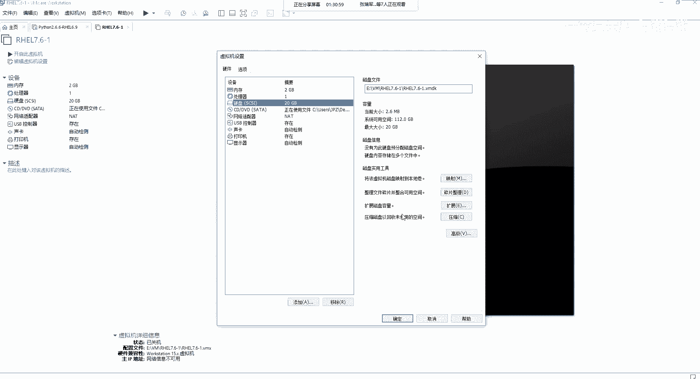
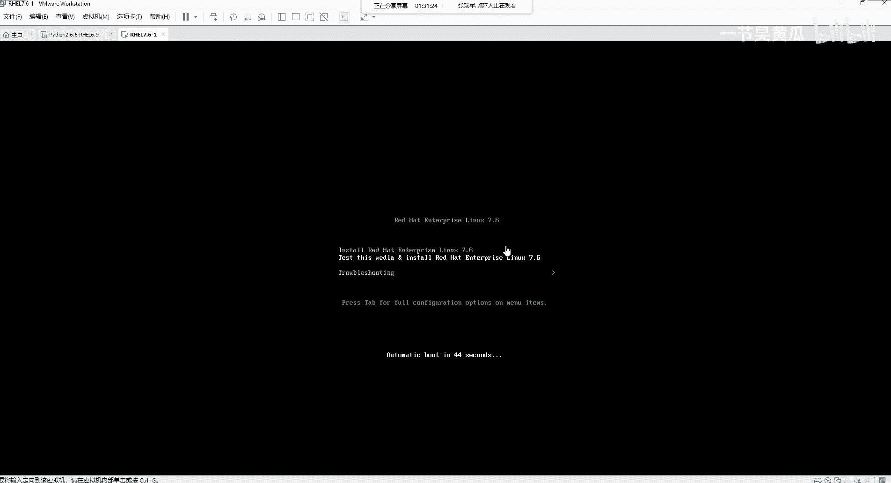
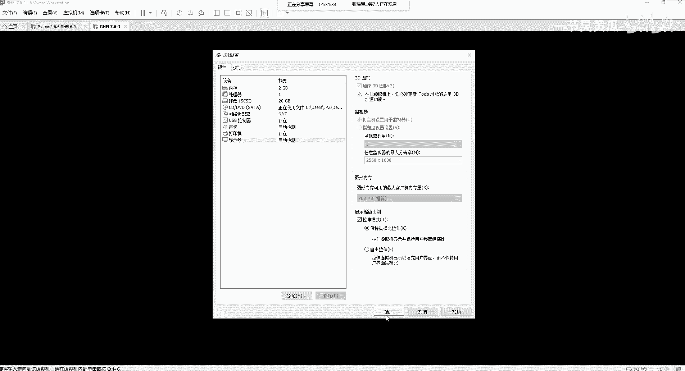
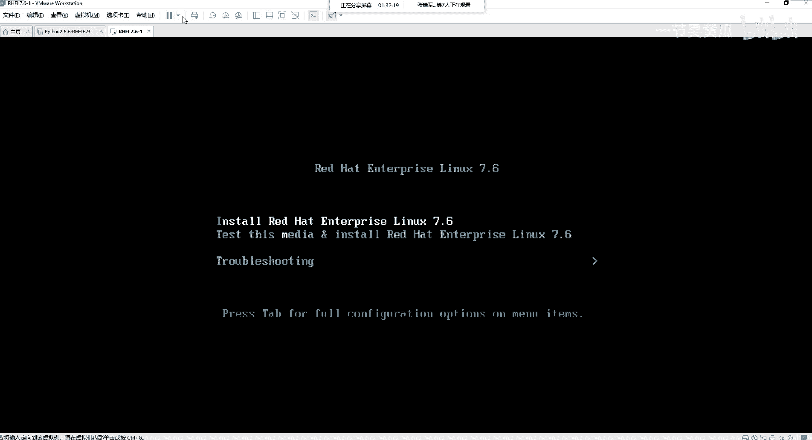
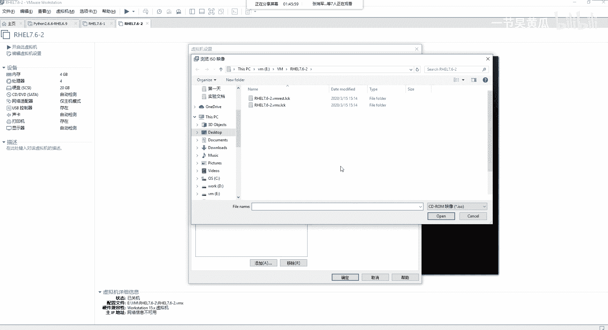
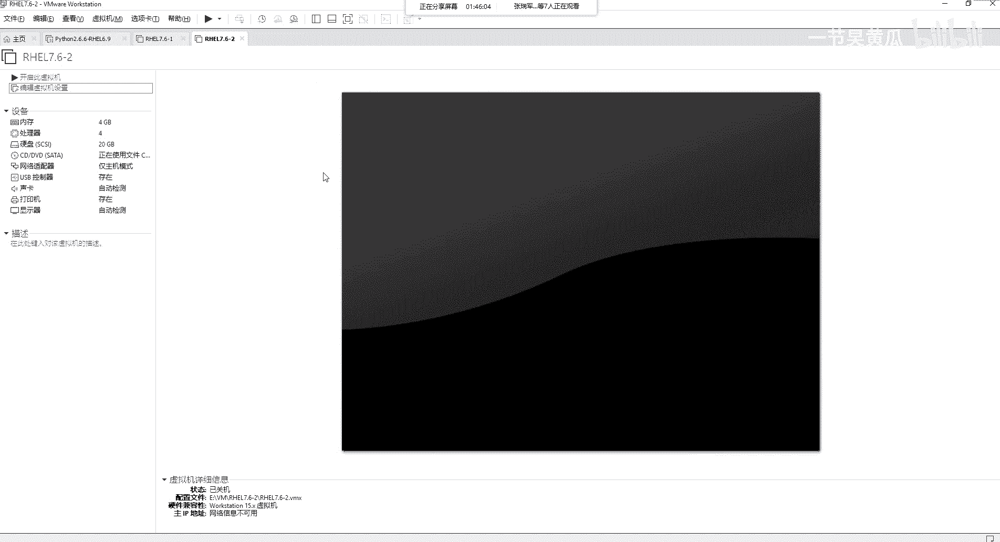
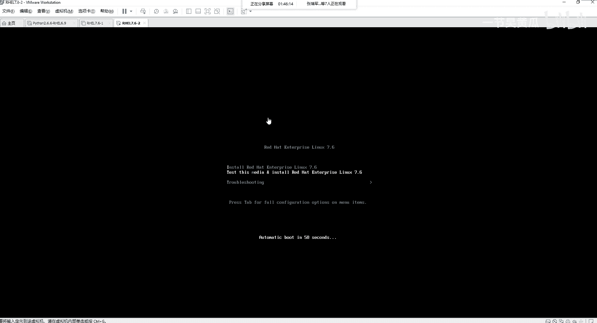
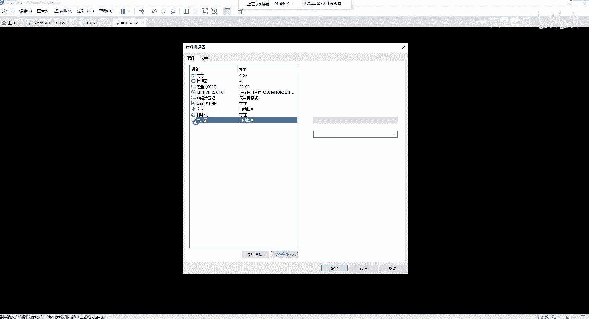

# Unix&Linux快速入门超详细教程-7天通关RHCE：P14：03-3-1 使用Vmware Workstation安装RHEL向导讲解 🖥️

在本节课中，我们将要学习如何使用 VMware Workstation 虚拟机软件来安装 Red Hat Enterprise Linux (RHEL) 操作系统。我们将详细讲解创建虚拟机的两种向导模式，并对比它们之间的区别，确保您能顺利完成实验环境的搭建。

## 软件准备与启动

首先，您需要安装 VMware Workstation 软件。安装过程通常很简单，只需按照向导点击“下一步”即可完成。

安装完成后，建议您以管理员身份运行该软件。具体操作是：在软件图标上**点击右键**，然后选择“以管理员身份运行”。这样做可以避免在后续实验过程中可能出现的权限问题。

## 创建虚拟机：典型模式

上一节我们介绍了软件的准备，本节中我们来看看如何创建第一个虚拟机。我们将从“典型”模式开始。

在 VMware Workstation 主界面，点击“文件”菜单，选择“新建虚拟机”，或者使用快捷键 `Ctrl + N` 来启动创建向导。

在向导的第一步，选择“典型（推荐）”配置，然后点击“下一步”。

接下来是选择安装来源。您会看到几个选项：
*   **安装程序光盘**：如果您的电脑有物理光驱并放入光盘，可以选择此项。
*   **安装程序光盘映像文件（ISO）**：这是最常用的方式。您需要点击“浏览”按钮，找到您下载的 RHEL 系统 ISO 文件（例如 `rhel-server-7.6-x86_64-dvd.iso`）。
*   **稍后安装操作系统**：选择此项将创建一个空硬盘的虚拟机。

对于本次安装，我们选择“稍后安装操作系统”，然后点击“下一步”。

然后，您需要选择客户机操作系统。请按照以下步骤操作：
1.  选择“Linux”。
2.  在“版本”下拉列表中，选择“Red Hat Enterprise Linux 7 64 位”。
3.  点击“下一步”。

接下来，为虚拟机命名并选择存储位置。您可以将虚拟机文件存放在一个易于管理的目录下，例如 `E:\VM\RHEL7.6-1`。虚拟机名称可以自定义，例如“RHEL7.6-1”。设置完成后，点击“下一步”。

然后是指定磁盘容量。建议分配 **20 GB**。关于虚拟磁盘的存储方式，有以下两个选项：
*   **将虚拟磁盘存储为单个文件**：性能可能稍好，但文件较大，移动不便。
*   **将虚拟磁盘拆分成多个文件**：这是默认选项。它便于在不同计算机间移动虚拟机，并且如果单个文件损坏，数据恢复的可能性更高。

我们保持默认选择“拆分成多个文件”，然后点击“下一步”。最后，点击“完成”即可创建虚拟机。

虚拟机创建后，我们还需要为其加载操作系统镜像。编辑虚拟机设置，找到“CD/DVD (SATA)”选项，选择“使用 ISO 映像文件”，并指向您的 RHEL ISO 文件。

现在，您可以启动虚拟机。启动后，您会看到 RHEL 的安装引导界面。为了获得更好的显示效果，您可以在虚拟机选项卡上点击右键，选择“设置”，在“显示器”选项中，将“拉伸模式”改为“保持纵横比拉伸”。

## 创建虚拟机：自定义（高级）模式

上一节我们使用典型模式快速创建了虚拟机，本节中我们来看看功能更丰富的“自定义（高级）”模式，它能提供更精细的控制。

再次点击“新建虚拟机”，这次选择“自定义（高级）”，然后点击“下一步”。

首先遇到的是“硬件兼容性”选择。这一步决定了您创建的虚拟机可以运行在哪些 VMware 产品上（如 ESXi 服务器）。选择最新的兼容版本（如 Workstation 15.x）通常即可，点击“下一步”。

操作系统选择与典型模式相同：选择 **Linux** -> **Red Hat Enterprise Linux 7 64 位**。

命名和位置设置也与之前类似，您可以创建一个新文件夹，例如 `E:\VM\RHEL7.6-2`。

接下来的步骤是自定义模式特有的配置项：

**处理器配置**
在此您可以指定虚拟机的 CPU 资源。关键概念是：
*   **处理器数量**：指虚拟的**物理 CPU 插槽（Socket）** 数量。
*   **每个处理器的核心数量**：指每个虚拟 CPU 的**核心数（Core）**。

总的核心数计算公式为：**`总虚拟核心数 = 处理器数量 × 每个处理器的核心数量`**。
这个总数不能超过您主机（电脑）逻辑处理器的总数。您可以在 Windows 任务管理器的“性能”选项卡中查看主机的“逻辑处理器”数量。

**内存配置**
为虚拟机分配内存。请根据您主机物理内存的大小合理分配，例如分配 **4096 MB (4 GB)**。

**网络类型**
以下是可选的网络连接类型：
*   **使用桥接网络**：虚拟机将获得与主机物理网卡同网段的 IP，如同局域网中的一台独立机器。
*   **使用网络地址转换（NAT）**：虚拟机通过主机共享 IP 上网，外部网络无法直接访问虚拟机。
*   **使用仅主机模式网络**：虚拟机只能与主机通信，无法连接外部网络。
*   **不使用网络连接**：虚拟机无网络。

对于实验环境，选择“仅主机模式网络”即可。

**I/O 控制器类型**
选择推荐的 **LSI Logic** 即可。

**虚拟磁盘类型**
选择推荐的 **SCSI** 即可。

**选择磁盘**
选择“创建新虚拟磁盘”。

**指定磁盘容量**
同样指定 **20 GB**。关于磁盘分配，有两个重要选项：
*   **立即分配所有磁盘空间**：相当于“厚置备延迟置零”或“厚置备置零”，会立即占用主机上 20GB 的物理空间。
*   **将虚拟磁盘拆分成多个文件**：与典型模式中解释相同。

为了节省主机磁盘空间，我们**不勾选**“立即分配所有磁盘空间”，并保持“拆分成多个文件”的选中状态。这相当于使用了“精简置备”模式。

后续步骤保持默认，点击“下一步”直至完成。同样地，创建完成后需要编辑设置，为“CD/DVD”加载 RHEL 的 ISO 映像文件，然后即可启动虚拟机。

## 总结

本节课中我们一起学习了在 VMware Workstation 中安装 RHEL 操作系统的两种方法。
*   **典型模式**：步骤简单快捷，适合快速搭建标准环境。
*   **自定义（高级）模式**：提供了对虚拟机硬件（如 CPU、内存、网络、磁盘类型）更详细的配置能力，适合对性能、兼容性或特定实验环境有要求的场景。

对于学习和实验，推荐使用**自定义（高级）模式**，以便更好地理解虚拟化资源的分配与管理。现在，您的虚拟机已经准备就绪，在下一节课中，我们将进入 RHEL 操作系统本身的安装过程。