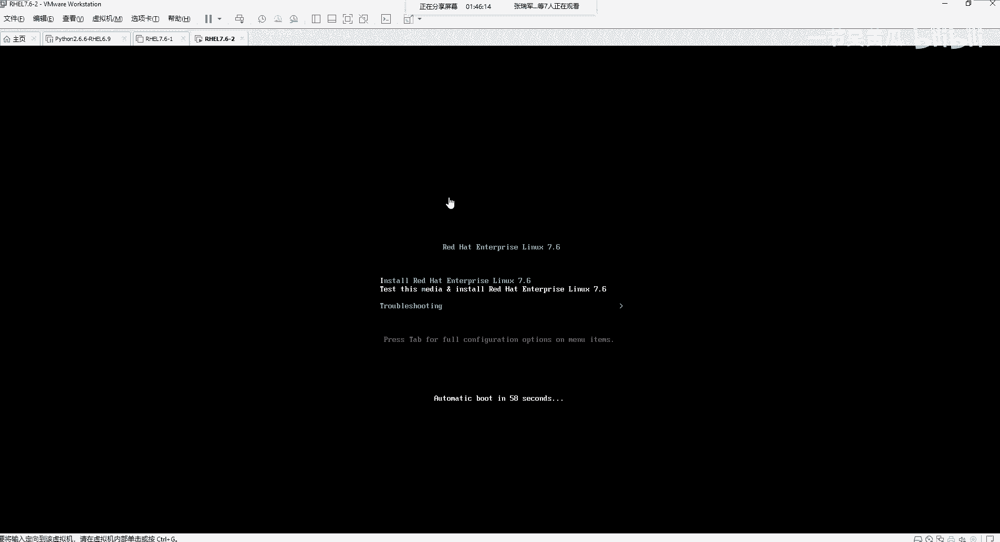
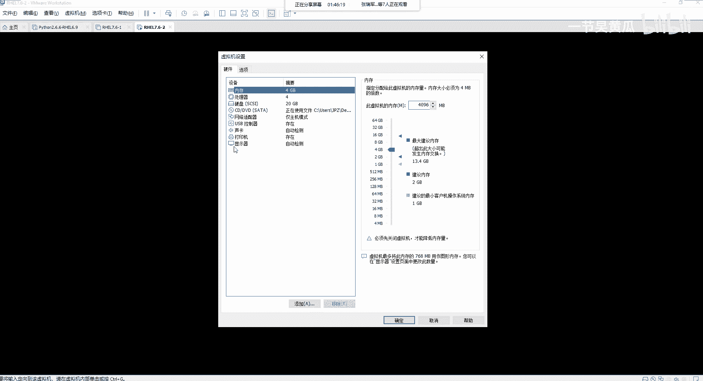
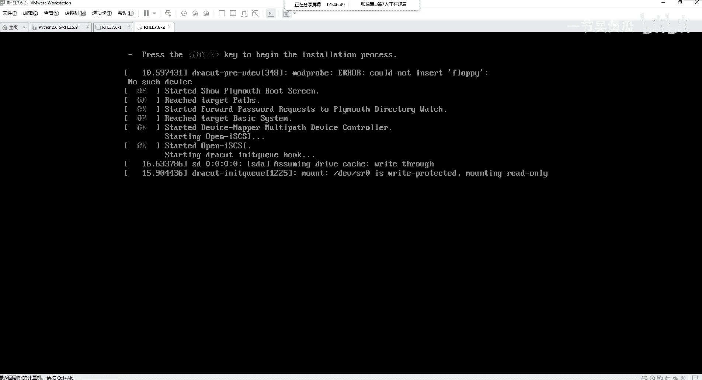
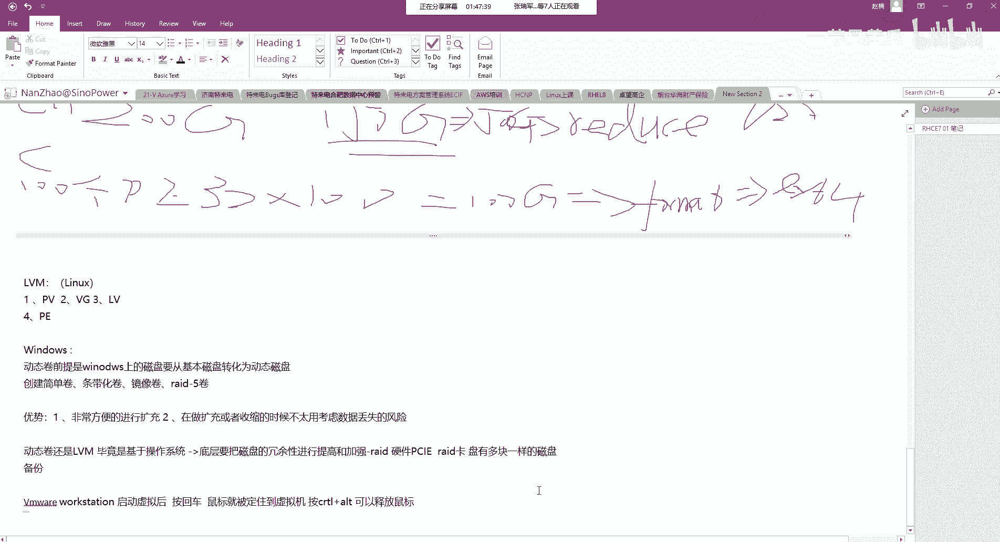
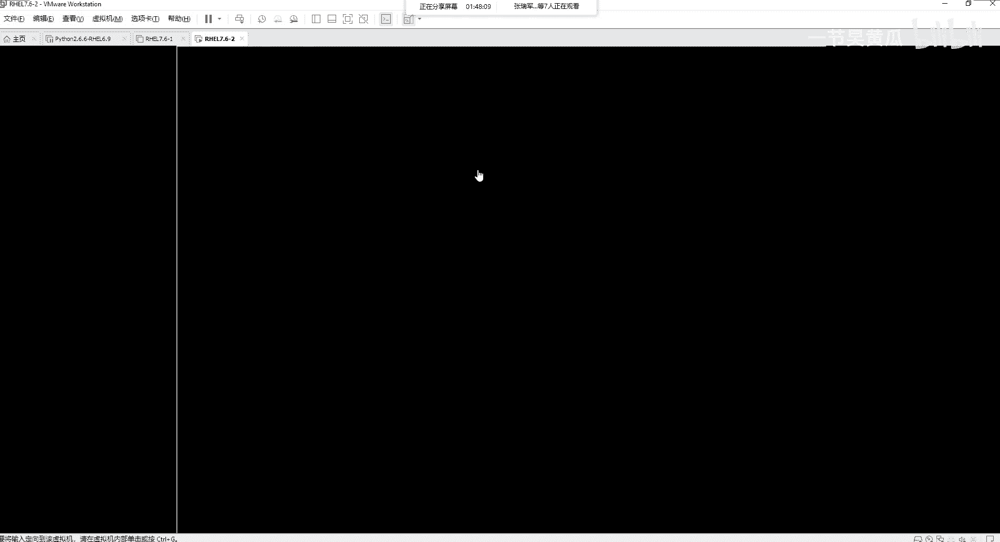
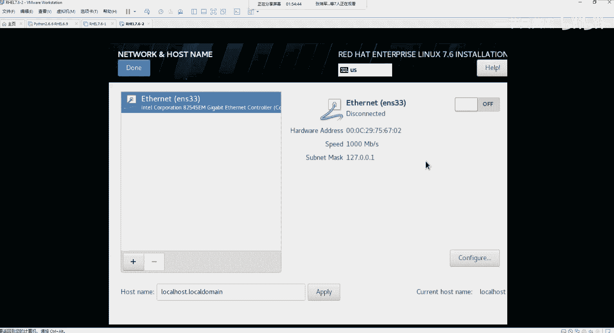

# Unix&Linux快速入门超详细教程-7天通关RHCE：P15：03-3-2 引导介质安装RHEL 🚀

在本节课中，我们将学习如何使用引导介质（如光盘或ISO镜像）来安装RHEL操作系统。我们将从启动虚拟机开始，逐步完成语言选择、时区设置、软件包选择以及最重要的磁盘分区配置。

## 启动与初始设置

上一节我们介绍了准备安装介质，本节中我们来看看启动安装程序并进行初始配置。

启动虚拟机后，屏幕会显示引导菜单。直接按回车键，系统将开始检测介质并启动安装程序。

在虚拟机环境中，启动后鼠标可能会被锁定在虚拟机窗口内。若需释放鼠标，可以同时按下键盘上的 **Ctrl** 和 **Alt** 键。

系统完成介质检测后，将进入图形化安装界面。请注意，如果虚拟机内存设置小于 **500 MB**，则无法显示图形界面。

## 语言与区域设置

以下是安装过程中的基础配置步骤。

1.  **选择语言**：建议选择 **English** 以熟悉英文环境，这有助于后续的系统管理与学习。选择后点击“Continue”。
2.  **设置时区**：在“DATE & TIME”中，选择“Region”为 **Asia**，“City”为 **Shanghai**。系统将自动使用 **UTC+8** 时区。右上角的网络时间协议（NTP）配置可暂时忽略。
3.  **键盘与语言支持**：在“KEYBOARD”和“LANGUAGE SUPPORT”中，通常保持默认的英文键盘布局。如需系统支持中文，可在语言支持中添加中文包。

## 安装源与软件选择

接下来，我们需要指定安装文件的来源以及要安装的软件包类型。

*   **安装源**：在“INSTALLATION SOURCE”中，由于我们是通过光盘或ISO文件引导，因此源自动识别为本地介质（如 `cdrom` 或 `DVD`）。也可以在此处配置网络安装源。
*   **软件选择**：这是关键步骤。在“SOFTWARE SELECTION”中，主要有两个选项：
    *   **Minimal Install**：最小化安装，仅包含系统运行的基本功能。
    *   **Server with GUI**：带图形界面的服务器安装。对于初学者，**强烈建议选择此选项**，以便使用图形界面进行操作。

重新选择软件包后，系统会花一些时间检查软件依赖关系，界面可能出现感叹号提示，请等待其完成。

## 磁盘分区配置

等待依赖检查的同时，我们可以进行最重要的步骤——磁盘分区。点击“INSTALLATION DESTINATION”进入配置界面。

1.  在磁盘选择界面，确认已选中要安装系统的虚拟磁盘（例如 `20 GiB` 的磁盘）。
2.  分区方案建议选择“**Automatic**”让安装程序自动配置，这对于新手是最简单安全的方式。
3.  若需手动分区，可选择“**Custom**”，然后点击“Done”进入详细配置页。手动分区涉及创建 `/boot`、`swap`、`/` 等分区，我们将在后续课程中详细讲解。

完成所有配置后，点击右下角的“Begin Installation”即可开始安装操作系统。安装过程中，你需要设置 `root` 管理员密码并创建一个普通用户。

## 总结

本节课中我们一起学习了通过引导介质安装RHEL系统的完整流程。我们掌握了从启动虚拟机、进行初始语言时区设置，到选择安装源和带图形界面的软件包组合，最后配置磁盘分区并开始安装的关键步骤。这是搭建Linux学习环境的第一步，请务必动手实践。