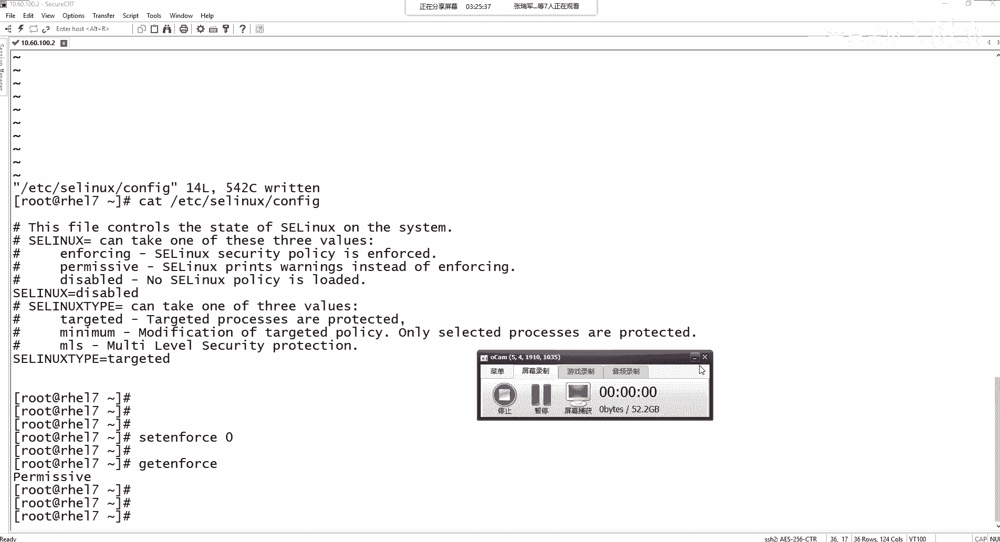
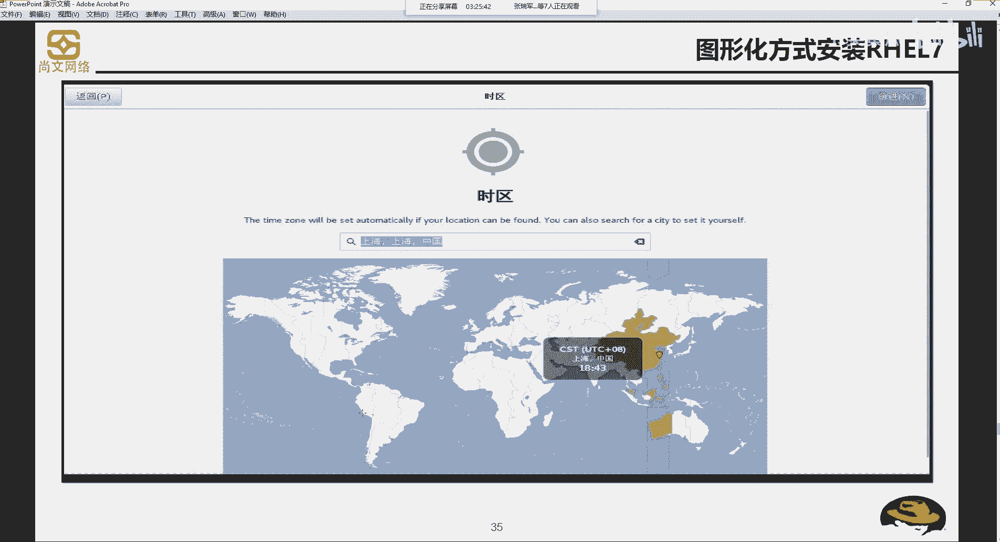
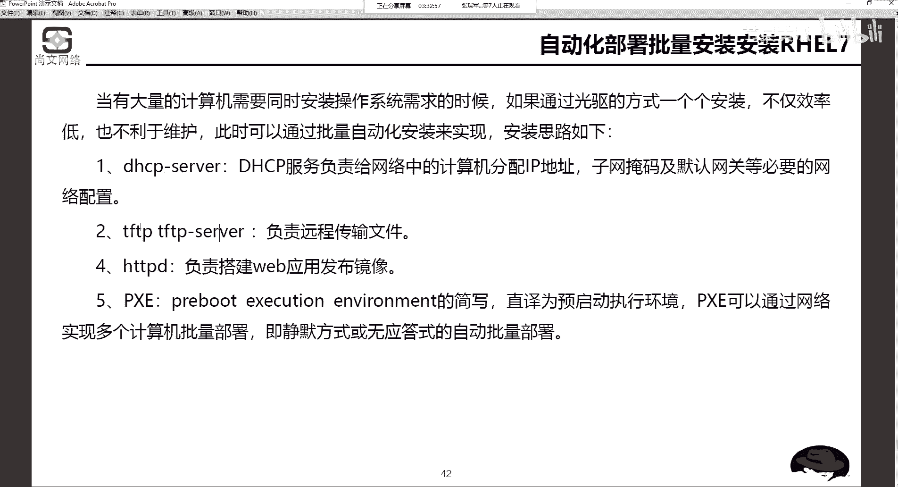
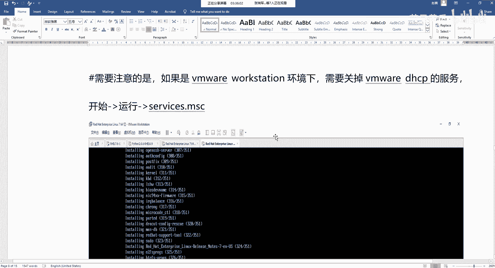
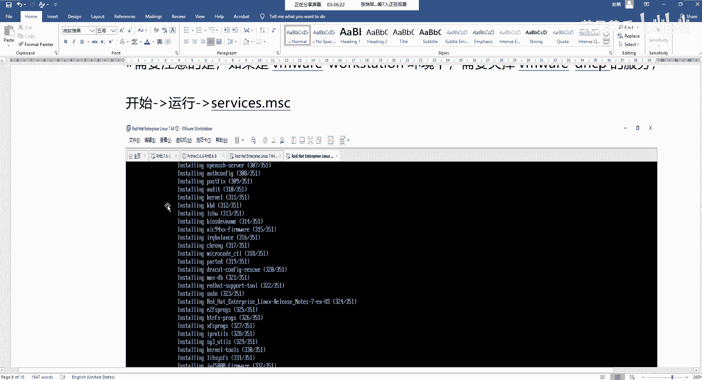
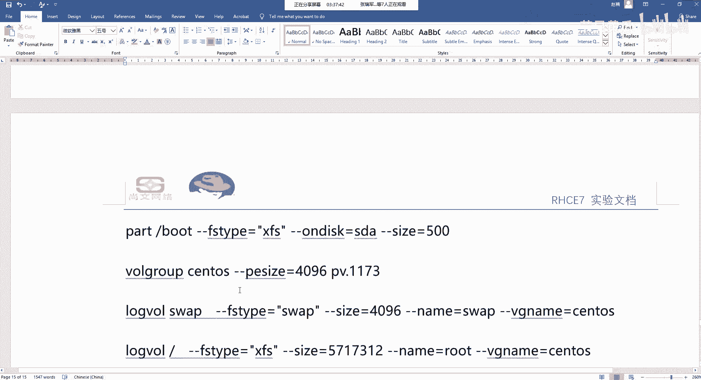
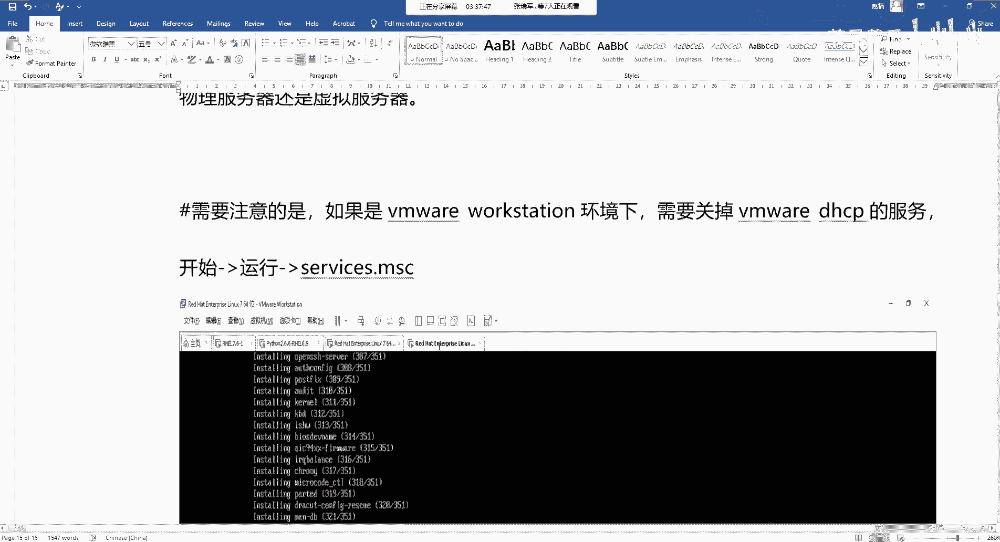
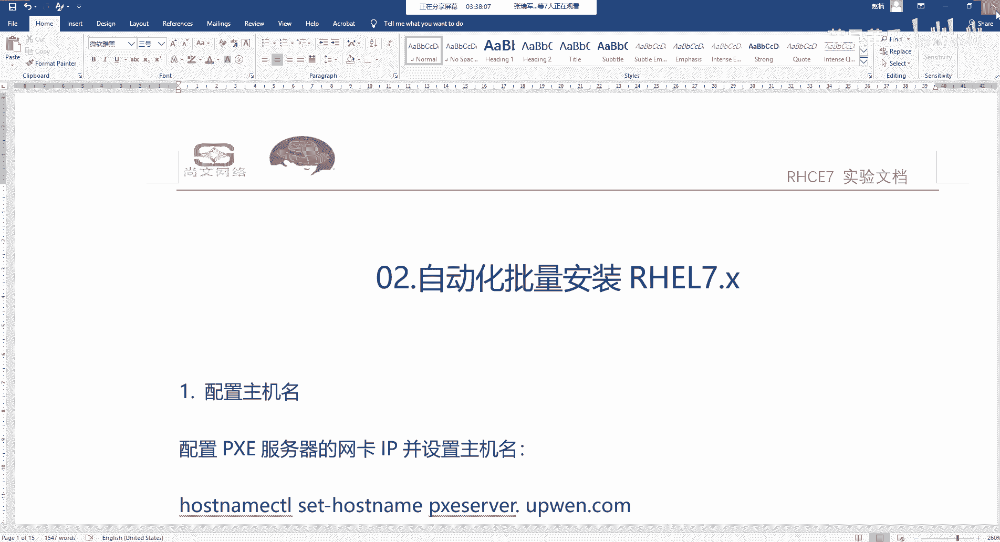

# Unix&Linux快速入门超详细教程：P18：03-5 基于自动化批量安装部署思路





## 概述

在本节课中，我们将学习如何实现红帽操作系统的自动化批量安装部署。当需要在网络环境中安装多台服务器时，手动逐台安装效率低下。本节将介绍一种基于PXE、Kickstart等技术的自动化部署思路，并梳理其核心组件与配置流程。

---

## 自动化部署的核心思路

上一节我们介绍了基于图形界面安装单台红帽操作系统的方法。本节中，我们来看看如何实现批量自动化安装。

批量部署的核心目标是避免使用物理介质（如光盘）逐台手动安装。其基本思路是：通过网络引导客户端，并自动获取安装所需的配置和文件，从而实现无人值守的静默安装。

为了实现这一目标，需要依赖以下几个关键服务协同工作：

以下是实现自动化批量安装所必需的几个核心服务：

1.  **DHCP 服务**
    *   **作用**：动态主机配置协议服务。为网络中待安装的客户端自动分配IP地址、子网掩码、网关和DNS等网络配置信息。这是客户端能够进行网络通信的第一步。
    *   **公式/代码表示**：`dhcpd` (服务进程名)

2.  **TFTP 服务**
    *   **作用**：简单文件传输协议服务。负责向客户端传输启动引导阶段所需的小型文件，例如引导加载程序（如PXE引导文件）和内核镜像。
    *   **公式/代码表示**：`tftp-server` (服务包名), `xinetd` (可能的管理守护进程)

3.  **HTTPD 服务**
    *   **作用**：Apache Web 服务。用于搭建一个Web发布平台，存放完整的操作系统安装镜像（或文件树），以便客户端在安装过程中下载所需的软件包和系统文件。
    *   **公式/代码表示**：`httpd` (服务进程名)

4.  **PXE**
    *   **作用**：预启动执行环境。这是一种让计算机通过网络接口启动的工业标准。支持PXE的客户端网卡可以在没有本地存储设备（如硬盘、光驱）的情况下，从网络服务器获取引导程序并启动。
    *   **公式/代码表示**：`pxelinux.0` (常见的PXE引导文件)

5.  **Kickstart**
    *   **作用**：无人值守安装应答文件。这是一个定义了安装过程中所有选择（如语言、时区、分区方案、软件包选择、root密码等）的配置文件。服务器将此文件提供给客户端，客户端根据文件内容自动完成安装，无需人工交互。
    *   **公式/代码表示**：`ks.cfg` (典型的Kickstart配置文件)

整个流程可以概括为：客户端通过PXE从网络启动，DHCP服务器为其分配IP地址并告知TFTP服务器位置；客户端从TFTP服务器下载引导文件并启动；启动后，根据引导配置从HTTP服务器获取Kickstart应答文件和系统安装源，最后按照Kickstart文件的定义自动完成系统安装。

> **注意**：对于初学者而言，完整配置这套环境涉及多个服务的安装与配置，具有一定复杂度。当前阶段，我们主要理解其核心思路和组件。在后续学习了服务管理、网络配置和VI编辑器等技能后，再动手实践会更容易。

---

## 安装规划要点回顾

在规划自动化安装时，同样需要考虑我们在手动安装时提到的几个关键点：


*   **引导分区 (/boot)**：在红帽7系统中，建议分配 **200MB**；更早的6版本系统，**100MB** 即可。需要特别注意的是，`/boot` 分区**不支持**LVM，必须使用标准分区。
*   **交换分区 (swap)**：交换分区既可以使用标准分区，也可以创建在LVM逻辑卷中。
*   **软件包选择**：在Kickstart文件中，可以指定安装的软件包组。对于初学者，选择 **“最小安装”** 或 **“带GUI的服务器”** 是合适的起点。



---

## 自动化部署配置流程概览

理解了核心组件后，我们来看看配置自动化部署环境的一般步骤。以下流程概述了从准备到最终安装的各个环节。

以下是配置PXE+Kickstart自动化安装环境的主要步骤概览：

1.  **基础环境配置**
    *   配置服务器的主机名，通常需要设置为**完全合格域名**。
    *   如果网络中没有DNS服务器，需要在本地 `/etc/hosts` 文件中添加主机名解析记录。
    *   关闭防火墙或配置相应规则，确保网络服务可访问。

2.  **搭建软件安装源**
    *   使用 `yum` 配置本地或网络安装源，以便安装后续所需的各类服务软件包。

3.  **安装必要软件包**
    *   安装PXE引导、DHCP、TFTP、HTTPD以及Kickstart文件生成工具等套件。例如：`dhcp-server`, `tftp-server`, `httpd`, `syslinux`, `pyeloader`。


4.  **配置各项服务**
    *   **配置DHCP服务**：编辑 `/etc/dhcp/dhcpd.conf`，指定地址池、TFTP服务器地址和引导文件名。
    *   **配置TFTP服务**：将PXE引导文件（如 `pxelinux.0`）和菜单配置文件复制到TFTP根目录（如 `/var/lib/tftpboot`）。
    *   **配置HTTP服务**：将操作系统ISO镜像的内容解压或挂载到HTTP服务器的文档根目录（如 `/var/www/html/rhel7`）下。


5.  **创建与配置Kickstart文件**
    *   可以使用 `system-config-kickstart` 工具生成，或手动编写 `ks.cfg` 文件。
    *   该文件定义了分区方案、软件包列表、用户密码、时区等所有安装选项。
    *   将最终的 `ks.cfg` 文件放置在HTTP服务器上，使其可通过网络访问。




6.  **启动服务并测试**
    *   使用 `systemctl` 命令启动并启用 `dhcpd`, `tftp`, `httpd` 等服务。
    *   创建新的虚拟机，将其设置为从网络（PXE）启动。
    *   如果一切配置正确，客户端将自动从网络引导，下载Kickstart文件，并开始无人值守安装。安装界面将自动进行，最终呈现登录界面。


---



## Kickstart文件示例


Kickstart文件是自动化安装的灵魂。以下是两个关键部分的示例：

**1. 磁盘分区部分示例（支持LVM）：**
```bash
# 使用LVM分区方案
clearpart --all --initlabel
part /boot --fstype="xfs" --size=200
part pv.01 --size=8192 --grow
volgroup vg_root pv.01
logvol / --fstype="xfs" --name=lv_root --vgname=vg_root --size=2048
logvol swap --fstype="swap" --name=lv_swap --vgname=vg_root --size=1024
logvol /home --fstype="xfs" --name=lv_home --vgname=vg_root --size=1024 --grow
```

**2. 软件包选择部分示例：**
```bash
%packages
@^minimal
@core
kexec-tools
%end
```
其中 `@^minimal` 表示最小化安装，`@core` 表示安装核心包组。



---

## 总结





本节课中，我们一起学习了红帽操作系统自动化批量安装部署的核心思路。我们了解到，通过结合 **DHCP**、**TFTP**、**HTTPD**、**PXE** 和 **Kickstart** 这五大组件，可以构建一个高效的网络安装环境，实现操作系统的无人值守批量部署。虽然当前详细配置对初学者有一定挑战，但理解这个框架为后续深入学习服务配置和系统管理打下了坚实基础。在课程后期，我们将具备足够的知识来亲手搭建这套自动化安装系统。