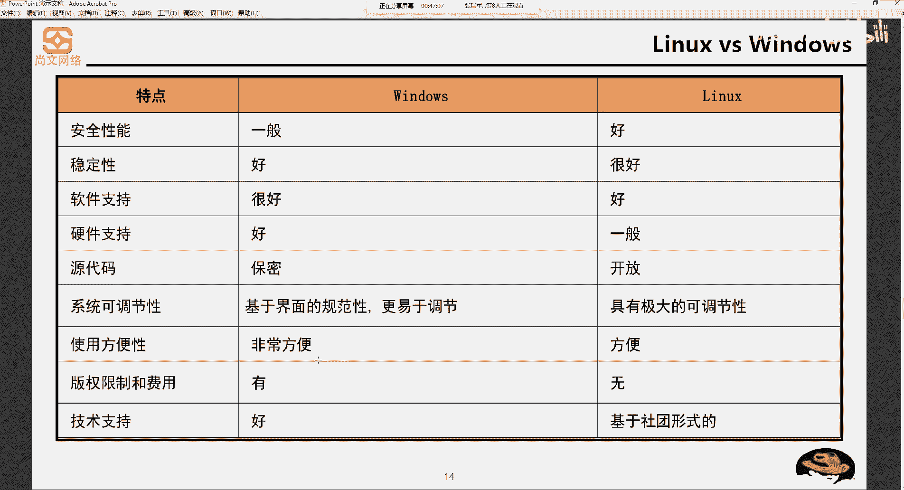
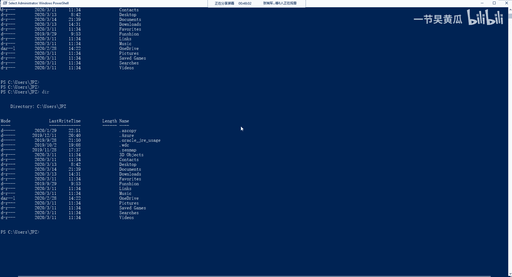
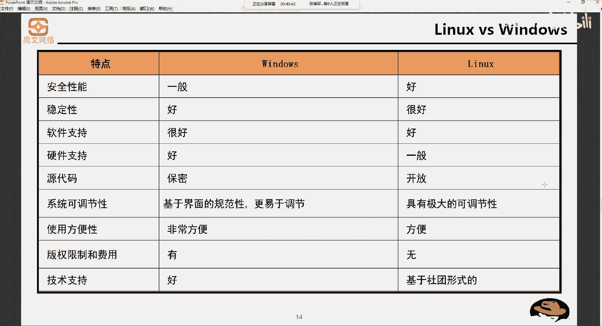

# Unix&Linux快速入门超详细教程：P2：02-1-1 Linux系统定义和特点 🐧

## 概述
在本节课中，我们将要学习Linux操作系统的定义、核心特点，并将其与Windows操作系统进行对比，以帮助初学者建立对Linux的基本认识。

---

## Linux系统定义
我们之前介绍了Unix操作系统。Linux操作系统是Unix操作系统的一个前身。那么，什么是Linux操作系统？

简单的来说，Linux操作系统是一套免费使用和自由传播的、类似于Unix的操作系统。它主要基于x86或x64系列CPU架构的计算机。当然，它也可以在Power CPU架构的服务器上使用。其设计初衷是建立一个不受任何商品化软件版权制约、全世界都能使用的操作系统。其中，“免费使用和自由传播”以及“类Unix”是其关键特征。

---

## Linux系统的特点
上一节我们介绍了Linux的定义，本节中我们来看看它的核心特点。

Linux系统的特点是开源，即 **`open source`**。开源意味着系统的源代码被提供给所有人使用。

以下是Linux系统的具体特点：
*   **自由分发系统和源代码**：你可以在源代码的基础上创建个性化或自己的衍生系统。
*   **遵循GPL原则**：如果你创建了自定义的衍生系统，需要将其提交给相应的开源组织共享。

Linux操作系统的诞生、发展和成长始终依赖着五个重要支柱：
1.  Linux继承自Unix。
2.  GNU计划（GNU‘s Not Unix）。
3.  遵循POSIX（可移植操作系统接口）标准。
4.  基于Internet网络进行协作开发。

---

## Linux与Windows对比
了解了Linux的定义和特点后，我们将其与大家更熟悉的Windows操作系统进行对比，以便更直观地理解。

我们从安全性能、稳定性、软件支持、硬件支持、源代码、可调节性、方便性、版权限制和技术支持这几个维度来看。

**Windows操作系统特点如下：**
*   **安全性能**：一般，经常出现漏洞，需要打安全补丁。
*   **稳定性**：相对较好，但应用程序与驱动冲突可能导致蓝屏。
*   **软件支持**：非常好，绝大多数软件都支持Windows。
*   **硬件支持**：非常好，依赖厂商提供的驱动。
*   **源代码**：保密。虽然微软推出了跨平台的 **`.NET Core`**，但其在Linux上的稳定性仍是问号。
*   **系统可调节性**：基于图形界面的勾选和点击进行调节。
*   **使用方便性**：非常方便，图形化操作。Windows也有命令行工具 **`PowerShell`**，集成了部分Linux风格命令（如 `dir`, `copy`）。
*   **版权限制**：需要收费。
*   **技术支持**：由微软团队提供。

**Linux操作系统特点如下：**
*   **安全性能**：比Windows更好，这是许多关键应用场景选择Linux的原因。
*   **稳定性**：比Windows更好，极少出现类似蓝屏的系统崩溃。
*   **软件支持**：比Windows稍逊一筹。部分硬件厂商为节约成本预装Ubuntu等Linux系统，但其硬件支持可能较差。
*   **源代码**：开放，符合其开源初衷。
*   **系统可调节性**：具有较大的可调节性。
*   **使用方便性**：方便，但没有Windows那么直观易用。
*   **版权限制**：没有。虽然部分Linux发行版已商业化，但核心仍是开源的。
*   **技术支持**：基于社区形式，由志愿者和开发者团体免费维护。

---

## 总结
本节课中我们一起学习了Linux操作系统的定义、其开源免费的核心特点，以及它与Windows系统在多个维度的详细对比。理解这些基础概念是后续深入学习Linux的基石。