# Unix&Linux快速入门超详细教程：P3：02-1-2 Linux系统发行版本介绍 🐧

在本节课中，我们将要学习Linux系统众多的发行版本，了解它们各自的定位和适用场景，并明确学习Linux时应重点关注的核心版本。

## 概述：为何存在众多发行版？

上一节我们介绍了Linux的开源特性。正是由于其源代码自由分发并遵循GPL协议，任何人都可以基于Linux内核创建自己的衍生系统，这直接导致了Linux发行版本众多且看似杂乱的现象。这与Windows等商业操作系统版本规划清晰的情况有所不同。

## 核心发行版介绍

面对众多发行版，初学者需要抓住业界的权威代表。以下是几个核心的Linux发行版本及其定位。

### 企业级服务器的权威：Red Hat与CentOS

*   **Red Hat（红帽）**：这是Linux在企业级应用中的权威代表。Red Hat Enterprise Linux（RHEL）提供商业支持和服务，需要付费订阅。
*   **CentOS**：可以理解为Red Hat的社区免费版。它基于RHEL的源代码重新编译而成，与RHEL在功能和使用上几乎完全一致，但不提供商业支持。两者关系紧密，学会其中一个，就等于掌握了另一个。

### 管理与特定场景的选择：openSUSE

*   **openSUSE/SUSE Linux**：这是另一个重要的企业级发行版，但其系统机制与Red Hat系列有所不同。
*   它常见于一些特定的管理场景，例如：
    *   高端服务器（如IBM小型机）的硬件管理控制台（HMC）。
    *   虚拟化平台VMware vSphere的管理中心vCenter Server Appliance（VCSA）。

### 开发与个人桌面的首选：Ubuntu

*   **Ubuntu**：这是目前最流行的个人桌面和开发环境Linux发行版。
*   许多开发者的笔记本电脑会预装Ubuntu，因为其上可以方便地运行各种开发工具（如JDK、Eclipse等）。对于软件开发和学习，Ubuntu是一个极佳的选择。

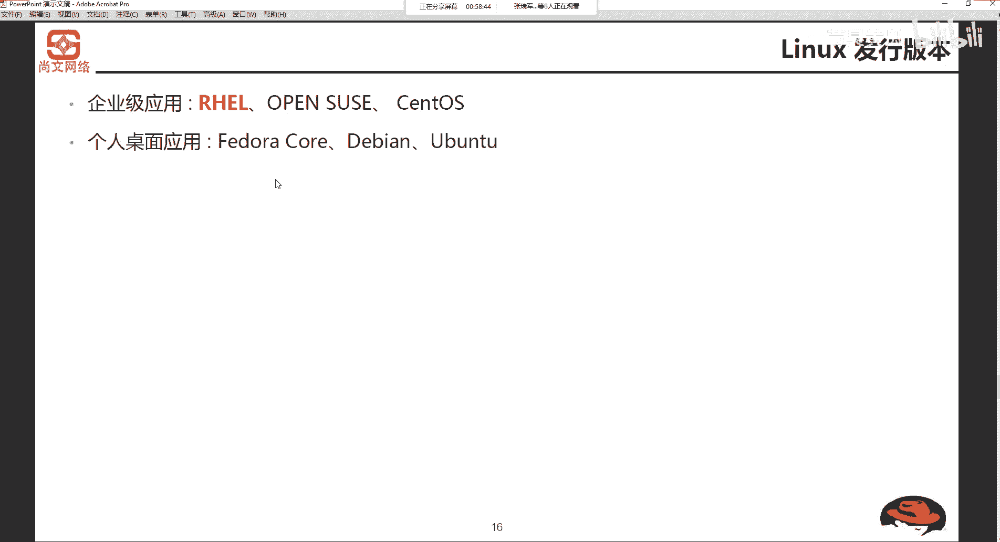

### 其他发行版

除了以上核心版本，业界还存在其他发行版，例如Debian、Fedora，以及国内曾出现的中科红旗等，初学者可先做了解。

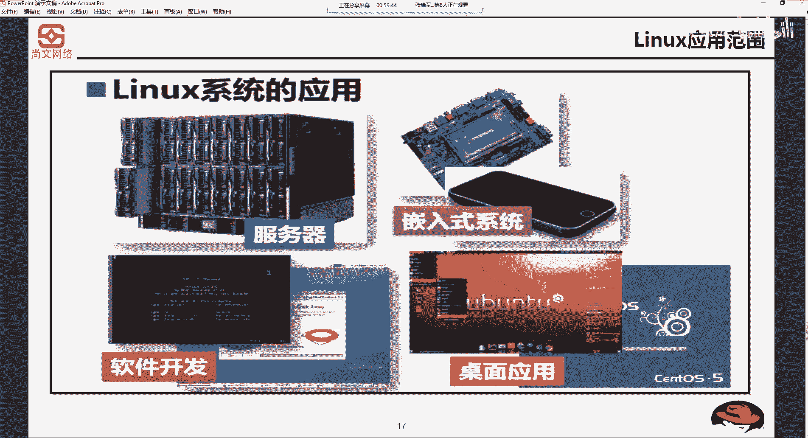

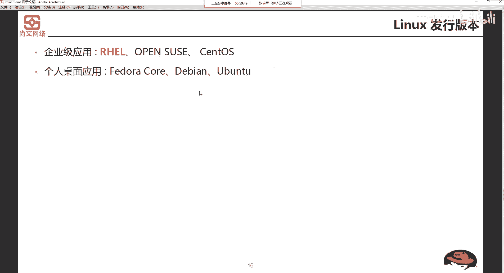

## 发行版应用范围总结

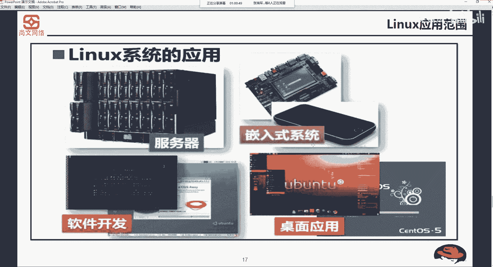

了解发行版后，我们来看看Linux系统的主要应用领域。

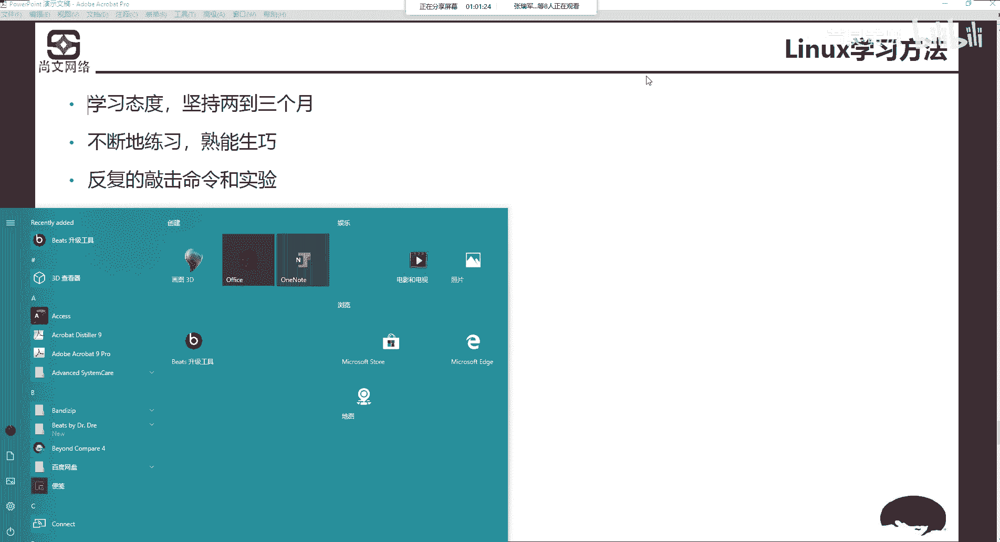

以下是Linux系统的主要应用范围：
1.  **服务器领域**：这是Linux的传统优势领域。企业级应用（如Web服务器、文件服务器、数据库服务器）大多部署在Red Hat或CentOS上。
2.  **嵌入式系统**：例如我们使用的安卓（Android）手机，其底层就是Linux系统。
3.  **软件开发/桌面应用**：开发者常用Ubuntu等发行版作为编程和日常使用的操作系统。

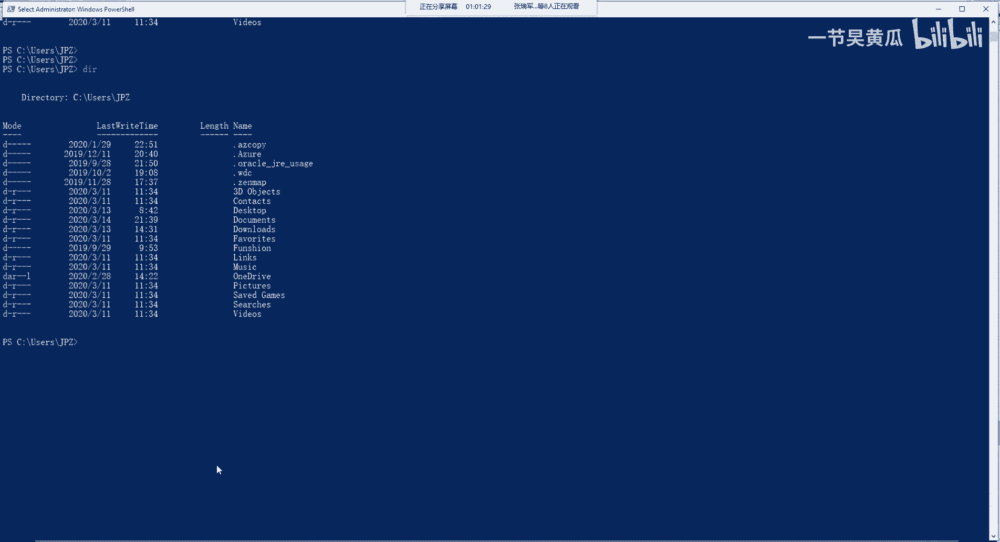

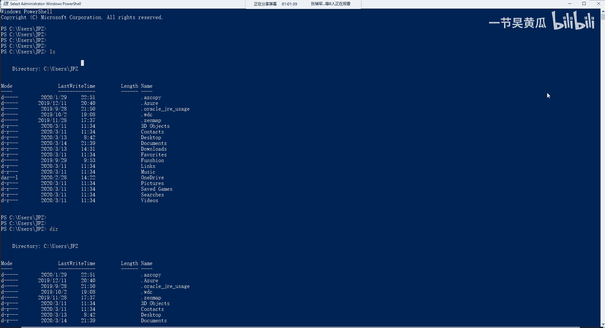

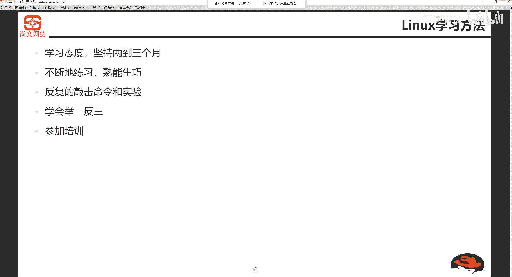

## 如何学习Linux？

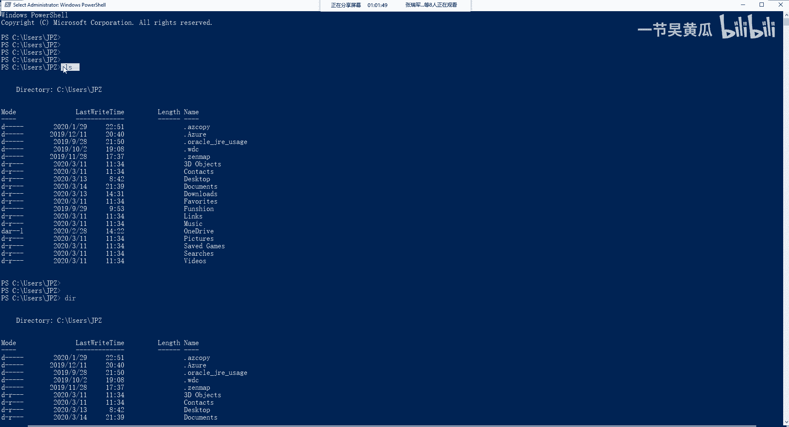

踏上Linux学习之路，需要调整心态和方法。

学习Linux需要做到以下几点：
*   **转变操作习惯**：摒弃Windows的图形化点击操作，转而学习和熟练使用命令行（Terminal）指令。
*   **坚持与练习**：命令的学习相对枯燥，需要反复敲击和实验，直至形成肌肉记忆。
*   **学会举一反三**：掌握一个命令（如创建文件）后，应主动探索相关命令（如创建目录、删除文件）。
*   **参加系统培训**：通过专业的课程（如本系列教程）可以建立正确的知识体系，少走弯路。

## 课程回顾与总结

本节课中我们一起学习了Linux发行版本的核心知识。

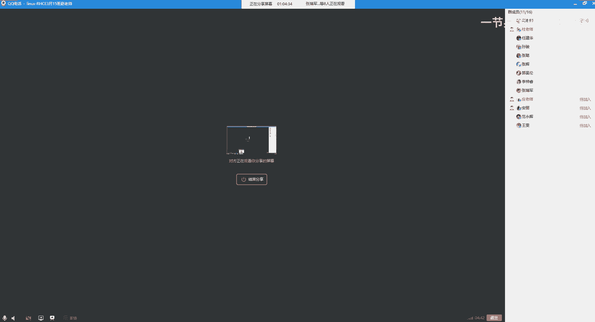

我们来做一个简短的回顾：
1.  **发行版众多的原因**：Linux的开源和GPL协议允许自由衍生，催生了大量发行版。
2.  **核心发行版**：
    *   企业级首选：**Red Hat（RHEL）** 及其免费克隆版 **CentOS**。
    *   管理/特定场景：**openSUSE**。
    *   开发与桌面：**Ubuntu**。
3.  **主要应用范围**：服务器、嵌入式设备（如安卓）、软件开发与个人桌面。
4.  **学习方法**：拥抱命令行、坚持练习、举一反三并接受系统指导。

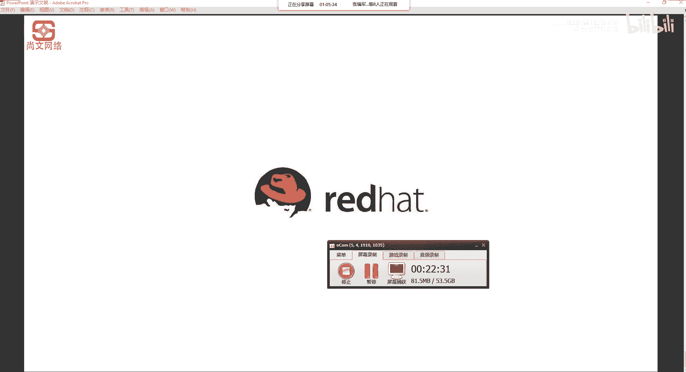

记住Linux的创始人Linus Torvalds和那只可爱的企鹅Tux，它们共同构成了Linux世界的标志。掌握好核心的Red Hat/CentOS体系，你就已经打开了企业级Linux运维和开发的大门。